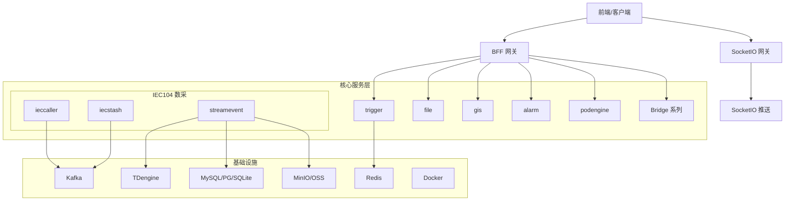
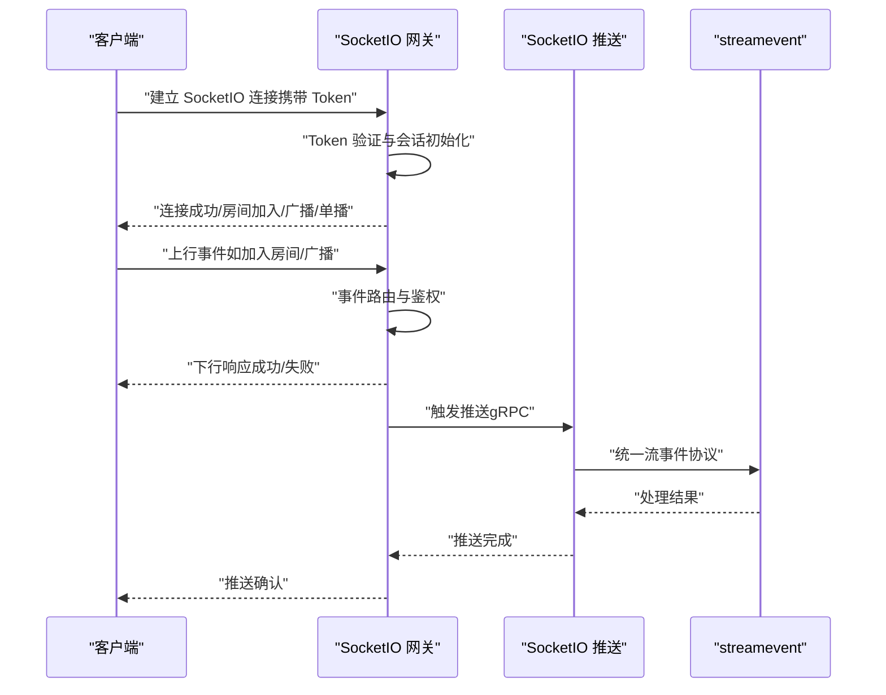
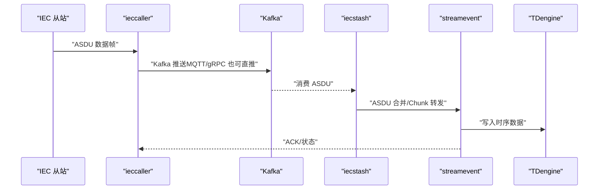
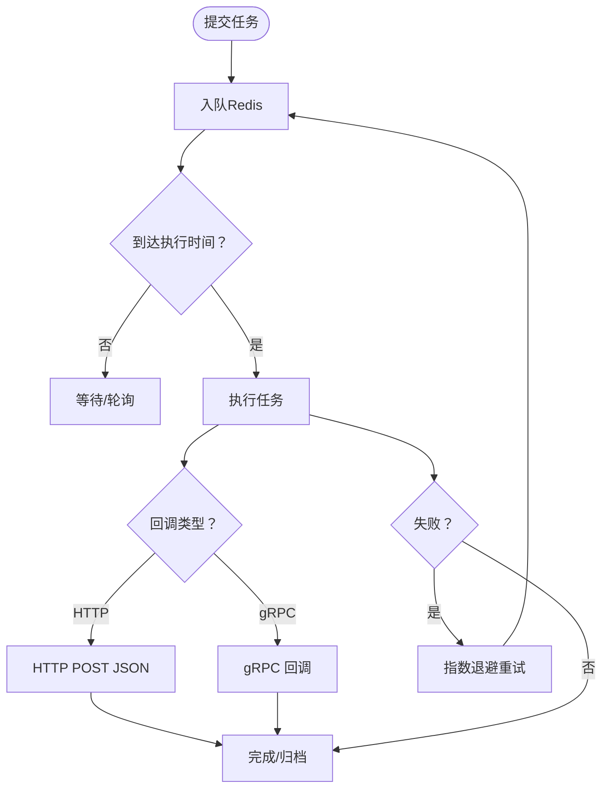
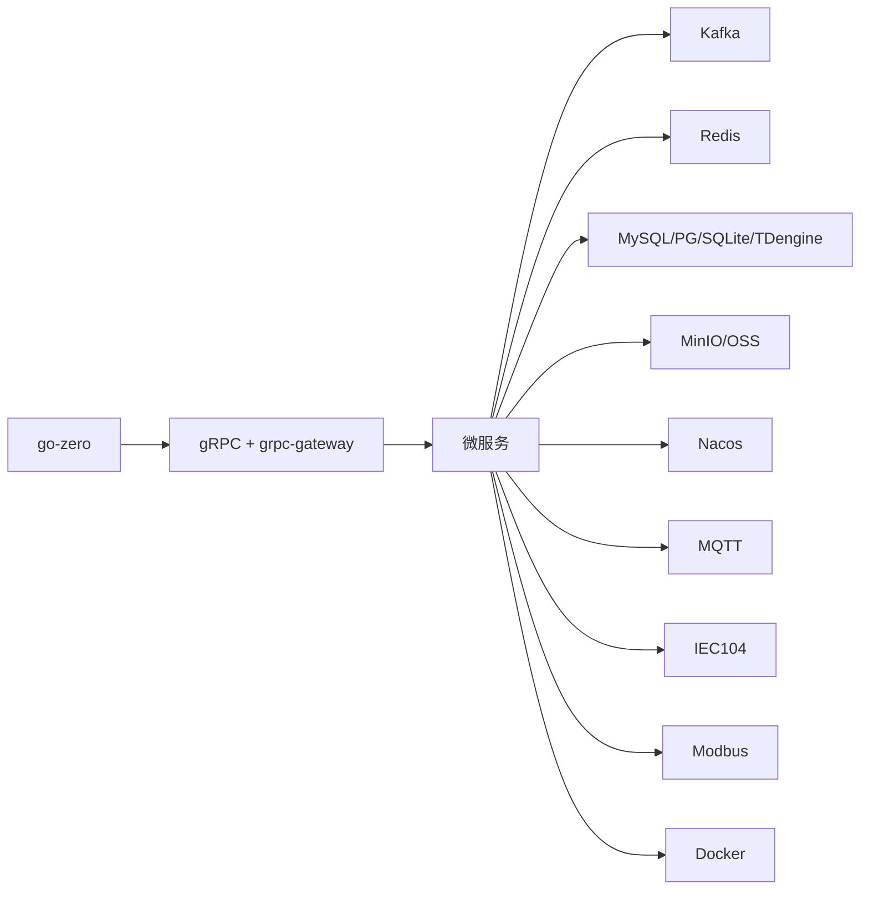

# 架构设计

<cite>
**本文引用的文件**
- [README.md](file://README.md)
- [go.mod](file://go.mod)
- [docker-compose.yml](file://deploy/docker-compose.yml)
- [ieccaller 配置 config.go](file://app/ieccaller/internal/config/config.go)
- [trigger 配置 config.go](file://app/trigger/internal/config/config.go)
- [streamevent 配置 config.go](file://facade/streamevent/internal/config/config.go)
- [SocketIO 服务器 server.go](file://common/socketiox/server.go)
- [IEC104 客户端管理 clientmanager.go](file://common/iec104/client/clientmanager.go)
- [MQTT 客户端 mqttx.go](file://common/mqttx/mqttx.go)
- [数据库适配器 dbx.go](file://common/dbx/dbx.go)
- [RPC 模式参考 rpc-patterns.md](file://.trae/skills/zero-skills/references/rpc-patterns.md)
</cite>

## 目录
1. [简介](#简介)
2. [项目结构](#项目结构)
3. [核心组件](#核心组件)
4. [架构总览](#架构总览)
5. [详细组件分析](#详细组件分析)
6. [依赖分析](#依赖分析)
7. [性能考量](#性能考量)
8. [故障排查指南](#故障排查指南)
9. [结论](#结论)
10. [附录](#附录)

## 简介
本项目基于 go-zero 微服务框架，面向物联网数采、异步任务调度与实时通信场景，提供多协议接入与高性能数据处理能力。系统采用分层架构设计，包含接入层（BFF 网关与 SocketIO 实时通信）、核心服务层（多个微服务）、对外接口层（统一 gRPC 接口）与基础设施层（Kafka、Redis、数据库、Docker）。其中 IEC 104 数采平台采用三层协作架构（ieccaller、iecstash、streamevent），Trigger 服务提供基于 asynq 的异步任务调度与自研计划任务引擎。

## 项目结构
项目采用“按功能域划分”的微服务组织方式，核心目录如下：
- app/：核心微服务集合（如 ieccaller、iecstash、trigger、file、gis、alarm、podengine、bridgemodbus、bridgemqtt、bridgegtw、bridgedump、lalhook、lalproxy、logdump、xfusionmock 等）
- socketapp/：实时通信模块（socketgtw、socketpush）
- gtw/：BFF 网关（HTTP + grpc-gateway 聚合入口）
- facade/：对外接口层（streamevent，统一跨语言 gRPC）
- common/：公共组件库（IEC104、SocketIO、asynq、Nacos、Modbus、MQTT、OSS、DB、GIS、Docker、图像、工具等）
- model/：数据库模型与 SQL 脚本
- deploy/：Docker Compose 编排
- docs/swagger/third_party/util：文档、Swagger 文档、第三方 proto 定义与工具集

```mermaid
graph TB
subgraph "接入层"
Gtw["BFF 网关 gtw"]
SockGtw["SocketIO 网关 socketgtw"]
SockPush["SocketIO 推送 socketpush"]
end
subgraph "核心服务层"
IecCaller["ieccaller<br/>IEC104 主站"]
IecStash["iecstash<br/>Kafka 消费/ASDU 合并"]
Streamevent["streamevent<br/>统一流事件协议"]
Trigger["trigger<br/>异步任务调度"]
File["file<br/>文件服务"]
Gis["gis<br/>地理信息"]
Alarm["alarm<br/>告警服务"]
PodEngine["podengine<br/>容器管理"]
BridgeModbus["bridgemodbus<br/>Modbus 桥接"]
BridgeMqtt["bridgemqtt<br/>MQTT 桥接"]
BridgeGtw["bridgegtw<br/>HTTP 代理网关"]
BridgeDump["bridgedump<br/>南瑞文件生成"]
LalHook["lalhook<br/>流媒体回调"]
LalProxy["lalproxy<br/>流媒体代理"]
LogDump["logdump<br/>日志导出"]
XfusionMock["xfusionmock<br/>融合模拟"]
end
subgraph "对外接口层"
Facade["facade/streamevent<br/>统一 gRPC 接口"]
end
subgraph "基础设施层"
Kafka["Kafka"]
Redis["Redis"]
TDengine["TDengine"]
MySQL["MySQL/PostgreSQL/SQLite"]
MinIO["MinIO/OSS"]
Docker["Docker"]
end
Gtw --> Trigger
Gtw --> File
Gtw --> Gis
Gtw --> Alarm
Gtw --> PodEngine
Gtw --> BridgeModbus
Gtw --> BridgeMqtt
Gtw --> BridgeGtw
Gtw --> BridgeDump
Gtw --> LalHook
Gtw --> LalProxy
Gtw --> LogDump
Gtw --> XfusionMock
SockGtw --> SockPush
IecCaller --> Kafka
IecStash --> Kafka
Streamevent --> TDengine
Streamevent --> MySQL
Streamevent --> MinIO
Trigger --> Redis
Trigger --> Facade
BridgeModbus --> Facade
BridgeMqtt --> Facade
BridgeGtw --> Facade
BridgeDump --> Kafka
```

图表来源
- [README.md:15-51](file://README.md#L15-L51)
- [README.md:109-188](file://README.md#L109-L188)
- [docker-compose.yml:1-110](file://deploy/docker-compose.yml#L1-L110)

章节来源
- [README.md:15-51](file://README.md#L15-L51)
- [README.md:109-188](file://README.md#L109-L188)
- [docker-compose.yml:1-110](file://deploy/docker-compose.yml#L1-L110)

## 核心组件
- BFF 网关（gtw）：统一 API 入口，聚合 gRPC 服务并通过 grpc-gateway 提供 HTTP 访问；支持 JWT 认证、微信支付回调、短信验证码、CORS、文件上传/下载等。
- SocketIO 实时通信：socketgtw 负责连接管理、房间管理、消息路由与 Token 鉴权；socketpush 提供 Token 生成/验证与 gRPC 推送接口。
- IEC 104 数采平台：ieccaller（主站）、iecstash（Kafka 消费/ASDU 合并）、streamevent（统一流事件协议，落库至 TDengine/MySQL/MinIO）。
- Trigger 异步任务调度：基于 asynq 的分布式任务队列（Redis 存储），支持定时/延时任务、HTTP/gRPC 回调、自动重试与生命周期管理；自研计划任务引擎（Plan/Batch/ExecItem 三级模型）。
- 其他服务：file（分片流上传/OSS）、gis（H3/GeoHash/围栏/坐标转换）、alarm（多级告警）、podengine（Docker 容器生命周期）、bridgemodbus/bridgemqtt/bridgegtw/bridgedump/lalhook/lalproxy/logdump/xfusionmock 等。

章节来源
- [README.md:189-206](file://README.md#L189-L206)
- [README.md:112-131](file://README.md#L112-L131)
- [README.md:133-154](file://README.md#L133-L154)

## 架构总览
系统采用分层架构与微服务网格：
- 接入层：BFF 网关与 SocketIO 实时通信，负责统一入口与实时推送。
- 核心服务层：各微服务按职责拆分，通过 gRPC 与 grpc-gateway 交互。
- 对外接口层：facade/streamevent 提供统一跨语言 gRPC 接口，屏蔽内部服务差异。
- 基础设施层：Kafka（消息队列）、Redis（任务队列/缓存）、数据库（MySQL/PostgreSQL/SQLite/TDengine）、对象存储（MinIO/OSS）、Docker（容器编排）。

图表来源
- [README.md:15-51](file://README.md#L15-L51)
- [docker-compose.yml:1-110](file://deploy/docker-compose.yml#L1-L110)

## 详细组件分析

### 接入层：BFF 网关与 SocketIO 实时通信
- BFF 网关（gtw）：聚合后端 gRPC 服务，提供 HTTP 访问；支持 JWT、微信支付回调、短信验证码、CORS、文件上传/下载。
- SocketIO 实时通信：socketgtw 负责连接建立、鉴权、房间管理、消息路由；socketpush 提供 Token 生成/验证与 gRPC 推送接口；支持 MQTT 桥接、统计信息推送与房间加载错误检测。

图表来源
- [README.md:156-173](file://README.md#L156-L173)
- [common/socketiox/server.go:314-335](file://common/socketiox/server.go#L314-L335)
- [common/socketiox/server.go:337-676](file://common/socketiox/server.go#L337-L676)

章节来源
- [README.md:156-173](file://README.md#L156-L173)
- [common/socketiox/server.go:1-814](file://common/socketiox/server.go#L1-L814)

### 核心服务层：IEC 104 数采平台
- ieccaller：IEC 104 主站，支持多从站并行通信、Kafka/MQTT/gRPC 三协议推送、内嵌 SQLite 动态配置、弱校验模式；配置包含部署模式、命令周期、广播组、推送开关、Kafka/MQTT 参数、流事件客户端等。
- iecstash：Kafka 消费、ASDU 压缩合并、Chunk 批量处理、下游 RPC 转发。
- streamevent：统一跨语言流事件协议，接收 MQTT/WebSocket/Kafka 消息，处理 IEC 104 PushChunkAsdu，管理点位配置，落库至 TDengine/MySQL/MinIO。

图表来源
- [README.md:112-131](file://README.md#L112-L131)
- [app/ieccaller/internal/config/config.go:18-58](file://app/ieccaller/internal/config/config.go#L18-L58)
- [facade/streamevent/internal/config/config.go:5-24](file://facade/streamevent/internal/config/config.go#L5-L24)

章节来源
- [README.md:112-131](file://README.md#L112-L131)
- [app/ieccaller/internal/config/config.go:1-59](file://app/ieccaller/internal/config/config.go#L1-L59)
- [facade/streamevent/internal/config/config.go:1-25](file://facade/streamevent/internal/config/config.go#L1-L25)

### 核心服务层：Trigger 异步任务调度
- 异步任务调度：基于 asynq（Redis 存储），支持定时/延时任务、HTTP POST JSON 与 gRPC 两种回调、自动重试、归档/删除生命周期管理、任务历史统计与仪表板。
- 计划任务管理：自研引擎，Plan -> Batch -> ExecItem 三级模型，状态机（WAITING/RUNNING/COMPLETED/FAILED/DELAYED/ONGOING/TERMINATED），分布式锁防重、执行日志追踪、批次/计划自动状态聚合。

图表来源
- [README.md:133-154](file://README.md#L133-L154)
- [app/trigger/internal/config/config.go:9-27](file://app/trigger/internal/config/config.go#L9-L27)
- [common/asynqx/asynqClient.go:17-31](file://common/asynqx/asynqClient.go#L17-L31)

章节来源
- [README.md:133-154](file://README.md#L133-L154)
- [app/trigger/internal/config/config.go:1-28](file://app/trigger/internal/config/config.go#L1-L28)
- [common/asynqx/asynqClient.go:1-31](file://common/asynqx/asynqClient.go#L1-L31)

### 对外接口层：统一 gRPC 接口（facade/streamevent）
- 提供跨语言流事件协议，支持 MQTT/WebSocket/Kafka 消息接收、IEC 104 PushChunkAsdu、Socket 上行消息处理、计划任务事件处理与通知。
- 配置包含 Nacos 注册、禁用 SQL 日志、TDengine 数据源与库名、通用数据库数据源。

章节来源
- [README.md:197-206](file://README.md#L197-L206)
- [facade/streamevent/internal/config/config.go:1-25](file://facade/streamevent/internal/config/config.go#L1-L25)

### 基础设施层：Kafka、Redis、数据库、Docker
- Kafka：消息队列，ieccaller 与 bridgedump 等服务通过 Kafka 实现异步解耦与数据汇聚。
- Redis：asynq 任务队列存储，Trigger 服务依赖 Redis 实现分布式任务调度。
- 数据库：MySQL/PostgreSQL/SQLite（go-zero sqlx/goqu），TDengine（时序数据），MinIO/OSS（对象存储）。
- Docker：容器编排，提供 ieccaller、bridgegtw、bridgedump、kafka、filebeat 等服务的容器化部署。

章节来源
- [docker-compose.yml:1-110](file://deploy/docker-compose.yml#L1-L110)
- [common/dbx/dbx.go:31-64](file://common/dbx/dbx.go#L31-L64)
- [go.mod:1-245](file://go.mod#L1-L245)

## 依赖分析
- 技术栈与依赖：go-zero 作为微服务框架，gRPC + grpc-gateway + Protocol Buffers 作为 RPC 与 HTTP 聚合；Kafka 作为消息队列；asynq + Redis 作为任务队列；SocketIO 作为实时通信；IEC 104/Modbus/MQTT 作为工业协议；TDengine/MySQL/PostgreSQL/SQLite 作为数据库；MinIO/OSS 作为对象存储；Nacos 作为服务注册与发现；OpenTelemetry/Prometheus/Grafana 作为可观测性。
- 组件耦合与内聚：各微服务通过 gRPC 解耦，公共组件（common/）提供协议、MQTT、SocketIO、DB、GIS、Docker 等复用能力；facade/streamevent 提供统一对外接口，降低客户端复杂度。

图表来源
- [go.mod:5-62](file://go.mod#L5-L62)
- [README.md:207-225](file://README.md#L207-L225)

章节来源
- [go.mod:1-245](file://go.mod#L1-L245)
- [README.md:207-225](file://README.md#L207-L225)

## 性能考量
- 并发与吞吐：ieccaller 支持任务并发配置（TaskConcurrency），IEC 客户端管理器统计连接状态，便于容量评估与扩缩容。
- 异步解耦：Kafka 与 asynq 降低同步调用延迟，提升整体吞吐；MQTT 支持 QoS 与自动重连，保障消息可靠性。
- 数据库与索引：根据业务选择合适数据库（TDengine 时序、MySQL/PG 关系型、SQLite 轻量化），合理设计索引与分区。
- 缓存与限流：Redis 作为缓存与任务队列，结合 go-zero 的限流与熔断机制，提升系统稳定性。
- 监控与追踪：OpenTelemetry 集成，Prometheus + Grafana 监控指标，便于性能分析与问题定位。

章节来源
- [app/ieccaller/internal/config/config.go:11-16](file://app/ieccaller/internal/config/config.go#L11-L16)
- [common/iec104/client/clientmanager.go:117-145](file://common/iec104/client/clientmanager.go#L117-L145)
- [common/mqttx/mqttx.go:137-178](file://common/mqttx/mqttx.go#L137-L178)

## 故障排查指南
- SocketIO 连接与鉴权：检查 Token 验证与会话初始化流程，关注连接统计与房间加载错误；确认事件处理器是否正确注册。
- IEC 104 主站：核对客户端管理器注册与统计，确保多从站连接稳定；检查 ASDU 推送与 Kafka 消费链路。
- MQTT 消费与发布：确认 Broker 地址、ClientID、QoS、超时与 KeepAlive 配置；检查订阅恢复与消息处理包装器。
- Trigger 任务：检查 Redis 连接与任务队列状态；确认回调地址可达与超时设置；查看重试与归档策略。
- 数据库与对象存储：确认数据源 URL 与驱动加载；检查 goqu 方言注册与日志输出；验证 TDengine/MySQL/PG/SQLite 连接参数。

章节来源
- [common/socketiox/server.go:337-676](file://common/socketiox/server.go#L337-L676)
- [common/iec104/client/clientmanager.go:29-47](file://common/iec104/client/clientmanager.go#L29-L47)
- [common/mqttx/mqttx.go:98-178](file://common/mqttx/mqttx.go#L98-L178)
- [app/trigger/internal/config/config.go:9-27](file://app/trigger/internal/config/config.go#L9-L27)
- [common/dbx/dbx.go:106-138](file://common/dbx/dbx.go#L106-L138)

## 结论
本项目通过分层架构与微服务网格，实现了多协议接入、高性能数据处理与实时通信能力。IEC 104 数采平台采用 ieccaller/iecstash/streamevent 三层协作，配合 facade/streamevent 统一对外接口，满足跨语言与跨协议的数据交互需求。Trigger 服务结合 asynq 与自研计划任务引擎，提供了可靠的异步任务调度能力。基础设施层以 Kafka、Redis、数据库与 Docker 为基础，支撑系统的高可用与可扩展性。

## 附录
- 部署建议：使用 Docker Compose 启动核心服务与基础设施；按需扩展 Kafka 分区与 Redis 集群；结合 Nacos 实现服务注册与发现。
- 开发规范：遵循 go-zero 最佳实践，使用 .proto 定义服务接口，生成代码框架；统一错误码规范（google.rpc.Code）；启用 OpenTelemetry 追踪与 Prometheus 指标。