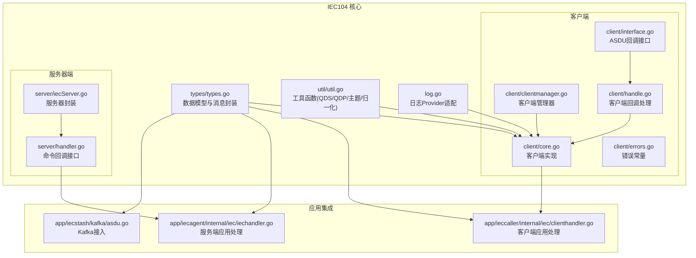
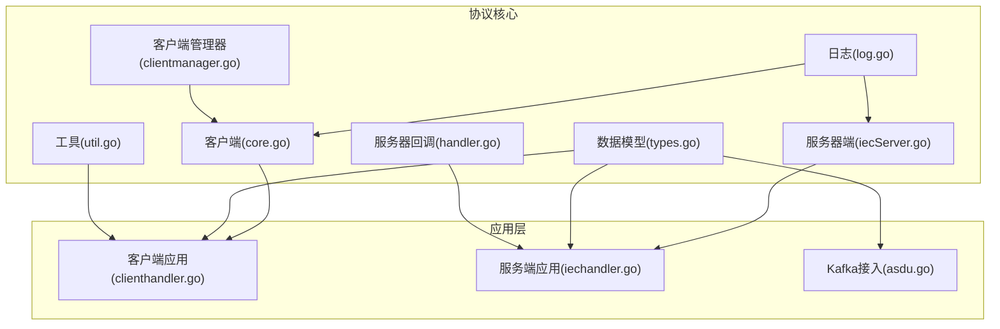
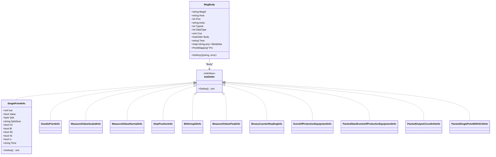
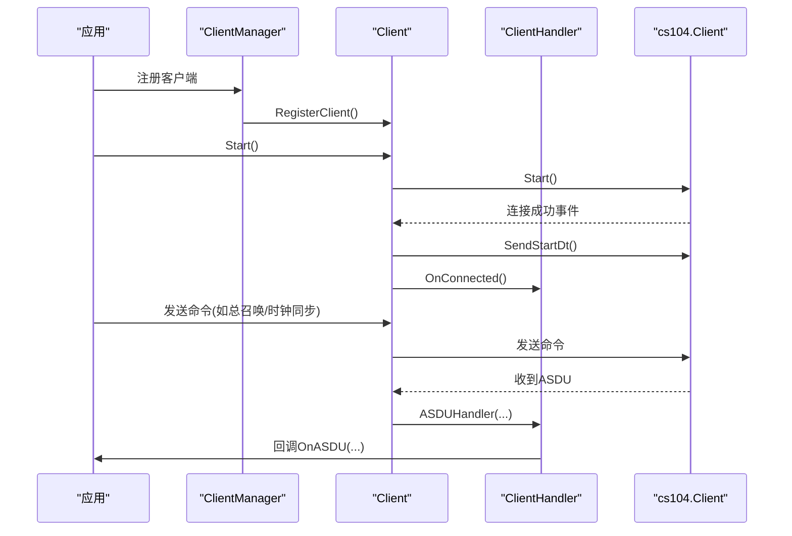
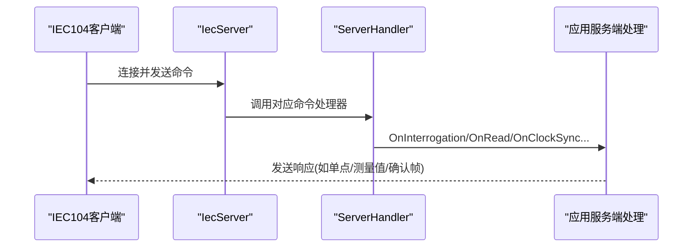
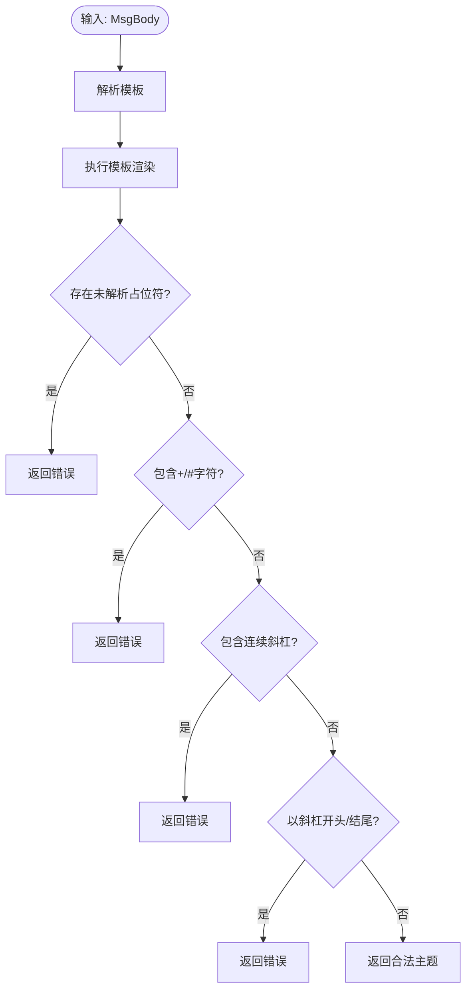
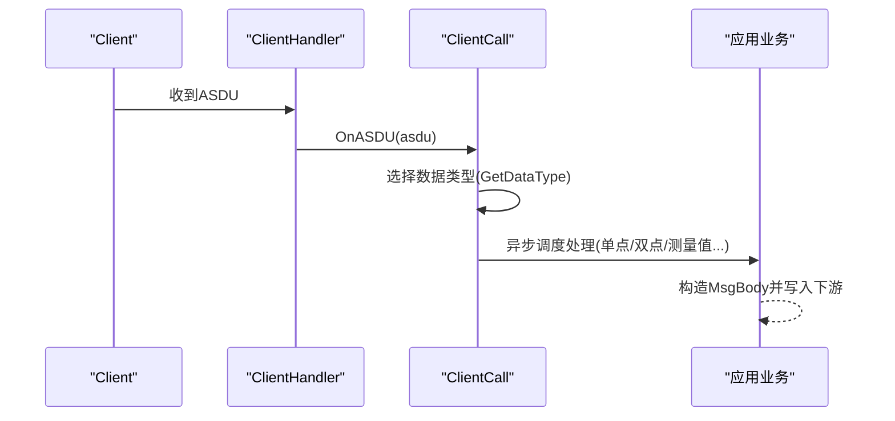
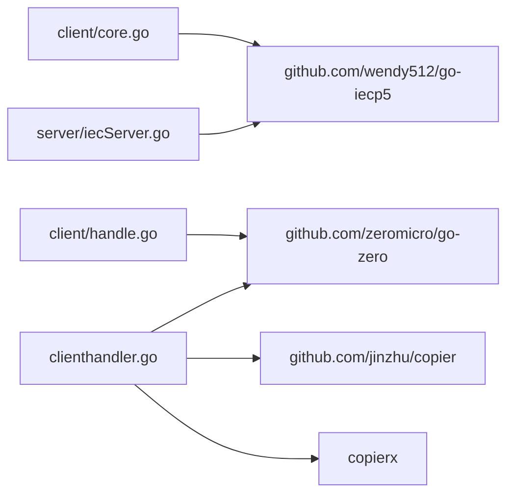

# IEC104 协议核心组件

<cite>
**本文档引用的文件**
- [types.go](file://common/iec104/types/types.go)
- [clientmanager.go](file://common/iec104/client/clientmanager.go)
- [core.go](file://common/iec104/client/core.go)
- [interface.go](file://common/iec104/client/interface.go)
- [errors.go](file://common/iec104/client/errors.go)
- [handle.go](file://common/iec104/client/handle.go)
- [iecServer.go](file://common/iec104/server/iecServer.go)
- [handler.go](file://common/iec104/server/handler.go)
- [util.go](file://common/iec104/util/util.go)
- [log.go](file://common/iec104/log.go)
- [asdu.go](file://app/iecstash/kafka/asdu.go)
- [iechandler.go](file://app/iecagent/internal/iec/iechandler.go)
- [clienthandler.go](file://app/ieccaller/internal/iec/clienthandler.go)
</cite>

## 目录
1. [引言](#引言)
2. [项目结构](#项目结构)
3. [核心组件](#核心组件)
4. [架构总览](#架构总览)
5. [详细组件分析](#详细组件分析)
6. [依赖关系分析](#依赖关系分析)
7. [性能考虑](#性能考虑)
8. [故障排查指南](#故障排查指南)
9. [结论](#结论)
10. [附录](#附录)

## 引言
本文件系统性梳理 IEC104 协议在项目中的实现架构，覆盖数据类型定义、客户端管理器、服务器端实现、工具函数与日志适配层，并深入解析 ASDU 结构体、地址映射机制、连接状态管理与协议解析流程。文档提供完整规范实现说明、数据编码解码要点、错误处理机制以及性能优化建议，并通过图示与路径引用帮助读者快速定位关键实现。

## 项目结构
IEC104 相关代码主要位于 common/iec104 目录下，按职责划分为：
- types：协议数据模型与消息封装
- client：IEC104 客户端实现与管理
- server：IEC104 服务器端实现
- util：协议工具函数（质量描述符、主题生成等）
- 日志适配：统一日志 Provider

应用侧集成示例：
- app/ieccaller：客户端调用方，负责接收并处理来自远端的 ASDU 报文
- app/iecagent：服务端示例，演示如何响应总召唤、时钟同步等命令
- app/iecstash：Kafka 接入，将 ASDU 数据写入消息队列

**图表来源**
- [types.go:1-323](file://common/iec104/types/types.go#L1-L323)
- [clientmanager.go:1-145](file://common/iec104/client/clientmanager.go#L1-L145)
- [core.go:1-446](file://common/iec104/client/core.go#L1-L446)
- [handle.go:1-155](file://common/iec104/client/handle.go#L1-L155)
- [interface.go:1-71](file://common/iec104/client/interface.go#L1-L71)
- [errors.go:1-8](file://common/iec104/client/errors.go#L1-L8)
- [iecServer.go:1-38](file://common/iec104/server/iecServer.go#L1-L38)
- [handler.go:1-60](file://common/iec104/server/handler.go#L1-L60)
- [util.go:1-242](file://common/iec104/util/util.go#L1-L242)
- [log.go:1-49](file://common/iec104/log.go#L1-L49)
- [clienthandler.go:1-541](file://app/ieccaller/internal/iec/clienthandler.go#L1-L541)
- [iechandler.go:1-124](file://app/iecagent/internal/iec/iechandler.go#L1-L124)
- [asdu.go:1-25](file://app/iecstash/kafka/asdu.go#L1-L25)

**章节来源**
- [types.go:1-323](file://common/iec104/types/types.go#L1-L323)
- [clientmanager.go:1-145](file://common/iec104/client/clientmanager.go#L1-L145)
- [core.go:1-446](file://common/iec104/client/core.go#L1-L446)
- [handle.go:1-155](file://common/iec104/client/handle.go#L1-L155)
- [interface.go:1-71](file://common/iec104/client/interface.go#L1-L71)
- [errors.go:1-8](file://common/iec104/client/errors.go#L1-L8)
- [iecServer.go:1-38](file://common/iec104/server/iecServer.go#L1-L38)
- [handler.go:1-60](file://common/iec104/server/handler.go#L1-L60)
- [util.go:1-242](file://common/iec104/util/util.go#L1-L242)
- [log.go:1-49](file://common/iec104/log.go#L1-L49)
- [clienthandler.go:1-541](file://app/ieccaller/internal/iec/clienthandler.go#L1-L541)
- [iechandler.go:1-124](file://app/iecagent/internal/iec/iechandler.go#L1-L124)
- [asdu.go:1-25](file://app/iecstash/kafka/asdu.go#L1-L25)

## 核心组件
- 数据类型与消息封装：定义 MsgBody、PointMapping、各类 ASDU 信息体结构，提供键生成与 IOA 提取接口，支撑后续解析与路由。
- 客户端实现：封装 cs104 客户端，提供连接生命周期管理、命令发送、回调处理与指标统计。
- 服务器端实现：封装 cs104 服务器，提供启动/停止、参数配置与日志开关。
- 工具函数：质量描述符判断、字符串化、归一化转换、主题模板生成、站点 ID 生成等。
- 日志适配：将底层日志桥接到统一日志系统，支持上下文字段注入。
- 应用集成：客户端应用处理各类 ASDU 类型，服务端应用响应命令，Kafka 接入将 ASDU 写入消息队列。

**章节来源**
- [types.go:11-58](file://common/iec104/types/types.go#L11-L58)
- [core.go:48-117](file://common/iec104/client/core.go#L48-L117)
- [iecServer.go:12-37](file://common/iec104/server/iecServer.go#L12-L37)
- [util.go:13-241](file://common/iec104/util/util.go#L13-L241)
- [log.go:8-49](file://common/iec104/log.go#L8-L49)
- [clienthandler.go:21-140](file://app/ieccaller/internal/iec/clienthandler.go#L21-L140)

## 架构总览
IEC104 在本项目中采用“核心库 + 应用集成”的分层设计：
- 核心库提供协议解析、编码、质量描述符处理、日志适配与服务器/客户端封装。
- 应用层通过回调接口对接业务逻辑，完成数据落库、转发或进一步处理。

**图表来源**
- [core.go:1-446](file://common/iec104/client/core.go#L1-L446)
- [clientmanager.go:1-145](file://common/iec104/client/clientmanager.go#L1-L145)
- [iecServer.go:1-38](file://common/iec104/server/iecServer.go#L1-L38)
- [handler.go:1-60](file://common/iec104/server/handler.go#L1-L60)
- [types.go:1-323](file://common/iec104/types/types.go#L1-L323)
- [util.go:1-242](file://common/iec104/util/util.go#L1-L242)
- [log.go:1-49](file://common/iec104/log.go#L1-L49)
- [clienthandler.go:1-541](file://app/ieccaller/internal/iec/clienthandler.go#L1-L541)
- [iechandler.go:1-124](file://app/iecagent/internal/iec/iechandler.go#L1-L124)
- [asdu.go:1-25](file://app/iecstash/kafka/asdu.go#L1-L25)

## 详细组件分析

### 数据类型与 ASDU 结构体
- MsgBody：封装一次 ASDU 报文的元信息与数据体，支持从 Body 中提取 IOA 并生成唯一键，便于去重与关联。
- PointMapping：设备与表类型的映射，支持扩展字段，便于主题拆分与路由。
- 各类 ASDU 信息体：单点、双点、测量值（标度化/规一化/短浮点）、步位置、位串、累计量、保护设备事件、成组事件与输出电路、带变位检出的成组单点等。
- IoaGetter 接口：统一 IOA 提取能力，配合 MsgBody.GetKey 实现键生成。

**图表来源**
- [types.go:17-58](file://common/iec104/types/types.go#L17-L58)
- [types.go:62-322](file://common/iec104/types/types.go#L62-L322)

**章节来源**
- [types.go:17-58](file://common/iec104/types/types.go#L17-L58)
- [types.go:62-322](file://common/iec104/types/types.go#L62-L322)

### 客户端管理器与连接状态管理
- ClientManager：维护 host:port 到 Client 的映射，支持注册、注销、查询、遍历与统计；内置定时统计日志。
- Client：封装 cs104 客户端，提供连接/断开/服务器激活事件回调，自动发送 START/DROP DT 帧，支持自动重连与重连间隔配置。
- ClientHandler：将底层回调转为可插拔的 ASDU 回调接口，统一记录耗时指标。

**图表来源**
- [clientmanager.go:29-68](file://common/iec104/client/clientmanager.go#L29-L68)
- [core.go:119-147](file://common/iec104/client/core.go#L119-L147)
- [handle.go:34-109](file://common/iec104/client/handle.go#L34-L109)

**章节来源**
- [clientmanager.go:11-145](file://common/iec104/client/clientmanager.go#L11-L145)
- [core.go:48-180](file://common/iec104/client/core.go#L48-L180)
- [handle.go:34-109](file://common/iec104/client/handle.go#L34-L109)

### 服务器端实现与命令处理
- IecServer：封装 cs104.Server，设置参数与日志，提供 Start/Stop。
- ServerHandler：将底层命令回调转为可插拔的 CommandHandler 接口，供应用侧实现具体业务。

**图表来源**
- [iecServer.go:17-37](file://common/iec104/server/iecServer.go#L17-L37)
- [handler.go:16-59](file://common/iec104/server/handler.go#L16-L59)

**章节来源**
- [iecServer.go:12-37](file://common/iec104/server/iecServer.go#L12-L37)
- [handler.go:8-59](file://common/iec104/server/handler.go#L8-L59)

### 工具函数与质量描述符处理
- 质量描述符工具：对 QDS/QDP 进行包含/全包含判断、字符串化与二进制展示。
- 归一化工具：规一化值与浮点互转，满足规一化值范围约束。
- 主题生成：基于模板与 MsgBody 动态生成最终主题，进行占位符与非法字符校验。
- 站点 ID 生成：将 host 中的点替换为下划线后与端口拼接。

**图表来源**
- [util.go:198-241](file://common/iec104/util/util.go#L198-L241)

**章节来源**
- [util.go:13-241](file://common/iec104/util/util.go#L13-L241)

### 日志适配与上下文注入
- LogProvider：将 go-iecp5 的日志接口适配到统一日志系统，支持上下文字段注入，便于链路追踪与统计。

**章节来源**
- [log.go:8-49](file://common/iec104/log.go#L8-L49)

### 应用集成：客户端应用处理
- ClientCall：实现 client.ASDUCall 接口，按 TypeID 分发到具体处理函数，异步调度，支持并发控制。
- 数据处理：将底层 ASDU 解析为 MsgBody，填充 Host/Port/Asdu/TypeId/DataType/Coe/Body/MetaData 等字段，并写入下游（如 Kafka 或数据库）。

**图表来源**
- [handle.go:102-154](file://common/iec104/client/handle.go#L102-L154)
- [clienthandler.go:94-140](file://app/ieccaller/internal/iec/clienthandler.go#L94-L140)

**章节来源**
- [clienthandler.go:21-140](file://app/ieccaller/internal/iec/clienthandler.go#L21-L140)

### 应用集成：服务端应用处理
- IecHandler：实现 server.CommandHandler 接口，响应总召唤、计数器召唤、读定值、时钟同步、进程重置、延迟获取与控制命令，构造相应 ASDU 并发送。

**章节来源**
- [iechandler.go:15-124](file://app/iecagent/internal/iec/iechandler.go#L15-L124)

### 应用集成：Kafka 接入
- Asdu：消费 Kafka 消息，将 ASDU 字符串写入推送器，便于后续处理。

**章节来源**
- [asdu.go:10-24](file://app/iecstash/kafka/asdu.go#L10-L24)

## 依赖关系分析
- 核心依赖：github.com/wendy512/go-iecp5 提供 cs104 服务器/客户端与 ASDU 类型定义。
- 日志依赖：github.com/zeromicro/go-zero 提供日志与指标统计。
- 类型复制：github.com/jinzhu/copier 与自定义 copierx 用于结构体复制。
- 并发控制：github.com/zeromicro/go-zero/core/threading 提供任务调度器。

**图表来源**
- [core.go:3-17](file://common/iec104/client/core.go#L3-L17)
- [iecServer.go:3-10](file://common/iec104/server/iecServer.go#L3-L10)
- [handle.go:3-7](file://common/iec104/client/handle.go#L3-L7)
- [clienthandler.go:3-19](file://app/ieccaller/internal/iec/clienthandler.go#L3-L19)

**章节来源**
- [core.go:3-17](file://common/iec104/client/core.go#L3-L17)
- [iecServer.go:3-10](file://common/iec104/server/iecServer.go#L3-L10)
- [handle.go:3-7](file://common/iec104/client/handle.go#L3-L7)
- [clienthandler.go:3-19](file://app/ieccaller/internal/iec/clienthandler.go#L3-L19)

## 性能考虑
- 异步处理：客户端应用通过任务调度器异步处理不同类型的 ASDU，避免阻塞网络回调线程。
- 并发控制：通过并发度配置限制同时处理的任务数量，防止资源争用。
- 指标统计：在回调入口处记录耗时指标，便于定位慢路径。
- 自动重连：合理设置重连间隔，避免频繁抖动导致资源浪费。
- 主题生成：模板渲染前进行严格校验，减少无效写入与下游失败重试。

[本节为通用指导，无需特定文件引用]

## 故障排查指南
- 连接问题：检查客户端配置（Host/Port）、自动重连开关与日志模式；关注连接事件回调与统计日志。
- 命令未达：确认公共地址（CommonAddr）与信息对象地址（IOA）正确；核对 CauseOfTransmission 是否为 Activation。
- 质量描述符异常：利用工具函数对 QDS/QDP 进行诊断，定位溢出、封锁、替代、非实时、无效等标志。
- 主题生成失败：检查模板语法、占位符是否完整解析、是否包含非法字符或连续斜杠。
- Kafka 写入失败：检查消息格式与消费者日志，确认写入器可用性。

**章节来源**
- [errors.go:5-7](file://common/iec104/client/errors.go#L5-L7)
- [util.go:198-241](file://common/iec104/util/util.go#L198-L241)
- [clientmanager.go:117-144](file://common/iec104/client/clientmanager.go#L117-L144)

## 结论
本项目以 go-iecp5 为基础，构建了清晰的 IEC104 协议实现：数据模型完备、客户端/服务器封装良好、工具函数实用、日志适配统一。应用层通过回调接口与任务调度实现高吞吐与可扩展的数据处理。建议在生产环境中结合并发控制、指标监控与严格的主题校验，确保稳定性与可观测性。

[本节为总结，无需特定文件引用]

## 附录
- 常用 TypeID 对照：单点、双点、测量值（标度化/规一化/短浮点）、步位置、位串、累计量、保护设备事件、成组事件与输出电路、带变位检出的成组单点等。
- 命令类型：总召唤、计数器召唤、时钟同步、读定值、进程重置、测试、控制命令（单命令/双命令/步命令/定值命令）等。
- 地址映射：公共地址（CommonAddr）与信息对象地址（IOA）组合用于唯一标识数据点；MsgBody.GetKey 基于 Host/COA/IOA 生成键。

[本节为概览，无需特定文件引用]