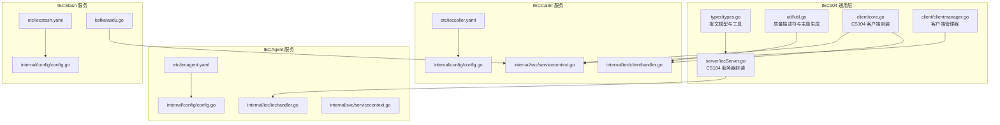
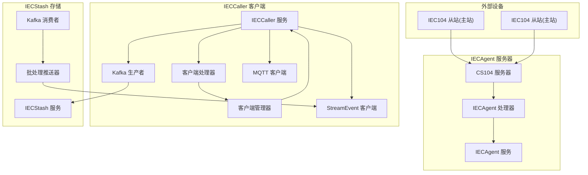
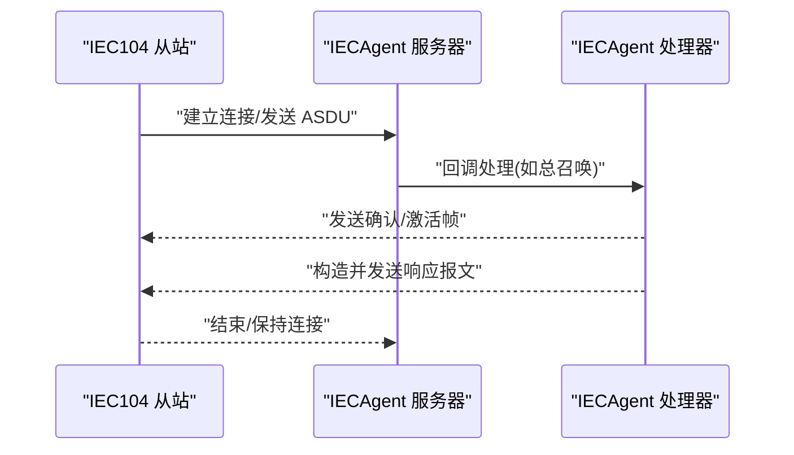
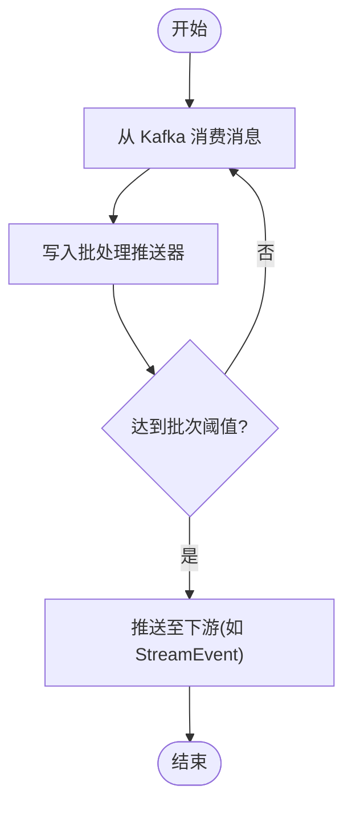
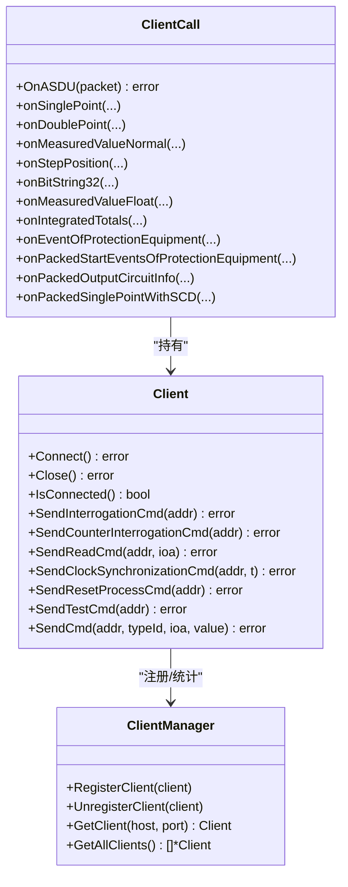
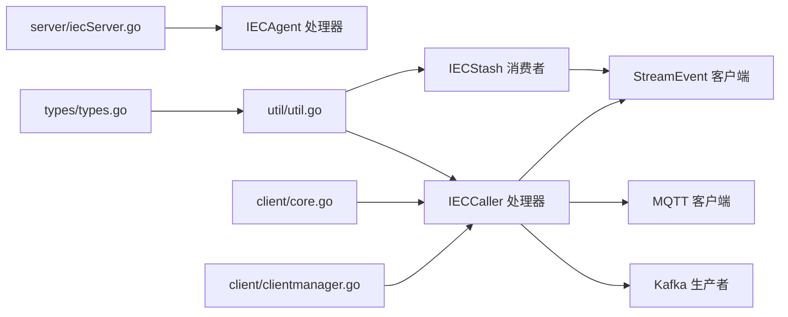

# IEC104 数采平台

<cite>
**本文引用的文件**
- [app/iecagent/etc/iecagent.yaml](file://app/iecagent/etc/iecagent.yaml)
- [app/iecagent/internal/config/config.go](file://app/iecagent/internal/config/config.go)
- [app/iecagent/internal/iec/iechandler.go](file://app/iecagent/internal/iec/iechandler.go)
- [app/iecagent/internal/svc/servicecontext.go](file://app/iecagent/internal/svc/servicecontext.go)
- [common/iec104/server/iecServer.go](file://common/iec104/server/iecServer.go)
- [app/ieccaller/etc/ieccaller.yaml](file://app/ieccaller/etc/ieccaller.yaml)
- [app/ieccaller/internal/config/config.go](file://app/ieccaller/internal/config/config.go)
- [app/ieccaller/internal/iec/clienthandler.go](file://app/ieccaller/internal/iec/clienthandler.go)
- [app/ieccaller/internal/svc/servicecontext.go](file://app/ieccaller/internal/svc/servicecontext.go)
- [common/iec104/client/core.go](file://common/iec104/client/core.go)
- [common/iec104/client/clientmanager.go](file://common/iec104/client/clientmanager.go)
- [app/iecstash/etc/iecstash.yaml](file://app/iecstash/etc/iecstash.yaml)
- [app/iecstash/internal/config/config.go](file://app/iecstash/internal/config/config.go)
- [app/iecstash/kafka/asdu.go](file://app/iecstash/kafka/asdu.go)
- [common/iec104/types/types.go](file://common/iec104/types/types.go)
- [common/iec104/util/util.go](file://common/iec104/util/util.go)
</cite>

## 目录
1. [引言](#引言)
2. [项目结构](#项目结构)
3. [核心组件](#核心组件)
4. [架构总览](#架构总览)
5. [详细组件分析](#详细组件分析)
6. [依赖分析](#依赖分析)
7. [性能考虑](#性能考虑)
8. [故障排查指南](#故障排查指南)
9. [结论](#结论)
10. [附录](#附录)

## 引言
本技术文档围绕 IEC104 数采平台的三大核心服务：IECAgent、IECStash、IECCaller，系统性阐述其架构设计、功能实现与交互关系。重点覆盖以下方面：
- IECAgent 作为 IEC104 服务器端的设备接入能力，包括客户端连接管理、ASDU 消息处理与设备状态监控。
- IECStash 作为消息存储服务，负责从 Kafka 拉取 IEC104 报文并进行批量化推送至下游（如 StreamEvent）。
- IECCaller 作为 IEC104 客户端的主站侧能力，包括设备轮询、命令下发、异常处理与与 Kafka/MQTT/StreamEvent 的集成。

同时提供配置说明、协议解析流程、错误处理机制与性能优化建议，并通过图示帮助读者快速理解各模块之间的数据流与控制流。

## 项目结构
本项目采用多服务微架构，每个服务独立配置与运行，通过 RPC、Kafka、MQTT、StreamEvent 等通道协同工作。IEC104 协议相关逻辑集中在 common/iec104 下，供各服务复用。

图表来源
- [common/iec104/types/types.go:1-323](file://common/iec104/types/types.go#L1-L323)
- [common/iec104/util/util.go:1-242](file://common/iec104/util/util.go#L1-L242)
- [common/iec104/server/iecServer.go:1-38](file://common/iec104/server/iecServer.go#L1-L38)
- [common/iec104/client/core.go:1-446](file://common/iec104/client/core.go#L1-L446)
- [common/iec104/client/clientmanager.go:1-145](file://common/iec104/client/clientmanager.go#L1-L145)
- [app/iecagent/etc/iecagent.yaml:1-14](file://app/iecagent/etc/iecagent.yaml#L1-L14)
- [app/iecagent/internal/config/config.go:1-14](file://app/iecagent/internal/config/config.go#L1-L14)
- [app/iecagent/internal/iec/iechandler.go:1-124](file://app/iecagent/internal/iec/iechandler.go#L1-L124)
- [app/iecagent/internal/svc/servicecontext.go:1-14](file://app/iecagent/internal/svc/servicecontext.go#L1-L14)
- [app/ieccaller/etc/ieccaller.yaml:1-79](file://app/ieccaller/etc/ieccaller.yaml#L1-L79)
- [app/ieccaller/internal/config/config.go:1-59](file://app/ieccaller/internal/config/config.go#L1-L59)
- [app/ieccaller/internal/iec/clienthandler.go:1-541](file://app/ieccaller/internal/iec/clienthandler.go#L1-L541)
- [app/ieccaller/internal/svc/servicecontext.go:1-311](file://app/ieccaller/internal/svc/servicecontext.go#L1-L311)
- [app/iecstash/etc/iecstash.yaml:1-46](file://app/iecstash/etc/iecstash.yaml#L1-L46)
- [app/iecstash/internal/config/config.go:1-29](file://app/iecstash/internal/config/config.go#L1-L29)
- [app/iecstash/kafka/asdu.go:1-25](file://app/iecstash/kafka/asdu.go#L1-L25)

章节来源
- [app/iecagent/etc/iecagent.yaml:1-14](file://app/iecagent/etc/iecagent.yaml#L1-L14)
- [app/ieccaller/etc/ieccaller.yaml:1-79](file://app/ieccaller/etc/ieccaller.yaml#L1-L79)
- [app/iecstash/etc/iecstash.yaml:1-46](file://app/iecstash/etc/iecstash.yaml#L1-L46)

## 核心组件
- IECAgent（服务器端）
  - 提供 IEC104 服务器能力，监听指定地址与端口，接收来自主站的 ASDU 请求并进行响应。
  - 内置处理回调，支持总召唤、计数器召唤、读命令、时钟同步、进程复位、延迟获取等。
  - 支持日志模式与参数集宽参数，便于调试与兼容不同设备。

- IECStash（消息存储/转发）
  - 从 Kafka 拉取 IEC104 报文，按批次写入下游（如 StreamEvent），并可配置广播推送。
  - 提供 Kafka 消费者配置（连接数、消费者数、处理协程、最小/最大拉取字节、偏移策略等）。

- IECCaller（主站客户端）
  - 以客户端身份连接一个或多个 IEC104 从站，定时轮询（总召唤、计数器召唤）、读取定值、下发控制命令。
  - 将收到的 ASDU 解析为统一 MsgBody 结构，按需推送到 Kafka、MQTT、StreamEvent，并支持点位映射与广播。

章节来源
- [common/iec104/server/iecServer.go:12-37](file://common/iec104/server/iecServer.go#L12-L37)
- [app/iecagent/internal/iec/iechandler.go:25-123](file://app/iecagent/internal/iec/iechandler.go#L25-L123)
- [app/iecstash/kafka/asdu.go:20-24](file://app/iecstash/kafka/asdu.go#L20-L24)
- [app/ieccaller/internal/iec/clienthandler.go:94-140](file://app/ieccaller/internal/iec/clienthandler.go#L94-L140)
- [app/ieccaller/internal/svc/servicecontext.go:144-244](file://app/ieccaller/internal/svc/servicecontext.go#L144-L244)

## 架构总览
下图展示三服务在整体系统中的角色与数据通路：

图表来源
- [common/iec104/server/iecServer.go:17-37](file://common/iec104/server/iecServer.go#L17-L37)
- [app/iecagent/internal/iec/iechandler.go:25-123](file://app/iecagent/internal/iec/iechandler.go#L25-L123)
- [common/iec104/client/core.go:149-175](file://common/iec104/client/core.go#L149-L175)
- [common/iec104/client/clientmanager.go:11-144](file://common/iec104/client/clientmanager.go#L11-L144)
- [app/ieccaller/internal/svc/servicecontext.go:54-141](file://app/ieccaller/internal/svc/servicecontext.go#L54-L141)
- [app/iecstash/kafka/asdu.go:20-24](file://app/iecstash/kafka/asdu.go#L20-L24)

## 详细组件分析

### IECAgent（服务器端）
- 服务器初始化与启动
  - 通过 CS104 服务器封装创建服务实例，设置参数集与日志模式，绑定监听地址与端口。
  - 启动后进入阻塞监听，等待客户端连接。

- 消息处理回调
  - 支持多种 IEC104 控制方向命令的响应：总召唤、计数器召唤、读命令、测试、时钟同步、进程复位、延迟获取。
  - 对于下行命令（如单命令），构造确认/激活终止帧并回发确认。

- 设备状态监控
  - 通过日志模式与连接事件回调记录连接状态变化，便于运维观测。

图表来源
- [common/iec104/server/iecServer.go:31-37](file://common/iec104/server/iecServer.go#L31-L37)
- [app/iecagent/internal/iec/iechandler.go:25-123](file://app/iecagent/internal/iec/iechandler.go#L25-L123)

章节来源
- [app/iecagent/etc/iecagent.yaml:10-14](file://app/iecagent/etc/iecagent.yaml#L10-L14)
- [app/iecagent/internal/config/config.go:5-13](file://app/iecagent/internal/config/config.go#L5-L13)
- [app/iecagent/internal/iec/iechandler.go:25-123](file://app/iecagent/internal/iec/iechandler.go#L25-L123)
- [common/iec104/server/iecServer.go:17-37](file://common/iec104/server/iecServer.go#L17-L37)

### IECStash（消息存储/转发）
- Kafka 消费与批处理
  - 从 Kafka 拉取 IEC104 报文，消费回调将消息写入批处理推送器。
  - 批处理推送器按配置的字节数阈值批量写入下游（如 StreamEvent）。

- 配置要点
  - 连接数、消费者数、处理协程数、最小/最大拉取字节、偏移策略等，均在配置中明确。

图表来源
- [app/iecstash/kafka/asdu.go:20-24](file://app/iecstash/kafka/asdu.go#L20-L24)
- [app/iecstash/etc/iecstash.yaml:18-35](file://app/iecstash/etc/iecstash.yaml#L18-L35)

章节来源
- [app/iecstash/etc/iecstash.yaml:1-46](file://app/iecstash/etc/iecstash.yaml#L1-L46)
- [app/iecstash/internal/config/config.go:10-28](file://app/iecstash/internal/config/config.go#L10-L28)
- [app/iecstash/kafka/asdu.go:1-25](file://app/iecstash/kafka/asdu.go#L1-L25)

### IECCaller（主站客户端）
- 客户端与连接管理
  - 客户端封装了连接、断开、重连、连接事件回调等；客户端管理器负责注册/注销与统计。
  - 支持自动重连与重连间隔配置。

- 报文解析与推送
  - 客户端处理器对各类 ASDU 类型进行解析，构造统一 MsgBody 并写入点位映射、时间戳等。
  - 支持并发任务执行（TaskRunner），按类型分派到具体解析函数。
  - 支持 Kafka、MQTT、StreamEvent 的异步推送，以及广播推送（集群模式）。

- 命令下发
  - 支持总召唤、计数器召唤、读命令、时钟同步、进程复位、测试、控制命令（单命令、双命令、步命令、定值命令等）。
  - 命令发送前会检查连接状态，避免未连接发送失败。

图表来源
- [common/iec104/client/core.go:49-117](file://common/iec104/client/core.go#L49-L117)
- [common/iec104/client/clientmanager.go:11-144](file://common/iec104/client/clientmanager.go#L11-L144)
- [app/ieccaller/internal/iec/clienthandler.go:21-140](file://app/ieccaller/internal/iec/clienthandler.go#L21-L140)

章节来源
- [app/ieccaller/etc/ieccaller.yaml:1-79](file://app/ieccaller/etc/ieccaller.yaml#L1-L79)
- [app/ieccaller/internal/config/config.go:11-59](file://app/ieccaller/internal/config/config.go#L11-L59)
- [common/iec104/client/core.go:87-175](file://common/iec104/client/core.go#L87-L175)
- [common/iec104/client/clientmanager.go:17-144](file://common/iec104/client/clientmanager.go#L17-L144)
- [app/ieccaller/internal/iec/clienthandler.go:94-541](file://app/ieccaller/internal/iec/clienthandler.go#L94-L541)
- [app/ieccaller/internal/svc/servicecontext.go:144-311](file://app/ieccaller/internal/svc/servicecontext.go#L144-L311)

## 依赖分析
- 通用类型与工具
  - types/types.go 定义了统一的 MsgBody、各类 IEC104 信息体结构与点位映射结构，以及键生成方法。
  - util/util.go 提供质量描述符解析、规一化转换、站点 ID 生成、MQTT 主题模板生成等工具。

- 服务器与客户端
  - server/iecServer.go 封装 CS104 服务器，简化启动与关闭流程。
  - client/core.go 封装 CS104 客户端，提供命令发送、连接管理、事件回调等。

- 服务间耦合
  - IECAgent 与 IECCaller 通过 IEC104 协议交互，IECStash 作为中间层承接 Kafka 消息并推送至下游。
  - IECCaller 与 IECStash 通过 Kafka/StreamEvent 解耦，支持横向扩展与多集群部署。

图表来源
- [common/iec104/types/types.go:17-58](file://common/iec104/types/types.go#L17-L58)
- [common/iec104/util/util.go:190-241](file://common/iec104/util/util.go#L190-L241)
- [common/iec104/server/iecServer.go:17-37](file://common/iec104/server/iecServer.go#L17-L37)
- [common/iec104/client/core.go:87-175](file://common/iec104/client/core.go#L87-L175)
- [common/iec104/client/clientmanager.go:17-144](file://common/iec104/client/clientmanager.go#L17-L144)
- [app/ieccaller/internal/iec/clienthandler.go:94-140](file://app/ieccaller/internal/iec/clienthandler.go#L94-L140)
- [app/iecstash/kafka/asdu.go:20-24](file://app/iecstash/kafka/asdu.go#L20-L24)

章节来源
- [common/iec104/types/types.go:1-323](file://common/iec104/types/types.go#L1-L323)
- [common/iec104/util/util.go:1-242](file://common/iec104/util/util.go#L1-L242)
- [common/iec104/server/iecServer.go:1-38](file://common/iec104/server/iecServer.go#L1-L38)
- [common/iec104/client/core.go:1-446](file://common/iec104/client/core.go#L1-L446)
- [common/iec104/client/clientmanager.go:1-145](file://common/iec104/client/clientmanager.go#L1-L145)
- [app/ieccaller/internal/iec/clienthandler.go:1-541](file://app/ieccaller/internal/iec/clienthandler.go#L1-L541)
- [app/iecstash/kafka/asdu.go:1-25](file://app/iecstash/kafka/asdu.go#L1-L25)

## 性能考虑
- 并发与吞吐
  - IECCaller 的客户端管理器与任务执行器支持并发调度，合理设置 TaskConcurrency 可提升解析吞吐。
  - IECStash 的 Kafka 消费配置（Conns、Consumers、Processors）应结合 CPU 核数与分区数进行调优，避免过度竞争。

- 批处理与 IO
  - 通过 PushAsduChunkBytes 控制批处理大小，平衡延迟与吞吐；过大可能增加内存占用，过小增加系统调用次数。
  - Kafka 拉取 MinBytes/MaxBytes 应根据网络与磁盘条件调整，避免频繁小包或拥塞。

- 连接与重连
  - 客户端 AutoConnect 与 ReconnectInterval 需结合网络稳定性配置，避免频繁抖动。
  - 服务器端日志模式仅在调试阶段启用，生产环境建议关闭以降低开销。

- 缓存与映射
  - IECCaller 在推送前尝试查询点位映射，命中后填充设备标识与扩展字段，未命中或禁用推送时可跳过后续推送，减少无效流量。

章节来源
- [app/ieccaller/etc/ieccaller.yaml:72-79](file://app/ieccaller/etc/ieccaller.yaml#L72-L79)
- [app/iecstash/etc/iecstash.yaml:24-35](file://app/iecstash/etc/iecstash.yaml#L24-L35)
- [common/iec104/client/core.go:22-37](file://common/iec104/client/core.go#L22-L37)
- [app/ieccaller/internal/svc/servicecontext.go:154-180](file://app/ieccaller/internal/svc/servicecontext.go#L154-L180)

## 故障排查指南
- 连接问题
  - 客户端未连接：检查服务器地址与端口、防火墙、自动重连配置；查看连接事件日志。
  - 服务器无法监听：确认监听地址与端口配置、端口占用情况。

- 报文解析异常
  - 质量描述符异常：利用 util 工具函数检查 QDS/QDP 标志位，定位越限、封锁、替代、无效等状态。
  - 主题生成失败：检查 MQTT 主题模板占位符是否完整解析，避免连续斜杠、以斜杠开头/结尾等非法格式。

- 推送失败
  - Kafka 推送超时：检查 brokers 列表、Topic 权限、网络连通性与超时配置。
  - MQTT 推送失败：确认 broker 地址、认证信息、QoS 与主题合法性。
  - StreamEvent 推送失败：检查目标端点、超时与最大消息大小配置。

- 广播与集群
  - 集群模式下广播需启用并配置 Kafka；若广播启用而 Kafka 未配置，服务启动会报错。

章节来源
- [common/iec104/util/util.go:197-241](file://common/iec104/util/util.go#L197-L241)
- [app/ieccaller/internal/svc/servicecontext.go:54-60](file://app/ieccaller/internal/svc/servicecontext.go#L54-L60)
- [app/ieccaller/internal/svc/servicecontext.go:246-285](file://app/ieccaller/internal/svc/servicecontext.go#L246-L285)

## 结论
IEC104 数采平台通过 IECAgent、IECStash、IECCaller 三足鼎立的架构，实现了从设备接入、消息存储到主站轮询与命令下发的完整链路。IECAgent 提供稳定的服务器端能力；IECStash 以 Kafka 为枢纽完成消息汇聚与批处理；IECCaller 以客户端形态完成对多台从站的统一管理与数据推送。配合完善的配置项、协议解析工具与错误处理机制，平台具备良好的可扩展性与运维友好性。

## 附录
- 配置清单与说明
  - IECAgent
    - 监听地址与端口、日志模式等基础配置见 [app/iecagent/etc/iecagent.yaml:1-14](file://app/iecagent/etc/iecagent.yaml#L1-L14)。
    - 服务器端配置结构见 [app/iecagent/internal/config/config.go:5-13](file://app/iecagent/internal/config/config.go#L5-L13)。
  - IECCaller
    - 监听地址、部署模式、超时、日志、Nacos、Kafka、MQTT、StreamEvent、数据库、批处理大小等配置见 [app/ieccaller/etc/ieccaller.yaml:1-79](file://app/ieccaller/etc/ieccaller.yaml#L1-L79)。
    - 配置结构定义见 [app/ieccaller/internal/config/config.go:18-59](file://app/ieccaller/internal/config/config.go#L18-L59)。
  - IECStash
    - Kafka 消费配置（Brokers、Topic、Group、Conns、Consumers、Processors、MinBytes、MaxBytes、CommitInOrder、Offset）见 [app/iecstash/etc/iecstash.yaml:18-35](file://app/iecstash/etc/iecstash.yaml#L18-L35)。
    - 配置结构定义见 [app/iecstash/internal/config/config.go:10-28](file://app/iecstash/internal/config/config.go#L10-L28)。

- 协议解析流程（IECCaller）
  - 客户端处理器按 ASDU 类型分派到对应解析函数，构造 MsgBody 并写入点位映射与时间戳，随后异步推送至 Kafka、MQTT、StreamEvent。

- 错误处理机制
  - 客户端发送前检查连接状态，避免未连接发送；推送失败时记录错误并继续执行其他推送。
  - 广播启用但 Kafka 未配置时，服务启动即报错，防止运行期广播失效。

- 性能优化建议
  - 合理设置 TaskConcurrency、Conns、Consumers、Processors，使 CPU 与网络资源得到充分利用。
  - 调整 PushAsduChunkBytes 与 Kafka 拉取字节范围，平衡延迟与吞吐。
  - 生产环境关闭服务器端日志模式，避免额外开销。