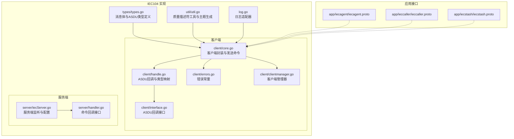
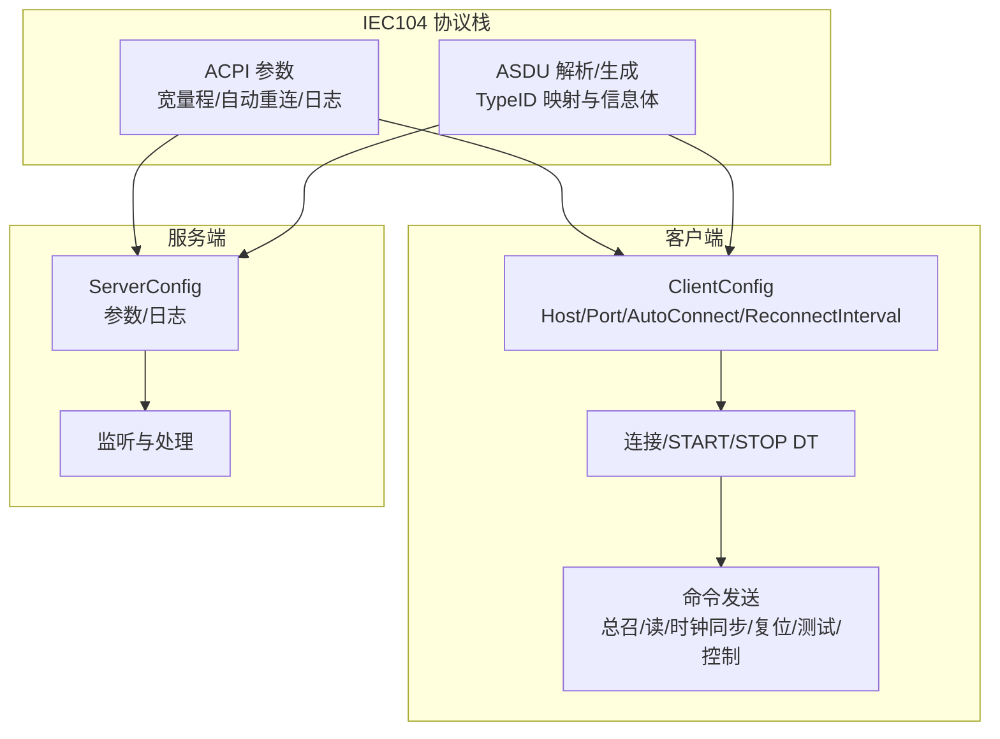
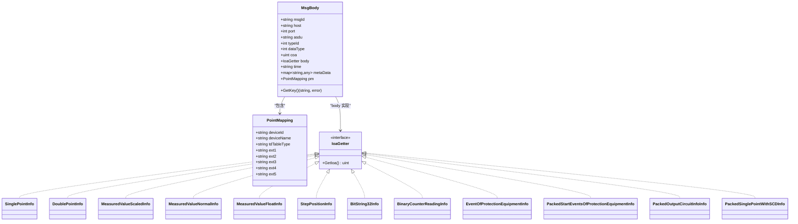
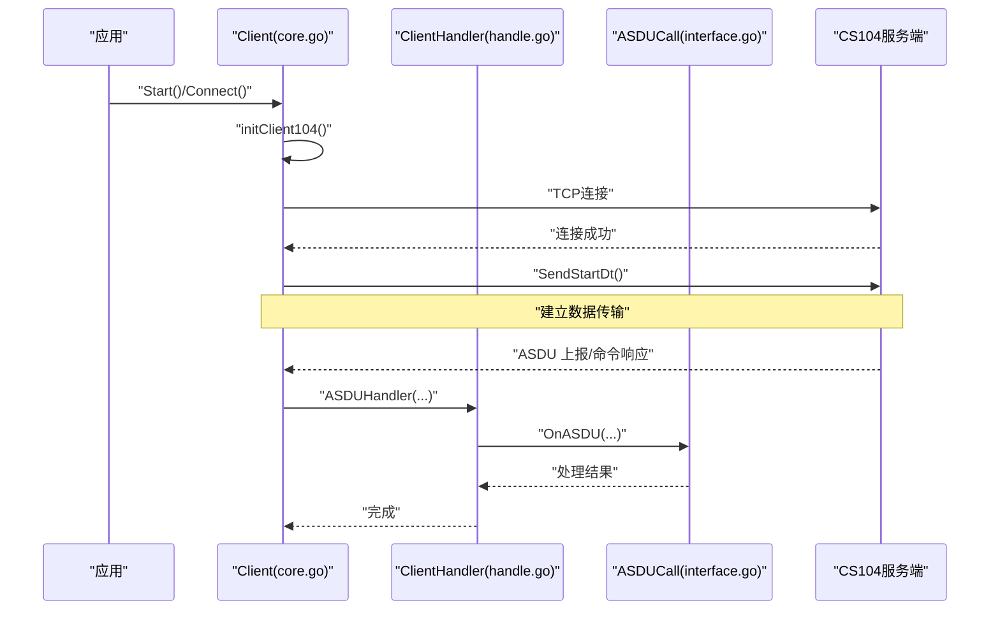
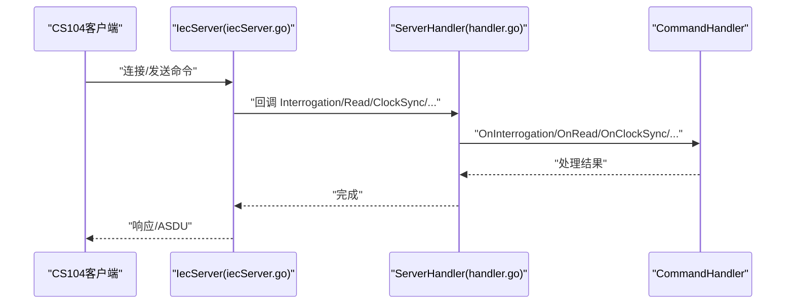
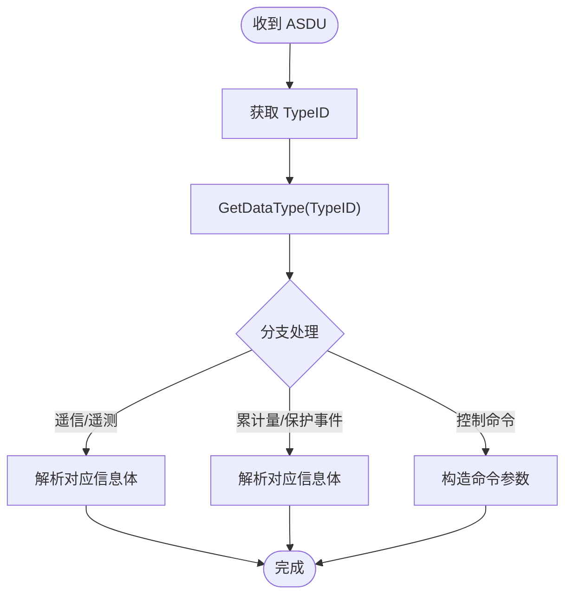
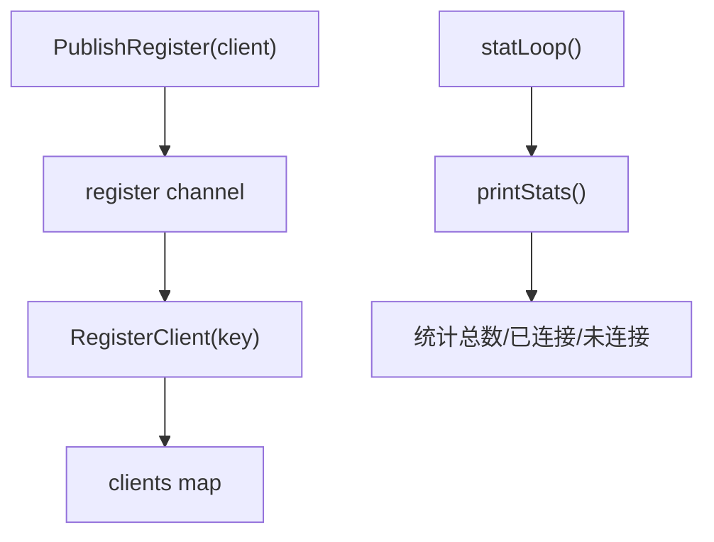
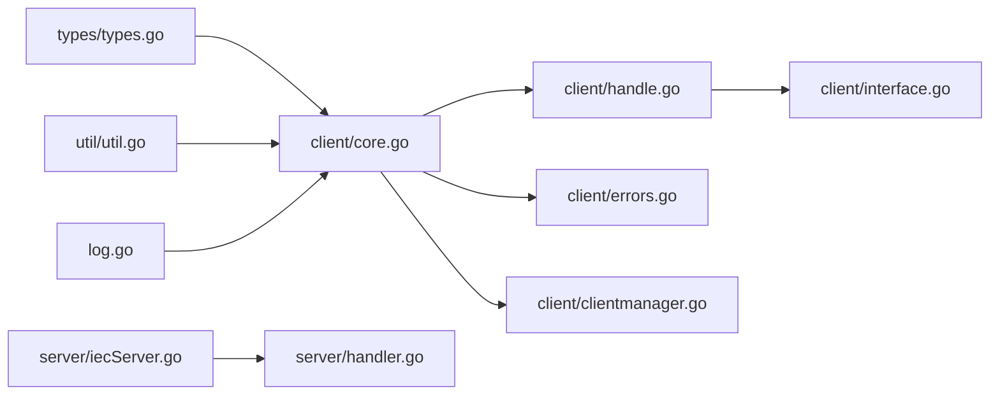

# IEC104 协议实现

<cite>
**本文引用的文件**   
- [common/iec104/types/types.go](file://common/iec104/types/types.go)
- [common/iec104/client/core.go](file://common/iec104/client/core.go)
- [common/iec104/client/handle.go](file://common/iec104/client/handle.go)
- [common/iec104/client/interface.go](file://common/iec104/client/interface.go)
- [common/iec104/client/errors.go](file://common/iec104/client/errors.go)
- [common/iec104/client/clientmanager.go](file://common/iec104/client/clientmanager.go)
- [common/iec104/server/iecServer.go](file://common/iec104/server/iecServer.go)
- [common/iec104/server/handler.go](file://common/iec104/server/handler.go)
- [common/iec104/util/util.go](file://common/iec104/util/util.go)
- [common/iec104/log.go](file://common/iec104/log.go)
- [app/iecagent/iecagent.proto](file://app/iecagent/iecagent.proto)
- [app/ieccaller/ieccaller.proto](file://app/ieccaller/ieccaller.proto)
- [app/iecstash/iecstash.proto](file://app/iecstash/iecstash.proto)
</cite>

## 目录
1. [引言](#引言)
2. [项目结构](#项目结构)
3. [核心组件](#核心组件)
4. [架构总览](#架构总览)
5. [详细组件分析](#详细组件分析)
6. [依赖分析](#依赖分析)
7. [性能考虑](#性能考虑)
8. [故障排查指南](#故障排查指南)
9. [结论](#结论)
10. [附录](#附录)

## 引言
本技术文档围绕 IECAgent 服务中 IEC 60870-5-104（IEC104）协议的实现进行系统性阐述，涵盖 ASDU 消息结构、I/F/U 帧处理机制、连接建立与会话管理、协议栈各层实现（应用规约控制信息 ACPI、应用服务数据单元 ASDU 的解析与生成）、完整协议交互示例、错误处理与超时机制以及异常恢复策略。文档以代码为依据，结合类图、序列图与流程图，帮助读者快速理解并正确使用该实现。

## 项目结构
IEC104 实现位于 common/iec104 目录下，分为客户端、服务端、工具与类型定义四大部分，并在 app 层提供 gRPC 接口以供上层业务调用。

**图表来源**
- [common/iec104/types/types.go:1-323](file://common/iec104/types/types.go#L1-L323)
- [common/iec104/util/util.go:1-242](file://common/iec104/util/util.go#L1-L242)
- [common/iec104/log.go:1-49](file://common/iec104/log.go#L1-L49)
- [common/iec104/client/core.go:1-446](file://common/iec104/client/core.go#L1-L446)
- [common/iec104/client/handle.go:1-155](file://common/iec104/client/handle.go#L1-L155)
- [common/iec104/client/interface.go:1-71](file://common/iec104/client/interface.go#L1-L71)
- [common/iec104/client/errors.go:1-8](file://common/iec104/client/errors.go#L1-L8)
- [common/iec104/client/clientmanager.go:1-145](file://common/iec104/client/clientmanager.go#L1-L145)
- [common/iec104/server/iecServer.go:1-38](file://common/iec104/server/iecServer.go#L1-L38)
- [common/iec104/server/handler.go:1-60](file://common/iec104/server/handler.go#L1-L60)
- [app/iecagent/iecagent.proto:1-16](file://app/iecagent/iecagent.proto#L1-L16)
- [app/ieccaller/ieccaller.proto:1-151](file://app/ieccaller/ieccaller.proto#L1-L151)
- [app/iecstash/iecstash.proto:1-15](file://app/iecstash/iecstash.proto#L1-L15)

**章节来源**
- [common/iec104/types/types.go:1-323](file://common/iec104/types/types.go#L1-L323)
- [common/iec104/util/util.go:1-242](file://common/iec104/util/util.go#L1-L242)
- [common/iec104/log.go:1-49](file://common/iec104/log.go#L1-L49)
- [common/iec104/client/core.go:1-446](file://common/iec104/client/core.go#L1-L446)
- [common/iec104/client/handle.go:1-155](file://common/iec104/client/handle.go#L1-L155)
- [common/iec104/client/interface.go:1-71](file://common/iec104/client/interface.go#L1-L71)
- [common/iec104/client/errors.go:1-8](file://common/iec104/client/errors.go#L1-L8)
- [common/iec104/client/clientmanager.go:1-145](file://common/iec104/client/clientmanager.go#L1-L145)
- [common/iec104/server/iecServer.go:1-38](file://common/iec104/server/iecServer.go#L1-L38)
- [common/iec104/server/handler.go:1-60](file://common/iec104/server/handler.go#L1-L60)
- [app/iecagent/iecagent.proto:1-16](file://app/iecagent/iecagent.proto#L1-L16)
- [app/ieccaller/ieccaller.proto:1-151](file://app/ieccaller/ieccaller.proto#L1-L151)
- [app/iecstash/iecstash.proto:1-15](file://app/iecstash/iecstash.proto#L1-L15)

## 核心组件
- 类型与消息模型：定义了通用消息体、点位映射、各类 ASDU 信息体结构及 IOA 接口，支撑上层解析与序列化。
- 客户端：封装 cs104 客户端，负责连接、自动重连、命令发送、事件回调与指标统计。
- 服务端：封装 cs104 服务端，负责监听、配置参数与日志。
- 回调接口：客户端与服务端分别提供 ASDU/命令回调接口，便于业务侧注入处理逻辑。
- 工具函数：质量描述符判断、规一化/浮点转换、主题模板生成等。
- 日志适配：统一接入 go-zero 日志上下文，支持按连接维度打点。

**章节来源**
- [common/iec104/types/types.go:17-58](file://common/iec104/types/types.go#L17-L58)
- [common/iec104/client/core.go:48-117](file://common/iec104/client/core.go#L48-L117)
- [common/iec104/server/iecServer.go:12-37](file://common/iec104/server/iecServer.go#L12-L37)
- [common/iec104/client/handle.go:34-154](file://common/iec104/client/handle.go#L34-L154)
- [common/iec104/server/handler.go:8-60](file://common/iec104/server/handler.go#L8-L60)
- [common/iec104/util/util.go:13-241](file://common/iec104/util/util.go#L13-L241)
- [common/iec104/log.go:8-49](file://common/iec104/log.go#L8-L49)

## 架构总览
IEC104 协议栈在本实现中由两部分组成：
- 应用规约控制信息（ACPI）：通过 cs104 的配置与参数设置完成，包括宽量程参数、自动重连与重连间隔等。
- 应用服务数据单元（ASDU）：由客户端/服务端回调处理，映射到具体 TypeID 的信息体，支持多种遥测、遥信、累计量、保护事件、控制命令等。

**图表来源**
- [common/iec104/client/core.go:19-283](file://common/iec104/client/core.go#L19-L283)
- [common/iec104/server/iecServer.go:17-29](file://common/iec104/server/iecServer.go#L17-L29)
- [common/iec104/client/handle.go:111-154](file://common/iec104/client/handle.go#L111-L154)

**章节来源**
- [common/iec104/client/core.go:19-283](file://common/iec104/client/core.go#L19-L283)
- [common/iec104/server/iecServer.go:17-29](file://common/iec104/server/iecServer.go#L17-L29)
- [common/iec104/client/handle.go:111-154](file://common/iec104/client/handle.go#L111-L154)

## 详细组件分析

### 类型与消息模型（ASDU 与消息体）
- 消息体 MsgBody 包含公共地址、ASDU 字符串、Type ID、数据类型、IOA、时间戳、元数据与点位映射；提供键生成方法用于去重与索引。
- 点位映射 PointMapping 提供设备标识、名称、TD 表类型与扩展字段，便于下游存储与主题拆分。
- 多种 ASDU 信息体结构：单点、双点、标度化/规一化/浮点测量值、步位置、位串、累计量、保护事件、成组单点带变位检出等。
- IoaGetter 接口统一提取信息对象地址，便于生成唯一键。

**图表来源**
- [common/iec104/types/types.go:17-58](file://common/iec104/types/types.go#L17-L58)
- [common/iec104/types/types.go:62-322](file://common/iec104/types/types.go#L62-L322)

**章节来源**
- [common/iec104/types/types.go:17-58](file://common/iec104/types/types.go#L17-L58)
- [common/iec104/types/types.go:62-322](file://common/iec104/types/types.go#L62-L322)

### 客户端实现（连接、命令与回调）
- 客户端配置 ClientConfig 支持主机、端口、自动重连与重连间隔、日志开关与元数据。
- 客户端生命周期：初始化 cs104 客户端、设置日志提供者、注册连接事件处理器（连接、断开、服务器活动），启动后发送 START_DT 建立数据传输。
- 命令发送：封装多种命令（总召唤、计数量召唤、时钟同步、读命令、复位进程、测试命令、各类控制命令），统一通过 doSend 调用 cs104 方法。
- 回调处理：ClientHandler 将不同 TypeID 的 ASDU 转发给业务回调接口 ASDUCall，并记录处理耗时指标。
- 错误处理：未连接时禁止发送命令，返回 NotConnected 错误；日志通过 NewLogProvider 注入上下文。

**图表来源**
- [common/iec104/client/core.go:119-147](file://common/iec104/client/core.go#L119-L147)
- [common/iec104/client/handle.go:102-109](file://common/iec104/client/handle.go#L102-L109)
- [common/iec104/client/interface.go:6-23](file://common/iec104/client/interface.go#L6-L23)

**章节来源**
- [common/iec104/client/core.go:19-283](file://common/iec104/client/core.go#L19-L283)
- [common/iec104/client/handle.go:34-154](file://common/iec104/client/handle.go#L34-L154)
- [common/iec104/client/interface.go:6-71](file://common/iec104/client/interface.go#L6-L71)
- [common/iec104/client/errors.go:6-7](file://common/iec104/client/errors.go#L6-L7)

### 服务端实现（监听与命令回调）
- 服务端封装 cs104.Server，设置参数与日志，监听指定地址与端口。
- ServerHandler 将收到的命令请求转发给业务 CommandHandler 接口，包括总召唤、计数量、读定值、时钟同步、复位进程、延迟获取与通用 ASDU。

**图表来源**
- [common/iec104/server/iecServer.go:17-37](file://common/iec104/server/iecServer.go#L17-L37)
- [common/iec104/server/handler.go:33-59](file://common/iec104/server/handler.go#L33-L59)

**章节来源**
- [common/iec104/server/iecServer.go:12-37](file://common/iec104/server/iecServer.go#L12-L37)
- [common/iec104/server/handler.go:8-60](file://common/iec104/server/handler.go#L8-L60)

### ASDU 类型映射与处理流程
- 客户端侧通过 GetDataType 将 ASDU TypeID 映射到内部 DataType，便于上层区分与处理。
- 工具函数提供质量描述符判断与字符串化、规一化与浮点互转、主题模板生成等能力。

**图表来源**
- [common/iec104/client/handle.go:111-154](file://common/iec104/client/handle.go#L111-L154)
- [common/iec104/util/util.go:177-188](file://common/iec104/util/util.go#L177-L188)

**章节来源**
- [common/iec104/client/handle.go:111-154](file://common/iec104/client/handle.go#L111-L154)
- [common/iec104/util/util.go:13-241](file://common/iec104/util/util.go#L13-L241)

### 客户端管理器（ClientManager）
- 提供客户端注册、注销、查询与统计功能，内置定时统计输出连接状态。
- 使用通道异步注册，避免阻塞主流程。

**图表来源**
- [common/iec104/client/clientmanager.go:11-144](file://common/iec104/client/clientmanager.go#L11-L144)

**章节来源**
- [common/iec104/client/clientmanager.go:11-144](file://common/iec104/client/clientmanager.go#L11-L144)

## 依赖分析
- 外部依赖：github.com/wendy512/go-iecp5（cs104/ASDU 实现）、github.com/zeromicro/go-zero（日志、指标、上下文）。
- 内部依赖：types/util/log 为客户端/服务端提供基础能力；client 与 server 通过回调接口解耦业务逻辑。
- 潜在循环依赖：当前文件间无循环导入；回调接口双向解耦，避免耦合环。

**图表来源**
- [common/iec104/types/types.go:1-323](file://common/iec104/types/types.go#L1-L323)
- [common/iec104/util/util.go:1-242](file://common/iec104/util/util.go#L1-L242)
- [common/iec104/log.go:1-49](file://common/iec104/log.go#L1-L49)
- [common/iec104/client/core.go:1-446](file://common/iec104/client/core.go#L1-L446)
- [common/iec104/client/handle.go:1-155](file://common/iec104/client/handle.go#L1-L155)
- [common/iec104/client/interface.go:1-71](file://common/iec104/client/interface.go#L1-L71)
- [common/iec104/client/errors.go:1-8](file://common/iec104/client/errors.go#L1-L8)
- [common/iec104/client/clientmanager.go:1-145](file://common/iec104/client/clientmanager.go#L1-L145)
- [common/iec104/server/iecServer.go:1-38](file://common/iec104/server/iecServer.go#L1-L38)
- [common/iec104/server/handler.go:1-60](file://common/iec104/server/handler.go#L1-L60)

**章节来源**
- [common/iec104/client/core.go:3-17](file://common/iec104/client/core.go#L3-L17)
- [common/iec104/server/iecServer.go:3-10](file://common/iec104/server/iecServer.go#L3-L10)

## 性能考虑
- 指标采集：ClientHandler 在每个回调中记录处理耗时，便于定位慢路径。
- 自动重连：客户端可配置自动重连与重连间隔，降低网络抖动影响。
- 日志上下文：日志提供者注入连接上下文字段，便于关联日志与连接状态。
- 主题生成：util.GenerateTopic 支持模板化主题，减少重复计算与字符串拼接。

**章节来源**
- [common/iec104/client/handle.go:41-108](file://common/iec104/client/handle.go#L41-L108)
- [common/iec104/client/core.go:269-283](file://common/iec104/client/core.go#L269-L283)
- [common/iec104/log.go:12-16](file://common/iec104/log.go#L12-L16)
- [common/iec104/util/util.go:197-241](file://common/iec104/util/util.go#L197-L241)

## 故障排查指南
- 未连接错误：当客户端未连接时执行命令会返回 NotConnected，需检查连接状态与自动重连配置。
- 日志定位：启用日志模式并在连接事件处查看连接/断开/服务器活动事件，结合指标统计观察异常。
- 主题模板校验：GenerateTopic 对模板占位符、非法字符与格式进行严格校验，若失败需检查模板与 MsgBody 字段。
- 质量描述符：利用 util 中的 Qds/Qdp 判断函数快速识别数据质量状态，辅助诊断异常数据。

**章节来源**
- [common/iec104/client/errors.go:6-7](file://common/iec104/client/errors.go#L6-L7)
- [common/iec104/client/core.go:124-144](file://common/iec104/client/core.go#L124-L144)
- [common/iec104/util/util.go:197-241](file://common/iec104/util/util.go#L197-L241)
- [common/iec104/util/util.go:13-93](file://common/iec104/util/util.go#L13-L93)

## 结论
本实现以 cs104 为基础，提供了完整的 IEC104 客户端与服务端封装，配合丰富的 ASDU 类型定义与工具函数，能够满足电力系统中数据采集、控制与事件上报的典型需求。通过回调接口与客户端管理器，实现了业务逻辑与协议栈的清晰解耦，具备良好的可扩展性与可观测性。

## 附录
- gRPC 接口：IECAgent、IEC Caller、IEC Stash 提供轻量级 RPC 能力，便于上层集成与运维。
- 命令与点位映射：IEC Caller 提供发送命令、总召唤、计数量召唤、读命令、点位映射查询与缓存清理等接口，配合 MsgBody 与 PointMapping 实现数据落地与主题拆分。

**章节来源**
- [app/iecagent/iecagent.proto:1-16](file://app/iecagent/iecagent.proto#L1-L16)
- [app/ieccaller/ieccaller.proto:9-151](file://app/ieccaller/ieccaller.proto#L9-L151)
- [app/iecstash/iecstash.proto:1-15](file://app/iecstash/iecstash.proto#L1-L15)