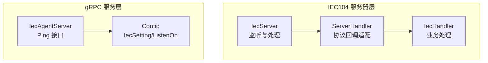
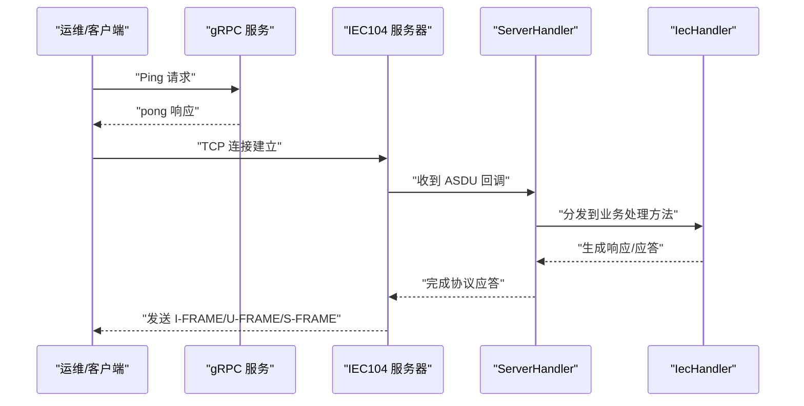
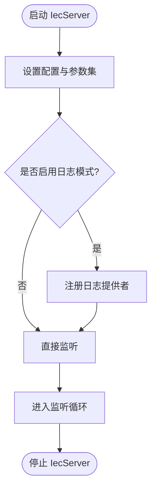
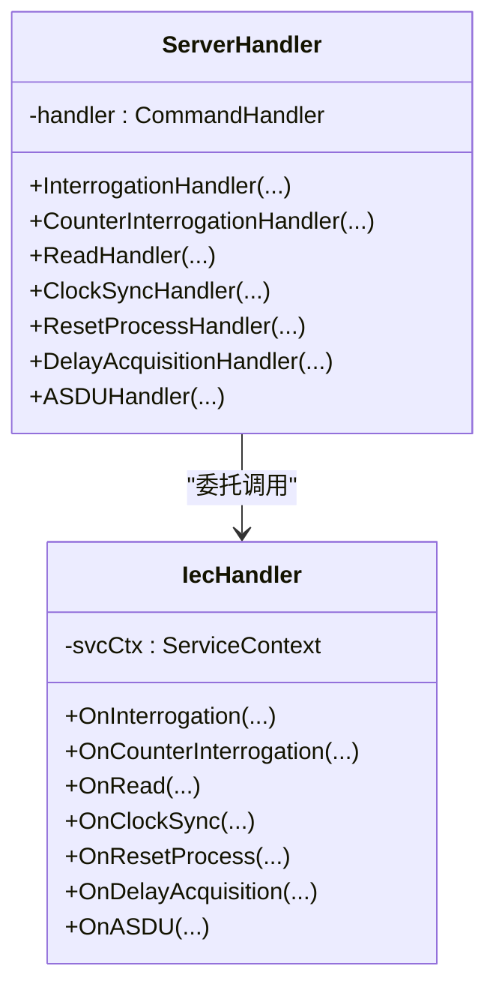
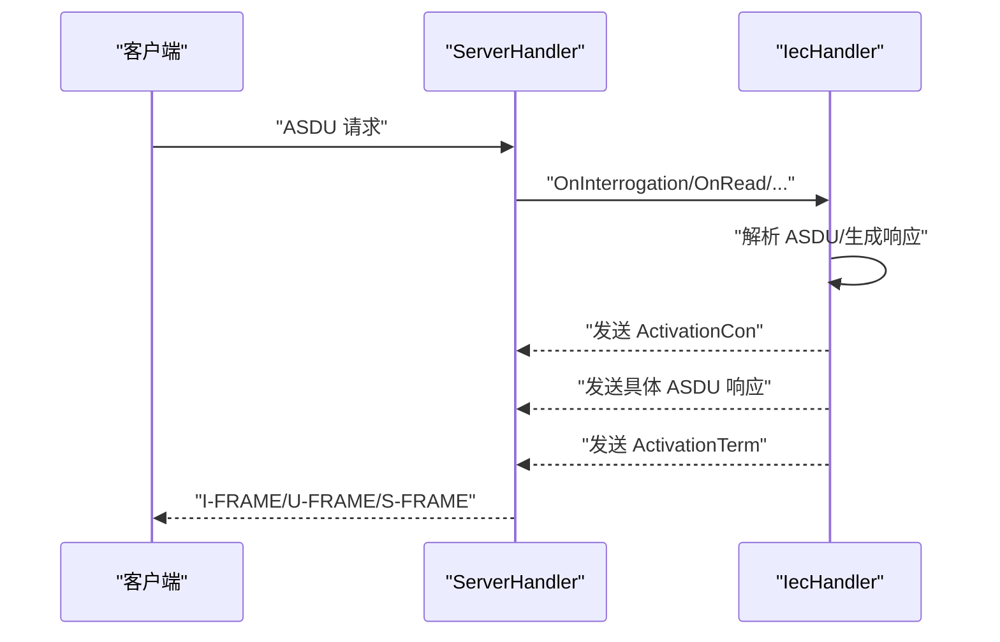
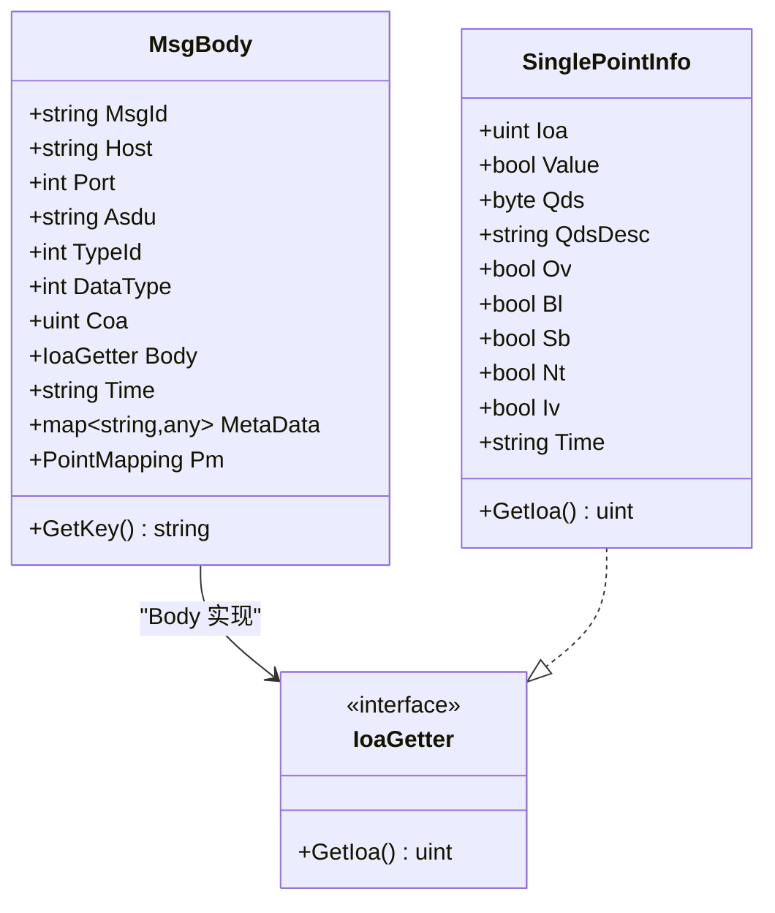
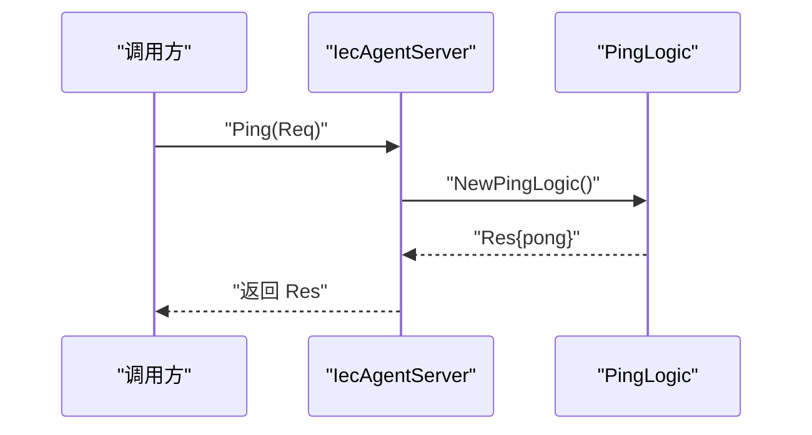
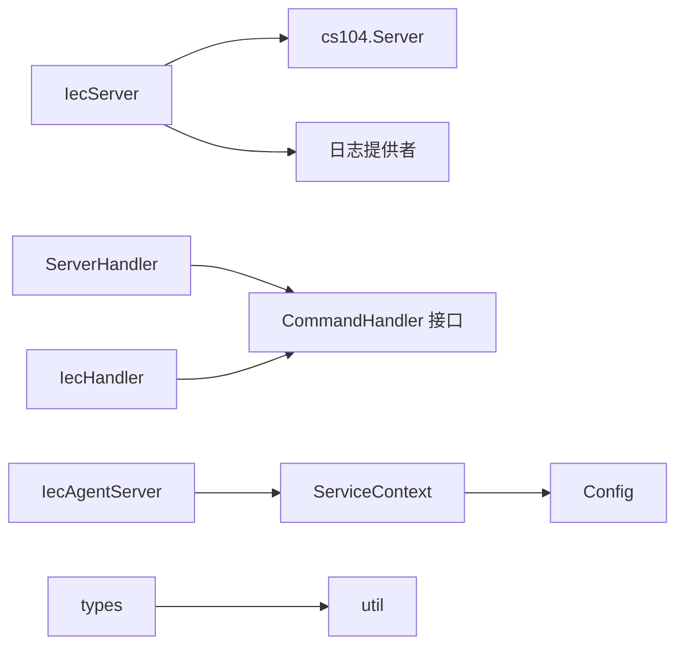

# IECAgent 服务器服务

<cite>
**本文引用的文件**
- [iecagent.go](file://app/iecagent/iecagent.go)
- [iecagent.yaml](file://app/iecagent/etc/iecagent.yaml)
- [config.go](file://app/iecagent/internal/config/config.go)
- [servicecontext.go](file://app/iecagent/internal/svc/servicecontext.go)
- [iecagentserver.go](file://app/iecagent/internal/server/iecagentserver.go)
- [iechandler.go](file://app/iecagent/internal/iec/iechandler.go)
- [handler.go](file://common/iec104/server/handler.go)
- [iecServer.go](file://common/iec104/server/iecServer.go)
- [types.go](file://common/iec104/types/types.go)
- [util.go](file://common/iec104/util/util.go)
- [iecagent.proto](file://app/iecagent/iecagent.proto)
</cite>

## 目录
1. [简介](#简介)
2. [项目结构](#项目结构)
3. [核心组件](#核心组件)
4. [架构总览](#架构总览)
5. [详细组件分析](#详细组件分析)
6. [依赖分析](#依赖分析)
7. [性能考虑](#性能考虑)
8. [故障排查指南](#故障排查指南)
9. [结论](#结论)
10. [附录](#附录)

## 简介
本技术文档面向 IECAgent 服务器服务，系统性阐述其作为 IEC 60870-5-104（简称 IEC104）服务器端的设备接入能力，覆盖以下方面：
- 客户端连接管理：TCP 监听、连接生命周期与日志记录
- ASDU 消息处理：各类 IEC104 应用服务数据单元（ASDU）的解析与响应生成
- 设备状态监控：通过 ASDU 类型映射与质量描述工具进行状态与告警信息的结构化输出
- 会话管理机制：基于 IEC104 协议的连接、确认、激活、停止等控制流程
- 协议实现细节：I-FRAME/U-FRAME/S-FRAME 的处理边界、ASDU 类型识别与应答序列
- 异常断线恢复与连接超时策略：结合日志模式与协议栈行为
- 性能优化策略：批量处理、质量位检查、模板化 Topic 生成
- 实际代码示例路径：设备接入流程、消息收发处理、状态查询接口

## 项目结构
IECAgent 由两部分组成：
- IEC104 服务器层：负责监听 TCP 端口、接收 IEC104 报文、分发到业务处理器
- gRPC 服务层：提供 Ping 接口，便于外部系统健康检查与状态查询

**图表来源**
- [iecServer.go:17-37](file://common/iec104/server/iecServer.go#L17-L37)
- [handler.go:8-59](file://common/iec104/server/handler.go#L8-L59)
- [iechandler.go:15-123](file://app/iecagent/internal/iec/iechandler.go#L15-L123)
- [iecagentserver.go:15-29](file://app/iecagent/internal/server/iecagentserver.go#L15-L29)
- [config.go:5-13](file://app/iecagent/internal/config/config.go#L5-L13)

**章节来源**
- [iecagent.go:30-58](file://app/iecagent/iecagent.go#L30-L58)
- [iecagent.yaml:1-14](file://app/iecagent/etc/iecagent.yaml#L1-L14)

## 核心组件
- IecServer：封装底层 cs104 服务器，负责监听、配置参数设置、日志提供者注册与启停
- ServerHandler：将 IEC104 协议回调适配为业务接口 CommandHandler
- IecHandler：实现具体业务逻辑，包括总召、计数器查询、读定值、时钟同步、进程重置、延迟获取、控制命令等
- IecAgentServer：提供 gRPC Ping 接口，便于外部调用与健康检查
- 配置模块：统一承载 IEC104 服务器监听地址、端口、日志开关以及 gRPC 监听地址

**章节来源**
- [iecServer.go:12-37](file://common/iec104/server/iecServer.go#L12-L37)
- [handler.go:8-59](file://common/iec104/server/handler.go#L8-L59)
- [iechandler.go:15-123](file://app/iecagent/internal/iec/iechandler.go#L15-L123)
- [iecagentserver.go:15-29](file://app/iecagent/internal/server/iecagentserver.go#L15-L29)
- [config.go:5-13](file://app/iecagent/internal/config/config.go#L5-L13)

## 架构总览
IECAgent 启动时同时启动两个服务：
- gRPC 服务：注册 IecAgent 服务，提供 Ping 接口
- IEC104 服务器：注册 ServerHandler，绑定 IecHandler，开始监听指定地址与端口

**图表来源**
- [iecagent.go:41-57](file://app/iecagent/iecagent.go#L41-L57)
- [handler.go:33-59](file://common/iec104/server/handler.go#L33-L59)
- [iechandler.go:25-123](file://app/iecagent/internal/iec/iechandler.go#L25-L123)

## 详细组件分析

### IEC104 服务器与连接管理
- 监听与配置
  - 使用默认配置与宽参数集，支持日志模式与自定义日志提供者
  - 监听地址由配置 Host 与 Port 组合
- 日志与可观测性
  - 可开启日志模式，将连接事件、协议交互写入日志上下文
- 生命周期
  - Start：开始监听并处理连接
  - Stop：关闭服务器

**图表来源**
- [iecServer.go:17-37](file://common/iec104/server/iecServer.go#L17-L37)

**章节来源**
- [iecServer.go:17-37](file://common/iec104/server/iecServer.go#L17-L37)
- [iecagent.yaml:10-13](file://app/iecagent/etc/iecagent.yaml#L10-L13)

### 协议回调适配与业务处理
- ServerHandler 将 IEC104 协议层回调映射为业务接口 CommandHandler
- IecHandler 实现具体业务方法，包括：
  - 总召唤、计数器查询、读定值、时钟同步、进程重置、延迟获取、控制命令
  - 对每个请求均发送“激活确认”与“激活终止”镜像应答，符合 IEC104 规范

**图表来源**
- [handler.go:8-59](file://common/iec104/server/handler.go#L8-L59)
- [iechandler.go:15-123](file://app/iecagent/internal/iec/iechandler.go#L15-L123)

**章节来源**
- [handler.go:16-59](file://common/iec104/server/handler.go#L16-L59)
- [iechandler.go:25-123](file://app/iecagent/internal/iec/iechandler.go#L25-L123)

### ASDU 解析与响应生成
- 总召唤与计数器查询：构造多条单点信息或计数量信息，并发送激活确认/终止
- 读定值：根据 IOA 返回测量值（含时间戳与质量描述）
- 时钟同步：发送激活确认，随后下发时钟同步命令，最后发送激活终止
- 进程重置/延迟获取：发送激活确认，下发对应命令，再发送激活终止
- 控制命令：解析 ASDU 中的单命令，随机生成结果并回发单命令确认

**图表来源**
- [handler.go:33-59](file://common/iec104/server/handler.go#L33-L59)
- [iechandler.go:25-123](file://app/iecagent/internal/iec/iechandler.go#L25-L123)

**章节来源**
- [iechandler.go:25-123](file://app/iecagent/internal/iec/iechandler.go#L25-L123)

### 设备状态监控与数据模型
- 数据模型：types 包提供多种 ASDU 信息体结构（单点、双点、测量值、计数量、事件等），并实现 IoaGetter 接口
- 质量位工具：util 提供质量描述符的判断与字符串化，便于状态监控与告警
- 主题生成：支持基于模板的 Topic 生成，确保合法的订阅主题

**图表来源**
- [types.go:17-58](file://common/iec104/types/types.go#L17-L58)
- [types.go:62-77](file://common/iec104/types/types.go#L62-L77)
- [util.go:13-93](file://common/iec104/util/util.go#L13-L93)

**章节来源**
- [types.go:17-323](file://common/iec104/types/types.go#L17-L323)
- [util.go:13-242](file://common/iec104/util/util.go#L13-L242)

### 会话管理与连接超时
- 连接生命周期：由 IEC104 服务器层管理，支持连接丢失事件回调
- 日志模式：可通过配置开启，便于定位连接与协议问题
- 超时与恢复：当前实现以日志与协议栈行为为主；建议在上层结合业务需求增加心跳、重连与退避策略

**章节来源**
- [iecServer.go:17-29](file://common/iec104/server/iecServer.go#L17-L29)
- [iecagent.yaml:10-13](file://app/iecagent/etc/iecagent.yaml#L10-L13)

### gRPC 服务与状态查询接口
- IecAgentServer 提供 Ping 接口，便于外部系统进行健康检查
- 配置中包含 gRPC 监听地址与日志级别

**图表来源**
- [iecagentserver.go:26-29](file://app/iecagent/internal/server/iecagentserver.go#L26-L29)
- [iecagent.proto:6-15](file://app/iecagent/iecagent.proto#L6-L15)

**章节来源**
- [iecagentserver.go:15-29](file://app/iecagent/internal/server/iecagentserver.go#L15-L29)
- [iecagent.proto:1-16](file://app/iecagent/iecagent.proto#L1-L16)

## 依赖分析
- IecServer 依赖 cs104 服务器与 IEC104 日志提供者
- ServerHandler 依赖 CommandHandler 接口，IecHandler 实现该接口
- IecAgentServer 依赖 ServiceContext 与配置
- types/util 为协议数据建模与质量描述提供支撑

**图表来源**
- [iecServer.go:3-29](file://common/iec104/server/iecServer.go#L3-L29)
- [handler.go:8-14](file://common/iec104/server/handler.go#L8-L14)
- [iechandler.go:15-23](file://app/iecagent/internal/iec/iechandler.go#L15-L23)
- [iecagentserver.go:15-24](file://app/iecagent/internal/server/iecagentserver.go#L15-L24)
- [servicecontext.go:5-13](file://app/iecagent/internal/svc/servicecontext.go#L5-L13)
- [types.go:17-58](file://common/iec104/types/types.go#L17-L58)
- [util.go:13-93](file://common/iec104/util/util.go#L13-L93)

**章节来源**
- [iecServer.go:3-29](file://common/iec104/server/iecServer.go#L3-L29)
- [handler.go:8-14](file://common/iec104/server/handler.go#L8-L14)
- [iechandler.go:15-23](file://app/iecagent/internal/iec/iechandler.go#L15-L23)
- [iecagentserver.go:15-24](file://app/iecagent/internal/server/iecagentserver.go#L15-L24)
- [servicecontext.go:5-13](file://app/iecagent/internal/svc/servicecontext.go#L5-L13)
- [types.go:17-58](file://common/iec104/types/types.go#L17-L58)
- [util.go:13-93](file://common/iec104/util/util.go#L13-L93)

## 性能考虑
- 批量处理：在总召唤场景中，可一次性生成多条信息对象，减少往返次数
- 质量位检查：利用 util 工具快速判断质量描述符，避免无效数据传播
- 模板化 Topic：通过模板生成合法 Topic，降低字符串拼接与校验开销
- 日志模式：仅在调试阶段开启，生产环境建议关闭以降低 I/O 压力

[本节为通用指导，无需列出章节来源]

## 故障排查指南
- 连接失败
  - 检查 IEC104 监听地址与端口配置
  - 开启日志模式，观察连接与协议交互
- 协议异常
  - 确认激活确认/终止应答是否成对出现
  - 核对 ASDU 类型与信息对象地址（IOA）是否匹配
- 状态不一致
  - 利用质量描述符工具检查状态位
  - 校验 Topic 生成规则，确保无非法字符与重复斜杠

**章节来源**
- [iecagent.yaml:10-13](file://app/iecagent/etc/iecagent.yaml#L10-L13)
- [util.go:55-93](file://common/iec104/util/util.go#L55-L93)
- [util.go:197-241](file://common/iec104/util/util.go#L197-L241)

## 结论
IECAgent 服务器服务通过清晰的分层设计，实现了 IEC104 协议的完整接入与业务扩展。其核心在于：
- 服务器层提供稳定的 TCP 与协议处理能力
- 业务层以 Handler 为核心，易于扩展新的 ASDU 类型与控制命令
- 配置与日志体系保障了部署与运维的灵活性
建议在生产环境中结合心跳、重连与退避策略进一步增强鲁棒性，并持续完善状态监控与告警体系。

[本节为总结性内容，无需列出章节来源]

## 附录

### 启动流程与配置要点
- 启动入口：加载配置、初始化 gRPC 与 IEC104 服务并加入同一服务组
- 配置项：gRPC 监听地址、IEC104 监听地址与端口、日志模式

**章节来源**
- [iecagent.go:30-58](file://app/iecagent/iecagent.go#L30-L58)
- [iecagent.yaml:1-14](file://app/iecagent/etc/iecagent.yaml#L1-L14)
- [config.go:5-13](file://app/iecagent/internal/config/config.go#L5-L13)

### 关键代码示例路径
- 设备接入流程（IEC104 服务器启动与注册）
  - [iecagent.go:41-57](file://app/iecagent/iecagent.go#L41-L57)
- 消息收发处理（总召唤/读定值/时钟同步等）
  - [iechandler.go:25-123](file://app/iecagent/internal/iec/iechandler.go#L25-L123)
  - [handler.go:33-59](file://common/iec104/server/handler.go#L33-L59)
- 状态查询接口（gRPC Ping）
  - [iecagentserver.go:26-29](file://app/iecagent/internal/server/iecagentserver.go#L26-L29)
  - [iecagent.proto:6-15](file://app/iecagent/iecagent.proto#L6-L15)