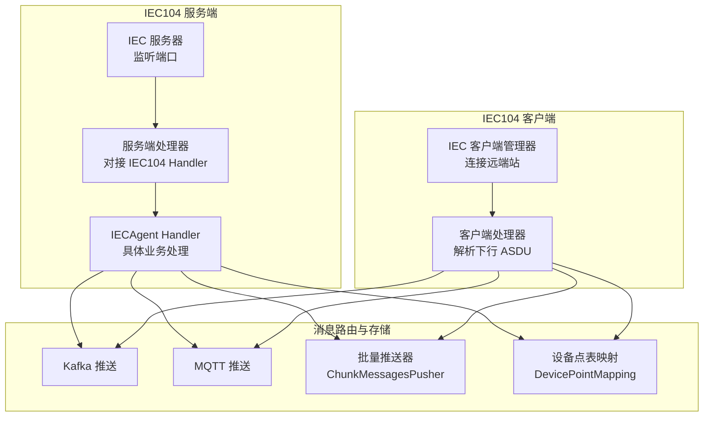
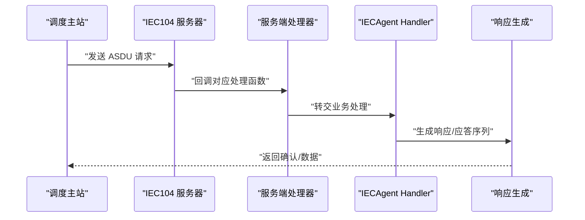
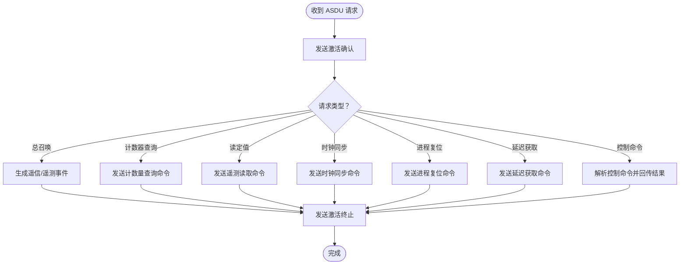
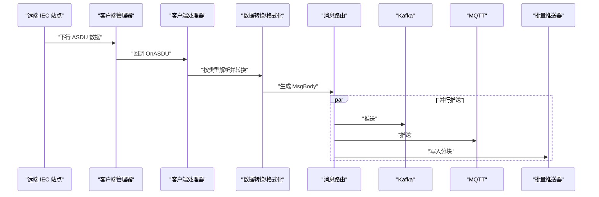
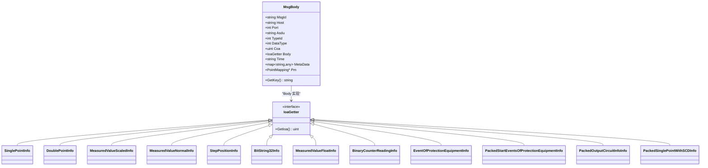
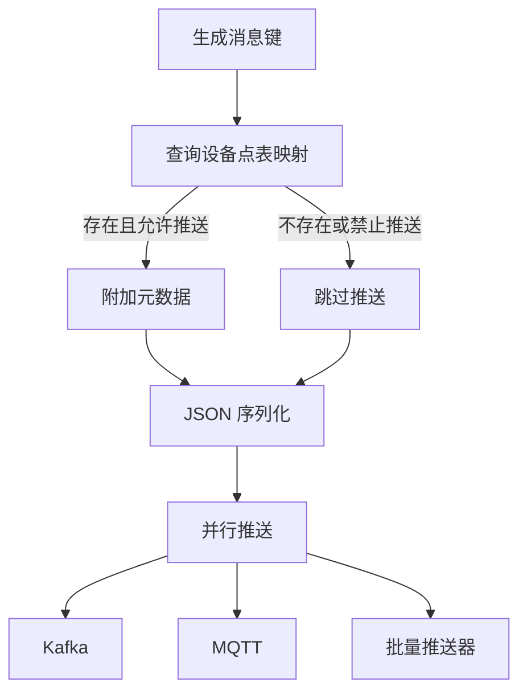
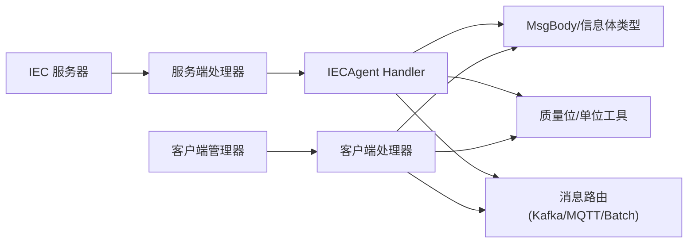

# 消息处理流程

<cite>
**本文引用的文件**
- [app/iecagent/internal/iec/iechandler.go](file://app/iecagent/internal/iec/iechandler.go)
- [common/iec104/server/iecServer.go](file://common/iec104/server/iecServer.go)
- [common/iec104/server/handler.go](file://common/iec104/server/handler.go)
- [app/iecagent/internal/config/config.go](file://app/iecagent/internal/config/config.go)
- [app/iecagent/etc/iecagent.yaml](file://app/iecagent/etc/iecagent.yaml)
- [app/ieccaller/internal/iec/clienthandler.go](file://app/ieccaller/internal/iec/clienthandler.go)
- [app/ieccaller/internal/svc/servicecontext.go](file://app/ieccaller/internal/svc/servicecontext.go)
- [common/iec104/types/types.go](file://common/iec104/types/types.go)
- [common/iec104/util/util.go](file://common/iec104/util/util.go)
- [common/executorx/chunkmessagespusher.go](file://common/executorx/chunkmessagespusher.go)
- [docs/iec104-protocol.md](file://docs/iec104-protocol.md)
</cite>

## 目录
1. [简介](#简介)
2. [项目结构](#项目结构)
3. [核心组件](#核心组件)
4. [架构总览](#架构总览)
5. [详细组件分析](#详细组件分析)
6. [依赖关系分析](#依赖关系分析)
7. [性能考量](#性能考量)
8. [故障排查指南](#故障排查指南)
9. [结论](#结论)

## 简介
本文件面向 IECAgent 服务中的消息处理流程，系统性阐述 IEC 60870-5-104（IEC104）协议在本项目中的实现与应用，覆盖 ASDU 消息的接收、解析、验证与响应生成；详述不同 ASDU 类型（遥测、遥信、遥控、参数设置等）的处理逻辑；并给出消息路由、数据转换与格式化、消息缓存、批量处理与异步响应的优化策略。文档同时结合客户端侧的处理链路，帮助读者建立端到端的消息处理视图。

## 项目结构
IECAgent 作为服务端，负责监听 IEC104 端口、接收来自调度主站的 ASDU 请求，并按需生成响应；同时通过客户端模块将解析后的 ASDU 数据转发至下游（Kafka/MQTT/批量推送/数据库映射等）。整体结构如下：

图表来源
- [common/iec104/server/iecServer.go:17-33](file://common/iec104/server/iecServer.go#L17-L33)
- [common/iec104/server/handler.go:33-59](file://common/iec104/server/handler.go#L33-L59)
- [app/iecagent/internal/iec/iechandler.go:25-123](file://app/iecagent/internal/iec/iechandler.go#L25-L123)
- [app/ieccaller/internal/iec/clienthandler.go:94-140](file://app/ieccaller/internal/iec/clienthandler.go#L94-L140)
- [app/ieccaller/internal/svc/servicecontext.go:144-244](file://app/ieccaller/internal/svc/servicecontext.go#L144-L244)

章节来源
- [app/iecagent/etc/iecagent.yaml:10-14](file://app/iecagent/etc/iecagent.yaml#L10-L14)
- [app/iecagent/internal/config/config.go:5-13](file://app/iecagent/internal/config/config.go#L5-L13)

## 核心组件
- IEC104 服务端
  - IEC 服务器：负责监听指定主机与端口，承载 IEC104 会话与帧处理。
  - 服务端处理器：将 IEC104 回调映射到业务处理器接口。
  - IECAgent Handler：实现各类 ASDU 的业务处理与响应生成。
- IEC104 客户端
  - 客户端管理器：维护远端站点连接与任务并发执行。
  - 客户端处理器：解析下行 ASDU，按类型转换为统一 MsgBody 并推送。
- 消息路由与存储
  - Kafka/MQTT 推送：根据配置将消息投递到消息队列或主题。
  - 批量推送器：基于字节大小的分块聚合，降低网络与下游压力。
  - 设备点表映射：根据 stationId/coa/ioa 决定是否推送及附加元数据。

章节来源
- [common/iec104/server/iecServer.go:17-33](file://common/iec104/server/iecServer.go#L17-L33)
- [common/iec104/server/handler.go:16-31](file://common/iec104/server/handler.go#L16-L31)
- [app/iecagent/internal/iec/iechandler.go:25-123](file://app/iecagent/internal/iec/iechandler.go#L25-L123)
- [app/ieccaller/internal/iec/clienthandler.go:94-140](file://app/ieccaller/internal/iec/clienthandler.go#L94-L140)
- [app/ieccaller/internal/svc/servicecontext.go:144-244](file://app/ieccaller/internal/svc/servicecontext.go#L144-L244)

## 架构总览
IECAgent 的消息处理分为“服务端处理”和“客户端处理”两条主线：
- 服务端处理（IECAgent Handler）：接收来自调度主站的请求（总召、计数器查询、读定值、时钟同步、进程复位、延迟获取、控制命令），按类型生成响应或应答序列。
- 客户端处理（ClientCall）：接收来自远端 IEC 站点的 ASDU 数据，解析为统一 MsgBody，进行质量位解析、单位换算、时间戳标准化，随后异步并行推送至 Kafka/MQTT/批量通道。

图表来源
- [common/iec104/server/iecServer.go:31-33](file://common/iec104/server/iecServer.go#L31-L33)
- [common/iec104/server/handler.go:33-59](file://common/iec104/server/handler.go#L33-L59)
- [app/iecagent/internal/iec/iechandler.go:25-123](file://app/iecagent/internal/iec/iechandler.go#L25-L123)

## 详细组件分析

### 服务端 Handler：ASDU 接收与响应
IECAgent 的 Handler 实现了 IEC104 服务端回调接口的关键方法，分别处理以下请求：
- 总召唤（Interrogation）
- 计数器查询（Counter Interrogation）
- 读定值（Read）
- 时钟同步（Clock Sync）
- 进程复位（Reset Process）
- 延迟获取（Delay Acquisition）
- 控制命令（ASDU）

每类请求均遵循“发送激活确认 -> 生成响应 -> 发送激活终止”的标准序列，确保与 IEC104 协议一致。

图表来源
- [app/iecagent/internal/iec/iechandler.go:25-123](file://app/iecagent/internal/iec/iechandler.go#L25-L123)

章节来源
- [app/iecagent/internal/iec/iechandler.go:25-123](file://app/iecagent/internal/iec/iechandler.go#L25-L123)

### 客户端处理：ASDU 解析与路由
客户端处理链路将远端站点的下行 ASDU 解析为统一 MsgBody，并进行数据转换与格式化：
- 类型识别：根据 ASDU TypeId 映射到 DataType（单点、双点、规一化遥测、短浮点、步位置、累计量、保护事件等）。
- 数据转换：拷贝字段、解析质量位（QDS/QDP）、计算 NVA（规一化值对应的浮点值）、生成时间字符串。
- 路由推送：异步并行推送至 Kafka、MQTT、批量推送器；可选地附加设备点表映射元数据。

图表来源
- [app/ieccaller/internal/iec/clienthandler.go:94-140](file://app/ieccaller/internal/iec/clienthandler.go#L94-L140)
- [app/ieccaller/internal/iec/clienthandler.go:142-536](file://app/ieccaller/internal/iec/clienthandler.go#L142-L536)
- [app/ieccaller/internal/svc/servicecontext.go:144-244](file://app/ieccaller/internal/svc/servicecontext.go#L144-L244)

章节来源
- [app/ieccaller/internal/iec/clienthandler.go:94-140](file://app/ieccaller/internal/iec/clienthandler.go#L94-L140)
- [app/ieccaller/internal/iec/clienthandler.go:142-536](file://app/ieccaller/internal/iec/clienthandler.go#L142-L536)
- [app/ieccaller/internal/svc/servicecontext.go:144-244](file://app/ieccaller/internal/svc/servicecontext.go#L144-L244)

### 数据模型与类型映射
MsgBody 作为统一的数据载体，承载 ASDU 的关键字段与解析后的结构化体。各 ASDU 类型对应的信息体结构在 types 中定义，util 提供质量位解析与单位换算工具。

图表来源
- [common/iec104/types/types.go:17-58](file://common/iec104/types/types.go#L17-L58)
- [common/iec104/types/types.go:62-322](file://common/iec104/types/types.go#L62-L322)

章节来源
- [common/iec104/types/types.go:17-58](file://common/iec104/types/types.go#L17-L58)
- [common/iec104/types/types.go:62-322](file://common/iec104/types/types.go#L62-L322)
- [docs/iec104-protocol.md:166-202](file://docs/iec104-protocol.md#L166-L202)

### 消息路由与格式化
- 主题生成：利用模板规则根据 MsgBody 动态生成 MQTT 主题，支持校验与占位符解析。
- 质量位解析：将 QDS/QDP 转换为描述字符串与布尔标志，便于上层消费与告警。
- 规一化值换算：将规一化值转换为浮点数，便于统一展示与比较。
- 时间戳标准化：统一使用微秒级时间字符串，保证跨系统一致性。

章节来源
- [common/iec104/util/util.go:55-93](file://common/iec104/util/util.go#L55-L93)
- [common/iec104/util/util.go:137-175](file://common/iec104/util/util.go#L137-L175)
- [common/iec104/util/util.go:186-188](file://common/iec104/util/util.go#L186-L188)
- [common/iec104/util/util.go:197-241](file://common/iec104/util/util.go#L197-L241)
- [app/ieccaller/internal/iec/clienthandler.go:142-536](file://app/ieccaller/internal/iec/clienthandler.go#L142-L536)

### 消息缓存、批量处理与异步响应
- 设备点表映射缓存：根据 stationId/coa/ioa 查询映射关系，决定是否推送及附加元数据，减少重复查询。
- 异步并行推送：使用 mr.FinishVoid 将 Kafka/MQTT/批量写入并行化，提升吞吐。
- 批量推送器：基于字节阈值的分块聚合，降低网络与下游压力，提高传输效率。
- 并发控制：客户端侧通过 TaskRunner 控制任务并发度，避免过载。

图表来源
- [app/ieccaller/internal/svc/servicecontext.go:144-244](file://app/ieccaller/internal/svc/servicecontext.go#L144-L244)
- [common/executorx/chunkmessagespusher.go:17-44](file://common/executorx/chunkmessagespusher.go#L17-L44)

章节来源
- [app/ieccaller/internal/svc/servicecontext.go:144-244](file://app/ieccaller/internal/svc/servicecontext.go#L144-L244)
- [common/executorx/chunkmessagespusher.go:17-44](file://common/executorx/chunkmessagespusher.go#L17-L44)

## 依赖关系分析
- 服务端依赖
  - IEC104 服务器：负责底层网络与协议栈。
  - 服务端处理器：桥接 IEC104 回调与业务 Handler。
  - IECAgent Handler：实现具体业务逻辑与响应生成。
- 客户端依赖
  - 客户端管理器：维护连接与并发任务。
  - 客户端处理器：解析与转换数据。
  - 服务上下文：统一推送与缓存策略。
- 工具与类型
  - 类型定义：统一 MsgBody 与各类信息体。
  - 工具函数：质量位解析、单位换算、主题生成。

图表来源
- [common/iec104/server/iecServer.go:17-33](file://common/iec104/server/iecServer.go#L17-L33)
- [common/iec104/server/handler.go:16-31](file://common/iec104/server/handler.go#L16-L31)
- [app/iecagent/internal/iec/iechandler.go:25-123](file://app/iecagent/internal/iec/iechandler.go#L25-L123)
- [app/ieccaller/internal/iec/clienthandler.go:94-140](file://app/ieccaller/internal/iec/clienthandler.go#L94-L140)
- [app/ieccaller/internal/svc/servicecontext.go:144-244](file://app/ieccaller/internal/svc/servicecontext.go#L144-L244)

章节来源
- [common/iec104/server/iecServer.go:17-33](file://common/iec104/server/iecServer.go#L17-L33)
- [common/iec104/server/handler.go:16-31](file://common/iec104/server/handler.go#L16-L31)
- [app/iecagent/internal/iec/iechandler.go:25-123](file://app/iecagent/internal/iec/iechandler.go#L25-L123)
- [app/ieccaller/internal/iec/clienthandler.go:94-140](file://app/ieccaller/internal/iec/clienthandler.go#L94-L140)
- [app/ieccaller/internal/svc/servicecontext.go:144-244](file://app/ieccaller/internal/svc/servicecontext.go#L144-L244)

## 性能考量
- 并发与限流
  - 客户端侧通过 TaskRunner 控制并发，避免对远端站造成过大压力。
  - 服务端侧按请求类型快速生成响应，保持 IEC104 交互节奏。
- 批量与压缩
  - 批量推送器按字节阈值聚合，显著降低网络开销与下游压力。
  - Kafka/MQTT 推送采用异步并行，缩短端到端延迟。
- 缓存与去重
  - 设备点表映射缓存减少重复查询，提升路由决策效率。
- 资源关闭
  - 服务上下文提供统一关闭入口，确保资源释放。

## 故障排查指南
- IEC104 服务器无法启动
  - 检查配置项 Host/Port 与日志模式，确认监听地址与端口可用。
- 主题生成失败
  - 检查主题模板是否包含未解析占位符、是否以斜杠开头/结尾、是否存在连续斜杠。
- 推送失败
  - Kafka/MQTT 推送超时或失败时，查看对应客户端初始化与 Broker 地址配置。
- 批量推送异常
  - 检查分块字节阈值设置与下游服务承载能力，关注日志中的写入错误。
- 质量位与单位换算异常
  - 核对 QDS/QDP 描述生成逻辑与规一化值换算边界。

章节来源
- [app/iecagent/etc/iecagent.yaml:10-14](file://app/iecagent/etc/iecagent.yaml#L10-L14)
- [common/iec104/util/util.go:197-241](file://common/iec104/util/util.go#L197-L241)
- [app/ieccaller/internal/svc/servicecontext.go:186-242](file://app/ieccaller/internal/svc/servicecontext.go#L186-L242)

## 结论
IECAgent 的消息处理流程以 IEC104 协议为核心，结合统一的数据模型与并行化推送策略，实现了从请求接收、解析转换到多通道路由的完整闭环。通过设备点表映射缓存、批量推送与异步并行等优化手段，系统在保证协议合规的同时，兼顾了吞吐与稳定性。建议在生产环境中持续监控主题生成、推送耗时与批量聚合效果，并根据下游承载能力动态调整并发与分块阈值。