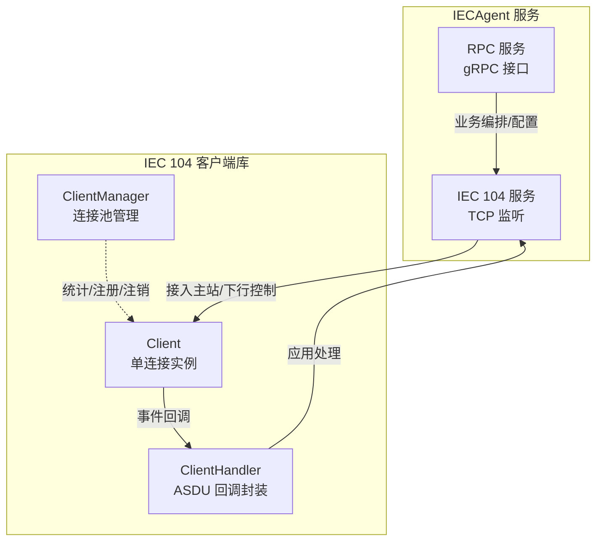
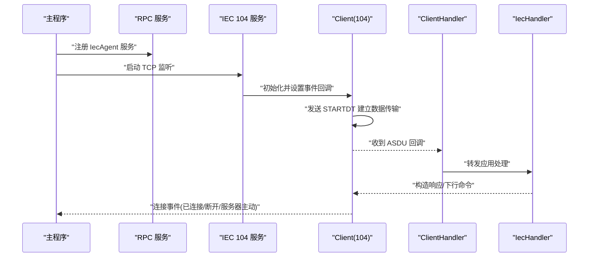
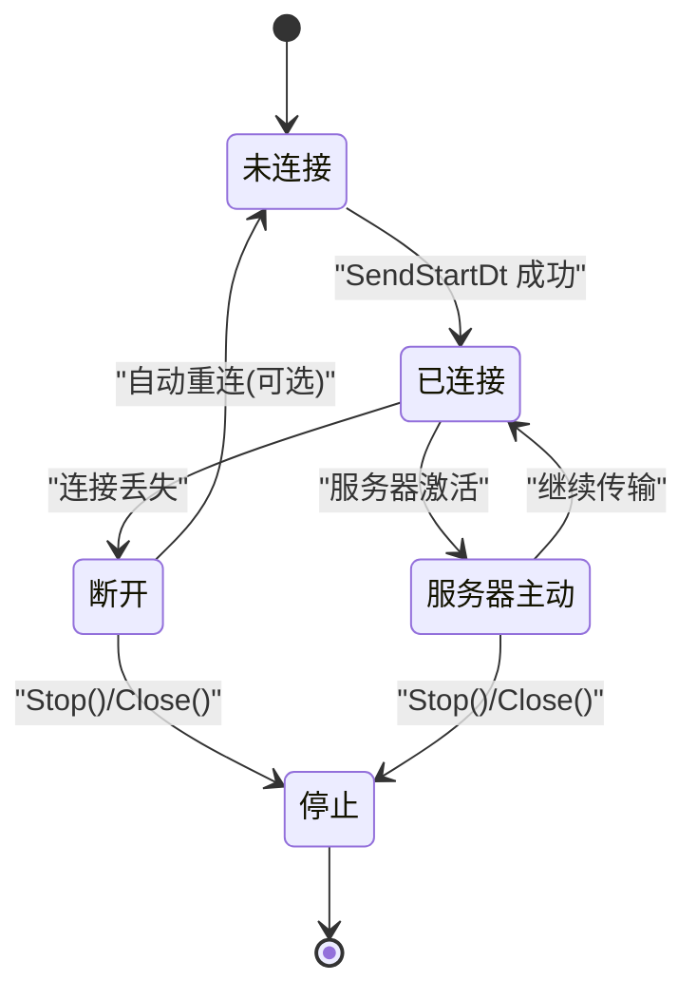
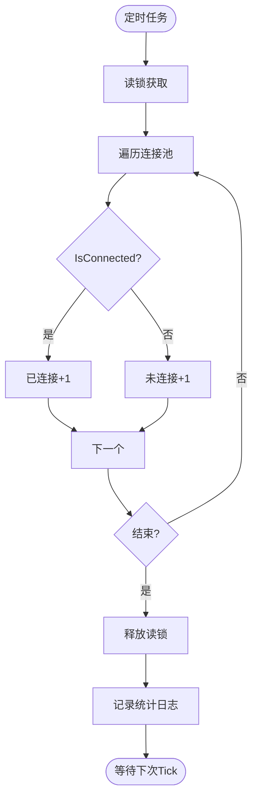
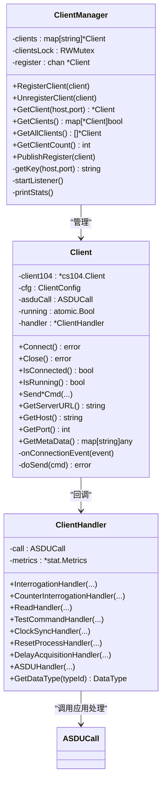
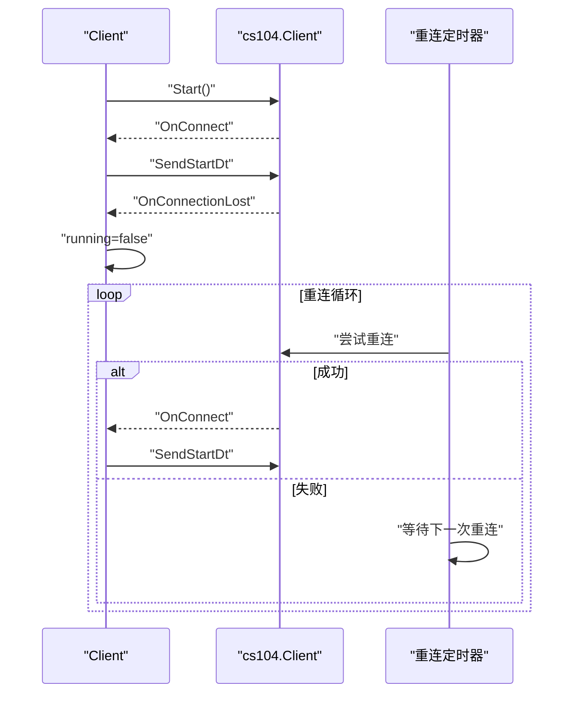
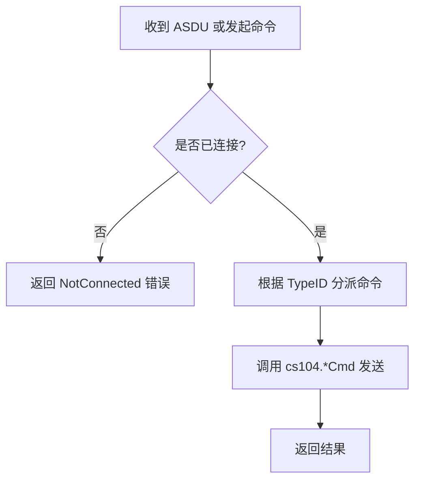
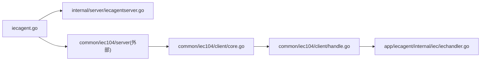

# 连接管理机制

<cite>
**本文引用的文件**
- [app/iecagent/iecagent.go](file://app/iecagent/iecagent.go)
- [app/iecagent/etc/iecagent.yaml](file://app/iecagent/etc/iecagent.yaml)
- [app/iecagent/internal/config/config.go](file://app/iecagent/internal/config/config.go)
- [app/iecagent/internal/svc/servicecontext.go](file://app/iecagent/internal/svc/servicecontext.go)
- [app/iecagent/internal/server/iecagentserver.go](file://app/iecagent/internal/server/iecagentserver.go)
- [app/iecagent/internal/iec/iechandler.go](file://app/iecagent/internal/iec/iechandler.go)
- [common/iec104/client/core.go](file://common/iec104/client/core.go)
- [common/iec104/client/clientmanager.go](file://common/iec104/client/clientmanager.go)
- [common/iec104/client/handle.go](file://common/iec104/client/handle.go)
- [common/iec104/client/interface.go](file://common/iec104/client/interface.go)
- [common/iec104/types/types.go](file://common/iec104/types/types.go)
</cite>

## 目录
1. [引言](#引言)
2. [项目结构](#项目结构)
3. [核心组件](#核心组件)
4. [架构总览](#架构总览)
5. [详细组件分析](#详细组件分析)
6. [依赖关系分析](#依赖关系分析)
7. [性能考量](#性能考量)
8. [故障排查指南](#故障排查指南)
9. [结论](#结论)

## 引言
本技术文档聚焦于 IECAgent 服务中的 TCP 连接管理机制，系统性阐述基于 IEC 60870-5-104 的客户端连接生命周期与状态管理，涵盖连接建立、状态监控、超时与异常断线恢复、连接池管理、并发处理与资源清理、心跳与自动重连策略等关键能力。文档以代码级分析为基础，辅以可视化图示，帮助读者快速理解并高效运维该连接管理子系统。

## 项目结构
IECAgent 服务由 RPC 服务与 IEC 104 服务两部分组成：
- RPC 服务：提供 gRPC 接口（当前仅 Ping），承载业务编排与外部交互。
- IEC 104 服务：监听本地 TCP 端口，接收远端 IEC 104 主站接入，完成 ASDU 上下行处理。

图表来源
- [app/iecagent/iecagent.go:53](file://app/iecagent/iecagent.go#L53)
- [common/iec104/client/clientmanager.go:11](file://common/iec104/client/clientmanager.go#L11)
- [common/iec104/client/core.go:49](file://common/iec104/client/core.go#L49)
- [common/iec104/client/handle.go:34](file://common/iec104/client/handle.go#L34)

章节来源
- [app/iecagent/iecagent.go:30-58](file://app/iecagent/iecagent.go#L30-L58)
- [app/iecagent/etc/iecagent.yaml:10-14](file://app/iecagent/etc/iecagent.yaml#L10-L14)
- [app/iecagent/internal/config/config.go:5-13](file://app/iecagent/internal/config/config.go#L5-L13)
- [app/iecagent/internal/svc/servicecontext.go:5-13](file://app/iecagent/internal/svc/servicecontext.go#L5-L13)

## 核心组件
- IEC 104 客户端 Client：封装单个远端主站连接，负责连接建立、发送/接收、事件回调、自动重连参数设置与资源释放。
- ClientManager：提供连接池管理能力，支持按 host:port 注册/注销、查询、统计在线/离线状态。
- ClientHandler：将底层 cs104 的回调映射到应用层接口，统一记录指标与耗时。
- IecHandler：IECAgent 侧对主站请求的应答处理（如总召、时钟同步、复位进程等）。
- 服务编排：RPC 服务与 IEC 104 服务同组启动，共享日志与拦截器。

章节来源
- [common/iec104/client/core.go:49](file://common/iec104/client/core.go#L49-L117)
- [common/iec104/client/clientmanager.go:11](file://common/iec104/client/clientmanager.go#L11-L145)
- [common/iec104/client/handle.go:34](file://common/iec104/client/handle.go#L34-L155)
- [app/iecagent/internal/iec/iechandler.go:25-123](file://app/iecagent/internal/iec/iechandler.go#L25-L123)
- [app/iecagent/iecagent.go:41-57](file://app/iecagent/iecagent.go#L41-L57)

## 架构总览
IECAgent 启动时同时启动 RPC 与 IEC 104 两个服务。IEC 104 服务监听配置的 Host/Port，接收主站连接；Client 负责与主站建立会话、发送 STARTDT/STOPDT 控制帧、处理连接事件；ClientHandler 将底层回调转交给应用层 IecHandler；ClientManager 提供连接池统计与状态观察。

图表来源
- [app/iecagent/iecagent.go:41-57](file://app/iecagent/iecagent.go#L41-L57)
- [common/iec104/client/core.go:120-147](file://common/iec104/client/core.go#L120-L147)
- [common/iec104/client/handle.go:39-109](file://common/iec104/client/handle.go#L39-L109)
- [app/iecagent/internal/iec/iechandler.go:25-123](file://app/iecagent/internal/iec/iechandler.go#L25-L123)

## 详细组件分析

### 连接生命周期管理
- 初始化与配置
  - ClientConfig 包含 Host、Port、AutoConnect、ReconnectInterval、LogEnable、MetaData 等字段，并提供 Validate 校验。
  - newClientOption 将配置转换为 cs104 客户端参数，设置参数集、自动重连开关与重连间隔，并添加远端服务器地址。
- 连接建立
  - initClient104 创建 cs104.Client 并设置日志提供者、连接事件回调（已连接/断开/服务器主动）。
  - OnConnectHandler 中调用 SendStartDt，进入数据传输阶段。
- 断开与关闭
  - OnConnectionLostHandler 标记运行状态为停止。
  - Close 先发送 STOPDT 再关闭底层连接，确保有序释放。
- 运行状态
  - IsRunning 通过原子布尔值反映运行态；IsConnected 查询底层连接状态。

图表来源
- [common/iec104/client/core.go:120-175](file://common/iec104/client/core.go#L120-L175)
- [common/iec104/client/core.go:254-267](file://common/iec104/client/core.go#L254-L267)

章节来源
- [common/iec104/client/core.go:19-37](file://common/iec104/client/core.go#L19-L37)
- [common/iec104/client/core.go:119-147](file://common/iec104/client/core.go#L119-L147)
- [common/iec104/client/core.go:161-175](file://common/iec104/client/core.go#L161-L175)

### 连接状态监控与统计
- ClientManager 提供以下能力：
  - 注册/注销：按 host:port 键管理 Client 实例。
  - 查询：GetClient、GetClients、GetAllClients、GetClientCount。
  - 统计：每分钟打印一次连接总数、已连接、未连接数量。
- Client 层面事件：
  - onConnectionEvent 输出连接事件日志，便于观测连接状态变化。

图表来源
- [common/iec104/client/clientmanager.go:117-144](file://common/iec104/client/clientmanager.go#L117-L144)

章节来源
- [common/iec104/client/clientmanager.go:35-68](file://common/iec104/client/clientmanager.go#L35-L68)
- [common/iec104/client/clientmanager.go:102-107](file://common/iec104/client/clientmanager.go#L102-L107)
- [common/iec104/client/clientmanager.go:117-144](file://common/iec104/client/clientmanager.go#L117-L144)
- [common/iec104/client/core.go:254-267](file://common/iec104/client/core.go#L254-L267)

### 连接池管理与并发处理
- ClientManager
  - 使用 map[string]*Client 存储连接，键为 host:port。
  - 使用 RWMutex 保证并发安全；使用带缓冲通道 register 降低注册竞争。
  - 提供 PublishRegister 与 startListener 协程化注册流程。
- 并发与资源
  - Client 内部使用 atomic.Bool 管理运行态，避免竞态。
  - ClientHandler 在每个回调中记录耗时指标，便于性能分析。

图表来源
- [common/iec104/client/clientmanager.go:11](file://common/iec104/client/clientmanager.go#L11-L145)
- [common/iec104/client/core.go:49](file://common/iec104/client/core.go#L49-L117)
- [common/iec104/client/handle.go:34](file://common/iec104/client/handle.go#L34-L155)
- [common/iec104/client/interface.go:5](file://common/iec104/client/interface.go#L5-L71)

章节来源
- [common/iec104/client/clientmanager.go:11](file://common/iec104/client/clientmanager.go#L11-L145)
- [common/iec104/client/core.go:49](file://common/iec104/client/core.go#L49-L117)
- [common/iec104/client/handle.go:34](file://common/iec104/client/handle.go#L34-L155)

### 自动重连与异常断线恢复
- 自动重连
  - newClientOption 设置 AutoReconnect 与 ReconnectInterval，使底层 cs104 在连接丢失后按策略重试。
- 断线恢复
  - OnConnectionLostHandler 将 running 置为 false，触发上层感知；若启用自动重连，底层将周期尝试重新连接。
- 连接事件
  - OnConnectHandler 发送 STARTDT，进入数据传输；OnServerActiveHandler 通知服务器主动激活事件。

图表来源
- [common/iec104/client/core.go:119-147](file://common/iec104/client/core.go#L119-L147)
- [common/iec104/client/core.go:269-283](file://common/iec104/client/core.go#L269-L283)

章节来源
- [common/iec104/client/core.go:119-147](file://common/iec104/client/core.go#L119-L147)
- [common/iec104/client/core.go:269-283](file://common/iec104/client/core.go#L269-L283)

### 心跳检测与数据传输
- 心跳/保活
  - Client 在 OnConnectHandler 中发送 STARTDT，维持数据链路活跃；无显式周期心跳帧发送逻辑。
- 数据传输
  - doSend 根据 TypeID 分派不同命令类型，统一通过 cs104 发送，返回错误或成功。
  - ClientHandler 在各回调中记录耗时指标，便于评估处理延迟。

图表来源
- [common/iec104/client/core.go:304-436](file://common/iec104/client/core.go#L304-L436)
- [common/iec104/client/handle.go:39-109](file://common/iec104/client/handle.go#L39-L109)

章节来源
- [common/iec104/client/core.go:130-144](file://common/iec104/client/core.go#L130-L144)
- [common/iec104/client/core.go:304-436](file://common/iec104/client/core.go#L304-L436)
- [common/iec104/client/handle.go:39-109](file://common/iec104/client/handle.go#L39-L109)

### 连接数限制与资源清理
- 连接数限制
  - ClientManager 以 host:port 为键存储连接，天然限制同一目标的重复连接；未见全局并发上限配置。
- 资源清理
  - Close 先发送 STOPDT 再 Close，确保有序释放；ClientManager 提供 UnregisterClient 清理注册表项。
  - 日志与指标：ClientManager 统计日志；ClientHandler 记录回调耗时指标。

章节来源
- [common/iec104/client/clientmanager.go:35-55](file://common/iec104/client/clientmanager.go#L35-L55)
- [common/iec104/client/core.go:166-170](file://common/iec104/client/core.go#L166-L170)
- [common/iec104/client/handle.go:41-108](file://common/iec104/client/handle.go#L41-L108)

### IEC 104 应用处理（IECAgent 侧）
- IecHandler 提供多种命令的应答处理模板（总召、计数器总召、读定值、时钟同步、复位进程、延迟获取、通用 ASDU 控制），便于扩展具体业务。
- 与 Client/ClientHandler 的协作：ClientHandler 将底层回调转交 IecHandler，IecHandler 返回响应或进一步下行命令。

章节来源
- [app/iecagent/internal/iec/iechandler.go:25-123](file://app/iecagent/internal/iec/iechandler.go#L25-L123)
- [common/iec104/client/handle.go:39-109](file://common/iec104/client/handle.go#L39-L109)

## 依赖关系分析
- IECAgent 启动时同时注册 RPC 与 IEC 104 服务，二者共享日志上下文与拦截器。
- IEC 104 服务通过 server2.NewIecServer 监听配置端口，使用 IecHandler 作为应用层处理。
- Client 依赖 cs104 库进行协议栈处理，ClientHandler 将回调桥接到应用层接口。

图表来源
- [app/iecagent/iecagent.go:41-57](file://app/iecagent/iecagent.go#L41-L57)
- [app/iecagent/internal/server/iecagentserver.go:15-24](file://app/iecagent/internal/server/iecagentserver.go#L15-L24)
- [common/iec104/client/core.go:119-147](file://common/iec104/client/core.go#L119-L147)
- [common/iec104/client/handle.go:34-109](file://common/iec104/client/handle.go#L34-L109)
- [app/iecagent/internal/iec/iechandler.go:25-123](file://app/iecagent/internal/iec/iechandler.go#L25-L123)

章节来源
- [app/iecagent/iecagent.go:41-57](file://app/iecagent/iecagent.go#L41-L57)
- [app/iecagent/etc/iecagent.yaml:10-14](file://app/iecagent/etc/iecagent.yaml#L10-L14)
- [app/iecagent/internal/config/config.go:5-13](file://app/iecagent/internal/config/config.go#L5-L13)

## 性能考量
- 指标采集：ClientHandler 在每个回调中记录耗时指标，便于定位慢回调与高延迟路径。
- 并发安全：ClientManager 使用读写锁与带缓冲通道，降低注册/查询竞争；Client 使用原子布尔值标记运行态。
- 日志与可观测性：ClientManager 定时统计连接状态；Client 输出连接事件日志；应用层 IecHandler 可结合业务埋点。

## 故障排查指南
- 连接无法建立
  - 检查配置 Host/Port 是否正确，端口是否开放。
  - 查看连接事件日志，确认 OnConnectHandler 是否触发。
- 连续断线
  - 检查 AutoReconnect 与 ReconnectInterval 配置。
  - 观察 ClientManager 统计日志，确认断线频率与恢复情况。
- 下行命令失败
  - 核对 doSend 分派逻辑与 TypeID 映射。
  - 检查 IsConnected 状态后再发送命令。
- 处理延迟高
  - 查看 ClientHandler 的指标记录，定位耗时较长的回调类型。

章节来源
- [common/iec104/client/core.go:254-267](file://common/iec104/client/core.go#L254-L267)
- [common/iec104/client/clientmanager.go:126-144](file://common/iec104/client/clientmanager.go#L126-L144)
- [common/iec104/client/core.go:304-436](file://common/iec104/client/core.go#L304-L436)
- [common/iec104/client/handle.go:41-108](file://common/iec104/client/handle.go#L41-L108)

## 结论
IECAgent 的连接管理以 Client 为核心，结合 ClientManager 提供连接池与统计能力，配合 ClientHandler 将底层回调映射至应用层处理。系统具备完善的连接事件回调、自动重连与有序资源释放机制，辅以指标与日志实现可观测性。建议在生产环境中结合业务需求完善全局连接数限制、心跳策略与更细粒度的错误分类处理，以进一步提升稳定性与可维护性。