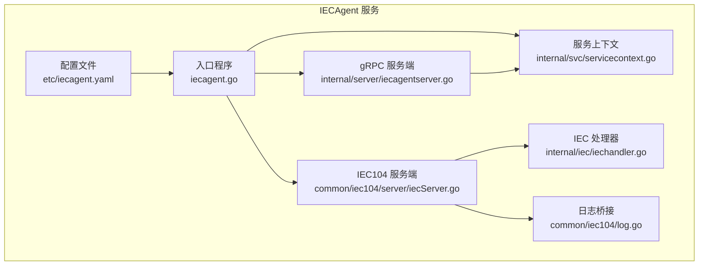
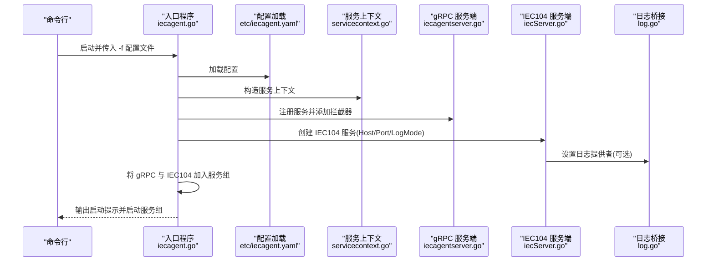
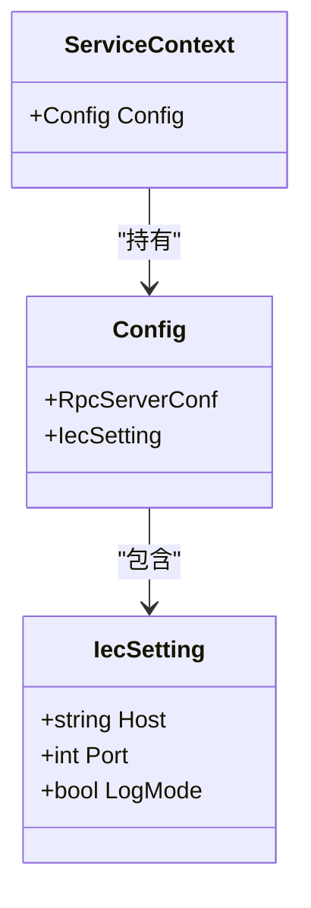
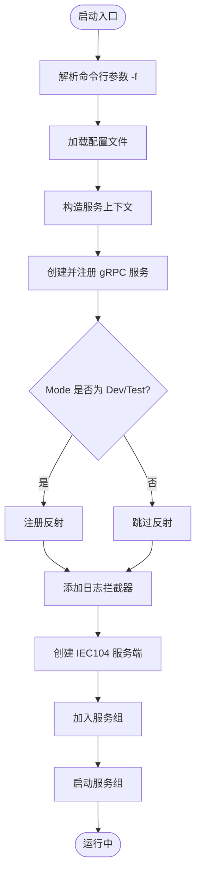
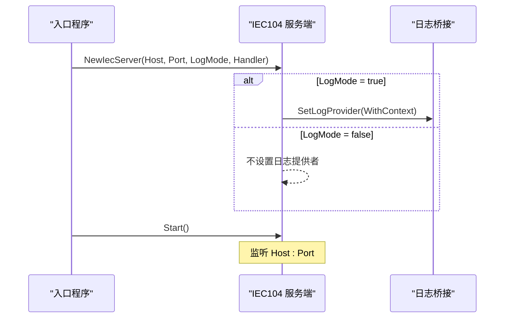
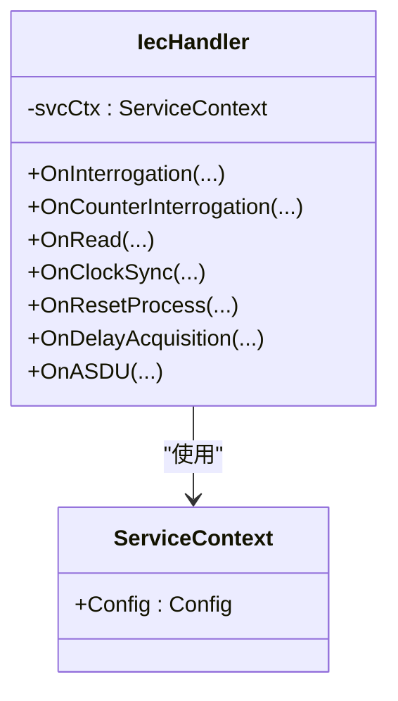
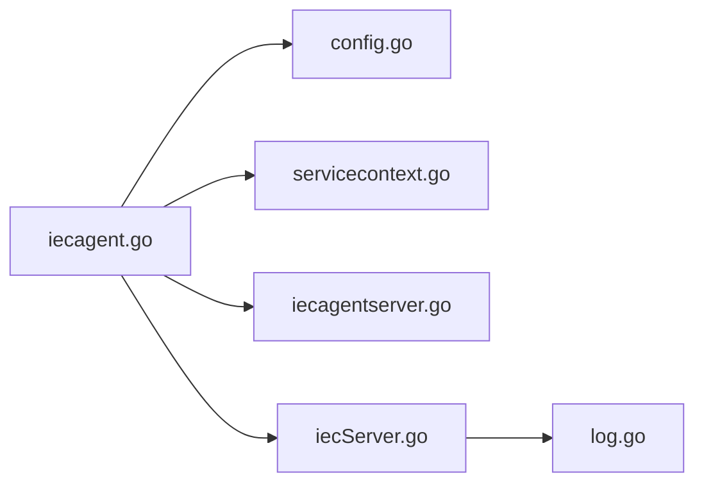

# 配置与启动

<cite>
**本文引用的文件**
- [app/iecagent/etc/iecagent.yaml](file://app/iecagent/etc/iecagent.yaml)
- [app/iecagent/internal/config/config.go](file://app/iecagent/internal/config/config.go)
- [app/iecagent/iecagent.go](file://app/iecagent/iecagent.go)
- [common/iec104/server/iecServer.go](file://common/iec104/server/iecServer.go)
- [common/iec104/log.go](file://common/iec104/log.go)
- [app/iecagent/internal/svc/servicecontext.go](file://app/iecagent/internal/svc/servicecontext.go)
- [app/iecagent/internal/iec/iechandler.go](file://app/iecagent/internal/iec/iechandler.go)
- [app/iecagent/internal/server/iecagentserver.go](file://app/iecagent/internal/server/iecagentserver.go)
- [common/tool/tool.go](file://common/tool/tool.go)
</cite>

## 目录
1. [简介](#简介)
2. [项目结构](#项目结构)
3. [核心组件](#核心组件)
4. [架构总览](#架构总览)
5. [详细组件分析](#详细组件分析)
6. [依赖分析](#依赖分析)
7. [性能考虑](#性能考虑)
8. [故障排查指南](#故障排查指南)
9. [结论](#结论)
10. [附录](#附录)

## 简介
本章节面向 IECAgent 服务的配置与启动，系统性说明配置文件结构、启动流程、网络与协议参数、运行模式、日志级别以及热更新与动态调整机制。读者可据此完成从本地开发到生产部署的完整配置与运维实践。

## 项目结构
IECAgent 服务位于应用目录 app/iecagent 下，采用 go-zero RPC 与 IEC 60870-5-104（CS104）服务端结合的双栈架构：gRPC RPC 服务负责业务接口，CS104 服务端负责 IEC104 通信。配置文件位于 etc/iecagent.yaml，运行入口为 iecagent.go。

**图表来源**
- [app/iecagent/etc/iecagent.yaml:1-14](file://app/iecagent/etc/iecagent.yaml#L1-L14)
- [app/iecagent/iecagent.go:30-58](file://app/iecagent/iecagent.go#L30-L58)
- [app/iecagent/internal/svc/servicecontext.go:5-13](file://app/iecagent/internal/svc/servicecontext.go#L5-L13)
- [app/iecagent/internal/server/iecagentserver.go:15-29](file://app/iecagent/internal/server/iecagentserver.go#L15-L29)
- [common/iec104/server/iecServer.go:12-37](file://common/iec104/server/iecServer.go#L12-L37)
- [app/iecagent/internal/iec/iechandler.go:15-23](file://app/iecagent/internal/iec/iechandler.go#L15-L23)
- [common/iec104/log.go:8-16](file://common/iec104/log.go#L8-L16)

**章节来源**
- [app/iecagent/etc/iecagent.yaml:1-14](file://app/iecagent/etc/iecagent.yaml#L1-L14)
- [app/iecagent/iecagent.go:30-58](file://app/iecagent/iecagent.go#L30-L58)

## 核心组件
- 配置模型：定义了 zrpc.RpcServerConf 与 IecSetting（IEC104 服务端参数），用于加载 etc/iecagent.yaml 并驱动服务启动。
- 启动入口：解析命令行参数（-f 指定配置文件），加载配置，初始化服务上下文，创建 gRPC 服务与 IEC104 服务，并加入统一服务组启动。
- IEC104 服务端：基于 go-iecp5/cs104，支持宽参数集、日志开关与自定义日志提供者。
- 日志桥接：将 CS104 内部日志桥接到 go-zero logx，便于统一管理。
- 服务上下文：承载配置，供 RPC 与 IEC 处理器使用。
- IEC 处理器：实现各类 ASDU 回调（总召、读、时钟同步、复位进程等），作为 IEC104 服务端的业务处理层。

**章节来源**
- [app/iecagent/internal/config/config.go:5-13](file://app/iecagent/internal/config/config.go#L5-L13)
- [app/iecagent/iecagent.go:30-58](file://app/iecagent/iecagent.go#L30-L58)
- [common/iec104/server/iecServer.go:17-37](file://common/iec104/server/iecServer.go#L17-L37)
- [common/iec104/log.go:8-16](file://common/iec104/log.go#L8-L16)
- [app/iecagent/internal/svc/servicecontext.go:5-13](file://app/iecagent/internal/svc/servicecontext.go#L5-L13)
- [app/iecagent/internal/iec/iechandler.go:15-23](file://app/iecagent/internal/iec/iechandler.go#L15-L23)

## 架构总览
下图展示 IECAgent 的启动与运行时交互：入口程序加载配置，分别创建 gRPC 与 IEC104 两个服务实例，统一加入服务组后启动；IEC104 服务端通过处理器回调实现业务逻辑。

**图表来源**
- [app/iecagent/iecagent.go:30-58](file://app/iecagent/iecagent.go#L30-L58)
- [app/iecagent/etc/iecagent.yaml:1-14](file://app/iecagent/etc/iecagent.yaml#L1-L14)
- [common/iec104/server/iecServer.go:17-37](file://common/iec104/server/iecServer.go#L17-L37)
- [common/iec104/log.go:12-16](file://common/iec104/log.go#L12-L16)

## 详细组件分析

### 配置文件结构与默认值
- 文件位置：app/iecagent/etc/iecagent.yaml
- 关键配置项与作用：
  - Name：服务名称，用于日志全局字段注入。
  - ListenOn：gRPC 监听地址与端口，决定 RPC 服务对外暴露的网络地址。
  - Mode：运行模式，影响反射注册与调试行为。
  - Log.Encoding/Path/Level：日志编码格式、输出路径与日志级别。
  - IecSetting.Host/Port/LogMode：IEC104 服务端监听地址、端口与日志开关。
- 默认值说明：
  - 若未显式设置，IEC104 服务端将使用配置中的 Host 与 Port；日志开关由 LogMode 控制。
  - gRPC 日志默认由 go-zero logx 管理，可通过 Log.* 调整。

**章节来源**
- [app/iecagent/etc/iecagent.yaml:1-14](file://app/iecagent/etc/iecagent.yaml#L1-L14)

### 配置模型与加载
- 配置结构：继承 zrpc.RpcServerConf，并扩展 IecSetting（Host、Port、LogMode）。
- 加载方式：入口程序通过 conf.MustLoad 读取 YAML 并填充 Config 结构体。
- 使用方式：服务上下文持有 Config，RPC 与 IEC104 服务均从该结构体读取参数。

**图表来源**
- [app/iecagent/internal/config/config.go:5-13](file://app/iecagent/internal/config/config.go#L5-L13)
- [app/iecagent/internal/svc/servicecontext.go:5-13](file://app/iecagent/internal/svc/servicecontext.go#L5-L13)

**章节来源**
- [app/iecagent/internal/config/config.go:5-13](file://app/iecagent/internal/config/config.go#L5-L13)
- [app/iecagent/iecagent.go:33-34](file://app/iecagent/iecagent.go#L33-L34)

### 启动流程与运行模式
- 命令行参数：-f 指向配置文件路径，默认 etc/iecagent.yaml。
- 启动步骤：
  - 解析参数并加载配置；
  - 构造服务上下文；
  - 创建并注册 gRPC 服务，按 Mode 条件注册反射；
  - 添加日志拦截器；
  - 创建 IEC104 服务端，绑定 Host/Port/LogMode；
  - 将 gRPC 与 IEC104 加入统一服务组并启动。
- 运行模式：
  - Dev/Test 模式下启用 gRPC 反射，便于本地调试；
  - 生产模式下关闭反射，减少暴露面。

**图表来源**
- [app/iecagent/iecagent.go:30-58](file://app/iecagent/iecagent.go#L30-L58)

**章节来源**
- [app/iecagent/iecagent.go:30-58](file://app/iecagent/iecagent.go#L30-L58)

### IEC104 服务端与协议参数
- 监听地址与端口：来源于配置 IecSetting.Host/Port。
- 日志模式：当 LogMode 为 true 时，启用 CS104 日志并桥接至 go-zero logx。
- 参数集：使用宽参数集（ParamsWide），满足更丰富的 ASDU 类型与质量描述。
- 生命周期：Start() 开始监听，Stop() 关闭连接。

**图表来源**
- [common/iec104/server/iecServer.go:17-37](file://common/iec104/server/iecServer.go#L17-L37)
- [common/iec104/log.go:12-16](file://common/iec104/log.go#L12-L16)

**章节来源**
- [common/iec104/server/iecServer.go:17-37](file://common/iec104/server/iecServer.go#L17-L37)

### 日志级别与输出
- gRPC 日志：通过 go-zero logx 管理，配置项 Log.Encoding/Path/Level 控制编码、路径与级别。
- IEC104 日志：当 LogMode 为 true 时，启用 CS104 内部日志并通过 log.go 桥接到 logx，便于统一采集与检索。
- 全局字段：入口程序为 logx 注入 app 名称字段，便于多服务聚合分析。

**章节来源**
- [app/iecagent/etc/iecagent.yaml:4-8](file://app/iecagent/etc/iecagent.yaml#L4-L8)
- [common/iec104/log.go:18-48](file://common/iec104/log.go#L18-L48)
- [app/iecagent/iecagent.go:51](file://app/iecagent/iecagent.go#L51)

### IEC 处理器与业务回调
- 处理器职责：实现各类 ASDU 回调（总召、计数器总召、读命令、时钟同步、复位进程、延时获取、通用 ASDU 等），作为 IEC104 服务端的业务接入点。
- 服务上下文：处理器通过 svcCtx 访问配置与业务资源。

**图表来源**
- [app/iecagent/internal/iec/iechandler.go:15-123](file://app/iecagent/internal/iec/iechandler.go#L15-L123)
- [app/iecagent/internal/svc/servicecontext.go:5-13](file://app/iecagent/internal/svc/servicecontext.go#L5-L13)

**章节来源**
- [app/iecagent/internal/iec/iechandler.go:25-123](file://app/iecagent/internal/iec/iechandler.go#L25-L123)

### gRPC 服务与健康检查
- 服务注册：入口程序将 IecAgentServer 注册到 gRPC 服务器。
- 反射注册：Dev/Test 模式下注册反射，便于本地调试与 SDK 生成。
- 健康检查：当前代码未内置健康检查端点，可在业务逻辑中扩展 Ping 接口或引入第三方健康检查方案。

**章节来源**
- [app/iecagent/iecagent.go:41-47](file://app/iecagent/iecagent.go#L41-L47)
- [app/iecagent/internal/server/iecagentserver.go:26-29](file://app/iecagent/internal/server/iecagentserver.go#L26-L29)

### 配置热更新与动态调整
- 当前实现：入口程序在启动时一次性加载配置并创建服务，未实现配置热更新或动态调整。
- 建议方案：
  - 引入配置中心（如 Nacos）与配置监听，变更时重建 IEC104 服务端或刷新日志级别。
  - 对 gRPC 服务端，可利用 go-zero 的服务组 Add/Remove 能力动态替换服务实例。
  - 对日志级别，可通过 logx 动态切换（需结合具体日志实现）。

[本节为通用建议，不直接分析具体文件，故不附加章节来源]

## 依赖分析
- 入口程序依赖配置模块、服务上下文、gRPC 服务端与 IEC104 服务端。
- IEC104 服务端依赖 go-iecp5/cs104 与日志桥接。
- 日志桥接依赖 go-zero logx。

**图表来源**
- [app/iecagent/iecagent.go:30-58](file://app/iecagent/iecagent.go#L30-L58)
- [app/iecagent/internal/config/config.go:5-13](file://app/iecagent/internal/config/config.go#L5-L13)
- [app/iecagent/internal/svc/servicecontext.go:5-13](file://app/iecagent/internal/svc/servicecontext.go#L5-L13)
- [app/iecagent/internal/server/iecagentserver.go:15-29](file://app/iecagent/internal/server/iecagentserver.go#L15-L29)
- [common/iec104/server/iecServer.go:12-37](file://common/iec104/server/iecServer.go#L12-L37)
- [common/iec104/log.go:8-16](file://common/iec104/log.go#L8-L16)

**章节来源**
- [app/iecagent/iecagent.go:30-58](file://app/iecagent/iecagent.go#L30-L58)

## 性能考虑
- IEC104 参数集：使用宽参数集（ParamsWide）可提升兼容性，但可能增加报文体积与处理开销，应根据实际网络与设备能力权衡。
- 日志级别：生产环境建议降低日志级别，避免高频 IEC 报文带来的 IO 压力。
- 服务组启动：统一启动与停止有助于资源回收与优雅退出，建议在容器编排中配合健康检查与重启策略。

[本节为通用建议，不直接分析具体文件，故不附加章节来源]

## 故障排查指南
- 启动失败（配置加载）：确认 -f 指向的配置文件存在且格式正确；检查 Name、ListenOn、IecSetting.Host/Port 等关键字段。
- gRPC 无法访问：核对 ListenOn 是否为 0.0.0.0 或容器网络可达；Dev/Test 模式下可使用反射辅助调试。
- IEC104 无法连接：核对 IecSetting.Host/Port；若 LogMode 为 true，检查日志输出路径与权限。
- 日志问题：确认 Log.Encoding/Path/Level 设置；如需统一字段，确保入口程序已注入 app 名称。

**章节来源**
- [app/iecagent/etc/iecagent.yaml:1-14](file://app/iecagent/etc/iecagent.yaml#L1-L14)
- [app/iecagent/iecagent.go:51](file://app/iecagent/iecagent.go#L51)
- [common/iec104/server/iecServer.go:22-26](file://common/iec104/server/iecServer.go#L22-L26)

## 结论
IECAgent 服务通过清晰的配置模型与启动流程，将 gRPC 与 IEC104 两种协议栈整合在同一进程中。配置文件集中管理网络、协议与日志参数，入口程序负责装配与启动。当前实现未包含配置热更新，建议结合配置中心与服务组能力实现动态调整，以满足生产环境的运维需求。

## 附录

### 配置项速查表
- Name：服务名称（日志全局字段注入）
- ListenOn：gRPC 监听地址与端口
- Mode：运行模式（Dev/Test/Prod）
- Log.Encoding/Path/Level：gRPC 日志编码、路径与级别
- IecSetting.Host/Port/LogMode：IEC104 监听地址、端口与日志开关

**章节来源**
- [app/iecagent/etc/iecagent.yaml:1-14](file://app/iecagent/etc/iecagent.yaml#L1-L14)

### 启动脚本与部署建议
- 启动命令：通过 -f 指定配置文件路径，例如：
  - ./iecagent -f etc/iecagent.yaml
- 环境变量：可结合 IS_DOCKER 等环境变量在工具函数中做主机名替换（如容器内访问宿主）。
- 服务注册与健康检查：当前未内置健康检查端点，建议在业务层扩展 Ping 接口或引入外部探针。

**章节来源**
- [app/iecagent/iecagent.go:24](file://app/iecagent/iecagent.go#L24)
- [common/tool/tool.go:90-97](file://common/tool/tool.go#L90-L97)