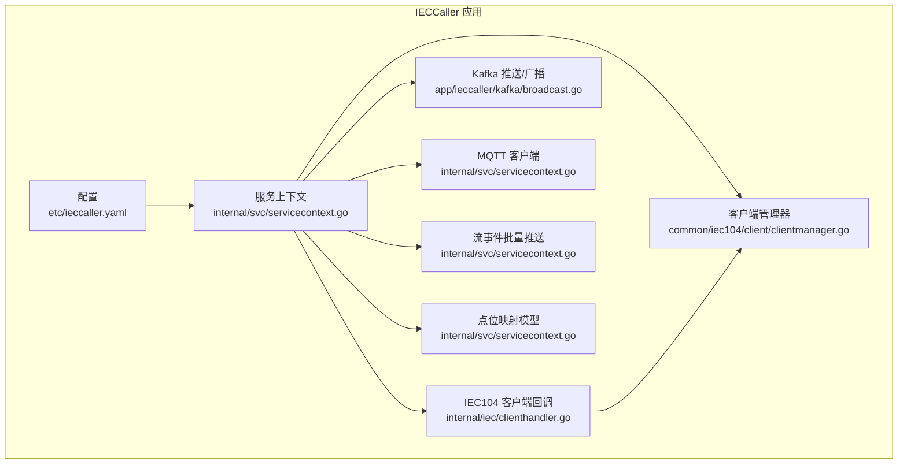
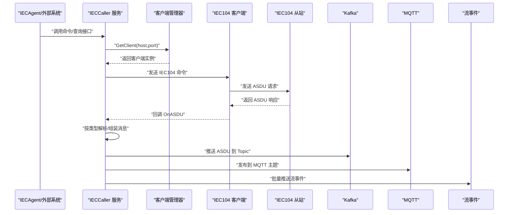
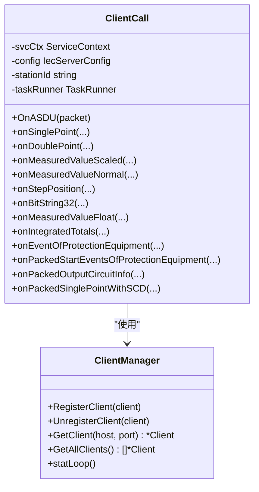
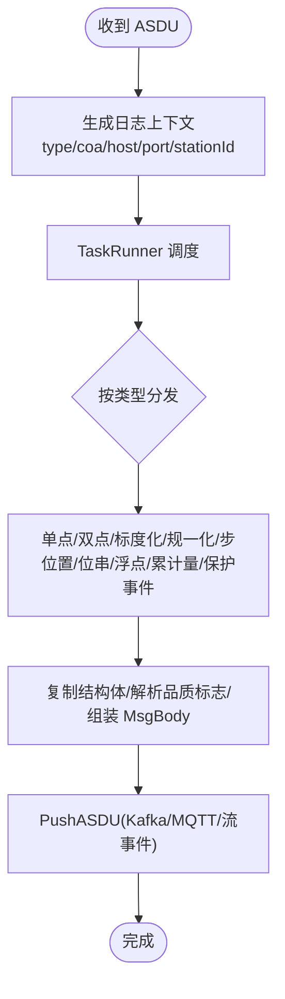
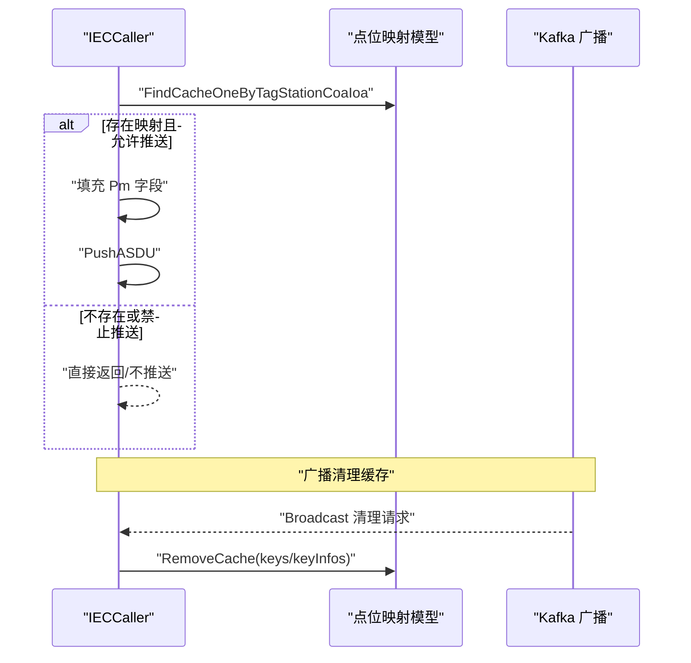
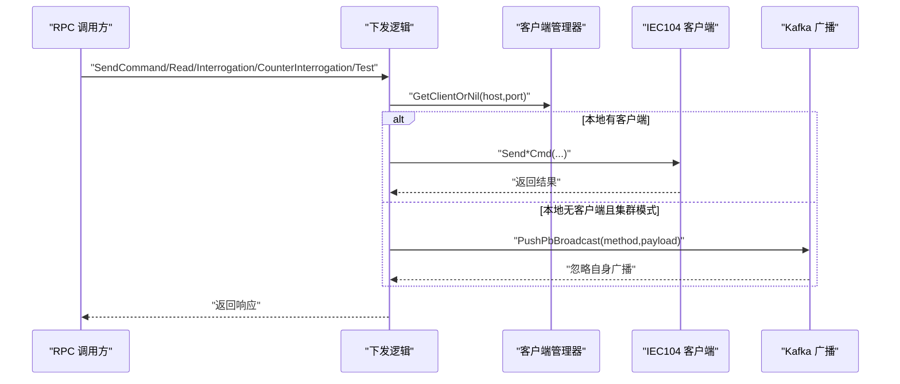
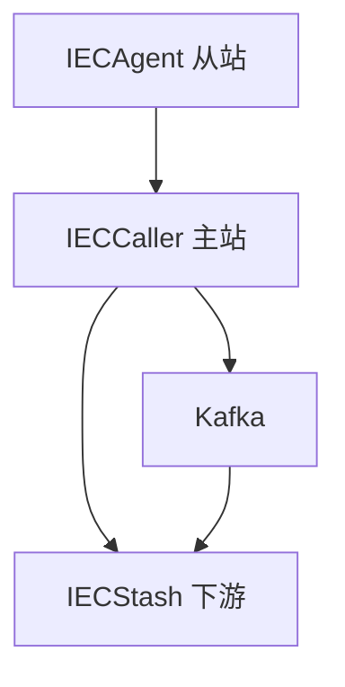
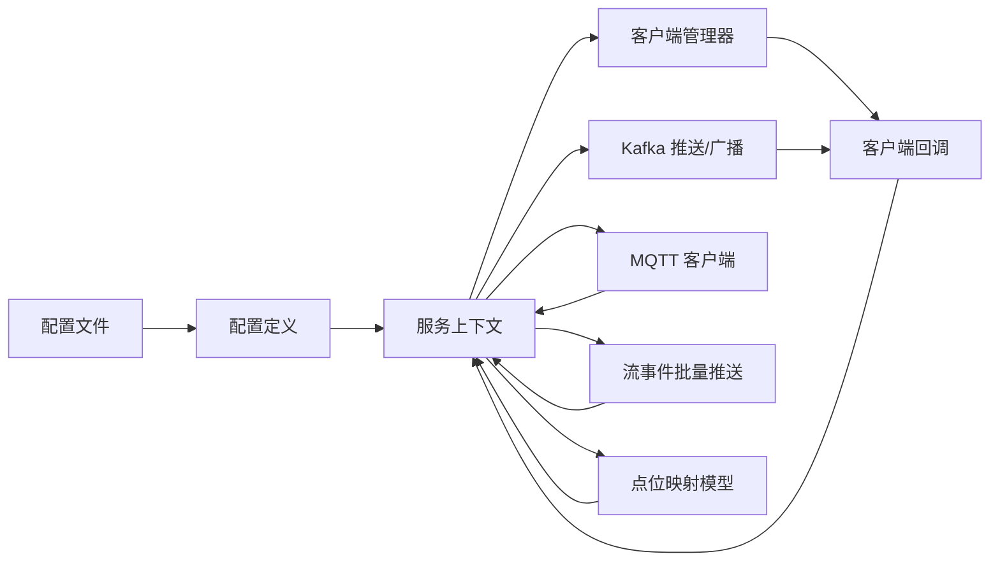

# IECCaller 客户端服务

<cite>
**本文引用的文件**
- [app/ieccaller/etc/ieccaller.yaml](file://app/ieccaller/etc/ieccaller.yaml)
- [app/ieccaller/internal/config/config.go](file://app/ieccaller/internal/config/config.go)
- [app/ieccaller/ieccaller/ieccaller.pb.go](file://app/ieccaller/ieccaller/ieccaller.pb.go)
- [app/ieccaller/internal/iec/clienthandler.go](file://app/ieccaller/internal/iec/clienthandler.go)
- [common/iec104/client/clientmanager.go](file://common/iec104/client/clientmanager.go)
- [app/ieccaller/internal/svc/servicecontext.go](file://app/ieccaller/internal/svc/servicecontext.go)
- [app/ieccaller/kafka/broadcast.go](file://app/ieccaller/kafka/broadcast.go)
- [app/ieccaller/internal/logic/sendcommandlogic.go](file://app/ieccaller/internal/logic/sendcommandlogic.go)
- [app/ieccaller/internal/logic/sendinterrogationcmdlogic.go](file://app/ieccaller/internal/logic/sendinterrogationcmdlogic.go)
- [app/ieccaller/internal/logic/sendcounterinterrogationcmdlogic.go](file://app/ieccaller/internal/logic/sendcounterinterrogationcmdlogic.go)
- [app/ieccaller/internal/logic/sendreadcmdlogic.go](file://app/ieccaller/internal/logic/sendreadcmdlogic.go)
- [app/ieccaller/internal/logic/sendtestcmdlogic.go](file://app/ieccaller/internal/logic/sendtestcmdlogic.go)
- [app/ieccaller/internal/logic/pagelistpointmappinglogic.go](file://app/ieccaller/internal/logic/pagelistpointmappinglogic.go)
- [app/ieccaller/internal/logic/querypointmappingbyidlogic.go](file://app/ieccaller/internal/logic/querypointmappingbyidlogic.go)
- [app/ieccaller/internal/logic/querypointmappingbykeylogic.go](file://app/ieccaller/internal/logic/querypointmappingbykeylogic.go)
</cite>

## 目录
1. [简介](#简介)
2. [项目结构](#项目结构)
3. [核心组件](#核心组件)
4. [架构总览](#架构总览)
5. [详细组件分析](#详细组件分析)
6. [依赖分析](#依赖分析)
7. [性能考虑](#性能考虑)
8. [故障排查指南](#故障排查指南)
9. [结论](#结论)
10. [附录](#附录)

## 简介
IECCaller 是一个基于 IEC 60870-5-104（IEC104）协议的客户端服务，负责作为“主站”轮询 IEC104 从站设备，执行设备查询、总召唤、累计量召唤、测试命令、读定值、命令下发等操作，并将 ASDU 数据通过 Kafka、MQTT、流事件通道进行广播与推送。同时，它提供点位映射管理能力，支持按设备点位维度进行数据推送控制与缓存清理。

## 项目结构
IECCaller 位于应用层目录 app/ieccaller，主要由以下模块组成：
- 配置与入口：etc 配置文件、internal/config 配置定义、内部服务上下文与逻辑层
- IEC104 客户端：internal/iec 客户端回调处理、common/iec104/client 客户端管理
- 中间件集成：Kafka 广播与推送、MQTT 发布、流事件批量推送
- 点位映射：数据库模型与分页查询、按 ID/键查询、缓存清理广播
- RPC 接口：ieccaller.proto 生成的 PB 类型与方法

图表来源
- [app/ieccaller/etc/ieccaller.yaml:1-79](file://app/ieccaller/etc/ieccaller.yaml#L1-L79)
- [app/ieccaller/internal/svc/servicecontext.go:33-142](file://app/ieccaller/internal/svc/servicecontext.go#L33-L142)
- [app/ieccaller/internal/iec/clienthandler.go:21-44](file://app/ieccaller/internal/iec/clienthandler.go#L21-L44)
- [common/iec104/client/clientmanager.go:11-27](file://common/iec104/client/clientmanager.go#L11-L27)
- [app/ieccaller/kafka/broadcast.go:14-22](file://app/ieccaller/kafka/broadcast.go#L14-L22)

章节来源
- [app/ieccaller/etc/ieccaller.yaml:1-79](file://app/ieccaller/etc/ieccaller.yaml#L1-L79)
- [app/ieccaller/internal/config/config.go:18-58](file://app/ieccaller/internal/config/config.go#L18-L58)

## 核心组件
- 配置系统：集中定义部署模式、日志、Nacos、IEC 服务器列表、Kafka/MQTT/流事件参数、数据库与批处理大小等
- 服务上下文：初始化 Kafka/MQTT/流事件客户端、点位映射模型、客户端管理器；统一推送入口
- IEC104 客户端回调：解析各类 ASDU 类型，按数据类型分发到对应处理器，异步入队处理
- 客户端管理器：维护多路 IEC104 客户端连接，统计连接状态
- 广播消费：跨节点接收广播指令，转发给本地或远程客户端执行
- 点位映射：按设备点位维度控制推送开关、生成扩展字段、支持缓存清理广播

章节来源
- [app/ieccaller/internal/config/config.go:11-58](file://app/ieccaller/internal/config/config.go#L11-L58)
- [app/ieccaller/internal/svc/servicecontext.go:33-142](file://app/ieccaller/internal/svc/servicecontext.go#L33-L142)
- [app/ieccaller/internal/iec/clienthandler.go:94-140](file://app/ieccaller/internal/iec/clienthandler.go#L94-L140)
- [common/iec104/client/clientmanager.go:11-145](file://common/iec104/client/clientmanager.go#L11-L145)
- [app/ieccaller/kafka/broadcast.go:24-148](file://app/ieccaller/kafka/broadcast.go#L24-L148)

## 架构总览
IECCaller 采用“主站”角色，通过客户端管理器维护多个 IEC104 连接，接收来自远端从站的 ASDU 数据，解析后写入 Kafka、MQTT 与流事件通道。在集群模式下，通过 Kafka 广播实现跨节点命令分发与点位映射缓存清理。

图表来源
- [app/ieccaller/internal/iec/clienthandler.go:94-140](file://app/ieccaller/internal/iec/clienthandler.go#L94-L140)
- [app/ieccaller/internal/svc/servicecontext.go:144-244](file://app/ieccaller/internal/svc/servicecontext.go#L144-L244)
- [app/ieccaller/kafka/broadcast.go:40-110](file://app/ieccaller/kafka/broadcast.go#L40-L110)

## 详细组件分析

### 配置系统与启动流程
- 配置项要点
  - 部署模式：standalone/cluster，cluster 模式启用广播
  - IEC 服务器列表：每个从站包含主机、端口、定时总召唤/累计量召唤 COA 列表、元数据、日志开关、并发度
  - 中间件：Kafka（Topic、广播 Topic、广播 GroupId、是否推送）、MQTT（Broker、用户名密码、QoS、Topic 列表、是否推送）
  - 流事件：Endpoints/Target、非阻塞、超时
  - 数据库：DataSource，启用后可进行点位映射查询与缓存
  - 批处理：PushAsduChunkBytes、GracePeriod
- 启动流程
  - 初始化日志
  - 校验广播开启但 Kafka 为空则报错
  - 初始化 Kafka 推送器与广播推送器
  - 初始化 MQTT 客户端
  - 初始化流事件客户端与批量推送器
  - 初始化点位映射模型（若配置了 DataSource）

章节来源
- [app/ieccaller/etc/ieccaller.yaml:1-79](file://app/ieccaller/etc/ieccaller.yaml#L1-L79)
- [app/ieccaller/internal/config/config.go:18-58](file://app/ieccaller/internal/config/config.go#L18-L58)
- [app/ieccaller/internal/svc/servicecontext.go:45-142](file://app/ieccaller/internal/svc/servicecontext.go#L45-L142)

### IEC104 客户端连接管理
- 客户端管理器
  - 注册/注销客户端，按 host:port 唯一定位
  - 提供获取全部客户端、统计连接状态
  - 内部协程打印每分钟统计
- 客户端回调
  - OnASDU 将不同 ASDU 类型分派到具体处理器
  - 使用 TaskRunner 控制并发度，避免阻塞
  - 为每条 ASDU 生成 MsgId，填充时间、元数据、COA 等字段
  - 通过 PushASDU 输出到 Kafka/MQTT/流事件

图表来源
- [common/iec104/client/clientmanager.go:11-145](file://common/iec104/client/clientmanager.go#L11-L145)
- [app/ieccaller/internal/iec/clienthandler.go:21-541](file://app/ieccaller/internal/iec/clienthandler.go#L21-L541)

章节来源
- [common/iec104/client/clientmanager.go:35-100](file://common/iec104/client/clientmanager.go#L35-L100)
- [app/ieccaller/internal/iec/clienthandler.go:94-140](file://app/ieccaller/internal/iec/clienthandler.go#L94-L140)

### ASDU 消息处理与数据推送
- 处理流程
  - OnASDU 记录日志上下文（类型、COA、公共地址、ASDU 名称、主机、端口、stationId）
  - 根据 ASDU 类型选择处理器（单点、双点、标度化值、规一化值、步位置、位串、浮点、累计量、保护事件等）
  - 每个处理器复制结构体、解析品质描述与有效性标志，封装 MsgBody
  - 通过 PushASDU 异步推送至 Kafka、MQTT、流事件
- 推送策略
  - Kafka：按 key 推送（key 由 GetKey 生成），可配置是否推送
  - MQTT：按模板主题生成并发布，可配置是否推送
  - 流事件：按批次大小聚合，统一推送

图表来源
- [app/ieccaller/internal/iec/clienthandler.go:94-140](file://app/ieccaller/internal/iec/clienthandler.go#L94-L140)
- [app/ieccaller/internal/iec/clienthandler.go:142-536](file://app/ieccaller/internal/iec/clienthandler.go#L142-L536)
- [app/ieccaller/internal/svc/servicecontext.go:144-244](file://app/ieccaller/internal/svc/servicecontext.go#L144-L244)

章节来源
- [app/ieccaller/internal/iec/clienthandler.go:94-536](file://app/ieccaller/internal/iec/clienthandler.go#L94-L536)
- [app/ieccaller/internal/svc/servicecontext.go:144-244](file://app/ieccaller/internal/svc/servicecontext.go#L144-L244)

### 设备点映射管理
- 查询接口
  - 分页查询：按 tagStation/coa/deviceId 过滤
  - 按 ID 查询
  - 按 tagStation/coa/ioa 查询
- 缓存与推送控制
  - PushASDU 在存在点位映射且 EnablePush=1 时才推送
  - 支持广播清理指定键或键信息的缓存
- 广播清理
  - 根据广播 GroupId 忽略自身广播
  - 支持按 keys 或 keyInfos 清理缓存

图表来源
- [app/ieccaller/internal/svc/servicecontext.go:144-180](file://app/ieccaller/internal/svc/servicecontext.go#L144-L180)
- [app/ieccaller/kafka/broadcast.go:111-143](file://app/ieccaller/kafka/broadcast.go#L111-L143)

章节来源
- [app/ieccaller/internal/logic/pagelistpointmappinglogic.go:30-60](file://app/ieccaller/internal/logic/pagelistpointmappinglogic.go#L30-L60)
- [app/ieccaller/internal/logic/querypointmappingbyidlogic.go:30-45](file://app/ieccaller/internal/logic/querypointmappingbyidlogic.go#L30-L45)
- [app/ieccaller/internal/logic/querypointmappingbykeylogic.go:30-45](file://app/ieccaller/internal/logic/querypointmappingbykeylogic.go#L30-L45)
- [app/ieccaller/internal/svc/servicecontext.go:144-180](file://app/ieccaller/internal/svc/servicecontext.go#L144-L180)
- [app/ieccaller/kafka/broadcast.go:111-143](file://app/ieccaller/kafka/broadcast.go#L111-L143)

### 命令下发与轮询机制
- 命令下发
  - SendTestCmd、SendReadCmd、SendInterrogationCmd、SendCounterInterrogationCmd、SendCommand
  - 若客户端不存在且处于集群模式，则通过广播推送至其他节点执行
- 轮询与定时
  - 配置中可设置总召唤与累计量召唤的 Cron 表达式（注释示例）
  - IEC 服务器配置包含 IcCoaList/CcCoaList，用于定时总/累召唤

图表来源
- [app/ieccaller/internal/logic/sendcommandlogic.go:28-44](file://app/ieccaller/internal/logic/sendcommandlogic.go#L28-L44)
- [app/ieccaller/internal/logic/sendinterrogationcmdlogic.go:26-42](file://app/ieccaller/internal/logic/sendinterrogationcmdlogic.go#L26-L42)
- [app/ieccaller/internal/logic/sendcounterinterrogationcmdlogic.go:27-43](file://app/ieccaller/internal/logic/sendcounterinterrogationcmdlogic.go#L27-L43)
- [app/ieccaller/internal/logic/sendreadcmdlogic.go:25-43](file://app/ieccaller/internal/logic/sendreadcmdlogic.go#L25-L43)
- [app/ieccaller/internal/logic/sendtestcmdlogic.go:25-41](file://app/ieccaller/internal/logic/sendtestcmdlogic.go#L25-L41)
- [app/ieccaller/internal/svc/servicecontext.go:246-285](file://app/ieccaller/internal/svc/servicecontext.go#L246-L285)

章节来源
- [app/ieccaller/etc/ieccaller.yaml:72-75](file://app/ieccaller/etc/ieccaller.yaml#L72-L75)
- [app/ieccaller/internal/config/config.go:22-24](file://app/ieccaller/internal/config/config.go#L22-L24)
- [app/ieccaller/internal/logic/sendcommandlogic.go:28-44](file://app/ieccaller/internal/logic/sendcommandlogic.go#L28-L44)
- [app/ieccaller/internal/logic/sendinterrogationcmdlogic.go:26-42](file://app/ieccaller/internal/logic/sendinterrogationcmdlogic.go#L26-L42)
- [app/ieccaller/internal/logic/sendcounterinterrogationcmdlogic.go:27-43](file://app/ieccaller/internal/logic/sendcounterinterrogationcmdlogic.go#L27-L43)
- [app/ieccaller/internal/logic/sendreadcmdlogic.go:25-43](file://app/ieccaller/internal/logic/sendreadcmdlogic.go#L25-L43)
- [app/ieccaller/internal/logic/sendtestcmdlogic.go:25-41](file://app/ieccaller/internal/logic/sendtestcmdlogic.go#L25-L41)

### 与 Kafka 的消息集成
- Kafka 推送
  - PushASDU：当 Kafka 推送开启时，按 key 推送 ASDU 到 Topic
  - 广播：当部署模式为 cluster 时，将方法名与参数封装为 BroadcastBody，推送到广播 Topic
- 广播消费
  - Consume：忽略同组广播，解析方法名并调用对应客户端命令
  - 支持总召唤、累计量召唤、读定值、测试命令、命令下发、点位映射缓存清理

章节来源
- [app/ieccaller/internal/svc/servicecontext.go:186-244](file://app/ieccaller/internal/svc/servicecontext.go#L186-L244)
- [app/ieccaller/internal/svc/servicecontext.go:246-285](file://app/ieccaller/internal/svc/servicecontext.go#L246-L285)
- [app/ieccaller/kafka/broadcast.go:24-148](file://app/ieccaller/kafka/broadcast.go#L24-L148)

### 与 IECAgent 和 IECStash 的协作模式
- IECAgent：作为 IEC104 从站，IECCaller 作为主站与其通信，IECCaller 负责轮询与命令下发
- IECStash：作为数据存储与处理的下游，IECCaller 通过流事件批量推送将 ASDU 数据投递到 IECStash

图表来源
- [app/ieccaller/internal/svc/servicecontext.go:64-75](file://app/ieccaller/internal/svc/servicecontext.go#L64-L75)
- [app/ieccaller/internal/svc/servicecontext.go:112-130](file://app/ieccaller/internal/svc/servicecontext.go#L112-L130)

## 依赖分析
- 配置依赖：配置文件驱动服务上下文初始化，决定中间件与数据库启用情况
- 服务上下文耦合：统一管理 Kafka/MQTT/流事件/点位映射/客户端管理器
- 客户端回调与管理器：回调依赖管理器提供的客户端实例
- 广播消费：依赖客户端管理器定位目标客户端，或通过点位映射模型进行缓存清理

图表来源
- [app/ieccaller/etc/ieccaller.yaml:1-79](file://app/ieccaller/etc/ieccaller.yaml#L1-L79)
- [app/ieccaller/internal/config/config.go:18-58](file://app/ieccaller/internal/config/config.go#L18-L58)
- [app/ieccaller/internal/svc/servicecontext.go:33-142](file://app/ieccaller/internal/svc/servicecontext.go#L33-L142)
- [common/iec104/client/clientmanager.go:11-145](file://common/iec104/client/clientmanager.go#L11-L145)
- [app/ieccaller/internal/iec/clienthandler.go:21-44](file://app/ieccaller/internal/iec/clienthandler.go#L21-L44)

章节来源
- [app/ieccaller/internal/config/config.go:18-58](file://app/ieccaller/internal/config/config.go#L18-L58)
- [app/ieccaller/internal/svc/servicecontext.go:33-142](file://app/ieccaller/internal/svc/servicecontext.go#L33-L142)
- [common/iec104/client/clientmanager.go:11-145](file://common/iec104/client/clientmanager.go#L11-L145)
- [app/ieccaller/internal/iec/clienthandler.go:21-44](file://app/ieccaller/internal/iec/clienthandler.go#L21-L44)

## 性能考虑
- 并发控制：客户端回调使用 TaskRunner 控制并发度，避免高并发导致阻塞
- 批量推送：流事件采用批量推送器，按 PushAsduChunkBytes 聚合，降低网络与下游压力
- 资源关闭：服务上下文提供 Close 方法，确保 Kafka/MQTT/客户端资源正确释放
- 日志与统计：客户端管理器每分钟打印连接统计，便于运维观察

章节来源
- [app/ieccaller/internal/iec/clienthandler.go:41-43](file://app/ieccaller/internal/iec/clienthandler.go#L41-L43)
- [app/ieccaller/internal/svc/servicecontext.go:76-131](file://app/ieccaller/internal/svc/servicecontext.go#L76-L131)
- [app/ieccaller/internal/svc/servicecontext.go:291-310](file://app/ieccaller/internal/svc/servicecontext.go#L291-L310)
- [common/iec104/client/clientmanager.go:117-144](file://common/iec104/client/clientmanager.go#L117-L144)

## 故障排查指南
- 客户端未注册/连接失败
  - 检查配置中的 IEC 服务器列表与端口
  - 查看客户端管理器统计日志，确认连接状态
- 广播未生效
  - 确认部署模式为 cluster，且 Kafka 配置已启用
  - 检查广播 GroupId 是否一致，避免忽略自身广播
- Kafka/MQTT 推送失败
  - 检查 IsPush 开关、Topic 配置、Broker 地址
  - 查看推送超时与错误日志
- 点位映射不生效
  - 确认 EnablePush=1，检查缓存是否存在
  - 如需强制刷新，使用广播清理缓存

章节来源
- [common/iec104/client/clientmanager.go:117-144](file://common/iec104/client/clientmanager.go#L117-L144)
- [app/ieccaller/internal/svc/servicecontext.go:54-63](file://app/ieccaller/internal/svc/servicecontext.go#L54-L63)
- [app/ieccaller/internal/svc/servicecontext.go:186-244](file://app/ieccaller/internal/svc/servicecontext.go#L186-L244)
- [app/ieccaller/kafka/broadcast.go:26-38](file://app/ieccaller/kafka/broadcast.go#L26-L38)

## 结论
IECCaller 以清晰的配置驱动与模块化设计，实现了 IEC104 主站的核心能力：多从站连接管理、ASDU 数据解析与多通道推送、点位映射控制与缓存、跨节点广播与命令分发。通过合理的并发与批量策略，满足工业场景下的实时性与可靠性要求。

## 附录

### 配置选项说明（节选）
- 基本配置
  - Name、ListenOn、DeployMode、Mode、Timeout、Log
- IEC 服务器配置
  - Host、Port、IcCoaList、CcCoaList、MetaData、LogEnable、TaskConcurrency
- 中间件
  - KafkaConfig：Brokers、Topic、BroadcastTopic、BroadcastGroupId、IsPush
  - MqttConfig：Broker、Username、Password、Qos、Topic 列表、IsPush
  - StreamEventConf：Endpoints/Target、NonBlock、Timeout
- 数据库与批处理
  - DB.DataSource、PushAsduChunkBytes、GracePeriod

章节来源
- [app/ieccaller/etc/ieccaller.yaml:1-79](file://app/ieccaller/etc/ieccaller.yaml#L1-L79)
- [app/ieccaller/internal/config/config.go:18-58](file://app/ieccaller/internal/config/config.go#L18-L58)

### 服务启动流程（步骤）
- 加载配置并初始化日志
- 校验广播配置
- 初始化 Kafka/MQTT/流事件客户端
- 初始化点位映射模型（可选）
- 启动客户端管理器与统计循环
- 暴露 RPC 接口，等待请求

章节来源
- [app/ieccaller/internal/svc/servicecontext.go:45-142](file://app/ieccaller/internal/svc/servicecontext.go#L45-L142)
- [common/iec104/client/clientmanager.go:17-27](file://common/iec104/client/clientmanager.go#L17-L27)

### 实际使用示例（路径指引）
- 设备查询
  - 调用 SendReadCmd：[app/ieccaller/internal/logic/sendreadcmdlogic.go:25-43](file://app/ieccaller/internal/logic/sendreadcmdlogic.go#L25-L43)
- 总召唤
  - 调用 SendInterrogationCmd：[app/ieccaller/internal/logic/sendinterrogationcmdlogic.go:26-42](file://app/ieccaller/internal/logic/sendinterrogationcmdlogic.go#L26-L42)
- 累计量召唤
  - 调用 SendCounterInterrogationCmd：[app/ieccaller/internal/logic/sendcounterinterrogationcmdlogic.go:27-43](file://app/ieccaller/internal/logic/sendcounterinterrogationcmdlogic.go#L27-L43)
- 测试命令
  - 调用 SendTestCmd：[app/ieccaller/internal/logic/sendtestcmdlogic.go:25-41](file://app/ieccaller/internal/logic/sendtestcmdlogic.go#L25-L41)
- 命令下发
  - 调用 SendCommand：[app/ieccaller/internal/logic/sendcommandlogic.go:28-44](file://app/ieccaller/internal/logic/sendcommandlogic.go#L28-L44)
- 状态监控
  - 查看客户端统计日志：[common/iec104/client/clientmanager.go:126-144](file://common/iec104/client/clientmanager.go#L126-L144)
- 与 IECAgent 协作
  - 作为主站轮询从站：[app/ieccaller/internal/iec/clienthandler.go:94-140](file://app/ieccaller/internal/iec/clienthandler.go#L94-L140)
- 与 IECStash 协作
  - 通过流事件批量推送：[app/ieccaller/internal/svc/servicecontext.go:112-130](file://app/ieccaller/internal/svc/servicecontext.go#L112-L130)