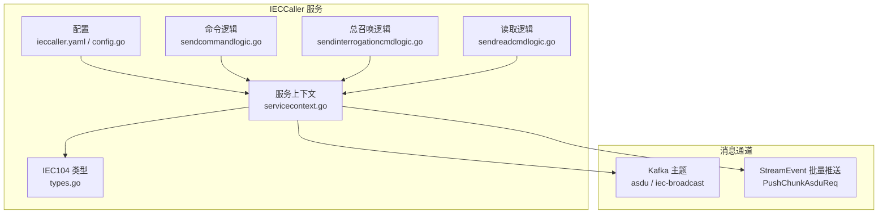
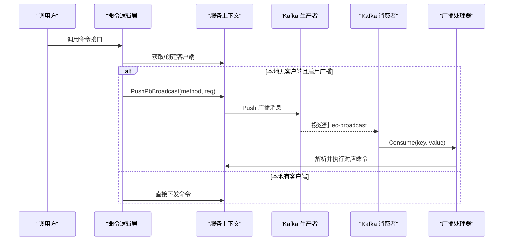
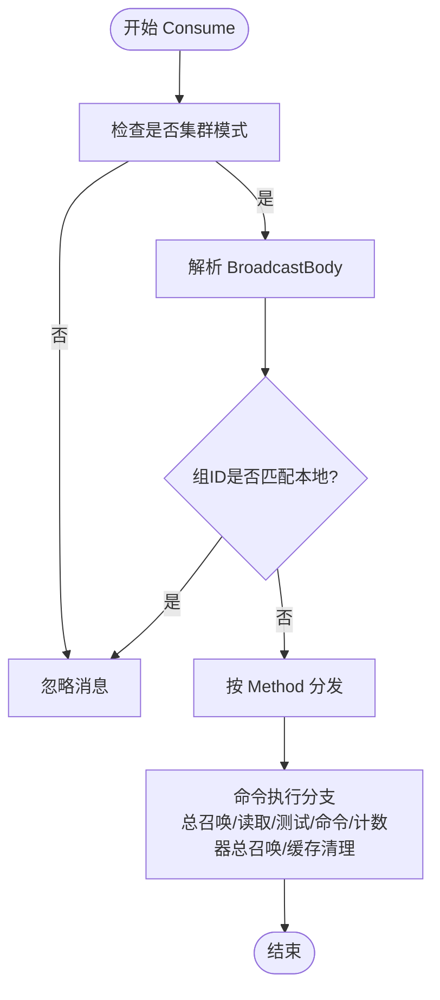
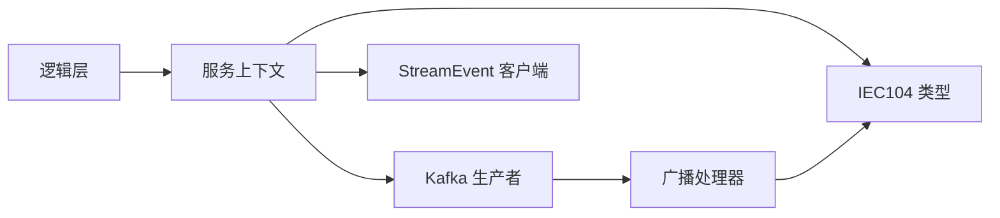

# Kafka 消息集成

<cite>
**本文引用的文件**
- [app/ieccaller/etc/ieccaller.yaml](file://app/ieccaller/etc/ieccaller.yaml)
- [app/ieccaller/internal/config/config.go](file://app/ieccaller/internal/config/config.go)
- [app/ieccaller/internal/svc/servicecontext.go](file://app/ieccaller/internal/svc/servicecontext.go)
- [app/ieccaller/kafka/broadcast.go](file://app/ieccaller/kafka/broadcast.go)
- [common/iec104/types/types.go](file://common/iec104/types/types.go)
- [app/ieccaller/internal/logic/sendcommandlogic.go](file://app/ieccaller/internal/logic/sendcommandlogic.go)
- [app/ieccaller/internal/logic/sendinterrogationcmdlogic.go](file://app/ieccaller/internal/logic/sendinterrogationcmdlogic.go)
- [app/ieccaller/internal/logic/sendreadcmdlogic.go](file://app/ieccaller/internal/logic/sendreadcmdlogic.go)
- [docs/iec104-protocol.md](file://docs/iec104-protocol.md)
- [facade/streamevent/streamevent/streamevent.pb.go](file://facade/streamevent/streamevent/streamevent.pb.go)
- [facade/streamevent/streamevent/streamevent.pb.validate.go](file://facade/streamevent/streamevent/streamevent.pb.validate.go)
</cite>

## 目录
1. [简介](#简介)
2. [项目结构](#项目结构)
3. [核心组件](#核心组件)
4. [架构总览](#架构总览)
5. [详细组件分析](#详细组件分析)
6. [依赖分析](#依赖分析)
7. [性能考量](#性能考量)
8. [故障排查指南](#故障排查指南)
9. [结论](#结论)
10. [附录](#附录)

## 简介
本文件面向 IECCaller 服务的 Kafka 消息集成能力，系统性阐述广播队列的配置与使用、消息发布与订阅流程、客户端配置、主题与消费者组管理、消息格式规范，并提供设备状态更新、命令执行结果与系统告警等消息类型的发送与接收示例路径。同时，解释消息可靠性保障、重试机制与错误处理策略，帮助读者快速理解并安全地接入 Kafka 广播通道。

## 项目结构
IECCaller 通过配置文件启用 Kafka 广播功能，服务上下文按配置初始化 Kafka 生产者与广播消费者；IEC104 类型定义了广播消息体结构；逻辑层封装了命令下发与广播推送；配套的 IEC104 协议文档定义了消息格式规范；StreamEvent 提供批量推送能力以提升吞吐。

图表来源
- [app/ieccaller/etc/ieccaller.yaml:35-41](file://app/ieccaller/etc/ieccaller.yaml#L35-L41)
- [app/ieccaller/internal/config/config.go:36-42](file://app/ieccaller/internal/config/config.go#L36-L42)
- [app/ieccaller/internal/svc/servicecontext.go:57-60](file://app/ieccaller/internal/svc/servicecontext.go#L57-L60)
- [app/ieccaller/internal/logic/sendcommandlogic.go:28-35](file://app/ieccaller/internal/logic/sendcommandlogic.go#L28-L35)
- [app/ieccaller/internal/logic/sendinterrogationcmdlogic.go:26-33](file://app/ieccaller/internal/logic/sendinterrogationcmdlogic.go#L26-L33)
- [app/ieccaller/internal/logic/sendreadcmdlogic.go:25-34](file://app/ieccaller/internal/logic/sendreadcmdlogic.go#L25-L34)
- [common/iec104/types/types.go:11-15](file://common/iec104/types/types.go#L11-L15)

章节来源
- [app/ieccaller/etc/ieccaller.yaml:35-41](file://app/ieccaller/etc/ieccaller.yaml#L35-L41)
- [app/ieccaller/internal/config/config.go:36-42](file://app/ieccaller/internal/config/config.go#L36-L42)
- [app/ieccaller/internal/svc/servicecontext.go:57-60](file://app/ieccaller/internal/svc/servicecontext.go#L57-L60)

## 核心组件
- Kafka 客户端配置
  - Brokers：Kafka 集群地址列表
  - Topic：ASDU 主题名（默认 asdu）
  - BroadcastTopic：广播主题名（默认 iec-broadcast）
  - BroadcastGroupId：广播消费者组 ID（默认 iec-caller）
  - IsPush：是否启用 Kafka 推送（默认 false）

- 广播消息体结构
  - BroadcastBody：包含广播组 ID、方法名、请求体 JSON 字符串

- 服务上下文初始化
  - 在配置存在时创建 Kafka 生产者（ASDU 与广播）
  - 在集群模式下启用广播消费与处理

- 逻辑层命令下发
  - 若本地无可用客户端且开启广播，则将命令封装为广播消息并推送到广播主题
  - 否则直接通过 IEC104 客户端下发

章节来源
- [app/ieccaller/etc/ieccaller.yaml:35-41](file://app/ieccaller/etc/ieccaller.yaml#L35-L41)
- [app/ieccaller/internal/config/config.go:36-42](file://app/ieccaller/internal/config/config.go#L36-L42)
- [common/iec104/types/types.go:11-15](file://common/iec104/types/types.go#L11-L15)
- [app/ieccaller/internal/svc/servicecontext.go:54-60](file://app/ieccaller/internal/svc/servicecontext.go#L54-L60)
- [app/ieccaller/internal/logic/sendcommandlogic.go:28-35](file://app/ieccaller/internal/logic/sendcommandlogic.go#L28-L35)

## 架构总览
IECCaller 的 Kafka 集成采用“本地直连优先 + 广播兜底”的策略：当服务运行于集群模式且本地无目标 IEC104 客户端时，将命令通过 Kafka 广播主题转发给其他节点执行；同时，正常采集到的 ASDU 消息可按需写入 Kafka 主题，供下游订阅消费。

图表来源
- [app/ieccaller/internal/logic/sendcommandlogic.go:28-35](file://app/ieccaller/internal/logic/sendcommandlogic.go#L28-L35)
- [app/ieccaller/internal/svc/servicecontext.go:246-262](file://app/ieccaller/internal/svc/servicecontext.go#L246-L262)
- [app/ieccaller/kafka/broadcast.go:24-148](file://app/ieccaller/kafka/broadcast.go#L24-L148)

## 详细组件分析

### 广播主题与消费者组管理
- 广播主题
  - 名称：iec-broadcast（来自配置）
  - 用途：跨节点广播命令与缓存清理等操作
- 消费者组
  - 组 ID：由配置项 BroadcastGroupId 决定，默认 iec-caller
  - 消费行为：仅在集群模式下启用广播消费；同一组内消息由分区分配策略决定消费归属
- 自屏蔽机制
  - 广播消息携带 BroadcastGroupId，若与本地组 ID 相同则忽略，避免自消费回环

章节来源
- [app/ieccaller/etc/ieccaller.yaml:40-41](file://app/ieccaller/etc/ieccaller.yaml#L40-L41)
- [app/ieccaller/internal/config/config.go:39-40](file://app/ieccaller/internal/config/config.go#L39-L40)
- [app/ieccaller/kafka/broadcast.go:35-38](file://app/ieccaller/kafka/broadcast.go#L35-L38)

### 广播消息处理流程
- 消费入口：Consume(key, value)
- 校验与过滤：若非集群模式或组 ID 匹配则忽略
- 方法分发：根据 Method 字段匹配具体命令并解析 Body
- 执行命令：通过客户端管理器获取目标 IEC104 客户端并执行相应命令
- 缓存清理：支持按键或键信息清理点位映射缓存

图表来源
- [app/ieccaller/kafka/broadcast.go:24-148](file://app/ieccaller/kafka/broadcast.go#L24-L148)

章节来源
- [app/ieccaller/kafka/broadcast.go:24-148](file://app/ieccaller/kafka/broadcast.go#L24-L148)

### Kafka 客户端配置与初始化
- 配置项
  - Brokers、Topic、BroadcastTopic、BroadcastGroupId、IsPush
- 初始化时机
  - 服务上下文根据配置创建 Kafka 生产者实例（ASDU 与广播）
  - 若启用广播但未配置 Kafka 地址，将触发致命错误
- 推送策略
  - ASDU 消息：按 key（主机+公共地址+信息对象地址）进行分区
  - 广播消息：按组 ID 进行分区，便于同组内消费

章节来源
- [app/ieccaller/etc/ieccaller.yaml:35-41](file://app/ieccaller/etc/ieccaller.yaml#L35-L41)
- [app/ieccaller/internal/config/config.go:36-42](file://app/ieccaller/internal/config/config.go#L36-L42)
- [app/ieccaller/internal/svc/servicecontext.go:54-60](file://app/ieccaller/internal/svc/servicecontext.go#L54-L60)

### 消息格式规范与示例路径
- IEC104 消息格式
  - 基础字段：msgId、host、port、asdu、typeId、dataType、coa、body、time、metaData、pm
  - 点位映射 pm：包含设备 ID、名称、TD 表类型及扩展字段
- 示例路径
  - 设备状态更新：参考 IEC104 协议文档中的 ASDU 类型映射与信息体结构
  - 命令执行结果：命令逻辑层返回空响应，实际结果由 IEC104 客户端回调或后续广播处理
  - 系统告警：通过 pm.ext1 等扩展字段在下游进行主题路由与告警处理

章节来源
- [docs/iec104-protocol.md:18-50](file://docs/iec104-protocol.md#L18-L50)
- [docs/iec104-protocol.md:67-81](file://docs/iec104-protocol.md#L67-L81)
- [common/iec104/types/types.go:17-29](file://common/iec104/types/types.go#L17-L29)

### 发送与接收消息示例（路径指引）
- 发送命令（含广播）
  - 路径：app/ieccaller/internal/logic/sendcommandlogic.go
  - 关键点：若本地无客户端且启用广播，则通过 PushPbBroadcast 将命令广播至 iec-broadcast
- 发送总召唤
  - 路径：app/ieccaller/internal/logic/sendinterrogationcmdlogic.go
  - 关键点：同上，支持广播兜底
- 发送读取命令
  - 路径：app/ieccaller/internal/logic/sendreadcmdlogic.go
  - 关键点：同上，支持广播兜底
- 接收与处理广播
  - 路径：app/ieccaller/kafka/broadcast.go
  - 关键点：Consume 解析并按 Method 分发执行

章节来源
- [app/ieccaller/internal/logic/sendcommandlogic.go:28-35](file://app/ieccaller/internal/logic/sendcommandlogic.go#L28-L35)
- [app/ieccaller/internal/logic/sendinterrogationcmdlogic.go:26-33](file://app/ieccaller/internal/logic/sendinterrogationcmdlogic.go#L26-L33)
- [app/ieccaller/internal/logic/sendreadcmdlogic.go:25-34](file://app/ieccaller/internal/logic/sendreadcmdlogic.go#L25-L34)
- [app/ieccaller/kafka/broadcast.go:24-148](file://app/ieccaller/kafka/broadcast.go#L24-L148)

### StreamEvent 批量推送（补充通道）
- 作用：将 ASDU 消息批量写入 StreamEvent 服务，提升吞吐与稳定性
- 关键点：按配置字节阈值聚合消息，异步推送并记录耗时与结果

章节来源
- [app/ieccaller/internal/svc/servicecontext.go:76-130](file://app/ieccaller/internal/svc/servicecontext.go#L76-L130)
- [facade/streamevent/streamevent/streamevent.pb.go:92-114](file://facade/streamevent/streamevent/streamevent.pb.go#L92-L114)

## 依赖分析
- 组件耦合
  - 逻辑层依赖服务上下文进行广播与生产者调用
  - 服务上下文依赖配置与客户端管理器
  - 广播处理器依赖 IEC104 类型与客户端管理器
- 外部依赖
  - Kafka：作为消息通道承载广播与 ASDU
  - StreamEvent：作为补充通道承载批量推送
- 循环依赖
  - 未发现循环依赖迹象

图表来源
- [app/ieccaller/internal/logic/sendcommandlogic.go:28-35](file://app/ieccaller/internal/logic/sendcommandlogic.go#L28-L35)
- [app/ieccaller/internal/svc/servicecontext.go:57-60](file://app/ieccaller/internal/svc/servicecontext.go#L57-L60)
- [app/ieccaller/kafka/broadcast.go:24-148](file://app/ieccaller/kafka/broadcast.go#L24-L148)
- [common/iec104/types/types.go:11-15](file://common/iec104/types/types.go#L11-L15)

## 性能考量
- 批量推送
  - 通过 ChunkAsduPusher 按字节阈值聚合，减少网络往返与序列化开销
- 异步与并发
  - 推送 ASDU、MQTT 与批量推送通过并行执行，缩短整体延迟
- 超时控制
  - Kafka 推送与 MQTT 发布均设置超时，避免阻塞主流程
- 主题分区
  - 使用 key（主机+公共地址+信息对象地址）确保相同点位消息落在同一分区，利于有序处理与负载均衡

章节来源
- [app/ieccaller/internal/svc/servicecontext.go:186-242](file://app/ieccaller/internal/svc/servicecontext.go#L186-L242)
- [app/ieccaller/internal/svc/servicecontext.go:76-130](file://app/ieccaller/internal/svc/servicecontext.go#L76-L130)

## 故障排查指南
- 广播未生效
  - 检查 DeployMode 是否为 cluster
  - 确认 Kafka 配置是否完整（Brokers、Topic、BroadcastTopic、BroadcastGroupId）
- 自消费回环
  - 若收到自身广播，检查 BroadcastGroupId 是否与本地一致
- 命令未执行
  - 确认逻辑层是否走广播路径（本地无客户端）
  - 查看广播处理器日志，确认 Method 与 Body 解析是否正确
- Kafka 推送失败
  - 检查 Kafka 生产者初始化与超时设置
  - 关注推送返回的错误日志，定位网络或权限问题
- StreamEvent 批量推送异常
  - 关注批量推送耗时与错误统计，检查下游服务可用性

章节来源
- [app/ieccaller/internal/svc/servicecontext.go:54-56](file://app/ieccaller/internal/svc/servicecontext.go#L54-L56)
- [app/ieccaller/kafka/broadcast.go:35-38](file://app/ieccaller/kafka/broadcast.go#L35-L38)
- [app/ieccaller/internal/logic/sendcommandlogic.go:33-35](file://app/ieccaller/internal/logic/sendcommandlogic.go#L33-L35)
- [app/ieccaller/internal/svc/servicecontext.go:196-202](file://app/ieccaller/internal/svc/servicecontext.go#L196-L202)
- [app/ieccaller/internal/svc/servicecontext.go:112-126](file://app/ieccaller/internal/svc/servicecontext.go#L112-L126)

## 结论
IECCaller 的 Kafka 集成以“本地直连优先 + 广播兜底”为核心策略，在集群模式下通过广播主题实现跨节点命令分发与缓存同步；配合批量推送与严格的错误处理，既保证了高吞吐也兼顾了可靠性。建议在生产环境明确配置 Kafka 与消费者组，合理规划主题与分区策略，并结合监控与日志持续优化。

## 附录

### 配置项速览
- KafkaConfig
  - Brokers：Kafka 地址列表
  - Topic：ASDU 主题名
  - BroadcastTopic：广播主题名
  - BroadcastGroupId：广播消费者组 ID
  - IsPush：是否启用 Kafka 推送

章节来源
- [app/ieccaller/etc/ieccaller.yaml:35-41](file://app/ieccaller/etc/ieccaller.yaml#L35-L41)
- [app/ieccaller/internal/config/config.go:36-42](file://app/ieccaller/internal/config/config.go#L36-L42)