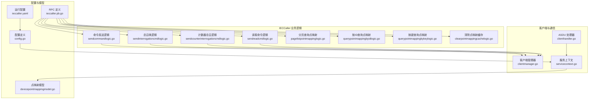
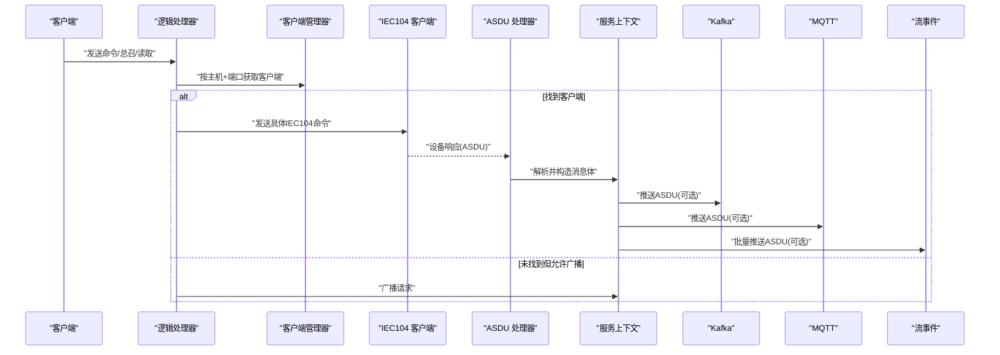
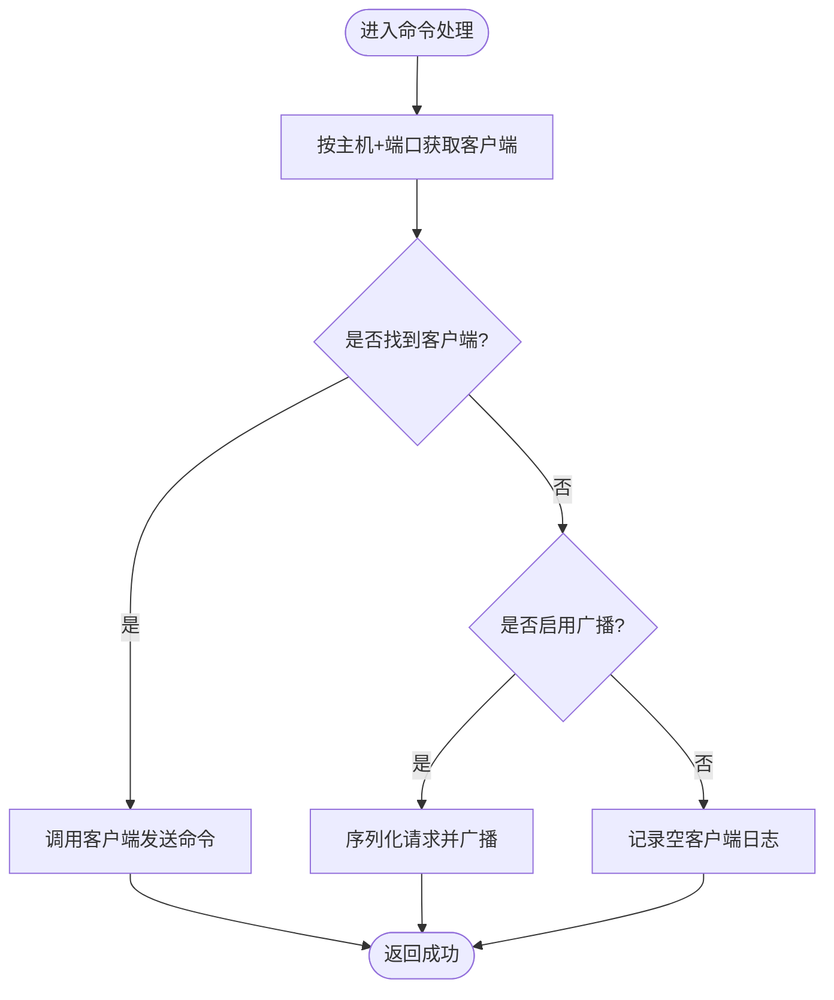
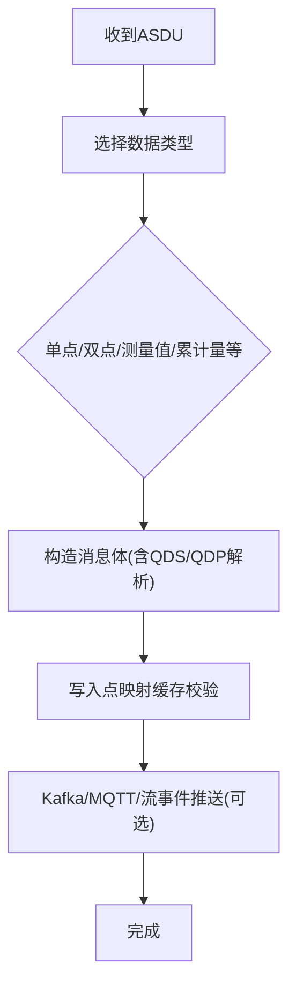
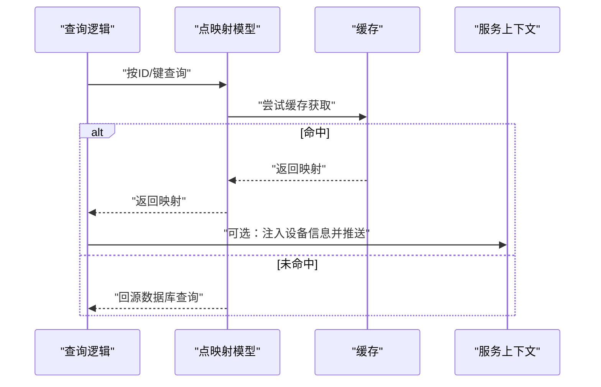
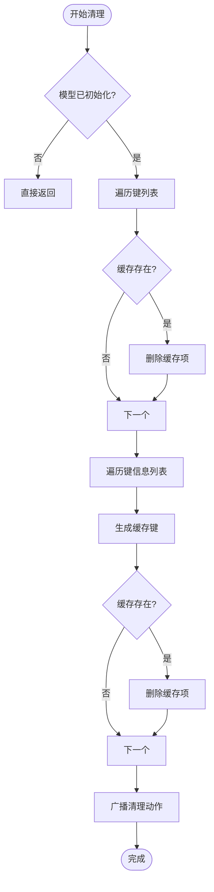
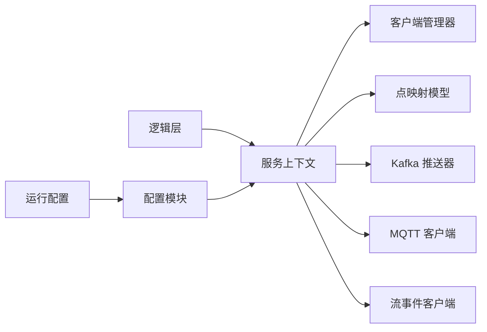

# 业务逻辑层

<cite>
**本文引用的文件**
- [sendcommandlogic.go](file://app/ieccaller/internal/logic/sendcommandlogic.go)
- [sendinterrogationcmdlogic.go](file://app/ieccaller/internal/logic/sendinterrogationcmdlogic.go)
- [sendcounterinterrogationcmdlogic.go](file://app/ieccaller/internal/logic/sendcounterinterrogationcmdlogic.go)
- [sendreadcmdlogic.go](file://app/ieccaller/internal/logic/sendreadcmdlogic.go)
- [pagelistpointmappinglogic.go](file://app/ieccaller/internal/logic/pagelistpointmappinglogic.go)
- [querypointmappingbyidlogic.go](file://app/ieccaller/internal/logic/querypointmappingbyidlogic.go)
- [querypointmappingbykeylogic.go](file://app/ieccaller/internal/logic/querypointmappingbykeylogic.go)
- [clearpointmappingcachelogic.go](file://app/ieccaller/internal/logic/clearpointmappingcachelogic.go)
- [clienthandler.go](file://app/ieccaller/internal/iec/clienthandler.go)
- [servicecontext.go](file://app/ieccaller/internal/svc/servicecontext.go)
- [config.go](file://app/ieccaller/internal/config/config.go)
- [ieccaller.yaml](file://app/ieccaller/etc/ieccaller.yaml)
- [devicepointmappingmodel.go](file://model/devicepointmappingmodel.go)
- [clientmanager.go](file://common/iec104/client/clientmanager.go)
- [ieccaller.pb.go](file://app/ieccaller/ieccaller/ieccaller.pb.go)
</cite>

## 目录
1. [简介](#简介)
2. [项目结构](#项目结构)
3. [核心组件](#核心组件)
4. [架构总览](#架构总览)
5. [详细组件分析](#详细组件分析)
6. [依赖分析](#依赖分析)
7. [性能考虑](#性能考虑)
8. [故障排查指南](#故障排查指南)
9. [结论](#结论)
10. [附录](#附录)

## 简介
本文件面向 IECCaller 服务的业务逻辑层，系统性阐述以下内容：
- 逻辑处理器的实现原理与处理流程：设备点映射查询、命令发送、状态监控、异常处理
- 客户端处理器的实现机制、ASDU 消息处理流程与设备通信协议适配
- 业务场景示例：延迟命令、计数器总召、读取命令等的调用路径与关键参数
- 逻辑层与数据层的交互模式、缓存与广播策略、错误处理与可观测性

## 项目结构
IECCaller 业务逻辑位于 app/ieccaller/internal/logic，通信与数据推送位于 app/ieccaller/internal/iec 与 app/ieccaller/internal/svc，配置位于 etc 与 internal/config。

图表来源
- [sendcommandlogic.go:1-45](file://app/ieccaller/internal/logic/sendcommandlogic.go#L1-L45)
- [sendinterrogationcmdlogic.go:1-43](file://app/ieccaller/internal/logic/sendinterrogationcmdlogic.go#L1-L43)
- [sendcounterinterrogationcmdlogic.go:1-44](file://app/ieccaller/internal/logic/sendcounterinterrogationcmdlogic.go#L1-L44)
- [sendreadcmdlogic.go:1-44](file://app/ieccaller/internal/logic/sendreadcmdlogic.go#L1-L44)
- [pagelistpointmappinglogic.go:1-61](file://app/ieccaller/internal/logic/pagelistpointmappinglogic.go#L1-L61)
- [querypointmappingbyidlogic.go:1-46](file://app/ieccaller/internal/logic/querypointmappingbyidlogic.go#L1-L46)
- [querypointmappingbykeylogic.go:1-46](file://app/ieccaller/internal/logic/querypointmappingbykeylogic.go#L1-L46)
- [clearpointmappingcachelogic.go:1-61](file://app/ieccaller/internal/logic/clearpointmappingcachelogic.go#L1-L61)
- [clienthandler.go:1-541](file://app/ieccaller/internal/iec/clienthandler.go#L1-L541)
- [clientmanager.go:1-145](file://common/iec104/client/clientmanager.go#L1-L145)
- [servicecontext.go:1-311](file://app/ieccaller/internal/svc/servicecontext.go#L1-L311)
- [config.go:1-59](file://app/ieccaller/internal/config/config.go#L1-L59)
- [ieccaller.yaml:1-79](file://app/ieccaller/etc/ieccaller.yaml#L1-L79)
- [devicepointmappingmodel.go:1-108](file://model/devicepointmappingmodel.go#L1-L108)
- [ieccaller.pb.go:1-200](file://app/ieccaller/ieccaller/ieccaller.pb.go#L1-L200)

章节来源
- [config.go:1-59](file://app/ieccaller/internal/config/config.go#L1-L59)
- [ieccaller.yaml:1-79](file://app/ieccaller/etc/ieccaller.yaml#L1-L79)

## 核心组件
- 命令发送逻辑：封装对 IEC104 客户端的命令发送，支持广播模式下的跨节点转发
- ASDU 处理器：解析来自 IEC104 的各类 ASDU 类型，转换为统一消息体并推送至多通道
- 服务上下文：集中管理客户端管理器、Kafka/MQTT/流事件推送器、点映射模型与缓存
- 点映射模型：提供点位映射的缓存、查询与批量清理能力，并与业务推送联动
- 配置模块：定义 IEC 服务器配置、广播与推送开关、任务并发度等

章节来源
- [sendcommandlogic.go:1-45](file://app/ieccaller/internal/logic/sendcommandlogic.go#L1-L45)
- [clienthandler.go:1-541](file://app/ieccaller/internal/iec/clienthandler.go#L1-L541)
- [servicecontext.go:1-311](file://app/ieccaller/internal/svc/servicecontext.go#L1-L311)
- [devicepointmappingmodel.go:1-108](file://model/devicepointmappingmodel.go#L1-L108)
- [config.go:1-59](file://app/ieccaller/internal/config/config.go#L1-L59)

## 架构总览
IECCaller 的业务逻辑层围绕“请求-处理-推送”闭环展开：
- RPC 请求进入逻辑层，通过客户端管理器定位目标 IEC104 客户端
- 若启用广播模式且未找到本地客户端，则将请求广播到集群其他节点
- IEC104 收到设备响应后，由客户端处理器解析为统一消息体
- 服务上下文根据点映射模型进行设备关联与推送策略控制，同时写入 Kafka、MQTT、流事件批处理器

图表来源
- [sendcommandlogic.go:27-44](file://app/ieccaller/internal/logic/sendcommandlogic.go#L27-L44)
- [clienthandler.go:94-140](file://app/ieccaller/internal/iec/clienthandler.go#L94-L140)
- [servicecontext.go:144-244](file://app/ieccaller/internal/svc/servicecontext.go#L144-L244)
- [clientmanager.go:57-76](file://common/iec104/client/clientmanager.go#L57-L76)

## 详细组件分析

### 命令发送逻辑层
- 发送测试命令、总召唤、计数器总召、读取命令等均通过统一的客户端查找与转发机制实现
- 广播模式下，若本地无对应客户端则将请求以广播形式推送到 Kafka 广播主题，由其他节点执行

图表来源
- [sendinterrogationcmdlogic.go:25-42](file://app/ieccaller/internal/logic/sendinterrogationcmdlogic.go#L25-L42)
- [sendcounterinterrogationcmdlogic.go:26-43](file://app/ieccaller/internal/logic/sendcounterinterrogationcmdlogic.go#L26-L43)
- [sendreadcmdlogic.go:25-43](file://app/ieccaller/internal/logic/sendreadcmdlogic.go#L25-L43)
- [sendcommandlogic.go:27-44](file://app/ieccaller/internal/logic/sendcommandlogic.go#L27-L44)
- [servicecontext.go:246-285](file://app/ieccaller/internal/svc/servicecontext.go#L246-L285)

章节来源
- [sendinterrogationcmdlogic.go:1-43](file://app/ieccaller/internal/logic/sendinterrogationcmdlogic.go#L1-L43)
- [sendcounterinterrogationcmdlogic.go:1-44](file://app/ieccaller/internal/logic/sendcounterinterrogationcmdlogic.go#L1-L44)
- [sendreadcmdlogic.go:1-44](file://app/ieccaller/internal/logic/sendreadcmdlogic.go#L1-L44)
- [sendcommandlogic.go:1-45](file://app/ieccaller/internal/logic/sendcommandlogic.go#L1-L45)
- [servicecontext.go:246-285](file://app/ieccaller/internal/svc/servicecontext.go#L246-L285)

### ASDU 消息处理与状态监控
- 客户端处理器实现多种 ASDU 类型回调，按数据类型分发到对应的解析函数
- 解析完成后统一构造消息体并交由服务上下文进行推送与缓存校验
- 采用任务调度器并发处理不同 ASDU，提升吞吐

图表来源
- [clienthandler.go:94-140](file://app/ieccaller/internal/iec/clienthandler.go#L94-L140)
- [clienthandler.go:142-536](file://app/ieccaller/internal/iec/clienthandler.go#L142-L536)
- [servicecontext.go:144-244](file://app/ieccaller/internal/svc/servicecontext.go#L144-L244)

章节来源
- [clienthandler.go:1-541](file://app/ieccaller/internal/iec/clienthandler.go#L1-L541)
- [servicecontext.go:144-244](file://app/ieccaller/internal/svc/servicecontext.go#L144-L244)

### 设备点映射查询与缓存
- 提供按 ID 与按键（站点+COA+IOA）两种查询方式
- 支持分页查询与总数统计，返回 PB 结构以便下游消费
- 缓存命中时可直接注入设备标识与扩展字段，决定是否推送

图表来源
- [querypointmappingbyidlogic.go:29-45](file://app/ieccaller/internal/logic/querypointmappingbyidlogic.go#L29-L45)
- [querypointmappingbykeylogic.go:29-45](file://app/ieccaller/internal/logic/querypointmappingbykeylogic.go#L29-L45)
- [pagelistpointmappinglogic.go:29-60](file://app/ieccaller/internal/logic/pagelistpointmappinglogic.go#L29-L60)
- [devicepointmappingmodel.go:74-107](file://model/devicepointmappingmodel.go#L74-L107)
- [servicecontext.go:154-180](file://app/ieccaller/internal/svc/servicecontext.go#L154-L180)

章节来源
- [querypointmappingbyidlogic.go:1-46](file://app/ieccaller/internal/logic/querypointmappingbyidlogic.go#L1-L46)
- [querypointmappingbykeylogic.go:1-46](file://app/ieccaller/internal/logic/querypointmappingbykeylogic.go#L1-L46)
- [pagelistpointmappinglogic.go:1-61](file://app/ieccaller/internal/logic/pagelistpointmappinglogic.go#L1-L61)
- [devicepointmappingmodel.go:1-108](file://model/devicepointmappingmodel.go#L1-L108)
- [servicecontext.go:154-180](file://app/ieccaller/internal/svc/servicecontext.go#L154-L180)

### 缓存清理与广播一致性
- 支持按键列表与键信息列表批量清理缓存项
- 清理完成后向集群广播该操作，确保各节点缓存一致

图表来源
- [clearpointmappingcachelogic.go:26-60](file://app/ieccaller/internal/logic/clearpointmappingcachelogic.go#L26-L60)
- [devicepointmappingmodel.go:54-64](file://model/devicepointmappingmodel.go#L54-L64)
- [servicecontext.go:246-262](file://app/ieccaller/internal/svc/servicecontext.go#L246-L262)

章节来源
- [clearpointmappingcachelogic.go:1-61](file://app/ieccaller/internal/logic/clearpointmappingcachelogic.go#L1-L61)
- [devicepointmappingmodel.go:54-64](file://model/devicepointmappingmodel.go#L54-L64)
- [servicecontext.go:246-262](file://app/ieccaller/internal/svc/servicecontext.go#L246-L262)

### 业务场景示例（调用路径与关键参数）
- 延迟命令
  - 调用入口：[sendcommandlogic.go:27-44](file://app/ieccaller/internal/logic/sendcommandlogic.go#L27-L44)
  - 关键参数：主机、端口、COA、类型ID、IOA、数值
  - 广播条件：未找到本地客户端且启用广播
- 计数器总召
  - 调用入口：[sendcounterinterrogationcmdlogic.go:26-43](file://app/ieccaller/internal/logic/sendcounterinterrogationcmdlogic.go#L26-L43)
  - 关键参数：主机、端口、COA
- 读取命令
  - 调用入口：[sendreadcmdlogic.go:25-43](file://app/ieccaller/internal/logic/sendreadcmdlogic.go#L25-L43)
  - 关键参数：主机、端口、COA、IOA
- 总召唤
  - 调用入口：[sendinterrogationcmdlogic.go:25-42](file://app/ieccaller/internal/logic/sendinterrogationcmdlogic.go#L25-L42)
  - 关键参数：主机、端口、COA

章节来源
- [sendcommandlogic.go:27-44](file://app/ieccaller/internal/logic/sendcommandlogic.go#L27-L44)
- [sendcounterinterrogationcmdlogic.go:26-43](file://app/ieccaller/internal/logic/sendcounterinterrogationcmdlogic.go#L26-L43)
- [sendreadcmdlogic.go:25-43](file://app/ieccaller/internal/logic/sendreadcmdlogic.go#L25-L43)
- [sendinterrogationcmdlogic.go:25-42](file://app/ieccaller/internal/logic/sendinterrogationcmdlogic.go#L25-L42)

## 依赖分析
- 逻辑层依赖服务上下文提供的客户端管理器、推送器与点映射模型
- 客户端管理器负责 IEC104 客户端生命周期与注册统计
- 点映射模型提供缓存与查询能力，支撑设备标识注入与推送控制
- 配置模块与运行配置文件共同决定广播模式、推送目标与并发度

图表来源
- [servicecontext.go:33-43](file://app/ieccaller/internal/svc/servicecontext.go#L33-L43)
- [clientmanager.go:11-27](file://common/iec104/client/clientmanager.go#L11-L27)
- [config.go:18-58](file://app/ieccaller/internal/config/config.go#L18-L58)
- [ieccaller.yaml:22-79](file://app/ieccaller/etc/ieccaller.yaml#L22-L79)

章节来源
- [servicecontext.go:1-311](file://app/ieccaller/internal/svc/servicecontext.go#L1-L311)
- [clientmanager.go:1-145](file://common/iec104/client/clientmanager.go#L1-L145)
- [config.go:1-59](file://app/ieccaller/internal/config/config.go#L1-L59)
- [ieccaller.yaml:1-79](file://app/ieccaller/etc/ieccaller.yaml#L1-L79)

## 性能考虑
- 并发处理：ASDU 处理使用任务调度器，提高多类型数据的并发解析能力
- 批量推送：流事件采用批处理器，按字节阈值聚合，降低网络与下游压力
- 缓存命中：点映射查询优先走缓存，减少数据库访问
- 广播一致性：缓存清理与命令广播确保集群内状态一致，避免脏读

## 故障排查指南
- 客户端未找到
  - 现象：日志提示空客户端
  - 排查：确认 IEC104 客户端是否已注册；检查主机与端口是否正确
  - 参考：[sendcommandlogic.go:33-42](file://app/ieccaller/internal/logic/sendcommandlogic.go#L33-L42)
- 广播未生效
  - 现象：请求未被其他节点执行
  - 排查：确认部署模式为 cluster；Kafka 广播配置是否正确
  - 参考：[servicecontext.go:287-289](file://app/ieccaller/internal/svc/servicecontext.go#L287-L289), [ieccaller.yaml:3-4](file://app/ieccaller/etc/ieccaller.yaml#L3-L4)
- 推送失败
  - 现象：Kafka/MQTT/流事件推送报错
  - 排查：检查对应服务连通性与权限；查看超时与日志
  - 参考：[servicecontext.go:186-242](file://app/ieccaller/internal/svc/servicecontext.go#L186-L242)
- 点映射未注入
  - 现象：设备标识为空
  - 排查：确认点映射缓存是否存在；检查 EnablePush 标志
  - 参考：[servicecontext.go:154-180](file://app/ieccaller/internal/svc/servicecontext.go#L154-L180), [devicepointmappingmodel.go:74-107](file://model/devicepointmappingmodel.go#L74-L107)

章节来源
- [sendcommandlogic.go:33-42](file://app/ieccaller/internal/logic/sendcommandlogic.go#L33-L42)
- [servicecontext.go:186-242](file://app/ieccaller/internal/svc/servicecontext.go#L186-L242)
- [devicepointmappingmodel.go:74-107](file://model/devicepointmappingmodel.go#L74-L107)

## 结论
IECCaller 的业务逻辑层以“命令发送 + ASDU 解析 + 点映射驱动 + 多通道推送”为核心，结合缓存与广播机制，实现了高可用、可观测、可扩展的 IEC104 业务编排。通过清晰的职责划分与配置化能力，能够灵活适配不同部署模式与下游集成需求。

## 附录
- RPC 定义与方法名参考：[ieccaller.pb.go:1-200](file://app/ieccaller/ieccaller/ieccaller.pb.go#L1-L200)
- 运行配置示例：[ieccaller.yaml:1-79](file://app/ieccaller/etc/ieccaller.yaml#L1-L79)
- 配置结构定义：[config.go:1-59](file://app/ieccaller/internal/config/config.go#L1-L59)