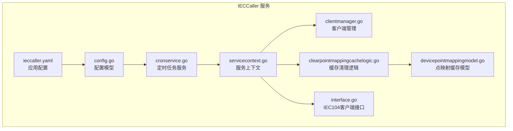
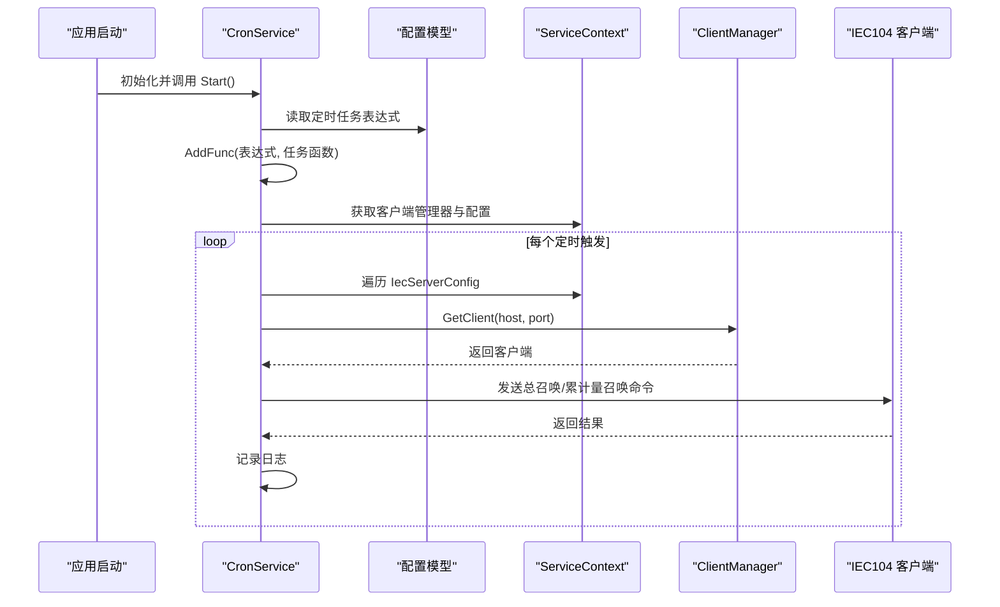
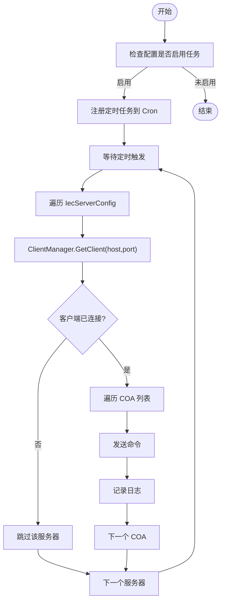
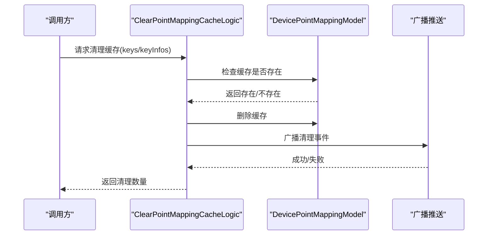
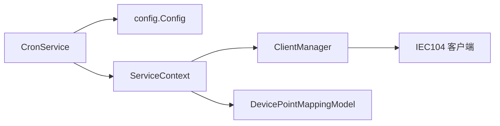

# 定时任务管理

<cite>
**本文引用的文件**
- [cronservice.go](file://app/ieccaller/cron/cronservice.go)
- [ieccaller.yaml](file://app/ieccaller/etc/ieccaller.yaml)
- [config.go](file://app/ieccaller/internal/config/config.go)
- [servicecontext.go](file://app/ieccaller/internal/svc/servicecontext.go)
- [clientmanager.go](file://common/iec104/client/clientmanager.go)
- [clearpointmappingcachelogic.go](file://app/ieccaller/internal/logic/clearpointmappingcachelogic.go)
- [devicepointmappingmodel.go](file://model/devicepointmappingmodel.go)
- [interface.go](file://common/iec104/client/interface.go)
</cite>

## 目录
1. [简介](#简介)
2. [项目结构](#项目结构)
3. [核心组件](#核心组件)
4. [架构总览](#架构总览)
5. [详细组件分析](#详细组件分析)
6. [依赖分析](#依赖分析)
7. [性能考虑](#性能考虑)
8. [故障排查指南](#故障排查指南)
9. [结论](#结论)
10. [附录](#附录)

## 简介
本文件面向 IECCaller 服务的定时任务管理能力，系统性阐述基于 Cron 的定时任务实现与调度机制，涵盖以下内容：
- 定时任务配置项与生效方式
- 任务执行策略与并发控制
- 监控与日志记录
- 典型定时任务场景：总召唤、累计量召唤
- 与点映射缓存清理、命令重试、系统健康检查的关系与扩展建议
- 性能优化与资源管理策略

IECCaller 服务通过 Cron 服务在启动时注册周期性任务，按配置周期向 IEC104 服务器发送总召唤与累计量召唤命令；同时提供点映射缓存清理能力，以保障数据一致性与性能。

## 项目结构
IECCaller 服务中与定时任务相关的关键目录与文件如下：
- 定时任务服务：app/ieccaller/cron/cronservice.go
- 应用配置：app/ieccaller/etc/ieccaller.yaml
- 服务配置模型：app/ieccaller/internal/config/config.go
- 服务上下文与推送链路：app/ieccaller/internal/svc/servicecontext.go
- IEC104 客户端管理：common/iec104/client/clientmanager.go
- 点映射缓存清理逻辑：app/ieccaller/internal/logic/clearpointmappingcachelogic.go
- 点映射缓存模型：model/devicepointmappingmodel.go
- IEC104 客户端接口定义：common/iec104/client/interface.go

图表来源
- [cronservice.go:1-78](file://app/ieccaller/cron/cronservice.go#L1-L78)
- [ieccaller.yaml:1-79](file://app/ieccaller/etc/ieccaller.yaml#L1-L79)
- [config.go:1-59](file://app/ieccaller/internal/config/config.go#L1-L59)
- [servicecontext.go:1-311](file://app/ieccaller/internal/svc/servicecontext.go#L1-L311)
- [clientmanager.go:1-145](file://common/iec104/client/clientmanager.go#L1-L145)
- [clearpointmappingcachelogic.go:1-61](file://app/ieccaller/internal/logic/clearpointmappingcachelogic.go#L1-L61)
- [devicepointmappingmodel.go:1-108](file://model/devicepointmappingmodel.go#L1-L108)
- [interface.go:1-71](file://common/iec104/client/interface.go#L1-L71)

章节来源
- [cronservice.go:1-78](file://app/ieccaller/cron/cronservice.go#L1-L78)
- [ieccaller.yaml:1-79](file://app/ieccaller/etc/ieccaller.yaml#L1-L79)
- [config.go:1-59](file://app/ieccaller/internal/config/config.go#L1-L59)
- [servicecontext.go:1-311](file://app/ieccaller/internal/svc/servicecontext.go#L1-L311)
- [clientmanager.go:1-145](file://common/iec104/client/clientmanager.go#L1-L145)
- [clearpointmappingcachelogic.go:1-61](file://app/ieccaller/internal/logic/clearpointmappingcachelogic.go#L1-L61)
- [devicepointmappingmodel.go:1-108](file://model/devicepointmappingmodel.go#L1-L108)
- [interface.go:1-71](file://common/iec104/client/interface.go#L1-L71)

## 核心组件
- Cron 服务：负责解析配置、注册定时任务、启动调度器并执行任务。
- 服务配置模型：定义 IECCaller 的运行参数、IEC104 服务器列表、定时任务表达式等。
- 服务上下文：提供 Kafka/MQTT/流事件推送、点映射缓存模型、客户端管理器等能力。
- 客户端管理器：维护 IEC104 客户端实例，提供按主机端口获取、连接状态统计等。
- 点映射缓存模型与清理逻辑：提供缓存键生成、缓存读取与删除、广播通知等。

章节来源
- [cronservice.go:11-21](file://app/ieccaller/cron/cronservice.go#L11-L21)
- [config.go:18-24](file://app/ieccaller/internal/config/config.go#L18-L24)
- [servicecontext.go:33-43](file://app/ieccaller/internal/svc/servicecontext.go#L33-L43)
- [clientmanager.go:11-27](file://common/iec104/client/clientmanager.go#L11-L27)
- [devicepointmappingmodel.go:30-44](file://model/devicepointmappingmodel.go#L30-L44)

## 架构总览
IECCaller 的定时任务架构围绕 Cron 服务展开，结合配置驱动的任务注册与客户端管理器提供的连接能力，形成“配置 -> 注册 -> 执行 -> 记录”的闭环。

图表来源
- [cronservice.go:23-71](file://app/ieccaller/cron/cronservice.go#L23-L71)
- [config.go:18-24](file://app/ieccaller/internal/config/config.go#L18-L24)
- [servicecontext.go:50-53](file://app/ieccaller/internal/svc/servicecontext.go#L50-L53)
- [clientmanager.go:57-68](file://common/iec104/client/clientmanager.go#L57-L68)

## 详细组件分析

### Cron 服务与任务注册
- 启动流程：CronService 在 Start 中根据配置注册两类定时任务：
  - 总召唤任务：当配置了 InterrogationCmdCron 表达式时，按表达式周期执行。
  - 累计量召唤任务：当配置了 CounterInterrogationCmd 表达式时，按表达式周期执行。
- 任务执行策略：
  - 对每个 IecServerConfig，先通过 ClientManager 获取对应客户端。
  - 若客户端不存在或未连接，则跳过该服务器。
  - 对每个服务器配置中的 COA 列表，依次发送对应命令。
  - 异常处理：捕获发送错误并记录日志，继续下一个 COA 或服务器。
- 调度器：使用带秒级精度的 Cron 实例，启动后持续调度。

图表来源
- [cronservice.go:23-71](file://app/ieccaller/cron/cronservice.go#L23-L71)

章节来源
- [cronservice.go:23-71](file://app/ieccaller/cron/cronservice.go#L23-L71)

### 配置模型与任务表达式
- 配置项：
  - InterrogationCmdCron：总召唤任务表达式，默认注释掉，可按需启用。
  - CounterInterrogationCmd：累计量召唤任务表达式，默认注释掉，可按需启用。
  - IecServerConfig：包含多个 IEC104 服务器配置，每项包含 Host、Port、IcCoaList、CcCoaList、TaskConcurrency 等。
- 配置加载：ieccaller.yaml 提供默认示例，实际部署时可覆盖。

章节来源
- [config.go:18-24](file://app/ieccaller/internal/config/config.go#L18-L24)
- [ieccaller.yaml:22-34](file://app/ieccaller/etc/ieccaller.yaml#L22-L34)

### 服务上下文与推送链路
- 服务上下文负责：
  - 初始化 ClientManager、Kafka/MQTT 推送器、流事件推送器。
  - 提供 PushASDU/PushBroadcast 等推送能力，以及点映射缓存模型。
- 与定时任务的关系：
  - 定时任务通过服务上下文获取客户端管理器，间接依赖此处初始化的客户端连接。
  - 推送链路与定时任务解耦，但可作为后续扩展（如命令执行后的数据推送）的基础。

章节来源
- [servicecontext.go:45-142](file://app/ieccaller/internal/svc/servicecontext.go#L45-L142)
- [servicecontext.go:144-244](file://app/ieccaller/internal/svc/servicecontext.go#L144-L244)

### 客户端管理器
- 能力：
  - 注册/注销客户端，按 host:port 管理。
  - 提供 GetClient、GetAllClients 等查询接口。
  - 统计循环：每分钟输出连接状态统计日志。
- 与定时任务的交互：
  - 定时任务通过 GetClient(host, port) 获取客户端，若未连接则跳过。
  - 定时任务不直接管理客户端生命周期，由上层服务负责。

章节来源
- [clientmanager.go:17-27](file://common/iec104/client/clientmanager.go#L17-L27)
- [clientmanager.go:57-68](file://common/iec104/client/clientmanager.go#L57-L68)
- [clientmanager.go:117-144](file://common/iec104/client/clientmanager.go#L117-L144)

### 点映射缓存清理逻辑
- 功能：
  - 支持按键或键信息批量清理点映射缓存。
  - 清理后通过广播通知其他节点，保持集群一致性。
- 与定时任务的关系：
  - 可作为独立 RPC 能力使用；也可设计为定时任务（例如定期清理过期或异常缓存），当前代码未内置该定时任务，但具备扩展条件。

图表来源
- [clearpointmappingcachelogic.go:27-60](file://app/ieccaller/internal/logic/clearpointmappingcachelogic.go#L27-L60)
- [devicepointmappingmodel.go:54-64](file://model/devicepointmappingmodel.go#L54-L64)
- [servicecontext.go:246-285](file://app/ieccaller/internal/svc/servicecontext.go#L246-L285)

章节来源
- [clearpointmappingcachelogic.go:27-60](file://app/ieccaller/internal/logic/clearpointmappingcachelogic.go#L27-L60)
- [devicepointmappingmodel.go:54-64](file://model/devicepointmappingmodel.go#L54-L64)
- [servicecontext.go:246-285](file://app/ieccaller/internal/svc/servicecontext.go#L246-L285)

### 点映射缓存模型
- 缓存结构：
  - 使用内存缓存存储点映射条目，默认过期时间 24 小时。
  - 提供 GetCache、FindCacheOneByTagStationCoaIoa、RemoveCache 等方法。
- 键生成规则：pm:{tagStation}:{coa}:{ioa}。
- 与清理逻辑配合：清理逻辑通过键或键信息删除缓存条目。

章节来源
- [devicepointmappingmodel.go:30-44](file://model/devicepointmappingmodel.go#L30-L44)
- [devicepointmappingmodel.go:70-72](file://model/devicepointmappingmodel.go#L70-L72)
- [devicepointmappingmodel.go:74-107](file://model/devicepointmappingmodel.go#L74-L107)

### IEC104 客户端接口
- 定义了多种回调接口（如总召唤、累计量召唤、读定值、测试命令等），用于处理来自 IEC104 服务器的响应。
- 与定时任务的关系：
  - 定时任务通过客户端发送请求；响应处理由客户端接口定义的回调完成。

章节来源
- [interface.go:6-23](file://common/iec104/client/interface.go#L6-L23)

## 依赖分析
- Cron 服务依赖配置模型与服务上下文，通过 ClientManager 获取 IEC104 客户端并执行命令。
- 服务上下文提供 Kafka/MQTT/流事件推送与点映射缓存模型，支撑数据推送与缓存清理。
- 客户端管理器提供连接管理与统计，定时任务依赖其返回的已连接客户端。

图表来源
- [cronservice.go:16-21](file://app/ieccaller/cron/cronservice.go#L16-L21)
- [config.go:18-24](file://app/ieccaller/internal/config/config.go#L18-L24)
- [servicecontext.go:50-53](file://app/ieccaller/internal/svc/servicecontext.go#L50-L53)
- [clientmanager.go:11-27](file://common/iec104/client/clientmanager.go#L11-L27)

章节来源
- [cronservice.go:16-21](file://app/ieccaller/cron/cronservice.go#L16-L21)
- [config.go:18-24](file://app/ieccaller/internal/config/config.go#L18-L24)
- [servicecontext.go:50-53](file://app/ieccaller/internal/svc/servicecontext.go#L50-L53)
- [clientmanager.go:11-27](file://common/iec104/client/clientmanager.go#L11-L27)

## 性能考虑
- 任务并发与限流
  - 当前定时任务对每个服务器的 COA 列表采用顺序发送，未见显式并发控制。若需提升吞吐，可在任务内部引入并发限制与超时控制。
- 客户端连接管理
  - ClientManager 提供连接状态统计，建议在任务执行前检查连接状态，避免无效尝试。
- 日志与可观测性
  - 任务执行路径包含日志记录，建议结合日志级别与采样策略，避免高频任务产生过多日志。
- 资源释放
  - 服务上下文提供 Close 方法统一关闭 Kafka/MQTT/客户端等资源，确保优雅停机。

章节来源
- [clientmanager.go:117-144](file://common/iec104/client/clientmanager.go#L117-L144)
- [servicecontext.go:291-310](file://app/ieccaller/internal/svc/servicecontext.go#L291-L310)

## 故障排查指南
- 任务未执行
  - 检查配置中是否启用相应任务表达式（总召唤/累计量）。
  - 确认 IecServerConfig 是否正确配置，且客户端已注册并处于连接状态。
- 命令发送失败
  - 查看日志中命令发送错误记录，定位具体服务器与 COA。
  - 检查客户端连接状态与网络连通性。
- 缓存清理无效
  - 确认清理逻辑是否被调用，以及广播是否成功。
  - 检查点映射缓存键是否匹配预期。

章节来源
- [cronservice.go:38-42](file://app/ieccaller/cron/cronservice.go#L38-L42)
- [servicecontext.go:246-285](file://app/ieccaller/internal/svc/servicecontext.go#L246-L285)
- [clearpointmappingcachelogic.go:53-55](file://app/ieccaller/internal/logic/clearpointmappingcachelogic.go#L53-L55)

## 结论
IECCaller 的定时任务管理以配置驱动为核心，通过 Cron 服务在启动时注册周期性任务，按配置向 IEC104 服务器发送总召唤与累计量召唤命令。服务上下文提供了完善的推送与缓存能力，客户端管理器保证了连接的可用性与可观测性。当前实现聚焦于两类核心任务，点映射缓存清理可作为独立能力或扩展为定时任务使用。未来可在任务并发、超时与异常恢复方面进一步增强，以满足更高吞吐与稳定性需求。

## 附录
- 配置示例位置：[ieccaller.yaml:72-75](file://app/ieccaller/etc/ieccaller.yaml#L72-L75)
- 任务注册位置：[cronservice.go:23-71](file://app/ieccaller/cron/cronservice.go#L23-L71)
- 缓存模型位置：[devicepointmappingmodel.go:30-44](file://model/devicepointmappingmodel.go#L30-L44)
- 客户端管理位置：[clientmanager.go:17-27](file://common/iec104/client/clientmanager.go#L17-L27)