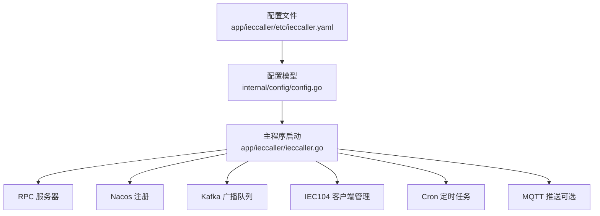
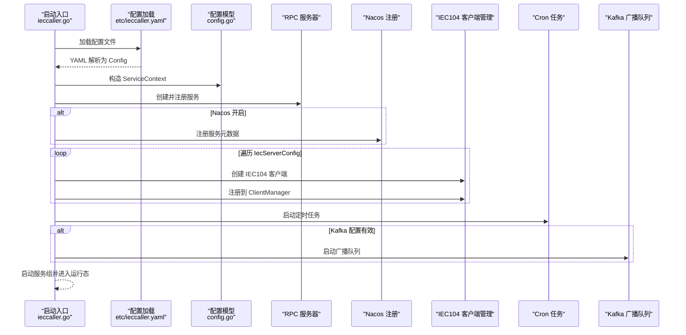
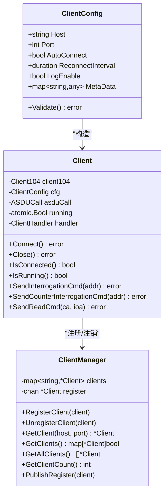
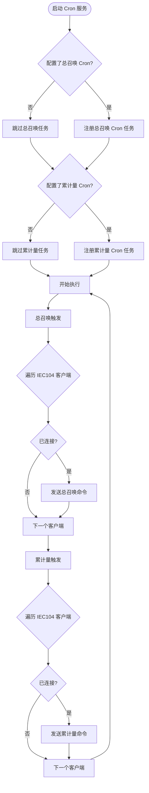
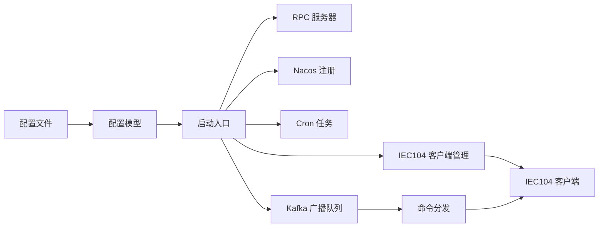

# 配置管理

<cite>
**本文引用的文件**   
- [app/ieccaller/etc/ieccaller.yaml](file://app/ieccaller/etc/ieccaller.yaml)
- [app/ieccaller/internal/config/config.go](file://app/ieccaller/internal/config/config.go)
- [app/ieccaller/ieccaller.go](file://app/ieccaller/ieccaller.go)
- [app/ieccaller/cron/cronservice.go](file://app/ieccaller/cron/cronservice.go)
- [app/ieccaller/kafka/broadcast.go](file://app/ieccaller/kafka/broadcast.go)
- [common/iec104/client/core.go](file://common/iec104/client/core.go)
- [common/iec104/client/clientmanager.go](file://common/iec104/client/clientmanager.go)
- [common/mqttx/mqttx.go](file://common/mqttx/mqttx.go)
- [common/nacosx/config.go](file://common/nacosx/config.go)
- [.trae/skills/zero-skills/best-practices/overview.md](file://.trae/skills/zero-skills/best-practices/overview.md)
</cite>

## 目录
1. [简介](#简介)
2. [项目结构](#项目结构)
3. [核心组件](#核心组件)
4. [架构总览](#架构总览)
5. [详细组件分析](#详细组件分析)
6. [依赖关系分析](#依赖关系分析)
7. [性能考量](#性能考量)
8. [故障排查指南](#故障排查指南)
9. [结论](#结论)
10. [附录](#附录)

## 简介
本文件面向 IECCaller 服务的配置管理，系统性阐述配置文件结构、参数语义与配置项作用机制，并覆盖以下关键领域：
- RPC 服务器配置
- Nacos 注册配置
- Kafka 消息配置（含广播）
- IEC104 客户端配置
- Cron 任务配置
- 开发与生产环境差异
- 默认值、动态更新策略与最佳实践

目标是帮助读者快速理解并正确部署与维护 IECCaller 服务。

## 项目结构
IECCaller 的配置位于应用级 etc 目录，核心配置模型在 internal/config 中定义，运行期由主程序加载并驱动各子系统（RPC、Nacos、Kafka、MQTT、IEC104 客户端、Cron、直推等）。

图表来源
- [app/ieccaller/etc/ieccaller.yaml:1-79](file://app/ieccaller/etc/ieccaller.yaml#L1-L79)
- [app/ieccaller/internal/config/config.go:18-58](file://app/ieccaller/internal/config/config.go#L18-L58)
- [app/ieccaller/ieccaller.go:44-122](file://app/ieccaller/ieccaller.go#L44-L122)

章节来源
- [app/ieccaller/etc/ieccaller.yaml:1-79](file://app/ieccaller/etc/ieccaller.yaml#L1-L79)
- [app/ieccaller/internal/config/config.go:1-59](file://app/ieccaller/internal/config/config.go#L1-L59)
- [app/ieccaller/ieccaller.go:41-123](file://app/ieccaller/ieccaller.go#L41-L123)

## 核心组件
- 配置模型（Config）：集中定义 RPC、Nacos、Kafka、MQTT、StreamEvent、数据库、定时任务、批处理大小、优雅停机等配置项及其默认值。
- IEC104 客户端配置（IecServerConfig）：包含每个 IEC104 从站的连接参数、定时总召唤/累计量召唤的 COA 列表、任务并发度与元数据透传。
- 启动流程：加载配置 → 构建 RPC 服务器 → 可选注册 Nacos → 启动 IEC104 客户端 → 启动 Cron → 启动 Kafka 广播队列 → 启动服务组。
- 运行期控制：通过配置项控制广播、推送开关、批处理大小、优雅停机窗口等。

章节来源
- [app/ieccaller/internal/config/config.go:11-58](file://app/ieccaller/internal/config/config.go#L11-L58)
- [app/ieccaller/ieccaller.go:53-122](file://app/ieccaller/ieccaller.go#L53-L122)

## 架构总览
下图展示 IECCaller 在启动阶段如何解析配置并驱动各子系统：

图表来源
- [app/ieccaller/ieccaller.go:44-122](file://app/ieccaller/ieccaller.go#L44-L122)
- [app/ieccaller/etc/ieccaller.yaml:1-79](file://app/ieccaller/etc/ieccaller.yaml#L1-L79)
- [app/ieccaller/internal/config/config.go:18-58](file://app/ieccaller/internal/config/config.go#L18-L58)

## 详细组件分析

### RPC 服务器配置
- 字段要点
  - Name/ListenOn：服务名与监听地址
  - DeployMode：部署模式（standalone/cluster），影响注册元数据与广播行为
  - Mode/Timeout/Log：运行模式、超时、日志编码/路径/级别/保留天数
- 默认值与行为
  - Timeout 默认值来自 RPC 服务器配置基类
  - 日志默认编码为纯文本，路径与级别可按环境调整
- 动态更新策略
  - RPC 服务器配置通常在进程启动时一次性加载；运行期不建议变更监听端口等关键字段
  - 建议通过环境变量或外部配置中心进行覆盖（见“最佳实践”）

章节来源
- [app/ieccaller/etc/ieccaller.yaml:1-12](file://app/ieccaller/etc/ieccaller.yaml#L1-L12)
- [app/ieccaller/internal/config/config.go:18-21](file://app/ieccaller/internal/config/config.go#L18-L21)

### Nacos 注册配置
- 字段要点
  - IsRegister：是否注册到 Nacos
  - Host/Port/Username/PassWord/NamespaceId/ServiceName：注册所需凭据与命名空间
- 注册元数据
  - gRPC_port、deployMode、broadcastTopic、broadcastGroupId、isPush 等元数据随服务注册写入
- 行为与默认值
  - 默认不注册；开启后使用给定凭据与命名空间注册
- 动态更新策略
  - 注册发生在启动阶段；如需切换注册状态，需重启服务
  - 生产环境建议开启并使用强密码与独立命名空间

章节来源
- [app/ieccaller/etc/ieccaller.yaml:13-20](file://app/ieccaller/etc/ieccaller.yaml#L13-L20)
- [app/ieccaller/ieccaller.go:61-82](file://app/ieccaller/ieccaller.go#L61-L82)
- [common/nacosx/config.go:15-37](file://common/nacosx/config.go#L15-L37)

### Kafka 消息配置（含广播）
- 字段要点
  - Brokers：Kafka 地址列表
  - Topic：ASDU 推送主题（默认 asdu）
  - BroadcastTopic：集群广播主题（默认 iec-broadcast）
  - BroadcastGroupId：广播消费组 ID（默认 iec-caller）
  - IsPush：是否启用 Kafka 推送（默认 false）
- 广播队列行为
  - 当配置有效时，启动广播队列，消费 BroadcastTopic 并根据方法分发到对应 IEC104 命令
  - 仅在 cluster 模式下生效；同组广播会被忽略
- 默认值与批处理
  - PushAsduChunkBytes 默认 1MB；GracePeriod 默认 10s（可通过配置覆盖）
- 动态更新策略
  - 广播队列与推送开关在运行期不可动态热更新；Brokers 变更需重启
  - 建议通过配置中心或环境变量在部署层统一管理

章节来源
- [app/ieccaller/etc/ieccaller.yaml:35-41](file://app/ieccaller/etc/ieccaller.yaml#L35-L41)
- [app/ieccaller/internal/config/config.go:36-42](file://app/ieccaller/internal/config/config.go#L36-L42)
- [app/ieccaller/ieccaller.go:99-117](file://app/ieccaller/ieccaller.go#L99-L117)
- [app/ieccaller/kafka/broadcast.go:24-148](file://app/ieccaller/kafka/broadcast.go#L24-L148)

### IEC104 客户端配置
- 字段要点
  - Host/Port：从站地址
  - IcCoaList/CcCoaList：定时总召唤/累计量召唤的公共地址（COA）列表
  - TaskConcurrency：任务并发度（默认 32）
  - MetaData：透传到消息中的自定义元数据
  - LogEnable：是否启用 IEC104 日志
- 客户端生命周期与管理
  - 启动时为每个 IecServerConfig 创建客户端实例并注册到 ClientManager
  - ClientManager 维护连接状态统计与查找
- 默认值与校验
  - AutoConnect 默认开启；ReconnectInterval 默认 1 分钟；LogEnable 默认开启
  - 配置校验要求 Host 非空、Port 合法范围
- 动态更新策略
  - 新增/删除 IEC104 从站需重启服务；运行期可调整 COA 列表与并发度（通过配置中心/环境变量）

图表来源
- [common/iec104/client/core.go:19-175](file://common/iec104/client/core.go#L19-L175)
- [common/iec104/client/clientmanager.go:11-144](file://common/iec104/client/clientmanager.go#L11-L144)

章节来源
- [app/ieccaller/etc/ieccaller.yaml:22-34](file://app/ieccaller/etc/ieccaller.yaml#L22-L34)
- [app/ieccaller/internal/config/config.go:11-16](file://app/ieccaller/internal/config/config.go#L11-L16)
- [common/iec104/client/core.go:19-37](file://common/iec104/client/core.go#L19-L37)
- [common/iec104/client/clientmanager.go:35-100](file://common/iec104/client/clientmanager.go#L35-L100)

### Cron 任务配置
- 字段要点
  - InterrogationCmdCron：定时总召唤的 Cron 表达式（默认注释关闭）
  - CounterInterrogationCmd：定时累计量召唤的 Cron 表达式（默认注释关闭）
- 行为逻辑
  - 启动时根据配置注册 Cron 任务
  - 任务触发后遍历 IecServerConfig，获取对应客户端并发送命令
  - 仅在客户端已连接时执行
- 默认值与动态更新
  - 未配置时不启动对应任务；修改表达式需重启服务

图表来源
- [app/ieccaller/cron/cronservice.go:23-73](file://app/ieccaller/cron/cronservice.go#L23-L73)
- [app/ieccaller/etc/ieccaller.yaml:73-75](file://app/ieccaller/etc/ieccaller.yaml#L73-L75)

章节来源
- [app/ieccaller/internal/config/config.go:23-24](file://app/ieccaller/internal/config/config.go#L23-L24)
- [app/ieccaller/cron/cronservice.go:23-73](file://app/ieccaller/cron/cronservice.go#L23-L73)

### MQTT 推送配置（可选）
- 字段要点
  - Broker/Broker 列表、ClientId/Username/Password/Qos/Timeout/KeepAlive
  - Topic：支持模板语法动态生成多主题
  - IsPush：是否启用 MQTT 推送（默认 false）
- 行为与默认值
  - 若未配置或 IsPush=false，则不启用推送
  - Qos 默认 1（超出范围会回退到 1）
- 动态更新策略
  - Broker/Topic 等在运行期不可动态热更新；建议通过配置中心或环境变量管理

章节来源
- [app/ieccaller/etc/ieccaller.yaml:42-57](file://app/ieccaller/etc/ieccaller.yaml#L42-L57)
- [app/ieccaller/internal/config/config.go:44-48](file://app/ieccaller/internal/config/config.go#L44-L48)
- [common/mqttx/mqttx.go:52-64](file://common/mqttx/mqttx.go#L52-L64)

### StreamEvent 直推配置
- 字段要点
  - Endpoints：直推目标 gRPC 端点列表
  - 非阻塞与超时可按需配置
- 行为
  - 用于将 ASDU 数据直推至流事件服务（例如 iecstash/bridgegtw 等）
- 默认值与动态更新
  - 默认未启用；启用后建议通过配置中心统一管理

章节来源
- [app/ieccaller/etc/ieccaller.yaml:58-64](file://app/ieccaller/etc/ieccaller.yaml#L58-L64)
- [app/ieccaller/internal/config/config.go:50](file://app/ieccaller/internal/config/config.go#L50)

### 数据库配置（可选）
- 字段要点
  - DataSource：SQLite/PostgreSQL 等数据源字符串
- 行为
  - 配置后可启用点位映射缓存清理等能力（结合业务模型）
- 默认值与动态更新
  - 未配置时不启用；变更数据源需重启服务

章节来源
- [app/ieccaller/etc/ieccaller.yaml:65-69](file://app/ieccaller/etc/ieccaller.yaml#L65-L69)
- [app/ieccaller/internal/config/config.go:53-55](file://app/ieccaller/internal/config/config.go#L53-L55)

### 其他通用配置
- DisableStmtLog：是否禁用 SQL 语句日志（默认 false）
- GracePeriod：优雅停机窗口（默认 10s，可在启动时设置）
- PushAsduChunkBytes：单批次推送字节数（默认 1MB）

章节来源
- [app/ieccaller/etc/ieccaller.yaml:70-79](file://app/ieccaller/etc/ieccaller.yaml#L70-L79)
- [app/ieccaller/internal/config/config.go:52-57](file://app/ieccaller/internal/config/config.go#L52-L57)
- [app/ieccaller/ieccaller.go:46](file://app/ieccaller/ieccaller.go#L46)

## 依赖关系分析
- 配置文件与模型解耦：YAML 仅描述结构，模型负责默认值与校验
- 启动流程依赖：RPC → Nacos → IEC104 → Cron → Kafka → 服务组
- IEC104 客户端与管理器：客户端注册到 ClientManager，供 Cron/广播/查询使用
- 广播链路：Kafka 广播队列消费消息，分发到具体 IEC104 命令

图表来源
- [app/ieccaller/etc/ieccaller.yaml:1-79](file://app/ieccaller/etc/ieccaller.yaml#L1-L79)
- [app/ieccaller/internal/config/config.go:18-58](file://app/ieccaller/internal/config/config.go#L18-L58)
- [app/ieccaller/ieccaller.go:89-117](file://app/ieccaller/ieccaller.go#L89-L117)

章节来源
- [app/ieccaller/ieccaller.go:89-117](file://app/ieccaller/ieccaller.go#L89-L117)
- [common/iec104/client/clientmanager.go:35-100](file://common/iec104/client/clientmanager.go#L35-L100)

## 性能考量
- IEC104 并发度：TaskConcurrency 控制每从站任务并发，过高可能引发从站压力，建议按从站能力与网络状况调优
- 批处理大小：PushAsduChunkBytes 默认 1MB，可根据网络带宽与下游吞吐调整
- Kafka 广播：消费者/处理器数量与最小/最大字节应与流量匹配，避免频繁小包或内存占用过高
- 日志与调试：LogEnable 与 DisableStmtLog 影响可观测性与性能，生产环境建议适度降低冗余日志

## 故障排查指南
- IEC104 连接失败
  - 检查 Host/Port 与网络连通性
  - 关注 AutoConnect 与 ReconnectInterval 配置
  - 查看 ClientManager 统计输出，确认连接/断开状态
- Cron 任务未执行
  - 确认 Cron 表达式格式正确且非注释状态
  - 检查客户端是否已连接，任务仅在连接状态下执行
- Kafka 广播无效
  - 确认 Brokers/Topic/GroupId 配置正确
  - 检查 IsPush 与 DeployMode，确保广播队列已启动
  - 同组广播会被忽略，检查 BroadcastGroupId
- MQTT 推送异常
  - 检查 Broker/用户名/密码/Qos/Topic 模板
  - 确认 IsPush=true 且客户端已连接

章节来源
- [common/iec104/client/core.go:19-37](file://common/iec104/client/core.go#L19-L37)
- [common/iec104/client/clientmanager.go:117-144](file://common/iec104/client/clientmanager.go#L117-L144)
- [app/ieccaller/cron/cronservice.go:23-73](file://app/ieccaller/cron/cronservice.go#L23-L73)
- [app/ieccaller/kafka/broadcast.go:24-148](file://app/ieccaller/kafka/broadcast.go#L24-L148)
- [common/mqttx/mqttx.go:100-178](file://common/mqttx/mqttx.go#L100-L178)

## 结论
IECCaller 的配置体系以清晰的分层设计实现高可维护性：配置文件描述需求，配置模型提供默认值与校验，启动流程串联各子系统。通过合理设置 RPC、Nacos、Kafka、IEC104、Cron、MQTT 等配置，可在开发与生产环境中获得稳定可靠的运行表现。建议结合环境变量与配置中心，在部署层统一管理关键配置，确保变更可控、可追踪。

## 附录

### 配置项一览与默认值
- RPC 服务器
  - Name/ListenOn/Mode/Timeout/Log：参见配置文件与模型
- Nacos
  - IsRegister/Host/Port/Username/PassWord/NamespaceId/ServiceName：参见配置文件与注册逻辑
- Kafka
  - Brokers/Topic/BroadcastTopic/BroadcastGroupId/IsPush：参见配置文件与模型
- IEC104
  - Host/Port/IcCoaList/CcCoaList/TaskConcurrency/MetaData/LogEnable：参见配置文件与模型
- Cron
  - InterrogationCmdCron/CounterInterrogationCmd：参见配置文件与模型
- MQTT
  - Broker/ClientId/Username/Password/Qos/Timeout/KeepAlive/Topic/IsPush：参见配置文件与模型
- StreamEvent
  - Endpoints/NonBlock/Timeout：参见配置文件与模型
- 数据库
  - DataSource：参见配置文件与模型
- 其他
  - DisableStmtLog/PushAsduChunkBytes/GracePeriod：参见配置文件与模型

章节来源
- [app/ieccaller/etc/ieccaller.yaml:1-79](file://app/ieccaller/etc/ieccaller.yaml#L1-L79)
- [app/ieccaller/internal/config/config.go:18-58](file://app/ieccaller/internal/config/config.go#L18-L58)

### 开发与生产环境差异建议
- 日志与可观测性
  - 开发：日志级别 info，可开启反射；生产：info/error 级别，关闭反射
- 注册与发现
  - 开发：可关闭 Nacos 注册；生产：开启并使用独立命名空间与强密码
- 推送与广播
  - 开发：可关闭 Kafka/MQTT 推送；生产：按需开启并配置监控告警
- 并发与批处理
  - 开发：较低并发与较小批处理；生产：基于压测结果调优
- 优雅停机
  - 根据业务场景调整 GracePeriod，确保平滑下线

章节来源
- [app/ieccaller/etc/ieccaller.yaml:1-12](file://app/ieccaller/etc/ieccaller.yaml#L1-L12)
- [app/ieccaller/ieccaller.go:46](file://app/ieccaller/ieccaller.go#L46)
- [.trae/skills/zero-skills/best-practices/overview.md:60-138](file://.trae/skills/zero-skills/best-practices/overview.md#L60-L138)