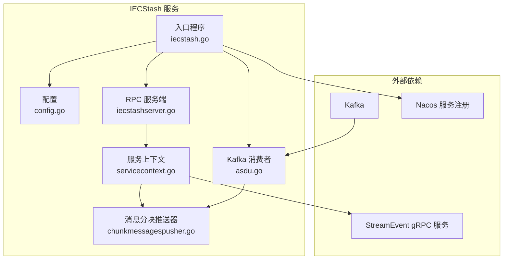
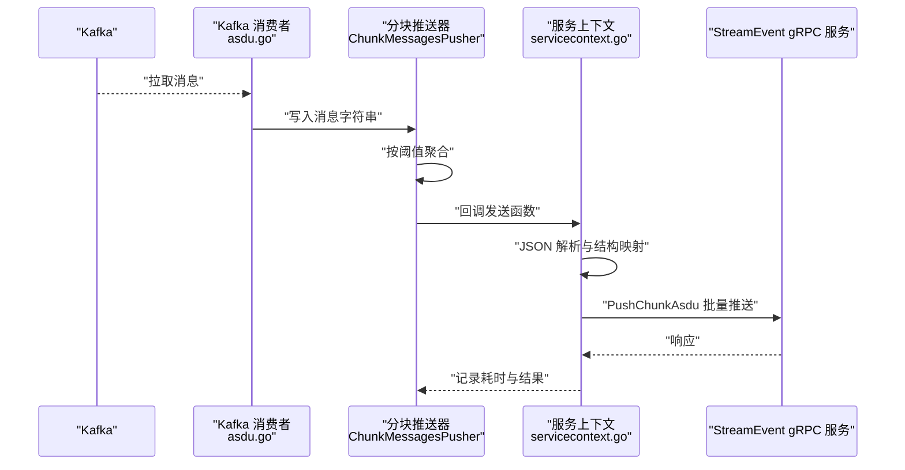
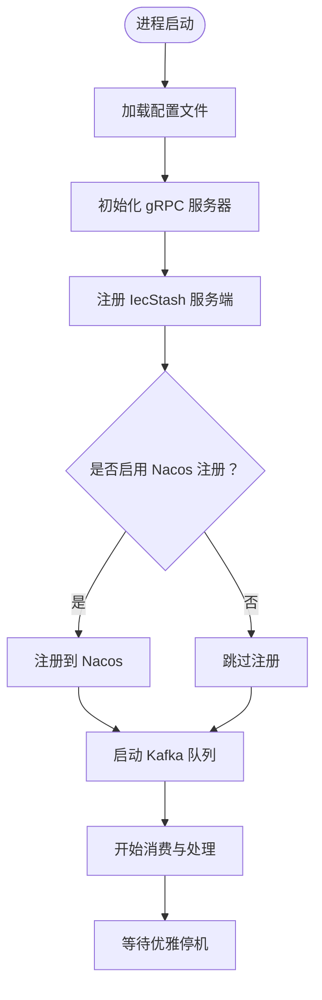
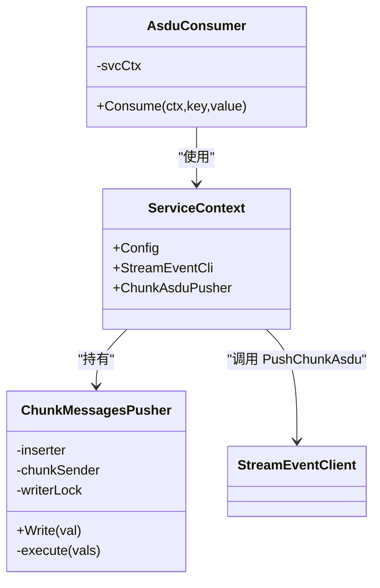
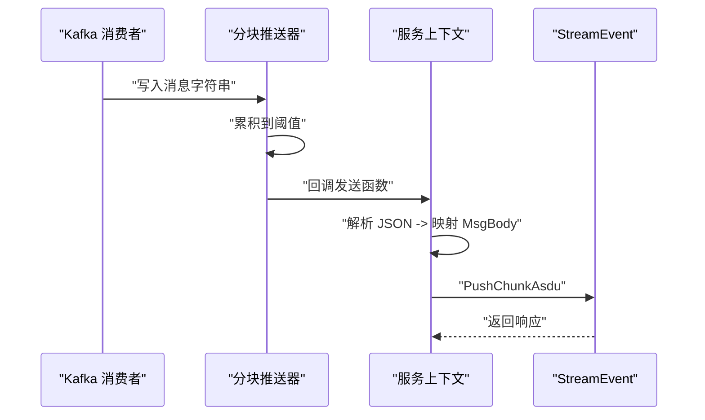
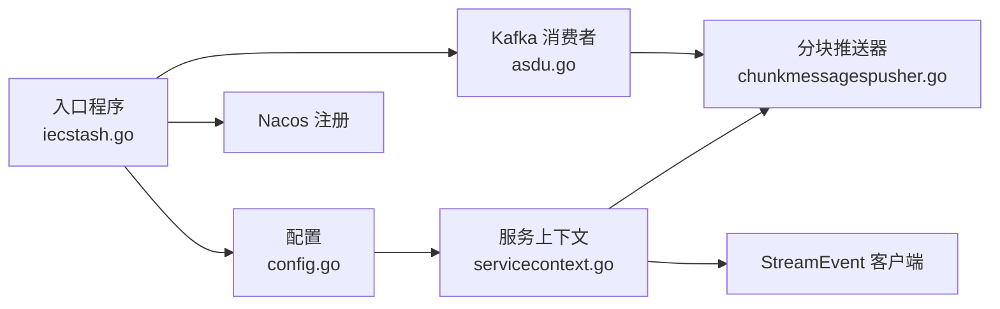

# IECStash 存储服务

<cite>
**本文引用的文件**
- [app/iecstash/etc/iecstash.yaml](file://app/iecstash/etc/iecstash.yaml)
- [app/iecstash/iecstash.go](file://app/iecstash/iecstash.go)
- [app/iecstash/internal/config/config.go](file://app/iecstash/internal/config/config.go)
- [app/iecstash/internal/svc/servicecontext.go](file://app/iecstash/internal/svc/servicecontext.go)
- [app/iecstash/internal/server/iecstashserver.go](file://app/iecstash/internal/server/iecstashserver.go)
- [app/iecstash/internal/logic/pinglogic.go](file://app/iecstash/internal/logic/pinglogic.go)
- [app/iecstash/kafka/asdu.go](file://app/iecstash/kafka/asdu.go)
- [common/executorx/chunkmessagespusher.go](file://common/executorx/chunkmessagespusher.go)
- [facade/streamevent/streamevent.proto](file://facade/streamevent/streamevent.proto)
</cite>

## 目录
1. [简介](#简介)
2. [项目结构](#项目结构)
3. [核心组件](#核心组件)
4. [架构总览](#架构总览)
5. [详细组件分析](#详细组件分析)
6. [依赖分析](#依赖分析)
7. [性能考虑](#性能考虑)
8. [故障排查指南](#故障排查指南)
9. [结论](#结论)
10. [附录](#附录)

## 简介
IECStash 是一个基于 gRPC 的消息存储与转发服务，专注于接收来自 Kafka 的 IEC 104（ASDU）协议消息，进行缓冲聚合、格式解析与转换，并通过 gRPC 推送到 StreamEvent 服务进行后续处理。其核心目标是提供高吞吐、低延迟的消息缓存与分发能力，支撑电力系统自动化场景下的实时数据接入与持久化。

## 项目结构
IECStash 采用 go-zero 微服务框架组织，主要模块如下：
- 配置层：加载 YAML 配置，包含 gRPC 服务、Kafka 消费、Nacos 注册、日志与流事件客户端等。
- 服务入口：初始化 RPC 服务器、注册服务、可选反射调试、注册到 Nacos。
- 服务上下文：构建 StreamEvent 客户端、消息分块推送器（ChunkMessagesPusher），负责消息聚合与推送。
- Kafka 消费：订阅 Kafka 主题，消费消息后写入分块推送器。
- 逻辑与服务端：提供最小化的 Ping 接口；核心业务在 Kafka 消费与推送链路中完成。

图表来源
- [app/iecstash/iecstash.go:35-84](file://app/iecstash/iecstash.go#L35-L84)
- [app/iecstash/internal/config/config.go:10-28](file://app/iecstash/internal/config/config.go#L10-L28)
- [app/iecstash/internal/svc/servicecontext.go:25-91](file://app/iecstash/internal/svc/servicecontext.go#L25-L91)
- [app/iecstash/internal/server/iecstashserver.go:20-29](file://app/iecstash/internal/server/iecstashserver.go#L20-L29)
- [app/iecstash/kafka/asdu.go:20-24](file://app/iecstash/kafka/asdu.go#L20-L24)
- [common/executorx/chunkmessagespusher.go:17-44](file://common/executorx/chunkmessagespusher.go#L17-L44)

章节来源
- [app/iecstash/iecstash.go:35-84](file://app/iecstash/iecstash.go#L35-L84)
- [app/iecstash/etc/iecstash.yaml:1-46](file://app/iecstash/etc/iecstash.yaml#L1-L46)

## 核心组件
- 配置中心：集中管理 gRPC 监听、日志级别、Kafka 连接与消费者并发、Nacos 注册信息、流事件客户端、分块推送字节阈值与优雅停机时长等。
- 服务上下文：构建 StreamEvent 客户端（支持大消息发送）、初始化分块推送器（按字节阈值聚合），并在推送时进行 JSON 解析与结构体映射。
- Kafka 消费者：从指定主题与消费者组拉取消息，写入分块推送器，触发批量推送。
- 分块推送器：基于 go-zero 的 ChunkExecutor 实现，按阈值自动聚合字符串消息，回调自定义发送函数。
- RPC 服务端：提供最小可用的 Ping 接口，便于健康检查与调试。

章节来源
- [app/iecstash/internal/config/config.go:10-28](file://app/iecstash/internal/config/config.go#L10-L28)
- [app/iecstash/internal/svc/servicecontext.go:25-91](file://app/iecstash/internal/svc/servicecontext.go#L25-L91)
- [app/iecstash/kafka/asdu.go:20-24](file://app/iecstash/kafka/asdu.go#L20-L24)
- [common/executorx/chunkmessagespusher.go:17-44](file://common/executorx/chunkmessagespusher.go#L17-L44)
- [app/iecstash/internal/server/iecstashserver.go:20-29](file://app/iecstash/internal/server/iecstashserver.go#L20-L29)

## 架构总览
IECStash 的运行时架构由“消费-聚合-转换-推送”四阶段组成：
- 消费阶段：Kafka 消费者从指定 Topic 与消费者组拉取消息。
- 聚合阶段：分块推送器根据阈值（字节数）将多条消息合并为批次。
- 转换阶段：解析每条原始消息的 JSON 字段，映射为 StreamEvent 的 MsgBody 结构。
- 推送阶段：通过 gRPC 将批次消息推送到 StreamEvent 服务，记录耗时与结果。

图表来源
- [app/iecstash/kafka/asdu.go:20-24](file://app/iecstash/kafka/asdu.go#L20-L24)
- [common/executorx/chunkmessagespusher.go:32-44](file://common/executorx/chunkmessagespusher.go#L32-L44)
- [app/iecstash/internal/svc/servicecontext.go:36-84](file://app/iecstash/internal/svc/servicecontext.go#L36-L84)
- [facade/streamevent/streamevent.proto:82-133](file://facade/streamevent/streamevent.proto#L82-L133)

## 详细组件分析

### 配置与启动流程
- 启动入口加载配置文件，设置优雅停机时长，初始化 gRPC 服务器并注册服务端。
- 若开启 Nacos 注册，则将服务注册到 Nacos，便于服务发现与治理。
- 启动 Kafka 队列，绑定消费者处理器，开始消费消息。

图表来源
- [app/iecstash/iecstash.go:35-84](file://app/iecstash/iecstash.go#L35-L84)
- [app/iecstash/etc/iecstash.yaml:1-46](file://app/iecstash/etc/iecstash.yaml#L1-L46)

章节来源
- [app/iecstash/iecstash.go:35-84](file://app/iecstash/iecstash.go#L35-L84)
- [app/iecstash/etc/iecstash.yaml:1-46](file://app/iecstash/etc/iecstash.yaml#L1-L46)

### 服务上下文与消息分块推送器
- 服务上下文负责：
  - 构建 StreamEvent gRPC 客户端，支持超大消息发送（发送侧设置最大消息大小）。
  - 初始化分块推送器，传入回调函数与分块阈值（字节）。
  - 在回调中对每条消息进行 JSON 解析，提取关键字段并映射为 MsgBody 列表。
  - 调用 PushChunkAsdu 接口推送批次消息，记录耗时与结果。
- 分块推送器：
  - 基于 ChunkExecutor 的 Add/execute 机制，按阈值自动聚合。
  - 写入操作加锁，保证并发安全。
  - 回调函数接收字符串切片，统一转为批量请求。

图表来源
- [app/iecstash/internal/svc/servicecontext.go:19-91](file://app/iecstash/internal/svc/servicecontext.go#L19-L91)
- [common/executorx/chunkmessagespusher.go:11-44](file://common/executorx/chunkmessagespusher.go#L11-L44)
- [app/iecstash/kafka/asdu.go:10-24](file://app/iecstash/kafka/asdu.go#L10-L24)

章节来源
- [app/iecstash/internal/svc/servicecontext.go:25-91](file://app/iecstash/internal/svc/servicecontext.go#L25-L91)
- [common/executorx/chunkmessagespusher.go:17-44](file://common/executorx/chunkmessagespusher.go#L17-L44)
- [app/iecstash/kafka/asdu.go:20-24](file://app/iecstash/kafka/asdu.go#L20-L24)

### Kafka 消费与消息处理流程
- Kafka 消费者从配置的主题与消费者组拉取消息，将消息体写入分块推送器。
- 分块推送器达到阈值后触发回调，服务上下文解析 JSON 并映射为 MsgBody，随后批量推送到 StreamEvent。

图表来源
- [app/iecstash/kafka/asdu.go:20-24](file://app/iecstash/kafka/asdu.go#L20-L24)
- [common/executorx/chunkmessagespusher.go:32-44](file://common/executorx/chunkmessagespusher.go#L32-L44)
- [app/iecstash/internal/svc/servicecontext.go:36-84](file://app/iecstash/internal/svc/servicecontext.go#L36-L84)
- [facade/streamevent/streamevent.proto:82-133](file://facade/streamevent/streamevent.proto#L82-L133)

章节来源
- [app/iecstash/kafka/asdu.go:20-24](file://app/iecstash/kafka/asdu.go#L20-L24)
- [common/executorx/chunkmessagespusher.go:32-44](file://common/executorx/chunkmessagespusher.go#L32-L44)
- [app/iecstash/internal/svc/servicecontext.go:36-84](file://app/iecstash/internal/svc/servicecontext.go#L36-L84)

### 查询接口与数据模型
- 当前服务提供最小可用的 Ping 接口，用于健康检查。
- 消息存储与查询能力由下游 StreamEvent 服务承担，IECStash 仅负责接收与转发。

章节来源
- [app/iecstash/internal/server/iecstashserver.go:26-29](file://app/iecstash/internal/server/iecstashserver.go#L26-L29)
- [app/iecstash/internal/logic/pinglogic.go:26-28](file://app/iecstash/internal/logic/pinglogic.go#L26-L28)
- [facade/streamevent/streamevent.proto:10-25](file://facade/streamevent/streamevent.proto#L10-L25)

## 依赖分析
- 内部依赖：
  - 配置与服务上下文：依赖 go-zero 的 conf、zrpc、logx、timex、executors。
  - 分块推送器：依赖 go-zero 的 executors。
  - StreamEvent 客户端：依赖 go-zero 的 zrpc 与 gRPC。
- 外部依赖：
  - Kafka：通过 go-queue 的 kq 队列消费。
  - Nacos：服务注册与发现。
  - 日志：统一通过 logx 输出。

图表来源
- [app/iecstash/internal/config/config.go:10-28](file://app/iecstash/internal/config/config.go#L10-L28)
- [app/iecstash/internal/svc/servicecontext.go:25-91](file://app/iecstash/internal/svc/servicecontext.go#L25-L91)
- [common/executorx/chunkmessagespusher.go:17-44](file://common/executorx/chunkmessagespusher.go#L17-L44)
- [app/iecstash/kafka/asdu.go:20-24](file://app/iecstash/kafka/asdu.go#L20-L24)
- [app/iecstash/iecstash.go:54-72](file://app/iecstash/iecstash.go#L54-L72)

章节来源
- [app/iecstash/iecstash.go:54-72](file://app/iecstash/iecstash.go#L54-L72)
- [app/iecstash/internal/config/config.go:10-28](file://app/iecstash/internal/config/config.go#L10-L28)

## 性能考虑
- Kafka 并发参数：
  - 连接数（Conns）：建议不超过 CPU 核数。
  - 每连接消费者数（Consumers）：建议不超过分区总数。
  - 处理协程数（Processors）：建议为 Conns × Consumers 的 2–3 倍，以提升吞吐。
  - 拉取字节范围（MinBytes/MaxBytes）：根据网络与 IO 调整，建议在 1MB–10MB 区间。
  - 有序提交（CommitInOrder）：确保顺序一致性。
  - 起始偏移（Offset）：可选 first/last，按需求选择。
- 分块阈值（PushAsduChunkBytes）：默认 1MB，可根据消息平均大小与下游处理能力调整。
- gRPC 最大消息大小：发送侧设置为极大值，避免大批次消息被截断。
- 优雅停机（GracePeriod）：合理设置，确保在停止前完成未处理批次的推送。

章节来源
- [app/iecstash/etc/iecstash.yaml:18-46](file://app/iecstash/etc/iecstash.yaml#L18-L46)
- [app/iecstash/internal/svc/servicecontext.go:29-34](file://app/iecstash/internal/svc/servicecontext.go#L29-L34)
- [app/iecstash/internal/svc/servicecontext.go:83-84](file://app/iecstash/internal/svc/servicecontext.go#L83-L84)

## 故障排查指南
- 健康检查：通过 Ping 接口确认服务存活。
- 日志定位：关注分块推送器回调与 gRPC 推送的日志，查看耗时与错误信息。
- Kafka 消费问题：检查消费者组、分区数与并发配置，确认消息是否被正确拉取与写入。
- 分块阈值问题：若批次过大导致下游压力或内存占用过高，适当降低阈值；若批次过小导致 RT 增高，适当提高阈值。
- Nacos 注册：确认注册开关、命名空间、用户名密码与服务名配置正确。
- 优雅停机：若出现消息丢失或中断，检查 GracePeriod 是否过短。

章节来源
- [app/iecstash/internal/logic/pinglogic.go:26-28](file://app/iecstash/internal/logic/pinglogic.go#L26-L28)
- [app/iecstash/internal/svc/servicecontext.go:74-81](file://app/iecstash/internal/svc/servicecontext.go#L74-L81)
- [app/iecstash/etc/iecstash.yaml:10-18](file://app/iecstash/etc/iecstash.yaml#L10-L18)

## 结论
IECStash 通过 Kafka 消费、分块聚合与 JSON 转换，将 IEC 104 协议消息高效地推送到 StreamEvent 服务，形成一条高吞吐、可扩展的数据接入链路。其配置灵活、组件职责清晰，适合在电力自动化场景中作为消息汇聚与转发的基础设施。

## 附录

### 配置参数说明
- 服务与日志
  - Name：服务名称
  - ListenOn：监听地址
  - Log.Encoding/Path/Level/KeepDays：日志编码、路径、级别、保留天数
- Nacos 注册
  - IsRegister：是否注册
  - Host/Port/Username/PassWord/NamespaceId/ServiceName：注册所需参数
- Kafka 消费（KafkaASDUConfig）
  - Name/Brokers/Topic/Group/Conns/Consumers/Processors/MinBytes/MaxBytes/CommitInOrder/Offset
- 流事件客户端（StreamEventConf）
  - Target/NonBlock/Timeout：服务地址、非阻塞与超时
- 其他
  - PushAsduChunkBytes：分块阈值（默认 1MB）
  - GracePeriod：优雅停机时长（默认 10s）

章节来源
- [app/iecstash/etc/iecstash.yaml:1-46](file://app/iecstash/etc/iecstash.yaml#L1-L46)
- [app/iecstash/internal/config/config.go:10-28](file://app/iecstash/internal/config/config.go#L10-L28)

### 数据模型与接口
- IecStash 服务接口（Ping）
  - 请求：Req.ping
  - 响应：Res.pong
- StreamEvent 接口（PushChunkAsdu）
  - 请求：PushChunkAsduReq.tId、PushChunkAsduReq.msgBody[]
  - 响应：PushChunkAsduRes
- 消息体结构（MsgBody）
  - 字段：msgId、host、port、asdu、typeId、dataType、coa、bodyRaw、time、metaDataRaw、pm(deviceId/deviceName/tdTableType/ext1…)
- 点位映射（PointMapping）
  - 字段：deviceId、deviceName、tdTableType、ext1–ext5

章节来源
- [app/iecstash/iecstash.proto:5-15](file://app/iecstash/iecstash.proto#L5-L15)
- [facade/streamevent/streamevent.proto:82-133](file://facade/streamevent/streamevent.proto#L82-L133)