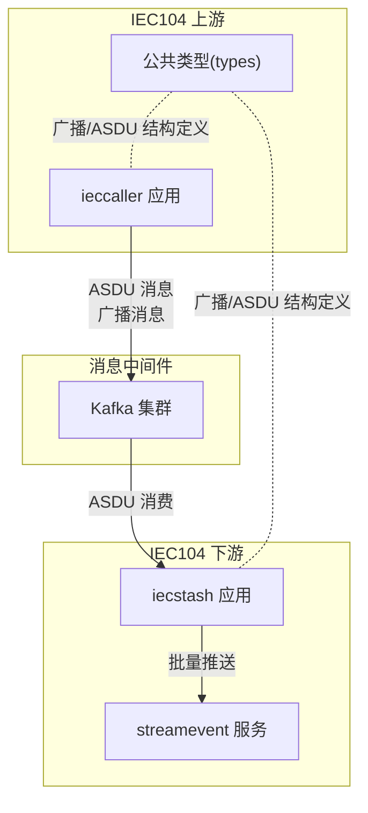
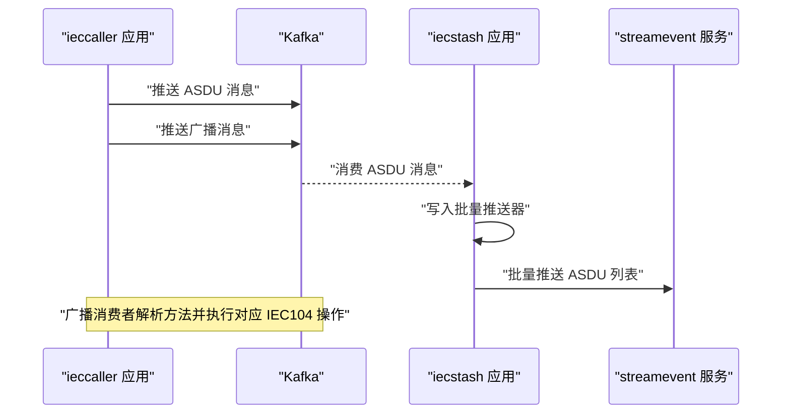
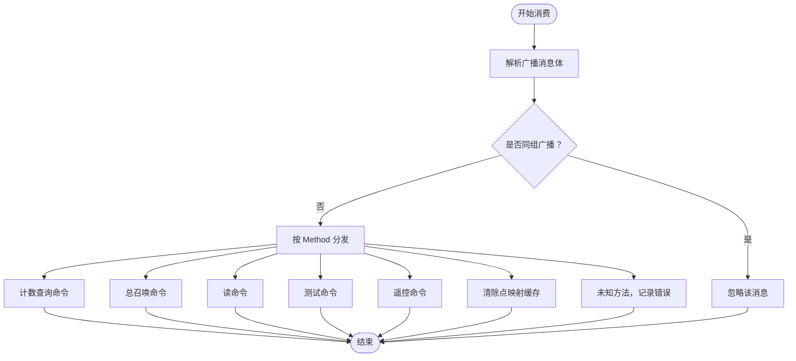
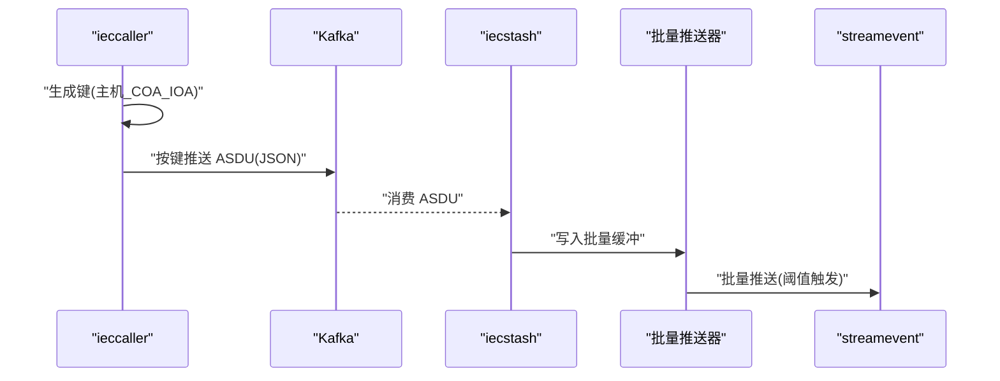
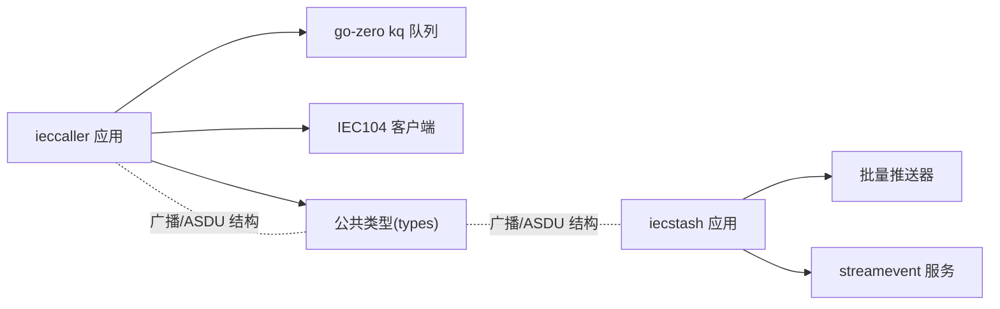

# Kafka 消息集成

<cite>
**本文引用的文件**
- [app/ieccaller/ieccaller.go](file://app/ieccaller/ieccaller.go)
- [app/ieccaller/internal/config/config.go](file://app/ieccaller/internal/config/config.go)
- [app/ieccaller/internal/svc/servicecontext.go](file://app/ieccaller/internal/svc/servicecontext.go)
- [app/ieccaller/kafka/broadcast.go](file://app/ieccaller/kafka/broadcast.go)
- [app/iecstash/kafka/asdu.go](file://app/iecstash/kafka/asdu.go)
- [common/iec104/types/types.go](file://common/iec104/types/types.go)
- [facade/streamevent/internal/logic/receivekafkamessagelogic.go](file://facade/streamevent/internal/logic/receivekafkamessagelogic.go)
- [model/kafkamodel.go](file://model/kafkamodel.go)
</cite>

## 目录
1. [简介](#简介)
2. [项目结构](#项目结构)
3. [核心组件](#核心组件)
4. [架构总览](#架构总览)
5. [详细组件分析](#详细组件分析)
6. [依赖分析](#依赖分析)
7. [性能考虑](#性能考虑)
8. [故障排查指南](#故障排查指南)
9. [结论](#结论)
10. [附录](#附录)

## 简介
本技术文档聚焦于 IECStash 的 Kafka 消息集成模块，系统性阐述 Kafka 在 IEC104 通信场景中的配置与使用，涵盖消息消费、广播机制、错误处理、ASDU 消息处理流程、消息格式转换与批量处理策略，并给出客户端配置、主题管理、分区策略、消费者组管理、可靠性保证、重试与死信队列处理方案及实际代码与配置示例路径。

## 项目结构
围绕 Kafka 的相关实现主要分布在以下模块：
- Ieccaller 应用：负责 IEC104 客户端与 Kafka 广播队列的集成，包含 Kafka 客户端配置、广播消费者、ASDU 推送与批量推送。
- Iecstash 应用：接收 Kafka 中的 ASDU 消息，写入本地批量推送器以供后续处理。
- 类型定义：统一的广播消息体与 ASDU 数据模型，确保跨应用的消息一致性。
- StreamEvent 面向外部的批量推送逻辑，作为下游处理链路的一部分。

图表来源
- [app/ieccaller/ieccaller.go:98-117](file://app/ieccaller/ieccaller.go#L98-L117)
- [app/ieccaller/kafka/broadcast.go:24-148](file://app/ieccaller/kafka/broadcast.go#L24-L148)
- [app/iecstash/kafka/asdu.go:20-24](file://app/iecstash/kafka/asdu.go#L20-L24)
- [common/iec104/types/types.go:11-15](file://common/iec104/types/types.go#L11-L15)

章节来源
- [app/ieccaller/ieccaller.go:98-117](file://app/ieccaller/ieccaller.go#L98-L117)
- [app/ieccaller/internal/config/config.go:36-42](file://app/ieccaller/internal/config/config.go#L36-L42)
- [app/ieccaller/internal/svc/servicecontext.go:57-60](file://app/ieccaller/internal/svc/servicecontext.go#L57-L60)
- [app/iecstash/kafka/asdu.go:20-24](file://app/iecstash/kafka/asdu.go#L20-L24)
- [common/iec104/types/types.go:11-15](file://common/iec104/types/types.go#L11-L15)

## 核心组件
- Kafka 客户端与队列配置
  - ieccaller 应用通过 go-zero 的 kq 队列启动广播消费者，配置包括 brokers、group、topic、并发参数、提交策略等。
  - 服务上下文根据配置初始化 Kafka 推送器（ASDU 与广播）。
- 广播消费者
  - 从 Kafka 消费广播消息，解析方法名与请求体，调用对应 IEC104 客户端操作或缓存清理。
- ASDU 消费者
  - 将 Kafka 中的 ASDU 文本写入本地批量推送器，供后续批量处理。
- 类型与键生成
  - 统一的广播消息体结构与 ASDU 消息体结构，以及基于主机、公共地址与 IOA 的键生成规则。
- 批量推送
  - 将单条 ASDU 消息写入批量缓冲，达到阈值后批量推送到下游服务。

章节来源
- [app/ieccaller/ieccaller.go:98-117](file://app/ieccaller/ieccaller.go#L98-L117)
- [app/ieccaller/internal/svc/servicecontext.go:57-60](file://app/ieccaller/internal/svc/servicecontext.go#L57-L60)
- [app/ieccaller/kafka/broadcast.go:24-148](file://app/ieccaller/kafka/broadcast.go#L24-L148)
- [app/iecstash/kafka/asdu.go:20-24](file://app/iecstash/kafka/asdu.go#L20-L24)
- [common/iec104/types/types.go:11-15](file://common/iec104/types/types.go#L11-L15)
- [common/iec104/types/types.go:42-54](file://common/iec104/types/types.go#L42-L54)

## 架构总览
下图展示了 Kafka 在 IEC104 场景下的整体交互：ieccaller 作为上游，将 ASDU 与广播消息写入 Kafka；iecstash 作为下游，消费 ASDU 并批量推送至 streamevent。

图表来源
- [app/ieccaller/ieccaller.go:98-117](file://app/ieccaller/ieccaller.go#L98-L117)
- [app/ieccaller/kafka/broadcast.go:24-148](file://app/ieccaller/kafka/broadcast.go#L24-L148)
- [app/iecstash/kafka/asdu.go:20-24](file://app/iecstash/kafka/asdu.go#L20-L24)
- [app/ieccaller/internal/svc/servicecontext.go:186-242](file://app/ieccaller/internal/svc/servicecontext.go#L186-L242)

## 详细组件分析

### Kafka 客户端与队列配置
- 配置项
  - Brokers：Kafka 集群地址列表
  - Topic：ASDU 主题，默认 asdu
  - BroadcastTopic：广播主题，默认 iec-broadcast
  - BroadcastGroupId：广播消费者组 ID，默认 iec-caller
  - IsPush：是否启用 Kafka 推送
- 队列参数
  - Group、Topic、Offset、Conns、Consumers、Processors、MinBytes、MaxBytes、ForceCommit、CommitInOrder 等
- 初始化
  - 服务上下文按配置创建 ASDU 与广播两个 Pusher
  - 启动广播队列，注册广播消费者处理器

章节来源
- [app/ieccaller/internal/config/config.go:36-42](file://app/ieccaller/internal/config/config.go#L36-L42)
- [app/ieccaller/ieccaller.go:98-117](file://app/ieccaller/ieccaller.go#L98-L117)
- [app/ieccaller/internal/svc/servicecontext.go:57-60](file://app/ieccaller/internal/svc/servicecontext.go#L57-L60)

### 广播机制与错误处理
- 消费流程
  - 从 Kafka 读取消息，反序列化为广播消息体
  - 若广播组 ID 一致则忽略（避免自播）
  - 根据 Method 分发到具体 IEC104 操作或缓存清理
- 错误处理
  - 客户端获取失败、IEC104 操作失败、JSON 反序列化失败均记录日志并返回
  - 非法方法名记录错误日志

图表来源
- [app/ieccaller/kafka/broadcast.go:24-148](file://app/ieccaller/kafka/broadcast.go#L24-L148)

章节来源
- [app/ieccaller/kafka/broadcast.go:24-148](file://app/ieccaller/kafka/broadcast.go#L24-L148)

### ASDU 消息处理流程与键生成
- 键生成规则
  - 基于主机、公共地址（COA）、IOA 生成稳定键，便于分区与去重
- 处理流程
  - ieccaller 将 ASDU 序列化为 JSON 字符串，按键推送至 Kafka
  - iecstash 从 Kafka 消费后写入本地批量推送器
  - 批量推送器达到阈值后批量发送至 streamevent

图表来源
- [common/iec104/types/types.go:42-54](file://common/iec104/types/types.go#L42-L54)
- [app/ieccaller/internal/svc/servicecontext.go:186-242](file://app/ieccaller/internal/svc/servicecontext.go#L186-L242)
- [app/iecstash/kafka/asdu.go:20-24](file://app/iecstash/kafka/asdu.go#L20-L24)

章节来源
- [common/iec104/types/types.go:42-54](file://common/iec104/types/types.go#L42-L54)
- [app/ieccaller/internal/svc/servicecontext.go:186-242](file://app/ieccaller/internal/svc/servicecontext.go#L186-L242)
- [app/iecstash/kafka/asdu.go:20-24](file://app/iecstash/kafka/asdu.go#L20-L24)

### 消息格式转换与批量处理策略
- 格式转换
  - ASDU 以 JSON 形式存储，包含消息 ID、主机、端口、ASDU 内容、类型、数据类型、公共地址、原始元数据等
  - 广播消息体包含广播组 ID、方法名与请求体 JSON
- 批量处理
  - 使用批量推送器按字节阈值聚合，减少网络往返与下游压力
  - 批量推送时携带事务 ID，便于追踪

章节来源
- [app/ieccaller/internal/svc/servicecontext.go:76-131](file://app/ieccaller/internal/svc/servicecontext.go#L76-L131)
- [common/iec104/types/types.go:11-15](file://common/iec104/types/types.go#L11-L15)
- [common/iec104/types/types.go:17-29](file://common/iec104/types/types.go#L17-L29)

### 主题管理、分区策略与消费者组管理
- 主题
  - ASDU 主题：默认 asdu
  - 广播主题：默认 iec-broadcast
- 分区策略
  - 键生成规则确保相同主机/公共地址/IOA 的消息进入同一分区，利于有序处理与去重
- 消费者组
  - 广播消费者组 ID 默认 iec-caller，不同集群实例可配置不同组以隔离消费
- 队列参数
  - 并发与批大小参数可根据吞吐需求调整

章节来源
- [app/ieccaller/internal/config/config.go:36-42](file://app/ieccaller/internal/config/config.go#L36-L42)
- [app/ieccaller/ieccaller.go:98-117](file://app/ieccaller/ieccaller.go#L98-L117)
- [common/iec104/types/types.go:42-54](file://common/iec104/types/types.go#L42-L54)

### 可靠性保证、重试与死信队列
- 可靠性
  - 广播消费者在处理前校验广播组 ID，避免自播
  - Kafka 推送与批量推送均设置超时上下文，失败时记录错误日志
- 重试
  - 当前实现未内置自动重试，建议在上游或下游增加指数退避重试策略
- 死信队列
  - 未实现专用死信队列，建议通过 Kafka DLQ 机制或外部监控告警配合人工干预

章节来源
- [app/ieccaller/kafka/broadcast.go:35-37](file://app/ieccaller/kafka/broadcast.go#L35-L37)
- [app/ieccaller/internal/svc/servicecontext.go:196-201](file://app/ieccaller/internal/svc/servicecontext.go#L196-L201)

### 实际代码与配置示例路径
- ieccaller 启动广播队列与消费者
  - [app/ieccaller/ieccaller.go:98-117](file://app/ieccaller/ieccaller.go#L98-L117)
- Kafka 配置结构
  - [app/ieccaller/internal/config/config.go:36-42](file://app/ieccaller/internal/config/config.go#L36-L42)
- 服务上下文初始化与推送
  - [app/ieccaller/internal/svc/servicecontext.go:57-60](file://app/ieccaller/internal/svc/servicecontext.go#L57-L60)
  - [app/ieccaller/internal/svc/servicecontext.go:186-242](file://app/ieccaller/internal/svc/servicecontext.go#L186-L242)
- 广播消费者处理
  - [app/ieccaller/kafka/broadcast.go:24-148](file://app/ieccaller/kafka/broadcast.go#L24-L148)
- ASDU 消费与批量写入
  - [app/iecstash/kafka/asdu.go:20-24](file://app/iecstash/kafka/asdu.go#L20-L24)
- 广播/ASDU 类型定义
  - [common/iec104/types/types.go:11-15](file://common/iec104/types/types.go#L11-L15)
  - [common/iec104/types/types.go:17-29](file://common/iec104/types/types.go#L17-L29)
- 键生成规则
  - [common/iec104/types/types.go:42-54](file://common/iec104/types/types.go#L42-L54)
- Streamevent 批量推送逻辑（参考）
  - [app/ieccaller/internal/svc/servicecontext.go:76-131](file://app/ieccaller/internal/svc/servicecontext.go#L76-L131)

## 依赖分析
- 组件耦合
  - ieccaller 依赖 go-zero kq 队列与 IEC104 客户端库
  - 广播消费者依赖公共类型定义与 IEC104 协议库
  - iecstash 依赖批量推送器与 streamevent 服务
- 外部依赖
  - Kafka 集群、Nacos 注册中心（可选）

图表来源
- [app/ieccaller/ieccaller.go:98-117](file://app/ieccaller/ieccaller.go#L98-L117)
- [app/ieccaller/kafka/broadcast.go:24-148](file://app/ieccaller/kafka/broadcast.go#L24-L148)
- [app/iecstash/kafka/asdu.go:20-24](file://app/iecstash/kafka/asdu.go#L20-L24)

章节来源
- [app/ieccaller/ieccaller.go:98-117](file://app/ieccaller/ieccaller.go#L98-L117)
- [app/ieccaller/kafka/broadcast.go:24-148](file://app/ieccaller/kafka/broadcast.go#L24-L148)
- [app/iecstash/kafka/asdu.go:20-24](file://app/iecstash/kafka/asdu.go#L20-L24)

## 性能考虑
- 并发与批大小
  - 通过 Conns、Consumers、Processors、MinBytes、MaxBytes 调整吞吐与延迟
- 键设计
  - 基于主机/公共地址/IOA 的键可提升分区均匀性与有序性
- 批量推送
  - 合理设置批量阈值，平衡延迟与带宽占用
- 超时控制
  - 推送与消费均设置超时，避免阻塞

## 故障排查指南
- 广播未生效
  - 检查部署模式与广播开关，确认 Kafka 配置不为空
  - 核对广播组 ID 是否一致
- Kafka 推送失败
  - 查看推送器初始化与超时日志，确认主题与 brokers 配置正确
- 消费异常
  - 检查广播方法名是否受支持，核对请求体 JSON 结构
- 批量推送问题
  - 关注批量阈值与下游服务响应，必要时降低阈值或增大超时

章节来源
- [app/ieccaller/internal/svc/servicecontext.go:54-56](file://app/ieccaller/internal/svc/servicecontext.go#L54-L56)
- [app/ieccaller/internal/svc/servicecontext.go:196-201](file://app/ieccaller/internal/svc/servicecontext.go#L196-L201)
- [app/ieccaller/kafka/broadcast.go:144-146](file://app/ieccaller/kafka/broadcast.go#L144-L146)

## 结论
本模块通过 go-zero kq 队列与 IEC104 客户端紧密集成，实现了可靠的 ASDU 与广播消息处理。键设计与批量推送策略提升了吞吐与稳定性。建议结合外部监控与重试策略进一步完善可靠性保障。

## 附录
- Streamevent 接收 Kafka 消息逻辑（待完善）
  - [facade/streamevent/internal/logic/receivekafkamessagelogic.go:27-31](file://facade/streamevent/internal/logic/receivekafkamessagelogic.go#L27-L31)
- 其他 Kafka 相关模型（非 IEC104）
  - [model/kafkamodel.go:1-185](file://model/kafkamodel.go#L1-L185)