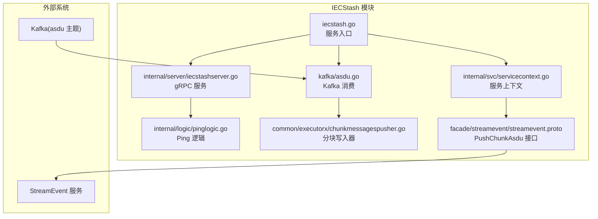
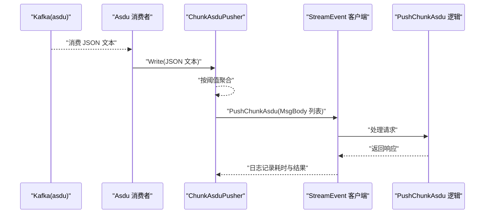
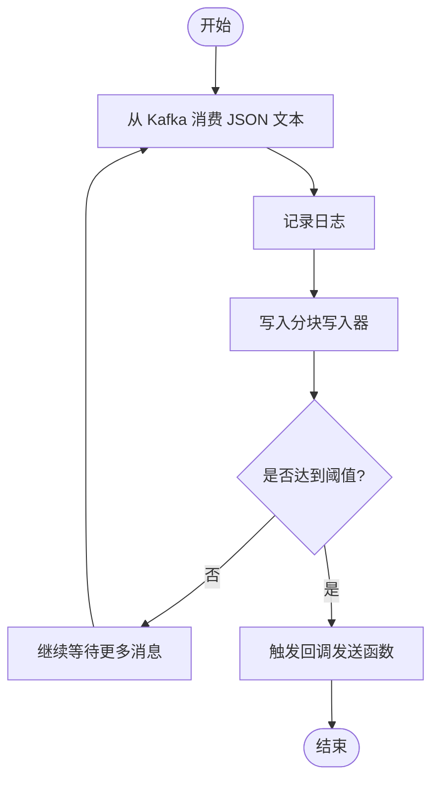
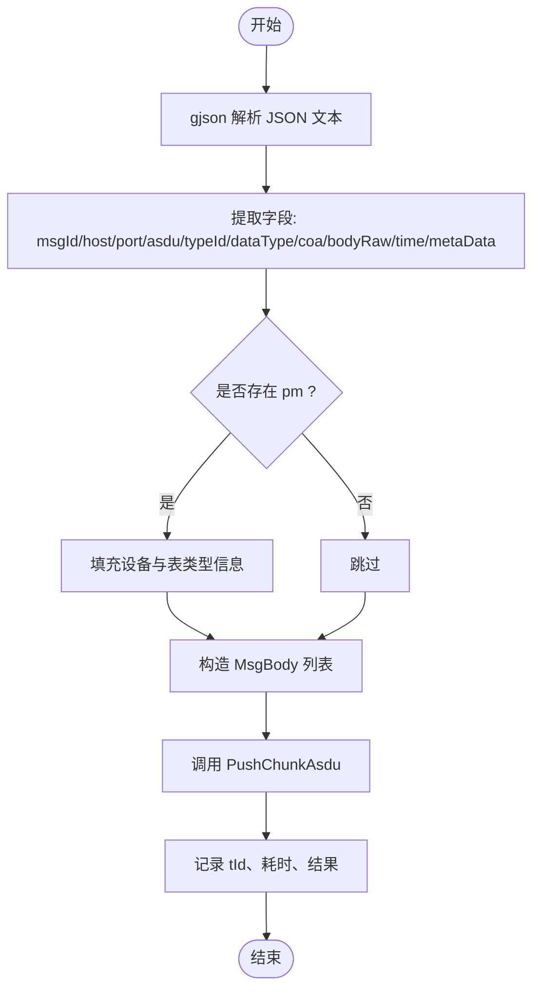
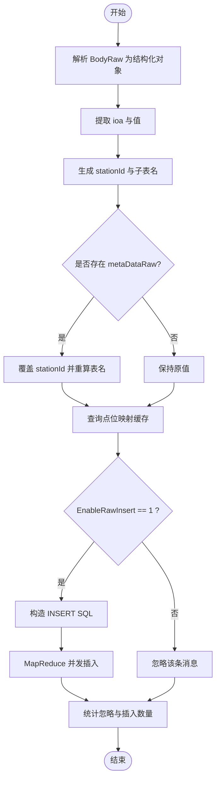
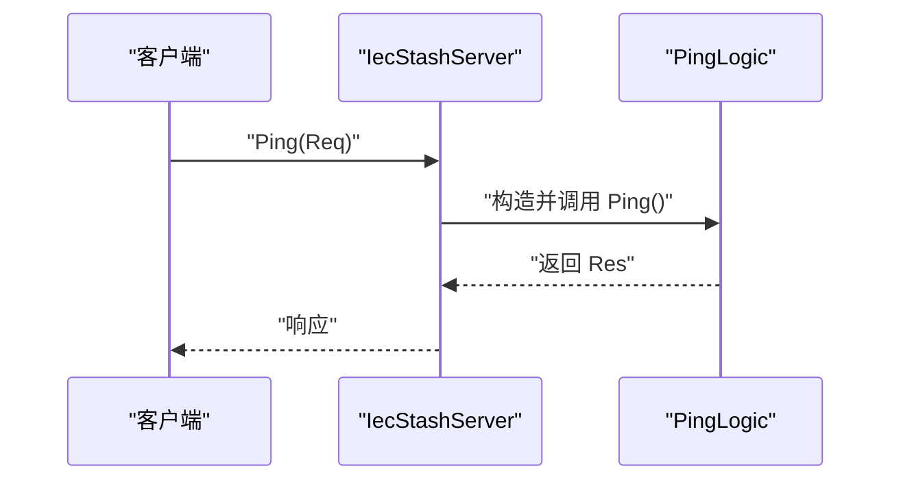
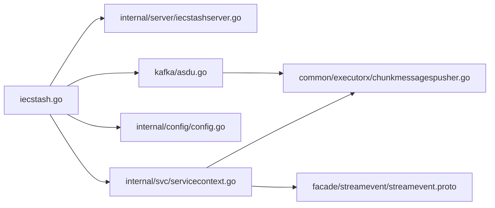

# 业务逻辑处理

<cite>
**本文引用的文件**
- [iecstash.go](file://app/iecstash/iecstash.go)
- [iecstash.proto](file://app/iecstash/iecstash.proto)
- [iecstashserver.go](file://app/iecstash/internal/server/iecstashserver.go)
- [pinglogic.go](file://app/iecstash/internal/logic/pinglogic.go)
- [config.go](file://app/iecstash/internal/config/config.go)
- [iecstash.yaml](file://app/iecstash/etc/iecstash.yaml)
- [asdu.go](file://app/iecstash/kafka/asdu.go)
- [servicecontext.go](file://app/iecstash/internal/svc/servicecontext.go)
- [chunkmessagespusher.go](file://common/executorx/chunkmessagespusher.go)
- [streamevent.proto](file://facade/streamevent/streamevent.proto)
- [pushchunkasdulogic.go](file://facade/streamevent/internal/logic/pushchunkasdulogic.go)
- [types.go](file://common/iec104/types/types.go)
</cite>

## 目录
1. [简介](#简介)
2. [项目结构](#项目结构)
3. [核心组件](#核心组件)
4. [架构总览](#架构总览)
5. [详细组件分析](#详细组件分析)
6. [依赖关系分析](#依赖关系分析)
7. [性能考量](#性能考量)
8. [故障排查指南](#故障排查指南)
9. [结论](#结论)
10. [附录](#附录)

## 简介
本文件面向 IECStash 业务逻辑处理模块，系统性阐述其消息处理核心业务逻辑、数据转换算法与存储策略。重点覆盖以下方面：
- ASDU 消息的来源、解析与转换流程
- 数据验证规则与异常处理机制
- 各类消息类型的处理示例与业务规则实现
- 性能优化方案与并发控制策略
- 业务流程图、状态转换图与数据处理管道的可视化说明
- 代码实现与测试用例的定位路径

IECStash 作为接收 Kafka 中的 ASDU 消息并将其转发到 StreamEvent 服务进行存储与后续处理的桥接模块，其核心职责是：
- 从 Kafka 消费 ASDU JSON 文本
- 将 JSON 解析为结构化消息体
- 按配置批量聚合（分块）并写入 StreamEvent 的 PushChunkAsdu 接口
- 在 StreamEvent 侧完成点位映射、表名生成、SQL 构造与入库

## 项目结构
IECStash 模块位于 app/iecstash 目录下，采用典型的 goctl 生成结构：
- 服务入口与配置：iecstash.go、etc/iecstash.yaml、internal/config/config.go
- gRPC 服务与逻辑：internal/server/iecstashserver.go、internal/logic/pinglogic.go
- Kafka 消费与分块写入：kafka/asdu.go、common/executorx/chunkmessagespusher.go
- 服务上下文与客户端：internal/svc/servicecontext.go
- 与 StreamEvent 的接口契约：facade/streamevent/streamevent.proto
- IEC104 类型定义：common/iec104/types/types.go

图表来源
- [iecstash.go:35-84](file://app/iecstash/iecstash.go#L35-L84)
- [asdu.go:20-24](file://app/iecstash/kafka/asdu.go#L20-L24)
- [servicecontext.go:25-91](file://app/iecstash/internal/svc/servicecontext.go#L25-L91)
- [streamevent.proto:10-25](file://facade/streamevent/streamevent.proto#L10-L25)

章节来源
- [iecstash.go:32-84](file://app/iecstash/iecstash.go#L32-L84)
- [iecstash.yaml:1-46](file://app/iecstash/etc/iecstash.yaml#L1-L46)
- [config.go:10-28](file://app/iecstash/internal/config/config.go#L10-L28)

## 核心组件
- 服务入口与生命周期
  - 通过命令行参数加载配置，初始化 gRPC 服务器与 Nacos 注册，启动 Kafka 队列监听。
  - 关键路径：[iecstash.go:35-84](file://app/iecstash/iecstash.go#L35-L84)
- 服务上下文
  - 初始化 StreamEvent 客户端（含 gRPC 最大消息大小设置），构建分块写入器 ChunkAsduPusher，并注入到服务上下文中。
  - 关键路径：[servicecontext.go:25-91](file://app/iecstash/internal/svc/servicecontext.go#L25-L91)
- Kafka 消费与分块写入
  - 消费 Kafka asdu 主题消息，将 JSON 文本写入分块写入器，达到阈值后批量回调处理函数。
  - 关键路径：[asdu.go:20-24](file://app/iecstash/kafka/asdu.go#L20-L24)，[chunkmessagespusher.go:17-44](file://common/executorx/chunkmessagespusher.go#L17-L44)
- 分块写入器
  - 基于 go-zero 的 ChunkExecutor，按字节阈值聚合消息，回调传入的发送函数。
  - 关键路径：[chunkmessagespusher.go:17-44](file://common/executorx/chunkmessagespusher.go#L17-L44)
- StreamEvent 推送
  - 将 JSON 解析为 MsgBody 列表，调用 PushChunkAsdu 接口推送；记录耗时与结果。
  - 关键路径：[servicecontext.go:36-84](file://app/iecstash/internal/svc/servicecontext.go#L36-L84)

章节来源
- [iecstash.go:35-84](file://app/iecstash/iecstash.go#L35-L84)
- [servicecontext.go:25-91](file://app/iecstash/internal/svc/servicecontext.go#L25-L91)
- [asdu.go:20-24](file://app/iecstash/kafka/asdu.go#L20-L24)
- [chunkmessagespusher.go:17-44](file://common/executorx/chunkmessagespusher.go#L17-L44)

## 架构总览
IECStash 的整体处理链路如下：
- Kafka 作为上游数据源，IECStash 作为消费者，将每条 ASDU JSON 写入分块写入器
- 达到阈值后，分块写入器回调发送函数，将消息列表转换为 StreamEvent 的 MsgBody 并调用 PushChunkAsdu
- StreamEvent 侧根据点位映射与表名规则生成 SQL 并入库

图表来源
- [asdu.go:20-24](file://app/iecstash/kafka/asdu.go#L20-L24)
- [servicecontext.go:36-84](file://app/iecstash/internal/svc/servicecontext.go#L36-L84)
- [pushchunkasdulogic.go:118-222](file://facade/streamevent/internal/logic/pushchunkasdulogic.go#L118-L222)

## 详细组件分析

### 组件 A：Kafka 消费与分块写入
- 功能概述
  - 从 Kafka asdu 主题消费消息，打印日志并写入分块写入器
  - 分块写入器按字节阈值聚合，回调发送函数
- 关键点
  - 写入前的日志记录，便于问题追踪
  - 分块阈值由配置项 PushAsduChunkBytes 控制
- 代码路径
  - [asdu.go:20-24](file://app/iecstash/kafka/asdu.go#L20-L24)
  - [chunkmessagespusher.go:17-44](file://common/executorx/chunkmessagespusher.go#L17-L44)
  - [iecstash.yaml:44](file://app/iecstash/etc/iecstash.yaml#L44)

图表来源
- [asdu.go:20-24](file://app/iecstash/kafka/asdu.go#L20-L24)
- [chunkmessagespusher.go:26-44](file://common/executorx/chunkmessagespusher.go#L26-L44)

章节来源
- [asdu.go:20-24](file://app/iecstash/kafka/asdu.go#L20-L24)
- [chunkmessagespusher.go:17-44](file://common/executorx/chunkmessagespusher.go#L17-L44)
- [iecstash.yaml:44](file://app/iecstash/etc/iecstash.yaml#L44)

### 组件 B：消息解析与转换（IECStash -> StreamEvent）
- 功能概述
  - 将 JSON 文本解析为 gjson 对象，抽取关键字段构造 MsgBody
  - 若存在点位映射（pm），填充设备与表类型信息
  - 调用 PushChunkAsdu 接口推送
- 关键点
  - 使用 gjson 提取字段，避免全量反序列化
  - 对 pm 字段存在性进行判空处理
  - 记录事务 ID、耗时与成功/失败标记
- 代码路径
  - [servicecontext.go:36-84](file://app/iecstash/internal/svc/servicecontext.go#L36-L84)
  - [streamevent.proto:83-133](file://facade/streamevent/streamevent.proto#L83-L133)

图表来源
- [servicecontext.go:36-84](file://app/iecstash/internal/svc/servicecontext.go#L36-L84)
- [streamevent.proto:92-133](file://facade/streamevent/streamevent.proto#L92-L133)

章节来源
- [servicecontext.go:36-84](file://app/iecstash/internal/svc/servicecontext.go#L36-L84)
- [streamevent.proto:83-133](file://facade/streamevent/streamevent.proto#L83-L133)

### 组件 C：StreamEvent 存储逻辑（点位映射与入库）
- 功能概述
  - 解析 MsgBody.BodyRaw 为结构化对象，提取 ioa 与值
  - 生成 stationId 与子表名，查询点位映射缓存决定是否入库
  - 使用 MapReduce 并发执行 SQL 插入，统计忽略与插入数量
- 关键点
  - extractIoaValue 支持多种值类型（整型、浮点、布尔、对象、数组）的提取与格式化
  - 支持从 metaDataRaw 中覆盖 stationId，动态调整表名
  - 对解析失败、查询失败、SQL 执行失败分别记录错误并统计忽略数
- 代码路径
  - [pushchunkasdulogic.go:34-116](file://facade/streamevent/internal/logic/pushchunkasdulogic.go#L34-L116)
  - [pushchunkasdulogic.go:118-222](file://facade/streamevent/internal/logic/pushchunkasdulogic.go#L118-L222)
  - [types.go:56-322](file://common/iec104/types/types.go#L56-L322)

图表来源
- [pushchunkasdulogic.go:118-222](file://facade/streamevent/internal/logic/pushchunkasdulogic.go#L118-L222)
- [types.go:56-322](file://common/iec104/types/types.go#L56-L322)

章节来源
- [pushchunkasdulogic.go:34-116](file://facade/streamevent/internal/logic/pushchunkasdulogic.go#L34-L116)
- [pushchunkasdulogic.go:118-222](file://facade/streamevent/internal/logic/pushchunkasdulogic.go#L118-L222)
- [types.go:56-322](file://common/iec104/types/types.go#L56-L322)

### 组件 D：gRPC 服务与 Ping 示例
- 功能概述
  - 提供 IecStash.Ping 接口，返回固定响应
  - 展示了服务注册、拦截器与反射（开发模式）的使用
- 代码路径
  - [iecstash.proto:13-15](file://app/iecstash/iecstash.proto#L13-L15)
  - [iecstashserver.go:26-29](file://app/iecstash/internal/server/iecstashserver.go#L26-L29)
  - [pinglogic.go:26-28](file://app/iecstash/internal/logic/pinglogic.go#L26-L28)
  - [iecstash.go:47-52](file://app/iecstash/iecstash.go#L47-L52)

图表来源
- [iecstashserver.go:26-29](file://app/iecstash/internal/server/iecstashserver.go#L26-L29)
- [pinglogic.go:26-28](file://app/iecstash/internal/logic/pinglogic.go#L26-L28)

章节来源
- [iecstash.proto:13-15](file://app/iecstash/iecstash.proto#L13-L15)
- [iecstashserver.go:26-29](file://app/iecstash/internal/server/iecstashserver.go#L26-L29)
- [pinglogic.go:26-28](file://app/iecstash/internal/logic/pinglogic.go#L26-L28)
- [iecstash.go:47-52](file://app/iecstash/iecstash.go#L47-L52)

### 组件 E：配置与运行时参数
- 关键配置项
  - KafkaASDUConfig：Topic、Group、Conns、Consumers、Processors、MinBytes、MaxBytes、Offset 等
  - StreamEventConf：目标地址、超时、非阻塞等
  - PushAsduChunkBytes：分块阈值（默认 1MB）
  - GracePeriod：优雅停机时间
- 代码路径
  - [iecstash.yaml:18-45](file://app/iecstash/etc/iecstash.yaml#L18-L45)
  - [config.go:10-28](file://app/iecstash/internal/config/config.go#L10-L28)

章节来源
- [iecstash.yaml:18-45](file://app/iecstash/etc/iecstash.yaml#L18-L45)
- [config.go:10-28](file://app/iecstash/internal/config/config.go#L10-L28)

## 依赖关系分析
- 组件耦合
  - iecstash.go 依赖 config、svc、server、kq（Kafka 队列）
  - servicecontext.go 依赖 streamevent 客户端与 ChunkMessagesPusher
  - asdu.go 依赖 svcCtx.ChunkAsduPusher
  - streamevent.proto 定义 PushChunkAsdu 接口契约
- 外部依赖
  - Kafka：作为上游数据源
  - StreamEvent：作为下游存储与处理服务
  - Nacos：服务注册（可选）

图表来源
- [iecstash.go:35-84](file://app/iecstash/iecstash.go#L35-L84)
- [servicecontext.go:25-91](file://app/iecstash/internal/svc/servicecontext.go#L25-L91)
- [asdu.go:20-24](file://app/iecstash/kafka/asdu.go#L20-L24)
- [chunkmessagespusher.go:17-44](file://common/executorx/chunkmessagespusher.go#L17-L44)
- [streamevent.proto:10-25](file://facade/streamevent/streamevent.proto#L10-L25)

章节来源
- [iecstash.go:35-84](file://app/iecstash/iecstash.go#L35-L84)
- [servicecontext.go:25-91](file://app/iecstash/internal/svc/servicecontext.go#L25-L91)
- [asdu.go:20-24](file://app/iecstash/kafka/asdu.go#L20-L24)
- [chunkmessagespusher.go:17-44](file://common/executorx/chunkmessagespusher.go#L17-L44)
- [streamevent.proto:10-25](file://facade/streamevent/streamevent.proto#L10-L25)

## 性能考量
- 分块阈值与并发
  - PushAsduChunkBytes 控制分块大小，建议结合网络与磁盘 IO 调优
  - Kafka 配置中 Conns、Consumers、Processors 影响吞吐与 CPU 利用率
- gRPC 最大消息大小
  - StreamEvent 客户端设置了较大的发送/接收消息限制，避免大块数据传输失败
- 并发插入
  - StreamEvent 侧使用 MapReduce 并发执行 SQL 插入，提升吞吐
- 日志与可观测性
  - 关键路径均记录耗时与结果，便于性能分析与问题定位

章节来源
- [iecstash.yaml:24-35](file://app/iecstash/etc/iecstash.yaml#L24-L35)
- [servicecontext.go:26-34](file://app/iecstash/internal/svc/servicecontext.go#L26-L34)
- [pushchunkasdulogic.go:127-212](file://facade/streamevent/internal/logic/pushchunkasdulogic.go#L127-L212)

## 故障排查指南
- Kafka 消费异常
  - 现象：消息无法写入分块写入器或回调未触发
  - 排查：检查 Kafka 配置（Topic/Group/Offset）、连接数与消费者数量
  - 参考路径：[asdu.go:20-24](file://app/iecstash/kafka/asdu.go#L20-L24)，[iecstash.yaml:18-35](file://app/iecstash/etc/iecstash.yaml#L18-L35)
- JSON 解析失败
  - 现象：PushChunkAsdu 请求中某条消息解析 BodyRaw 失败
  - 排查：确认上游 ASDU JSON 结构一致性；关注 BodyRaw 字段
  - 参考路径：[servicecontext.go:36-84](file://app/iecstash/internal/svc/servicecontext.go#L36-L84)
- 点位映射缺失或禁用
  - 现象：消息被忽略（EnableRawInsert != 1）
  - 排查：检查点位映射缓存与配置；必要时通过 metaDataRaw 覆盖 stationId
  - 参考路径：[pushchunkasdulogic.go:160-191](file://facade/streamevent/internal/logic/pushchunkasdulogic.go#L160-L191)
- SQL 插入失败
  - 现象：MapReduce 插入阶段出现错误日志
  - 排查：检查 TDengine 连接、数据库权限、表结构与标签约束
  - 参考路径：[pushchunkasdulogic.go:194-203](file://facade/streamevent/internal/logic/pushchunkasdulogic.go#L194-L203)
- gRPC 调用失败
  - 现象：PushChunkAsdu 返回错误
  - 排查：检查 StreamEvent 服务可用性、超时设置与日志
  - 参考路径：[servicecontext.go:74-78](file://app/iecstash/internal/svc/servicecontext.go#L74-L78)

章节来源
- [asdu.go:20-24](file://app/iecstash/kafka/asdu.go#L20-L24)
- [servicecontext.go:36-84](file://app/iecstash/internal/svc/servicecontext.go#L36-L84)
- [pushchunkasdulogic.go:160-191](file://facade/streamevent/internal/logic/pushchunkasdulogic.go#L160-L191)
- [pushchunkasdulogic.go:194-203](file://facade/streamevent/internal/logic/pushchunkasdulogic.go#L194-L203)
- [servicecontext.go:74-78](file://app/iecstash/internal/svc/servicecontext.go#L74-L78)

## 结论
IECStash 通过 Kafka 消费与分块聚合，将 ASDU JSON 快速转换为 StreamEvent 的结构化消息并推送入库。其设计强调：
- 易扩展：新增消息类型只需在解析与转换环节适配
- 高吞吐：分块阈值与并发插入策略兼顾延迟与吞吐
- 可观测：关键路径日志详尽，便于问题定位与性能分析
- 可靠性：对解析失败、映射缺失、SQL 执行失败均有明确处理与统计

## 附录
- 代码实现定位
  - Kafka 消费与分块写入：[asdu.go:20-24](file://app/iecstash/kafka/asdu.go#L20-L24)，[chunkmessagespusher.go:17-44](file://common/executorx/chunkmessagespusher.go#L17-L44)
  - 消息解析与转换：[servicecontext.go:36-84](file://app/iecstash/internal/svc/servicecontext.go#L36-L84)
  - 存储逻辑与点位映射：[pushchunkasdulogic.go:118-222](file://facade/streamevent/internal/logic/pushchunkasdulogic.go#L118-L222)
  - IEC104 类型定义：[types.go:56-322](file://common/iec104/types/types.go#L56-L322)
- 测试用例定位
  - 由于本仓库未提供 IECStash 的单元测试文件，建议围绕以下路径补充：
    - Kafka 消费与分块写入：[asdu.go:20-24](file://app/iecstash/kafka/asdu.go#L20-L24)
    - 消息解析与转换：[servicecontext.go:36-84](file://app/iecstash/internal/svc/servicecontext.go#L36-L84)
    - 存储逻辑与点位映射：[pushchunkasdulogic.go:118-222](file://facade/streamevent/internal/logic/pushchunkasdulogic.go#L118-L222)