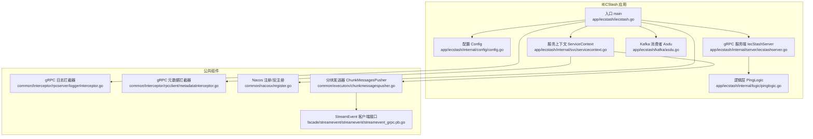
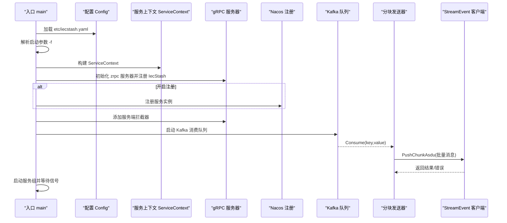
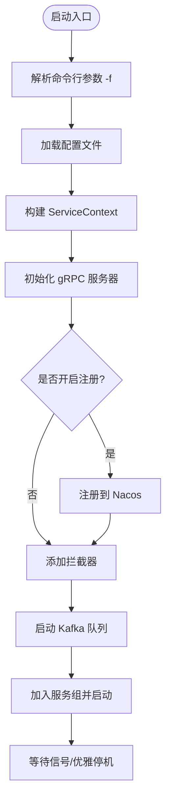
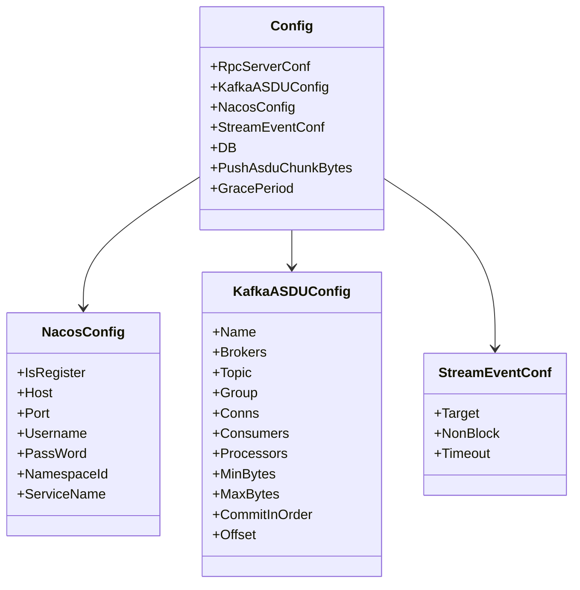
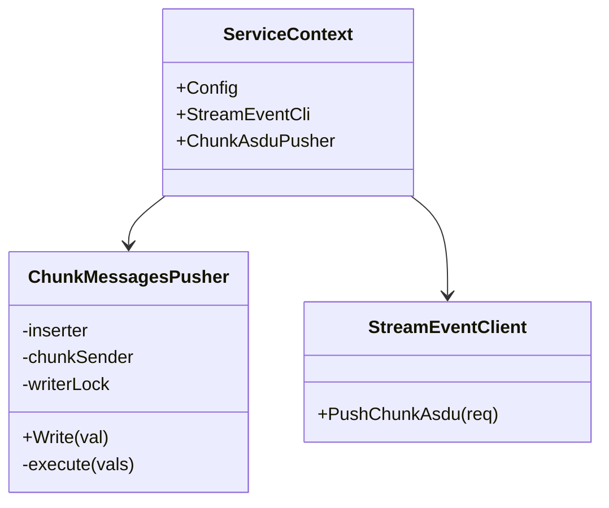
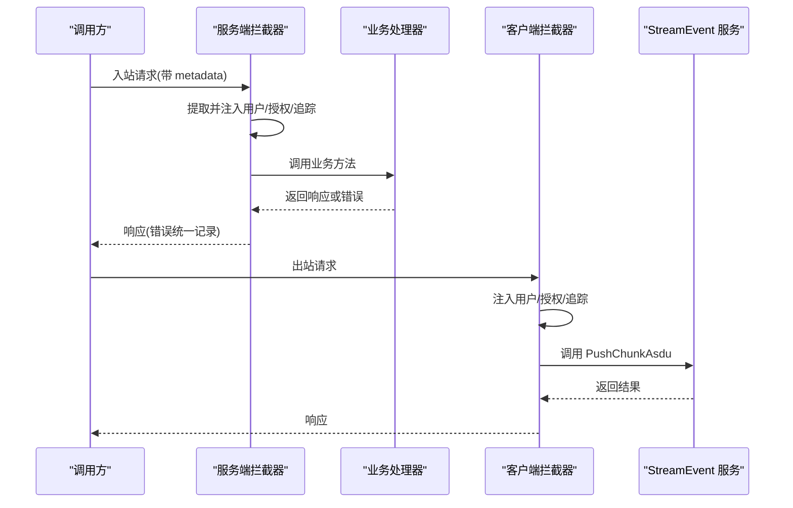
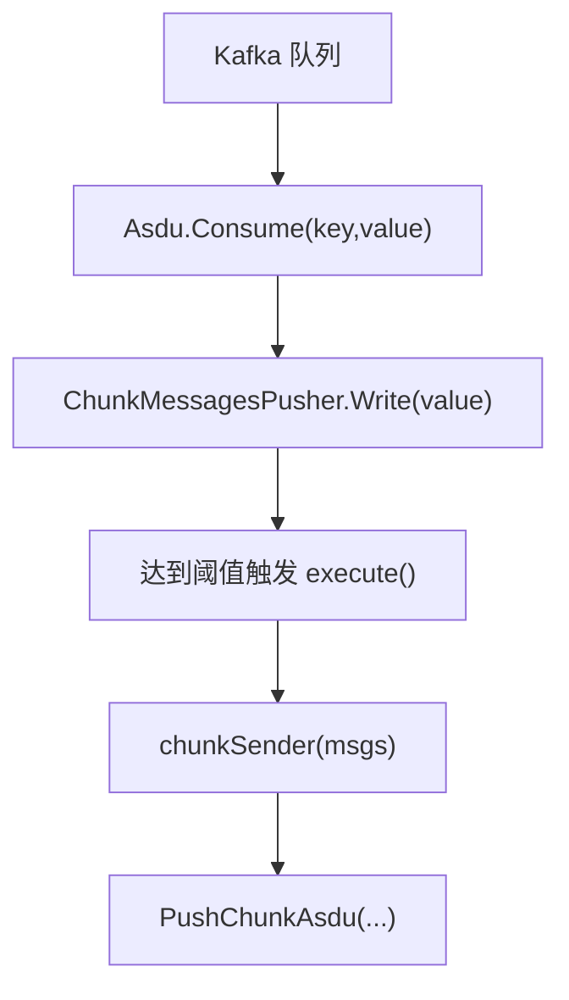
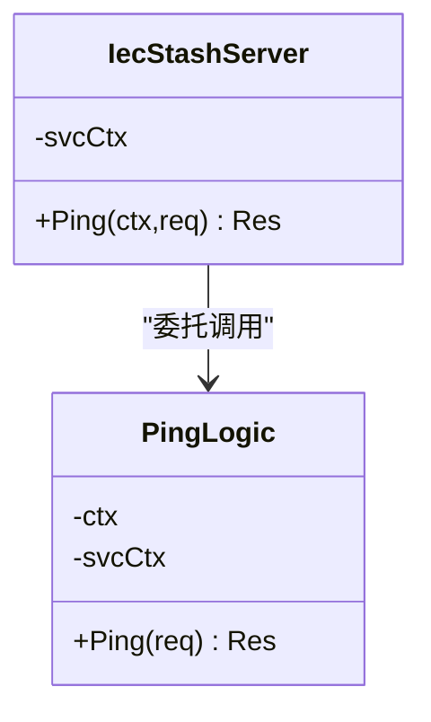
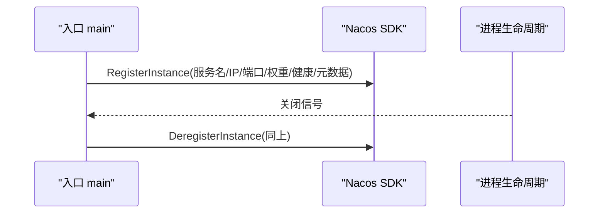
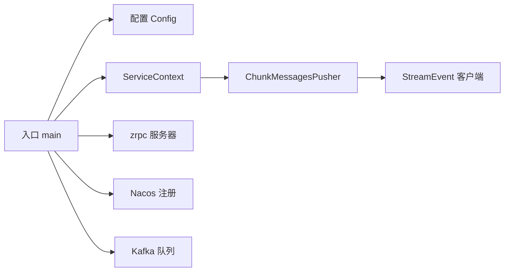

# 服务架构设计

<cite>
**本文引用的文件**
- [app/iecstash/iecstash.go](file://app/iecstash/iecstash.go)
- [app/iecstash/etc/iecstash.yaml](file://app/iecstash/etc/iecstash.yaml)
- [app/iecstash/internal/config/config.go](file://app/iecstash/internal/config/config.go)
- [app/iecstash/internal/svc/servicecontext.go](file://app/iecstash/internal/svc/servicecontext.go)
- [app/iecstash/internal/server/iecstashserver.go](file://app/iecstash/internal/server/iecstashserver.go)
- [app/iecstash/internal/logic/pinglogic.go](file://app/iecstash/internal/logic/pinglogic.go)
- [app/iecstash/kafka/asdu.go](file://app/iecstash/kafka/asdu.go)
- [common/Interceptor/rpcserver/loggerInterceptor.go](file://common/Interceptor/rpcserver/loggerInterceptor.go)
- [common/Interceptor/rpcclient/metadataInterceptor.go](file://common/Interceptor/rpcclient/metadataInterceptor.go)
- [common/nacosx/register.go](file://common/nacosx/register.go)
- [common/executorx/chunkmessagespusher.go](file://common/executorx/chunkmessagespusher.go)
- [facade/streamevent/streamevent/streamevent_grpc.pb.go](file://facade/streamevent/streamevent/streamevent_grpc.pb.go)
- [app/iecstash/iecstash.proto](file://app/iecstash/iecstash.proto)
</cite>

## 目录
1. [引言](#引言)
2. [项目结构](#项目结构)
3. [核心组件](#核心组件)
4. [架构总览](#架构总览)
5. [详细组件分析](#详细组件分析)
6. [依赖分析](#依赖分析)
7. [性能考虑](#性能考虑)
8. [故障排查指南](#故障排查指南)
9. [结论](#结论)
10. [附录](#附录)

## 引言
本文件面向 IECStash 服务，系统化阐述其整体架构模式、组件层次与设计原则；重点覆盖配置管理系统、服务上下文设计、拦截器机制与启动流程；同时解释服务注册发现机制、gRPC 服务器配置与 Nacos 集成方案，并通过架构图、序列图与流程图展示组件关系、数据流向与服务交互模式。文档旨在帮助开发者快速理解并高效扩展该服务。

## 项目结构
IECStash 采用 go-zero 的标准目录组织方式，按“应用/模块”划分，每个子模块包含配置、内部实现、服务上下文、gRPC 服务端与逻辑层等。IECStash 作为独立 RPC 服务，负责消费 Kafka 中的 ASDU 数据，按批次聚合后通过 gRPC 推送到 StreamEvent 服务。

**图表来源**
- [app/iecstash/iecstash.go:35-84](file://app/iecstash/iecstash.go#L35-L84)
- [app/iecstash/internal/config/config.go:10-28](file://app/iecstash/internal/config/config.go#L10-L28)
- [app/iecstash/internal/svc/servicecontext.go:19-91](file://app/iecstash/internal/svc/servicecontext.go#L19-L91)
- [app/iecstash/internal/server/iecstashserver.go:15-29](file://app/iecstash/internal/server/iecstashserver.go#L15-L29)
- [app/iecstash/internal/logic/pinglogic.go:12-28](file://app/iecstash/internal/logic/pinglogic.go#L12-L28)
- [app/iecstash/kafka/asdu.go:20-24](file://app/iecstash/kafka/asdu.go#L20-L24)
- [common/Interceptor/rpcserver/loggerInterceptor.go:12-44](file://common/Interceptor/rpcserver/loggerInterceptor.go#L12-L44)
- [common/Interceptor/rpcclient/metadataInterceptor.go:11-32](file://common/Interceptor/rpcclient/metadataInterceptor.go#L11-L32)
- [common/nacosx/register.go:21-76](file://common/nacosx/register.go#L21-L76)
- [common/executorx/chunkmessagespusher.go:11-44](file://common/executorx/chunkmessagespusher.go#L11-L44)
- [facade/streamevent/streamevent/streamevent_grpc.pb.go:34-97](file://facade/streamevent/streamevent/streamevent_grpc.pb.go#L34-L97)

**章节来源**
- [app/iecstash/iecstash.go:32-84](file://app/iecstash/iecstash.go#L32-L84)
- [app/iecstash/etc/iecstash.yaml:1-46](file://app/iecstash/etc/iecstash.yaml#L1-L46)

## 核心组件
- 启动入口与控制流：负责解析配置、构建服务上下文、初始化 gRPC 服务器、可选注册到 Nacos、添加拦截器、启动 Kafka 消费队列与服务组。
- 配置管理：集中于 Config 结构体，包含 gRPC 服务器配置、Kafka 消费配置、Nacos 注册配置、StreamEvent 客户端配置、数据库数据源、批量推送阈值与优雅停机时长。
- 服务上下文：封装 StreamEvent 客户端与分块推送器，负责将 Kafka 消费到的字符串消息解析为结构化消息体并批量推送到 StreamEvent。
- gRPC 服务端：暴露 Ping 接口（示例），实际业务由 Kafka 消费与分块推送驱动。
- 拦截器：服务端统一日志与错误记录；客户端在出站请求中注入用户/授权/追踪等元数据。
- 注册中心集成：基于 Nacos SDK 实现服务注册与优雅下线反注册。
- 分块发送器：基于 go-zero 的 ChunkExecutor 将不定长消息按字节阈值聚合，提升下游吞吐。

**章节来源**
- [app/iecstash/internal/config/config.go:10-28](file://app/iecstash/internal/config/config.go#L10-L28)
- [app/iecstash/internal/svc/servicecontext.go:19-91](file://app/iecstash/internal/svc/servicecontext.go#L19-L91)
- [app/iecstash/internal/server/iecstashserver.go:15-29](file://app/iecstash/internal/server/iecstashserver.go#L15-L29)
- [common/Interceptor/rpcserver/loggerInterceptor.go:12-44](file://common/Interceptor/rpcserver/loggerInterceptor.go#L12-L44)
- [common/Interceptor/rpcclient/metadataInterceptor.go:11-32](file://common/Interceptor/rpcclient/metadataInterceptor.go#L11-L32)
- [common/nacosx/register.go:21-76](file://common/nacosx/register.go#L21-L76)
- [common/executorx/chunkmessagespusher.go:11-44](file://common/executorx/chunkmessagespusher.go#L11-L44)

## 架构总览
IECStash 的运行时由“启动流程”“配置加载”“服务上下文”“gRPC 服务端”“拦截器链路”“Kafka 消费”“分块聚合”“StreamEvent 推送”“Nacos 注册”九部分组成。下图展示关键组件之间的交互关系与数据流向。

**图表来源**
- [app/iecstash/iecstash.go:35-84](file://app/iecstash/iecstash.go#L35-L84)
- [app/iecstash/etc/iecstash.yaml:1-46](file://app/iecstash/etc/iecstash.yaml#L1-L46)
- [app/iecstash/internal/svc/servicecontext.go:25-91](file://app/iecstash/internal/svc/servicecontext.go#L25-L91)
- [app/iecstash/kafka/asdu.go:20-24](file://app/iecstash/kafka/asdu.go#L20-L24)
- [common/nacosx/register.go:21-76](file://common/nacosx/register.go#L21-L76)
- [facade/streamevent/streamevent/streamevent_grpc.pb.go:89-97](file://facade/streamevent/streamevent/streamevent_grpc.pb.go#L89-L97)

## 详细组件分析

### 启动流程与控制流
- 命令行参数：支持 -f 指定配置文件路径，默认 etc/iecstash.yaml。
- 配置加载：使用 go-zero 的 conf.MustLoad 加载 YAML 并绑定到 Config。
- 优雅停机：根据配置设置进程强制退出时间。
- gRPC 服务器：MustNewServer 创建服务器，注册 IecStash 服务；开发/测试模式启用反射。
- Nacos 注册：若开启注册，则构造 ServerConfig/ClientConfig，注册服务实例并在进程退出时反注册。
- 拦截器：添加服务端日志拦截器；客户端通过 ServiceContext 构造时注入元数据拦截器。
- 服务组：将 gRPC 与 Kafka 队列加入 serviceGroup 并统一启动。

**图表来源**
- [app/iecstash/iecstash.go:35-84](file://app/iecstash/iecstash.go#L35-L84)

**章节来源**
- [app/iecstash/iecstash.go:32-84](file://app/iecstash/iecstash.go#L32-L84)

### 配置管理系统
- Config 结构体继承 zrpc.RpcServerConf，扩展 KafkaASDUConfig、NacosConfig、StreamEventConf、DB、PushAsduChunkBytes、GracePeriod 等字段。
- etc/iecstash.yaml 提供默认值与示例，包括：
  - 服务名称、监听地址、日志级别与路径、模式、Nacos 注册开关与凭据、Kafka 消费参数（Brokers/Topic/Group/Conns/Consumers/Processors/MinBytes/MaxBytes/CommitInOrder/Offset）、StreamEvent 客户端 Target/NonBlock/Timeout、批量阈值与优雅停机时长。

**图表来源**
- [app/iecstash/internal/config/config.go:10-28](file://app/iecstash/internal/config/config.go#L10-L28)
- [app/iecstash/etc/iecstash.yaml:1-46](file://app/iecstash/etc/iecstash.yaml#L1-L46)

**章节来源**
- [app/iecstash/internal/config/config.go:10-28](file://app/iecstash/internal/config/config.go#L10-L28)
- [app/iecstash/etc/iecstash.yaml:1-46](file://app/iecstash/etc/iecstash.yaml#L1-L46)

### 服务上下文设计
- ServiceContext 聚合：
  - StreamEvent 客户端：基于 zrpc.MustNewClient，注入元数据拦截器与大消息发送选项。
  - ChunkAsduPusher：基于 executors.ChunkExecutor 的分块发送器，按 PushAsduChunkBytes 聚合。
- 分块发送器执行流程：
  - 将字符串消息解析为结构化 MsgBody 列表。
  - 调用 StreamEvent 的 PushChunkAsdu 接口推送。
  - 统一记录耗时与成功/失败状态。

**图表来源**
- [app/iecstash/internal/svc/servicecontext.go:19-91](file://app/iecstash/internal/svc/servicecontext.go#L19-L91)
- [common/executorx/chunkmessagespusher.go:11-44](file://common/executorx/chunkmessagespusher.go#L11-L44)
- [facade/streamevent/streamevent/streamevent_grpc.pb.go:34-97](file://facade/streamevent/streamevent/streamevent_grpc.pb.go#L34-L97)

**章节来源**
- [app/iecstash/internal/svc/servicecontext.go:19-91](file://app/iecstash/internal/svc/servicecontext.go#L19-L91)
- [common/executorx/chunkmessagespusher.go:11-44](file://common/executorx/chunkmessagespusher.go#L11-L44)

### 拦截器机制
- 服务端拦截器：LoggerInterceptor 从入站 metadata 中提取用户/授权/追踪信息写入上下文，并在错误时统一记录。
- 客户端拦截器：UnaryMetadataInterceptor 在出站请求中注入用户/授权/追踪信息，保证跨服务链路可观测性。
- 两者配合形成“请求进入时注入上下文、请求发出时携带上下文”的完整链路。

**图表来源**
- [common/Interceptor/rpcserver/loggerInterceptor.go:12-44](file://common/Interceptor/rpcserver/loggerInterceptor.go#L12-L44)
- [common/Interceptor/rpcclient/metadataInterceptor.go:11-32](file://common/Interceptor/rpcclient/metadataInterceptor.go#L11-L32)
- [facade/streamevent/streamevent/streamevent_grpc.pb.go:89-97](file://facade/streamevent/streamevent/streamevent_grpc.pb.go#L89-L97)

**章节来源**
- [common/Interceptor/rpcserver/loggerInterceptor.go:12-44](file://common/Interceptor/rpcserver/loggerInterceptor.go#L12-L44)
- [common/Interceptor/rpcclient/metadataInterceptor.go:11-32](file://common/Interceptor/rpcclient/metadataInterceptor.go#L11-L32)

### 启动流程与 Kafka 消费
- Kafka 队列：基于 go-queue/kq，使用 etc/iecstash.yaml 中的 KafkaASDUConfig 启动消费者。
- Asdu.Consume：从 Kafka 拉取消息后写入分块发送器，触发批量聚合与推送。
- 分块策略：按 PushAsduChunkBytes 字节阈值聚合，避免单次推送过大导致内存压力与下游阻塞。

**图表来源**
- [app/iecstash/kafka/asdu.go:20-24](file://app/iecstash/kafka/asdu.go#L20-L24)
- [common/executorx/chunkmessagespusher.go:26-44](file://common/executorx/chunkmessagespusher.go#L26-L44)
- [facade/streamevent/streamevent/streamevent_grpc.pb.go:89-97](file://facade/streamevent/streamevent/streamevent_grpc.pb.go#L89-L97)

**章节来源**
- [app/iecstash/kafka/asdu.go:20-24](file://app/iecstash/kafka/asdu.go#L20-L24)
- [common/executorx/chunkmessagespusher.go:17-44](file://common/executorx/chunkmessagespusher.go#L17-L44)

### gRPC 服务器与服务端实现
- 服务器：zrpc.MustNewServer 注册 IecStash 服务，开发/测试模式启用反射便于调试。
- 服务端：IecStashServer.Ping 交由 PingLogic 处理，当前返回固定响应。
- 协议：iecstash.proto 定义了最小化接口，实际业务由 Kafka 消费与分块推送承担。

**图表来源**
- [app/iecstash/internal/server/iecstashserver.go:15-29](file://app/iecstash/internal/server/iecstashserver.go#L15-L29)
- [app/iecstash/internal/logic/pinglogic.go:12-28](file://app/iecstash/internal/logic/pinglogic.go#L12-L28)
- [app/iecstash/iecstash.proto:13-15](file://app/iecstash/iecstash.proto#L13-L15)

**章节来源**
- [app/iecstash/internal/server/iecstashserver.go:15-29](file://app/iecstash/internal/server/iecstashserver.go#L15-L29)
- [app/iecstash/internal/logic/pinglogic.go:12-28](file://app/iecstash/internal/logic/pinglogic.go#L12-L28)
- [app/iecstash/iecstash.proto:13-15](file://app/iecstash/iecstash.proto#L13-L15)

### Nacos 集成方案
- 注册：根据配置构造 ServerConfig/ClientConfig，注册服务实例并写入元数据（如 gRPC 端口、来源标记）。
- 反注册：通过进程关闭监听，在退出时反注册实例，确保注册中心状态一致。
- 地址解析：自动解析监听地址，支持 PodIP 环境变量与内网 IP 回退。

**图表来源**
- [common/nacosx/register.go:21-76](file://common/nacosx/register.go#L21-L76)
- [app/iecstash/iecstash.go:54-72](file://app/iecstash/iecstash.go#L54-L72)

**章节来源**
- [common/nacosx/register.go:21-76](file://common/nacosx/register.go#L21-L76)
- [app/iecstash/iecstash.go:54-72](file://app/iecstash/iecstash.go#L54-L72)

## 依赖分析
- 组件耦合：
  - 启动入口依赖配置、服务上下文、gRPC 服务器、Nacos 注册与 Kafka 队列。
  - 服务上下文依赖 StreamEvent 客户端与分块发送器。
  - 分块发送器依赖 ChunkExecutor 与 gRPC 客户端。
- 外部依赖：
  - go-zero 生态（conf、zrpc、kq、executors、logx、proc）。
  - Nacos SDK。
  - gRPC 与 protobuf。
- 潜在循环依赖：未见直接循环；各模块职责清晰，通过接口与服务上下文解耦。

**图表来源**
- [app/iecstash/iecstash.go:35-84](file://app/iecstash/iecstash.go#L35-L84)
- [app/iecstash/internal/svc/servicecontext.go:19-91](file://app/iecstash/internal/svc/servicecontext.go#L19-L91)
- [common/executorx/chunkmessagespusher.go:11-44](file://common/executorx/chunkmessagespusher.go#L11-L44)
- [facade/streamevent/streamevent/streamevent_grpc.pb.go:34-97](file://facade/streamevent/streamevent/streamevent_grpc.pb.go#L34-L97)

**章节来源**
- [app/iecstash/iecstash.go:35-84](file://app/iecstash/iecstash.go#L35-L84)
- [app/iecstash/internal/svc/servicecontext.go:19-91](file://app/iecstash/internal/svc/servicecontext.go#L19-L91)

## 性能考虑
- 批量阈值：PushAsduChunkBytes 默认 1MB，可根据网络与下游能力调整，避免单次推送过大。
- Kafka 并发：Conns/Consumers/Processors 参数需与分区数匹配，防止过度并发造成资源争用。
- gRPC 大消息：客户端启用 MaxCallSendMsgSize，允许发送超大包，但需平衡内存占用与网络拥塞。
- 日志与追踪：拦截器统一注入 TraceId，便于定位性能瓶颈与异常路径。
- 优雅停机：GracePeriod 控制进程退出等待时间，确保在停机前完成未处理批次。

[本节为通用性能建议，无需特定文件引用]

## 故障排查指南
- 启动失败
  - 检查配置文件路径与权限；确认 -f 参数正确。
  - 查看日志路径与级别配置，定位初始化错误。
- Nacos 注册失败
  - 校验 Host/Port/Username/PassWord/NamespaceId/ServiceName。
  - 观察反注册日志，确认进程退出时是否正常反注册。
- Kafka 消费异常
  - 检查 Brokers/Topic/Group/Conns/Consumers/Processors/MinBytes/MaxBytes/Offset。
  - 关注 Asdu.Consume 日志，确认消息是否被写入分块发送器。
- gRPC 推送失败
  - 关注 PushChunkAsdu 的错误日志与耗时统计。
  - 校验 StreamEvent 客户端 Target 与超时配置。
- 拦截器问题
  - 确认服务端拦截器已添加；检查客户端拦截器是否正确注入 TraceId。

**章节来源**
- [app/iecstash/iecstash.go:35-84](file://app/iecstash/iecstash.go#L35-L84)
- [app/iecstash/etc/iecstash.yaml:1-46](file://app/iecstash/etc/iecstash.yaml#L1-L46)
- [common/nacosx/register.go:21-76](file://common/nacosx/register.go#L21-L76)
- [app/iecstash/kafka/asdu.go:20-24](file://app/iecstash/kafka/asdu.go#L20-L24)
- [facade/streamevent/streamevent/streamevent_grpc.pb.go:89-97](file://facade/streamevent/streamevent/streamevent_grpc.pb.go#L89-L97)

## 结论
IECStash 采用清晰的模块化架构：以启动入口为中心，通过配置驱动、服务上下文聚合、拦截器链路与注册中心集成，实现了从 Kafka 消费到 gRPC 推送的稳定流水线。其设计遵循 go-zero 最佳实践，具备良好的可维护性与扩展性。后续可在保持现有解耦的前提下，按需扩展业务逻辑与监控告警体系。

## 附录

### 配置参数详解（摘自 etc/iecstash.yaml）
- Name：服务名称
- ListenOn：监听地址
- Mode：运行模式（dev/test/prod）
- Log：日志编码、路径、级别、保留天数
- NacosConfig：注册开关、主机、端口、用户名、密码、命名空间、服务名
- KafkaASDUConfig：Broker 列表、Topic、Group、连接数、消费者数、处理器数、最小/最大批量字节数、顺序提交、偏移策略
- StreamEventConf：目标地址、非阻塞、超时
- PushAsduChunkBytes：批量阈值（字节）
- GracePeriod：优雅停机时长

**章节来源**
- [app/iecstash/etc/iecstash.yaml:1-46](file://app/iecstash/etc/iecstash.yaml#L1-L46)

### 启动参数说明
- -f：指定配置文件路径，默认 etc/iecstash.yaml

**章节来源**
- [app/iecstash/iecstash.go:32](file://app/iecstash/iecstash.go#L32)

### 运行时行为分析
- 启动阶段：加载配置 → 构建上下文 → 初始化 gRPC 服务器 → 可选注册 Nacos → 添加拦截器 → 启动 Kafka 队列 → 启动服务组。
- 运行阶段：Kafka 消费消息 → 分块聚合 → 调用 StreamEvent PushChunkAsdu → 统计耗时与错误 → 优雅停机。

**章节来源**
- [app/iecstash/iecstash.go:35-84](file://app/iecstash/iecstash.go#L35-L84)
- [app/iecstash/kafka/asdu.go:20-24](file://app/iecstash/kafka/asdu.go#L20-L24)
- [common/executorx/chunkmessagespusher.go:26-44](file://common/executorx/chunkmessagespusher.go#L26-L44)