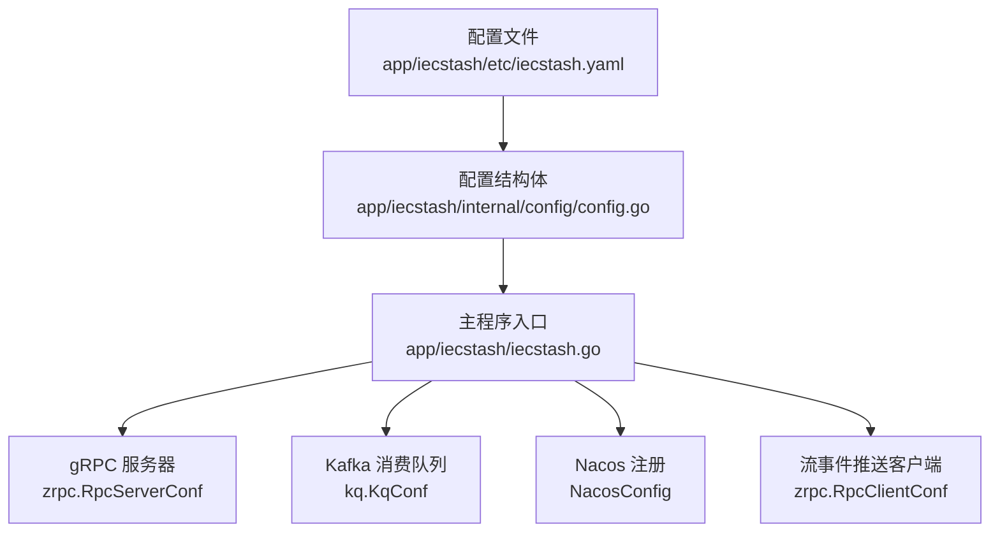
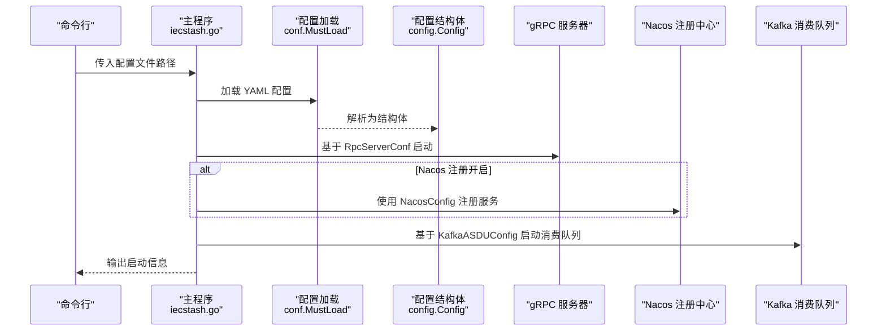
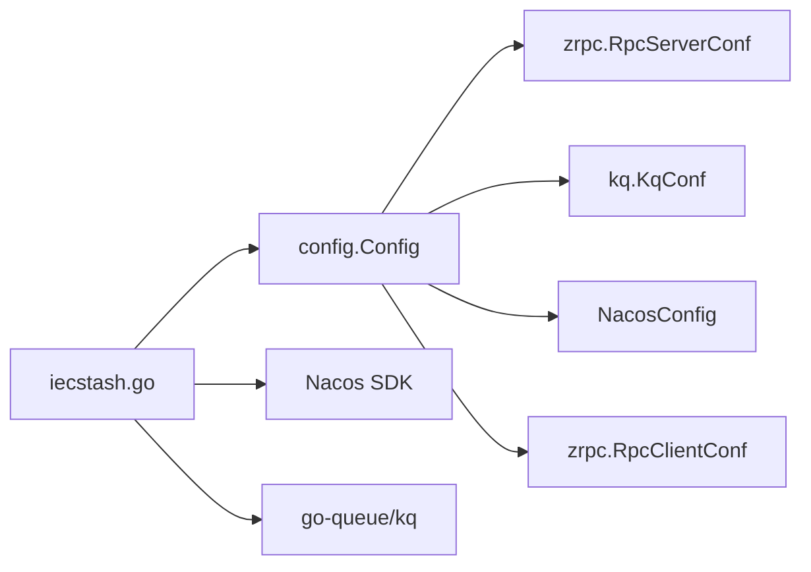

# 配置管理

<cite>
**本文引用的文件**
- [app/iecstash/etc/iecstash.yaml](file://app/iecstash/etc/iecstash.yaml)
- [app/iecstash/internal/config/config.go](file://app/iecstash/internal/config/config.go)
- [app/iecstash/iecstash.go](file://app/iecstash/iecstash.go)
- [common/nacosx/config.go](file://common/nacosx/config.go)
- [common/configx/kqConfig.go](file://common/configx/kqConfig.go)
- [app/bridgegtw/etc/bridgegtw.yaml](file://app/bridgegtw/etc/bridgegtw.yaml)
- [app/bridgemqtt/etc/bridgemqtt.yaml](file://app/bridgemqtt/etc/bridgemqtt.yaml)
- [app/bridgemodbus/etc/bridgemodbus.yaml](file://app/bridgemodbus/etc/bridgemodbus.yaml)
- [.trae/skills/zero-skills/best-practices/overview.md](file://.trae/skills/zero-skills/best-practices/overview.md)
- [facade/streamevent/streamevent/streamevent.pb.go](file://facade/streamevent/streamevent/streamevent.pb.go)
- [facade/streamevent/streamevent/streamevent.pb.validate.go](file://facade/streamevent/streamevent/streamevent.pb.validate.go)
</cite>

## 目录
1. [简介](#简介)
2. [项目结构](#项目结构)
3. [核心组件](#核心组件)
4. [架构总览](#架构总览)
5. [详细组件分析](#详细组件分析)
6. [依赖关系分析](#依赖关系分析)
7. [性能考量](#性能考量)
8. [故障排查指南](#故障排查指南)
9. [结论](#结论)
10. [附录](#附录)

## 简介
本文件面向 IECStash 服务的配置管理系统，系统性阐述服务配置文件的结构、参数语义、默认值、可选范围、配置优先级、热更新机制与验证规则，并提供多环境配置示例、配置模板、最佳实践与常见问题解决方案。目标是帮助开发者在不同环境中快速、安全地部署与运维 IECStash。

## 项目结构
IECStash 的配置位于应用目录下的 etc 子目录中，采用 YAML 格式；运行时通过内部 config 包中的结构体承载配置并被主程序加载。同时，系统集成 Nacos 注册中心与 Kafka 流处理队列，配置项分别体现在服务注册、Kafka 消费与 gRPC 客户端连接等环节。

图表来源
- [app/iecstash/etc/iecstash.yaml:1-46](file://app/iecstash/etc/iecstash.yaml#L1-L46)
- [app/iecstash/internal/config/config.go:10-28](file://app/iecstash/internal/config/config.go#L10-L28)
- [app/iecstash/iecstash.go:38-84](file://app/iecstash/iecstash.go#L38-L84)

章节来源
- [app/iecstash/etc/iecstash.yaml:1-46](file://app/iecstash/etc/iecstash.yaml#L1-L46)
- [app/iecstash/internal/config/config.go:10-28](file://app/iecstash/internal/config/config.go#L10-L28)
- [app/iecstash/iecstash.go:38-84](file://app/iecstash/iecstash.go#L38-L84)

## 核心组件
- gRPC 服务器配置：来源于 RpcServerConf，包含服务名称、监听地址、日志、优雅停机等通用配置。
- Kafka 配置：来源于 KqConf，包含 Broker 列表、Topic、消费者组、并发度、批次大小、偏移策略等。
- Nacos 注册配置：自定义结构体，包含是否注册、主机、端口、用户名、密码、命名空间、服务名等。
- 流事件推送客户端：来源于 RpcClientConf，支持基于 Nacos 的服务发现或直连端点。
- 数据库配置：可选字段，用于按需启用数据源。
- 运行时参数：如 PushAsduChunkBytes（推送批次字节数）、GracePeriod（优雅停机时长）。

章节来源
- [app/iecstash/internal/config/config.go:10-28](file://app/iecstash/internal/config/config.go#L10-L28)
- [app/iecstash/etc/iecstash.yaml:10-46](file://app/iecstash/etc/iecstash.yaml#L10-L46)

## 架构总览
下图展示 IECStash 启动流程中的配置加载与组件装配关系，以及与外部系统的交互。

图表来源
- [app/iecstash/iecstash.go:38-84](file://app/iecstash/iecstash.go#L38-L84)
- [app/iecstash/etc/iecstash.yaml:10-46](file://app/iecstash/etc/iecstash.yaml#L10-L46)

## 详细组件分析

### 1) gRPC 服务器配置（RpcServerConf）
- 关键字段
  - Name：服务名称
  - ListenOn：监听地址（格式为 host:port）
  - Mode：运行模式（dev/test/prod）
  - Log：日志编码、输出路径、级别、保留天数
  - Timeout：请求超时（毫秒）
- 默认值与可选范围
  - Name、ListenOn、Mode、Log.*、Timeout 在配置文件中显式给出；未在配置文件中出现的字段遵循 go-zero 默认值。
- 配置优先级
  - 命令行传入的配置文件路径优先于默认路径。
  - 环境变量覆盖规则遵循 go-zero 的配置加载机制（详见最佳实践）。
- 实践要点
  - 生产环境建议开启文件日志并设置合理保留天数。
  - 开发模式可启用反射以便调试。

章节来源
- [app/iecstash/etc/iecstash.yaml:1-10](file://app/iecstash/etc/iecstash.yaml#L1-L10)
- [app/bridgegtw/etc/bridgegtw.yaml:1-11](file://app/bridgegtw/etc/bridgegtw.yaml#L1-L11)
- [.trae/skills/zero-skills/best-practices/overview.md:60-138](file://.trae/skills/zero-skills/best-practices/overview.md#L60-L138)

### 2) Kafka 配置（KafkaASDUConfig）
- 字段说明
  - Name：消费队列名称
  - Brokers：Kafka 地址列表
  - Topic：主题
  - Group：消费者组
  - Conns：每个消费者组的连接数（建议不超过 CPU 核数）
  - Consumers：每连接的消费者协程数（建议不超过分区数）
  - Processors：数据处理协程数（建议为 Conns*Consumers 的倍数）
  - MinBytes/MaxBytes：每次拉取的数据块大小范围（默认 1M~10M）
  - CommitInOrder：是否顺序提交偏移
  - Offset：起始偏移策略（last/first）
- 默认值与可选范围
  - 未在配置文件中出现的字段遵循 go-queue/kq 默认值。
- 性能与稳定性
  - 并发度应与分区数匹配，避免过度并发导致资源争用。
  - 处理协程数应与业务吞吐匹配，避免阻塞。
- 配置示例
  - 参考 IECStash 配置文件中的 KafkaASDUConfig 段落。

章节来源
- [app/iecstash/etc/iecstash.yaml:18-35](file://app/iecstash/etc/iecstash.yaml#L18-L35)
- [common/configx/kqConfig.go:3-6](file://common/configx/kqConfig.go#L3-L6)

### 3) Nacos 注册配置（NacosConfig）
- 字段说明
  - IsRegister：是否注册到 Nacos
  - Host/Port：Nacos 地址与端口
  - Username/PassWord：认证凭据
  - NamespaceId：命名空间 ID
  - ServiceName：服务名
- 默认值与可选范围
  - 未在配置文件中出现的字段遵循 go-zero 默认值。
- 注册行为
  - 主程序在启动时根据 IsRegister 决定是否注册；注册时会附加 gRPC 端口与元数据。
- 日志配置
  - Nacos SDK 的日志可通过公共包进行全局配置。

章节来源
- [app/iecstash/etc/iecstash.yaml:10-18](file://app/iecstash/etc/iecstash.yaml#L10-L18)
- [app/iecstash/iecstash.go:54-72](file://app/iecstash/iecstash.go#L54-L72)
- [common/nacosx/config.go:15-37](file://common/nacosx/config.go#L15-L37)

### 4) 流事件推送客户端（StreamEventConf）
- 字段说明
  - Target：服务发现目标（支持 nacos://...）
  - Endpoints：直连端点列表
  - NonBlock：非阻塞连接
  - Timeout：连接/请求超时（毫秒）
- 默认值与可选范围
  - 未在配置文件中出现的字段遵循 go-zero 默认值。
- 使用场景
  - IECStash 将处理后的 ASDU 数据以批方式推送到流事件服务，配置决定目标服务位置与连接策略。

章节来源
- [app/iecstash/etc/iecstash.yaml:36-42](file://app/iecstash/etc/iecstash.yaml#L36-L42)
- [facade/streamevent/streamevent/streamevent.pb.go:435-445](file://facade/streamevent/streamevent/streamevent.pb.go#L435-L445)

### 5) 运行时参数
- PushAsduChunkBytes：批量推送字节数，默认 1MB
- GracePeriod：优雅停机时长，默认 10 秒
- 行为说明
  - 主程序在启动时读取 GracePeriod 并设置进程退出宽限期。
  - PushAsduChunkBytes 影响批量推送的内存占用与吞吐平衡。

章节来源
- [app/iecstash/internal/config/config.go:26-27](file://app/iecstash/internal/config/config.go#L26-L27)
- [app/iecstash/iecstash.go:40](file://app/iecstash/iecstash.go#L40)

### 6) 多环境配置示例
- 开发环境（dev）
  - gRPC 监听本地回环，日志级别 info，可启用反射。
- 生产环境（prod）
  - gRPC 监听内网 IP，日志级别 warn/info，关闭反射，开启文件日志与较长保留期。
- 示例参考
  - IECStash 配置文件展示了 dev 模式与日志配置。
  - 网关桥接服务配置展示了 Host/Port/Timeout/Upstreams 等字段。

章节来源
- [app/iecstash/etc/iecstash.yaml:3](file://app/iecstash/etc/iecstash.yaml#L3)
- [app/bridgegtw/etc/bridgegtw.yaml:1-11](file://app/bridgegtw/etc/bridgegtw.yaml#L1-L11)

### 7) 配置热更新机制
- 当前实现
  - IECStash 主程序在启动时一次性加载配置并创建各组件；未见内置的配置热重载逻辑。
- 建议方案
  - 引入配置中心订阅（如 Nacos Config），在配置变更时触发组件重建或参数刷新。
  - 对于 Kafka 消费器与 gRPC 客户端，建议在变更后平滑切换，避免中断业务。
- 注意事项
  - Nacos 注册属于服务发现范畴，与配置热更新不同，但可配合使用。

章节来源
- [app/iecstash/iecstash.go:38-84](file://app/iecstash/iecstash.go#L38-L84)

### 8) 配置验证规则
- 配置文件层面
  - YAML 语法错误会在加载阶段报错；字段缺失遵循默认值策略。
- 结构体层面
  - go-zero 提供的 RpcServerConf/RpcClientConf/KqConf 等结构体在解析时遵循标签约束（如 default、optional、options）。
- 示例验证
  - 生成的 PB 类型对字段进行校验（如 KafkaMessage 的字段校验），可用于上游数据校验，但不直接影响配置文件解析。

章节来源
- [.trae/skills/zero-skills/best-practices/overview.md:60-138](file://.trae/skills/zero-skills/best-practices/overview.md#L60-L138)
- [facade/streamevent/streamevent/streamevent.pb.validate.go:844-876](file://facade/streamevent/streamevent/streamevent.pb.validate.go#L844-L876)

## 依赖关系分析
- 组件耦合
  - 主程序依赖配置结构体；配置结构体组合了 RpcServerConf、KqConf、RpcClientConf 等第三方类型。
  - Nacos 注册与 Kafka 消费器作为独立组件被主程序装配。
- 外部依赖
  - go-zero 提供配置加载、gRPC 服务器与客户端、日志等基础设施。
  - Nacos SDK 用于服务注册与发现。
  - go-queue/kq 用于 Kafka 消费队列。

图表来源
- [app/iecstash/iecstash.go:38-84](file://app/iecstash/iecstash.go#L38-L84)
- [app/iecstash/internal/config/config.go:10-28](file://app/iecstash/internal/config/config.go#L10-L28)

章节来源
- [app/iecstash/iecstash.go:38-84](file://app/iecstash/iecstash.go#L38-L84)
- [app/iecstash/internal/config/config.go:10-28](file://app/iecstash/internal/config/config.go#L10-L28)

## 性能考量
- Kafka 并发度
  - Conns 与 Consumers 的乘积应与 Topic 分区数相匹配，避免过多协程造成上下文切换开销。
  - Processors 建议为 Conns*Consumers 的整数倍，以提升吞吐。
- 批处理大小
  - MinBytes/MaxBytes 建议结合网络与 IO 情况调整，高带宽场景可适度提高上限。
- gRPC 与 Nacos
  - 非阻塞连接（NonBlock）可减少启动阻塞；超时设置需与下游能力匹配。
  - Nacos 注册时附加元数据（如 gRPC 端口）便于路由与监控。

章节来源
- [app/iecstash/etc/iecstash.yaml:24-35](file://app/iecstash/etc/iecstash.yaml#L24-L35)
- [app/bridgemqtt/etc/bridgemqtt.yaml:42-48](file://app/bridgemqtt/etc/bridgemqtt.yaml#L42-L48)

## 故障排查指南
- 配置加载失败
  - 检查配置文件路径与权限；确认 YAML 语法正确。
  - 若字段缺失，确认默认值是否满足预期。
- gRPC 无法启动
  - 检查 ListenOn 是否被占用；确认 Mode 与日志级别。
- Kafka 消费异常
  - 核对 Brokers/Topic/Group/Offset 设置；检查分区数与并发度配置。
  - 关注 MinBytes/MaxBytes 是否导致频繁小批次或内存压力。
- Nacos 注册失败
  - 校验 Host/Port/Username/PassWord/NamespaceId；确认网络可达与鉴权通过。
  - 查看 Nacos SDK 日志定位问题。
- 流事件推送失败
  - 校验 StreamEventConf 的 Target/Endpoints；确认目标服务可用与超时设置合理。

章节来源
- [app/iecstash/etc/iecstash.yaml:10-46](file://app/iecstash/etc/iecstash.yaml#L10-L46)
- [common/nacosx/config.go:15-37](file://common/nacosx/config.go#L15-L37)

## 结论
IECStash 的配置体系围绕 go-zero 的标准配置模型构建，结合 Nacos 与 Kafka 的实际需求进行了扩展。通过明确的字段语义、合理的默认值与可选范围、清晰的优先级与验证规则，能够在不同环境下稳定运行。建议在生产环境强化日志与监控、优化 Kafka 并发度与批处理大小，并考虑引入配置热更新与服务发现联动，以进一步提升可用性与可维护性。

## 附录

### A. 配置文件模板
- IECStash 服务配置模板（摘自 etc 文件）
  - 参考路径：[app/iecstash/etc/iecstash.yaml](file://app/iecstash/etc/iecstash.yaml)
- 网关桥接服务配置模板（摘自 etc 文件）
  - 参考路径：[app/bridgegtw/etc/bridgegtw.yaml](file://app/bridgegtw/etc/bridgegtw.yaml)
- MQTT 服务配置模板（摘自 etc 文件）
  - 参考路径：[app/bridgemqtt/etc/bridgemqtt.yaml](file://app/bridgemqtt/etc/bridgemqtt.yaml)
- Modbus 网关服务配置模板（摘自 etc 文件）
  - 参考路径：[app/bridgemodbus/etc/bridgemodbus.yaml](file://app/bridgemodbus/etc/bridgemodbus.yaml)

### B. 配置最佳实践
- 使用环境变量覆盖敏感字段（如数据库密码、Nacos 凭据）。
- 生产环境启用文件日志与较长保留期，开发环境可简化日志。
- Kafka 并发度与分区数匹配，避免过度并发。
- 非阻塞连接与合理超时，提升启动与运行稳定性。
- 通过 Nacos 注册服务并附加元数据，便于统一治理。

章节来源
- [.trae/skills/zero-skills/best-practices/overview.md:60-138](file://.trae/skills/zero-skills/best-practices/overview.md#L60-L138)