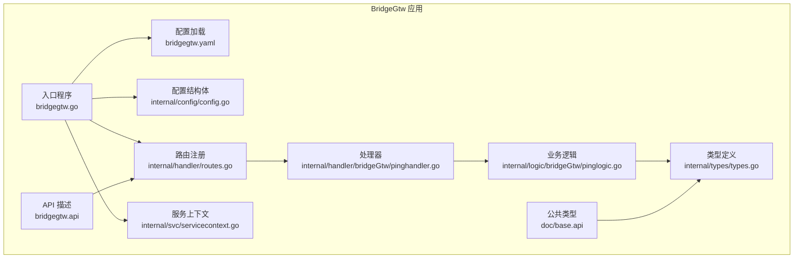
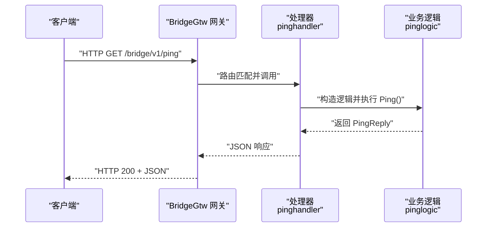
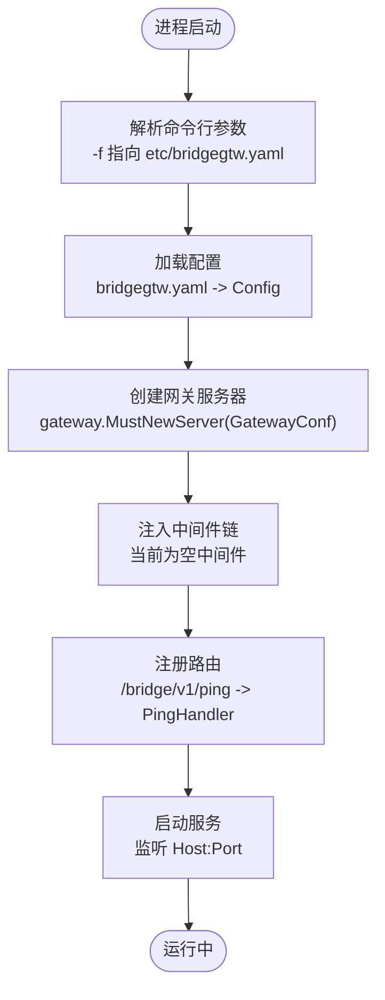
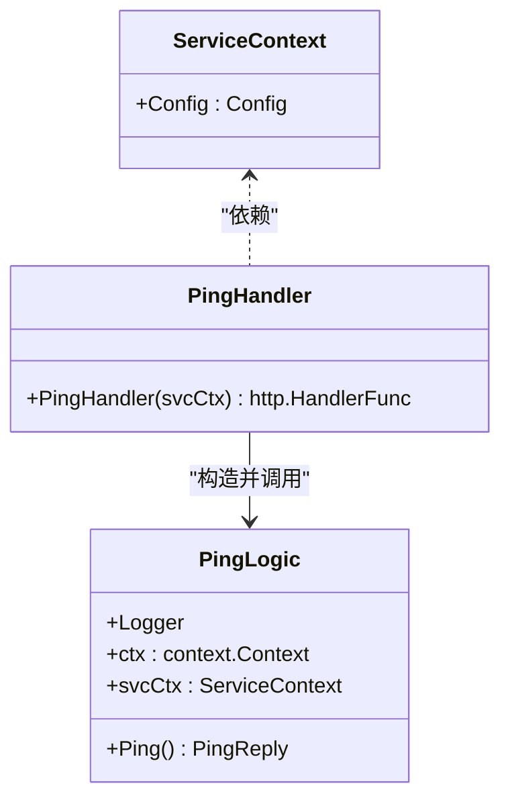
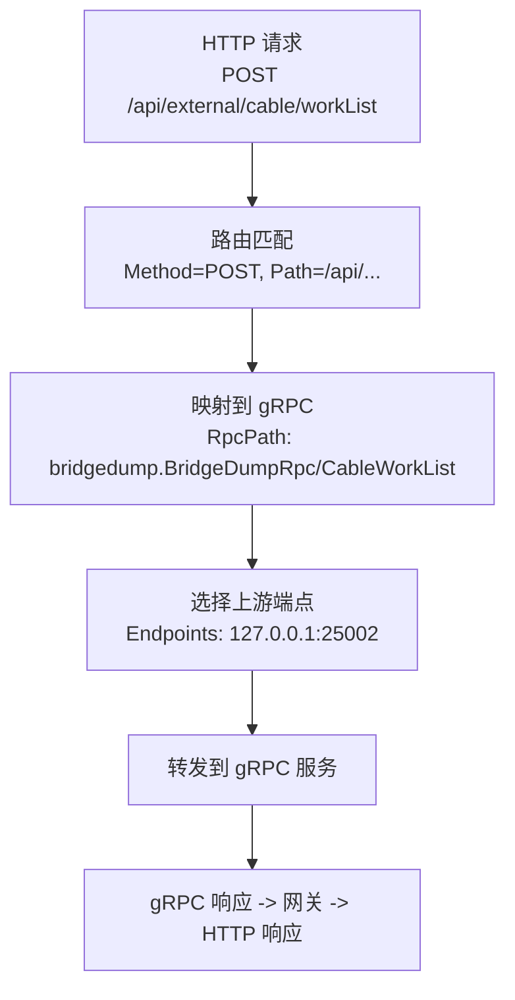
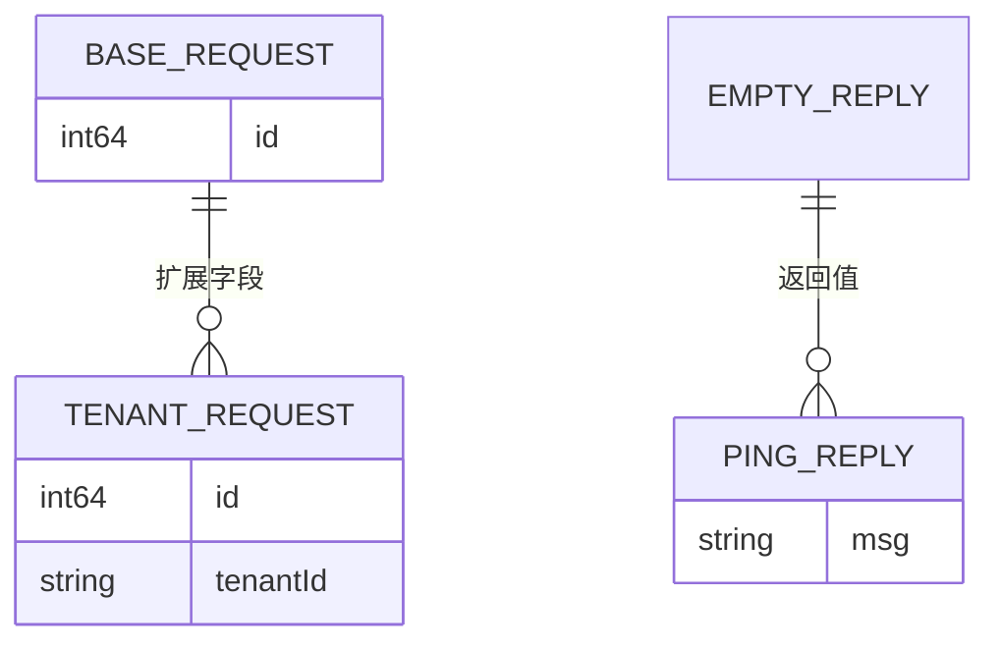
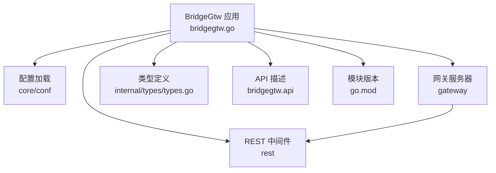

# HTTP 代理网关服务

<cite>
**本文引用的文件**
- [bridgegtw.go](file://app/bridgegtw/bridgegtw.go)
- [bridgegtw.yaml](file://app/bridgegtw/etc/bridgegtw.yaml)
- [config.go](file://app/bridgegtw/internal/config/config.go)
- [routes.go](file://app/bridgegtw/internal/handler/routes.go)
- [pinghandler.go](file://app/bridgegtw/internal/handler/bridgeGtw/pinghandler.go)
- [pinglogic.go](file://app/bridgegtw/internal/logic/bridgeGtw/pinglogic.go)
- [servicecontext.go](file://app/bridgegtw/internal/svc/servicecontext.go)
- [types.go](file://app/bridgegtw/internal/types/types.go)
- [base.api](file://app/bridgegtw/doc/base.api)
- [bridgegtw.api](file://app/bridgegtw/bridgegtw.api)
- [go.mod](file://go.mod)
</cite>

## 目录
1. [简介](#简介)
2. [项目结构](#项目结构)
3. [核心组件](#核心组件)
4. [架构总览](#架构总览)
5. [详细组件分析](#详细组件分析)
6. [依赖分析](#依赖分析)
7. [性能考虑](#性能考虑)
8. [故障排除指南](#故障排除指南)
9. [结论](#结论)
10. [附录](#附录)

## 简介
本文件面向 HTTP 代理网关服务 BridgeGtw，系统性阐述其路由转发能力、上游配置、中间件链、以及与 RPC 服务的桥接机制。BridgeGtw 基于 go-zero 网关框架，通过配置文件定义上游服务（如 gRPC）与 HTTP 路由映射，实现对内部微服务的统一入口与协议桥接。当前仓库中 BridgeGtw 的配置示例展示了如何将 HTTP POST 请求映射到 gRPC 方法，并通过网关进行转发。

## 项目结构
BridgeGtw 模块采用 go-zero 推荐的分层组织：入口程序负责加载配置并启动网关；配置模块封装网关配置；处理器注册路由；服务上下文承载配置；类型定义用于接口契约；API 描述文件定义服务组与路由前缀。

**图表来源**
- [bridgegtw.go:19-42](file://app/bridgegtw/bridgegtw.go#L19-L42)
- [bridgegtw.yaml:1-40](file://app/bridgegtw/etc/bridgegtw.yaml#L1-L40)
- [config.go:5-7](file://app/bridgegtw/internal/config/config.go#L5-L7)
- [routes.go:15-27](file://app/bridgegtw/internal/handler/routes.go#L15-L27)
- [pinghandler.go:12-22](file://app/bridgegtw/internal/handler/bridgeGtw/pinghandler.go#L12-L22)
- [pinglogic.go:12-31](file://app/bridgegtw/internal/logic/bridgeGtw/pinglogic.go#L12-L31)
- [servicecontext.go:7-15](file://app/bridgegtw/internal/svc/servicecontext.go#L7-L15)
- [types.go:6-20](file://app/bridgegtw/internal/types/types.go#L6-L20)
- [bridgegtw.api:17-21](file://app/bridgegtw/bridgegtw.api#L17-L21)
- [base.api:3-15](file://app/bridgegtw/doc/base.api#L3-L15)

**章节来源**
- [bridgegtw.go:19-42](file://app/bridgegtw/bridgegtw.go#L19-L42)
- [bridgegtw.yaml:1-40](file://app/bridgegtw/etc/bridgegtw.yaml#L1-L40)
- [config.go:5-7](file://app/bridgegtw/internal/config/config.go#L5-L7)
- [routes.go:15-27](file://app/bridgegtw/internal/handler/routes.go#L15-L27)
- [pinghandler.go:12-22](file://app/bridgegtw/internal/handler/bridgeGtw/pinghandler.go#L12-L22)
- [pinglogic.go:12-31](file://app/bridgegtw/internal/logic/bridgeGtw/pinglogic.go#L12-L31)
- [servicecontext.go:7-15](file://app/bridgegtw/internal/svc/servicecontext.go#L7-L15)
- [types.go:6-20](file://app/bridgegtw/internal/types/types.go#L6-L20)
- [bridgegtw.api:17-21](file://app/bridgegtw/bridgegtw.api#L17-L21)
- [base.api:3-15](file://app/bridgegtw/doc/base.api#L3-L15)

## 核心组件
- 入口程序：解析命令行参数，加载 YAML 配置，创建网关服务器，注册处理器，启动服务。
- 配置模块：封装 go-zero 网关配置结构，供入口程序读取。
- 路由注册：在指定前缀下注册 HTTP 路由，绑定处理器。
- 处理器与逻辑：接收 HTTP 请求，调用业务逻辑，返回 JSON 响应。
- 服务上下文：承载配置，供处理器与逻辑使用。
- 类型定义：定义请求与响应模型，支撑 API 描述。

**章节来源**
- [bridgegtw.go:19-42](file://app/bridgegtw/bridgegtw.go#L19-L42)
- [config.go:5-7](file://app/bridgegtw/internal/config/config.go#L5-L7)
- [routes.go:15-27](file://app/bridgegtw/internal/handler/routes.go#L15-L27)
- [pinghandler.go:12-22](file://app/bridgegtw/internal/handler/bridgeGtw/pinghandler.go#L12-L22)
- [pinglogic.go:12-31](file://app/bridgegtw/internal/logic/bridgeGtw/pinglogic.go#L12-L31)
- [servicecontext.go:7-15](file://app/bridgegtw/internal/svc/servicecontext.go#L7-L15)
- [types.go:6-20](file://app/bridgegtw/internal/types/types.go#L6-L20)

## 架构总览
BridgeGtw 作为 HTTP 代理网关，基于 go-zero 网关框架工作。入口程序加载 YAML 配置，创建网关服务器，并注入一个空的中间件链（当前仅透传）。随后注册路由，将 HTTP 请求映射到处理器，处理器调用业务逻辑完成处理。

**图表来源**
- [bridgegtw.go:28-39](file://app/bridgegtw/bridgegtw.go#L28-L39)
- [routes.go:15-26](file://app/bridgegtw/internal/handler/routes.go#L15-L26)
- [pinghandler.go:12-22](file://app/bridgegtw/internal/handler/bridgeGtw/pinghandler.go#L12-L22)
- [pinglogic.go:27-31](file://app/bridgegtw/internal/logic/bridgeGtw/pinglogic.go#L27-L31)

## 详细组件分析

### 配置与启动流程
- 命令行参数解析：支持通过 -f 指定配置文件路径。
- 配置加载：读取 bridgegtw.yaml 并填充 Config 结构体。
- 网关服务器创建：基于 GatewayConf 创建服务器，并注入中间件（当前为空中间件）。
- 路由注册：在 /bridge/v1 前缀下注册 /ping 路由。
- 启动服务：打印监听地址后启动网关。

**图表来源**
- [bridgegtw.go:17-42](file://app/bridgegtw/bridgegtw.go#L17-L42)
- [bridgegtw.yaml:1-40](file://app/bridgegtw/etc/bridgegtw.yaml#L1-L40)
- [config.go:5-7](file://app/bridgegtw/internal/config/config.go#L5-L7)
- [routes.go:15-26](file://app/bridgegtw/internal/handler/routes.go#L15-L26)

**章节来源**
- [bridgegtw.go:17-42](file://app/bridgegtw/bridgegtw.go#L17-L42)
- [bridgegtw.yaml:1-40](file://app/bridgegtw/etc/bridgegtw.yaml#L1-L40)
- [config.go:5-7](file://app/bridgegtw/internal/config/config.go#L5-L7)
- [routes.go:15-26](file://app/bridgegtw/internal/handler/routes.go#L15-L26)

### 路由与处理器
- 路由注册：在 /bridge/v1 前缀下注册 /ping GET 路由，绑定 PingHandler。
- 处理器职责：解析上下文、构造逻辑、调用 Ping()、错误时返回错误响应，成功时返回 JSON。
- 业务逻辑：返回固定消息“pong”。

**图表来源**
- [servicecontext.go:7-15](file://app/bridgegtw/internal/svc/servicecontext.go#L7-L15)
- [pinglogic.go:12-31](file://app/bridgegtw/internal/logic/bridgeGtw/pinglogic.go#L12-L31)
- [pinghandler.go:12-22](file://app/bridgegtw/internal/handler/bridgeGtw/pinghandler.go#L12-L22)

**章节来源**
- [routes.go:15-26](file://app/bridgegtw/internal/handler/routes.go#L15-L26)
- [pinghandler.go:12-22](file://app/bridgegtw/internal/handler/bridgeGtw/pinghandler.go#L12-L22)
- [pinglogic.go:12-31](file://app/bridgegtw/internal/logic/bridgeGtw/pinglogic.go#L12-L31)
- [servicecontext.go:7-15](file://app/bridgegtw/internal/svc/servicecontext.go#L7-L15)

### 上游与路由映射（HTTP 到 gRPC）
BridgeGtw 的配置文件展示了将 HTTP 请求映射到 gRPC 方法的机制：
- Upstreams 区域定义上游 gRPC 端点与 ProtoSets。
- Mappings 中将 HTTP 方法与路径映射到 gRPC 服务方法名（RpcPath），并可设置超时等属性。
- 当前示例中，HTTP POST /api/external/cable/workList 映射到 bridgedump.BridgeDumpRpc/CableWorkList。

**图表来源**
- [bridgegtw.yaml:25-40](file://app/bridgegtw/etc/bridgegtw.yaml#L25-L40)

**章节来源**
- [bridgegtw.yaml:25-40](file://app/bridgegtw/etc/bridgegtw.yaml#L25-L40)

### 数据模型与 API 描述
- 类型定义：包含基础请求、空响应、PingReply、带租户 ID 的请求等。
- API 描述：bridgegtw.api 定义了服务组与前缀，bridgegtw.api 中声明了 /ping 路由及其处理器。

**图表来源**
- [types.go:6-20](file://app/bridgegtw/internal/types/types.go#L6-L20)
- [base.api:3-15](file://app/bridgegtw/doc/base.api#L3-L15)
- [bridgegtw.api:17-21](file://app/bridgegtw/bridgegtw.api#L17-L21)

**章节来源**
- [types.go:6-20](file://app/bridgegtw/internal/types/types.go#L6-L20)
- [base.api:3-15](file://app/bridgegtw/doc/base.api#L3-L15)
- [bridgegtw.api:17-21](file://app/bridgegtw/bridgegtw.api#L17-L21)

## 依赖分析
BridgeGtw 依赖 go-zero 网关框架与相关组件，入口程序显式导入 conf、gateway、rest 等模块；类型定义与 API 描述文件用于生成与约束接口契约。

**图表来源**
- [bridgegtw.go:12-14](file://app/bridgegtw/bridgegtw.go#L12-L14)
- [go.mod:50](file://go.mod#L50)

**章节来源**
- [bridgegtw.go:12-14](file://app/bridgegtw/bridgegtw.go#L12-L14)
- [go.mod:50](file://go.mod#L50)

## 性能考虑
- 中间件链：当前中间件为空，便于直接透传请求，延迟较低。可根据需要扩展限流、鉴权、日志等中间件。
- 超时控制：配置文件中的 Timeout 字段可用于控制请求超时，建议根据上游服务性能合理设置。
- 日志与可观测性：可通过中间件或日志配置增强请求追踪与指标采集，便于定位性能瓶颈。
- 连接与并发：结合 go-zero 的并发模型与资源限制，确保在高并发场景下的稳定性。

## 故障排除指南
- 无法启动或端口占用：检查 Host 与 Port 配置是否冲突，确认防火墙与容器端口映射。
- 路由不生效：确认路由前缀与路径是否正确，处理器是否已注册。
- gRPC 映射失败：核对 Mappings 中的 Method、Path 与 RpcPath 是否与上游服务一致。
- 配置加载失败：确认 etc/bridgegtw.yaml 路径与权限，YAML 格式是否正确。
- 日志定位：检查日志级别与输出路径配置，必要时临时提升日志级别辅助排查。

## 结论
BridgeGtw 通过 go-zero 网关框架提供了简洁高效的 HTTP 代理能力，结合配置文件可灵活映射 HTTP 到 gRPC。当前实现以最小中间件链保证低延迟，适合作为统一入口与协议桥接层。后续可在中间件链中引入鉴权、限流、熔断等能力，并完善日志与监控体系以满足生产环境需求。

## 附录

### 配置示例（HTTP 到 gRPC 映射）
- 在 bridgegtw.yaml 的 Upstreams 中配置 gRPC 端点与 ProtoSets。
- 在 Mappings 中添加 HTTP 方法、路径与 RpcPath 的映射关系。
- 如需设置超时，可在对应映射项中配置超时参数。

**章节来源**
- [bridgegtw.yaml:25-40](file://app/bridgegtw/etc/bridgegtw.yaml#L25-L40)

### 中间件链配置
- 当前中间件为空，仅透传请求。可在 gateway.MustNewServer 回调中注入自定义中间件，例如鉴权、限流、日志等。

**章节来源**
- [bridgegtw.go:28-35](file://app/bridgegtw/bridgegtw.go#L28-L35)

### API 与路由前缀
- bridgegtw.api 定义了服务组与前缀，routes.go 将具体路由注册到该前缀下，形成 /bridge/v1/ping 的完整路径。

**章节来源**
- [bridgegtw.api:13-16](file://app/bridgegtw/bridgegtw.api#L13-L16)
- [routes.go:25](file://app/bridgegtw/internal/handler/routes.go#L25)