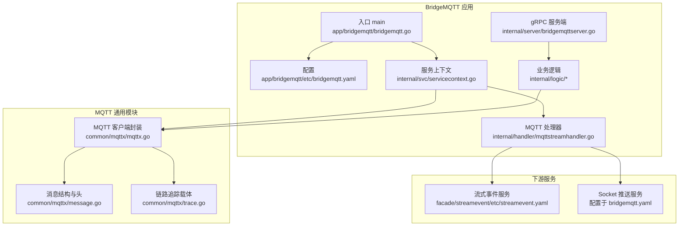
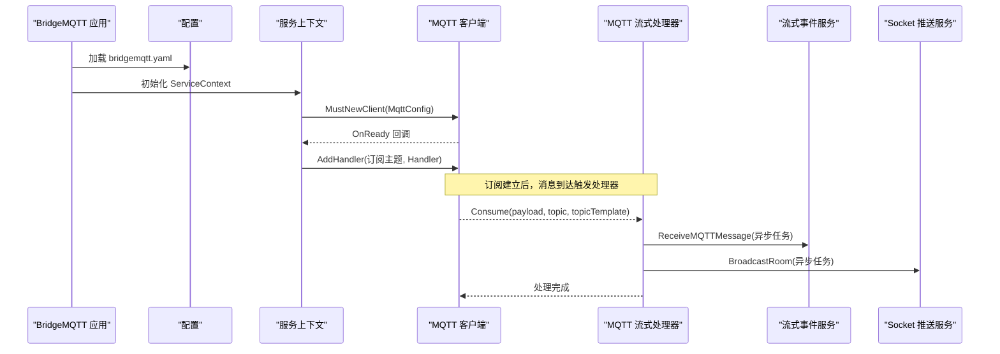
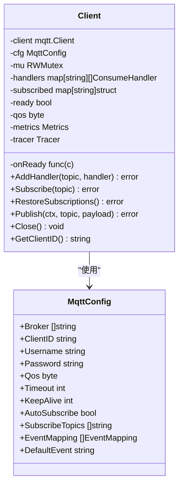
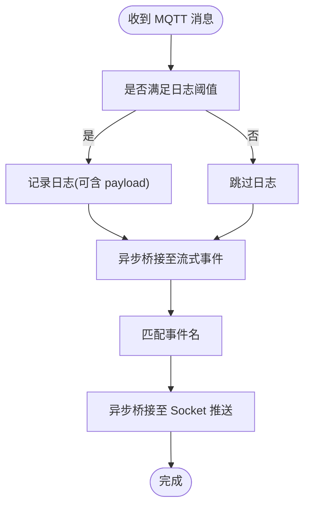
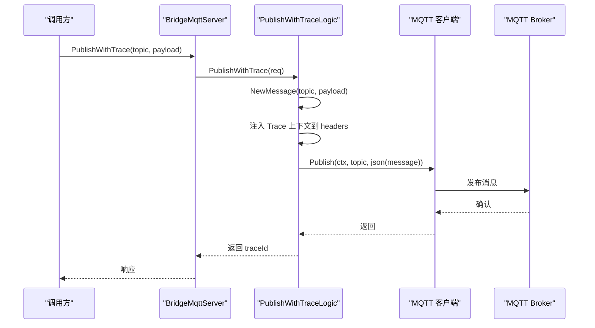
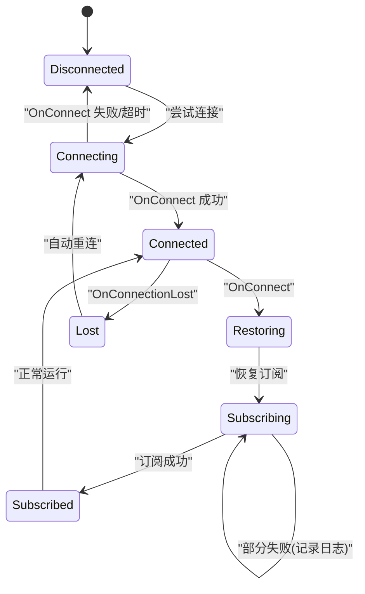
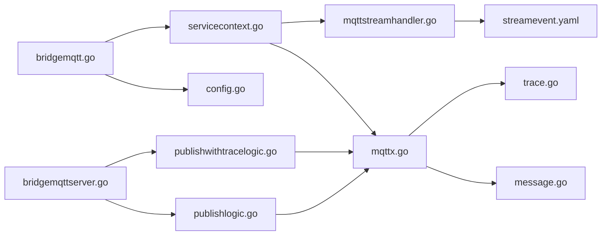

# MQTT 协议处理服务

<cite>
**本文引用的文件**
- [app/bridgemqtt/bridgemqtt.go](file://app/bridgemqtt/bridgemqtt.go)
- [app/bridgemqtt/etc/bridgemqtt.yaml](file://app/bridgemqtt/etc/bridgemqtt.yaml)
- [app/bridgemqtt/internal/config/config.go](file://app/bridgemqtt/internal/config/config.go)
- [app/bridgemqtt/internal/handler/mqttstreamhandler.go](file://app/bridgemqtt/internal/handler/mqttstreamhandler.go)
- [app/bridgemqtt/internal/logic/publishlogic.go](file://app/bridgemqtt/internal/logic/publishlogic.go)
- [app/bridgemqtt/internal/logic/publishwithtracelogic.go](file://app/bridgemqtt/internal/logic/publishwithtracelogic.go)
- [app/bridgemqtt/internal/logic/pinglogic.go](file://app/bridgemqtt/internal/logic/pinglogic.go)
- [app/bridgemqtt/internal/server/bridgemqttserver.go](file://app/bridgemqtt/internal/server/bridgemqttserver.go)
- [app/bridgemqtt/internal/svc/servicecontext.go](file://app/bridgemqtt/internal/svc/servicecontext.go)
- [app/bridgemqtt/bridgemqtt.proto](file://app/bridgemqtt/bridgemqtt.proto)
- [common/mqttx/mqttx.go](file://common/mqttx/mqttx.go)
- [common/mqttx/message.go](file://common/mqttx/message.go)
- [common/mqttx/trace.go](file://common/mqttx/trace.go)
- [facade/streamevent/etc/streamevent.yaml](file://facade/streamevent/etc/streamevent.yaml)
</cite>

## 目录
1. [简介](#简介)
2. [项目结构](#项目结构)
3. [核心组件](#核心组件)
4. [架构总览](#架构总览)
5. [详细组件分析](#详细组件分析)
6. [依赖分析](#依赖分析)
7. [性能考量](#性能考量)
8. [故障排查指南](#故障排查指南)
9. [结论](#结论)
10. [附录](#附录)

## 简介
本文件面向“BridgeMQTT”服务，系统性阐述其基于 MQTT 协议的消息发布与订阅机制，涵盖客户端连接管理、主题订阅与发布流程、消息桥接（至流式事件与 Socket 推送）、消息格式转换与 QoS 控制、日志与可观测性、连接状态与重连机制、消息路由与主题过滤、以及安全认证与性能调优建议。文档同时提供集成示例与最佳实践，帮助读者快速落地。

## 项目结构
BridgeMQTT 采用 go-zero 微服务框架，以 gRPC 为 RPC 层，内部通过统一的 MQTT 客户端封装实现消息桥接。核心目录与职责如下：
- 应用入口与配置：应用启动、配置加载、服务注册与拦截器
- 业务逻辑层：Ping/Publish/PublishWithTrace 等 RPC 实现
- 服务上下文：初始化 MQTT 客户端、注册订阅处理器、构建下游客户端
- MQTT 通用模块：MQTT 客户端、消息格式、链路追踪载体
- 消息桥接目标：流式事件服务与 Socket 推送服务

图表来源
- [app/bridgemqtt/bridgemqtt.go:28-71](file://app/bridgemqtt/bridgemqtt.go#L28-L71)
- [app/bridgemqtt/etc/bridgemqtt.yaml:1-48](file://app/bridgemqtt/etc/bridgemqtt.yaml#L1-L48)
- [app/bridgemqtt/internal/svc/servicecontext.go:21-60](file://app/bridgemqtt/internal/svc/servicecontext.go#L21-L60)
- [app/bridgemqtt/internal/server/bridgemqttserver.go:15-42](file://app/bridgemqtt/internal/server/bridgemqttserver.go#L15-L42)
- [common/mqttx/mqttx.go:76-178](file://common/mqttx/mqttx.go#L76-L178)
- [common/mqttx/message.go:1-30](file://common/mqttx/message.go#L1-L30)
- [common/mqttx/trace.go:1-31](file://common/mqttx/trace.go#L1-L31)
- [facade/streamevent/etc/streamevent.yaml:1-28](file://facade/streamevent/etc/streamevent.yaml#L1-L28)

章节来源
- [app/bridgemqtt/bridgemqtt.go:28-71](file://app/bridgemqtt/bridgemqtt.go#L28-L71)
- [app/bridgemqtt/etc/bridgemqtt.yaml:1-48](file://app/bridgemqtt/etc/bridgemqtt.yaml#L1-L48)
- [app/bridgemqtt/internal/svc/servicecontext.go:21-60](file://app/bridgemqtt/internal/svc/servicecontext.go#L21-L60)
- [app/bridgemqtt/internal/server/bridgemqttserver.go:15-42](file://app/bridgemqtt/internal/server/bridgemqttserver.go#L15-L42)
- [common/mqttx/mqttx.go:76-178](file://common/mqttx/mqttx.go#L76-L178)
- [common/mqttx/message.go:1-30](file://common/mqttx/message.go#L1-L30)
- [common/mqttx/trace.go:1-31](file://common/mqttx/trace.go#L1-L31)
- [facade/streamevent/etc/streamevent.yaml:1-28](file://facade/streamevent/etc/streamevent.yaml#L1-L28)

## 核心组件
- 配置中心：集中管理监听地址、日志、Nacos 注册、MQTT 连接参数、下游服务客户端配置
- 服务上下文：负责初始化 MQTT 客户端、注册订阅处理器、构建下游 RPC 客户端
- gRPC 服务端：暴露 Ping/Publish/PublishWithTrace 接口
- MQTT 客户端封装：统一连接、订阅、发布、重连、QoS、追踪与指标
- MQTT 流式处理器：接收消息并桥接到流式事件与 Socket 推送，支持主题日志与事件映射
- 消息格式与链路追踪：支持在消息中嵌入追踪头，实现跨服务链路追踪

章节来源
- [app/bridgemqtt/internal/config/config.go:9-24](file://app/bridgemqtt/internal/config/config.go#L9-L24)
- [app/bridgemqtt/internal/svc/servicecontext.go:16-60](file://app/bridgemqtt/internal/svc/servicecontext.go#L16-L60)
- [app/bridgemqtt/internal/server/bridgemqttserver.go:15-42](file://app/bridgemqtt/internal/server/bridgemqttserver.go#L15-L42)
- [common/mqttx/mqttx.go:76-388](file://common/mqttx/mqttx.go#L76-L388)
- [app/bridgemqtt/internal/handler/mqttstreamhandler.go:99-188](file://app/bridgemqtt/internal/handler/mqttstreamhandler.go#L99-L188)
- [common/mqttx/message.go:1-30](file://common/mqttx/message.go#L1-L30)
- [common/mqttx/trace.go:1-31](file://common/mqttx/trace.go#L1-L31)

## 架构总览
BridgeMQTT 在启动时读取配置，创建 MQTT 客户端并按配置订阅主题；当收到消息时，通过统一处理器桥接至流式事件与 Socket 推送；同时提供 gRPC 接口供外部主动发布消息，且支持带 TraceID 的发布以便链路追踪。

图表来源
- [app/bridgemqtt/bridgemqtt.go:28-71](file://app/bridgemqtt/bridgemqtt.go#L28-L71)
- [app/bridgemqtt/etc/bridgemqtt.yaml:19-48](file://app/bridgemqtt/etc/bridgemqtt.yaml#L19-L48)
- [app/bridgemqtt/internal/svc/servicecontext.go:47-55](file://app/bridgemqtt/internal/svc/servicecontext.go#L47-L55)
- [common/mqttx/mqttx.go:148-177](file://common/mqttx/mqttx.go#L148-L177)
- [app/bridgemqtt/internal/handler/mqttstreamhandler.go:130-188](file://app/bridgemqtt/internal/handler/mqttstreamhandler.go#L130-L188)

## 详细组件分析

### MQTT 客户端连接与订阅管理
- 连接参数：Broker 地址、ClientID、用户名密码、超时、心跳、QoS、自动订阅等
- 生命周期：连接、OnConnect 恢复订阅、OnConnectionLost 清空已订阅状态、关闭断开
- 订阅策略：支持自动订阅与手动订阅；连接恢复时批量恢复订阅
- 并发安全：读写锁保护处理器与订阅状态
- QoS 控制：构造时校验范围并记录日志，默认值为 1

图表来源
- [common/mqttx/mqttx.go:76-178](file://common/mqttx/mqttx.go#L76-L178)
- [common/mqttx/mqttx.go:180-255](file://common/mqttx/mqttx.go#L180-L255)
- [common/mqttx/mqttx.go:309-342](file://common/mqttx/mqttx.go#L309-L342)

章节来源
- [common/mqttx/mqttx.go:76-178](file://common/mqttx/mqttx.go#L76-L178)
- [common/mqttx/mqttx.go:180-255](file://common/mqttx/mqttx.go#L180-L255)
- [common/mqttx/mqttx.go:309-342](file://common/mqttx/mqttx.go#L309-L342)

### 消息桥接与路由规则
- 消息桥接：收到 MQTT 消息后，异步投递至流式事件与 Socket 推送两个下游
- 事件映射：根据 topicTemplate 匹配预设映射，未匹配则使用默认事件名
- 日志与限频：按主题维度记录日志，支持 payload 开关与最小日志间隔
- 异步执行：使用 TaskRunner 并发执行，避免阻塞消息处理

图表来源
- [app/bridgemqtt/internal/handler/mqttstreamhandler.go:130-188](file://app/bridgemqtt/internal/handler/mqttstreamhandler.go#L130-L188)
- [app/bridgemqtt/internal/handler/mqttstreamhandler.go:19-97](file://app/bridgemqtt/internal/handler/mqttstreamhandler.go#L19-L97)

章节来源
- [app/bridgemqtt/internal/handler/mqttstreamhandler.go:130-188](file://app/bridgemqtt/internal/handler/mqttstreamhandler.go#L130-L188)
- [app/bridgemqtt/internal/handler/mqttstreamhandler.go:19-97](file://app/bridgemqtt/internal/handler/mqttstreamhandler.go#L19-L97)

### 发布接口与消息格式转换
- Publish 接口：直接发布原始字节负载到指定主题
- PublishWithTrace 接口：将 payload 封装为带 headers 的消息对象，注入当前链路追踪上下文，再发布
- 消息结构：包含 topic、payload、headers 字段，支持自定义头部
- 链路追踪载体：实现 TextMapCarrier，用于在消息中传播 OpenTelemetry 上下文

图表来源
- [app/bridgemqtt/internal/server/bridgemqttserver.go:31-41](file://app/bridgemqtt/internal/server/bridgemqttserver.go#L31-L41)
- [app/bridgemqtt/internal/logic/publishwithtracelogic.go:30-47](file://app/bridgemqtt/internal/logic/publishwithtracelogic.go#L30-L47)
- [common/mqttx/message.go:1-30](file://common/mqttx/message.go#L1-L30)
- [common/mqttx/trace.go:1-31](file://common/mqttx/trace.go#L1-L31)

章节来源
- [app/bridgemqtt/internal/logic/publishlogic.go:26-33](file://app/bridgemqtt/internal/logic/publishlogic.go#L26-L33)
- [app/bridgemqtt/internal/logic/publishwithtracelogic.go:30-47](file://app/bridgemqtt/internal/logic/publishwithtracelogic.go#L30-L47)
- [common/mqttx/message.go:1-30](file://common/mqttx/message.go#L1-L30)
- [common/mqttx/trace.go:1-31](file://common/mqttx/trace.go#L1-L31)

### 连接状态管理与重连机制
- 自动重连：底层 paho 客户端启用自动重连
- 连接丢失：OnConnectionLost 清空已订阅集合，等待 OnConnect 后恢复订阅
- 连接成功：OnConnect 触发一次性的 ready 回调，随后恢复订阅
- 超时与错误：连接/订阅/发布均设置超时与错误上报

图表来源
- [common/mqttx/mqttx.go:148-177](file://common/mqttx/mqttx.go#L148-L177)
- [common/mqttx/mqttx.go:235-255](file://common/mqttx/mqttx.go#L235-L255)

章节来源
- [common/mqttx/mqttx.go:148-177](file://common/mqttx/mqttx.go#L148-L177)
- [common/mqttx/mqttx.go:235-255](file://common/mqttx/mqttx.go#L235-L255)

### 主题过滤与消息去重策略
- 主题过滤：通过订阅列表与通配符进行过滤（如 iec/#），由底层客户端处理
- 消息去重：当前实现未内置去重机制；如需去重，可在业务侧引入幂等键或外部存储进行去重判断

章节来源
- [app/bridgemqtt/etc/bridgemqtt.yaml:26-29](file://app/bridgemqtt/etc/bridgemqtt.yaml#L26-L29)
- [common/mqttx/mqttx.go:215-233](file://common/mqttx/mqttx.go#L215-L233)

### 安全认证机制
- MQTT 认证：用户名/密码配置在 MqttConfig 中
- gRPC 认证：通过拦截器与 Nacos 注册配置（示例中未启用）

章节来源
- [app/bridgemqtt/etc/bridgemqtt.yaml:23-24](file://app/bridgemqtt/etc/bridgemqtt.yaml#L23-L24)
- [app/bridgemqtt/bridgemqtt.go:46-64](file://app/bridgemqtt/bridgemqtt.go#L46-L64)

### 协议版本兼容性
- 使用 paho.mqtt.golang 客户端，遵循 MQTT 3.x 语义；未显式配置 MQTT 5 相关选项

章节来源
- [common/mqttx/mqttx.go:137-146](file://common/mqttx/mqttx.go#L137-L146)

## 依赖分析
BridgeMQTT 的关键依赖关系如下：
- 入口依赖配置与服务上下文，服务上下文依赖 MQTT 客户端与下游 RPC 客户端
- gRPC 服务端依赖业务逻辑层，业务逻辑层依赖服务上下文与 MQTT 客户端
- MQTT 客户端依赖消息结构与链路追踪载体

图表来源
- [app/bridgemqtt/bridgemqtt.go:28-71](file://app/bridgemqtt/bridgemqtt.go#L28-L71)
- [app/bridgemqtt/internal/config/config.go:9-24](file://app/bridgemqtt/internal/config/config.go#L9-L24)
- [app/bridgemqtt/internal/svc/servicecontext.go:21-60](file://app/bridgemqtt/internal/svc/servicecontext.go#L21-L60)
- [app/bridgemqtt/internal/server/bridgemqttserver.go:15-42](file://app/bridgemqtt/internal/server/bridgemqttserver.go#L15-L42)
- [app/bridgemqtt/internal/logic/publishlogic.go:26-33](file://app/bridgemqtt/internal/logic/publishlogic.go#L26-L33)
- [app/bridgemqtt/internal/logic/publishwithtracelogic.go:30-47](file://app/bridgemqtt/internal/logic/publishwithtracelogic.go#L30-L47)
- [common/mqttx/mqttx.go:76-178](file://common/mqttx/mqttx.go#L76-L178)
- [common/mqttx/message.go:1-30](file://common/mqttx/message.go#L1-L30)
- [common/mqttx/trace.go:1-31](file://common/mqttx/trace.go#L1-L31)
- [facade/streamevent/etc/streamevent.yaml:1-28](file://facade/streamevent/etc/streamevent.yaml#L1-L28)

章节来源
- [app/bridgemqtt/bridgemqtt.go:28-71](file://app/bridgemqtt/bridgemqtt.go#L28-L71)
- [app/bridgemqtt/internal/config/config.go:9-24](file://app/bridgemqtt/internal/config/config.go#L9-L24)
- [app/bridgemqtt/internal/svc/servicecontext.go:21-60](file://app/bridgemqtt/internal/svc/servicecontext.go#L21-L60)
- [app/bridgemqtt/internal/server/bridgemqttserver.go:15-42](file://app/bridgemqtt/internal/server/bridgemqttserver.go#L15-L42)
- [app/bridgemqtt/internal/logic/publishlogic.go:26-33](file://app/bridgemqtt/internal/logic/publishlogic.go#L26-L33)
- [app/bridgemqtt/internal/logic/publishwithtracelogic.go:30-47](file://app/bridgemqtt/internal/logic/publishwithtracelogic.go#L30-L47)
- [common/mqttx/mqttx.go:76-178](file://common/mqttx/mqttx.go#L76-L178)
- [common/mqttx/message.go:1-30](file://common/mqttx/message.go#L1-L30)
- [common/mqttx/trace.go:1-31](file://common/mqttx/trace.go#L1-L31)
- [facade/streamevent/etc/streamevent.yaml:1-28](file://facade/streamevent/etc/streamevent.yaml#L1-L28)

## 性能考量
- 并发模型：消息处理通过 TaskRunner 并发执行，提升吞吐
- 日志限频：按主题维度限制日志频率，避免高频日志影响性能
- gRPC 消息大小：下游客户端设置了最大发送消息大小，避免超大消息导致调用失败
- QoS 选择：默认 QoS=1，兼顾可靠性与性能；如需更高可靠性可调整为 2
- 连接参数：合理设置 KeepAlive 与 ConnectTimeout，避免频繁抖动

章节来源
- [app/bridgemqtt/internal/handler/mqttstreamhandler.go:114](file://app/bridgemqtt/internal/handler/mqttstreamhandler.go#L114)
- [app/bridgemqtt/internal/handler/mqttstreamhandler.go:25-47](file://app/bridgemqtt/internal/handler/mqttstreamhandler.go#L25-L47)
- [app/bridgemqtt/internal/svc/servicecontext.go:29-44](file://app/bridgemqtt/internal/svc/servicecontext.go#L29-L44)
- [common/mqttx/mqttx.go:132-135](file://common/mqttx/mqttx.go#L132-L135)

## 故障排查指南
- 连接失败/超时：检查 Broker 地址、认证信息、网络连通性与超时配置
- 订阅失败：确认主题是否正确、是否在 OnConnect 后恢复订阅
- 无处理器错误：当消息到达但未注册处理器时会记录错误；请确保订阅主题已注册处理器
- 下游调用失败：检查流式事件与 Socket 推送服务端点与超时配置
- 日志过多：通过主题日志管理器调整日志开关与最小日志间隔

章节来源
- [common/mqttx/mqttx.go:170-177](file://common/mqttx/mqttx.go#L170-L177)
- [common/mqttx/mqttx.go:235-255](file://common/mqttx/mqttx.go#L235-L255)
- [common/mqttx/mqttx.go:293-299](file://common/mqttx/mqttx.go#L293-L299)
- [app/bridgemqtt/internal/svc/servicecontext.go:23-46](file://app/bridgemqtt/internal/svc/servicecontext.go#L23-L46)
- [app/bridgemqtt/internal/handler/mqttstreamhandler.go:130-139](file://app/bridgemqtt/internal/handler/mqttstreamhandler.go#L130-L139)

## 结论
BridgeMQTT 提供了稳定可靠的 MQTT 消息桥接能力，具备完善的连接管理、订阅恢复、并发处理与可观测性。通过清晰的配置与接口设计，能够灵活对接流式事件与 Socket 推送两大下游场景。建议在生产环境中结合业务需求进一步完善去重、限流与监控策略，并根据实际负载调优 QoS 与并发参数。

## 附录

### 集成示例与最佳实践
- 配置要点
  - Broker 与认证：在配置文件中填写 Broker 地址、用户名与密码
  - 订阅主题：配置 SubscribeTopics，支持通配符
  - 事件映射：可选配置 EventMapping，未匹配时使用默认事件名
  - 下游服务：配置 SocketPushConf，必要时启用 StreamEventConf
- 最佳实践
  - 使用 PublishWithTrace 发布带链路追踪的消息，便于问题定位
  - 对高频主题开启日志限频，降低日志风暴风险
  - 合理设置 QoS 与 KeepAlive，平衡可靠性和资源消耗
  - 在生产环境启用 Nacos 注册与健康检查接口

章节来源
- [app/bridgemqtt/etc/bridgemqtt.yaml:19-48](file://app/bridgemqtt/etc/bridgemqtt.yaml#L19-L48)
- [app/bridgemqtt/internal/logic/publishwithtracelogic.go:30-47](file://app/bridgemqtt/internal/logic/publishwithtracelogic.go#L30-L47)
- [app/bridgemqtt/internal/handler/mqttstreamhandler.go:25-47](file://app/bridgemqtt/internal/handler/mqttstreamhandler.go#L25-L47)
- [app/bridgemqtt/bridgemqtt.go:46-64](file://app/bridgemqtt/bridgemqtt.go#L46-L64)