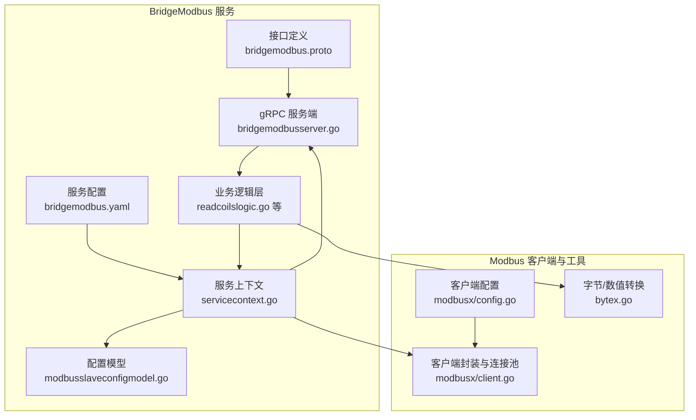
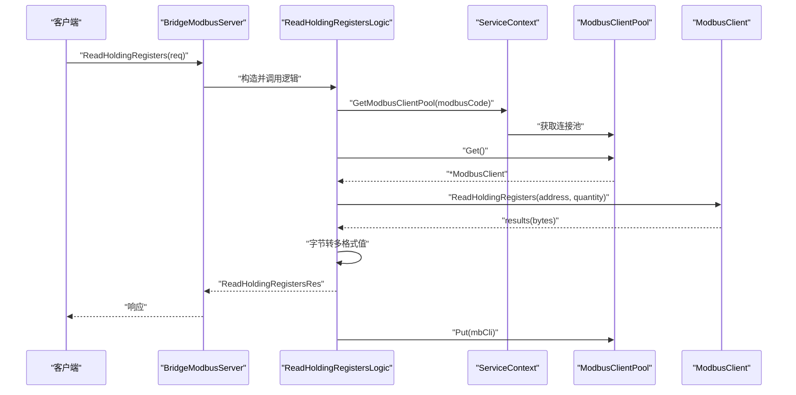
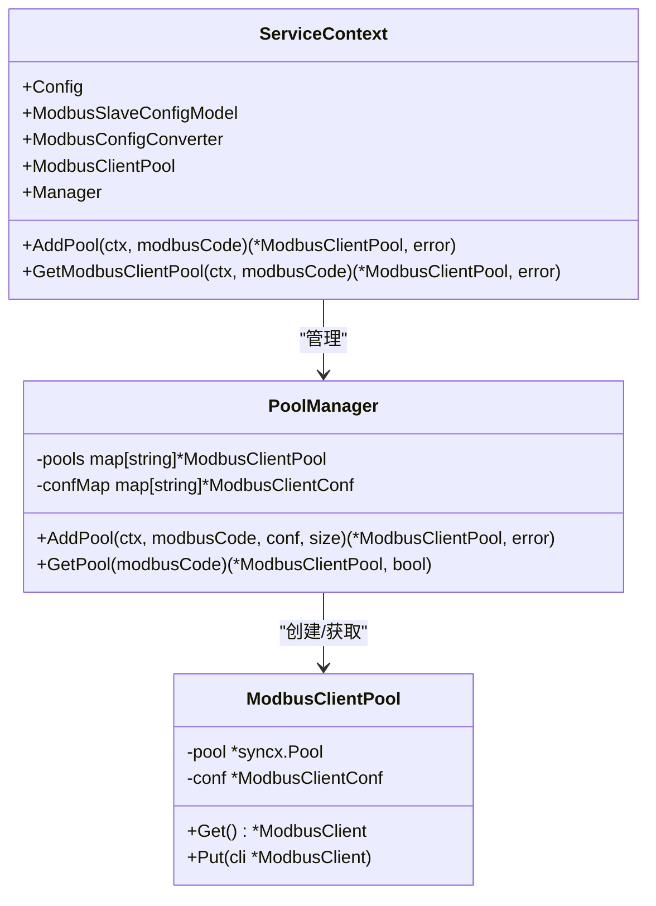
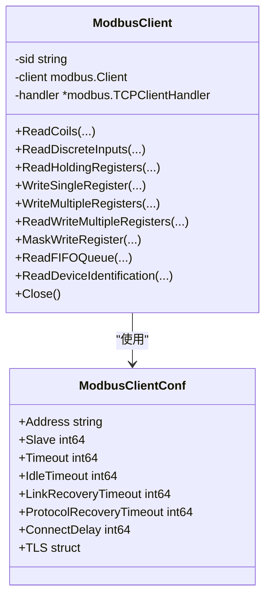
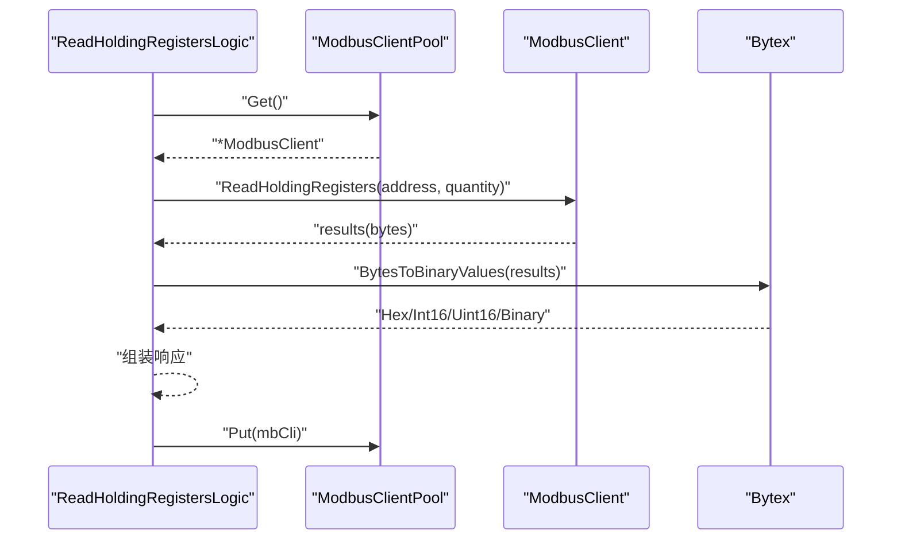
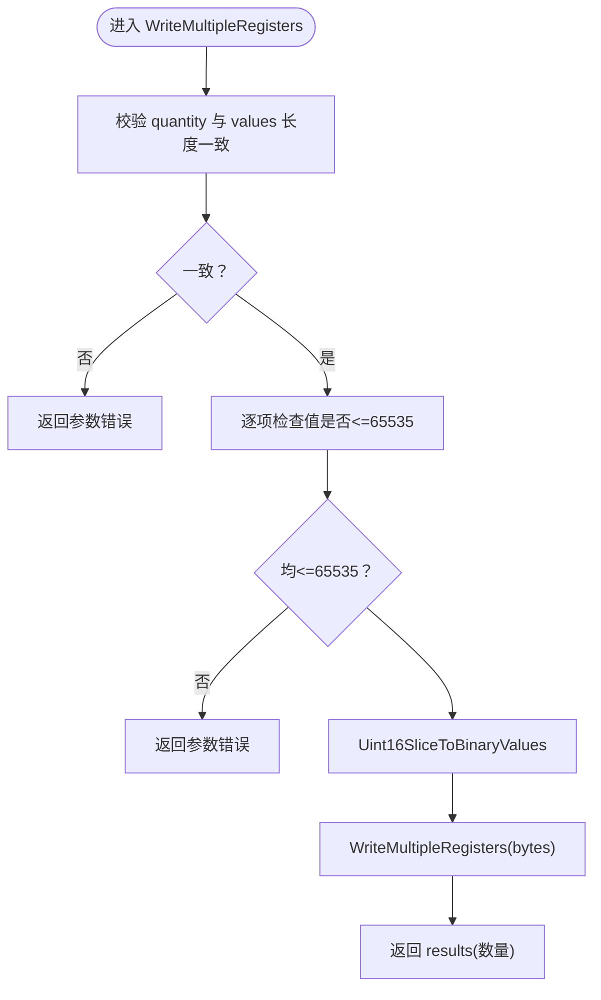
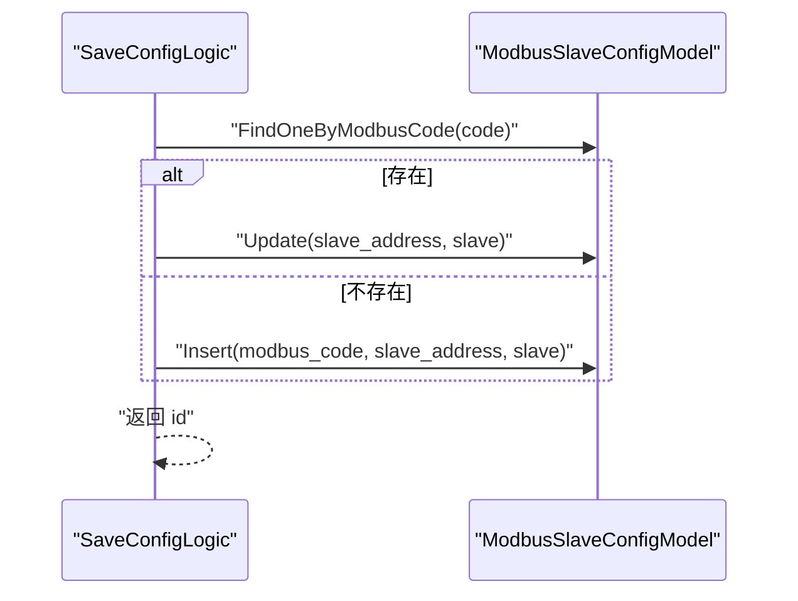

# Modbus 协议处理服务

<cite>
**本文引用的文件**
- [bridgemodbus.proto](file://app/bridgemodbus/bridgemodbus.proto)
- [bridgemodbus.yaml](file://app/bridgemodbus/etc/bridgemodbus.yaml)
- [config.go](file://app/bridgemodbus/internal/config/config.go)
- [client.go](file://common/modbusx/client.go)
- [config.go](file://common/modbusx/config.go)
- [bytex.go](file://common/bytex/bytex.go)
- [readcoilslogic.go](file://app/bridgemodbus/internal/logic/readcoilslogic.go)
- [readholdingregisterslogic.go](file://app/bridgemodbus/internal/logic/readholdingregisterslogic.go)
- [writemultipleregisterslogic.go](file://app/bridgemodbus/internal/logic/writemultipleregisterslogic.go)
- [maskwriteregisterlogic.go](file://app/bridgemodbus/internal/logic/maskwriteregisterlogic.go)
- [readdeviceidentificationlogic.go](file://app/bridgemodbus/internal/logic/readdeviceidentificationlogic.go)
- [saveconfiglogic.go](file://app/bridgemodbus/internal/logic/saveconfiglogic.go)
- [servicecontext.go](file://app/bridgemodbus/internal/svc/servicecontext.go)
- [bridgemodbusserver.go](file://app/bridgemodbus/internal/server/bridgemodbusserver.go)
- [modbusslaveconfigmodel.go](file://model/modbusslaveconfigmodel.go)
</cite>

## 目录
1. [简介](#简介)
2. [项目结构](#项目结构)
3. [核心组件](#核心组件)
4. [架构总览](#架构总览)
5. [详细组件分析](#详细组件分析)
6. [依赖关系分析](#依赖关系分析)
7. [性能考虑](#性能考虑)
8. [故障排查指南](#故障排查指南)
9. [结论](#结论)
10. [附录](#附录)

## 简介
本技术文档面向 Modbus 协议处理服务（BridgeModbus），系统性阐述其在 RTU/TCP 两种模式下的通信实现、寄存器读写与批量处理机制、错误码与异常处理策略、配置参数与性能优化建议，并提供实际使用示例与常见问题解决方案。服务通过 gRPC 提供统一接口，内部基于连接池与配置管理实现多链路并发访问，覆盖线圈/离散输入、保持寄存器/输入寄存器、设备标识等典型 Modbus 功能。

## 项目结构
BridgeModbus 服务位于 app/bridgemodbus 目录，采用 Go-Zero 微服务框架，结合 common/modbusx 提供的 Modbus 客户端封装与连接池能力，配合 model 层对配置进行持久化管理。核心目录与文件如下：
- 接口定义：app/bridgemodbus/bridgemodbus.proto
- 服务配置：app/bridgemodbus/etc/bridgemodbus.yaml
- 服务上下文与连接池：app/bridgemodbus/internal/svc/servicecontext.go
- gRPC 服务端实现：app/bridgemodbus/internal/server/bridgemodbusserver.go
- 业务逻辑层：app/bridgemodbus/internal/logic/*.go
- Modbus 客户端与连接池：common/modbusx/client.go, common/modbusx/config.go
- 数据转换工具：common/bytex/bytex.go
- 配置模型：model/modbusslaveconfigmodel.go

**图表来源**
- [bridgemodbus.proto:1-355](file://app/bridgemodbus/bridgemodbus.proto#L1-L355)
- [bridgemodbus.yaml:1-26](file://app/bridgemodbus/etc/bridgemodbus.yaml#L1-L26)
- [servicecontext.go:1-81](file://app/bridgemodbus/internal/svc/servicecontext.go#L1-L81)
- [bridgemodbusserver.go:1-151](file://app/bridgemodbus/internal/server/bridgemodbusserver.go#L1-L151)
- [client.go:1-218](file://common/modbusx/client.go#L1-L218)
- [config.go:1-125](file://common/modbusx/config.go#L1-L125)
- [bytex.go:1-239](file://common/bytex/bytex.go#L1-L239)
- [modbusslaveconfigmodel.go:1-32](file://model/modbusslaveconfigmodel.go#L1-L32)

**章节来源**
- [bridgemodbus.proto:1-355](file://app/bridgemodbus/bridgemodbus.proto#L1-L355)
- [bridgemodbus.yaml:1-26](file://app/bridgemodbus/etc/bridgemodbus.yaml#L1-L26)
- [servicecontext.go:1-81](file://app/bridgemodbus/internal/svc/servicecontext.go#L1-L81)
- [bridgemodbusserver.go:1-151](file://app/bridgemodbus/internal/server/bridgemodbusserver.go#L1-L151)
- [client.go:1-218](file://common/modbusx/client.go#L1-L218)
- [config.go:1-125](file://common/modbusx/config.go#L1-L125)
- [bytex.go:1-239](file://common/bytex/bytex.go#L1-L239)
- [modbusslaveconfigmodel.go:1-32](file://model/modbusslaveconfigmodel.go#L1-L32)

## 核心组件
- 接口定义与消息结构：bridgemodbus.proto 定义了配置管理、位访问（线圈/离散输入）、16 位寄存器访问（输入/保持寄存器、单/多写、读写组合、屏蔽写）、设备标识读取、批量十进制转寄存器等功能与消息体。
- 服务配置：bridgemodbus.yaml 提供 RPC 监听、日志、连接池大小、Nacos 注册、数据库连接、默认 Modbus 客户端配置等。
- 服务上下文：servicecontext.go 负责初始化数据库模型、默认连接池、连接池管理器，并提供按 modbusCode 动态创建/获取连接池的能力。
- gRPC 服务端：bridgemodbusserver.go 将每个 RPC 方法路由到对应的 logic 实现。
- Modbus 客户端与连接池：client.go 封装 modbus.Client，提供所有功能码方法；config.go 定义客户端配置与连接池管理器，支持按 modbusCode 维度创建独立连接池。
- 数据转换：bytex.go 提供字节与 16 位整数/二进制/十六进制之间的互转，支撑读写结果的多格式输出。
- 配置模型：modbusslaveconfigmodel.go 提供对 Modbus 从站配置的模型抽象与会话封装。

**章节来源**
- [bridgemodbus.proto:1-355](file://app/bridgemodbus/bridgemodbus.proto#L1-L355)
- [bridgemodbus.yaml:1-26](file://app/bridgemodbus/etc/bridgemodbus.yaml#L1-L26)
- [servicecontext.go:1-81](file://app/bridgemodbus/internal/svc/servicecontext.go#L1-L81)
- [bridgemodbusserver.go:1-151](file://app/bridgemodbus/internal/server/bridgemodbusserver.go#L1-L151)
- [client.go:1-218](file://common/modbusx/client.go#L1-L218)
- [config.go:1-125](file://common/modbusx/config.go#L1-L125)
- [bytex.go:1-239](file://common/bytex/bytex.go#L1-L239)
- [modbusslaveconfigmodel.go:1-32](file://model/modbusslaveconfigmodel.go#L1-L32)

## 架构总览
BridgeModbus 采用“配置驱动 + 连接池 + 业务逻辑”的分层架构：
- 配置层：读取 bridgemodbus.yaml 与数据库中的从站配置，动态构建连接池。
- 传输层：基于 modbusx 的 TCP 客户端封装，支持 TLS、超时、空闲超时、重连与协议恢复。
- 业务层：每个 RPC 映射到一个 logic，负责参数校验、调用连接池、执行 Modbus 操作、结果转换。
- 输出层：返回统一的 gRPC 响应，包含原始字节与多格式解析值。

**图表来源**
- [bridgemodbusserver.go:86-90](file://app/bridgemodbus/internal/server/bridgemodbusserver.go#L86-L90)
- [readholdingregisterslogic.go:27-57](file://app/bridgemodbus/internal/logic/readholdingregisterslogic.go#L27-L57)
- [servicecontext.go:56-80](file://app/bridgemodbus/internal/svc/servicecontext.go#L56-L80)
- [client.go:54-57](file://common/modbusx/client.go#L54-L57)

**章节来源**
- [bridgemodbusserver.go:1-151](file://app/bridgemodbus/internal/server/bridgemodbusserver.go#L1-L151)
- [readholdingregisterslogic.go:1-58](file://app/bridgemodbus/internal/logic/readholdingregisterslogic.go#L1-L58)
- [servicecontext.go:1-81](file://app/bridgemodbus/internal/svc/servicecontext.go#L1-L81)
- [client.go:1-218](file://common/modbusx/client.go#L1-L218)

## 详细组件分析

### 1) 配置管理与连接池
- 配置加载：bridgemodbus.yaml 中的 ModbusPool 控制默认连接池大小；ModbusClientConf 提供默认 TCP 地址、从站号、超时、TLS 等参数。
- 服务上下文：ServiceContext 在启动时初始化默认连接池与 PoolManager；GetModbusClientPool 支持按 modbusCode 动态创建/获取连接池；AddPool 从数据库查询配置并转换为客户端配置后加入 PoolManager。
- 连接池管理：PoolManager 以 modbusCode 为键维护连接池，避免重复创建；ModbusClientPool 使用 syncx.Pool 实现资源复用与自动销毁。

**图表来源**
- [servicecontext.go:14-81](file://app/bridgemodbus/internal/svc/servicecontext.go#L14-L81)
- [config.go:63-125](file://common/modbusx/config.go#L63-L125)

**章节来源**
- [bridgemodbus.yaml:1-26](file://app/bridgemodbus/etc/bridgemodbus.yaml#L1-L26)
- [config.go:1-26](file://app/bridgemodbus/internal/config/config.go#L1-L26)
- [servicecontext.go:1-81](file://app/bridgemodbus/internal/svc/servicecontext.go#L1-L81)
- [config.go:1-125](file://common/modbusx/config.go#L1-L125)

### 2) 通信模式与客户端封装
- TCP 模式：ModbusClient 基于 modbus.NewTCPClientHandler，支持设置从站号、超时、空闲超时、重连与协议恢复、连接延迟、TLS 证书与 CA。
- RTU 模式：当前仓库未提供 RTU 客户端封装，仅包含 TCP 客户端实现与连接池。若需 RTU，请在 ModbusClient 中扩展相应 handler。

**图表来源**
- [client.go:20-97](file://common/modbusx/client.go#L20-L97)
- [config.go:32-61](file://common/modbusx/config.go#L32-L61)

**章节来源**
- [client.go:1-218](file://common/modbusx/client.go#L1-L218)
- [config.go:1-125](file://common/modbusx/config.go#L1-L125)

### 3) 寄存器读写与批量处理

#### 3.1 读取保持寄存器（Function Code 0x03）
- 逻辑：ReadHoldingRegistersLogic 获取连接池，调用 ReadHoldingRegisters，使用 bytex.BytesToBinaryValues 将字节转换为十六进制、二进制、uint16/int16 列表。
- 数量限制：proto 中 quantity 最大为 125。

**图表来源**
- [readholdingregisterslogic.go:27-57](file://app/bridgemodbus/internal/logic/readholdingregisterslogic.go#L27-L57)
- [bytex.go:136-161](file://common/bytex/bytex.go#L136-L161)

**章节来源**
- [readholdingregisterslogic.go:1-58](file://app/bridgemodbus/internal/logic/readholdingregisterslogic.go#L1-L58)
- [bytex.go:1-239](file://common/bytex/bytex.go#L1-L239)

#### 3.2 写多个保持寄存器（Function Code 0x10）
- 逻辑：WriteMultipleRegistersLogic 校验数量与值范围（<=65535），将 uint32 值切片转换为 BinaryValues，再写入；返回写入数量回显。
- 注意：values 与 quantity 必须一致。

**图表来源**
- [writemultipleregisterslogic.go:29-61](file://app/bridgemodbus/internal/logic/writemultipleregisterslogic.go#L29-L61)

**章节来源**
- [writemultipleregisterslogic.go:1-62](file://app/bridgemodbus/internal/logic/writemultipleregisterslogic.go#L1-L62)

#### 3.3 屏蔽写保持寄存器（Function Code 0x16）
- 逻辑：MaskWriteRegisterLogic 校验 AND/OR 掩码不超过 16 位最大值，调用 MaskWriteRegister，返回回显字节。
- 应用场景：对寄存器按位进行与/或操作而不读取整个寄存器。

**章节来源**
- [maskwriteregisterlogic.go:1-53](file://app/bridgemodbus/internal/logic/maskwriteregisterlogic.go#L1-L53)

#### 3.4 读取线圈与离散输入
- 逻辑：ReadCoilsLogic 与 ReadDiscreteInputsLogic 获取连接池，调用对应方法，使用 bytex.BytesToBools 将位序列转换为布尔数组，便于上层消费。

**章节来源**
- [readcoilslogic.go:1-44](file://app/bridgemodbus/internal/logic/readcoilslogic.go#L1-L44)

#### 3.5 设备标识读取（Function Code 0x2B / 0x0E）
- 逻辑：ReadDeviceIdentificationLogic 调用 ReadDeviceIdentification，将返回的原始映射转换为十进制、十六进制与语义化三套结果集，便于协议调试与业务展示。

**章节来源**
- [readdeviceidentificationlogic.go:1-70](file://app/bridgemodbus/internal/logic/readdeviceidentificationlogic.go#L1-L70)

### 4) 配置管理与持久化
- 保存配置：SaveConfigLogic 先查找是否存在同编码配置，存在则更新从站地址与从站号，否则插入新记录，返回主键 ID。
- 配置来源：ServiceContext.AddPool 从数据库查询并校验状态，转换为客户端配置后加入 PoolManager。

**图表来源**
- [saveconfiglogic.go:27-61](file://app/bridgemodbus/internal/logic/saveconfiglogic.go#L27-L61)
- [servicecontext.go:34-54](file://app/bridgemodbus/internal/svc/servicecontext.go#L34-L54)

**章节来源**
- [saveconfiglogic.go:1-62](file://app/bridgemodbus/internal/logic/saveconfiglogic.go#L1-L62)
- [servicecontext.go:1-81](file://app/bridgemodbus/internal/svc/servicecontext.go#L1-L81)
- [modbusslaveconfigmodel.go:1-32](file://model/modbusslaveconfigmodel.go#L1-L32)

## 依赖关系分析
- 服务端到逻辑层：bridgemodbusserver.go 将每个 RPC 方法委托给对应 logic。
- 逻辑层到服务上下文：logic 通过 svcCtx.GetModbusClientPool 获取连接池，必要时调用 AddPool 创建新池。
- 逻辑层到客户端：logic 直接调用 ModbusClient 的功能码方法。
- 逻辑层到转换工具：bytex 提供字节与多格式值的互转。
- 服务上下文到模型：通过 ModbusSlaveConfigModel 查询/更新配置。

**图表来源**
- [bridgemodbusserver.go:1-151](file://app/bridgemodbus/internal/server/bridgemodbusserver.go#L1-L151)
- [servicecontext.go:1-81](file://app/bridgemodbus/internal/svc/servicecontext.go#L1-L81)
- [client.go:1-218](file://common/modbusx/client.go#L1-L218)
- [bytex.go:1-239](file://common/bytex/bytex.go#L1-L239)
- [modbusslaveconfigmodel.go:1-32](file://model/modbusslaveconfigmodel.go#L1-L32)

**章节来源**
- [bridgemodbusserver.go:1-151](file://app/bridgemodbus/internal/server/bridgemodbusserver.go#L1-L151)
- [servicecontext.go:1-81](file://app/bridgemodbus/internal/svc/servicecontext.go#L1-L81)
- [client.go:1-218](file://common/modbusx/client.go#L1-L218)
- [bytex.go:1-239](file://common/bytex/bytex.go#L1-L239)
- [modbusslaveconfigmodel.go:1-32](file://model/modbusslaveconfigmodel.go#L1-L32)

## 性能考虑
- 连接池复用：通过 ModbusClientPool 与 PoolManager 实现连接复用，减少频繁建链开销；默认池大小由 bridgemodbus.yaml 的 ModbusPool 控制。
- 超时与恢复：合理设置 Timeout、IdleTimeout、LinkRecoveryTimeout、ProtocolRecoveryTimeout，避免长尾阻塞与抖动。
- 批量写入：尽量使用 WriteMultipleRegisters 等批量接口减少往返次数。
- 结果转换：bytex 的转换函数为 O(n)，在高频场景下注意避免重复转换。
- TLS 开销：启用 TLS 会增加握手与加解密成本，建议在可信网络或必要时开启。

[本节为通用性能建议，无需具体文件引用]

## 故障排查指南
- 参数校验错误
  - 写多个寄存器时 values 与 quantity 不一致，或值超过 16 位寄存器上限（65535）。
  - 屏蔽写掩码超过 16 位上限。
- 配置相关
  - modbusCode 为空或未启用，导致无法创建/获取连接池。
  - 数据库中配置缺失或状态异常。
- 通信异常
  - 超时/空闲超时过短导致频繁断连。
  - TLS 证书/CA 文件路径错误或权限不足。
- 日志定位
  - ModbusLogger 会在日志中附加 address、addressMd5、session 等字段，便于关联同一链路的多次请求。

**章节来源**
- [writemultipleregisterslogic.go:31-46](file://app/bridgemodbus/internal/logic/writemultipleregisterslogic.go#L31-L46)
- [maskwriteregisterlogic.go:37-43](file://app/bridgemodbus/internal/logic/maskwriteregisterlogic.go#L37-L43)
- [servicecontext.go:34-54](file://app/bridgemodbus/internal/svc/servicecontext.go#L34-L54)
- [client.go:107-143](file://common/modbusx/client.go#L107-L143)

## 结论
BridgeModbus 服务通过清晰的分层设计与连接池机制，实现了对 Modbus RTU/TCP 的稳定访问与高效处理。其接口覆盖了常见的位与寄存器操作，并提供多格式结果输出与设备标识读取能力。结合合理的配置与性能参数，可在工业场景中可靠运行。对于 RTU 模式，建议在现有 TCP 客户端基础上扩展相应 handler 以满足现场需求。

[本节为总结性内容，无需具体文件引用]

## 附录

### A. 配置参数说明
- bridgemodbus.yaml
  - Name/ListenOn：服务名与监听地址
  - Timeout：RPC 超时
  - Log：日志编码、路径、级别、保留天数
  - ModbusPool：默认连接池大小
  - NacosConfig：注册中心配置
  - DB.DataSource：数据库连接串
  - ModbusClientConf：默认 Modbus 客户端配置（Address、Slave、Timeout、IdleTimeout、LinkRecoveryTimeout、ProtocolRecoveryTimeout、ConnectDelay、TLS）
- 内部配置结构
  - config.Config：继承 zrpc.RpcServerConf，包含 ModbusPool、NacosConfig、DB、ModbusClientConf

**章节来源**
- [bridgemodbus.yaml:1-26](file://app/bridgemodbus/etc/bridgemodbus.yaml#L1-L26)
- [config.go:1-26](file://app/bridgemodbus/internal/config/config.go#L1-L26)
- [config.go:32-61](file://common/modbusx/config.go#L32-L61)

### B. 使用示例（步骤说明）
- 保存配置
  - 调用 SaveConfig，传入 modbusCode、slaveAddress、slave。
  - 返回 id，后续可通过该 id 或 modbusCode 使用连接池。
- 读取保持寄存器
  - 调用 ReadHoldingRegisters，传入 modbusCode、address、quantity（≤125）。
  - 返回 results（字节）与多格式解析值（十六进制、二进制、uint32/int32）。
- 写多个保持寄存器
  - 调用 WriteMultipleRegisters，传入 address、quantity、values（每个值≤65535）。
  - 返回写入数量回显。
- 屏蔽写寄存器
  - 调用 MaskWriteRegister，传入 address、andMask、orMask（均≤65535）。
- 读取设备标识
  - 调用 ReadDeviceIdentification，传入 modbusCode、readDeviceIdCode。
  - 返回十进制、十六进制与语义化映射结果。

**章节来源**
- [bridgemodbusserver.go:26-150](file://app/bridgemodbus/internal/server/bridgemodbusserver.go#L26-L150)
- [bridgemodbus.proto:105-355](file://app/bridgemodbus/bridgemodbus.proto#L105-L355)

### C. 错误码与异常处理策略
- 参数错误：当 quantity 与 values 数量不一致、值越界、modbusCode 为空或未启用时，返回明确的业务错误。
- 业务错误：创建连接池失败、获取连接池为空等，统一包装为业务错误返回。
- 通信错误：底层 Modbus 异常由客户端返回，上层捕获后透传或包装为统一错误。

**章节来源**
- [writemultipleregisterslogic.go:31-46](file://app/bridgemodbus/internal/logic/writemultipleregisterslogic.go#L31-L46)
- [maskwriteregisterlogic.go:37-43](file://app/bridgemodbus/internal/logic/maskwriteregisterlogic.go#L37-L43)
- [servicecontext.go:69-77](file://app/bridgemodbus/internal/svc/servicecontext.go#L69-L77)