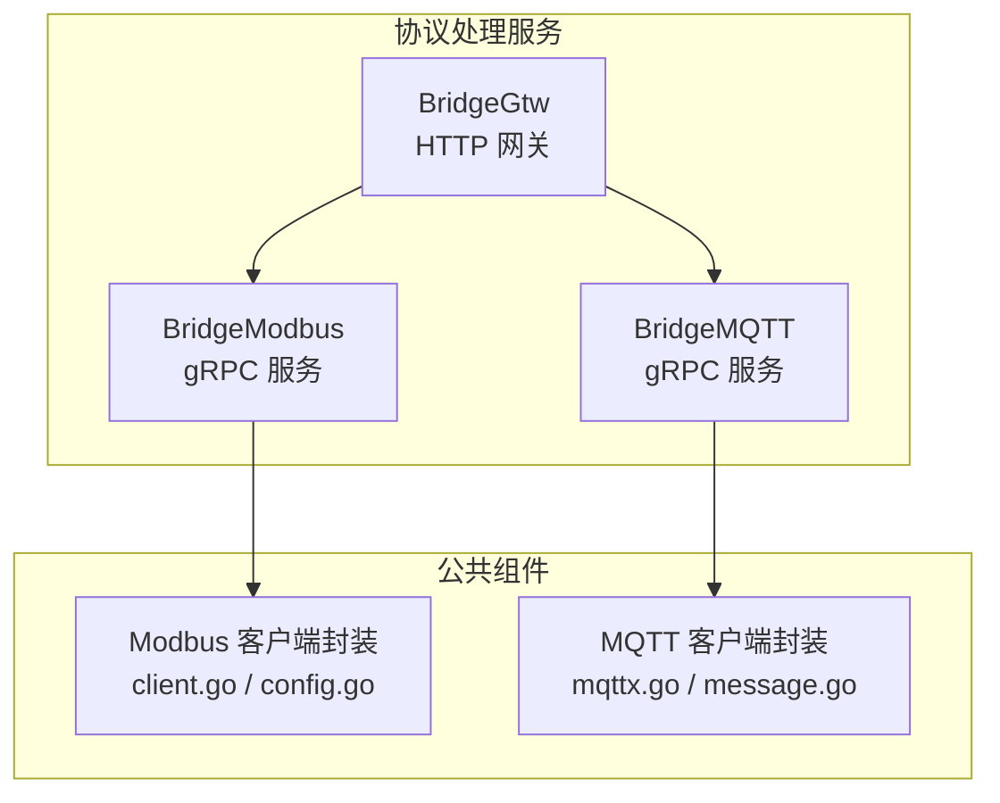
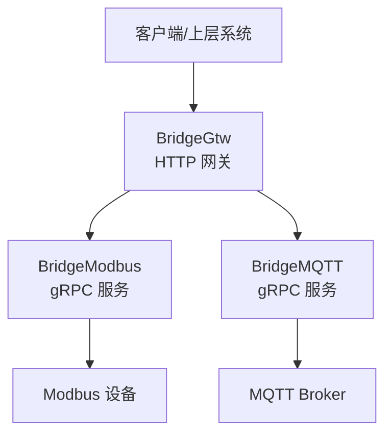
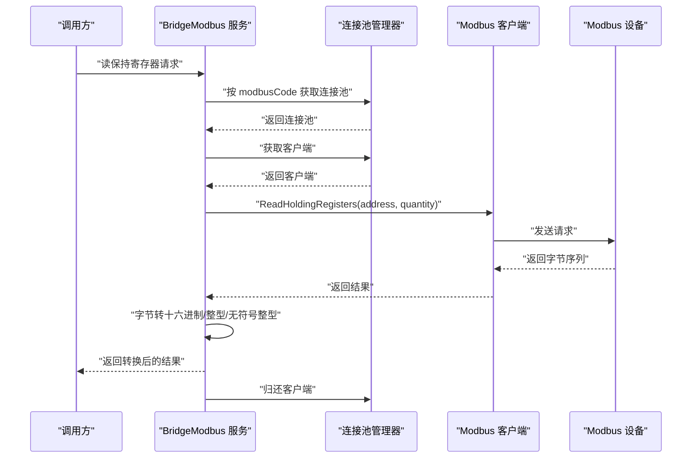
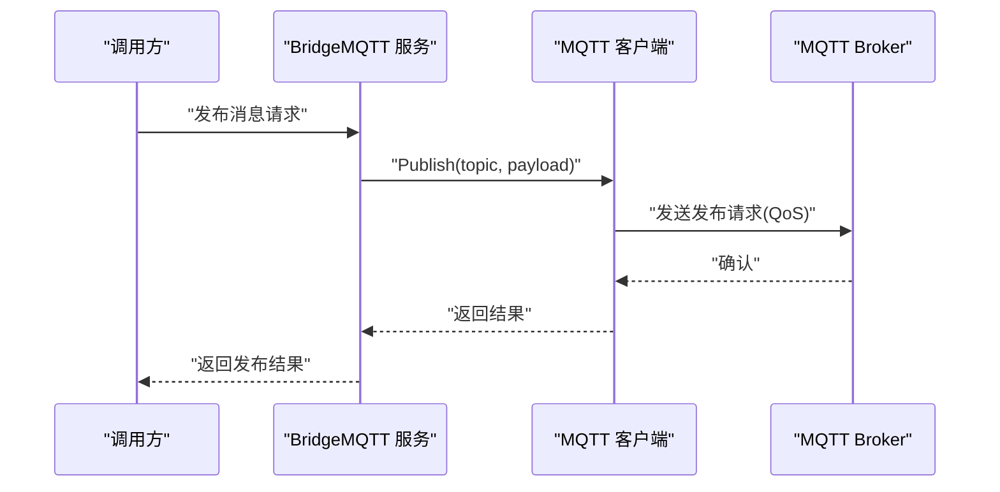
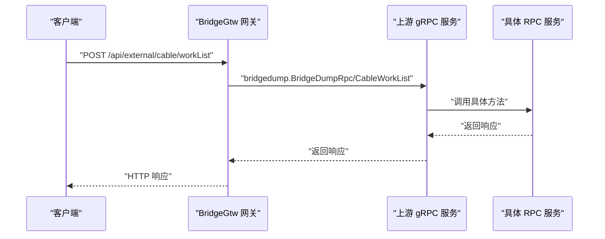
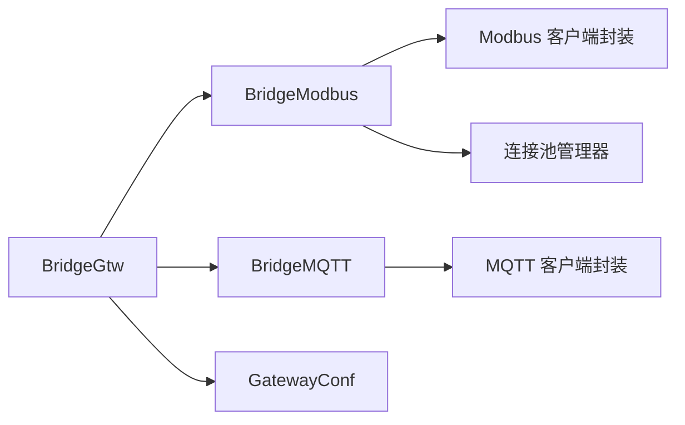

# 协议处理服务

<cite>
**本文引用的文件**
- [bridgemodbus.yaml](file://app/bridgemodbus/etc/bridgemodbus.yaml)
- [bridgemqtt.yaml](file://app/bridgemqtt/etc/bridgemqtt.yaml)
- [bridgegtw.yaml](file://app/bridgegtw/etc/bridgegtw.yaml)
- [client.go](file://common/modbusx/client.go)
- [config.go](file://common/modbusx/config.go)
- [config.go](file://app/bridgemodbus/internal/config/config.go)
- [config.go](file://app/bridgemqtt/internal/config/config.go)
- [config.go](file://app/bridgegtw/internal/config/config.go)
- [readholdingregisterslogic.go](file://app/bridgemodbus/internal/logic/readholdingregisterslogic.go)
- [writesingleregisterlogic.go](file://app/bridgemodbus/internal/logic/writesingleregisterlogic.go)
- [writemultipleregisterslogic.go](file://app/bridgemodbus/internal/logic/writemultipleregisterslogic.go)
- [mqttx.go](file://common/mqttx/mqttx.go)
- [message.go](file://common/mqttx/message.go)
- [publishlogic.go](file://app/bridgemqtt/internal/logic/publishlogic.go)
- [routes.go](file://app/bridgegtw/internal/handler/routes.go)
</cite>

## 目录
1. [引言](#引言)
2. [项目结构](#项目结构)
3. [核心组件](#核心组件)
4. [架构总览](#架构总览)
5. [详细组件分析](#详细组件分析)
6. [依赖分析](#依赖分析)
7. [性能考虑](#性能考虑)
8. [故障排查指南](#故障排查指南)
9. [结论](#结论)
10. [附录](#附录)

## 引言
本技术文档围绕三大协议处理服务展开：Modbus 协议处理服务（BridgeModbus）、MQTT 协议处理服务（BridgeMQTT）与 HTTP 代理网关（BridgeGtw）。文档系统性阐述各服务的配置参数、通信流程、错误处理与性能优化，并提供集成与使用示例，帮助读者快速理解与落地。

## 项目结构
- BridgeModbus：基于 gRPC 提供 Modbus RTU/TCP 读写能力，支持连接池、批量寄存器转换与错误码封装。
- BridgeMQTT：基于 MQTT 客户端封装，提供发布、订阅、自动重连与链路追踪。
- BridgeGtw：基于 Go-Zero Gateway 提供 HTTP 到 gRPC 的路由转发，支持上游 gRPC 服务映射与请求桥接。

图表来源
- [client.go:1-218](file://common/modbusx/client.go#L1-L218)
- [config.go:1-125](file://common/modbusx/config.go#L1-L125)
- [mqttx.go:1-389](file://common/mqttx/mqttx.go#L1-L389)
- [message.go:1-30](file://common/mqttx/message.go#L1-L30)
- [bridgemodbus.yaml:1-26](file://app/bridgemodbus/etc/bridgemodbus.yaml#L1-L26)
- [bridgemqtt.yaml:1-48](file://app/bridgemqtt/etc/bridgemqtt.yaml#L1-L48)
- [bridgegtw.yaml:1-40](file://app/bridgegtw/etc/bridgegtw.yaml#L1-L40)

章节来源
- [bridgemodbus.yaml:1-26](file://app/bridgemodbus/etc/bridgemodbus.yaml#L1-L26)
- [bridgemqtt.yaml:1-48](file://app/bridgemqtt/etc/bridgemqtt.yaml#L1-L48)
- [bridgegtw.yaml:1-40](file://app/bridgegtw/etc/bridgegtw.yaml#L1-L40)

## 核心组件
- Modbus 客户端与连接池
  - 支持 TCP 客户端封装、TLS 配置、超时与恢复策略、日志增强与会话标识。
  - 提供连接池管理器，按 modbusCode 维度管理多实例连接池。
- MQTT 客户端
  - 支持多 Broker、自动重连、心跳、QoS 控制、订阅恢复、默认处理器与链路追踪。
  - 提供消息结构体用于透传 headers 与 payload。
- BridgeModbus 业务逻辑
  - 提供读保持寄存器、写单个/多个寄存器等典型 Modbus 功能封装。
  - 对返回字节序列进行二进制/十六进制/整型/无符号整型转换。
- BridgeMQTT 业务逻辑
  - 提供发布消息的 RPC 接口，直接委托 MQTT 客户端完成发布。
- BridgeGtw 网关
  - 基于 GatewayConf 配置上游 gRPC 服务与路由映射，暴露 HTTP 接口。

章节来源
- [client.go:106-143](file://common/modbusx/client.go#L106-L143)
- [config.go:32-61](file://common/modbusx/config.go#L32-L61)
- [mqttx.go:98-178](file://common/mqttx/mqttx.go#L98-L178)
- [message.go:3-15](file://common/mqttx/message.go#L3-L15)
- [readholdingregisterslogic.go:27-57](file://app/bridgemodbus/internal/logic/readholdingregisterslogic.go#L27-L57)
- [writesingleregisterlogic.go:29-54](file://app/bridgemodbus/internal/logic/writesingleregisterlogic.go#L29-L54)
- [writemultipleregisterslogic.go:29-61](file://app/bridgemodbus/internal/logic/writemultipleregisterslogic.go#L29-L61)
- [publishlogic.go:26-33](file://app/bridgemqtt/internal/logic/publishlogic.go#L26-L33)
- [config.go:5-7](file://app/bridgegtw/internal/config/config.go#L5-L7)

## 架构总览
下图展示三类服务的总体交互：HTTP 请求经 BridgeGtw 转发至 gRPC 服务；BridgeModbus 通过 Modbus 客户端访问现场设备；BridgeMQTT 通过 MQTT 客户端与消息中间件交互。

图表来源
- [bridgegtw.yaml:12-40](file://app/bridgegtw/etc/bridgegtw.yaml#L12-L40)
- [bridgemodbus.yaml:1-26](file://app/bridgemodbus/etc/bridgemodbus.yaml#L1-L26)
- [bridgemqtt.yaml:1-48](file://app/bridgemqtt/etc/bridgemqtt.yaml#L1-L48)

## 详细组件分析

### BridgeModbus（Modbus 协议处理服务）
- 功能概览
  - 支持 RTU/TCP 模式（通过 TCP 客户端封装与 TLS 配置实现），提供读写寄存器、批量数据处理与错误码封装。
  - 使用连接池管理器按 modbusCode 维度复用连接，降低握手开销。
- 关键配置
  - 服务监听、日志、超时、Nacos 注册、数据库连接、Modbus 客户端配置（地址、从站、超时、空闲、恢复、延迟、TLS）。
- 通信流程（以“读保持寄存器”为例）
  - 业务逻辑获取对应 modbusCode 的连接池，取出客户端，执行读取操作，归还客户端。
  - 返回字节序列经二进制/十六进制/整型/无符号整型转换，便于上层使用。

图表来源
- [readholdingregisterslogic.go:27-57](file://app/bridgemodbus/internal/logic/readholdingregisterslogic.go#L27-L57)
- [client.go:106-143](file://common/modbusx/client.go#L106-L143)
- [config.go:63-125](file://common/modbusx/config.go#L63-L125)

- 错误处理
  - 参数校验失败返回业务错误码（如数量与值数量不一致）。
  - 运行时错误通过返回值传递，建议上层统一转换为标准错误码。
- 性能优化
  - 合理设置连接池大小与空闲回收时间，避免频繁创建销毁。
  - 批量写入时一次性构造二进制值数组，减少多次转换成本。
  - 合理设置超时与恢复间隔，平衡稳定性与响应速度。

章节来源
- [bridgemodbus.yaml:1-26](file://app/bridgemodbus/etc/bridgemodbus.yaml#L1-L26)
- [config.go:9-25](file://app/bridgemodbus/internal/config/config.go#L9-L25)
- [client.go:106-143](file://common/modbusx/client.go#L106-L143)
- [config.go:32-61](file://common/modbusx/config.go#L32-L61)
- [readholdingregisterslogic.go:27-57](file://app/bridgemodbus/internal/logic/readholdingregisterslogic.go#L27-L57)
- [writesingleregisterlogic.go:29-54](file://app/bridgemodbus/internal/logic/writesingleregisterlogic.go#L29-L54)
- [writemultipleregisterslogic.go:29-61](file://app/bridgemodbus/internal/logic/writemultipleregisterslogic.go#L29-L61)

### BridgeMQTT（MQTT 协议处理服务）
- 功能概览
  - 提供发布消息的 RPC 接口，内部委托 MQTT 客户端完成发布。
  - 客户端支持多 Broker、自动重连、心跳、QoS 控制、订阅恢复与链路追踪。
- 关键配置
  - 服务监听、日志、Nacos 注册、MQTT Broker 列表、用户名密码、QoS、订阅主题、事件映射、流事件与 Socket 推送目标。
- 通信流程（发布）
  - 业务逻辑调用 MQTT 客户端发布，等待令牌超时或错误，返回结果。

图表来源
- [publishlogic.go:26-33](file://app/bridgemqtt/internal/logic/publishlogic.go#L26-L33)
- [mqttx.go:309-333](file://common/mqttx/mqttx.go#L309-L333)

- 错误处理
  - 连接未就绪禁止订阅/发布，返回明确错误。
  - 订阅/发布超时或错误，记录 span 并返回错误。
  - 无处理器时触发默认处理器，记录告警。
- 性能优化
  - 合理设置 KeepAlive 与 ConnectTimeout，避免频繁断连。
  - 使用非阻塞推送与合适的超时，提升吞吐。
  - 通过事件映射与订阅恢复，减少重复订阅开销。

章节来源
- [bridgemqtt.yaml:1-48](file://app/bridgemqtt/etc/bridgemqtt.yaml#L1-L48)
- [config.go:9-23](file://app/bridgemqtt/internal/config/config.go#L9-L23)
- [mqttx.go:98-178](file://common/mqttx/mqttx.go#L98-L178)
- [mqttx.go:180-255](file://common/mqttx/mqttx.go#L180-L255)
- [mqttx.go:309-333](file://common/mqttx/mqttx.go#L309-L333)
- [message.go:3-15](file://common/mqttx/message.go#L3-L15)

### BridgeGtw（HTTP 代理网关）
- 功能概览
  - 基于 GatewayConf 配置上游 gRPC 服务，将 HTTP 请求映射为 gRPC 调用。
  - 支持多上游、非阻塞、超时控制与 proto 文件集加载。
- 关键配置
  - 监听主机/端口、日志、超时、上游 gRPC 端点、proto 集、路径到 RPC 方法的映射。
- 通信流程（HTTP → gRPC）
  - 请求到达网关，根据路径匹配映射规则，调用对应 gRPC 方法，返回响应。

图表来源
- [bridgegtw.yaml:12-40](file://app/bridgegtw/etc/bridgegtw.yaml#L12-L40)
- [routes.go:15-27](file://app/bridgegtw/internal/handler/routes.go#L15-L27)

- 错误处理
  - 映射缺失或上游不可达时返回相应错误。
  - 非阻塞模式下注意异步错误传播与日志记录。
- 性能优化
  - 合理设置上游超时与非阻塞开关，避免长尾请求拖累整体性能。
  - 加载必要的 proto 集，减少运行时反射成本。

章节来源
- [bridgegtw.yaml:1-40](file://app/bridgegtw/etc/bridgegtw.yaml#L1-L40)
- [config.go:5-7](file://app/bridgegtw/internal/config/config.go#L5-L7)
- [routes.go:15-27](file://app/bridgegtw/internal/handler/routes.go#L15-L27)

## 依赖分析
- BridgeModbus
  - 依赖公共 Modbus 客户端封装与连接池管理器，按 modbusCode 管理多实例连接池。
- BridgeMQTT
  - 依赖公共 MQTT 客户端封装，提供发布、订阅、自动重连与链路追踪。
- BridgeGtw
  - 依赖 GatewayConf，配置上游 gRPC 服务与路由映射。

图表来源
- [config.go:63-125](file://common/modbusx/config.go#L63-L125)
- [client.go:145-191](file://common/modbusx/client.go#L145-L191)
- [mqttx.go:76-87](file://common/mqttx/mqttx.go#L76-L87)
- [config.go:5-7](file://app/bridgegtw/internal/config/config.go#L5-L7)

章节来源
- [config.go:63-125](file://common/modbusx/config.go#L63-L125)
- [client.go:145-191](file://common/modbusx/client.go#L145-L191)
- [mqttx.go:76-87](file://common/mqttx/mqttx.go#L76-L87)
- [config.go:5-7](file://app/bridgegtw/internal/config/config.go#L5-L7)

## 性能考虑
- 连接池与复用
  - Modbus：合理设置池大小与空闲回收时间，避免频繁创建销毁；对高并发场景适当增大池容量。
  - MQTT：启用自动重连与心跳，避免网络抖动导致频繁断连。
- 超时与恢复
  - 为读写操作设置合理的超时与恢复间隔，兼顾稳定性与响应速度。
- 批量处理
  - Modbus 批量写入时一次性构造二进制值数组，减少多次转换成本。
- 网关优化
  - 合理设置上游超时与非阻塞开关，避免长尾请求拖累整体性能。
  - 加载必要的 proto 集，减少运行时反射成本。

## 故障排查指南
- Modbus
  - 现象：读写失败或超时
  - 排查：检查设备地址、从站号、超时与恢复间隔配置；查看连接池是否正确归还客户端；核对返回字节长度与数量一致性。
- MQTT
  - 现象：无法发布/订阅或连接丢失
  - 排查：确认 Broker 地址、认证信息、QoS 设置；检查自动重连与订阅恢复逻辑；查看默认处理器是否被触发。
- 网关
  - 现象：HTTP 请求无法转发到 gRPC
  - 排查：确认路由映射是否正确；检查上游 gRPC 端点可达性；核对 proto 集与 RPC 方法名。

章节来源
- [readholdingregisterslogic.go:27-57](file://app/bridgemodbus/internal/logic/readholdingregisterslogic.go#L27-L57)
- [writesingleregisterlogic.go:29-54](file://app/bridgemodbus/internal/logic/writesingleregisterlogic.go#L29-L54)
- [writemultipleregisterslogic.go:29-61](file://app/bridgemodbus/internal/logic/writemultipleregisterslogic.go#L29-L61)
- [mqttx.go:148-178](file://common/mqttx/mqttx.go#L148-L178)
- [mqttx.go:235-255](file://common/mqttx/mqttx.go#L235-L255)
- [bridgegtw.yaml:12-40](file://app/bridgegtw/etc/bridgegtw.yaml#L12-L40)

## 结论
本文档系统梳理了 BridgeModbus、BridgeMQTT 与 BridgeGtw 的配置参数、通信流程、错误处理与性能优化要点。通过连接池与客户端封装，三者在稳定性与扩展性方面具备良好基础。建议在生产环境中结合监控与日志完善可观测性，并根据业务流量调整连接池与超时策略。

## 附录
- 使用示例（步骤说明）
  - BridgeModbus
    - 在配置中设置 Modbus 地址与从站号，启动服务后调用读保持寄存器或写寄存器 RPC。
  - BridgeMQTT
    - 在配置中设置 Broker、用户名密码与订阅主题，启动服务后调用发布 RPC。
  - BridgeGtw
    - 在配置中设置上游 gRPC 端点与映射规则，启动服务后通过 HTTP 调用映射的 RPC 方法。
- 集成指南
  - 将 BridgeGtw 作为统一入口，将 HTTP 请求映射到 BridgeModbus/BridgeMQTT 或其他下游服务。
  - 在 BridgeMQTT 中配置事件映射与 Socket 推送，实现消息桥接与实时推送。