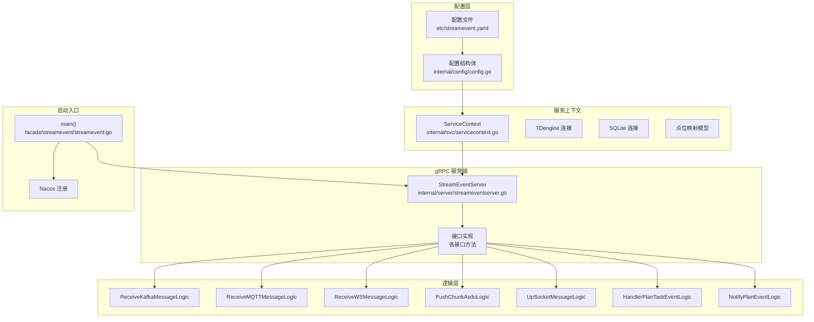
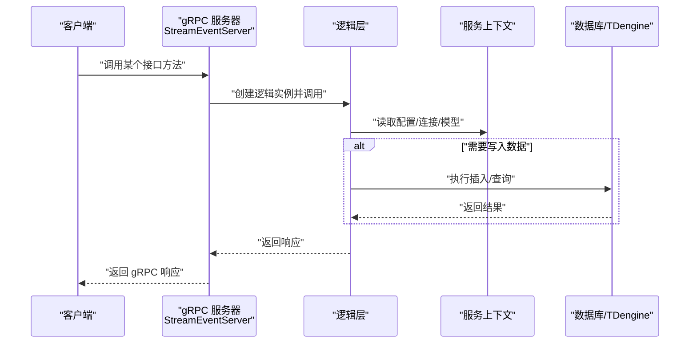
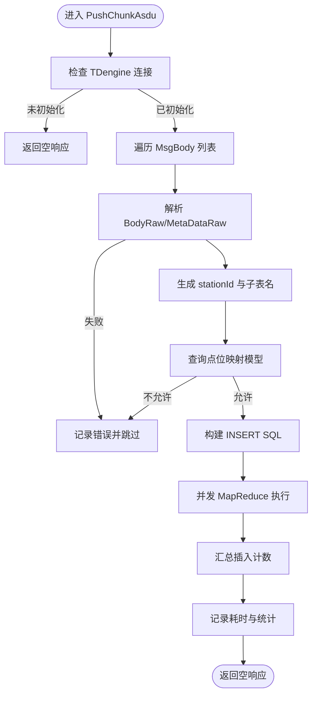
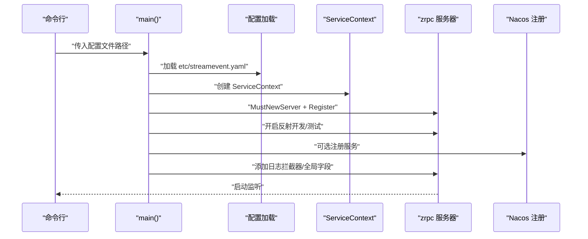
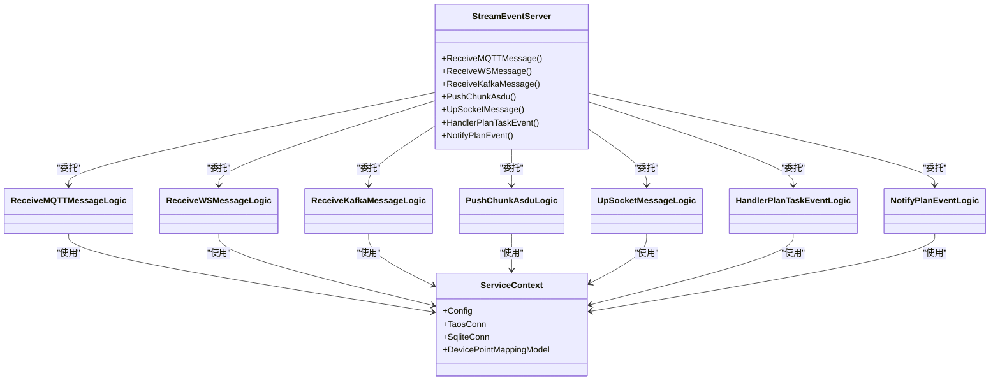

# StreamEvent 外部接口

<cite>
**本文引用的文件**
- [facade/streamevent/streamevent.proto](file://facade/streamevent/streamevent.proto)
- [facade/streamevent/streamevent.go](file://facade/streamevent/streamevent.go)
- [facade/streamevent/etc/streamevent.yaml](file://facade/streamevent/etc/streamevent.yaml)
- [facade/streamevent/internal/config/config.go](file://facade/streamevent/internal/config/config.go)
- [facade/streamevent/internal/svc/servicecontext.go](file://facade/streamevent/internal/svc/servicecontext.go)
- [facade/streamevent/internal/server/streameventserver.go](file://facade/streamevent/internal/server/streameventserver.go)
- [facade/streamevent/internal/logic/receivekafkamessagelogic.go](file://facade/streamevent/internal/logic/receivekafkamessagelogic.go)
- [facade/streamevent/internal/logic/receivemqttmessagelogic.go](file://facade/streamevent/internal/logic/receivemqttmessagelogic.go)
- [facade/streamevent/internal/logic/receivewsmessagelogic.go](file://facade/streamevent/internal/logic/receivewsmessagelogic.go)
- [facade/streamevent/internal/logic/pushchunkasdulogic.go](file://facade/streamevent/internal/logic/pushchunkasdulogic.go)
- [facade/streamevent/internal/logic/upsocketmessagelogic.go](file://facade/streamevent/internal/logic/upsocketmessagelogic.go)
- [facade/streamevent/internal/logic/handlerplantaskeventlogic.go](file://facade/streamevent/internal/logic/handlerplantaskeventlogic.go)
- [facade/streamevent/internal/logic/notifyplaneventlogic.go](file://facade/streamevent/internal/logic/notifyplaneventlogic.go)
- [common/iec104/util/util.go](file://common/iec104/util/util.go)
- [swagger/streamevent.swagger.json](file://swagger/streamevent.swagger.json)
</cite>

## 目录
1. [简介](#简介)
2. [项目结构](#项目结构)
3. [核心组件](#核心组件)
4. [架构总览](#架构总览)
5. [详细组件分析](#详细组件分析)
6. [依赖关系分析](#依赖关系分析)
7. [性能考量](#性能考量)
8. [故障排查指南](#故障排查指南)
9. [结论](#结论)
10. [附录](#附录)

## 简介
StreamEvent 是一个基于 gRPC 的外部接口服务，面向电力系统 IEC 104 协议与多源异构数据接入场景，提供统一的事件与数据汇聚能力。其核心职责包括：
- 接收并处理来自 MQTT、WebSocket、Kafka 的实时消息；
- 接收 IEC 104 协议的分片 ASDU 数据，并写入 TDengine；
- 支持上行 Socket 标准事件与自定义事件；
- 提供计划任务事件处理与通知能力，支撑调度与回调语义。

该服务采用 go-zero 框架构建，支持 Nacos 注册发现、日志与中间件拦截、配置驱动与数据库连接管理，具备良好的可扩展性与可观测性。

## 项目结构
StreamEvent 位于 facade/streamevent 目录，主要由以下层次组成：
- 配置层：应用配置、数据库与日志配置、Nacos 注册配置
- 服务上下文：数据库连接、点位映射模型等
- gRPC 服务端：对 proto 中定义的服务进行实现
- 逻辑层：各接口的具体业务逻辑（占位实现或完整实现）
- 启动入口：加载配置、初始化服务上下文、注册 gRPC 服务、可选注册到 Nacos

图表来源
- [facade/streamevent/etc/streamevent.yaml:1-28](file://facade/streamevent/etc/streamevent.yaml#L1-L28)
- [facade/streamevent/internal/config/config.go:5-24](file://facade/streamevent/internal/config/config.go#L5-L24)
- [facade/streamevent/internal/svc/servicecontext.go:14-32](file://facade/streamevent/internal/svc/servicecontext.go#L14-L32)
- [facade/streamevent/internal/server/streameventserver.go:15-67](file://facade/streamevent/internal/server/streameventserver.go#L15-L67)
- [facade/streamevent/streamevent.go:28-71](file://facade/streamevent/streamevent.go#L28-L71)

章节来源
- [facade/streamevent/etc/streamevent.yaml:1-28](file://facade/streamevent/etc/streamevent.yaml#L1-L28)
- [facade/streamevent/internal/config/config.go:5-24](file://facade/streamevent/internal/config/config.go#L5-L24)
- [facade/streamevent/internal/svc/servicecontext.go:14-32](file://facade/streamevent/internal/svc/servicecontext.go#L14-L32)
- [facade/streamevent/internal/server/streameventserver.go:15-67](file://facade/streamevent/internal/server/streameventserver.go#L15-L67)
- [facade/streamevent/streamevent.go:28-71](file://facade/streamevent/streamevent.go#L28-L71)

## 核心组件
- gRPC 服务定义：在 proto 中定义了 StreamEvent 服务及全部接口方法，涵盖 MQTT/WS/Kafka 消息接收、IEC 104 分片 ASDU 写入、Socket 上行事件、计划任务事件处理与通知。
- 服务实现：服务端将每个 RPC 方法委托给对应的逻辑层实现。
- 逻辑层：包含各接口的业务处理逻辑，部分接口为占位实现，部分接口已实现具体业务（如 PushChunkAsdu）。
- 服务上下文：封装数据库连接与模型，负责初始化与注入。
- 启动入口：加载配置、创建服务上下文、注册 gRPC 服务、可选注册到 Nacos。

章节来源
- [facade/streamevent/streamevent.proto:10-25](file://facade/streamevent/streamevent.proto#L10-L25)
- [facade/streamevent/internal/server/streameventserver.go:26-66](file://facade/streamevent/internal/server/streameventserver.go#L26-L66)
- [facade/streamevent/internal/logic/pushchunkasdulogic.go:118-222](file://facade/streamevent/internal/logic/pushchunkasdulogic.go#L118-L222)

## 架构总览
StreamEvent 的运行时架构如下：
- 客户端通过 gRPC 调用服务端接口；
- 服务端根据接口路由到对应逻辑层；
- 逻辑层访问服务上下文中的数据库连接与模型；
- 对于 IEC 104 分片 ASDU，逻辑层解析报文、生成子表名、查询点位映射并批量写入 TDengine；
- 对于计划任务事件，逻辑层返回执行结果与可选的延期配置；
- 对于 Socket 上行事件，逻辑层读取鉴权信息并构造下行响应；
- 对于 MQTT/WS/Kafka 消息，逻辑层预留处理入口（占位实现）。

图表来源
- [facade/streamevent/internal/server/streameventserver.go:26-66](file://facade/streamevent/internal/server/streameventserver.go#L26-L66)
- [facade/streamevent/internal/logic/pushchunkasdulogic.go:118-222](file://facade/streamevent/internal/logic/pushchunkasdulogic.go#L118-L222)
- [facade/streamevent/internal/svc/servicecontext.go:21-32](file://facade/streamevent/internal/svc/servicecontext.go#L21-L32)

## 详细组件分析

### gRPC 服务与消息格式
- 服务定义：包含接收 MQTT/WS/Kafka 消息、推送 IEC 104 分片 ASDU、上行 Socket 事件、计划任务事件处理与通知等方法。
- 请求/响应消息：针对每种数据源与协议，定义了相应的请求与响应消息体，包含会话标识、消息体、时间戳、元数据等字段。
- IEC 104 报文模型：包含多种 ASDU 类型的消息体结构，支持单点、双点、规一化、短浮点、累计量、保护事件等信息对象。

章节来源
- [facade/streamevent/streamevent.proto:10-25](file://facade/streamevent/streamevent.proto#L10-L25)
- [facade/streamevent/streamevent.proto:27-48](file://facade/streamevent/streamevent.proto#L27-L48)
- [facade/streamevent/streamevent.proto:51-63](file://facade/streamevent/streamevent.proto#L51-L63)
- [facade/streamevent/streamevent.proto:65-80](file://facade/streamevent/streamevent.proto#L65-L80)
- [facade/streamevent/streamevent.proto:83-114](file://facade/streamevent/streamevent.proto#L83-L114)
- [facade/streamevent/streamevent.proto:135-311](file://facade/streamevent/streamevent.proto#L135-L311)
- [facade/streamevent/streamevent.proto:336-420](file://facade/streamevent/streamevent.proto#L336-L420)
- [facade/streamevent/streamevent.proto:450-459](file://facade/streamevent/streamevent.proto#L450-L459)
- [facade/streamevent/streamevent.proto:501-538](file://facade/streamevent/streamevent.proto#L501-L538)
- [facade/streamevent/streamevent.proto:560-581](file://facade/streamevent/streamevent.proto#L560-L581)

### 接口方法与使用场景

#### 接收 MQTT 消息
- 功能：接收 MQTT 消息，支持批量聚合；消息包含会话 ID、消息 ID、主题模板、主题、载荷与发送时间。
- 使用场景：从 MQTT 主题订阅的数据流进入系统，统一汇聚与后续处理。
- 当前实现：占位实现，待补充具体业务逻辑。

章节来源
- [facade/streamevent/streamevent.proto:11-12](file://facade/streamevent/streamevent.proto#L11-L12)
- [facade/streamevent/streamevent.proto:27-48](file://facade/streamevent/streamevent.proto#L27-L48)
- [facade/streamevent/internal/logic/receivemqttmessagelogic.go:27-31](file://facade/streamevent/internal/logic/receivemqttmessagelogic.go#L27-L31)

#### 接收 WebSocket 消息
- 功能：接收 WebSocket 消息，包含会话 ID、消息 ID、载荷与发送时间。
- 使用场景：前端或客户端通过 WebSocket 发送事件或数据，服务端统一处理。
- 当前实现：占位实现，待补充具体业务逻辑。

章节来源
- [facade/streamevent/streamevent.proto:13-14](file://facade/streamevent/streamevent.proto#L13-L14)
- [facade/streamevent/streamevent.proto:51-63](file://facade/streamevent/streamevent.proto#L51-L63)
- [facade/streamevent/internal/logic/receivewsmessagelogic.go:27-31](file://facade/streamevent/internal/logic/receivewsmessagelogic.go#L27-L31)

#### 接收 Kafka 消息
- 功能：接收 Kafka 消息，支持批量聚合；消息包含会话 ID、主题、消费者组、键、值与发送时间。
- 使用场景：从 Kafka 主题消费数据，进行统一处理与转发。
- 当前实现：占位实现，待补充具体业务逻辑。

章节来源
- [facade/streamevent/streamevent.proto:15-16](file://facade/streamevent/streamevent.proto#L15-L16)
- [facade/streamevent/streamevent.proto:65-80](file://facade/streamevent/streamevent.proto#L65-L80)
- [facade/streamevent/internal/logic/receivekafkamessagelogic.go:27-31](file://facade/streamevent/internal/logic/receivekafkamessagelogic.go#L27-L31)

#### 推送分片 ASDU 数据（IEC 104）
- 功能：接收 IEC 104 分片 ASDU 数据，解析报文、生成子表名、查询点位映射并写入 TDengine。
- 关键流程：
  - 解析 MsgBody 的 BodyRaw 与 MetaDataRaw；
  - 提取 IOA 值与类型，生成 stationId 与子表名；
  - 查询本地缓存表 DevicePointMappingModel，判断是否允许原始插入；
  - 并发 MapReduce 批量写入 TDengine；
  - 记录忽略条数与插入条数，输出耗时日志。
- 性能特性：使用 MapReduce 并发执行插入，提升吞吐；对异常进行日志记录与跳过处理。

图表来源
- [facade/streamevent/internal/logic/pushchunkasdulogic.go:118-222](file://facade/streamevent/internal/logic/pushchunkasdulogic.go#L118-L222)
- [common/iec104/util/util.go:190-195](file://common/iec104/util/util.go#L190-L195)

章节来源
- [facade/streamevent/streamevent.proto:17-18](file://facade/streamevent/streamevent.proto#L17-L18)
- [facade/streamevent/streamevent.proto:83-114](file://facade/streamevent/streamevent.proto#L83-L114)
- [facade/streamevent/internal/logic/pushchunkasdulogic.go:118-222](file://facade/streamevent/internal/logic/pushchunkasdulogic.go#L118-L222)
- [common/iec104/util/util.go:190-195](file://common/iec104/util/util.go#L190-L195)

#### 上行 Socket 标准消息
- 功能：处理上行 Socket 事件，支持标准事件与自定义事件；从上下文提取鉴权信息并构造下行响应。
- 使用场景：客户端通过 Socket 发送事件，服务端返回标准化响应。
- 当前实现：读取鉴权头并返回 JSON 格式的测试响应。

章节来源
- [facade/streamevent/streamevent.proto:19-20](file://facade/streamevent/streamevent.proto#L19-L20)
- [facade/streamevent/streamevent.proto:450-459](file://facade/streamevent/streamevent.proto#L450-L459)
- [facade/streamevent/internal/logic/upsocketmessagelogic.go:29-55](file://facade/streamevent/internal/logic/upsocketmessagelogic.go#L29-L55)

#### 计划任务事件处理
- 功能：处理计划任务事件，返回执行结果与可选的延期配置；支持 completed/terminated/failed/delayed/ongoing 等状态。
- 使用场景：调度系统触发计划任务后，回调该接口汇报执行结果与下一次触发时间。
- 当前实现：返回固定状态与示例延期时间。

章节来源
- [facade/streamevent/streamevent.proto:21-22](file://facade/streamevent/streamevent.proto#L21-L22)
- [facade/streamevent/streamevent.proto:501-550](file://facade/streamevent/streamevent.proto#L501-L550)
- [facade/streamevent/internal/logic/handlerplantaskeventlogic.go:29-38](file://facade/streamevent/internal/logic/handlerplantaskeventlogic.go#L29-L38)

#### 通知计划任务事件
- 功能：通知计划任务事件，支持批次完成与计划完成两类事件类型。
- 使用场景：计划任务生命周期中关键节点的通知。
- 当前实现：占位实现，待补充具体业务逻辑。

章节来源
- [facade/streamevent/streamevent.proto:23-24](file://facade/streamevent/streamevent.proto#L23-L24)
- [facade/streamevent/streamevent.proto:560-581](file://facade/streamevent/streamevent.proto#L560-L581)
- [facade/streamevent/internal/logic/notifyplaneventlogic.go:27-31](file://facade/streamevent/internal/logic/notifyplaneventlogic.go#L27-L31)

### 服务配置与启动流程
- 配置文件：包含服务名称、监听地址、日志级别、中间件统计忽略列表、Nacos 注册配置、TDengine 数据源与数据库数据源等。
- 启动流程：
  - 解析命令行参数加载配置；
  - 初始化服务上下文（数据库连接、模型）；
  - 创建 gRPC 服务器并注册 StreamEvent 服务；
  - 开启反射（开发/测试模式）；
  - 可选注册到 Nacos；
  - 添加日志拦截器与全局字段，启动服务。

图表来源
- [facade/streamevent/streamevent.go:28-71](file://facade/streamevent/streamevent.go#L28-L71)
- [facade/streamevent/etc/streamevent.yaml:1-28](file://facade/streamevent/etc/streamevent.yaml#L1-L28)
- [facade/streamevent/internal/svc/servicecontext.go:21-32](file://facade/streamevent/internal/svc/servicecontext.go#L21-L32)

章节来源
- [facade/streamevent/etc/streamevent.yaml:1-28](file://facade/streamevent/etc/streamevent.yaml#L1-L28)
- [facade/streamevent/streamevent.go:28-71](file://facade/streamevent/streamevent.go#L28-L71)
- [facade/streamevent/internal/svc/servicecontext.go:21-32](file://facade/streamevent/internal/svc/servicecontext.go#L21-L32)

### 服务注册与发现
- Nacos 注册：当配置中 IsRegister 为真时，服务启动后向 Nacos 注册，携带 gRPC 端口与元数据。
- 适用场景：微服务集群中服务自动发现与负载均衡。

章节来源
- [facade/streamevent/streamevent.go:47-64](file://facade/streamevent/streamevent.go#L47-L64)
- [facade/streamevent/etc/streamevent.yaml:14-21](file://facade/streamevent/etc/streamevent.yaml#L14-L21)

### 日志与监控
- 日志：统一使用 go-zero logx，支持按请求注入字段（如 taosReqId），并记录耗时与统计信息。
- 中间件：统计中间件可忽略特定方法（如 PushChunkAsdu）以降低统计开销。
- Swagger：提供 OpenAPI 文档，便于接口调试与集成验证。

章节来源
- [facade/streamevent/streamevent.go:65-67](file://facade/streamevent/streamevent.go#L65-L67)
- [facade/streamevent/etc/streamevent.yaml:11-13](file://facade/streamevent/etc/streamevent.yaml#L11-L13)
- [swagger/streamevent.swagger.json](file://swagger/streamevent.swagger.json)

## 依赖关系分析
- 服务端到逻辑层：每个 RPC 方法均委托给对应逻辑层实现，解耦清晰。
- 逻辑层到服务上下文：逻辑层通过 ServiceContext 获取数据库连接与模型。
- 逻辑层到工具库：IEC 104 工具函数用于生成 stationId 与主题模板校验。
- 启动入口到服务端：main 函数负责装配与启动。

图表来源
- [facade/streamevent/internal/server/streameventserver.go:26-66](file://facade/streamevent/internal/server/streameventserver.go#L26-L66)
- [facade/streamevent/internal/logic/receivemqttmessagelogic.go:18-24](file://facade/streamevent/internal/logic/receivemqttmessagelogic.go#L18-L24)
- [facade/streamevent/internal/logic/receivewsmessagelogic.go:18-24](file://facade/streamevent/internal/logic/receivewsmessagelogic.go#L18-L24)
- [facade/streamevent/internal/logic/receivekafkamessagelogic.go:18-24](file://facade/streamevent/internal/logic/receivekafkamessagelogic.go#L18-L24)
- [facade/streamevent/internal/logic/pushchunkasdulogic.go:26-32](file://facade/streamevent/internal/logic/pushchunkasdulogic.go#L26-L32)
- [facade/streamevent/internal/logic/upsocketmessagelogic.go:20-26](file://facade/streamevent/internal/logic/upsocketmessagelogic.go#L20-L26)
- [facade/streamevent/internal/logic/handlerplantaskeventlogic.go:20-26](file://facade/streamevent/internal/logic/handlerplantaskeventlogic.go#L20-L26)
- [facade/streamevent/internal/logic/notifyplaneventlogic.go:18-24](file://facade/streamevent/internal/logic/notifyplaneventlogic.go#L18-L24)
- [facade/streamevent/internal/svc/servicecontext.go:14-19](file://facade/streamevent/internal/svc/servicecontext.go#L14-L19)

章节来源
- [facade/streamevent/internal/server/streameventserver.go:26-66](file://facade/streamevent/internal/server/streameventserver.go#L26-L66)
- [facade/streamevent/internal/svc/servicecontext.go:14-19](file://facade/streamevent/internal/svc/servicecontext.go#L14-L19)

## 性能考量
- 并发写入：PushChunkAsdu 使用 MapReduce 并发执行插入，显著提升吞吐；建议合理设置并发度与批大小。
- 异常容错：对解析失败、查询失败、插入失败进行日志记录与跳过处理，避免单点故障影响整体。
- 中间件统计：对高吞吐接口（如 PushChunkAsdu）忽略统计，降低中间件开销。
- 数据库连接：通过 ServiceContext 统一管理连接，避免重复创建；必要时启用连接池与超时控制。
- 日志字段：注入 taosReqId 与耗时统计，便于定位性能瓶颈。

章节来源
- [facade/streamevent/internal/logic/pushchunkasdulogic.go:127-212](file://facade/streamevent/internal/logic/pushchunkasdulogic.go#L127-L212)
- [facade/streamevent/etc/streamevent.yaml:11-13](file://facreamevent/etc/streamevent.yaml#L11-L13)
- [facade/streamevent/streamevent.go:65-67](file://facade/streamevent/streamevent.go#L65-L67)

## 故障排查指南
- 连接未初始化：若 TDengine 连接未初始化，PushChunkAsdu 将记录错误并返回空响应；检查配置文件中的 TaosDB DataSource 与 DBName。
- 解析失败：BodyRaw 或 MetaDataRaw 解析失败时会记录错误并跳过该条目；检查上游数据格式与编码。
- 查询失败：点位映射查询异常时会记录错误并跳过；检查 SQLite 数据源与模型初始化。
- 插入失败：MapReduce 插入失败会记录错误并计入失败计数；检查表结构、权限与网络连通性。
- 日志定位：通过 taosReqId 与耗时日志快速定位问题；确认中间件统计忽略配置是否影响观测。

章节来源
- [facade/streamevent/internal/logic/pushchunkasdulogic.go:122-125](file://facade/streamevent/internal/logic/pushchunkasdulogic.go#L122-L125)
- [facade/streamevent/internal/logic/pushchunkasdulogic.go:132-136](file://facade/streamevent/internal/logic/pushchunkasdulogic.go#L132-L136)
- [facade/streamevent/internal/logic/pushchunkasdulogic.go:162-165](file://facade/streamevent/internal/logic/pushchunkasdulogic.go#L162-L165)
- [facade/streamevent/internal/logic/pushchunkasdulogic.go:196-202](file://facade/streamevent/internal/logic/pushchunkasdulogic.go#L196-L202)
- [facade/streamevent/etc/streamevent.yaml:11-13](file://facade/streamevent/etc/streamevent.yaml#L11-L13)

## 结论
StreamEvent 通过清晰的分层架构与完善的配置体系，提供了面向 IEC 104 与多源数据的统一接入能力。其核心优势在于：
- 易扩展：新增接口只需在 proto 定义、服务端路由与逻辑层实现三处扩展；
- 高性能：并发写入与中间件优化适配高吞吐场景；
- 可观测：统一日志与耗时统计，结合 Swagger 文档便于调试；
- 可运维：Nacos 注册、配置驱动与数据库连接管理，降低运维复杂度。

建议在生产环境中完善占位实现、加强异常处理与告警、持续优化并发与批大小，并结合监控平台进行端到端观测。

## 附录
- 接口调用示例（参考路径）
  - 推送分片 ASDU：[facade/streamevent/internal/logic/pushchunkasdulogic.go:118-222](file://facade/streamevent/internal/logic/pushchunkasdulogic.go#L118-L222)
  - 上行 Socket 事件：[facade/streamevent/internal/logic/upsocketmessagelogic.go:29-55](file://facade/streamevent/internal/logic/upsocketmessagelogic.go#L29-L55)
  - 计划任务事件处理：[facade/streamevent/internal/logic/handlerplantaskeventlogic.go:29-38](file://facade/streamevent/internal/logic/handlerplantaskeventlogic.go#L29-L38)
- 错误处理策略
  - 解析失败：记录错误并跳过该条目，不影响后续处理；
  - 查询失败：记录错误并跳过，确保整体稳定性；
  - 插入失败：记录错误并计入失败计数，便于后续重试或告警。
- 性能优化建议
  - 合理设置 MapReduce 并发度与批大小；
  - 对高频接口忽略统计中间件，降低开销；
  - 在上游数据质量与格式上做前置校验，减少下游解析成本。