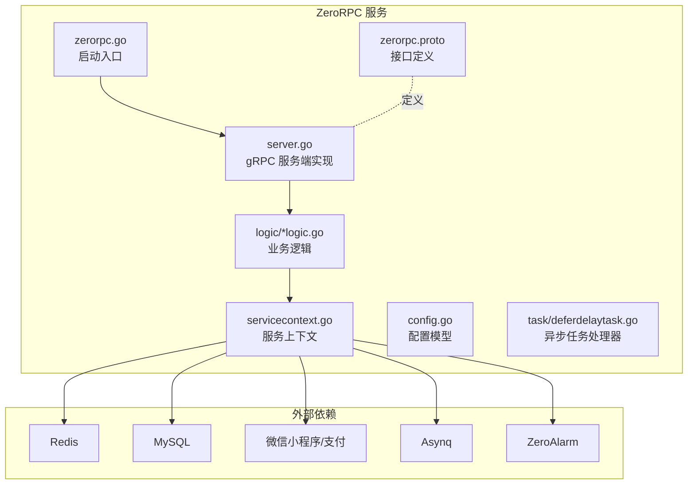
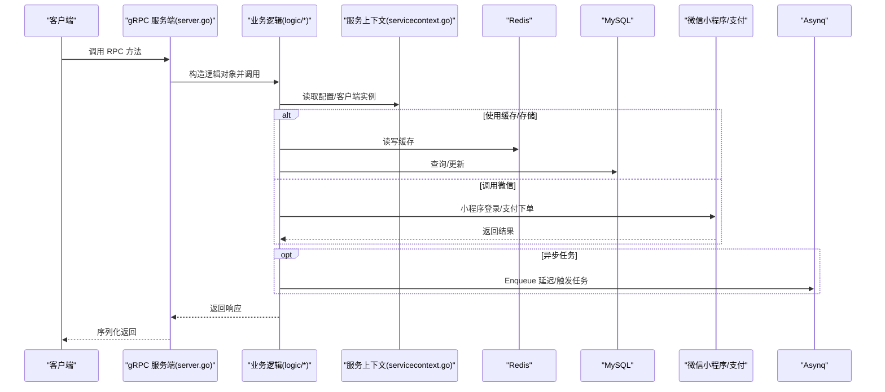
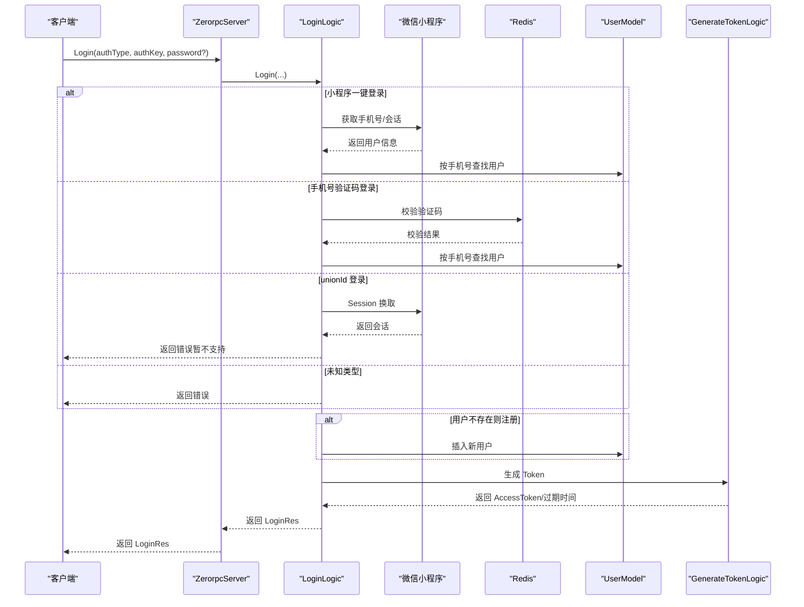
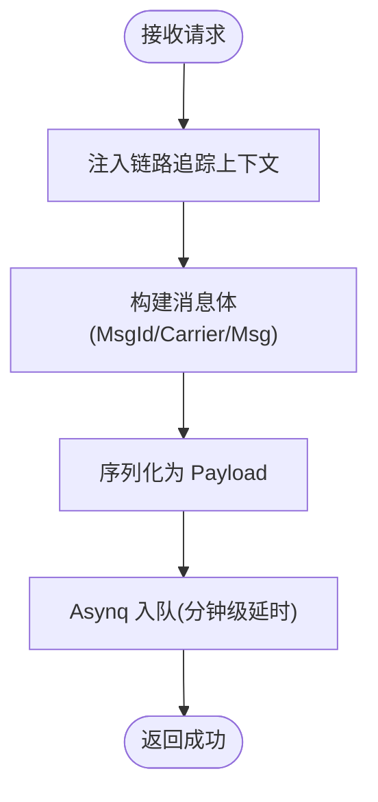
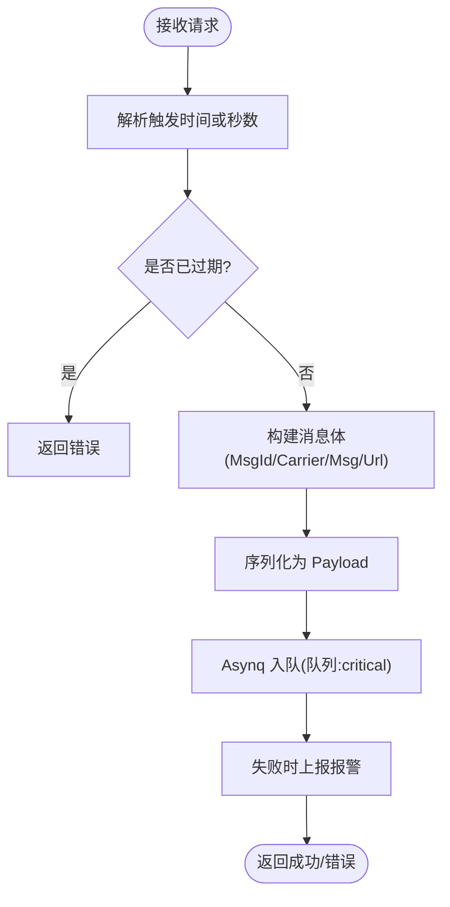
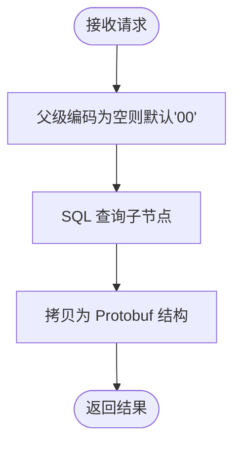
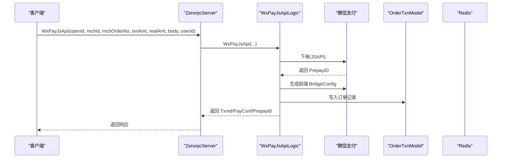
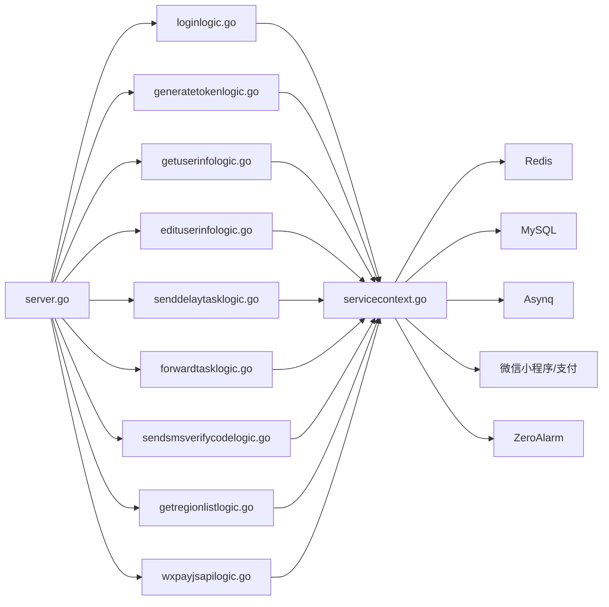

# ZeroRPC 统一接口

<cite>
**本文引用的文件**
- [zerorpc.proto](file://zerorpc/zerorpc.proto)
- [zerorpc.go](file://zerorpc/zerorpc.go)
- [zerorpc.yaml](file://zerorpc/etc/zerorpc.yaml)
- [server.go](file://zerorpc/internal/server/zerorpcserver.go)
- [config.go](file://zerorpc/internal/config/config.go)
- [servicecontext.go](file://zerorpc/internal/svc/servicecontext.go)
- [loginlogic.go](file://zerorpc/internal/logic/loginlogic.go)
- [generatetokenlogic.go](file://zerorpc/internal/logic/generatetokenlogic.go)
- [getuserinfologic.go](file://zerorpc/internal/logic/getuserinfologic.go)
- [edituserinfologic.go](file://zerorpc/internal/logic/edituserinfologic.go)
- [senddelaytasklogic.go](file://zerorpc/internal/logic/senddelaytasklogic.go)
- [forwardtasklogic.go](file://zerorpc/internal/logic/forwardtasklogic.go)
- [sendsmsverifycodelogic.go](file://zerorpc/internal/logic/sendsmsverifycodelogic.go)
- [getregionlistlogic.go](file://zerorpc/internal/logic/getregionlistlogic.go)
- [wxpayjsapilogic.go](file://zerorpc/internal/logic/wxpayjsapilogic.go)
- [loggerInterceptor.go](file://common/Interceptor/rpcserver/loggerInterceptor.go)
- [deferdelaytask.go](file://zerorpc/internal/task/deferdelaytask.go)
</cite>

## 目录
1. [简介](#简介)
2. [项目结构](#项目结构)
3. [核心组件](#核心组件)
4. [架构总览](#架构总览)
5. [详细组件分析](#详细组件分析)
6. [依赖分析](#依赖分析)
7. [性能考虑](#性能考虑)
8. [故障排查指南](#故障排查指南)
9. [结论](#结论)
10. [附录](#附录)

## 简介
本文件面向 ZeroRPC 统一接口服务，系统性阐述其作为统一接口层的设计目标与实现架构，覆盖服务聚合、协议转换与业务逻辑封装。该服务以 gRPC 为传输协议，通过内部逻辑层编排 Redis、数据库、微信生态（小程序、支付）与异步任务队列（Asynq），提供如下能力：
- 用户管理：登录、用户信息查询与编辑
- 区域管理：按父级编码查询区域列表
- 任务调度：延迟任务与定时/延时触发任务
- 短信验证：下发手机验证码
- 微信支付：JSAPI 支付下单与预支付配置

同时，文档给出服务配置、中间件与安全控制机制说明，并提供接口调用示例、参数与返回值规范、服务发现与负载均衡建议、故障处理策略及性能监控与日志记录方案。

## 项目结构
- 协议与入口
  - 协议定义：zerorpc.proto
  - 启动入口：zerorpc.go
  - 配置文件：zerorpc.yaml
- 服务端实现
  - gRPC 服务端：zerorpc/internal/server/zerorpcserver.go
  - 服务上下文：zerorpc/internal/svc/servicecontext.go
  - 配置模型：zerorpc/internal/config/config.go
- 业务逻辑
  - 用户、区域、短信、任务、支付等逻辑位于 zerorpc/internal/logic/*logic.go
- 异步任务
  - 任务处理器：zerorpc/internal/task/deferdelaytask.go
- 中间件
  - gRPC 日志拦截器：common/Interceptor/rpcserver/loggerInterceptor.go

图表来源
- [zerorpc.go:26-58](file://zerorpc/zerorpc.go#L26-L58)
- [server.go:15-90](file://zerorpc/internal/server/zerorpcserver.go#L15-L90)
- [servicecontext.go:19-101](file://zerorpc/internal/svc/servicecontext.go#L19-L101)

章节来源
- [zerorpc.go:26-58](file://zerorpc/zerorpc.go#L26-L58)
- [zerorpc.yaml:1-39](file://zerorpc/etc/zerorpc.yaml#L1-L39)

## 核心组件
- 接口定义（zerorpc.proto）
  - 提供 Ping、SendDelayTask、ForwardTask、SendSMSVerifyCode、GetRegionList、GenerateToken、Login、MiniProgramLogin、GetUserInfo、EditUserInfo、WxPayJsApi 等 RPC 方法
- gRPC 服务端（server.go）
  - 将每个 RPC 映射到对应 logic 层，构造并调用逻辑对象
- 服务上下文（servicecontext.go）
  - 负责初始化 Redis、MySQL、Asynq、微信小程序与支付客户端、报警客户端等
- 业务逻辑（internal/logic/*.go）
  - 负责具体业务处理，如登录鉴权、用户信息维护、区域查询、短信下发、任务入队、支付下单
- 异步任务（task/deferdelaytask.go）
  - 消费延迟/触发任务，支持链路追踪传播
- 中间件（loggerInterceptor.go）
  - 在 gRPC 请求进入时注入上下文字段，异常时记录错误日志

章节来源
- [zerorpc.proto:140-166](file://zerorpc/zerorpc.proto#L140-L166)
- [server.go:26-89](file://zerorpc/internal/server/zerorpcserver.go#L26-L89)
- [servicecontext.go:35-101](file://zerorpc/internal/svc/servicecontext.go#L35-L101)
- [loggerInterceptor.go:12-44](file://common/Interceptor/rpcserver/loggerInterceptor.go#L12-L44)

## 架构总览
ZeroRPC 采用“gRPC 入口 + 逻辑编排 + 外部系统对接”的分层架构。请求经 gRPC 到达服务端，由逻辑层根据业务进行鉴权、校验、调用缓存/数据库/第三方服务，并通过 Asynq 异步执行耗时或延时任务。中间件负责日志与上下文注入，配置中心提供运行期参数。

图表来源
- [server.go:26-89](file://zerorpc/internal/server/zerorpcserver.go#L26-L89)
- [servicecontext.go:35-101](file://zerorpc/internal/svc/servicecontext.go#L35-L101)
- [loginlogic.go:30-109](file://zerorpc/internal/logic/loginlogic.go#L30-L109)
- [senddelaytasklogic.go:33-52](file://zerorpc/internal/logic/senddelaytasklogic.go#L33-L52)
- [forwardtasklogic.go:40-89](file://zerorpc/internal/logic/forwardtasklogic.go#L40-L89)
- [wxpayjsapilogic.go:37-99](file://zerorpc/internal/logic/wxpayjsapilogic.go#L37-L99)

## 详细组件分析

### 接口与功能分类
- 健康检查
  - 方法：Ping
  - 输入：Req.ping
  - 输出：Res.pong
  - 用途：服务健康探测
- 用户管理
  - 登录：Login（支持小程序一键登录、手机号验证码登录、unionId 登录）
  - 令牌生成：GenerateToken（基于 JWT）
  - 用户详情：GetUserInfo
  - 编辑用户：EditUserInfo
- 区域管理
  - 区域列表：GetRegionList（按父级编码查询）
- 任务调度
  - 延迟任务：SendDelayTask（分钟级延时）
  - 转发任务：ForwardTask（秒级延时或指定触发时间）
- 短信验证
  - 发送验证码：SendSMSVerifyCode（开发/测试环境固定验证码）
- 微信支付
  - JSAPI 支付：WxPayJsApi（统一下单并返回前端调起参数）

章节来源
- [zerorpc.proto:6-166](file://zerorpc/zerorpc.proto#L6-L166)
- [server.go:26-89](file://zerorpc/internal/server/zerorpcserver.go#L26-L89)

### 登录流程（Login）

图表来源
- [loginlogic.go:30-109](file://zerorpc/internal/logic/loginlogic.go#L30-L109)
- [generatetokenlogic.go:30-42](file://zerorpc/internal/logic/generatetokenlogic.go#L30-L42)

章节来源
- [loginlogic.go:30-109](file://zerorpc/internal/logic/loginlogic.go#L30-L109)
- [generatetokenlogic.go:30-42](file://zerorpc/internal/logic/generatetokenlogic.go#L30-L42)

### 延迟任务（SendDelayTask）

图表来源
- [senddelaytasklogic.go:33-52](file://zerorpc/internal/logic/senddelaytasklogic.go#L33-L52)
- [deferdelaytask.go:23-36](file://zerorpc/internal/task/deferdelaytask.go#L23-L36)

章节来源
- [senddelaytasklogic.go:33-52](file://zerorpc/internal/logic/senddelaytasklogic.go#L33-L52)
- [deferdelaytask.go:23-36](file://zerorpc/internal/task/deferdelaytask.go#L23-L36)

### 转发任务（ForwardTask）

图表来源
- [forwardtasklogic.go:40-89](file://zerorpc/internal/logic/forwardtasklogic.go#L40-L89)

章节来源
- [forwardtasklogic.go:40-89](file://zerorpc/internal/logic/forwardtasklogic.go#L40-L89)

### 区域列表（GetRegionList）

图表来源
- [getregionlistlogic.go:28-43](file://zerorpc/internal/logic/getregionlistlogic.go#L28-L43)

章节来源
- [getregionlistlogic.go:28-43](file://zerorpc/internal/logic/getregionlistlogic.go#L28-L43)

### 微信 JSAPI 支付（WxPayJsApi）

图表来源
- [wxpayjsapilogic.go:37-99](file://zerorpc/internal/logic/wxpayjsapilogic.go#L37-L99)

章节来源
- [wxpayjsapilogic.go:37-99](file://zerorpc/internal/logic/wxpayjsapilogic.go#L37-L99)

### 用户管理（GetUserInfo/EditUserInfo）
- GetUserInfo：按用户 ID 查询用户信息并返回
- EditUserInfo：按传入字段更新用户信息

章节来源
- [getuserinfologic.go:27-41](file://zerorpc/internal/logic/getuserinfologic.go#L27-L41)
- [edituserinfologic.go:28-48](file://zerorpc/internal/logic/edituserinfologic.go#L28-L48)

### 短信验证（SendSMSVerifyCode）
- 生成 6 位数字验证码
- 开发/测试环境固定验证码
- 以“服务名:手机号:smsCode”为键，设置 TTL 与 NX

章节来源
- [sendsmsverifycodelogic.go:29-42](file://zerorpc/internal/logic/sendsmsverifycodelogic.go#L29-L42)

## 依赖分析
- 组件耦合
  - server.go 仅负责方法分发，低耦合
  - logic 层依赖 servicecontext 提供的外部客户端与模型
  - servicecontext 聚合 Redis、MySQL、Asynq、微信、报警等
- 外部依赖
  - Redis：缓存与验证码
  - MySQL：用户、区域、订单等持久化
  - Asynq：异步任务队列
  - 微信：小程序登录、支付下单
  - ZeroAlarm：异常告警上报
- 中间件
  - gRPC 日志拦截器从元数据注入用户/部门/授权/TraceId 等上下文键

图表来源
- [server.go:26-89](file://zerorpc/internal/server/zerorpcserver.go#L26-L89)
- [servicecontext.go:35-101](file://zerorpc/internal/svc/servicecontext.go#L35-L101)

章节来源
- [server.go:26-89](file://zerorpc/internal/server/zerorpcserver.go#L26-L89)
- [servicecontext.go:35-101](file://zerorpc/internal/svc/servicecontext.go#L35-L101)

## 性能考虑
- 异步化
  - 延迟任务与转发任务通过 Asynq 异步执行，避免阻塞主流程
- 缓存命中
  - 登录验证码使用 Redis 快速校验，降低数据库压力
- 数据库访问
  - 区域查询使用条件过滤，建议在 parent_code 上建立索引
- 链路追踪
  - 任务入队与消费均注入/提取上下文，便于定位性能瓶颈
- 并发与资源
  - Asynq Server/Client 与 Scheduler 的并发度需结合任务量与资源评估

## 故障排查指南
- 登录失败
  - 小程序一键登录：检查微信返回码与手机号获取结果
  - 手机号验证码：确认 Redis 键是否存在且未过期
- 任务下发失败
  - ForwardTask：检查触发时间合法性与队列配置；失败时会通过 ZeroAlarm 上报
- 支付失败
  - 检查微信下单返回码与 PrepayID 是否存在；核对证书与回调地址
- 日志与上下文
  - gRPC 拦截器会在错误时输出错误日志；可通过 TraceId 关联链路

章节来源
- [loginlogic.go:30-109](file://zerorpc/internal/logic/loginlogic.go#L30-L109)
- [forwardtasklogic.go:72-87](file://zerorpc/internal/logic/forwardtasklogic.go#L72-L87)
- [wxpayjsapilogic.go:53-64](file://zerorpc/internal/logic/wxpayjsapilogic.go#L53-L64)
- [loggerInterceptor.go:40-42](file://common/Interceptor/rpcserver/loggerInterceptor.go#L40-L42)

## 结论
ZeroRPC 统一接口通过清晰的分层设计与中间件集成，实现了对多源系统的统一接入与编排。其以 gRPC 为入口，结合 Redis、MySQL、Asynq 与微信生态，覆盖用户、区域、任务、短信与支付等核心业务。建议在生产环境中完善服务发现与负载均衡、增强可观测性与告警联动，并持续优化异步任务的并发与重试策略。

## 附录

### 接口调用示例与参数说明
- Ping
  - 请求：Req.ping
  - 响应：Res.pong
- SendDelayTask
  - 请求：msgId, type, body, processIn(分钟)
  - 响应：空
- ForwardTask
  - 请求：msgId, body, processIn(秒) 或 triggerTime(字符串)，url
  - 响应：空
- SendSMSVerifyCode
  - 请求：mobile
  - 响应：code(开发/测试环境固定)
- GetRegionList
  - 请求：parentCode(可空，默认'00')
  - 响应：repeated Region
- GenerateToken
  - 请求：userId
  - 响应：accessToken, accessExpire, refreshAfter
- Login
  - 请求：authType(miniProgram/mobile/unionId), authKey, password(部分场景)
  - 响应：accessToken, accessExpire, refreshAfter
- MiniProgramLogin
  - 请求：code
  - 响应：openId, unionId, sessionKey
- GetUserInfo
  - 请求：id
  - 响应：User
- EditUserInfo
  - 请求：id, mobile, nickname, sex, avatar
  - 响应：空
- WxPayJsApi
  - 请求：openId, mchId, mchOrderNo, txnAmt, realAmt, body, userId
  - 响应：txnId, payConf, prepayId

章节来源
- [zerorpc.proto:6-166](file://zerorpc/zerorpc.proto#L6-L166)

### 配置项说明
- 通用
  - Name、ListenOn、Timeout、Mode、Log
- 缓存与数据库
  - Redis、Cache、DB.DataSource
- 告警
  - ZeroAlarmConf.Endpoints、NonBlock、Timeout
- 安全
  - JwtAuth.AccessSecret、JwtAuth.AccessExpire
- 小程序
  - MiniProgram.AppId、MiniProgram.Secret

章节来源
- [zerorpc.yaml:1-39](file://zerorpc/etc/zerorpc.yaml#L1-L39)
- [config.go:8-24](file://zerorpc/internal/config/config.go#L8-L24)

### 中间件与安全控制
- gRPC 日志拦截器
  - 从元数据注入用户ID、用户名、部门编码、授权信息、TraceId
  - 发生错误时统一记录错误日志
- JWT 令牌
  - GenerateToken 基于 HS256 签发，包含 exp、iat 与用户ID
- 微信小程序/支付
  - 初始化时配置 AppID、Secret、证书与回调地址

章节来源
- [loggerInterceptor.go:12-44](file://common/Interceptor/rpcserver/loggerInterceptor.go#L12-L44)
- [generatetokenlogic.go:30-52](file://zerorpc/internal/logic/generatetokenlogic.go#L30-L52)
- [servicecontext.go:38-86](file://zerorpc/internal/svc/servicecontext.go#L38-L86)

### 服务发现、负载均衡与故障处理
- 服务发现与负载均衡
  - 当前配置未启用 etcd；可参考 go-zero 的服务注册与发现机制扩展
- 故障处理
  - ForwardTask 失败时通过 ZeroAlarm 上报；建议补充重试与死信队列策略

章节来源
- [zerorpc.yaml:4-8](file://zerorpc/etc/zerorpc.yaml#L4-L8)
- [forwardtasklogic.go:72-87](file://zerorpc/internal/logic/forwardtasklogic.go#L72-L87)

### 性能监控与日志记录
- 日志
  - gRPC 拦截器统一记录错误；全局日志附加 app 字段
- 链路追踪
  - 任务入队/出队注入/提取上下文，便于端到端追踪
- 建议
  - 引入指标采集（如 Prometheus）与分布式追踪（如 Jaeger/OpenTelemetry）以完善可观测性

章节来源
- [zerorpc.go:54-57](file://zerorpc/zerorpc.go#L54-L57)
- [senddelaytasklogic.go:34-37](file://zerorpc/internal/logic/senddelaytasklogic.go#L34-L37)
- [forwardtasklogic.go:42-45](file://zerorpc/internal/logic/forwardtasklogic.go#L42-L45)