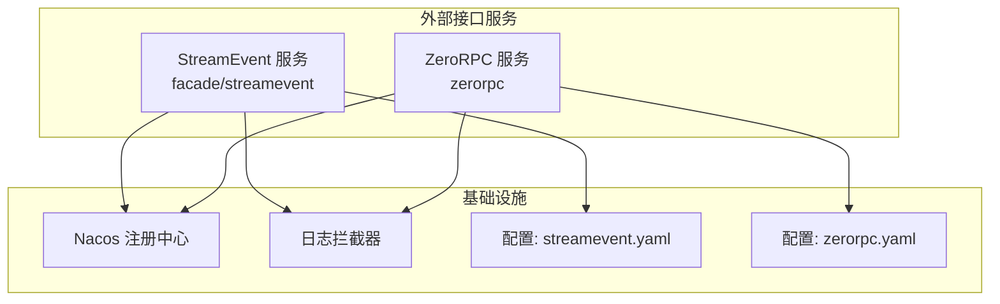
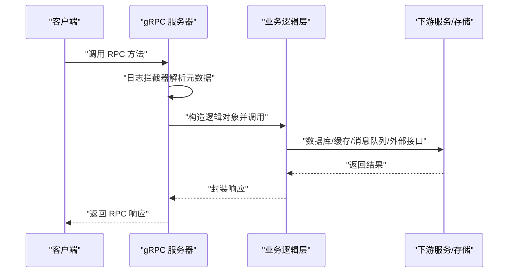
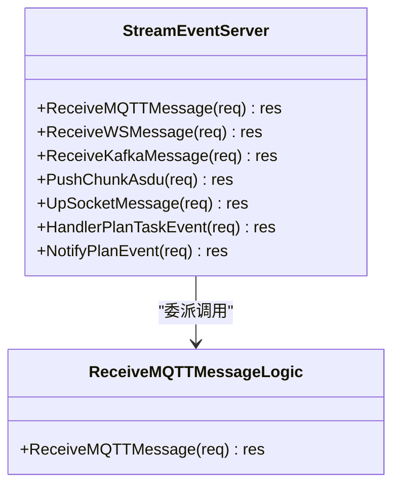
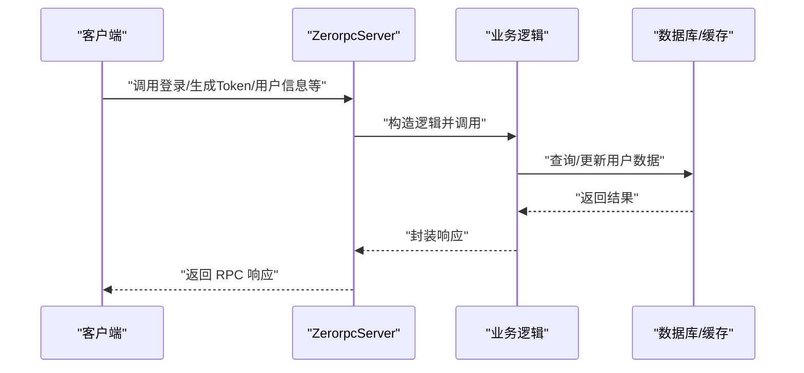
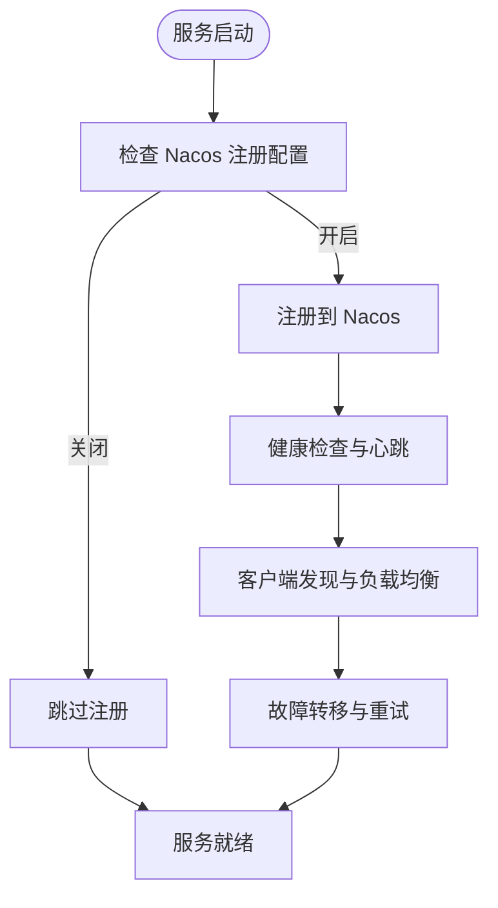
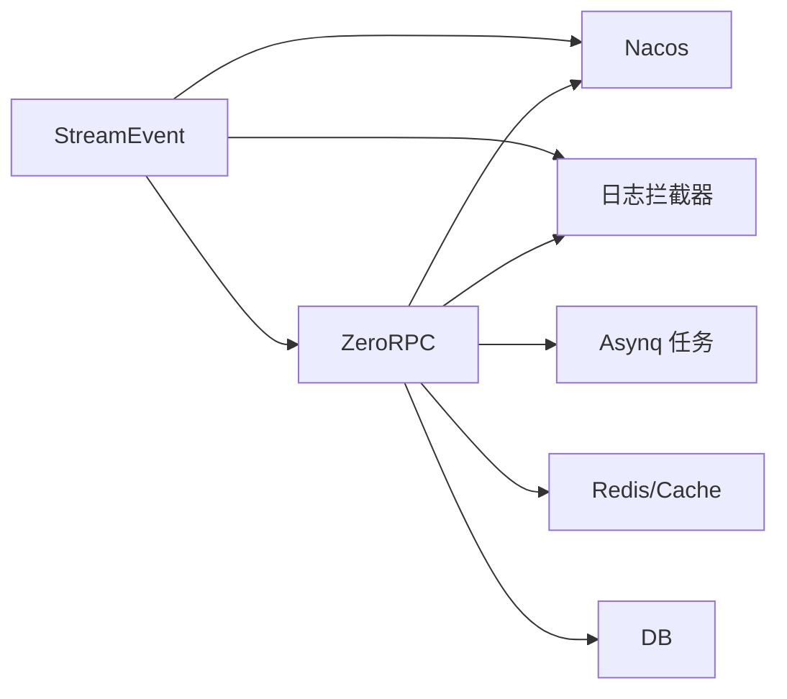

# 外部接口服务

<cite>
**本文引用的文件**   
- [facade/streamevent/streamevent.proto](file://facade/streamevent/streamevent.proto)
- [facade/streamevent/streamevent.go](file://facade/streamevent/streamevent.go)
- [facade/streamevent/etc/streamevent.yaml](file://facade/streamevent/etc/streamevent.yaml)
- [facade/streamevent/internal/server/streameventserver.go](file://facade/streamevent/internal/server/streameventserver.go)
- [facade/streamevent/internal/logic/receivemqttmessagelogic.go](file://facade/streamevent/internal/logic/receivemqttmessagelogic.go)
- [zerorpc/zerorpc.proto](file://zerorpc/zerorpc.proto)
- [zerorpc/zerorpc.go](file://zerorpc/zerorpc.go)
- [zerorpc/etc/zerorpc.yaml](file://zerorpc/etc/zerorpc.yaml)
- [zerorpc/internal/server/zerorpcserver.go](file://zerorpc/internal/server/zerorpcserver.go)
- [common/nacosx/register.go](file://common/nacosx/register.go)
- [common/Interceptor/rpcserver/loggerInterceptor.go](file://common/Interceptor/rpcserver/loggerInterceptor.go)
- [swagger/streamevent.swagger.json](file://swagger/streamevent.swagger.json)
- [swagger/zerorpc.swagger.json](file://swagger/zerorpc.swagger.json)
</cite>

## 目录
1. [简介](#简介)
2. [项目结构](#项目结构)
3. [核心组件](#核心组件)
4. [架构总览](#架构总览)
5. [详细组件分析](#详细组件分析)
6. [依赖分析](#依赖分析)
7. [性能考量](#性能考量)
8. [故障排查指南](#故障排查指南)
9. [结论](#结论)
10. [附录](#附录)

## 简介
本文件面向外部接口服务，系统性阐述 StreamEvent 外部接口与 ZeroRPC 统一接口的设计理念、协议定义、消息格式与数据流转；说明服务聚合、协议转换与安全控制；给出接口版本管理策略与跨服务通信机制；并提供接口文档、SDK 使用指南与集成示例，以及性能优化、安全与最佳实践建议。

## 项目结构
外部接口服务由两个主要子系统构成：
- StreamEvent 外部接口：统一接收 MQTT/WS/Kafka/IEC104 上行数据，提供计划任务事件处理与通知能力。
- ZeroRPC 统一接口：提供登录、用户、区域、支付、任务转发与延迟任务等通用 RPC 能力。

二者均基于 go-zero 的 zrpc 构建，采用 gRPC 协议，支持 Nacos 服务注册与拦截器日志增强。

图表来源
- [facade/streamevent/streamevent.go:39-64](file://facade/streamevent/streamevent.go#L39-L64)
- [zerorpc/zerorpc.go:37-53](file://zerorpc/zerorpc.go#L37-L53)
- [common/nacosx/register.go:21-76](file://common/nacosx/register.go#L21-L76)
- [common/Interceptor/rpcserver/loggerInterceptor.go:12-44](file://common/Interceptor/rpcserver/loggerInterceptor.go#L12-L44)

章节来源
- [facade/streamevent/etc/streamevent.yaml:1-28](file://facade/streamevent/etc/streamevent.yaml#L1-L28)
- [zerorpc/etc/zerorpc.yaml:1-39](file://zerorpc/etc/zerorpc.yaml#L1-L39)

## 核心组件
- StreamEvent 服务
  - gRPC 服务：接收 MQTT/WS/Kafka 消息、推送 IEC104 Chunk、上行 Socket 事件、处理计划任务事件、通知计划事件。
  - 协议定义：见 [facade/streamevent/streamevent.proto](file://facade/streamevent/streamevent.proto)。
  - 服务入口：见 [facade/streamevent/streamevent.go:28-71](file://facade/streamevent/streamevent.go#L28-L71)。
  - 服务器实现：见 [facade/streamevent/internal/server/streameventserver.go:26-66](file://facade/streamevent/internal/server/streameventserver.go#L26-L66)。
  - 示例逻辑桩：见 [facade/streamevent/internal/logic/receivemqttmessagelogic.go:27-31](file://facade/streamevent/internal/logic/receivemqttmessagelogic.go#L27-L31)。
  - 配置：见 [facade/streamevent/etc/streamevent.yaml:1-28](file://facade/streamevent/etc/streamevent.yaml#L1-L28)。

- ZeroRPC 服务
  - gRPC 服务：Ping、延迟任务、转发任务、短信验证码、区域列表、Token 生成、登录、小程序登录、用户信息、编辑用户、微信 JSAPI 支付。
  - 协议定义：见 [zerorpc/zerorpc.proto](file://zerorpc/zerorpc.proto)。
  - 服务入口：见 [zerorpc/zerorpc.go:26-58](file://zerorpc/zerorpc.go#L26-L58)。
  - 服务器实现：见 [zerorpc/internal/server/zerorpcserver.go:26-89](file://zerorpc/internal/server/zerorpcserver.go#L26-L89)。
  - 配置：见 [zerorpc/etc/zerorpc.yaml:1-39](file://zerorpc/etc/zerorpc.yaml#L1-L39)。

章节来源
- [facade/streamevent/streamevent.proto:10-25](file://facade/streamevent/streamevent.proto#L10-L25)
- [zerorpc/zerorpc.proto:140-166](file://zerorpc/zerorpc.proto#L140-L166)

## 架构总览
外部接口服务采用“服务聚合 + 协议转换 + 安全控制”的统一架构：
- 服务聚合：StreamEvent 聚合多源输入（MQTT/WS/Kafka/IEC104），ZeroRPC 提供通用业务能力。
- 协议转换：内部统一使用 gRPC；对外通过 Swagger 文档暴露 REST 映射（参考 swagger/*）。
- 安全控制：通过拦截器注入上下文头（用户、部门、授权、TraceId），结合 JWT 配置与日志记录。

图表来源
- [common/Interceptor/rpcserver/loggerInterceptor.go:12-44](file://common/Interceptor/rpcserver/loggerInterceptor.go#L12-L44)
- [facade/streamevent/internal/server/streameventserver.go:26-66](file://facade/streamevent/internal/server/streameventserver.go#L26-L66)
- [zerorpc/internal/server/zerorpcserver.go:26-89](file://zerorpc/internal/server/zerorpcserver.go#L26-L89)

## 详细组件分析

### StreamEvent 外部接口
- 协议与消息模型
  - 服务方法：接收 MQTT/WS/Kafka 消息、推送 IEC104 Chunk、上行 Socket 事件、处理/通知计划任务事件。
  - 关键消息类型：MqttMessage、KafkaMessage、MsgBody、PointMapping、UpSocketMessageReq/Res、HandlerPlanTaskEventReq/Res、NotifyPlanEventReq/Res 等。
  - IEC104 类型族：SinglePointInfo、DoublePointInfo、MeasuredValueScaledInfo、MeasuredValueNormalInfo、StepPositionInfo、BitString32Info、MeasuredValueFloatInfo、BinaryCounterReadingInfo、EventOfProtectionEquipmentInfo、PackedStartEventsOfProtectionEquipmentInfo、PackedOutputCircuitInfo、PackedSinglePointWithSCDInfo 等。
- 数据流
  - 输入：MQTT/WS/Kafka/IEC104 上行数据经 gRPC 接口进入。
  - 处理：根据消息类型路由到相应逻辑层，进行解析、转换、落库或转发。
  - 输出：返回空响应或结构化结果（如计划任务事件回调结果）。
- 服务注册与拦截器
  - 启动时注册 gRPC 服务，开发/测试模式下启用反射。
  - 注册日志拦截器，从 gRPC 元数据注入用户/部门/授权/TraceId 到上下文。
  - 可选注册到 Nacos（根据配置）。
- 配置要点
  - 日志级别、统计忽略方法、Nacos 注册开关、TaosDB/SQLite 数据源等。

图表来源
- [facade/streamevent/internal/server/streameventserver.go:26-66](file://facade/streamevent/internal/server/streameventserver.go#L26-L66)
- [facade/streamevent/internal/logic/receivemqttmessagelogic.go:27-31](file://facade/streamevent/internal/logic/receivemqttmessagelogic.go#L27-L31)

章节来源
- [facade/streamevent/streamevent.proto:10-581](file://facade/streamevent/streamevent.proto#L10-L581)
- [facade/streamevent/etc/streamevent.yaml:1-28](file://facade/streamevent/etc/streamevent.yaml#L1-L28)
- [facade/streamevent/streamevent.go:39-66](file://facade/streamevent/streamevent.go#L39-L66)
- [facade/streamevent/internal/server/streameventserver.go:26-66](file://facade/streamevent/internal/server/streameventserver.go#L26-L66)
- [common/Interceptor/rpcserver/loggerInterceptor.go:12-44](file://common/Interceptor/rpcserver/loggerInterceptor.go#L12-L44)
- [common/nacosx/register.go:21-76](file://common/nacosx/register.go#L21-L76)

### ZeroRPC 统一接口
- 协议与消息模型
  - 服务方法：Ping、延迟任务、转发任务、短信验证码、区域列表、Token 生成、登录、小程序登录、用户信息、编辑用户、微信 JSAPI 支付。
  - 关键消息类型：Req/Res、SendDelayTaskReq/Res、ForwardTaskReq/Res、SendSMSVerifyCodeReq/Res、GetRegionListReq/Res、GenerateTokenReq/Res、LoginReq/Res、MiniProgramLoginReq/Res、GetUserInfoReq/Res、EditUserInfoReq/Res、WxPayJsApiReq/Res 等。
- 任务调度
  - 内嵌 Asynq 任务服务器与调度器，支持定时任务与延迟任务。
- 安全与配置
  - JWT 密钥与过期时间配置。
  - Redis/Cache/DB 连接配置。
  - 零告警上报端点配置。

图表来源
- [zerorpc/internal/server/zerorpcserver.go:26-89](file://zerorpc/internal/server/zerorpcserver.go#L26-L89)
- [zerorpc/etc/zerorpc.yaml:33-38](file://zerorpc/etc/zerorpc.yaml#L33-L38)

章节来源
- [zerorpc/zerorpc.proto:140-166](file://zerorpc/zerorpc.proto#L140-L166)
- [zerorpc/etc/zerorpc.yaml:1-39](file://zerorpc/etc/zerorpc.yaml#L1-L39)
- [zerorpc/zerorpc.go:37-53](file://zerorpc/zerorpc.go#L37-L53)
- [zerorpc/internal/server/zerorpcserver.go:26-89](file://zerorpc/internal/server/zerorpcserver.go#L26-L89)

### 接口版本管理策略
- 向后兼容
  - proto 文件中使用字段编号与可选字段，避免删除已用字段；新增字段保持默认值兼容。
  - gRPC 默认支持“向后兼容”，客户端可调用新服务，服务端可忽略未知字段。
- 升级路径
  - 新增服务方法时，保持旧方法不变；在配置中增加统计忽略项，避免对新方法产生干扰。
  - 对于破坏性变更，建议引入新服务名或新版本命名空间，并在网关层做路由映射。
- 废弃处理
  - 通过注释标记废弃字段/方法；在网关层返回明确的废弃提示，逐步引导迁移。
- 版本号与发布
  - 建议在服务启动时打印版本信息，便于客户端识别与适配。

章节来源
- [facade/streamevent/etc/streamevent.yaml:11-13](file://facade/streamevent/etc/streamevent.yaml#L11-L13)
- [zerorpc/etc/zerorpc.yaml:33-38](file://zerorpc/etc/zerorpc.yaml#L33-L38)

### 跨服务通信机制
- 服务发现与注册
  - StreamEvent/ZeroRPC 在启动时可选择注册到 Nacos，注册参数包含服务名、权重、健康状态、元数据等。
- 负载均衡与故障转移
  - 通过 Nacos 客户端实现服务实例发现与健康检查；gRPC 客户端侧默认支持轮询与重试策略（可结合配置扩展）。
- 链路追踪与可观测性
  - 通过拦截器注入 TraceId；可扩展 Jaeger/Zipkin 等链路追踪（配置项预留）。

图表来源
- [common/nacosx/register.go:21-76](file://common/nacosx/register.go#L21-L76)
- [facade/streamevent/streamevent.go:47-64](file://facade/streamevent/streamevent.go#L47-L64)
- [zerorpc/zerorpc.go:44-53](file://zerorpc/zerorpc.go#L44-L53)

## 依赖分析
- StreamEvent
  - 依赖：go-zero zrpc、grpc 反射、Nacos SDK、日志拦截器。
  - 与 ZeroRPC 无直接耦合，但共享通用基础设施（日志、拦截器、配置）。
- ZeroRPC
  - 依赖：go-zero zrpc、Asynq 任务框架、Redis/Cache、DB、JWT 配置。
  - 内嵌任务服务器与调度器，形成“RPC + 任务”一体化服务。

图表来源
- [facade/streamevent/streamevent.go:39-66](file://facade/streamevent/streamevent.go#L39-L66)
- [zerorpc/zerorpc.go:37-53](file://zerorpc/zerorpc.go#L37-L53)
- [common/nacosx/register.go:21-76](file://common/nacosx/register.go#L21-L76)
- [common/Interceptor/rpcserver/loggerInterceptor.go:12-44](file://common/Interceptor/rpcserver/loggerInterceptor.go#L12-L44)

章节来源
- [facade/streamevent/etc/streamevent.yaml:14-27](file://facade/streamevent/etc/streamevent.yaml#L14-L27)
- [zerorpc/etc/zerorpc.yaml:13-22](file://zerorpc/etc/zerorpc.yaml#L13-L22)

## 性能考量
- 日志与统计
  - 配置日志编码与级别，生产环境建议使用 JSON 并降低级别。
  - 对高吞吐接口（如 PushChunkAsdu）可在配置中设置忽略统计，减少统计开销。
- 连接与超时
  - 合理设置 Timeout，避免长尾请求阻塞。
  - 对数据库/缓存连接池参数进行压测与调优。
- 序列化与压缩
  - gRPC 默认使用 Protocol Buffers，具备高效序列化优势；对大包场景可考虑分片与聚合策略（参考协议中的聚合字段设计）。
- 缓存与降级
  - 对热点查询使用 Cache；对下游不可用时实现快速失败与熔断。

## 故障排查指南
- 常见问题定位
  - 检查拦截器日志是否正确注入用户/部门/授权/TraceId。
  - 查看服务启动日志，确认 gRPC 服务是否成功注册与反射启用。
  - 若启用 Nacos，确认注册参数与网络连通性。
- 错误处理
  - 拦截器在错误发生时记录错误日志，便于快速定位。
  - 对下游异常进行包装与降级，避免将内部错误直接透传。

章节来源
- [common/Interceptor/rpcserver/loggerInterceptor.go:12-44](file://common/Interceptor/rpcserver/loggerInterceptor.go#L12-L44)
- [facade/streamevent/streamevent.go:65-70](file://facade/streamevent/streamevent.go#L65-L70)
- [zerorpc/zerorpc.go:56-57](file://zerorpc/zerorpc.go#L56-L57)

## 结论
外部接口服务通过 StreamEvent 与 ZeroRPC 形成统一的外部接入面，具备良好的协议抽象、服务聚合与安全控制能力。配合 Nacos 与拦截器，可实现可观测、可治理的服务运行。建议在生产环境中完善链路追踪、限流熔断与灰度发布策略，持续优化性能与稳定性。

## 附录

### 接口文档与 Swagger
- StreamEvent 接口文档
  - 请参考：[swagger/streamevent.swagger.json](file://swagger/streamevent.swagger.json)
- ZeroRPC 接口文档
  - 请参考：[swagger/zerorpc.swagger.json](file://swagger/zerorpc.swagger.json)

### SDK 使用指南与集成示例
- 生成客户端 SDK
  - 使用 protoc 与对应语言的 gRPC 插件，基于上述 proto 文件生成客户端代码。
- 集成步骤
  - 初始化 gRPC 客户端，设置超时与拦截器。
  - 通过服务名与 Nacos 进行服务发现与负载均衡。
  - 在请求头中携带必要的认证与追踪信息（如用户ID、授权令牌、TraceId）。

章节来源
- [facade/streamevent/streamevent.proto:10-25](file://facade/streamevent/streamevent.proto#L10-L25)
- [zerorpc/zerorpc.proto:140-166](file://zerorpc/zerorpc.proto#L140-L166)