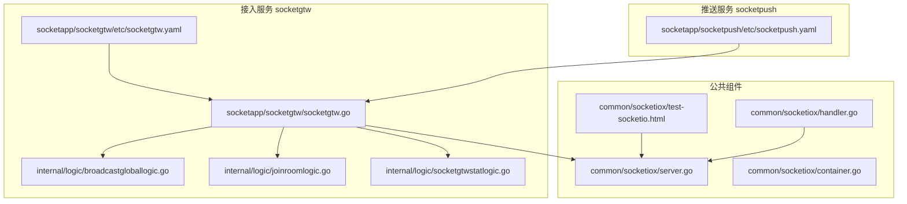
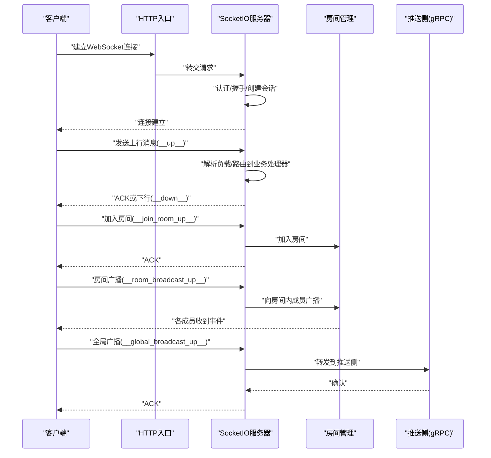
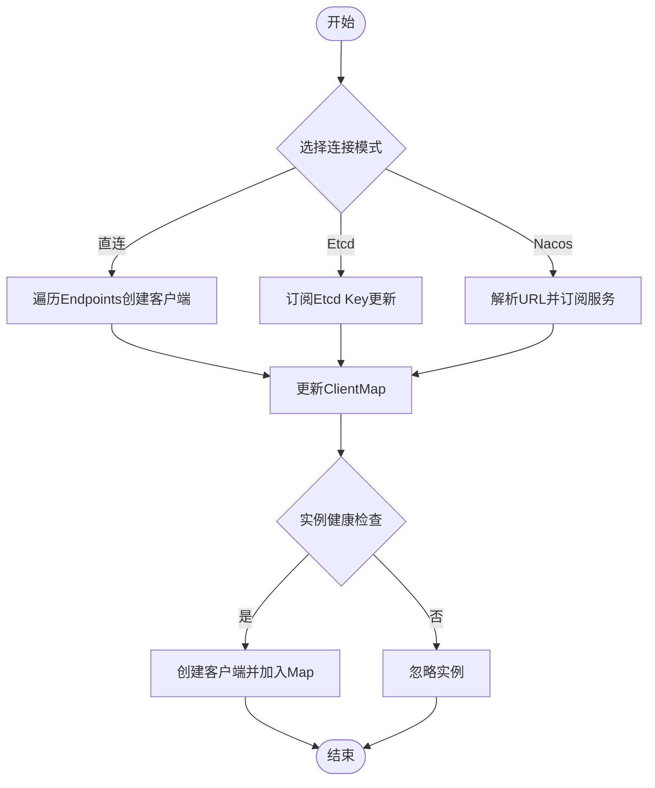
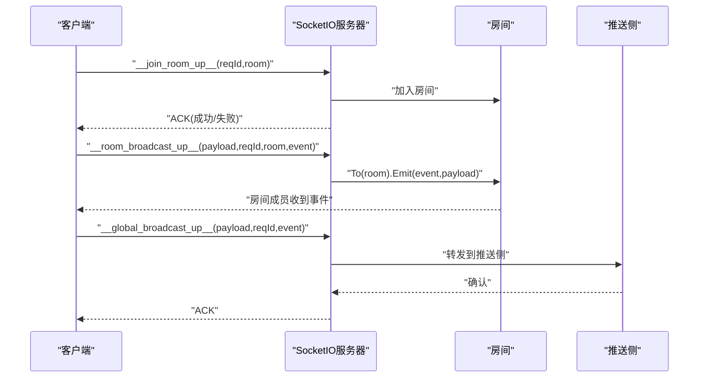
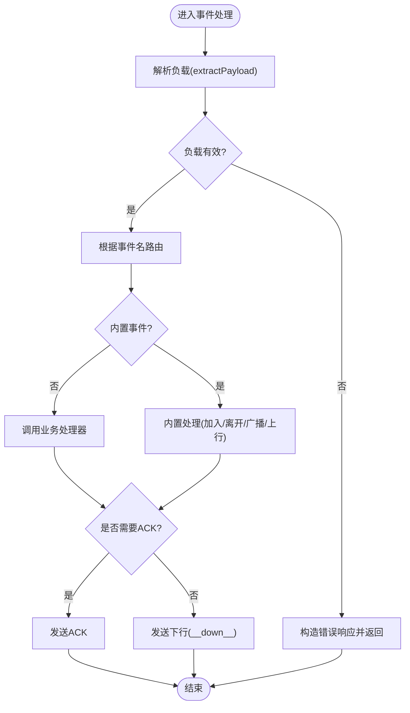
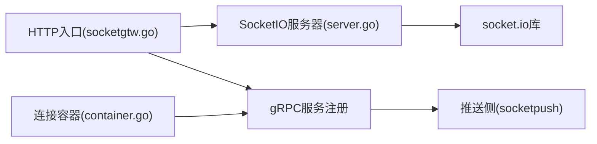

# SocketIO 核心实现

<cite>
**本文档引用的文件**
- [server.go](file://common/socketiox/server.go)
- [handler.go](file://common/socketiox/handler.go)
- [container.go](file://common/socketiox/container.go)
- [test-socketio.html](file://common/socketiox/test-socketio.html)
- [socketgtw.go](file://socketapp/socketgtw/socketgtw.go)
- [broadcastgloballogic.go](file://socketapp/socketgtw/internal/logic/broadcastgloballogic.go)
- [joinroomlogic.go](file://socketapp/socketgtw/internal/logic/joinroomlogic.go)
- [socketgtwstatlogic.go](file://socketapp/socketgtw/internal/logic/socketgtwstatlogic.go)
- [socketgtw.yaml](file://socketapp/socketgtw/etc/socketgtw.yaml)
- [socketpush.yaml](file://socketapp/socketpush/etc/socketpush.yaml)
</cite>

## 目录
1. [简介](#简介)
2. [项目结构](#项目结构)
3. [核心组件](#核心组件)
4. [架构总览](#架构总览)
5. [详细组件分析](#详细组件分析)
6. [依赖关系分析](#依赖关系分析)
7. [性能考虑](#性能考虑)
8. [故障排查指南](#故障排查指南)
9. [结论](#结论)
10. [附录](#附录)

## 简介
本文件面向 SocketIO 核心实现，系统性梳理了连接容器管理、消息处理器与事件循环机制；深入讲解连接生命周期（建立、心跳、超时、优雅关闭）、消息处理流程（帧解析、消息路由、回调执行）、房间管理（房间容器、成员管理、广播策略）；并提供基于测试页面的 API 使用示例、性能优化建议、内存与并发控制策略以及测试与调试方法。

## 项目结构
该仓库采用多模块架构，SocketIO 核心能力位于 common/socketiox，配套在 socketapp/socketgtw 提供 HTTP+gRPC 的接入层与业务逻辑，socketapp/socketpush 提供 RPC 推送侧配置与调用方参考。



**图表来源**
- [server.go:1-814](file://common/socketiox/server.go#L1-L814)
- [handler.go:1-41](file://common/socketiox/handler.go#L1-L41)
- [container.go:1-426](file://common/socketiox/container.go#L1-L426)
- [test-socketio.html:1-1430](file://common/socketiox/test-socketio.html#L1-L1430)
- [socketgtw.go:1-91](file://socketapp/socketgtw/socketgtw.go#L1-L91)
- [broadcastgloballogic.go:1-47](file://socketapp/socketgtw/internal/logic/broadcastgloballogic.go#L1-L47)
- [joinroomlogic.go:1-38](file://socketapp/socketgtw/internal/logic/joinroomlogic.go#L1-L38)
- [socketgtwstatlogic.go:1-33](file://socketapp/socketgtw/internal/logic/socketgtwstatlogic.go#L1-L33)
- [socketgtw.yaml:1-37](file://socketapp/socketgtw/etc/socketgtw.yaml#L1-L37)
- [socketpush.yaml:1-28](file://socketapp/socketpush/etc/socketpush.yaml#L1-L28)

**章节来源**
- [server.go:1-814](file://common/socketiox/server.go#L1-L814)
- [handler.go:1-41](file://common/socketiox/handler.go#L1-L41)
- [container.go:1-426](file://common/socketiox/container.go#L1-L426)
- [test-socketio.html:1-1430](file://common/socketiox/test-socketio.html#L1-L1430)
- [socketgtw.go:1-91](file://socketapp/socketgtw/socketgtw.go#L1-L91)
- [broadcastgloballogic.go:1-47](file://socketapp/socketgtw/internal/logic/broadcastgloballogic.go#L1-L47)
- [joinroomlogic.go:1-38](file://socketapp/socketgtw/internal/logic/joinroomlogic.go#L1-L38)
- [socketgtwstatlogic.go:1-33](file://socketapp/socketgtw/internal/logic/socketgtwstatlogic.go#L1-L33)
- [socketgtw.yaml:1-37](file://socketapp/socketgtw/etc/socketgtw.yaml#L1-L37)
- [socketpush.yaml:1-28](file://socketapp/socketpush/etc/socketpush.yaml#L1-L28)

## 核心组件
- 服务器与会话管理：封装 socket.io 事件绑定、认证、连接生命周期、房间管理、广播、统计推送与会话查询。
- HTTP 处理器：将 HTTP 请求转交给 SocketIO 服务器处理。
- 连接容器：支持直连、Etcd 订阅、Nacos 订阅三种模式，动态维护 gRPC 客户端集合。
- 测试页面：提供连接、事件监听、房间管理、广播等交互式测试工具。

**章节来源**
- [server.go:299-335](file://common/socketiox/server.go#L299-L335)
- [handler.go:19-41](file://common/socketiox/handler.go#L19-L41)
- [container.go:35-61](file://common/socketiox/container.go#L35-L61)

## 架构总览
SocketIO 核心通过 HTTP 入口接入，内部以事件驱动方式处理连接、消息与房间广播；同时提供 gRPC 通道用于跨服务广播与房间管理；测试页面用于本地联调验证。



**图表来源**
- [server.go:337-676](file://common/socketiox/server.go#L337-L676)
- [broadcastgloballogic.go:28-46](file://socketapp/socketgtw/internal/logic/broadcastgloballogic.go#L28-L46)
- [socketgtw.go:40-61](file://socketapp/socketgtw/socketgtw.go#L40-L61)

## 详细组件分析

### 服务器与会话管理
- 事件绑定与生命周期
  - 认证：支持 Token 校验与带声明的校验，可将声明映射到会话元数据。
  - 连接建立：记录会话、触发连接钩子、按需加入房间。
  - 断开连接：触发断开钩子、清理无效会话。
- 事件处理
  - 上行消息：解析 __up__ 事件，路由到业务处理器，支持 ACK 回调。
  - 房间管理：__join_room_up__ 与 __leave_room_up__ 事件。
  - 广播：__room_broadcast_up__ 与 __global_broadcast_up__ 事件。
  - 自定义事件：注册后由业务处理器统一处理。
- 会话与房间
  - Session 封装 socket 对象、元数据、房间加入/离开。
  - Server 维护会话表、统计推送、按条件查询会话。
- 统计与心跳
  - 定时推送统计事件 __stat_down__，包含房间列表、每秒消息数、元数据等。

```mermaid
classDiagram
class Server {
-Io : "*socketio.Io"
-eventHandlers : "EventHandlers"
-sessions : "map[string]*Session"
-lock : "RWMutex"
-statInterval : "time.Duration"
-stopChan : "chan struct{}"
-contextKeys : "[]string"
-tokenValidator : "TokenValidator"
-tokenValidatorWithClaims : "TokenValidatorWithClaims"
-connectHook : "ConnectHook"
-disconnectHook : "DisconnectHook"
-preJoinRoomHook : "PreJoinRoomHook"
+bindEvents()
+BroadcastRoom(room,event,payload,reqId) error
+BroadcastGlobal(event,payload,reqId) error
+statLoop()
+cleanInvalidSession(sId)
+SessionCount() int
+GetSession(sId) *Session
+GetSessionByKey(key,value) ([]*Session,bool)
+JoinRoom(sId,room)
+LeaveRoom(sId,room)
}
class Session {
-id : "string"
-socket : "*socketio.Socket"
-lock : "Mutex"
-metadata : "map[string]string"
-roomLoadError : "string"
+Close() error
+ID() string
+GetMetadata(key) interface{}
+AllMetadata() map[string]string
+SetMetadata(key,val)
+EmitAny(event,payload) error
+EmitString(event,msg) error
+EmitDown(event,payload,reqId) error
+EmitEventDown(data) error
+ReplyEventDown(code,msg,payload,reqId) error
+JoinRoom(room) error
+LeaveRoom(room) error
}
class EventHandler {
<<interface>>
+Handle(ctx,event,payload) (string,error)
}
Server --> Session : "管理"
Server --> EventHandler : "路由事件"
```

**图表来源**
- [server.go:119-312](file://common/socketiox/server.go#L119-L312)

**章节来源**
- [server.go:337-676](file://common/socketiox/server.go#L337-L676)
- [server.go:702-747](file://common/socketiox/server.go#L702-L747)
- [server.go:749-800](file://common/socketiox/server.go#L749-L800)

### HTTP 处理器
- NewSocketioHandler/SocketioHandler 将 HTTP 请求转交给 Server 的 HttpHandler，实现标准的 HTTP 到 SocketIO 的桥接。

**章节来源**
- [handler.go:19-41](file://common/socketiox/handler.go#L19-L41)

### 连接容器管理
- 支持三种连接模式：
  - 直连：直接指定 endpoints。
  - Etcd：订阅 key，动态增删客户端。
  - Nacos：解析 nacos://URL，订阅服务实例，周期拉取健康实例列表。
- 关键点：
  - 通过 zrpc.WithDialOption 设置 gRPC 最大消息大小。
  - 仅选择健康且启用的实例，忽略不满足条件的实例。
  - 使用随机打散策略，避免热点。



**图表来源**
- [container.go:83-130](file://common/socketiox/container.go#L83-L130)
- [container.go:132-154](file://common/socketiox/container.go#L132-L154)
- [container.go:156-242](file://common/socketiox/container.go#L156-L242)
- [container.go:267-316](file://common/socketiox/container.go#L267-L316)
- [container.go:318-346](file://common/socketiox/container.go#L318-L346)

**章节来源**
- [container.go:35-61](file://common/socketiox/container.go#L35-L61)
- [container.go:83-130](file://common/socketiox/container.go#L83-L130)
- [container.go:132-154](file://common/socketiox/container.go#L132-L154)
- [container.go:156-242](file://common/socketiox/container.go#L156-L242)
- [container.go:267-316](file://common/socketiox/container.go#L267-L316)
- [container.go:318-346](file://common/socketiox/container.go#L318-L346)

### 房间管理系统
- 房间容器：由底层 socket.io 维护，Server 通过 Session 包装进行加入/离开。
- 成员管理：Session 内部加锁，避免并发问题。
- 广播策略：
  - 房间广播：Server 调用底层 To(room).Emit。
  - 全局广播：Server 调用底层 Emit。
- 业务侧：socketgtw 提供 JoinRoom 与 BroadcastGlobal 的 gRPC 逻辑，便于跨服务调用。



**图表来源**
- [server.go:392-468](file://common/socketiox/server.go#L392-L468)
- [server.go:532-575](file://common/socketiox/server.go#L532-L575)
- [server.go:576-619](file://common/socketiox/server.go#L576-L619)
- [server.go:678-700](file://common/socketiox/server.go#L678-L700)
- [broadcastgloballogic.go:28-46](file://socketapp/socketgtw/internal/logic/broadcastgloballogic.go#L28-L46)
- [joinroomlogic.go:25-37](file://socketapp/socketgtw/internal/logic/joinroomlogic.go#L25-L37)

**章节来源**
- [server.go:204-232](file://common/socketiox/server.go#L204-L232)
- [server.go:678-700](file://common/socketiox/server.go#L678-L700)
- [broadcastgloballogic.go:28-46](file://socketapp/socketgtw/internal/logic/broadcastgloballogic.go#L28-L46)
- [joinroomlogic.go:25-37](file://socketapp/socketgtw/internal/logic/joinroomlogic.go#L25-L37)

### 消息处理流程
- 帧解析：extractPayload 支持 string 与非 string 数据的序列化。
- 消息路由：根据事件名分发到业务处理器或内置事件。
- 回调执行：优先使用 ACK 回调，否则通过下行事件 __down__ 返回。



**图表来源**
- [server.go:95-117](file://common/socketiox/server.go#L95-L117)
- [server.go:469-531](file://common/socketiox/server.go#L469-L531)
- [server.go:532-619](file://common/socketiox/server.go#L532-L619)

**章节来源**
- [server.go:95-117](file://common/socketiox/server.go#L95-L117)
- [server.go:469-531](file://common/socketiox/server.go#L469-L531)
- [server.go:532-619](file://common/socketiox/server.go#L532-L619)

### API 使用示例（基于测试页面）
- 连接配置：设置服务器 URL 与 Authorization Token，点击“连接”。
- 发送上行消息：填写 payload 与事件名，点击“发送上行消息”，查看 __down__ 下行响应。
- 房间管理：输入房间名，点击“加入房间/离开房间”，查看 ACK。
- 房间广播：输入房间名与事件名，点击“房间广播”，查看房间内成员收到的事件。
- 全局广播：输入事件名，点击“全局广播”，查看 ACK。
- 事件监听：页面自动监听系统事件，也可动态添加自定义事件监听。

**章节来源**
- [test-socketio.html:836-936](file://common/socketiox/test-socketio.html#L836-L936)
- [test-socketio.html:1168-1427](file://common/socketiox/test-socketio.html#L1168-L1427)

## 依赖关系分析
- 服务器依赖 socket.io 库进行事件绑定与房间管理。
- HTTP 层依赖 go-zero 的 rest 与 chain 中间件链。
- gRPC 层通过 zrpc 创建服务端与客户端，支持拦截器与反射。
- 连接容器依赖 etcd 与 nacos SDK 进行服务发现与订阅。



**图表来源**
- [socketgtw.go:40-61](file://socketapp/socketgtw/socketgtw.go#L40-L61)
- [server.go:1-18](file://common/socketiox/server.go#L1-L18)
- [container.go:1-28](file://common/socketiox/container.go#L1-L28)

**章节来源**
- [socketgtw.go:1-91](file://socketapp/socketgtw/socketgtw.go#L1-L91)
- [server.go:1-18](file://common/socketiox/server.go#L1-L18)
- [container.go:1-28](file://common/socketiox/container.go#L1-L28)

## 性能考虑
- 并发与锁
  - 会话表与元数据访问使用 RWMutex 保护，避免竞态。
  - 事件处理使用安全 goroutine 包裹，防止 panic 导致进程异常。
- 消息大小
  - gRPC 客户端默认设置最大消息大小，避免超大消息导致内存压力。
- 统计与心跳
  - 定时推送统计事件，便于监控连接数、房间数、每秒消息数。
- 房间广播
  - 使用底层 To(room).Emit，避免逐个会话发送，降低开销。
- 服务发现
  - Nacos/ETCD 订阅采用周期拉取与增量更新，减少频繁重建连接。

**章节来源**
- [server.go:302-312](file://common/socketiox/server.go#L302-L312)
- [server.go:702-740](file://common/socketiox/server.go#L702-L740)
- [container.go:113-118](file://common/socketiox/container.go#L113-L118)
- [container.go:303-308](file://common/socketiox/container.go#L303-L308)

## 故障排查指南
- 连接失败
  - 检查认证 Token 是否正确，必要时使用带声明的校验函数。
  - 查看连接钩子与断开钩子日志，定位会话建立/清理问题。
- 房间加入/离开异常
  - 确认房间名非空，检查预加入房间钩子返回值。
  - 使用会话查询接口按元数据筛选定位目标会话。
- 广播失败
  - 校验事件名合法性（不可为 __down__），检查 payload 格式。
  - 全局广播需确保推送侧可达，关注 gRPC 调用结果。
- 性能问题
  - 关注统计事件中的每秒消息数与房间数，排查热点房间。
  - 检查 gRPC 最大消息配置与网络延迟。

**章节来源**
- [server.go:337-349](file://common/socketiox/server.go#L337-L349)
- [server.go:392-468](file://common/socketiox/server.go#L392-L468)
- [server.go:532-619](file://common/socketiox/server.go#L532-L619)
- [server.go:749-782](file://common/socketiox/server.go#L749-L782)

## 结论
该实现以事件驱动为核心，结合 go-zero 的 HTTP/gRPC 能力与 socket.io 的房间/广播特性，提供了稳定、可观测、可扩展的 SocketIO 网关能力。通过连接容器与服务发现机制，实现了高可用与弹性扩容；通过统计与钩子机制，提供了完善的可观测性与可运维性。配合测试页面，可快速完成端到端联调与验证。

## 附录

### 配置要点
- socketgtw.yaml
  - HTTP 端口与 gRPC 端口、日志路径、Nacos 注册开关、Socket 元数据键列表、StreamEventConf 的 gRPC 地址。
- socketpush.yaml
  - 推送侧 JWT 配置、服务名与 gRPC 地址。

**章节来源**
- [socketgtw.yaml:1-37](file://socketapp/socketgtw/etc/socketgtw.yaml#L1-L37)
- [socketpush.yaml:1-28](file://socketapp/socketpush/etc/socketpush.yaml#L1-L28)