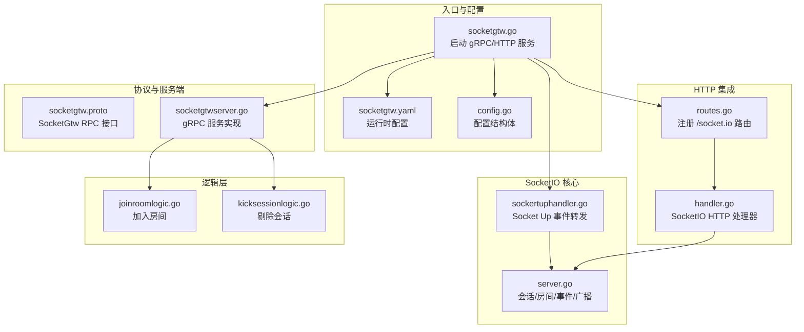
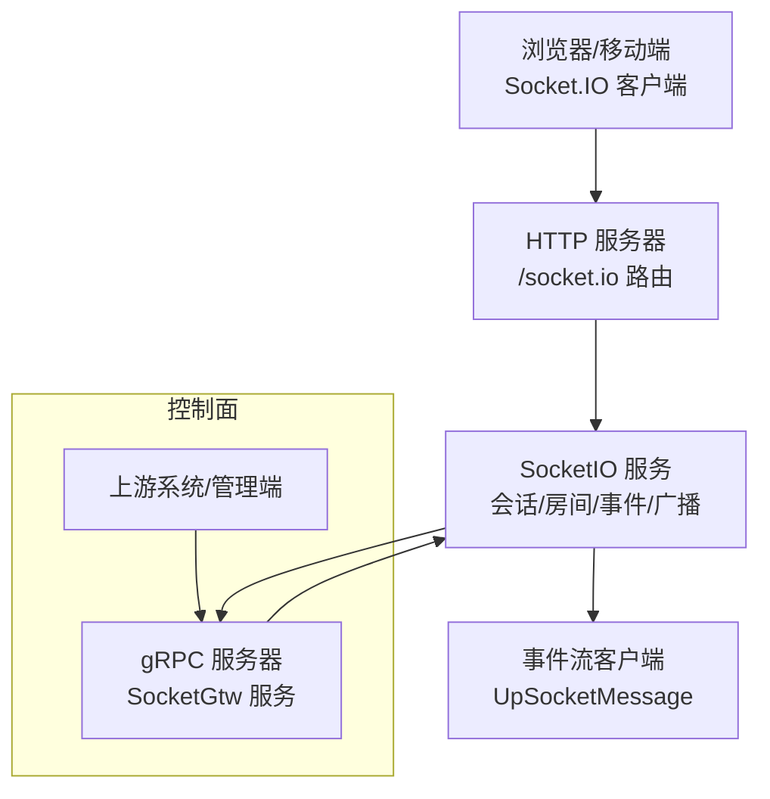
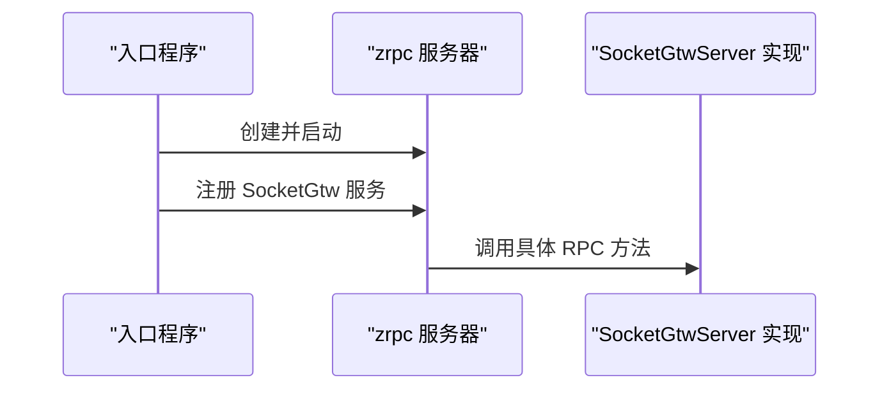
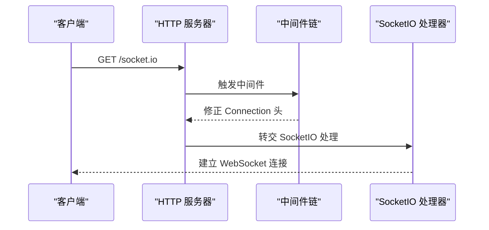
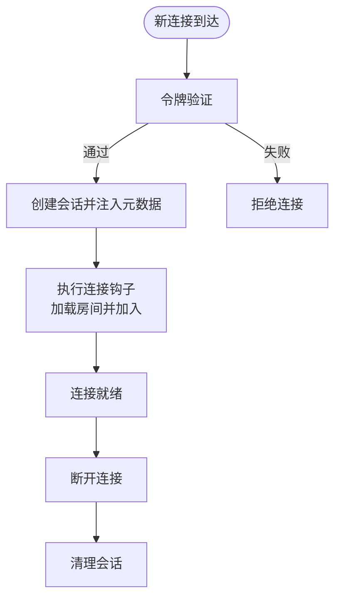
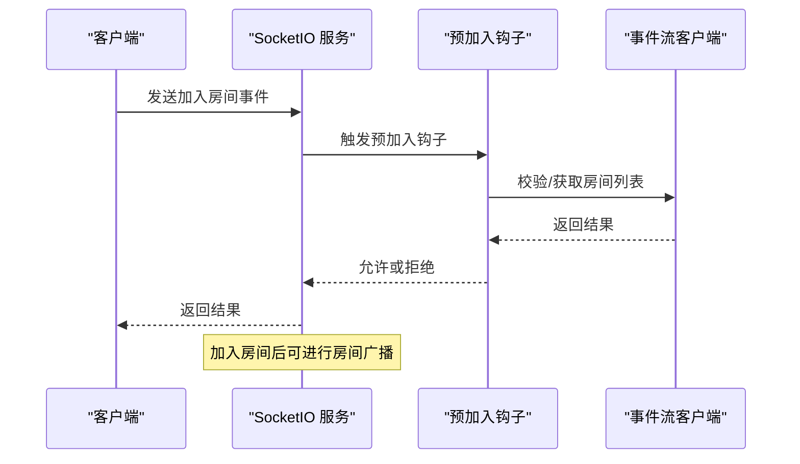
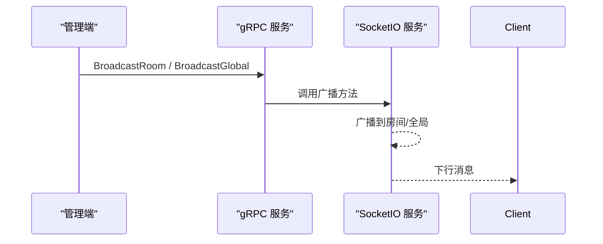
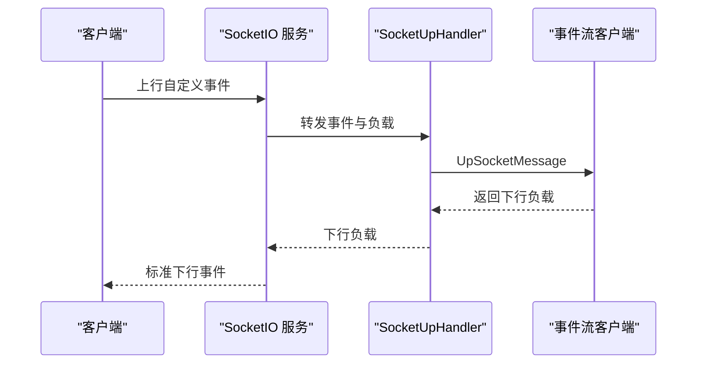
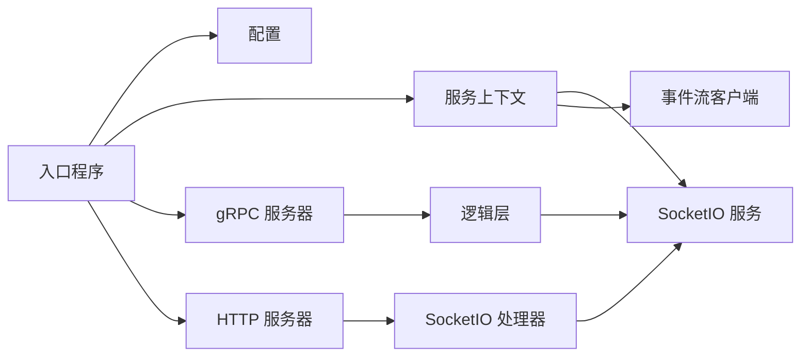

# SocketIO 网关服务

<cite>
**本文引用的文件**
- [socketgtw.go](file://socketapp/socketgtw/socketgtw.go)
- [socketgtw.proto](file://socketapp/socketgtw/socketgtw.proto)
- [socketgtw.yaml](file://socketapp/socketgtw/etc/socketgtw.yaml)
- [config.go](file://socketapp/socketgtw/internal/config/config.go)
- [routes.go](file://socketapp/socketgtw/internal/handler/routes.go)
- [servicecontext.go](file://socketapp/socketgtw/internal/svc/servicecontext.go)
- [socketgtwserver.go](file://socketapp/socketgtw/internal/server/socketgtwserver.go)
- [server.go](file://common/socketiox/server.go)
- [handler.go](file://common/socketiox/handler.go)
- [sockertuphandler.go](file://socketapp/socketgtw/internal/sockethandler/sockertuphandler.go)
- [joinroomlogic.go](file://socketapp/socketgtw/internal/logic/joinroomlogic.go)
- [kicksessionlogic.go](file://socketapp/socketgtw/internal/logic/kicksessionlogic.go)
</cite>

## 目录
1. [简介](#简介)
2. [项目结构](#项目结构)
3. [核心组件](#核心组件)
4. [架构总览](#架构总览)
5. [详细组件分析](#详细组件分析)
6. [依赖分析](#依赖分析)
7. [性能考虑](#性能考虑)
8. [故障排除指南](#故障排除指南)
9. [结论](#结论)
10. [附录：配置与接口](#附录配置与接口)

## 简介
本文件为 SocketIO 网关服务（SocketGtw）的技术文档，围绕基于 go-zero 的微服务框架，系统性阐述以下内容：
- gRPC 服务器配置与注册
- HTTP 服务器集成与中间件链设置
- 连接管理机制：客户端连接建立、升级处理、连接状态维护
- 房间管理功能：房间创建、成员加入/离开、权限控制与房间广播
- 消息路由机制：全局广播、房间内广播与单播消息处理
- 完整配置项说明、API 接口定义与使用示例
- 性能优化建议、错误处理策略与故障排除方法

## 项目结构
SocketGtw 服务由以下关键模块构成：
- 入口程序：负责加载配置、启动 gRPC 与 HTTP 服务、注册中间件与服务
- 协议定义：通过 proto 定义 SocketGtw 服务的 RPC 接口
- 服务上下文：封装 SocketIO 服务实例、事件流客户端等
- SocketIO 核心：提供会话管理、房间管理、事件处理与广播能力
- 逻辑层：将 gRPC 请求映射到 SocketIO 能力
- 处理器：将 HTTP 路由绑定到 SocketIO 的 HTTP 处理器

**图表来源**
- [socketgtw.go:30-91](file://socketapp/socketgtw/socketgtw.go#L30-L91)
- [socketgtw.yaml:1-37](file://socketapp/socketgtw/etc/socketgtw.yaml#L1-L37)
- [config.go:8-28](file://socketapp/socketgtw/internal/config/config.go#L8-L28)
- [socketgtw.proto:9-32](file://socketapp/socketgtw/socketgtw.proto#L9-L32)
- [socketgtwserver.go:26-90](file://socketapp/socketgtw/internal/server/socketgtwserver.go#L26-L90)
- [routes.go:11-24](file://socketapp/socketgtw/internal/handler/routes.go#L11-L24)
- [handler.go:38-41](file://common/socketiox/handler.go#L38-L41)
- [server.go:314-335](file://common/socketiox/server.go#L314-L335)
- [sockertuphandler.go:23-44](file://socketapp/socketgtw/internal/sockethandler/sockertuphandler.go#L23-L44)
- [joinroomlogic.go:25-37](file://socketapp/socketgtw/internal/logic/joinroomlogic.go#L25-L37)
- [kicksessionlogic.go:26-36](file://socketapp/socketgtw/internal/logic/kicksessionlogic.go#L26-L36)

**章节来源**
- [socketgtw.go:30-91](file://socketapp/socketgtw/socketgtw.go#L30-L91)
- [socketgtw.yaml:1-37](file://socketapp/socketgtw/etc/socketgtw.yaml#L1-L37)
- [config.go:8-28](file://socketapp/socketgtw/internal/config/config.go#L8-L28)

## 核心组件
- gRPC 服务器：注册 SocketGtw 服务，暴露房间管理、广播、会话控制、统计等接口
- HTTP 服务器：对外提供 /socket.io 路由，接入 SocketIO 协议
- SocketIO 服务：管理会话、房间、事件处理、广播与统计上报
- 事件流客户端：将 SocketIO 上行事件转发至事件流服务，用于鉴权、权限校验与房间加载
- 中间件链：在 HTTP 层对特定路径进行连接头修正，确保 WebSocket 升级正常

**章节来源**
- [socketgtwserver.go:26-90](file://socketapp/socketgtw/internal/server/socketgtwserver.go#L26-L90)
- [routes.go:11-24](file://socketapp/socketgtw/internal/handler/routes.go#L11-L24)
- [server.go:314-335](file://common/socketiox/server.go#L314-L335)
- [servicecontext.go:38-131](file://socketapp/socketgtw/internal/svc/servicecontext.go#L38-L131)
- [socketgtw.go:48-61](file://socketapp/socketgtw/socketgtw.go#L48-L61)

## 架构总览
SocketGtw 将 gRPC 与 HTTP 双栈融合，HTTP 负责 SocketIO 协议接入，gRPC 提供内部控制面能力。SocketIO 核心负责会话生命周期与房间管理；事件流客户端用于鉴权与房间加载。

**图表来源**
- [socketgtw.go:40-61](file://socketapp/socketgtw/socketgtw.go#L40-L61)
- [routes.go:11-24](file://socketapp/socketgtw/internal/handler/routes.go#L11-L24)
- [server.go:337-676](file://common/socketiox/server.go#L337-L676)
- [servicecontext.go:24-37](file://socketapp/socketgtw/internal/svc/servicecontext.go#L24-L37)

## 详细组件分析

### gRPC 服务器配置与注册
- 在入口程序中加载配置并创建 gRPC 服务器，注册 SocketGtw 服务实现
- 开发/测试模式下启用反射，便于调试
- 注册日志拦截器，统一记录请求日志

**图表来源**
- [socketgtw.go:40-46](file://socketapp/socketgtw/socketgtw.go#L40-L46)
- [socketgtwserver.go:20-24](file://socketapp/socketgtw/internal/server/socketgtwserver.go#L20-L24)

**章节来源**
- [socketgtw.go:40-46](file://socketapp/socketgtw/socketgtw.go#L40-L46)
- [socketgtwserver.go:26-90](file://socketapp/socketgtw/internal/server/socketgtwserver.go#L26-L90)

### HTTP 服务器集成与中间件链
- 将 /socket.io 路由绑定到 SocketIO HTTP 处理器
- 自定义中间件：对 /socket.io 且 Connection 为 upgrade 的请求，将其头部统一为 Upgrade，保证 WebSocket 升级成功
- 支持 JWT 认证开关（配置项），可按需启用

**图表来源**
- [socketgtw.go:48-61](file://socketapp/socketgtw/socketgtw.go#L48-L61)
- [routes.go:11-24](file://socketapp/socketgtw/internal/handler/routes.go#L11-L24)
- [handler.go:38-41](file://common/socketiox/handler.go#L38-L41)

**章节来源**
- [socketgtw.go:48-61](file://socketapp/socketgtw/socketgtw.go#L48-L61)
- [routes.go:11-24](file://socketapp/socketgtw/internal/handler/routes.go#L11-L24)
- [handler.go:19-41](file://common/socketiox/handler.go#L19-L41)

### 连接管理机制
- 连接建立：SocketIO 服务在 OnConnection 回调中创建会话对象，注入元数据（来自 JWT Claims 中配置的键）
- 升级处理：中间件确保升级头一致，避免握手失败
- 连接状态维护：会话表维护 sId 到 Session 的映射；定时统计循环向每个会话推送统计事件

**图表来源**
- [server.go:337-391](file://common/socketiox/server.go#L337-L391)
- [server.go:702-740](file://common/socketiox/server.go#L702-L740)
- [servicecontext.go:75-96](file://socketapp/socketgtw/internal/svc/servicecontext.go#L75-L96)

**章节来源**
- [server.go:337-391](file://common/socketiox/server.go#L337-L391)
- [server.go:702-740](file://common/socketiox/server.go#L702-L740)
- [servicecontext.go:75-96](file://socketapp/socketgtw/internal/svc/servicecontext.go#L75-L96)

### 房间管理功能
- 房间创建：首次加入即创建房间（底层由 SocketIO 容器自动维护）
- 成员加入/离开：支持客户端事件与 gRPC 控制面两种方式
- 权限控制：加入房间前可通过事件流客户端进行鉴权与权限校验
- 房间广播：支持房间内广播，事件名不可为保留名

**图表来源**
- [server.go:392-435](file://common/socketiox/server.go#L392-L435)
- [server.go:114-130](file://common/socketiox/server.go#L114-L130)
- [servicecontext.go:114-130](file://socketapp/socketgtw/internal/svc/servicecontext.go#L114-L130)

**章节来源**
- [server.go:204-232](file://common/socketiox/server.go#L204-L232)
- [server.go:678-688](file://common/socketiox/server.go#L678-L688)
- [joinroomlogic.go:25-37](file://socketapp/socketgtw/internal/logic/joinroomlogic.go#L25-L37)

### 消息路由机制
- 全局广播：向所有在线客户端广播
- 房间内广播：向指定房间内的所有成员广播
- 单播消息：通过 gRPC 将消息发送给指定会话或元数据匹配的会话集合

**图表来源**
- [socketgtw.proto:14-28](file://socketapp/socketgtw/socketgtw.proto#L14-L28)
- [socketgtwserver.go:38-48](file://socketapp/socketgtw/internal/server/socketgtwserver.go#L38-L48)
- [server.go:678-700](file://common/socketiox/server.go#L678-L700)

**章节来源**
- [socketgtw.proto:14-28](file://socketapp/socketgtw/socketgtw.proto#L14-L28)
- [socketgtwserver.go:38-48](file://socketapp/socketgtw/internal/server/socketgtwserver.go#L38-L48)
- [server.go:678-700](file://common/socketiox/server.go#L678-L700)

### 事件处理与上行消息转发
- Socket Up 事件：客户端通过自定义事件上行，SocketIO 服务将事件与负载转发至事件流客户端
- 事件流客户端：接收上行消息，返回下行负载，SocketIO 服务再以标准下行事件回传客户端

**图表来源**
- [sockertuphandler.go:23-44](file://socketapp/socketgtw/internal/sockethandler/sockertuphandler.go#L23-L44)
- [server.go:469-531](file://common/socketiox/server.go#L469-L531)

**章节来源**
- [sockertuphandler.go:23-44](file://socketapp/socketgtw/internal/sockethandler/sockertuphandler.go#L23-L44)
- [server.go:469-531](file://common/socketiox/server.go#L469-L531)

## 依赖分析
- 入口程序依赖配置、服务上下文、gRPC 与 HTTP 组件
- 服务上下文依赖 SocketIO 服务与事件流客户端
- SocketIO 服务依赖 SocketIO 库、并发安全的会话与房间容器
- 逻辑层依赖服务上下文，调用 SocketIO 能力

**图表来源**
- [socketgtw.go:30-91](file://socketapp/socketgtw/socketgtw.go#L30-L91)
- [servicecontext.go:24-131](file://socketapp/socketgtw/internal/svc/servicecontext.go#L24-L131)
- [server.go:314-335](file://common/socketiox/server.go#L314-L335)

**章节来源**
- [socketgtw.go:30-91](file://socketapp/socketgtw/socketgtw.go#L30-L91)
- [servicecontext.go:24-131](file://socketapp/socketgtw/internal/svc/servicecontext.go#L24-L131)

## 性能考虑
- 并发模型：事件处理采用 goroutine 安全封装，避免阻塞主循环
- 统计上报：周期性向每个会话推送统计事件，便于可观测性
- gRPC 最大消息：事件流客户端配置了较大的发送/接收消息限制，满足大包场景
- 中间件最小化：仅对 /socket.io 升级路径进行必要头修正，降低额外开销

**章节来源**
- [server.go:702-740](file://common/socketiox/server.go#L702-L740)
- [servicecontext.go:25-33](file://socketapp/socketgtw/internal/svc/servicecontext.go#L25-L33)
- [socketgtw.go:48-61](file://socketapp/socketgtw/socketgtw.go#L48-L61)

## 故障排除指南
- WebSocket 升级失败
  - 检查中间件是否正确将 Connection 头修正为 Upgrade
  - 确认 /socket.io 路由已注册
- 令牌验证失败
  - 确认 JWT 密钥配置与客户端令牌一致
  - 若启用历史密钥，确认 PrevAccessSecret 已配置
- 房间加入失败
  - 检查预加入钩子是否返回错误
  - 确认事件流客户端 UpSocketMessage 是否返回允许加入
- 广播无效
  - 确认事件名非保留名
  - 检查目标房间是否存在成员
- 会话统计异常
  - 关注统计循环中的会话数量与 Socket 数量一致性

**章节来源**
- [socketgtw.go:48-61](file://socketapp/socketgtw/socketgtw.go#L48-L61)
- [servicecontext.go:41-74](file://socketapp/socketgtw/internal/svc/servicecontext.go#L41-L74)
- [server.go:114-130](file://common/socketiox/server.go#L114-L130)
- [server.go:678-700](file://common/socketiox/server.go#L678-L700)
- [server.go:702-740](file://common/socketiox/server.go#L702-L740)

## 结论
SocketGtw 服务通过 gRPC 与 HTTP 双栈融合，结合 SocketIO 的会话与房间管理能力，提供了完善的实时通信基础设施。配合事件流客户端，实现了鉴权、权限控制与房间动态加载。通过合理的中间件与并发模型，兼顾了易用性与性能。

## 附录：配置与接口

### 配置项说明
- 基础配置
  - 名称与监听地址、超时时间
  - 日志编码、路径、级别与保留天数
- HTTP 配置
  - 名称、主机、端口、超时
- JWT 认证（可选）
  - AccessSecret、PrevAccessSecret
- Nacos 注册（可选）
  - 是否注册、主机、端口、用户名、密码、命名空间、服务名
- Socket 元数据键
  - 从 JWT Claims 中提取并注入到会话元数据的键列表
- 事件流客户端配置
  - Endpoints、非阻塞、超时

**章节来源**
- [socketgtw.yaml:1-37](file://socketapp/socketgtw/etc/socketgtw.yaml#L1-L37)
- [config.go:8-28](file://socketapp/socketgtw/internal/config/config.go#L8-L28)

### API 接口文档
- 加入房间：JoinRoom
- 离开房间：LeaveRoom
- 房间广播：BroadcastRoom
- 全局广播：BroadcastGlobal
- 剔除会话：KickSession
- 按元数据剔除会话：KickMetaSession
- 单播消息：SendToSession
- 批量单播：SendToSessions
- 按元数据单播：SendToMetaSession
- 按元数据批量单播：SendToMetaSessions
- 统计查询：SocketGtwStat

以上接口均通过 gRPC 调用，请求/响应结构体定义于 proto 文件中。

**章节来源**
- [socketgtw.proto:9-32](file://socketapp/socketgtw/socketgtw.proto#L9-L32)

### 使用示例（流程示意）
- 客户端通过 /socket.io 建立连接，并携带令牌
- 服务端进行令牌验证与元数据注入
- 客户端发送加入房间事件，服务端触发预加入钩子并加入房间
- 管理端通过 gRPC 广播消息到房间或全局
- 客户端接收下行消息并处理

**章节来源**
- [routes.go:11-24](file://socketapp/socketgtw/internal/handler/routes.go#L11-L24)
- [server.go:337-391](file://common/socketiox/server.go#L337-L391)
- [socketgtwserver.go:38-48](file://socketapp/socketgtw/internal/server/socketgtwserver.go#L38-L48)