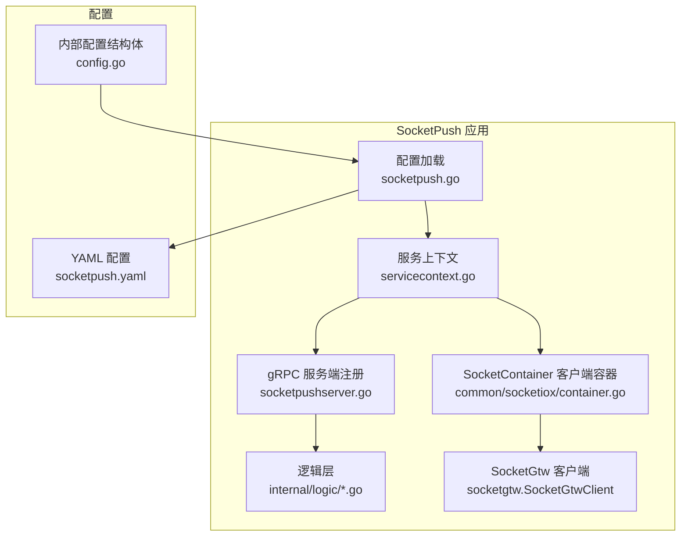
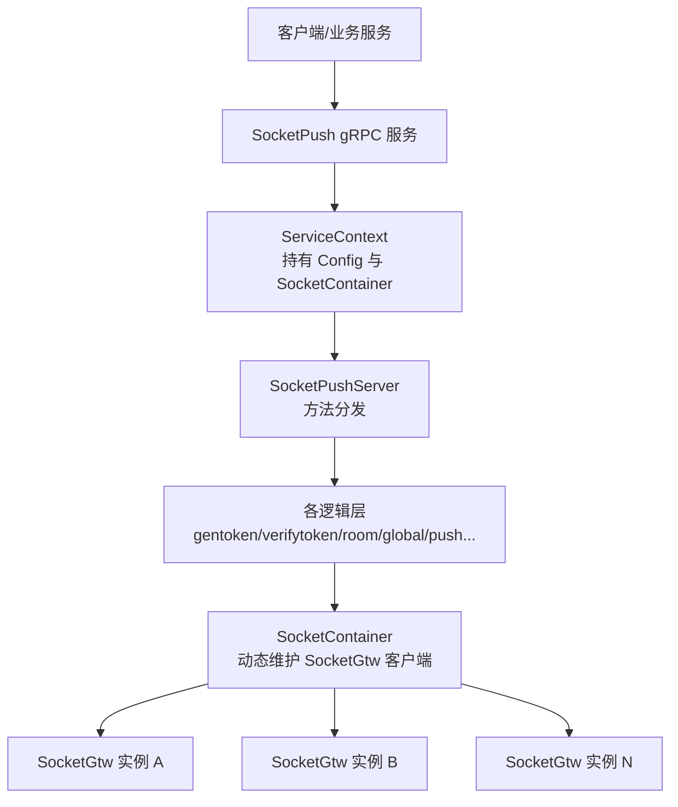
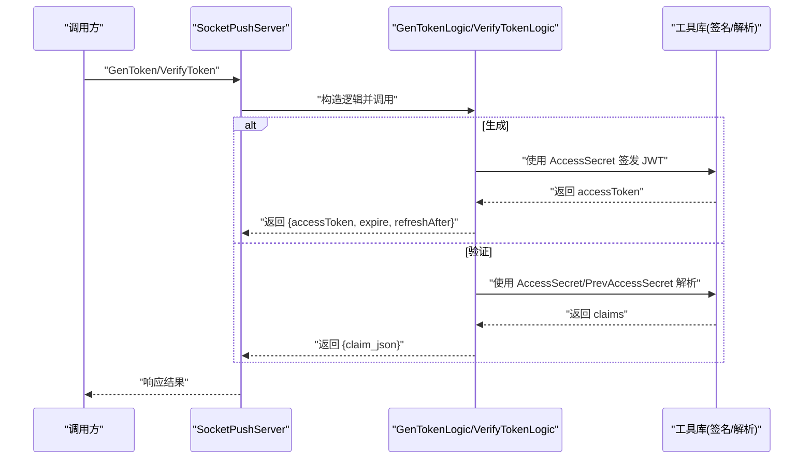
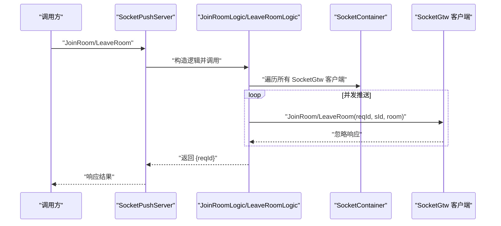
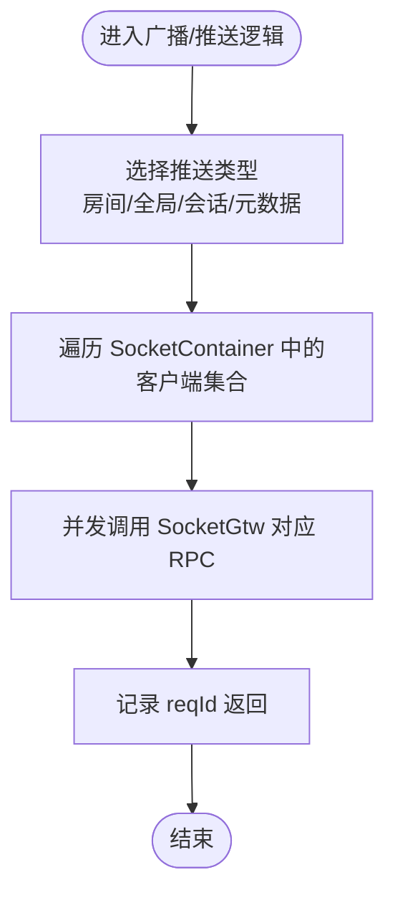
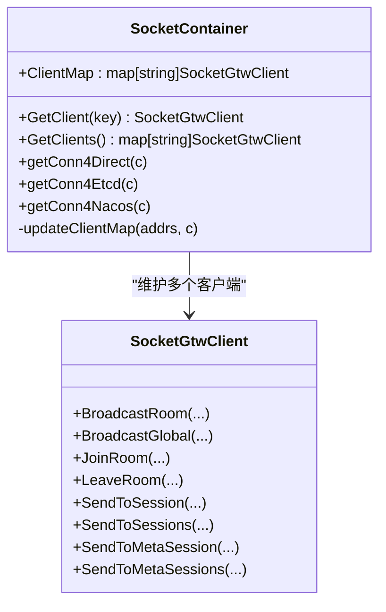
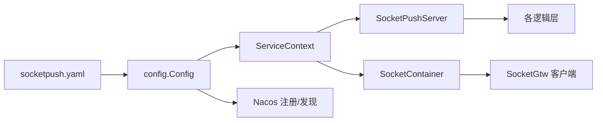

# SocketPush 推送服务

<cite>
**本文引用的文件**
- [socketpush.proto](file://socketapp/socketpush/socketpush.proto)
- [socketpush.yaml](file://socketapp/socketpush/etc/socketpush.yaml)
- [config.go](file://socketapp/socketpush/internal/config/config.go)
- [servicecontext.go](file://socketapp/socketpush/internal/svc/servicecontext.go)
- [socketpushserver.go](file://socketapp/socketpush/internal/server/socketpushserver.go)
- [socketpush.go](file://socketapp/socketpush/socketpush.go)
- [container.go](file://common/socketiox/container.go)
- [gentokenlogic.go](file://socketapp/socketpush/internal/logic/gentokenlogic.go)
- [verifytokenlogic.go](file://socketapp/socketpush/internal/logic/verifytokenlogic.go)
- [broadcastroomlogic.go](file://socketapp/socketpush/internal/logic/broadcastroomlogic.go)
- [broadcastgloballogic.go](file://socketapp/socketpush/internal/logic/broadcastgloballogic.go)
- [joinroomlogic.go](file://socketapp/socketpush/internal/logic/joinroomlogic.go)
- [leaveroomlogic.go](file://socketapp/socketpush/internal/logic/leaveroomlogic.go)
</cite>

## 目录
1. [简介](#简介)
2. [项目结构](#项目结构)
3. [核心组件](#核心组件)
4. [架构总览](#架构总览)
5. [详细组件分析](#详细组件分析)
6. [依赖关系分析](#依赖关系分析)
7. [性能考虑](#性能考虑)
8. [故障排查指南](#故障排查指南)
9. [结论](#结论)
10. [附录：API 接口文档](#附录api-接口文档)

## 简介
SocketPush 是基于 gRPC 的推送服务，负责统一生成与验证访问令牌、管理会话与房间、并向上游 Socket 网关（SocketGtw）广播或定向推送消息。其核心特性包括：
- 令牌生成与校验：使用 JWT HS256 签发与多密钥兼容校验，支持刷新策略提示。
- 会话与房间管理：支持加入/离开房间，用于后续定向推送。
- 广播与定向推送：支持房间级广播、全局广播、按会话 ID 单发/批量、按元数据键值单发/批量。
- 容器化客户端管理：通过 SocketContainer 统一维护到多个 SocketGtw 的连接，支持直连、ETCD 与 Nacos 三种发现方式。

## 项目结构
SocketPush 采用 goctl 生成的典型目录结构，分为配置、服务上下文、gRPC 服务端、逻辑层与 YAML 配置等模块。SocketGtw 作为上游服务，由 SocketContainer 动态发现并维护连接。

图表来源
- [socketpush.go:27-69](file://socketapp/socketpush/socketpush.go#L27-L69)
- [servicecontext.go:13-18](file://socketapp/socketpush/internal/svc/servicecontext.go#L13-L18)
- [socketpushserver.go:20-102](file://socketapp/socketpush/internal/server/socketpushserver.go#L20-L102)
- [container.go:35-61](file://common/socketiox/container.go#L35-L61)

章节来源
- [socketpush.go:27-69](file://socketapp/socketpush/socketpush.go#L27-L69)
- [socketpush.yaml:1-28](file://socketapp/socketpush/etc/socketpush.yaml#L1-L28)
- [config.go:5-22](file://socketapp/socketpush/internal/config/config.go#L5-L22)

## 核心组件
- 配置与启动
  - 配置文件：监听地址、日志、JWT 密钥与过期时间、Nacos 注册开关、SocketGtw 连接目标。
  - 启动流程：解析配置 → 构建服务上下文 → 创建 gRPC 服务器 → 可选注册到 Nacos → 启动服务。
- 服务上下文
  - 持有 Config 与 SocketContainer，后者负责动态发现与维护到 SocketGtw 的连接。
- gRPC 服务端
  - 将每个 RPC 方法委托给对应逻辑层，保持服务端仅做薄薄的编排。
- 逻辑层
  - 负责具体业务：令牌生成/校验、房间加入/离开、全局/房间广播、按会话/按元数据推送等。
- SocketContainer
  - 支持直连、ETCD 与 Nacos 三种发现方式；对每个可用 SocketGtw 维护一个 gRPC 客户端；限制并发推送时的连接数量以降低抖动。

章节来源
- [socketpush.go:27-69](file://socketapp/socketpush/socketpush.go#L27-L69)
- [servicecontext.go:8-18](file://socketapp/socketpush/internal/svc/servicecontext.go#L8-L18)
- [socketpushserver.go:26-102](file://socketapp/socketpush/internal/server/socketpushserver.go#L26-L102)
- [container.go:35-61](file://common/socketiox/container.go#L35-L61)

## 架构总览
SocketPush 通过 gRPC 对外提供统一入口，内部将请求转发至多个 SocketGtw 实例，实现横向扩展与高可用。

图表来源
- [socketpushserver.go:26-102](file://socketapp/socketpush/internal/server/socketpushserver.go#L26-L102)
- [servicecontext.go:13-18](file://socketapp/socketpush/internal/svc/servicecontext.go#L13-L18)
- [container.go:35-61](file://common/socketiox/container.go#L35-L61)

## 详细组件分析

### 令牌生成与验证
- 生成 Token
  - 输入：用户标识与可选负载映射。
  - 处理：以当前时间戳为签发时间，使用配置中的密钥签发 JWT；同时计算过期时间与刷新提示时间。
  - 输出：返回访问令牌、过期时间与刷新时间。
- 验证 Token
  - 输入：访问令牌。
  - 处理：尝试使用当前密钥与历史密钥进行解析；成功后将声明序列化为 JSON 字符串返回。

图表来源
- [gentokenlogic.go:30-44](file://socketapp/socketpush/internal/logic/gentokenlogic.go#L30-L44)
- [verifytokenlogic.go:29-48](file://socketapp/socketpush/internal/logic/verifytokenlogic.go#L29-L48)

章节来源
- [gentokenlogic.go:30-79](file://socketapp/socketpush/internal/logic/gentokenlogic.go#L30-L79)
- [verifytokenlogic.go:29-50](file://socketapp/socketpush/internal/logic/verifytokenlogic.go#L29-L50)

### 房间与会话管理
- 加入房间
  - 将请求并发广播给所有 SocketGtw 实例，确保会话在目标节点上完成房间绑定。
- 离开房间
  - 同样并发通知所有 SocketGtw 实例，清理会话房间状态。
- 注意
  - 以上操作均在无取消上下文中执行，避免因请求取消导致推送中断。

图表来源
- [joinroomlogic.go:29-42](file://socketapp/socketpush/internal/logic/joinroomlogic.go#L29-L42)
- [leaveroomlogic.go:29-42](file://socketapp/socketpush/internal/logic/leaveroomlogic.go#L29-L42)
- [container.go:63-77](file://common/socketiox/container.go#L63-L77)

章节来源
- [joinroomlogic.go:29-44](file://socketapp/socketpush/internal/logic/joinroomlogic.go#L29-L44)
- [leaveroomlogic.go:29-44](file://socketapp/socketpush/internal/logic/leaveroomlogic.go#L29-L44)

### 广播与定向推送
- 房间广播
  - 遍历所有 SocketGtw 客户端，向目标房间广播事件与载荷。
- 全局广播
  - 遍历所有 SocketGtw 客户端，向所有在线会话广播事件与载荷。
- 按会话/按元数据推送
  - 提供单发与批量版本，分别按会话 ID 或元数据键值对进行定向推送。

图表来源
- [broadcastroomlogic.go:29-44](file://socketapp/socketpush/internal/logic/broadcastroomlogic.go#L29-L44)
- [broadcastgloballogic.go:29-64](file://socketapp/socketpush/internal/logic/broadcastgloballogic.go#L29-L64)
- [container.go:63-77](file://common/socketiox/container.go#L63-L77)

章节来源
- [broadcastroomlogic.go:29-45](file://socketapp/socketpush/internal/logic/broadcastroomlogic.go#L29-L45)
- [broadcastgloballogic.go:29-65](file://socketapp/socketpush/internal/logic/broadcastgloballogic.go#L29-L65)

### SocketContainer 客户端管理
- 发现方式
  - 直连：直接使用配置中的 Endpoints。
  - ETCD：订阅键值，动态增删客户端。
  - Nacos：解析 nacos://URL，订阅服务实例，过滤健康且带 gRPC 端口的实例。
- 并发与限流
  - 在更新客户端集合时加锁；每次变更只保留子集大小的实例，降低大规模抖动。
- gRPC 选项
  - 设置最大发送消息大小，避免超大消息导致失败。

图表来源
- [container.go:30-61](file://common/socketiox/container.go#L30-L61)
- [container.go:132-154](file://common/socketiox/container.go#L132-L154)
- [container.go:156-242](file://common/socketiox/container.go#L156-L242)
- [container.go:267-316](file://common/socketiox/container.go#L267-L316)

章节来源
- [container.go:35-61](file://common/socketiox/container.go#L35-L61)
- [container.go:132-154](file://common/socketiox/container.go#L132-L154)
- [container.go:156-242](file://common/socketiox/container.go#L156-L242)
- [container.go:267-316](file://common/socketiox/container.go#L267-L316)

## 依赖关系分析
- SocketPush 与 SocketGtw
  - 通过 gRPC 客户端调用 SocketGtw 的广播与会话管理接口。
- SocketPush 与配置
  - 通过 YAML 配置决定监听地址、日志级别、JWT 密钥与过期时间、SocketGtw 发现方式。
- SocketPush 与 Nacos
  - 当启用注册时，将服务注册到 Nacos；当使用 Nacos 发现时，订阅服务实例列表。

图表来源
- [socketpush.yaml:1-28](file://socketapp/socketpush/etc/socketpush.yaml#L1-L28)
- [config.go:5-22](file://socketapp/socketpush/internal/config/config.go#L5-L22)
- [servicecontext.go:13-18](file://socketapp/socketpush/internal/svc/servicecontext.go#L13-L18)
- [socketpushserver.go:26-102](file://socketapp/socketpush/internal/server/socketpushserver.go#L26-L102)
- [container.go:156-242](file://common/socketiox/container.go#L156-L242)

章节来源
- [socketpush.go:44-62](file://socketapp/socketpush/socketpush.go#L44-L62)
- [socketpush.yaml:14-27](file://socketapp/socketpush/etc/socketpush.yaml#L14-L27)

## 性能考虑
- 广播与推送并发
  - 使用并发 goroutine 对所有 SocketGtw 客户端发起推送，提升吞吐；注意控制并发规模，避免瞬时压力过大。
- 客户端集合更新
  - 通过子集抽样与加锁更新，减少频繁变更带来的抖动。
- gRPC 消息大小
  - 已设置最大发送消息大小，避免超大消息导致失败；如需更大载荷，可在配置中调整。
- 日志与可观测性
  - 启用 info 级别日志，生产环境建议结合集中式日志与指标采集。

[本节为通用性能建议，不直接分析具体文件]

## 故障排查指南
- 无法连接 SocketGtw
  - 检查配置中的 Endpoints、ETCD Key 或 Nacos URL 是否正确；确认网络连通性与端口开放。
- 令牌无效
  - 确认使用的密钥与配置一致；若更换密钥，需同时更新 PrevAccessSecret 并等待切换窗口。
- 广播未生效
  - 检查房间名称是否一致；确认会话已加入房间；观察 SocketGtw 日志定位节点差异。
- 并发推送异常
  - 关注 goroutine 泄漏与 panic；确认逻辑层未在请求取消上下文中执行推送。

章节来源
- [socketpush.yaml:22-27](file://socketapp/socketpush/etc/socketpush.yaml#L22-L27)
- [verifytokenlogic.go:33-36](file://socketapp/socketpush/internal/logic/verifytokenlogic.go#L33-L36)
- [broadcastroomlogic.go:30-43](file://socketapp/socketpush/internal/logic/broadcastroomlogic.go#L30-L43)

## 结论
SocketPush 通过清晰的分层设计与 SocketContainer 的动态客户端管理，实现了高可用、可扩展的消息推送能力。配合 JWT 令牌体系与多种推送模式，能够满足房间广播、全局广播、单/批量定向推送等场景需求。建议在生产环境中结合 Nacos 注册与日志监控，持续优化并发与消息大小策略。

[本节为总结性内容，不直接分析具体文件]

## 附录：API 接口文档

### 通用说明
- 请求与响应均包含 reqId，便于调用方关联请求与日志追踪。
- 令牌相关字段：
  - accessToken：访问令牌。
  - accessExpire：过期时间（秒）。
  - refreshAfter：建议刷新时间（秒）。
- 房间与会话：
  - room：房间名称。
  - sId：会话 ID。
  - event：事件名。
  - payload：事件载荷（字符串形式，建议 JSON）。

### 接口定义

- 生成令牌
  - 方法：GenToken
  - 请求：uid, payload(map)
  - 响应：accessToken, accessExpire, refreshAfter
  - 错误：参数错误（uid 为空）
  - 参考路径：[socketpush.proto:48-57](file://socketapp/socketpush/socketpush.proto#L48-L57)，[gentokenlogic.go:30-44](file://socketapp/socketpush/internal/logic/gentokenlogic.go#L30-L44)

- 验证令牌
  - 方法：VerifyToken
  - 请求：accessToken
  - 响应：claim_json
  - 错误：令牌为空或无效
  - 参考路径：[socketpush.proto:59-65](file://socketapp/socketpush/socketpush.proto#L59-L65)，[verifytokenlogic.go:29-48](file://socketapp/socketpush/internal/logic/verifytokenlogic.go#L29-L48)

- 加入房间
  - 方法：JoinRoom
  - 请求：reqId, sId, room
  - 响应：reqId
  - 参考路径：[socketpush.proto:67-75](file://socketapp/socketpush/socketpush.proto#L67-L75)，[joinroomlogic.go:29-42](file://socketapp/socketpush/internal/logic/joinroomlogic.go#L29-L42)

- 离开房间
  - 方法：LeaveRoom
  - 请求：reqId, sId, room
  - 响应：reqId
  - 参考路径：[socketpush.proto:77-85](file://socketapp/socketpush/socketpush.proto#L77-L85)，[leaveroomlogic.go:29-42](file://socketapp/socketpush/internal/logic/leaveroomlogic.go#L29-L42)

- 房间广播
  - 方法：BroadcastRoom
  - 请求：reqId, room, event, payload
  - 响应：reqId
  - 参考路径：[socketpush.proto:87-96](file://socketapp/socketpush/socketpush.proto#L87-L96)，[broadcastroomlogic.go:29-44](file://socketapp/socketpush/internal/logic/broadcastroomlogic.go#L29-L44)

- 全局广播
  - 方法：BroadcastGlobal
  - 请求：reqId, event, payload
  - 响应：reqId
  - 参考路径：[socketpush.proto:98-106](file://socketapp/socketpush/socketpush.proto#L98-L106)，[broadcastgloballogic.go:29-64](file://socketapp/socketpush/internal/logic/broadcastgloballogic.go#L29-L64)

- 剔除会话
  - 方法：KickSession
  - 请求：reqId, sId
  - 响应：reqId
  - 参考路径：[socketpush.proto:108-115](file://socketapp/socketpush/socketpush.proto#L108-L115)

- 按元数据剔除会话
  - 方法：KickMetaSession
  - 请求：reqId, key, value
  - 响应：reqId
  - 参考路径：[socketpush.proto:117-125](file://socketapp/socketpush/socketpush.proto#L117-L125)

- 向指定会话发送消息
  - 方法：SendToSession
  - 请求：reqId, sId, event, payload
  - 响应：reqId
  - 参考路径：[socketpush.proto:127-136](file://socketapp/socketpush/socketpush.proto#L127-L136)

- 向指定会话批量发送消息
  - 方法：SendToSessions
  - 请求：reqId, sIds(repeated), event, payload
  - 响应：reqId
  - 参考路径：[socketpush.proto:138-147](file://socketapp/socketpush/socketpush.proto#L138-L147)

- 向指定元数据会话发送消息
  - 方法：SendToMetaSession
  - 请求：reqId, key, value, event, payload
  - 响应：reqId
  - 参考路径：[socketpush.proto:149-159](file://socketapp/socketpush/socketpush.proto#L149-L159)

- 向指定元数据会话批量发送消息
  - 方法：SendToMetaSessions
  - 请求：reqId, metaSessions(repeated), event, payload
  - 响应：reqId
  - 参考路径：[socketpush.proto:161-170](file://socketapp/socketpush/socketpush.proto#L161-L170)

- 获取网关统计信息
  - 方法：SocketGtwStat
  - 请求：无
  - 响应：stats(repeated)
  - 参考路径：[socketpush.proto:172-177](file://socketapp/socketpush/socketpush.proto#L172-L177)

### 错误码说明
- 参数错误：例如 uid 为空。
- 令牌无效：例如 accessToken 为空或签名不匹配。
- 其他：根据具体逻辑抛出的错误（如网络异常、解析失败等），建议在调用方统一捕获并记录。

[本节为接口汇总，不直接分析具体代码片段]