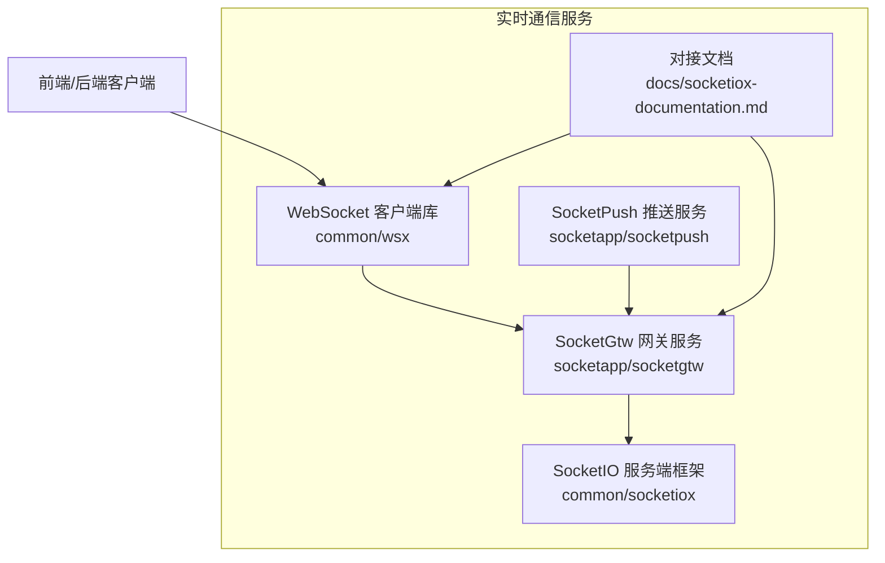
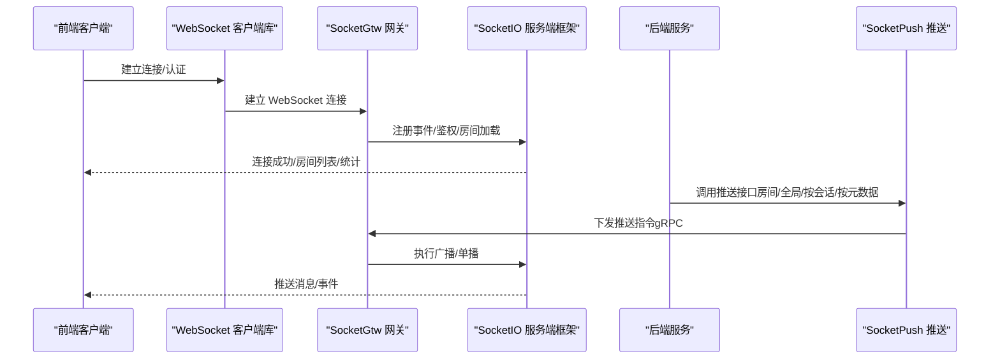
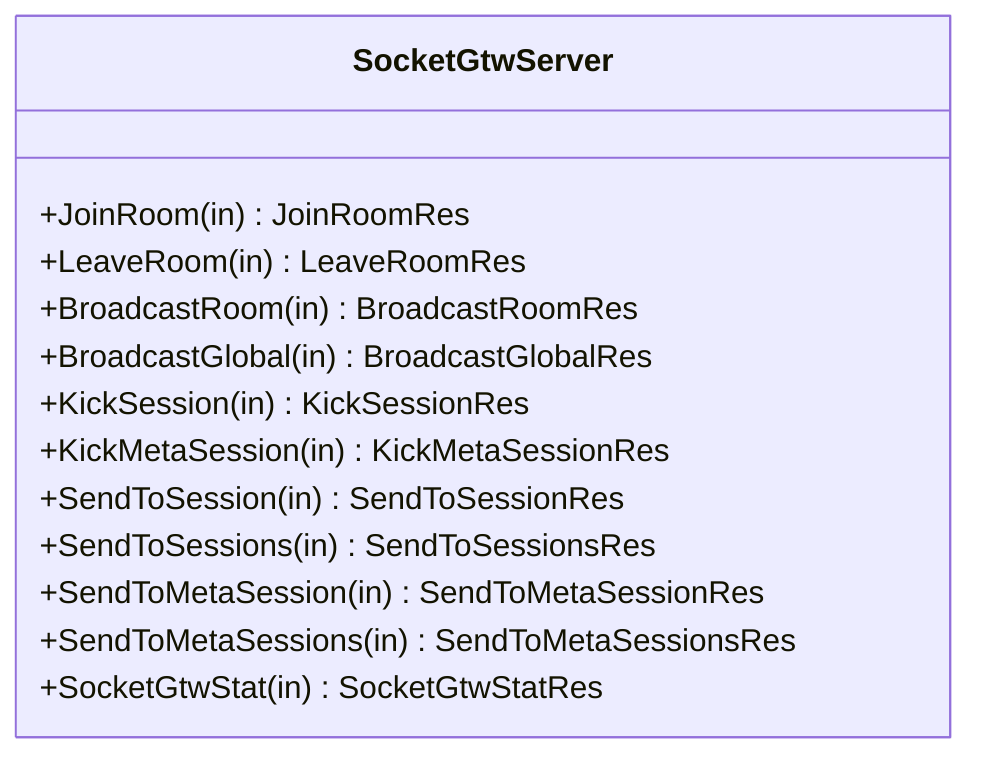
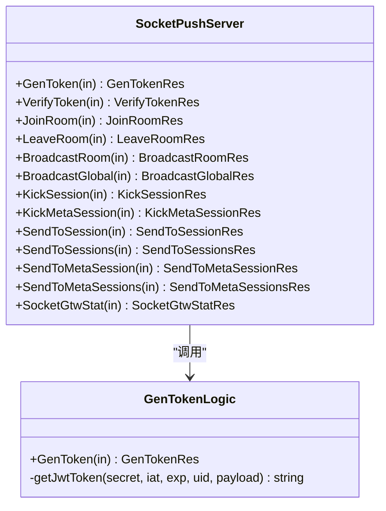
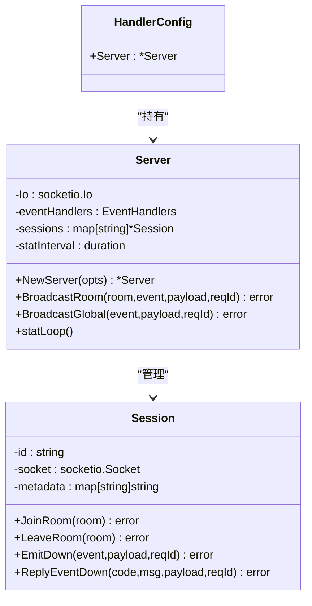
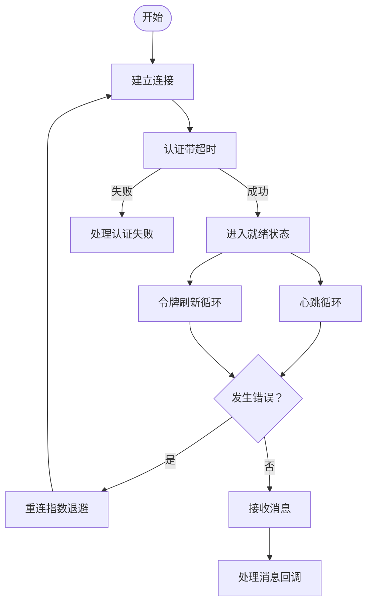
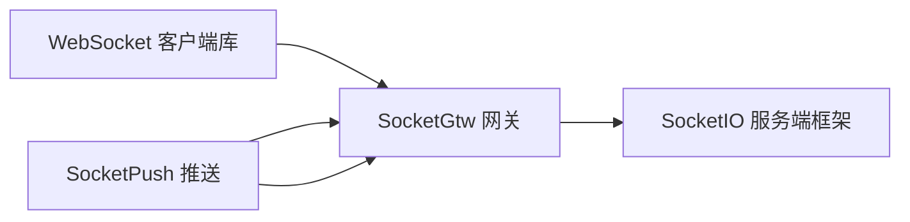

# 实时通信服务

<cite>
**本文引用的文件**   
- [socketgtw.go](file://socketapp/socketgtw/socketgtw.go)
- [socketpush.go](file://socketapp/socketpush/socketpush.go)
- [server.go](file://common/socketiox/server.go)
- [handler.go](file://common/socketiox/handler.go)
- [container.go](file://common/socketiox/container.go)
- [socketgtwserver.go](file://socketapp/socketgtw/internal/server/socketgtwserver.go)
- [socketpushserver.go](file://socketapp/socketpush/internal/server/socketpushserver.go)
- [socketgtw.yaml](file://socketapp/socketgtw/etc/socketgtw.yaml)
- [socketpush.yaml](file://socketapp/socketpush/etc/socketpush.yaml)
- [client.go](file://common/wsx/client.go)
- [socketgtw.proto](file://socketapp/socketgtw/socketgtw.proto)
- [socketpush.proto](file://socketapp/socketpush/socketpush.proto)
- [genTokenLogic.go](file://socketapp/socketpush/internal/logic/genTokenLogic.go)
- [socketiox-documentation.md](file://docs/socketiox-documentation.md)
</cite>

## 目录
1. [简介](#简介)
2. [项目结构](#项目结构)
3. [核心组件](#核心组件)
4. [架构总览](#架构总览)
5. [详细组件分析](#详细组件分析)
6. [依赖分析](#依赖分析)
7. [性能考虑](#性能考虑)
8. [故障排除指南](#故障排除指南)
9. [结论](#结论)
10. [附录](#附录)

## 简介
本技术文档面向实时通信服务，围绕 SocketIO 网关服务（SocketGtw）与推送服务（SocketPush）展开，涵盖以下主题：
- SocketGtw 的连接管理：客户端连接建立、房间管理、消息广播、会话剔除与统计
- SocketPush 的推送能力：令牌生成与校验、消息路由与会话管理
- SocketIO 客户端实现：连接池管理、消息队列处理、自动重连策略
- 房间管理：房间创建、成员管理、权限控制
- WebSocket API 接口文档、消息格式规范与性能优化方案
- 实际使用示例、集成指南与故障排除方法

## 项目结构
该仓库采用多模块微服务架构，实时通信相关的核心位于：
- socketapp/socketgtw：SocketIO 网关服务，负责 WebSocket 连接、房间管理与消息广播
- socketapp/socketpush：推送服务，负责令牌生成/校验与向 SocketGtw 下发推送指令
- common/socketiox：SocketIO 服务端框架与 HTTP 处理器
- common/wsx：WebSocket 客户端库（连接池、消息队列、自动重连）
- docs/socketiox-documentation.md：客户端对接与事件规范文档

**图表来源**
- [socketgtw.go:30-90](file://socketapp/socketgtw/socketgtw.go#L30-L90)
- [socketpush.go:27-70](file://socketapp/socketpush/socketpush.go#L27-L70)
- [server.go:314-335](file://common/socketiox/server.go#L314-L335)
- [handler.go:19-41](file://common/socketiox/handler.go#L19-L41)
- [client.go:208-275](file://common/wsx/client.go#L208-L275)
- [socketiox-documentation.md:1-656](file://docs/socketiox-documentation.md#L1-L656)

**章节来源**
- [socketgtw.go:30-90](file://socketapp/socketgtw/socketgtw.go#L30-L90)
- [socketpush.go:27-70](file://socketapp/socketpush/socketpush.go#L27-L70)
- [socketgtw.yaml:1-37](file://socketapp/socketgtw/etc/socketgtw.yaml#L1-L37)
- [socketpush.yaml:1-28](file://socketapp/socketpush/etc/socketpush.yaml#L1-L28)

## 核心组件
- SocketGtw 网关服务
  - 提供 gRPC 接口：加入/离开房间、房间/全局广播、按会话/按元数据推送、剔除会话、统计
  - 通过 SocketIO 服务端框架管理连接、房间与消息广播
- SocketPush 推送服务
  - 提供 gRPC 接口：生成/校验令牌、房间/全局广播、按会话/按元数据推送、剔除会话、统计
  - 与 SocketGtw 通过 gRPC 交互，实现后端到前端的实时推送
- SocketIO 服务端框架
  - 封装连接、鉴权、事件处理、房间管理、广播、统计上报
  - 提供 HTTP 处理器适配 WebSocket
- WebSocket 客户端库
  - 提供连接生命周期管理、心跳、重连、令牌刷新、消息队列与并发安全

**章节来源**
- [socketgtwserver.go:15-91](file://socketapp/socketgtw/internal/server/socketgtwserver.go#L15-L91)
- [socketpushserver.go:15-103](file://socketapp/socketpush/internal/server/socketpushserver.go#L15-L103)
- [server.go:299-312](file://common/socketiox/server.go#L299-L312)
- [handler.go:19-41](file://common/socketiox/handler.go#L19-L41)
- [client.go:65-82](file://common/wsx/client.go#L65-L82)

## 架构总览
实时通信整体流程如下：
- 前端通过 WebSocket 连接 SocketGtw；SocketGtw 通过 SocketIO 服务端框架管理连接与房间
- 后端通过 gRPC 调用 SocketPush；SocketPush 将指令下发至 SocketGtw；SocketGtw 通过 SocketIO 广播到前端
- SocketGtw 可选连接业务流事件服务，用于加载用户初始房间列表

**图表来源**
- [socketgtw.go:40-89](file://socketapp/socketgtw/socketgtw.go#L40-L89)
- [socketpush.go:37-68](file://socketapp/socketpush/socketpush.go#L37-L68)
- [server.go:337-676](file://common/socketiox/server.go#L337-L676)
- [socketgtw.yaml:30-37](file://socketapp/socketgtw/etc/socketgtw.yaml#L30-L37)

## 详细组件分析

### SocketGtw 网关服务
- 启动流程
  - 解析配置、构建服务上下文
  - 注册 gRPC 服务与反射（开发/测试模式）
  - 注册 HTTP 服务（SocketIO 处理器），链路中间件透传升级头
  - 可选注册到 Nacos
- gRPC 服务接口
  - 房间管理：JoinRoom、LeaveRoom
  - 广播：BroadcastRoom、BroadcastGlobal
  - 会话管理：SendToSession、SendToSessions、SendToMetaSession、SendToMetaSessions
  - 会话剔除：KickSession、KickMetaSession
  - 统计：SocketGtwStat
- 事件处理
  - OnConnection：建立会话、可选从 Token 声明提取元数据、加载初始房间
  - 事件绑定：__up__、__join_room_up__、__leave_room_up__、__room_broadcast_up__、__global_broadcast_up__
  - 广播：BroadcastRoom、BroadcastGlobal
  - 断开：清理会话、触发断开钩子

**图表来源**
- [socketgtwserver.go:15-91](file://socketapp/socketgtw/internal/server/socketgtwserver.go#L15-L91)

**章节来源**
- [socketgtw.go:30-90](file://socketapp/socketgtw/socketgtw.go#L30-L90)
- [socketgtwserver.go:15-91](file://socketapp/socketgtw/internal/server/socketgtwserver.go#L15-L91)
- [server.go:337-676](file://common/socketiox/server.go#L337-L676)

### SocketPush 推送服务
- 启动流程
  - 解析配置、构建服务上下文
  - 注册 gRPC 服务与反射（开发/测试模式）
  - 可选注册到 Nacos
- gRPC 服务接口
  - 令牌：GenToken、VerifyToken
  - 房间管理：JoinRoom、LeaveRoom
  - 广播：BroadcastRoom、BroadcastGlobal
  - 会话管理：SendToSession、SendToSessions、SendToMetaSession、SendToMetaSessions
  - 会话剔除：KickSession、KickMetaSession
  - 统计：SocketGtwStat
- 令牌生成
  - 基于 JWT HS256，支持自定义声明注入会话元数据

**图表来源**
- [socketpushserver.go:15-103](file://socketapp/socketpush/internal/server/socketpushserver.go#L15-L103)
- [genTokenLogic.go:15-79](file://socketapp/socketpush/internal/logic/genTokenLogic.go#L15-L79)

**章节来源**
- [socketpush.go:27-70](file://socketapp/socketpush/socketpush.go#L27-L70)
- [socketpushserver.go:15-103](file://socketapp/socketpush/internal/server/socketpushserver.go#L15-L103)
- [genTokenLogic.go:29-79](file://socketapp/socketpush/internal/logic/genTokenLogic.go#L29-L79)

### SocketIO 服务端框架
- 事件常量与消息结构
  - 上行事件：__up__、__join_room_up__、__leave_room_up__、__room_broadcast_up__、__global_broadcast_up__
  - 下行事件：__down__（响应）、__stat_down__（统计）
  - 数据结构：SocketUpReq、SocketUpRoomReq、SocketResp、SocketDown、StatDown
- 会话管理
  - Session：封装 socket、元数据、房间集合、锁保护
  - JoinRoom/LeaveRoom：加入/离开房间
  - EmitDown/ReplyEventDown：下行事件发送
- 服务器管理
  - Server：事件处理器、会话表、统计周期、令牌校验器、钩子
  - NewServer/MustServer：初始化与绑定事件
  - BroadcastRoom/BroadcastGlobal：房间/全局广播
  - statLoop：周期性统计上报
- HTTP 处理器
  - NewSocketioHandler/SocketioHandler：将 SocketIO 适配为 HTTP Handler

**图表来源**
- [server.go:199-312](file://common/socketiox/server.go#L199-L312)
- [server.go:678-700](file://common/socketiox/server.go#L678-L700)
- [handler.go:9-17](file://common/socketiox/handler.go#L9-L17)

**章节来源**
- [server.go:20-83](file://common/socketiox/server.go#L20-L83)
- [server.go:199-312](file://common/socketiox/server.go#L199-L312)
- [server.go:678-700](file://common/socketiox/server.go#L678-L700)
- [handler.go:19-41](file://common/socketiox/handler.go#L19-L41)

### WebSocket 客户端库
- 连接状态与生命周期
  - 状态枚举：Disconnected、Connecting、Connected、Authenticated、AuthFailed、Reconnecting
  - connectionManager：连接、认证、心跳、重连、令牌刷新循环
- 配置与回调
  - Config：心跳间隔、重连间隔、最大重连次数、拨号超时、令牌刷新间隔、认证超时、指数退避上限
  - ClientOptions：消息回调、状态变更回调、令牌刷新回调、自定义心跳回调、认证失败/令牌过期是否重连
- 核心能力
  - Connect/Send/SendJSON：连接与消息发送
  - Heartbeat：Ping/Pong 控制消息与自定义心跳
  - Reconnect：指数退避、最大间隔、最大重连次数
  - Token Refresh：周期性刷新令牌，失败可触发断开重连
  - Receive Loop：消息接收与处理，统计指标

**图表来源**
- [client.go:386-445](file://common/wsx/client.go#L386-L445)
- [client.go:580-633](file://common/wsx/client.go#L580-L633)
- [client.go:700-763](file://common/wsx/client.go#L700-L763)
- [client.go:777-823](file://common/wsx/client.go#L777-L823)

**章节来源**
- [client.go:34-63](file://common/wsx/client.go#L34-L63)
- [client.go:83-107](file://common/wsx/client.go#L83-L107)
- [client.go:208-275](file://common/wsx/client.go#L208-L275)
- [client.go:386-445](file://common/wsx/client.go#L386-L445)
- [client.go:580-633](file://common/wsx/client.go#L580-L633)
- [client.go:700-763](file://common/wsx/client.go#L700-L763)
- [client.go:777-823](file://common/wsx/client.go#L777-L823)
- [client.go:825-895](file://common/wsx/client.go#L825-L895)

### 房间管理与权限控制
- 房间管理
  - 客户端：__join_room_up__、__leave_room_up__ 事件
  - 服务端：JoinRoom/LeaveRoom RPC、BroadcastRoom/BroadcastGlobal
  - 会话元数据：从 Token 声明中提取，支持按元数据寻址推送与剔除
- 权限控制
  - 鉴权：SocketGtw 在 OnAuthentication 中校验 Token
  - 房间加载：可配置钩子在连接时加载初始房间
  - 令牌声明：GenToken 支持自定义声明注入会话元数据

**章节来源**
- [server.go:337-468](file://common/socketiox/server.go#L337-L468)
- [socketgtwserver.go:26-48](file://socketapp/socketgtw/internal/server/socketgtwserver.go#L26-L48)
- [genTokenLogic.go:57-78](file://socketapp/socketpush/internal/logic/genTokenLogic.go#L57-L78)

## 依赖分析
- SocketGtw 依赖 SocketIO 服务端框架与 HTTP 处理器，通过 gRPC 与 SocketPush 交互
- SocketPush 依赖 JWT 生成令牌，通过 gRPC 与 SocketGtw 交互
- WebSocket 客户端库提供连接池与重连策略，适配 SocketIO 事件模型

**图表来源**
- [socketgtw.go:40-61](file://socketapp/socketgtw/socketgtw.go#L40-L61)
- [socketpush.go:37-43](file://socketapp/socketpush/socketpush.go#L37-L43)
- [container.go:30-61](file://common/socketiox/container.go#L30-L61)

**章节来源**
- [socketgtw.go:40-61](file://socketapp/socketgtw/socketgtw.go#L40-L61)
- [socketpush.go:37-43](file://socketapp/socketpush/socketpush.go#L37-L43)
- [container.go:30-61](file://common/socketiox/container.go#L30-L61)

## 性能考虑
- 连接与消息大小
  - gRPC 调用默认最大消息大小限制（发送最大 50MB），避免超大消息导致传输失败
- 心跳与重连
  - WebSocket 客户端默认心跳 30s，重连 5s 基础间隔，指数退避上限 30s
  - 可根据网络环境调整心跳与重连参数
- 广播与统计
  - SocketGtw 每分钟统计一次会话数量与房间列表，避免高频日志
- 令牌刷新
  - 客户端周期性刷新令牌，失败可触发断开重连，减少认证失败对业务的影响

**章节来源**
- [container.go:113-118](file://common/socketiox/container.go#L113-L118)
- [client.go:25-31](file://common/wsx/client.go#L25-L31)
- [client.go:598-633](file://common/wsx/client.go#L598-L633)
- [server.go:702-740](file://common/socketiox/server.go#L702-L740)

## 故障排除指南
- 连接失败
  - 检查 SocketGtw HTTP 端口与 Nacos 注册状态
  - 确认 WebSocket 客户端握手头透传（Connection: Upgrade）
- 认证失败
  - 校验 SocketPush 生成的 Token 与过期时间
  - 确认 SocketGtw 鉴权钩子与 Token 校验器配置
- 房间加载错误
  - 监听 __stat_down__ 事件，查看 roomLoadError 字段
  - 若存在错误，可选择断联重连或提示用户刷新
- 广播失败
  - 检查事件名是否为保留事件（如 __down__、__up__）
  - 确认房间名与事件名必填字段
- 重连问题
  - 调整 WebSocket 客户端重连参数（基础间隔、最大间隔、最大重连次数）
  - 开启指数退避，避免频繁重连造成压力

**章节来源**
- [socketgtw.go:48-59](file://socketapp/socketgtw/socketgtw.go#L48-L59)
- [socketpush.go:44-62](file://socketapp/socketpush/socketpush.go#L44-L62)
- [server.go:337-349](file://common/socketiox/server.go#L337-L349)
- [server.go:415-434](file://common/socketiox/server.go#L415-L434)
- [server.go:724-735](file://common/socketiox/server.go#L724-L735)
- [client.go:580-633](file://common/wsx/client.go#L580-L633)

## 结论
本实时通信服务通过 SocketGtw 与 SocketPush 的协同，结合 SocketIO 服务端框架与 WebSocket 客户端库，提供了完善的连接管理、房间管理与消息广播能力。配合令牌生成与校验、按元数据寻址推送、自动重连与心跳机制，能够满足高可用的实时通信场景。

## 附录

### WebSocket API 接口文档
- SocketGtw gRPC 接口
  - JoinRoom、LeaveRoom、BroadcastRoom、BroadcastGlobal、KickSession、KickMetaSession、SendToSession、SendToSessions、SendToMetaSession、SendToMetaSessions、SocketGtwStat
- SocketPush gRPC 接口
  - GenToken、VerifyToken、JoinRoom、LeaveRoom、BroadcastRoom、BroadcastGlobal、KickSession、KickMetaSession、SendToSession、SendToSessions、SendToMetaSession、SendToMetaSessions、SocketGtwStat

**章节来源**
- [socketgtw.proto:9-32](file://socketapp/socketgtw/socketgtw.proto#L9-L32)
- [socketpush.proto:9-36](file://socketapp/socketpush/socketpush.proto#L9-L36)

### 消息格式规范
- SocketUpReq：客户端上行请求，包含 payload、reqId、可选 room/event
- SocketUpRoomReq：房间操作请求，包含 reqId、room
- SocketResp：服务器响应消息，包含 code/msg/payload/reqId
- SocketDown：服务器自定义事件推送，包含 event/payload/reqId
- StatDown：服务器统计信息，包含 sId、rooms、nps、metadata、roomLoadError

**章节来源**
- [server.go:41-64](file://common/socketiox/server.go#L41-L64)
- [server.go:66-72](file://common/socketiox/server.go#L66-L72)

### 使用示例与集成指南
- 前端接入
  - 使用 socket.io-client@4.x，通过 auth 传递 token 建立连接
  - 监听 __down__ 与自定义事件，处理响应与推送
- 后端推送
  - 调用 SocketPush GenToken 获取令牌，再通过 SocketGtw 广播或单播
- 配置参考
  - SocketGtw：http 端口、SocketMetaData、StreamEventConf
  - SocketPush：JwtAuth、SocketGtwConf

**章节来源**
- [socketiox-documentation.md:66-96](file://docs/socketiox-documentation.md#L66-L96)
- [socketiox-documentation.md:104-142](file://docs/socketiox-documentation.md#L104-L142)
- [socketgtw.yaml:13-37](file://socketapp/socketgtw/etc/socketgtw.yaml#L13-L37)
- [socketpush.yaml:10-28](file://socketapp/socketpush/etc/socketpush.yaml#L10-L28)