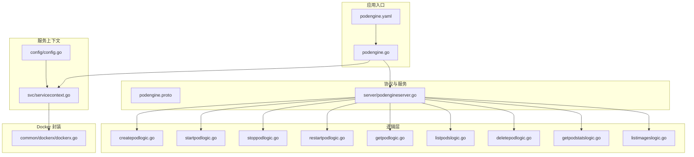
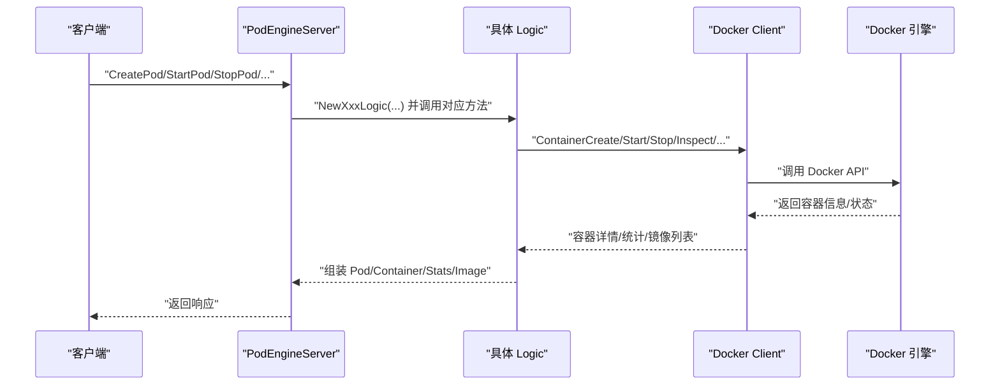
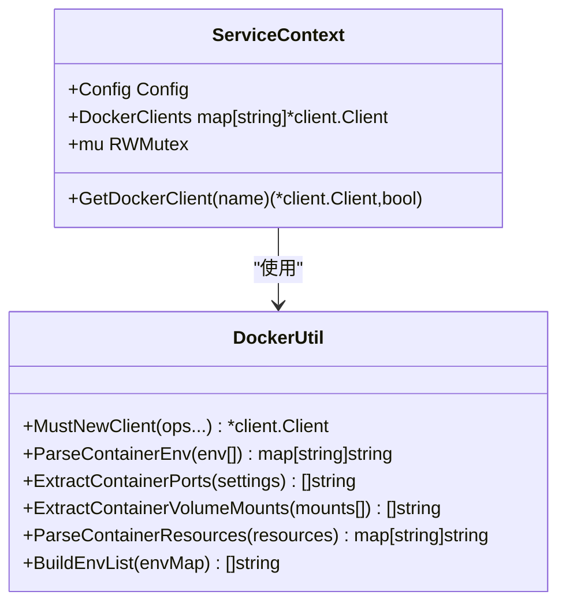
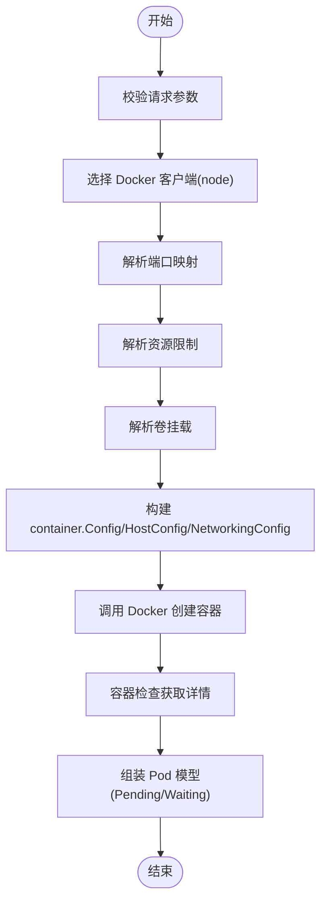
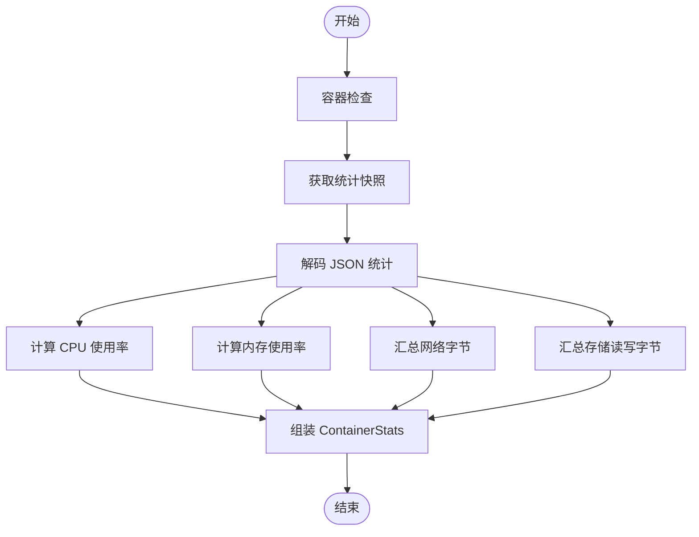
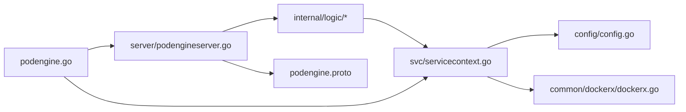

# 容器管理服务

<cite>
**本文引用的文件**
- [app/podengine/podengine.go](file://app/podengine/podengine.go)
- [app/podengine/etc/podengine.yaml](file://app/podengine/etc/podengine.yaml)
- [app/podengine/podengine.proto](file://app/podengine/podengine.proto)
- [common/dockerx/dockerx.go](file://common/dockerx/dockerx.go)
- [app/podengine/internal/config/config.go](file://app/podengine/internal/config/config.go)
- [app/podengine/internal/svc/servicecontext.go](file://app/podengine/internal/svc/servicecontext.go)
- [app/podengine/internal/server/podengineserver.go](file://app/podengine/internal/server/podengineserver.go)
- [app/podengine/internal/logic/createpodlogic.go](file://app/podengine/internal/logic/createpodlogic.go)
- [app/podengine/internal/logic/startpodlogic.go](file://app/podengine/internal/logic/startpodlogic.go)
- [app/podengine/internal/logic/stoppodlogic.go](file://app/podengine/internal/logic/stoppodlogic.go)
- [app/podengine/internal/logic/restartpodlogic.go](file://app/podengine/internal/logic/restartpodlogic.go)
- [app/podengine/internal/logic/getpodlogic.go](file://app/podengine/internal/logic/getpodlogic.go)
- [app/podengine/internal/logic/listpodslogic.go](file://app/podengine/internal/logic/listpodslogic.go)
- [app/podengine/internal/logic/deletepodlogic.go](file://app/podengine/internal/logic/deletepodlogic.go)
- [app/podengine/internal/logic/getpodstatslogic.go](file://app/podengine/internal/logic/getpodstatslogic.go)
- [app/podengine/internal/logic/listimageslogic.go](file://app/podengine/internal/logic/listimageslogic.go)
</cite>

## 目录
1. [简介](#简介)
2. [项目结构](#项目结构)
3. [核心组件](#核心组件)
4. [架构总览](#架构总览)
5. [详细组件分析](#详细组件分析)
6. [依赖分析](#依赖分析)
7. [性能考量](#性能考量)
8. [故障排除指南](#故障排除指南)
9. [结论](#结论)
10. [附录](#附录)

## 简介
本技术文档面向容器管理服务（PodEngine），系统性阐述其在 Docker 容器运行时上的 Pod 生命周期管理能力，覆盖 Pod 创建、启动、停止、重启、删除、查询、列表、统计与镜像管理等核心功能。文档同时给出与 Kubernetes 的适配思路（以抽象模型与字段映射的方式），并说明设备点映射相关的扩展建议（通过标签与注解承载设备元数据）。内容包含 API 接口定义、配置参数说明、安全注意事项、使用场景、最佳实践与故障排除指引。

## 项目结构
PodEngine 采用 go-zero 微服务框架，按 RPC 服务组织代码，核心目录与职责如下：
- 应用入口与配置
  - 入口程序：app/podengine/podengine.go
  - 配置文件：app/podengine/etc/podengine.yaml
- 协议与服务定义
  - gRPC 接口定义：app/podengine/podengine.proto
- 服务上下文与依赖注入
  - 配置结构：app/podengine/internal/config/config.go
  - 服务上下文（Docker 客户端池）：app/podengine/internal/svc/servicecontext.go
  - gRPC 服务端实现：app/podengine/internal/server/podengineserver.go
- 业务逻辑层（每个 RPC 对应一个 Logic）
  - 创建：internal/logic/createpodlogic.go
  - 启动：internal/logic/startpodlogic.go
  - 停止：internal/logic/stoppodlogic.go
  - 重启：internal/logic/restartpodlogic.go
  - 查询：internal/logic/getpodlogic.go
  - 列表：internal/logic/listpodslogic.go
  - 删除：internal/logic/deletepodlogic.go
  - 统计：internal/logic/getpodstatslogic.go
  - 镜像列表：internal/logic/listimageslogic.go
- Docker 封装工具
  - common/dockerx/dockerx.go

图表来源
- [app/podengine/podengine.go:27-67](file://app/podengine/podengine.go#L27-L67)
- [app/podengine/etc/podengine.yaml:1-20](file://app/podengine/etc/podengine.yaml#L1-L20)
- [app/podengine/podengine.proto:16-26](file://app/podengine/podengine.proto#L16-L26)
- [app/podengine/internal/server/podengineserver.go:26-69](file://app/podengine/internal/server/podengineserver.go#L26-L69)
- [app/podengine/internal/config/config.go:5-17](file://app/podengine/internal/config/config.go#L5-L17)
- [app/podengine/internal/svc/servicecontext.go:18-50](file://app/podengine/internal/svc/servicecontext.go#L18-L50)
- [common/dockerx/dockerx.go:11-94](file://common/dockerx/dockerx.go#L11-L94)

章节来源
- [app/podengine/podengine.go:27-67](file://app/podengine/podengine.go#L27-L67)
- [app/podengine/etc/podengine.yaml:1-20](file://app/podengine/etc/podengine.yaml#L1-L20)
- [app/podengine/internal/config/config.go:5-17](file://app/podengine/internal/config/config.go#L5-L17)
- [app/podengine/internal/svc/servicecontext.go:18-50](file://app/podengine/internal/svc/servicecontext.go#L18-L50)

## 核心组件
- 服务入口与注册
  - 读取配置、构建 ServiceContext、初始化 gRPC 服务器、注册 PodEngine 服务、可选开启反射、注册到 Nacos。
- 服务上下文
  - 维护 Docker 客户端池（支持本地与远程节点），按 node 名称选择对应客户端。
- gRPC 服务端
  - 将每个 RPC 方法委托给对应的 Logic。
- 逻辑层
  - 每个方法负责参数校验、Docker 客户端选择、调用 Docker API、组装返回模型。
- Docker 工具
  - 提供环境变量解析、端口提取、卷挂载解析、资源解析、反向构造环境列表等。

章节来源
- [app/podengine/podengine.go:27-67](file://app/podengine/podengine.go#L27-L67)
- [app/podengine/internal/svc/servicecontext.go:18-50](file://app/podengine/internal/svc/servicecontext.go#L18-L50)
- [app/podengine/internal/server/podengineserver.go:26-69](file://app/podengine/internal/server/podengineserver.go#L26-L69)
- [common/dockerx/dockerx.go:20-94](file://common/dockerx/dockerx.go#L20-L94)

## 架构总览
PodEngine 通过统一的 gRPC 接口抽象 Pod 生命周期与容器运行时细节，当前默认对接 Docker。协议层定义了 Pod、Container、PodSpec、ContainerSpec 等模型，并通过 node 字段支持多 Docker 节点（local 或远端主机）。服务端将请求路由到各 Logic，Logic 使用 Docker 客户端执行具体操作，并将 Docker 返回的数据转换为协议层模型。

图表来源
- [app/podengine/internal/server/podengineserver.go:26-69](file://app/podengine/internal/server/podengineserver.go#L26-L69)
- [app/podengine/internal/logic/createpodlogic.go:34-152](file://app/podengine/internal/logic/createpodlogic.go#L34-L152)
- [app/podengine/internal/logic/startpodlogic.go:29-87](file://app/podengine/internal/logic/startpodlogic.go#L29-L87)
- [app/podengine/internal/logic/getpodstatslogic.go:32-133](file://app/podengine/internal/logic/getpodstatslogic.go#L32-L133)
- [app/podengine/internal/logic/listimageslogic.go:30-110](file://app/podengine/internal/logic/listimageslogic.go#L30-L110)

## 详细组件分析

### 服务入口与配置
- 入口程序负责：
  - 解析命令行配置文件路径
  - 加载配置并构建 ServiceContext
  - 创建 gRPC 服务器并注册 PodEngine 服务
  - 开发/测试模式下启用反射
  - 可选将服务注册到 Nacos
  - 添加日志拦截器
- 配置项要点：
  - Name、ListenOn、Mode、Timeout、Log、NacosConfig、DockerConfig
  - DockerConfig 支持多节点（键名为节点名，值为 Docker 主机地址）

章节来源
- [app/podengine/podengine.go:27-67](file://app/podengine/podengine.go#L27-L67)
- [app/podengine/etc/podengine.yaml:1-20](file://app/podengine/etc/podengine.yaml#L1-L20)
- [app/podengine/internal/config/config.go:5-17](file://app/podengine/internal/config/config.go#L5-L17)

### 服务上下文与 Docker 客户端池
- ServiceContext 维护 DockerClients 映射，支持：
  - local 节点（从环境变量自动发现）
  - 多个命名节点（通过 DockerConfig 配置远端主机）
- GetDockerClient 支持空名或 "local" 映射到本地客户端

图表来源
- [app/podengine/internal/svc/servicecontext.go:11-50](file://app/podengine/internal/svc/servicecontext.go#L11-L50)
- [common/dockerx/dockerx.go:11-94](file://common/dockerx/dockerx.go#L11-L94)

章节来源
- [app/podengine/internal/svc/servicecontext.go:18-50](file://app/podengine/internal/svc/servicecontext.go#L18-L50)
- [common/dockerx/dockerx.go:11-94](file://common/dockerx/dockerx.go#L11-L94)

### gRPC 服务端与路由
- PodEngineServer 将每个 RPC 方法转发到对应 Logic，保持职责清晰与可测试性

章节来源
- [app/podengine/internal/server/podengineserver.go:26-69](file://app/podengine/internal/server/podengineserver.go#L26-L69)

### Pod 生命周期管理

#### 创建 Pod（CreatePod）
- 输入：node、name、PodSpec（含容器规格、标签、注解、重启策略、优雅停止时间、网络模式/名称、资源、卷挂载、端口）
- 流程：
  - 参数校验与节点选择
  - 解析端口、资源、卷挂载
  - 设置终止宽限期
  - 调用 Docker 创建容器并返回容器 ID
  - 立即检查容器信息，组装 Pod（初始 Phase 为 Pending，容器状态 Waiting）
- 关键点：
  - 网络模式优先使用 NetworkName（若提供），否则使用 NetworkMode
  - host 端口绑定仅在网络模式非 host/none 时生效
  - 仅取 PodSpec 中第一个容器作为主容器进行创建

图表来源
- [app/podengine/internal/logic/createpodlogic.go:34-152](file://app/podengine/internal/logic/createpodlogic.go#L34-L152)
- [app/podengine/internal/logic/createpodlogic.go:154-187](file://app/podengine/internal/logic/createpodlogic.go#L154-L187)
- [app/podengine/internal/logic/createpodlogic.go:189-222](file://app/podengine/internal/logic/createpodlogic.go#L189-L222)
- [app/podengine/internal/logic/createpodlogic.go:267-287](file://app/podengine/internal/logic/createpodlogic.go#L267-L287)

章节来源
- [app/podengine/internal/logic/createpodlogic.go:34-152](file://app/podengine/internal/logic/createpodlogic.go#L34-L152)

#### 启动 Pod（StartPod）
- 输入：node、id
- 流程：
  - 调用 Docker 启动容器
  - 检查容器信息，组装 Pod（Phase=Running，容器 Running=true）

章节来源
- [app/podengine/internal/logic/startpodlogic.go:29-87](file://app/podengine/internal/logic/startpodlogic.go#L29-L87)

#### 停止 Pod（StopPod）
- 输入：node、id、force
- 流程：
  - 调用 Docker 停止容器（支持强制停止）
  - 检查容器信息确认状态

章节来源
- [app/podengine/internal/logic/stoppodlogic.go:28-48](file://app/podengine/internal/logic/stoppodlogic.go#L28-L48)

#### 重启 Pod（RestartPod）
- 输入：node、id
- 流程：
  - 调用 Docker 重启容器
  - 检查容器信息，组装 Pod（Phase=Running）

章节来源
- [app/podengine/internal/logic/restartpodlogic.go:30-83](file://app/podengine/internal/logic/restartpodlogic.go#L30-L83)

#### 删除 Pod（DeletePod）
- 输入：node、id、force、removeVolumes
- 流程：
  - 调用 Docker 删除容器（支持强制与移除卷）

章节来源
- [app/podengine/internal/logic/deletepodlogic.go:28-49](file://app/podengine/internal/logic/deletepodlogic.go#L28-L49)

#### 查询 Pod（GetPod）
- 输入：node、id
- 流程：
  - 容器检查，计算 PodPhase 与 ContainerState
  - 填充标签、网络模式、时间戳等

章节来源
- [app/podengine/internal/logic/getpodlogic.go:31-77](file://app/podengine/internal/logic/getpodlogic.go#L31-L77)
- [app/podengine/internal/logic/getpodlogic.go:80-116](file://app/podengine/internal/logic/getpodlogic.go#L80-L116)

#### 列出 Pods（ListPods）
- 输入：node、limit、offset、names、ids、labels
- 流程：
  - 构造 Docker 过滤条件（id/name/label）
  - 获取容器列表并映射为 ListPodItem

章节来源
- [app/podengine/internal/logic/listpodslogic.go:31-124](file://app/podengine/internal/logic/listpodslogic.go#L31-L124)
- [app/podengine/internal/logic/listpodslogic.go:126-139](file://app/podengine/internal/logic/listpodslogic.go#L126-L139)

### 容器状态监控与统计（GetPodStats）
- 输入：node、id
- 流程：
  - 容器检查获取基础信息
  - 获取一次性的统计快照（非流式）
  - 计算 CPU 使用率、内存使用率、网络收发字节、存储读写字节
  - 组装 ContainerStats（含展示用字符串）

图表来源
- [app/podengine/internal/logic/getpodstatslogic.go:32-133](file://app/podengine/internal/logic/getpodstatslogic.go#L32-L133)

章节来源
- [app/podengine/internal/logic/getpodstatslogic.go:32-133](file://app/podengine/internal/logic/getpodstatslogic.go#L32-L133)

### 镜像管理（ListImages）
- 输入：node、limit、offset、references、includeDigests
- 流程：
  - 构造镜像过滤条件（reference）
  - 列出镜像并可选获取镜像摘要
  - 分页截取结果

章节来源
- [app/podengine/internal/logic/listimageslogic.go:30-110](file://app/podengine/internal/logic/listimageslogic.go#L30-L110)

### Docker 容器接口封装
- 环境变量解析与构建
- 端口映射提取（HostIP:HostPort->ContainerPort/Protocol）
- 卷挂载提取（source:destination:[rw|ro]）
- 资源解析（CPUQuota/CPUShares、Memory/MemoryReservation）
- 反向构建环境列表

章节来源
- [common/dockerx/dockerx.go:20-94](file://common/dockerx/dockerx.go#L20-L94)

### 与 Kubernetes 的集成方案
- 抽象模型映射
  - PodSpec -> Docker 容器配置（镜像、环境、命令、资源、卷、端口、网络、重启策略、优雅停止）
  - Pod/Container 状态 -> Docker 容器状态（Running/Exited/Created/Stopped）
- 调度与节点
  - node 字段用于标识目标 Docker 节点（可指向远端 Docker 主机）
  - 通过 DockerConfig 配置多个节点
- 集群状态同步
  - 通过 ListPods/ListImages 等接口定期轮询，将容器状态映射为 Pod 阶段
  - 通过 labels/annotations 承载元数据，便于上层编排系统识别
- 注意事项
  - 当前实现基于 Docker；若接入 Kubernetes，需在 Logic 层替换为 Kubernetes API（如使用 client-go），并保持协议层不变

章节来源
- [app/podengine/podengine.proto:162-178](file://app/podengine/podengine.proto#L162-L178)
- [app/podengine/podengine.proto:124-155](file://app/podengine/podengine.proto#L124-L155)
- [app/podengine/internal/logic/createpodlogic.go:49-106](file://app/podengine/internal/logic/createpodlogic.go#L49-L106)
- [app/podengine/internal/logic/listpodslogic.go:40-64](file://app/podengine/internal/logic/listpodslogic.go#L40-L64)

### 设备点映射功能（扩展建议）
- 当前协议未直接定义设备点映射实体，建议通过以下方式扩展：
  - 使用 PodSpec.Annotations 承载设备点元数据（如设备类型、序列号、所属区域）
  - 使用 PodSpec.Labels 标识设备归属（便于过滤与调度）
  - 在容器 HostConfig 中通过 Mounts/Devices 等字段绑定设备（需结合运行时能力）
  - 动态绑定与状态更新：通过 ListPods/GetPod 获取设备相关标签，结合外部设备中心进行联动
- 该扩展不改变现有 API，仅在调用侧增加对设备元数据的处理

章节来源
- [app/podengine/podengine.proto:131-155](file://app/podengine/podengine.proto#L131-L155)
- [app/podengine/internal/logic/listpodslogic.go:69-108](file://app/podengine/internal/logic/listpodslogic.go#L69-L108)

## 依赖分析
- 组件耦合
  - server 仅依赖 svc 与 logic，低耦合高内聚
  - logic 依赖 svc（获取 Docker 客户端）与 common/dockerx
  - svc 依赖 common/dockerx 与配置
- 外部依赖
  - Docker SDK（github.com/docker/docker）
  - go-zero（zrpc、conf、logx）
  - 可选 Nacos 注册中心
- 潜在风险
  - Docker 客户端错误或不可达会导致 RPC 失败
  - 多节点客户端并发访问需注意锁保护（当前通过 RWMutex 保护）

图表来源
- [app/podengine/internal/server/podengineserver.go:26-69](file://app/podengine/internal/server/podengineserver.go#L26-L69)
- [app/podengine/internal/svc/servicecontext.go:18-50](file://app/podengine/internal/svc/servicecontext.go#L18-L50)
- [app/podengine/internal/config/config.go:5-17](file://app/podengine/internal/config/config.go#L5-L17)
- [common/dockerx/dockerx.go:11-18](file://common/dockerx/dockerx.go#L11-L18)
- [app/podengine/podengine.proto:16-26](file://app/podengine/podengine.proto#L16-L26)
- [app/podengine/podengine.go:37-43](file://app/podengine/podengine.go#L37-L43)

章节来源
- [app/podengine/internal/server/podengineserver.go:26-69](file://app/podengine/internal/server/podengineserver.go#L26-L69)
- [app/podengine/internal/svc/servicecontext.go:18-50](file://app/podengine/internal/svc/servicecontext.go#L18-L50)
- [app/podengine/internal/config/config.go:5-17](file://app/podengine/internal/config/config.go#L5-L17)
- [common/dockerx/dockerx.go:11-18](file://common/dockerx/dockerx.go#L11-L18)

## 性能考量
- 统计接口
  - GetPodStats 采用一次性统计快照，避免长连接与流式开销，适合周期性采集
- 列表与过滤
  - ListPods/ListImages 使用 Docker 过滤器减少返回数据量
- 资源解析
  - 资源解析与字符串格式化在逻辑层完成，避免重复计算
- 并发与锁
  - Docker 客户端池读写分离（RWMutex），降低锁竞争

章节来源
- [app/podengine/internal/logic/getpodstatslogic.go:49-59](file://app/podengine/internal/logic/getpodstatslogic.go#L49-L59)
- [app/podengine/internal/logic/listpodslogic.go:40-64](file://app/podengine/internal/logic/listpodslogic.go#L40-L64)
- [app/podengine/internal/svc/servicecontext.go:43-49](file://app/podengine/internal/svc/servicecontext.go#L43-L49)

## 故障排除指南
- 常见错误与定位
  - 节点不存在：node 未在 DockerConfig 中配置或名称不匹配
  - 容器创建失败：镜像拉取、端口冲突、资源限制不合法、卷挂载路径无效
  - 容器启动失败：入口命令/参数错误、环境变量缺失、权限不足
  - 统计接口失败：容器已停止或不存在、Docker 统计数据不可用
- 建议排查步骤
  - 检查配置文件与节点连通性
  - 使用 GetPod/GetPodStats 获取容器详细状态与统计
  - 查看服务日志（日志级别与输出路径在配置中设置）
  - 在目标节点手动验证 Docker 命令可用性
- 错误处理位置
  - 逻辑层在关键调用后记录错误并返回包装后的错误
  - gRPC 层返回标准错误码与消息

章节来源
- [app/podengine/internal/logic/createpodlogic.go:107-117](file://app/podengine/internal/logic/createpodlogic.go#L107-L117)
- [app/podengine/internal/logic/startpodlogic.go:40-51](file://app/podengine/internal/logic/startpodlogic.go#L40-L51)
- [app/podengine/internal/logic/getpodstatslogic.go:49-59](file://app/podengine/internal/logic/getpodstatslogic.go#L49-L59)
- [app/podengine/etc/podengine.yaml:5-11](file://app/podengine/etc/podengine.yaml#L5-L11)

## 结论
PodEngine 通过统一的 gRPC 接口实现了对 Docker 容器的全生命周期管理，并提供了资源限制、端口映射、卷挂载、状态监控与镜像管理等关键能力。其抽象模型为后续对接 Kubernetes 提供了良好基础。通过合理的配置与扩展（如设备点映射元数据），可在不破坏协议兼容的前提下满足更复杂的运维与编排需求。

## 附录

### API 接口定义（概览）
- CreatePod：创建 Pod（容器）
- StartPod：启动 Pod（容器）
- StopPod：停止 Pod（容器）
- RestartPod：重启 Pod（容器）
- GetPod：查询单个 Pod
- ListPods：列出 Pods（支持分页与过滤）
- DeletePod：删除 Pod（容器）
- GetPodStats：获取容器统计
- ListImages：列出镜像（支持过滤与摘要）

章节来源
- [app/podengine/podengine.proto:16-26](file://app/podengine/podengine.proto#L16-L26)

### 配置参数说明
- Name：服务名称
- ListenOn：监听地址
- Mode：运行模式（dev/test/prod）
- Timeout：请求超时（毫秒）
- Log：日志配置（编码、路径、级别、保留天数）
- NacosConfig：服务注册配置（开关、主机、端口、用户名、密码、命名空间、服务名）
- DockerConfig：Docker 节点配置（键为节点名，值为 Docker 主机地址）

章节来源
- [app/podengine/etc/podengine.yaml:1-20](file://app/podengine/etc/podengine.yaml#L1-L20)
- [app/podengine/internal/config/config.go:7-16](file://app/podengine/internal/config/config.go#L7-L16)

### 安全考虑
- 网络与端口
  - 仅在需要时暴露端口，避免将 Host 端口绑定到 0.0.0.0
- 资源限制
  - 合理设置 CPU 限额与内存限额，防止资源争抢
- 权限与隔离
  - 非必要不使用特权模式；谨慎挂载宿主机目录
- 认证与注册
  - 生产环境建议启用 Nacos 认证与 TLS；限制服务暴露范围

章节来源
- [app/podengine/internal/logic/createpodlogic.go:90-98](file://app/podengine/internal/logic/createpodlogic.go#L90-L98)
- [app/podengine/internal/logic/createpodlogic.go:154-170](file://app/podengine/internal/logic/createpodlogic.go#L154-L170)
- [app/podengine/podengine.go:44-61](file://app/podengine/podengine.go#L44-L61)

### 使用场景与最佳实践
- 场景
  - 边缘节点容器化部署与运维
  - 多节点 Docker 集群统一管理
  - 设备侧容器运行时（通过标签/注解承载设备元数据）
- 最佳实践
  - 使用 labels/annotations 管理元数据与分类
  - 合理设置优雅停止时间，确保服务平滑退出
  - 定期调用 GetPodStats 进行健康监控
  - 通过 ListImages 控制镜像版本与清理策略

章节来源
- [app/podengine/internal/logic/getpodstatslogic.go:32-133](file://app/podengine/internal/logic/getpodstatslogic.go#L32-L133)
- [app/podengine/internal/logic/listimageslogic.go:30-110](file://app/podengine/internal/logic/listimageslogic.go#L30-L110)