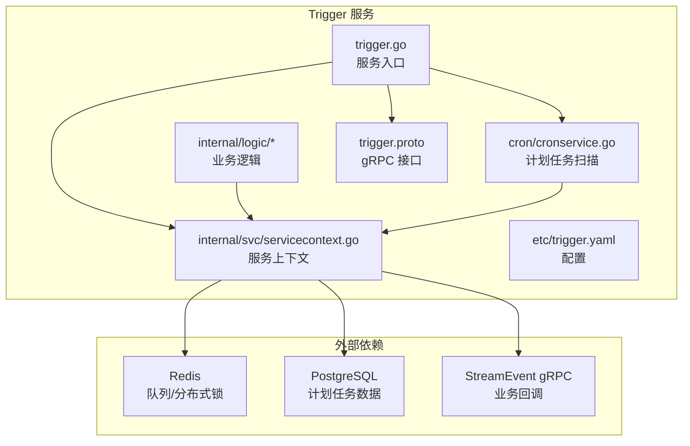
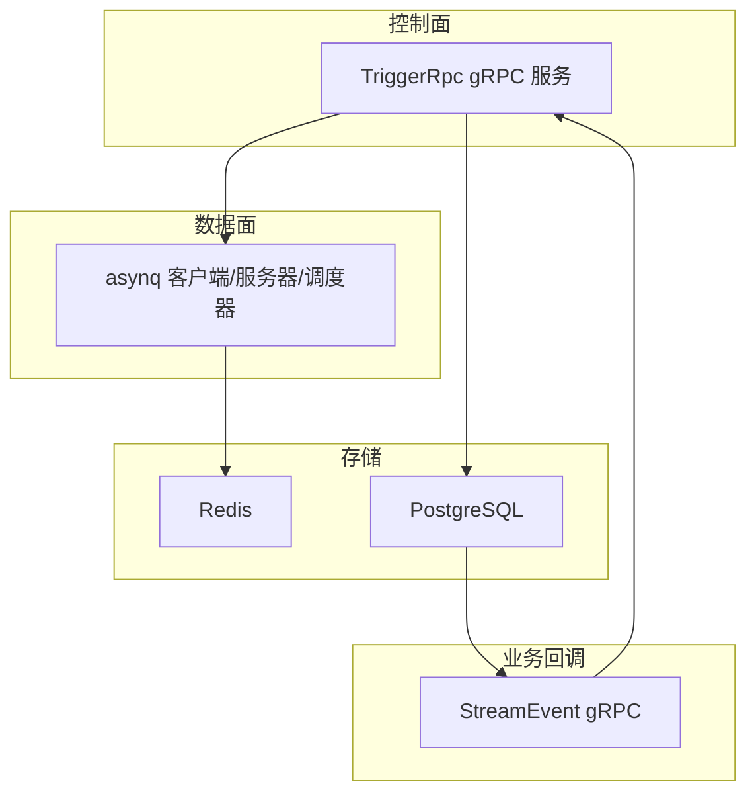
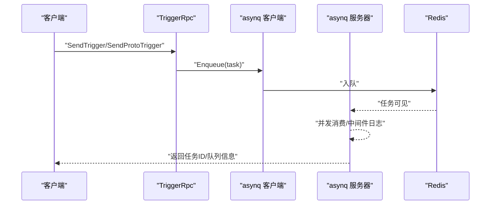
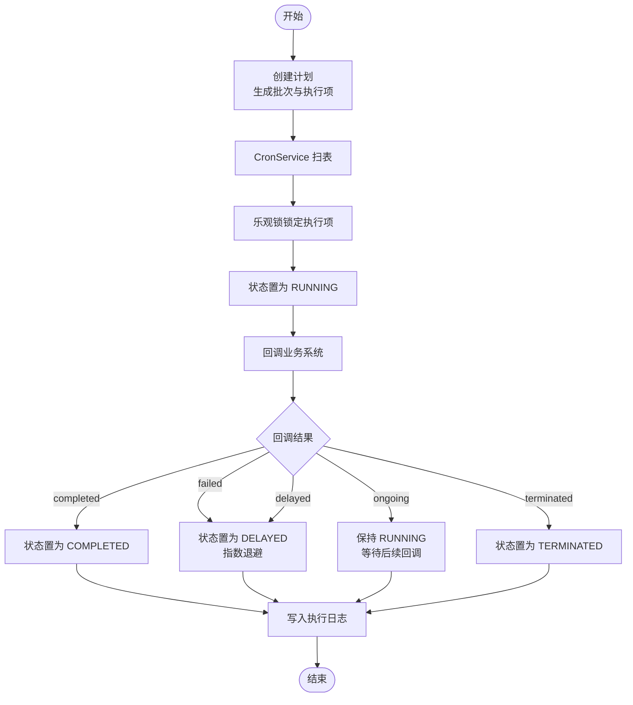
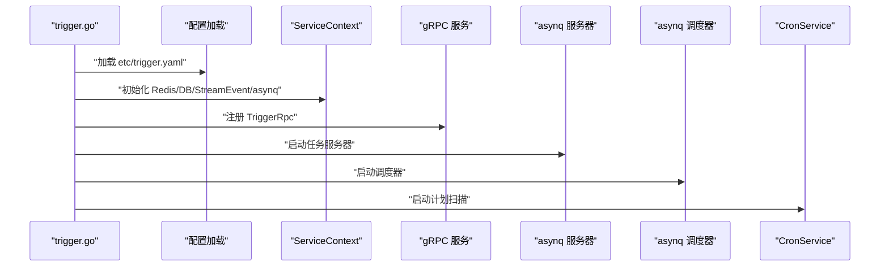
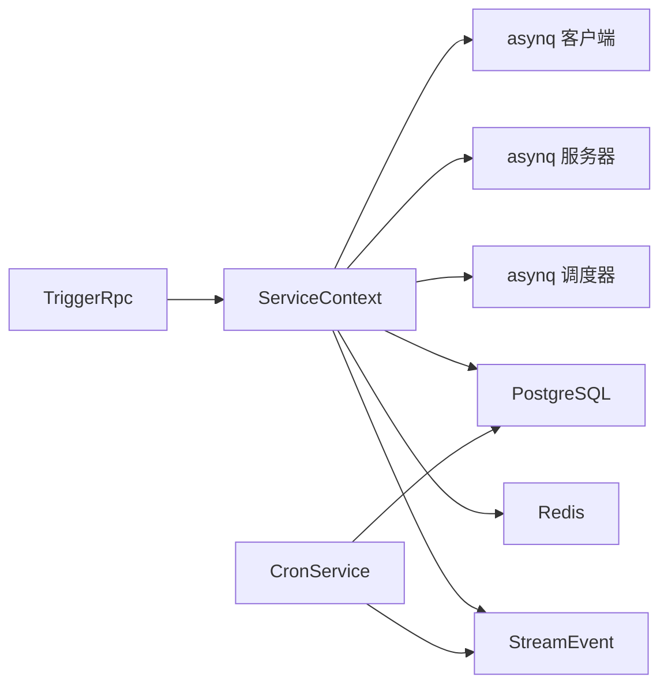

# 异步任务调度服务

<cite>
**本文引用的文件**
- [trigger.proto](file://app/trigger/trigger.proto)
- [trigger.go](file://app/trigger/trigger.go)
- [trigger.yaml](file://app/trigger/etc/trigger.yaml)
- [config.go](file://app/trigger/internal/config/config.go)
- [servicecontext.go](file://app/trigger/internal/svc/servicecontext.go)
- [sendtriggerlogic.go](file://app/trigger/internal/logic/sendtriggerlogic.go)
- [sendprototriggerlogic.go](file://app/trigger/internal/logic/sendprototriggerlogic.go)
- [callbackplanexecitemlogic.go](file://app/trigger/internal/logic/callbackplanexecitemlogic.go)
- [createplantasklogic.go](file://app/trigger/internal/logic/createplantasklogic.go)
- [cronservice.go](file://app/trigger/cron/cronservice.go)
- [tasktype.go](file://common/asynqx/tasktype.go)
- [asynqClient.go](file://common/asynqx/asynqClient.go)
- [asynqTaskServer.go](file://common/asynqx/asynqTaskServer.go)
- [trigger.md](file://docs/trigger.md)
</cite>

## 目录
1. [简介](#简介)
2. [项目结构](#项目结构)
3. [核心组件](#核心组件)
4. [架构总览](#架构总览)
5. [详细组件分析](#详细组件分析)
6. [依赖分析](#依赖分析)
7. [性能考虑](#性能考虑)
8. [故障排查指南](#故障排查指南)
9. [结论](#结论)
10. [附录](#附录)

## 简介
Trigger 是基于 go-zero 的异步任务调度服务，提供两大核心能力：
- 异步任务调度：基于 asynq 的分布式任务队列，支持定时/延时回调与一次性任务，覆盖 HTTP POST JSON 回调与 gRPC Proto 字节码回调两类触发方式。
- 计划任务管理：自研数据库扫描引擎，实现周期性计划任务的全生命周期管理，包含创建、暂停、恢复、终止、立即执行、回调确认、统计与日志等。

服务通过 gRPC 提供统一接口，内部结合 Redis 作为队列与分布式锁，PostgreSQL 存储计划任务相关数据，并通过 StreamEvent 服务回调业务系统。

## 项目结构
Trigger 服务位于 app/trigger 目录，核心目录与文件如下：
- 协议定义：trigger.proto（gRPC 接口与消息模型）
- 配置：etc/trigger.yaml（服务监听、日志、Nacos 注册、Redis、DB、StreamEvent 等）
- 服务入口：trigger.go（加载配置、启动 RPC 服务、注册 asynq 任务服务器与调度器、启动 CronService）
- 服务上下文：internal/svc/servicecontext.go（初始化 asynq 客户端/服务器/调度器、数据库、Redis、StreamEvent 客户端、ID 生成器等）
- 逻辑层：internal/logic/*（任务发送、计划任务创建、回调处理等）
- 计划任务扫描：cron/cronservice.go（基于数据库扫描的 CronService，负责触发计划执行项）
- 公共工具：common/asynqx/*（asynq 客户端、服务器、任务类型常量、OpenTelemetry 集成）

图表来源
- [trigger.go:34-88](file://app/trigger/trigger.go#L34-L88)
- [servicecontext.go:50-91](file://app/trigger/internal/svc/servicecontext.go#L50-L91)
- [trigger.yaml:1-38](file://app/trigger/etc/trigger.yaml#L1-L38)

章节来源
- [trigger.go:34-88](file://app/trigger/trigger.go#L34-L88)
- [trigger.yaml:1-38](file://app/trigger/etc/trigger.yaml#L1-L38)
- [config.go:9-27](file://app/trigger/internal/config/config.go#L9-L27)

## 核心组件
- asynq 集成
  - 客户端/检查器：用于 Enqueue 任务与查询队列状态
  - 服务器：承载任务消费，配置并发与队列权重
  - 调度器：基于 Cron 表达式进行定时任务注册
  - OpenTelemetry 集成：生产者/消费者 Span 标注任务类型
- 计划任务引擎
  - CronService：周期扫描数据库中待触发的执行项，加分布式锁后回调业务系统
  - 业务回调：通过 StreamEvent gRPC 将计划任务事件传递给业务系统
  - 状态机：WAITING → RUNNING → COMPLETED/DELAYED/PAUSED/TERMINATED
- gRPC 接口
  - 异步任务：SendTrigger、SendProtoTrigger
  - 计划任务：CreatePlanTask、Pause/Resume/Terminate、CallbackPlanExecItem、查询与统计接口

章节来源
- [asynqClient.go:17-23](file://common/asynqx/asynqClient.go#L17-L23)
- [asynqTaskServer.go:39-64](file://common/asynqx/asynqTaskServer.go#L39-L64)
- [cronservice.go:25-79](file://app/trigger/cron/cronservice.go#L25-L79)
- [trigger.proto:13-106](file://app/trigger/trigger.proto#L13-L106)

## 架构总览
Trigger 服务采用“gRPC 控制面 + asynq 数据面 + 数据库 + 业务回调”的分层架构：
- 控制面：gRPC 接口接收任务与计划任务管理请求
- 数据面：asynq 负责任务持久化、调度与执行
- 存储：Redis 作为队列与分布式锁；PostgreSQL 存储计划任务元数据
- 回调：通过 StreamEvent gRPC 将计划任务事件推送至业务系统

图表来源
- [trigger.go:46-84](file://app/trigger/trigger.go#L46-L84)
- [servicecontext.go:65-89](file://app/trigger/internal/svc/servicecontext.go#L65-L89)
- [trigger.md:14-69](file://docs/trigger.md#L14-L69)

## 详细组件分析

### 异步任务调度（基于 asynq）
- 任务类型
  - 延迟 HTTP 触发：defer:triggerTask
  - 延迟 gRPC Proto 触发：defer:triggerProtoTask
  - 定时调度任务：scheduler:defer:task
- 任务发送流程
  - SendTrigger：校验参数、注入 OpenTelemetry 上下文、构造消息体、设置队列与保留期、按触发时间或延时入队
  - SendProtoTrigger：校验 gRPC 地址格式、注入 OpenTelemetry 上下文、构造 Proto 消息体、按触发时间或延时入队
- 任务消费与监控
  - asynq 服务器：配置并发与队列权重（critical/default/low），中间件记录处理耗时与错误
  - OpenTelemetry：生产者/消费者 Span 标注任务类型，便于链路追踪

图表来源
- [sendtriggerlogic.go:37-104](file://app/trigger/internal/logic/sendtriggerlogic.go#L37-L104)
- [sendprototriggerlogic.go:40-100](file://app/trigger/internal/logic/sendprototriggerlogic.go#L40-L100)
- [asynqTaskServer.go:28-37](file://common/asynqx/asynqTaskServer.go#L28-L37)

章节来源
- [tasktype.go:3-9](file://common/asynqx/tasktype.go#L3-L9)
- [sendtriggerlogic.go:37-104](file://app/trigger/internal/logic/sendtriggerlogic.go#L37-L104)
- [sendprototriggerlogic.go:40-100](file://app/trigger/internal/logic/sendprototriggerlogic.go#L40-L100)
- [asynqTaskServer.go:39-64](file://common/asynqx/asynqTaskServer.go#L39-L64)

### 计划任务管理（自研引擎）
- 数据模型与生命周期
  - Plan（计划）→ Batch（批次）→ ExecItem（执行项）→ PlanExecLog（执行日志）
  - 扫表索引：(del_state, next_trigger_time, status)，支持高效扫描
- 执行流程
  - 创建计划：解析 rrule，生成批次与执行项，支持间隔类型与偏移
  - CronService 扫表：乐观锁锁定待触发执行项，更新为 RUNNING，回调业务系统
  - 回调处理：业务系统通过 CallbackPlanExecItem 返回结果，服务据此更新状态并写入日志
  - 状态机：WAITING → RUNNING → COMPLETED/DELAYED/PAUSED/TERMINATED
- 重试与退避
  - 首次失败后 10 秒重试，指数退避至 30 分钟封顶，最多 25 次重试
  - 使用 Redis 分布式锁避免并发回调冲突

图表来源
- [createplantasklogic.go:39-250](file://app/trigger/internal/logic/createplantasklogic.go#L39-L250)
- [cronservice.go:81-184](file://app/trigger/cron/cronservice.go#L81-L184)
- [callbackplanexecitemlogic.go:39-246](file://app/trigger/internal/logic/callbackplanexecitemlogic.go#L39-L246)

章节来源
- [trigger.md:70-176](file://docs/trigger.md#L70-L176)
- [createplantasklogic.go:39-250](file://app/trigger/internal/logic/createplantasklogic.go#L39-L250)
- [cronservice.go:81-184](file://app/trigger/cron/cronservice.go#L81-L184)
- [callbackplanexecitemlogic.go:39-246](file://app/trigger/internal/logic/callbackplanexecitemlogic.go#L39-L246)

### 服务启动与集成
- 启动流程
  - 加载配置（trigger.yaml），初始化服务上下文（Redis、DB、StreamEvent 客户端、asynq 组件）
  - 启动 gRPC 服务，注册 TriggerRpc
  - 启动 asynq 任务服务器与调度器
  - 启动 CronService 扫描计划任务
  - 可选：注册到 Nacos
- 配置要点
  - 监听地址、日志、Redis、DB、StreamEvent、Nacos 等

图表来源
- [trigger.go:34-88](file://app/trigger/trigger.go#L34-L88)
- [servicecontext.go:50-91](file://app/trigger/internal/svc/servicecontext.go#L50-L91)
- [trigger.yaml:1-38](file://app/trigger/etc/trigger.yaml#L1-L38)

章节来源
- [trigger.go:34-88](file://app/trigger/trigger.go#L34-L88)
- [trigger.yaml:1-38](file://app/trigger/etc/trigger.yaml#L1-L38)
- [config.go:9-27](file://app/trigger/internal/config/config.go#L9-L27)

## 依赖分析
- 组件耦合
  - TriggerRpc 依赖 ServiceContext 中的 asynq 客户端与计划任务模型
  - CronService 依赖计划任务模型与 StreamEvent 客户端
  - asynq 服务器与调度器由 ServiceContext 统一注入
- 外部依赖
  - Redis：队列、分布式锁
  - PostgreSQL：计划任务元数据
  - StreamEvent：业务回调
  - Nacos：服务注册（可选）

图表来源
- [servicecontext.go:65-89](file://app/trigger/internal/svc/servicecontext.go#L65-L89)
- [trigger.go:77-84](file://app/trigger/trigger.go#L77-L84)

章节来源
- [servicecontext.go:65-89](file://app/trigger/internal/svc/servicecontext.go#L65-L89)
- [trigger.go:77-84](file://app/trigger/trigger.go#L77-L84)

## 性能考虑
- asynq 并发与队列权重
  - 并发：20
  - 队列权重：critical:6, default:3, low:1
- 队列保留期
  - 默认保留期 7 天，避免过期任务占用资源
- 扫表策略
  - 有待处理项时 10ms 扫描一次，无数据时 1-2 秒随机间隔，降低空闲 CPU 占用
- 重试退避
  - 指数退避至 30 分钟封顶，最多 25 次，避免雪崩效应
- 分布式锁
  - Redis 分布式锁确保回调幂等与一致性

章节来源
- [asynqTaskServer.go:55-64](file://common/asynqx/asynqTaskServer.go#L55-L64)
- [cronservice.go:62-78](file://app/trigger/cron/cronservice.go#L62-L78)
- [trigger.md:153-159](file://docs/trigger.md#L153-L159)

## 故障排查指南
- 任务无法入队/消费
  - 检查 Redis 连接配置与密码
  - 查看 asynq 服务器日志与并发配置
- 回调失败或重复
  - 检查 StreamEvent 服务可用性与超时设置
  - 确认 Redis 分布式锁是否正确释放
- 计划任务未触发
  - 检查 CronService 是否正常运行
  - 核对执行项状态与 next_trigger_time
- 重试异常
  - 查看指数退避与最大重试次数配置
  - 检查任务保留期与队列状态

章节来源
- [asynqTaskServer.go:28-37](file://common/asynqx/asynqTaskServer.go#L28-L37)
- [cronservice.go:38-79](file://app/trigger/cron/cronservice.go#L38-L79)
- [trigger.md:274-279](file://docs/trigger.md#L274-L279)

## 结论
Trigger 服务通过 asynq 与自研计划引擎实现了高可靠、可观测的异步任务调度能力。其清晰的职责分离、完善的监控与重试机制，使其适用于需要定时/延时回调与周期性巡检任务的复杂场景。建议在生产环境中结合 Nacos 服务注册、完善的日志与告警体系，持续优化队列权重与并发配置以满足业务峰值需求。

## 附录

### 任务类型与队列管理
- 任务类型
  - 延迟 HTTP 触发：defer:triggerTask
  - 延迟 gRPC Proto 触发：defer:triggerProtoTask
  - 定时调度任务：scheduler:defer:task
- 队列权重
  - critical:6, default:3, low:1
- 保留期
  - 默认 7 天

章节来源
- [tasktype.go:3-9](file://common/asynqx/tasktype.go#L3-L9)
- [asynqTaskServer.go:56-60](file://common/asynqx/asynqTaskServer.go#L56-L60)

### 任务发送 API 与参数
- SendTrigger
  - 参数：processIn、triggerTime、url、maxRetry、msgId、body
  - 队列：critical
  - 保留期：7 天
- SendProtoTrigger
  - 参数：processIn、triggerTime、maxRetry、msgId、grpcServer、method、payload、requestTimeout
  - 队列：critical
  - 保留期：7 天

章节来源
- [trigger.proto:216-286](file://app/trigger/trigger.proto#L216-L286)
- [sendtriggerlogic.go:54-66](file://app/trigger/internal/logic/sendtriggerlogic.go#L54-L66)
- [sendprototriggerlogic.go:75-76](file://app/trigger/internal/logic/sendprototriggerlogic.go#L75-L76)

### 计划任务 API 与状态机
- 计划任务 API
  - 创建：CreatePlanTask
  - 控制：PausePlan/ResumePlan/TerminatePlan
  - 批次：PausePlanBatch/ResumePlanBatch/TerminatePlanBatch
  - 执行项：PausePlanExecItem/ResumePlanExecItem/RunPlanExecItem/TerminatePlanExecItem
  - 回调：CallbackPlanExecItem
  - 查询与统计：GetPlan/ListPlans、GetPlanBatch/ListPlanBatches、GetPlanExecItem/ListPlanExecItems、GetPlanExecLog/ListPlanExecLogs、GetExecItemDashboard
- 状态机
  - WAITING → RUNNING → COMPLETED/DELAYED/PAUSED/TERMINATED

章节来源
- [trigger.proto:52-106](file://app/trigger/trigger.proto#L52-L106)
- [trigger.md:108-140](file://docs/trigger.md#L108-L140)

### 配置参数说明
- trigger.yaml
  - Name、ListenOn、Timeout、Log、NacosConfig、Redis、RedisDB、DB、StreamEventConf
- config.go
  - NacosConfig、RedisDB、DB、DisableStmtLog、GracePeriod、StreamEventConf

章节来源
- [trigger.yaml:1-38](file://app/trigger/etc/trigger.yaml#L1-L38)
- [config.go:9-27](file://app/trigger/internal/config/config.go#L9-L27)

### 最佳实践
- 任务优先级
  - 关键路径使用 critical 队列，非关键使用 default/low
- 重试策略
  - 合理设置 maxRetry 与 requestTimeout，避免无限重试
- 监控与追踪
  - 利用 OpenTelemetry 与日志中间件，定位任务耗时与错误
- 计划任务
  - 合理设置 intervalType 与 intervalTime，避免大量并发执行
  - 使用回调结果精细化控制状态迁移

章节来源
- [asynqTaskServer.go:73-86](file://common/asynqx/asynqTaskServer.go#L73-L86)
- [trigger.md:153-159](file://docs/trigger.md#L153-L159)