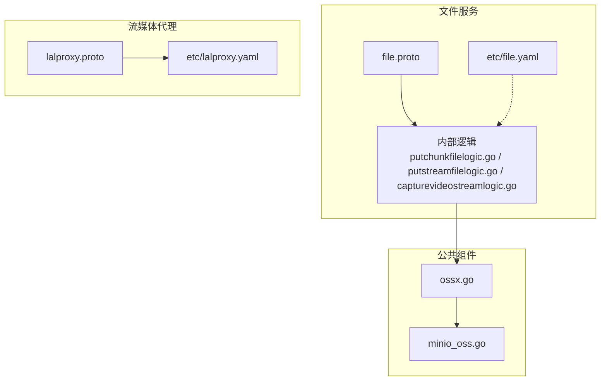
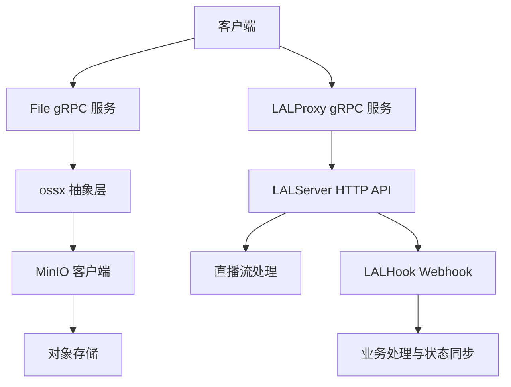
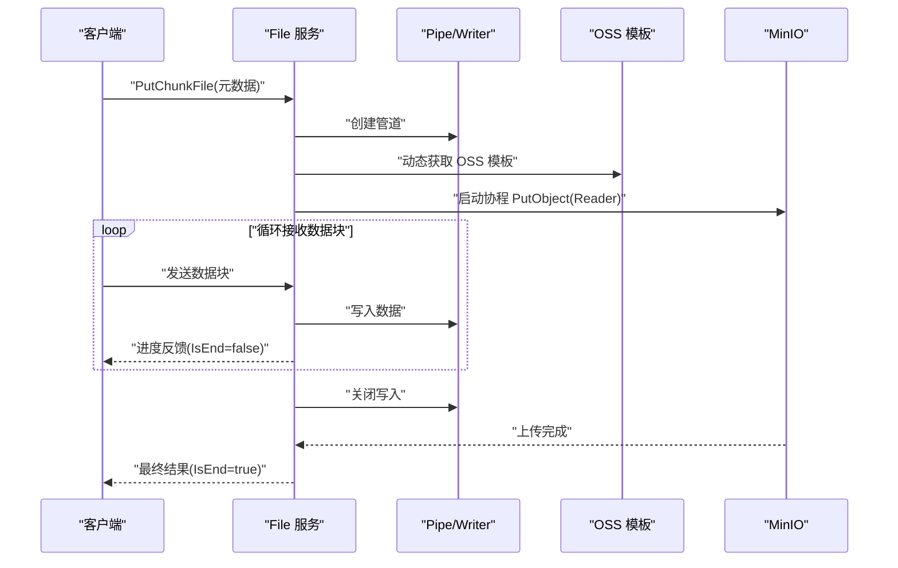
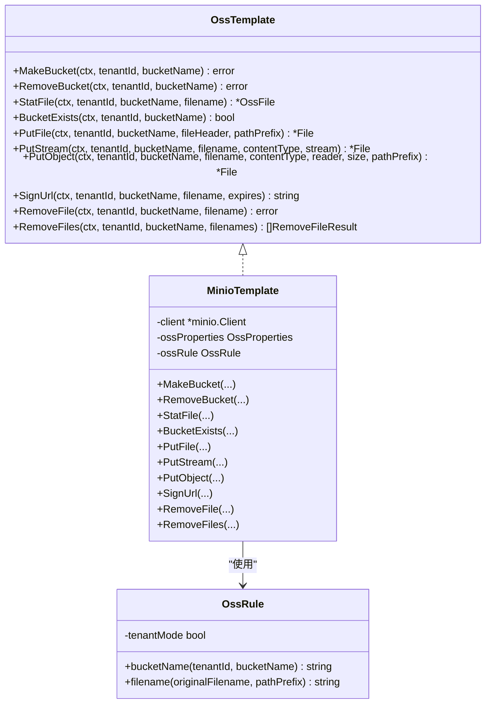
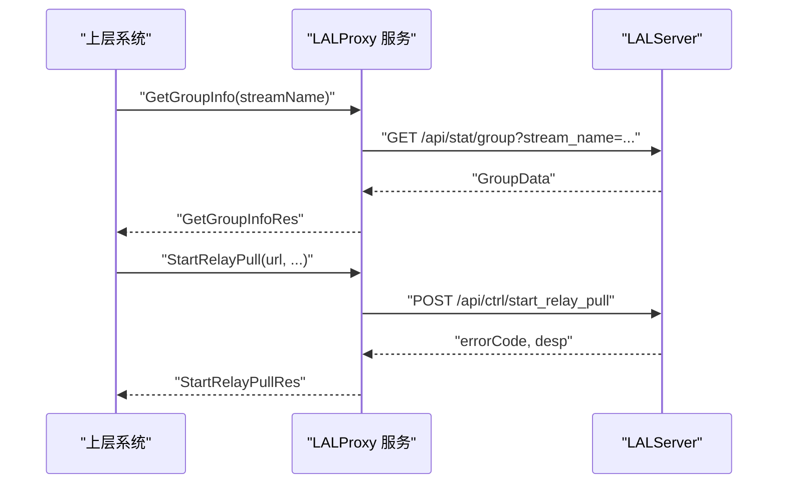
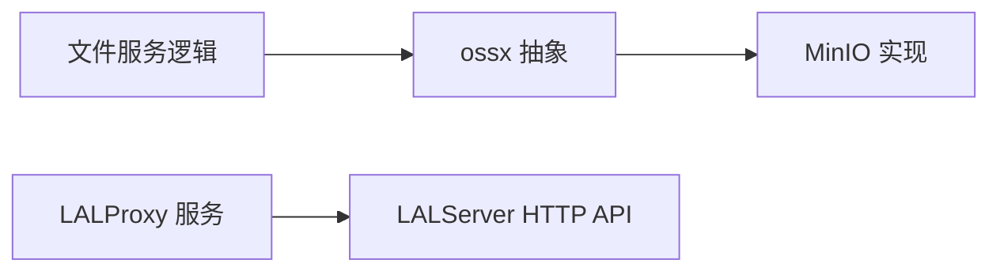

# 文件与流媒体服务

<cite>
**本文引用的文件**
- [file.proto](file://app/file/file.proto)
- [lalproxy.proto](file://app/lalproxy/lalproxy.proto)
- [ossx.go](file://common/ossx/ossx.go)
- [minio_oss.go](file://common/ossx/minio_oss.go)
- [file.yaml](file://app/file/etc/file.yaml)
- [lalproxy.yaml](file://app/lalproxy/etc/lalproxy.yaml)
- [putchunkfilelogic.go](file://app/file/internal/logic/putchunkfilelogic.go)
- [putstreamfilelogic.go](file://app/file/internal/logic/putstreamfilelogic.go)
- [capturevideostreamlogic.go](file://app/file/internal/logic/capturevideostreamlogic.go)
</cite>

## 目录
1. [简介](#简介)
2. [项目结构](#项目结构)
3. [核心组件](#核心组件)
4. [架构总览](#架构总览)
5. [详细组件分析](#详细组件分析)
6. [依赖分析](#依赖分析)
7. [性能考虑](#性能考虑)
8. [故障排查指南](#故障排查指南)
9. [结论](#结论)
10. [附录](#附录)

## 简介
本技术文档面向“文件与流媒体服务”，围绕以下目标展开：
- 文件服务（File）：分片上传（断点续传）、并发上传、文件校验与存储管理
- 对象存储集成：OSS 配置、URL 签名、文件列表与删除
- 流媒体钩子服务（LALHook）：Webhook 处理机制（直播事件监听、回调处理、状态同步）
- 流媒体代理服务（LALProxy）：流媒体处理（RTMP 推流、拉流代理、录制管理、HLS 转码）

文档提供 API 接口说明、配置参数解读、性能优化建议，并给出典型使用场景与集成示例。

## 项目结构
本仓库采用多模块微服务架构，文件与流媒体相关能力分布在如下模块：
- 文件服务：app/file
- 流媒体代理：app/lalproxy
- 公共对象存储封装：common/ossx
- 配置文件：各模块 etc/*.yaml
- 接口定义：各模块 *.proto

**图表来源**
- [file.proto:1-287](file://app/file/file.proto#L1-L287)
- [lalproxy.proto:1-308](file://app/lalproxy/lalproxy.proto#L1-L308)
- [ossx.go:1-152](file://common/ossx/ossx.go#L1-L152)
- [minio_oss.go:1-243](file://common/ossx/minio_oss.go#L1-L243)
- [file.yaml:1-23](file://app/file/etc/file.yaml#L1-L23)
- [lalproxy.yaml:1-19](file://app/lalproxy/etc/lalproxy.yaml#L1-L19)

**章节来源**
- [file.proto:1-287](file://app/file/file.proto#L1-L287)
- [lalproxy.proto:1-308](file://app/lalproxy/lalproxy.proto#L1-L308)
- [ossx.go:1-152](file://common/ossx/ossx.go#L1-L152)
- [minio_oss.go:1-243](file://common/ossx/minio_oss.go#L1-L243)
- [file.yaml:1-23](file://app/file/etc/file.yaml#L1-L23)
- [lalproxy.yaml:1-19](file://app/lalproxy/etc/lalproxy.yaml#L1-L19)

## 核心组件
- 文件服务（File）：提供 OSS 存储配置、文件上传（含分片/流式）、URL 签名、文件统计与删除、视频流截图等能力。
- 对象存储封装（ossx）：抽象不同厂商 OSS 的统一接口，当前实现 MinIO。
- 流媒体代理（LALProxy）：封装 LALServer 的 HTTP API，提供查询与控制两类 RPC。
- 流媒体钩子（LALHook）：负责接收 LALServer 的 Webhook 事件并进行业务处理与状态同步（具体实现位于 app/lalhook，仓库未提供 handler 与 logic 的具体文件，详见“故障排查指南”）。

**章节来源**
- [file.proto:270-287](file://app/file/file.proto#L270-L287)
- [ossx.go:28-39](file://common/ossx/ossx.go#L28-L39)
- [minio_oss.go:20-243](file://common/ossx/minio_oss.go#L20-L243)
- [lalproxy.proto:288-308](file://app/lalproxy/lalproxy.proto#L288-L308)

## 架构总览
文件与流媒体服务的整体交互如下：
- 客户端通过 gRPC 调用文件服务（File）进行上传、签名、删除等操作
- 文件服务内部通过 ossx 抽象访问对象存储（当前为 MinIO）
- 流媒体代理（LALProxy）通过 gRPC 封装 LALServer 的 HTTP API，供上层系统查询与控制
- 流媒体钩子（LALHook）接收 LALServer 的 Webhook 事件，进行回调与状态同步

**图表来源**
- [file.proto:270-287](file://app/file/file.proto#L270-L287)
- [ossx.go:109-151](file://common/ossx/ossx.go#L109-L151)
- [minio_oss.go:214-235](file://common/ossx/minio_oss.go#L214-L235)
- [lalproxy.proto:288-308](file://app/lalproxy/lalproxy.proto#L288-L308)

## 详细组件分析

### 文件服务（File）：分片上传与存储管理
- 分片上传（断点续传）
  - 通过双向流 RPC PutChunkFile 实现，服务端以 io.Pipe + goroutine 的方式边接收边写入 OSS，同时计算 MD5 并可生成缩略图
  - 支持按总大小校验与进度反馈，适合大文件断点续传
- 流式上传（并发上传）
  - 通过单向流 RPC PutStreamFile 实现，具备进度日志与并发缩略图生成
- 文件校验与存储
  - 自动探测内容类型，图片提取 EXIF 元信息，生成缩略图并异步上传
  - 支持 URL 签名、文件统计、批量删除
- 配置要点
  - oss.TenantMode 控制租户隔离的存储桶命名规则
  - ThumbTaskConcurrency 控制缩略图并发数量

**图表来源**
- [file.proto:191-207](file://app/file/file.proto#L191-L207)
- [putchunkfilelogic.go:38-191](file://app/file/internal/logic/putchunkfilelogic.go#L38-L191)
- [putstreamfilelogic.go:43-208](file://app/file/internal/logic/putstreamfilelogic.go#L43-L208)

**章节来源**
- [file.proto:191-225](file://app/file/file.proto#L191-L225)
- [putchunkfilelogic.go:38-269](file://app/file/internal/logic/putchunkfilelogic.go#L38-L269)
- [putstreamfilelogic.go:43-286](file://app/file/internal/logic/putstreamfilelogic.go#L43-L286)
- [file.yaml:17-20](file://app/file/etc/file.yaml#L17-L20)

### 对象存储集成（OSS）：配置、签名与管理
- 统一接口抽象
  - OssTemplate 定义了创建/删除存储桶、文件统计、上传、签名、删除等方法
  - OssRule 提供租户模式下的存储桶与文件名规则
- 当前实现
  - MinioTemplate 基于 MinIO SDK 实现 PutObject、PresignedGetObject、RemoveObject 等
- 配置项
  - Endpoint、AccessKey、SecretKey、BucketName、TenantMode 等
- 使用流程
  - 通过 Template 动态获取 OSS 模板，按租户与资源编号选择存储桶与文件名策略

**图表来源**
- [ossx.go:28-39](file://common/ossx/ossx.go#L28-L39)
- [ossx.go:43-53](file://common/ossx/ossx.go#L43-L53)
- [minio_oss.go:20-243](file://common/ossx/minio_oss.go#L20-L243)

**章节来源**
- [ossx.go:109-151](file://common/ossx/ossx.go#L109-L151)
- [minio_oss.go:214-235](file://common/ossx/minio_oss.go#L214-L235)
- [file.yaml:17-20](file://app/file/etc/file.yaml#L17-L20)

### 流媒体代理服务（LALProxy）：流媒体处理
- 能力范围
  - 查询类：指定 group 信息、所有活跃 group、服务器基础信息
  - 控制类：启动/停止中继拉流、踢出会话、启动 GB28181 RTP 接收端口、添加 IP 黑名单
- 数据模型
  - GroupData、PubSessionInfo、SubSessionInfo、PullSessionInfo、LalServerData 等
- 使用场景
  - 直播推流监控、跨节点拉流、异常会话清理、RTP 接收与录制联动

**图表来源**
- [lalproxy.proto:138-178](file://app/lalproxy/lalproxy.proto#L138-L178)
- [lalproxy.proto:180-218](file://app/lalproxy/lalproxy.proto#L180-L218)

**章节来源**
- [lalproxy.proto:288-308](file://app/lalproxy/lalproxy.proto#L288-L308)
- [lalproxy.yaml:1-19](file://app/lalproxy/etc/lalproxy.yaml#L1-L19)

### 流媒体钩子服务（LALHook）：Webhook 处理机制
- 目标
  - 接收 LALServer 的 Webhook 事件，进行业务回调与状态同步
- 现状
  - 仓库未提供 app/lalhook 的 handler 与 logic 具体实现文件，无法进一步分析
- 建议
  - 在 app/lalhook 内补充 webhook 处理器与业务逻辑，确保事件幂等、重试与可观测性

**章节来源**
- [file://app/lalhook/etc/lalhook.yaml:1-10](file://app/lalhook/etc/lalhook.yaml#L1-L10)

## 依赖分析
- 文件服务对 ossx 的依赖
  - 上传、签名、删除等均通过 OssTemplate 抽象调用 MinIO 实现
- LALProxy 对 LALServer 的依赖
  - 通过 gRPC 封装 HTTP API，避免直接耦合 HTTP 协议细节
- 配置依赖
  - 文件服务依赖 etc/file.yaml 中的 Nacos 注册、日志、DB、OSS 配置
  - LALProxy 依赖 etc/lalproxy.yaml 中的注册、日志、DB 配置

**图表来源**
- [ossx.go:109-151](file://common/ossx/ossx.go#L109-L151)
- [minio_oss.go:214-235](file://common/ossx/minio_oss.go#L214-L235)
- [lalproxy.proto:288-308](file://app/lalproxy/lalproxy.proto#L288-L308)

**章节来源**
- [ossx.go:109-151](file://common/ossx/ossx.go#L109-L151)
- [minio_oss.go:214-235](file://common/ossx/minio_oss.go#L214-L235)
- [file.yaml:1-23](file://app/file/etc/file.yaml#L1-L23)
- [lalproxy.yaml:1-19](file://app/lalproxy/etc/lalproxy.yaml#L1-L19)

## 性能考虑
- 分片/流式上传
  - 使用 io.Pipe 与 goroutine 边收边写，降低内存峰值；建议合理设置分块大小与并发度
- 缩略图生成
  - 异步任务队列处理，避免阻塞主上传流程；可通过 ThumbTaskConcurrency 调整并发
- 内容类型探测
  - 首批 512 字节即可判定类型，减少不必要的 IO；图片 EXIF 提取限制在 64KB 以内
- 日志与进度
  - 大文件上传建议按阈值记录进度日志，避免频繁 IO
- 对象存储
  - MinIO PutObject 使用 Reader 流式写入，注意网络抖动与超时配置

**章节来源**
- [putstreamfilelogic.go:26-29](file://app/file/internal/logic/putstreamfilelogic.go#L26-L29)
- [putstreamfilelogic.go:160-207](file://app/file/internal/logic/putstreamfilelogic.go#L160-L207)
- [putchunkfilelogic.go:150-174](file://app/file/internal/logic/putchunkfilelogic.go#L150-L174)
- [file.yaml:20-20](file://app/file/etc/file.yaml#L20-L20)

## 故障排查指南
- LALHook 未找到 handler 与 logic
  - 现状：仓库缺少 app/lalhook/internal/handler/webhook/webhook.go 与 app/lalhook/internal/logic/webhook/hooklogic.go
  - 建议：补齐 Webhook 处理器与业务逻辑，确保事件幂等、重试与可观测性
- 文件服务上传失败
  - 检查 OSS 配置（Endpoint、AccessKey、SecretKey、BucketName、TenantMode）
  - 确认 MinIO 可达性与存储桶存在性
  - 关注分片/流式上传过程中的管道写入与 MD5 校验
- LALProxy 控制失败
  - 检查 LALServer 可用性与 API 参数（如 streamName、url）
  - 关注 errorCode/desp 的返回值，定位具体错误原因

**章节来源**
- [file.yaml:17-20](file://app/file/etc/file.yaml#L17-L20)
- [lalproxy.yaml:1-19](file://app/lalproxy/etc/lalproxy.yaml#L1-L19)
- [putchunkfilelogic.go:114-127](file://app/file/internal/logic/putchunkfilelogic.go#L114-L127)
- [putstreamfilelogic.go:123-136](file://app/file/internal/logic/putstreamfilelogic.go#L123-L136)

## 结论
本项目提供了完善的文件服务与流媒体代理能力：
- 文件服务通过分片/流式上传、缩略图异步生成与统一 OSS 抽象，满足高并发与可靠性需求
- LALProxy 将 LALServer 的复杂 HTTP API 封装为简洁的 gRPC 接口，便于上层系统集成
- LALHook 作为事件回调入口，建议尽快补齐实现以完善直播事件链路

## 附录

### API 接口文档（File）
- 上传文件
  - PutFile：上传本地文件
  - PutChunkFile：分片上传（双向流）
  - PutStreamFile：流式上传（单向流）
- 文件管理
  - StatFile：获取文件信息
  - SignUrl：生成签名 URL
  - RemoveFile / RemoveFiles：删除单个/多个文件
- 存储管理
  - OssDetail / OssList / CreateOss / UpdateOss / DeleteOss
  - MakeBucket / RemoveBucket
- 其他
  - CaptureVideoStream：截取视频流图片

**章节来源**
- [file.proto:176-287](file://app/file/file.proto#L176-L287)

### API 接口文档（LALProxy）
- 查询类
  - GetGroupInfo：指定流 group 信息
  - GetAllGroups：所有活跃 group
  - GetLalInfo：服务器基础信息
- 控制类
  - StartRelayPull / StopRelayPull：中继拉流启停
  - KickSession：踢出会话
  - StartRtpPub / StopRtpPub：RTP 接收端口启停
  - AddIpBlacklist：添加 IP 黑名单

**章节来源**
- [lalproxy.proto:138-308](file://app/lalproxy/lalproxy.proto#L138-L308)

### 配置参数说明
- 文件服务（file.yaml）
  - Name、ListenOn、Timeout、Mode、Log、NacosConfig、Oss.TenantMode、ThumbTaskConcurrency、DB.DataSource
- 流媒体代理（lalproxy.yaml）
  - Name、ListenOn、Mode、Log、NacosConfig、DB.DataSource

**章节来源**
- [file.yaml:1-23](file://app/file/etc/file.yaml#L1-L23)
- [lalproxy.yaml:1-19](file://app/lalproxy/etc/lalproxy.yaml#L1-L19)

### 使用场景与集成示例
- 分片上传（断点续传）
  - 客户端以固定大小分片发送 PutChunkFile 请求，服务端边收边写入 OSS，实时返回进度
- 并发上传（大文件）
  - 使用 PutStreamFile，服务端记录进度日志，异步生成缩略图
- URL 签名
  - 通过 SignUrl 生成带过期时间的下载链接，适用于临时分享
- 直播事件回调
  - LALHook 接收 Webhook，进行业务回调与状态同步（建议补齐实现）

**章节来源**
- [putchunkfilelogic.go:38-191](file://app/file/internal/logic/putchunkfilelogic.go#L38-L191)
- [putstreamfilelogic.go:43-208](file://app/file/internal/logic/putstreamfilelogic.go#L43-L208)
- [file.proto:164-174](file://app/file/file.proto#L164-L174)
- [lalproxy.proto:288-308](file://app/lalproxy/lalproxy.proto#L288-L308)