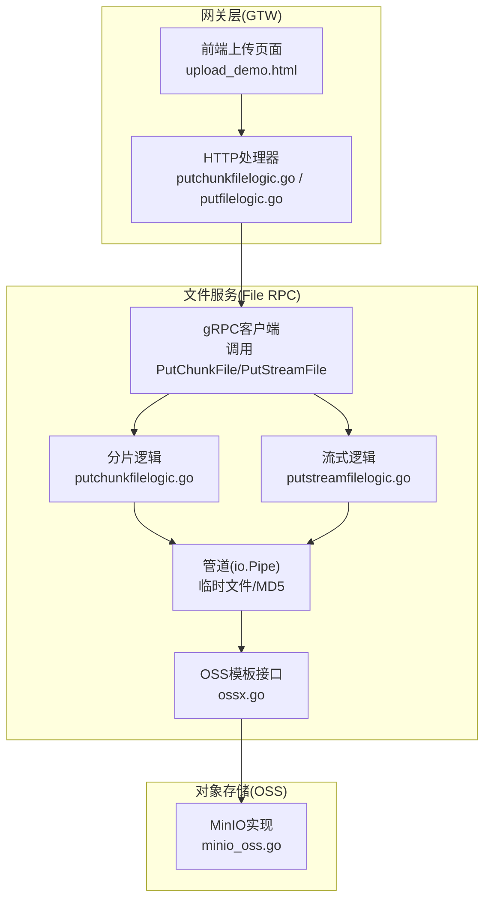
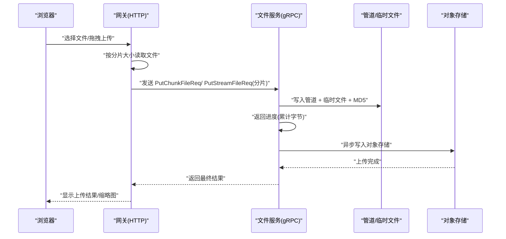
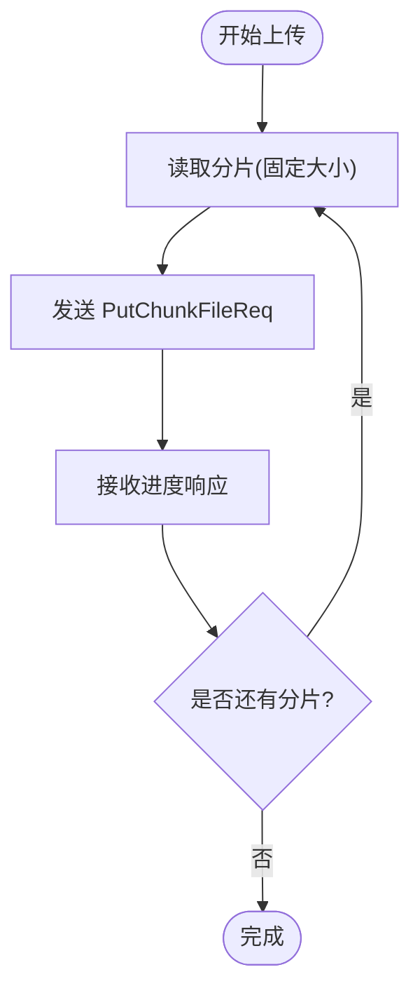
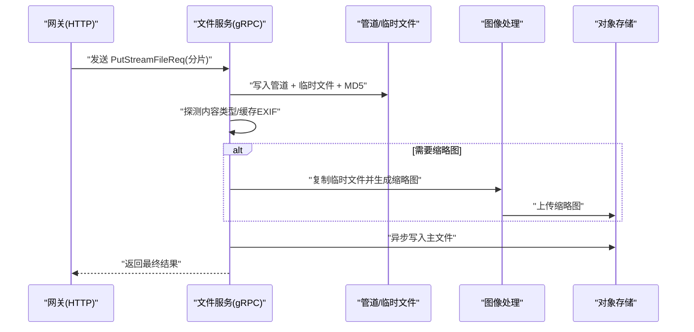
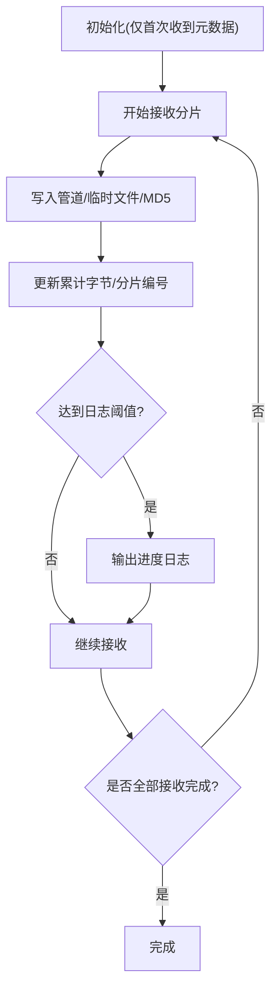
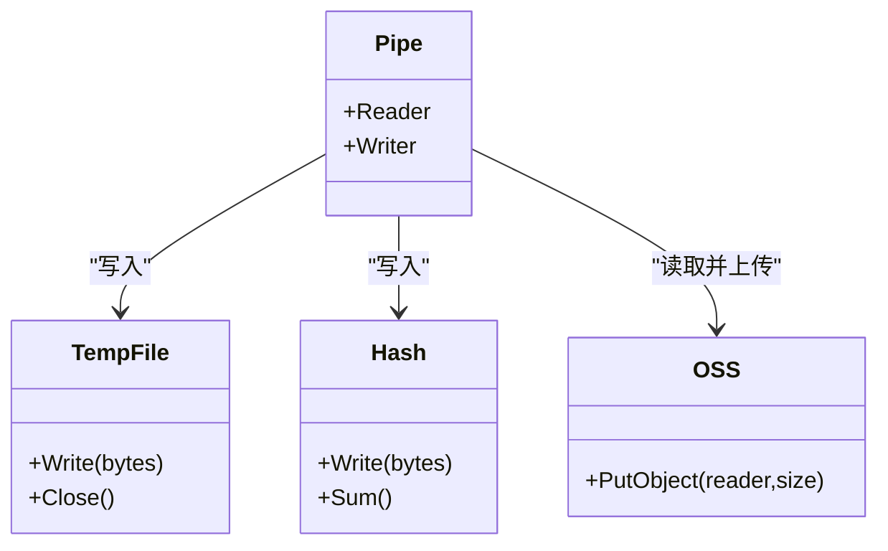
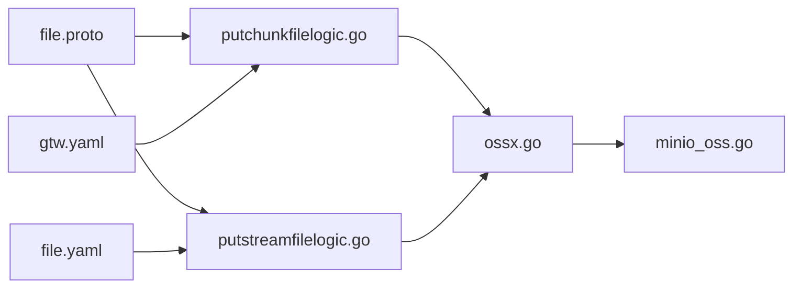

# 文件上传机制

<cite>
**本文引用的文件**
- [app/file/internal/logic/putchunkfilelogic.go](file://app/file/internal/logic/putchunkfilelogic.go)
- [app/file/internal/logic/putstreamfilelogic.go](file://app/file/internal/logic/putstreamfilelogic.go)
- [gtw/internal/logic/file/putchunkfilelogic.go](file://gtw/internal/logic/file/putchunkfilelogic.go)
- [gtw/internal/logic/file/putfilelogic.go](file://gtw/internal/logic/file/putfilelogic.go)
- [app/file/file.proto](file://app/file/file.proto)
- [common/ossx/ossx.go](file://common/ossx/ossx.go)
- [common/ossx/minio_oss.go](file://common/ossx/minio_oss.go)
- [app/file/etc/file.yaml](file://app/file/etc/file.yaml)
- [gtw/etc/gtw.yaml](file://gtw/etc/gtw.yaml)
- [common/tool/tool.go](file://common/tool/tool.go)
- [gtw/upload_demo.html](file://gtw/upload_demo.html)
</cite>

## 目录
1. [简介](#简介)
2. [项目结构](#项目结构)
3. [核心组件](#核心组件)
4. [架构总览](#架构总览)
5. [详细组件分析](#详细组件分析)
6. [依赖关系分析](#依赖关系分析)
7. [性能考量](#性能考量)
8. [故障排查指南](#故障排查指南)
9. [结论](#结论)
10. [附录](#附录)

## 简介
本技术文档围绕文件上传机制展开，系统性阐述分片上传、断点续传、流式上传、并发控制、资源管理与性能优化等关键技术点。文档基于仓库中的 gRPC 服务与前端演示页面，结合协议定义与实现代码，给出可操作的流程图、序列图与最佳实践建议。

## 项目结构
文件上传涉及三层协作：
- 网关层（Gateway，HTTP）：负责接收客户端上传请求，拆分为分片并通过 gRPC 流发送至文件服务。
- 文件服务（File RPC，gRPC）：接收流式分片，使用管道与临时文件实现内存可控的流式写入，并将数据写入对象存储。
- 对象存储（OSS）：通过统一模板接口抽象不同厂商（如 MinIO）的 PutObject 行为。

图表来源
- [gtw/internal/logic/file/putchunkfilelogic.go:38-145](file://gtw/internal/logic/file/putchunkfilelogic.go#L38-L145)
- [app/file/internal/logic/putchunkfilelogic.go:38-269](file://app/file/internal/logic/putchunkfilelogic.go#L38-L269)
- [app/file/internal/logic/putstreamfilelogic.go:43-286](file://app/file/internal/logic/putstreamfilelogic.go#L43-L286)
- [common/ossx/ossx.go:28-39](file://common/ossx/ossx.go#L28-L39)
- [common/ossx/minio_oss.go:96-122](file://common/ossx/minio_oss.go#L96-L122)

章节来源
- [gtw/internal/logic/file/putchunkfilelogic.go:38-145](file://gtw/internal/logic/file/putchunkfilelogic.go#L38-L145)
- [app/file/internal/logic/putchunkfilelogic.go:38-269](file://app/file/internal/logic/putchunkfilelogic.go#L38-L269)
- [app/file/internal/logic/putstreamfilelogic.go:43-286](file://app/file/internal/logic/putstreamfilelogic.go#L43-L286)
- [common/ossx/ossx.go:28-39](file://common/ossx/ossx.go#L28-L39)
- [common/ossx/minio_oss.go:96-122](file://common/ossx/minio_oss.go#L96-L122)

## 核心组件
- 分片上传（HTTP -> gRPC 流）
  - 网关层按固定分片大小读取文件，通过 gRPC 流发送 PutChunkFileReq，服务端逐块写入并返回进度。
- 流式上传（gRPC 流直传）
  - 网关层将文件按分片大小读取，发送 PutStreamFileReq，服务端同样采用管道与临时文件实现流式落盘。
- 断点续传
  - 服务端通过管道与临时文件记录已写入字节，若连接中断，客户端可从已知位置继续发送；服务端在初始化阶段仅在首次收到元数据后建立 OSS 写入通道。
- 流式处理与内存控制
  - 使用 io.Pipe 实现生产者-消费者模型，配合临时文件与 MD5 流式校验，避免一次性加载整个文件到内存。
- 并发与资源管理
  - 服务端对 OSS 写入使用 goroutine 异步执行，前端演示页面支持并发数控制与队列调度。

章节来源
- [gtw/internal/logic/file/putchunkfilelogic.go:72-127](file://gtw/internal/logic/file/putchunkfilelogic.go#L72-L127)
- [app/file/internal/logic/putchunkfilelogic.go:84-191](file://app/file/internal/logic/putchunkfilelogic.go#L84-L191)
- [app/file/internal/logic/putstreamfilelogic.go:93-208](file://app/file/internal/logic/putstreamfilelogic.go#L93-L208)
- [gtw/upload_demo.html:104-115](file://gtw/upload_demo.html#L104-L115)

## 架构总览
下图展示从浏览器到对象存储的完整上传链路，包含分片拆分、流式传输、进度反馈与最终落盘。

图表来源
- [gtw/internal/logic/file/putchunkfilelogic.go:72-135](file://gtw/internal/logic/file/putchunkfilelogic.go#L72-L135)
- [app/file/internal/logic/putchunkfilelogic.go:129-191](file://app/file/internal/logic/putchunkfilelogic.go#L129-L191)
- [app/file/internal/logic/putstreamfilelogic.go:138-208](file://app/file/internal/logic/putstreamfilelogic.go#L138-L208)

## 详细组件分析

### 分片上传（HTTP -> gRPC 流）
- 分片大小与编号
  - 网关层使用固定分片大小常量进行读取与发送，分片编号随累计发送次数递增。
- 进度记录
  - 每发送一个分片，服务端返回累计已写入字节数，网关据此更新前端进度。
- 异常恢复
  - 若发送过程中出现 EOF 或错误，网关记录并终止当前分片发送；客户端可基于已累计字节进行重试。

图表来源
- [gtw/internal/logic/file/putchunkfilelogic.go:72-127](file://gtw/internal/logic/file/putchunkfilelogic.go#L72-L127)
- [app/file/internal/logic/putchunkfilelogic.go:84-191](file://app/file/internal/logic/putchunkfilelogic.go#L84-L191)

章节来源
- [gtw/internal/logic/file/putchunkfilelogic.go:72-135](file://gtw/internal/logic/file/putchunkfilelogic.go#L72-L135)
- [app/file/internal/logic/putchunkfilelogic.go:84-191](file://app/file/internal/logic/putchunkfilelogic.go#L84-L191)

### 流式上传（gRPC 流直传）
- 数据路径
  - 网关层将文件按分片大小读取，发送 PutStreamFileReq；服务端同样使用管道与临时文件进行流式写入。
- 内容类型探测与 EXIF 缓存
  - 服务端在收到首块数据后探测内容类型，并缓存一定字节用于后续 EXIF 提取。
- 缩略图生成
  - 若为图片且请求缩略图，服务端复制临时文件并异步生成缩略图后上传。

图表来源
- [app/file/internal/logic/putstreamfilelogic.go:138-266](file://app/file/internal/logic/putstreamfilelogic.go#L138-L266)
- [common/ossx/ossx.go:28-39](file://common/ossx/ossx.go#L28-L39)

章节来源
- [app/file/internal/logic/putstreamfilelogic.go:43-286](file://app/file/internal/logic/putstreamfilelogic.go#L43-L286)

### 断点续传与进度跟踪
- 分片状态跟踪
  - 服务端维护累计写入字节与分片编号，每次返回进度；客户端可根据累计字节决定从哪一分片继续。
- 异常恢复
  - 若网络中断，客户端可在恢复后继续发送；服务端在初始化阶段仅在首次收到元数据后启动 OSS 写入通道，避免重复初始化。
- 进度日志阈值
  - 服务端按固定阈值输出进度日志，便于监控与调试。

图表来源
- [app/file/internal/logic/putchunkfilelogic.go:84-191](file://app/file/internal/logic/putchunkfilelogic.go#L84-L191)
- [app/file/internal/logic/putstreamfilelogic.go:93-208](file://app/file/internal/logic/putstreamfilelogic.go#L93-L208)

章节来源
- [app/file/internal/logic/putchunkfilelogic.go:84-191](file://app/file/internal/logic/putchunkfilelogic.go#L84-L191)
- [app/file/internal/logic/putstreamfilelogic.go:93-208](file://app/file/internal/logic/putstreamfilelogic.go#L93-L208)

### 流式处理与内存控制
- 管道与临时文件
  - 使用 io.Pipe 建立生产者-消费者通道，同时将数据写入临时文件以支持后续处理（如 EXIF、缩略图）。
- MD5 校验
  - 通过 MD5 流式计算，确保数据完整性。
- 大文件策略
  - 仅在内存中保留必要的缓冲区与少量元数据，避免 OOM。

图表来源
- [app/file/internal/logic/putchunkfilelogic.go:39-191](file://app/file/internal/logic/putchunkfilelogic.go#L39-L191)
- [app/file/internal/logic/putstreamfilelogic.go:43-208](file://app/file/internal/logic/putstreamfilelogic.go#L43-L208)

章节来源
- [app/file/internal/logic/putchunkfilelogic.go:39-191](file://app/file/internal/logic/putchunkfilelogic.go#L39-L191)
- [app/file/internal/logic/putstreamfilelogic.go:43-208](file://app/file/internal/logic/putstreamfilelogic.go#L43-L208)

### 并发控制与资源管理
- 前端并发控制
  - 演示页面支持并发数调节，通过队列与活跃上传计数控制同时上传的任务数。
- 服务端并发
  - 服务端对 OSS 写入使用 goroutine 异步执行，避免阻塞主循环。
- 配置项
  - 文件服务与网关均提供配置文件，包含日志、超时、并发等参数。

章节来源
- [gtw/upload_demo.html:104-115](file://gtw/upload_demo.html#L104-L115)
- [app/file/etc/file.yaml:1-23](file://app/file/etc/file.yaml#L1-L23)
- [gtw/etc/gtw.yaml:1-61](file://gtw/etc/gtw.yaml#L1-L61)

## 依赖关系分析
- 协议层
  - gRPC 服务定义了 PutChunkFile 与 PutStreamFile 的双向流接口，承载分片与进度反馈。
- 存储抽象
  - OSS 模板接口统一了不同对象存储的 PutObject 行为，MinIO 实现提供了 PutStream 与 PutObject。
- 工具与配置
  - 工具模块提供文件名生成、字节格式化等辅助能力；配置文件定义运行参数。

图表来源
- [app/file/file.proto:191-225](file://app/file/file.proto#L191-L225)
- [app/file/internal/logic/putchunkfilelogic.go:114-146](file://app/file/internal/logic/putchunkfilelogic.go#L114-L146)
- [app/file/internal/logic/putstreamfilelogic.go:123-155](file://app/file/internal/logic/putstreamfilelogic.go#L123-L155)
- [common/ossx/ossx.go:28-39](file://common/ossx/ossx.go#L28-L39)
- [common/ossx/minio_oss.go:96-122](file://common/ossx/minio_oss.go#L96-L122)
- [gtw/etc/gtw.yaml:52-56](file://gtw/etc/gtw.yaml#L52-L56)
- [app/file/etc/file.yaml:17-20](file://app/file/etc/file.yaml#L17-L20)

章节来源
- [app/file/file.proto:191-225](file://app/file/file.proto#L191-L225)
- [common/ossx/ossx.go:28-39](file://common/ossx/ossx.go#L28-L39)
- [common/ossx/minio_oss.go:96-122](file://common/ossx/minio_oss.go#L96-L122)
- [gtw/etc/gtw.yaml:52-56](file://gtw/etc/gtw.yaml#L52-L56)
- [app/file/etc/file.yaml:17-20](file://app/file/etc/file.yaml#L17-L20)

## 性能考量
- 分片大小
  - 网关层使用固定分片大小常量，建议根据网络环境与对象存储特性调整，以平衡吞吐与延迟。
- 日志阈值
  - 服务端按固定阈值输出进度日志，避免频繁 IO；可根据场景调整阈值。
- 并发策略
  - 前端并发数应与服务端资源与网络带宽匹配；服务端 goroutine 数与 OSS 写入并发需受控。
- 内存占用
  - 通过管道与临时文件实现流式处理，避免一次性加载大文件；MD5 流式计算降低额外开销。
- 缩略图异步化
  - 缩略图生成与上传异步执行，不影响主文件上传的实时性。

章节来源
- [gtw/internal/logic/file/putchunkfilelogic.go:24-26](file://gtw/internal/logic/file/putchunkfilelogic.go#L24-L26)
- [app/file/internal/logic/putstreamfilelogic.go:26-28](file://app/file/internal/logic/putstreamfilelogic.go#L26-L28)
- [app/file/internal/logic/putchunkfilelogic.go:138-155](file://app/file/internal/logic/putchunkfilelogic.go#L138-L155)
- [app/file/internal/logic/putstreamfilelogic.go:243-264](file://app/file/internal/logic/putstreamfilelogic.go#L243-L264)

## 故障排查指南
- 常见错误与定位
  - 网关层：读取文件或发送流失败时会记录错误；检查分片大小、连接超时与磁盘权限。
  - 服务端：接收流错误、OSS 写入失败、MD5 校验不一致等；关注进度日志与返回的累计字节。
- 恢复策略
  - 若网络中断，客户端可基于累计字节继续发送；服务端在初始化阶段仅首次建立 OSS 写入通道。
- 资源清理
  - 临时文件在关闭后自动清理；若异常退出，建议定期清理临时目录。

章节来源
- [gtw/internal/logic/file/putchunkfilelogic.go:94-100](file://gtw/internal/logic/file/putchunkfilelogic.go#L94-L100)
- [app/file/internal/logic/putchunkfilelogic.go:95-108](file://app/file/internal/logic/putchunkfilelogic.go#L95-L108)
- [app/file/internal/logic/putstreamfilelogic.go:104-108](file://app/file/internal/logic/putstreamfilelogic.go#L104-L108)

## 结论
该文件上传机制通过 gRPC 流实现了高效、可控的分片与流式上传，结合管道与临时文件有效控制内存占用，并提供进度反馈与缩略图异步处理能力。前端演示页面展示了并发控制与队列调度的实际效果。整体设计具备良好的扩展性与稳定性，适合在生产环境中部署与演进。

## 附录
- 关键配置项
  - 文件服务日志路径、OSS 租户模式、缩略图并发数等。
  - 网关服务监听端口、超时、最大请求体大小等。
- 最佳实践建议
  - 根据网络与对象存储特性调整分片大小与并发数。
  - 在客户端实现断点续传与重试策略，提升鲁棒性。
  - 对于图片类文件，合理使用缩略图异步生成，避免阻塞主流程。

章节来源
- [app/file/etc/file.yaml:1-23](file://app/file/etc/file.yaml#L1-L23)
- [gtw/etc/gtw.yaml:1-61](file://gtw/etc/gtw.yaml#L1-L61)
- [common/tool/tool.go:126-131](file://common/tool/tool.go#L126-L131)