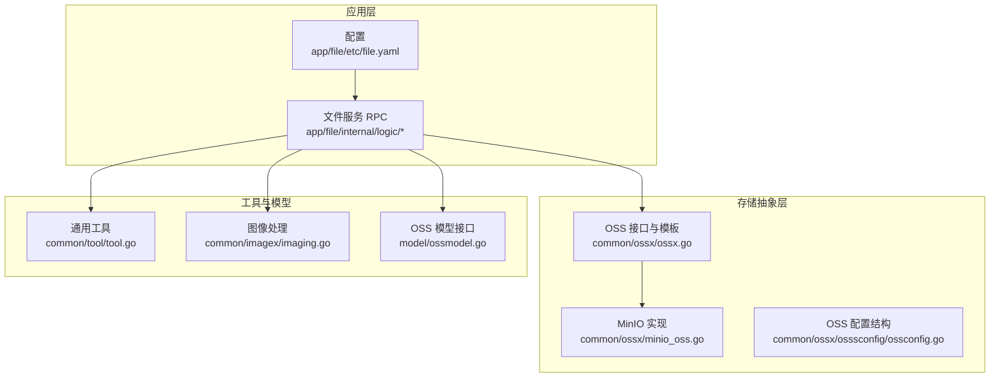
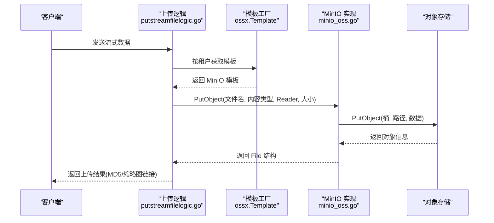
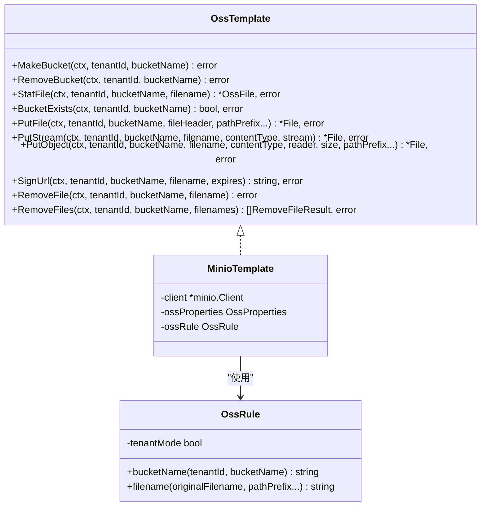
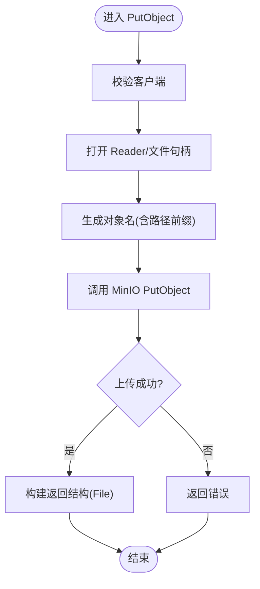
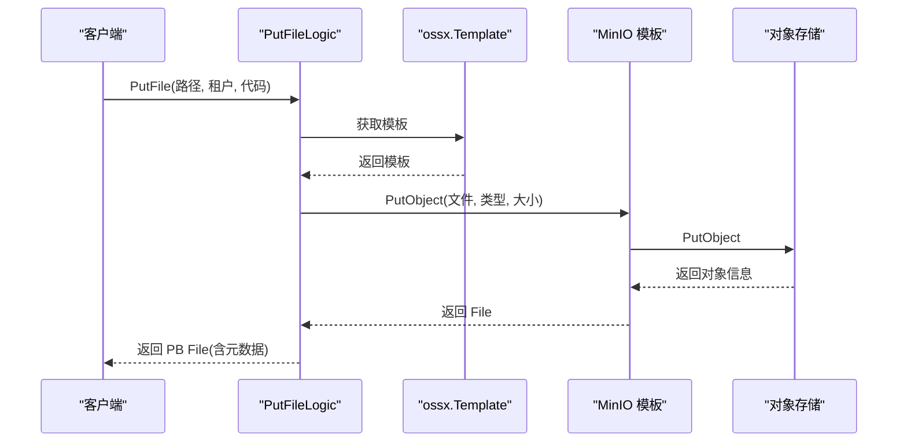
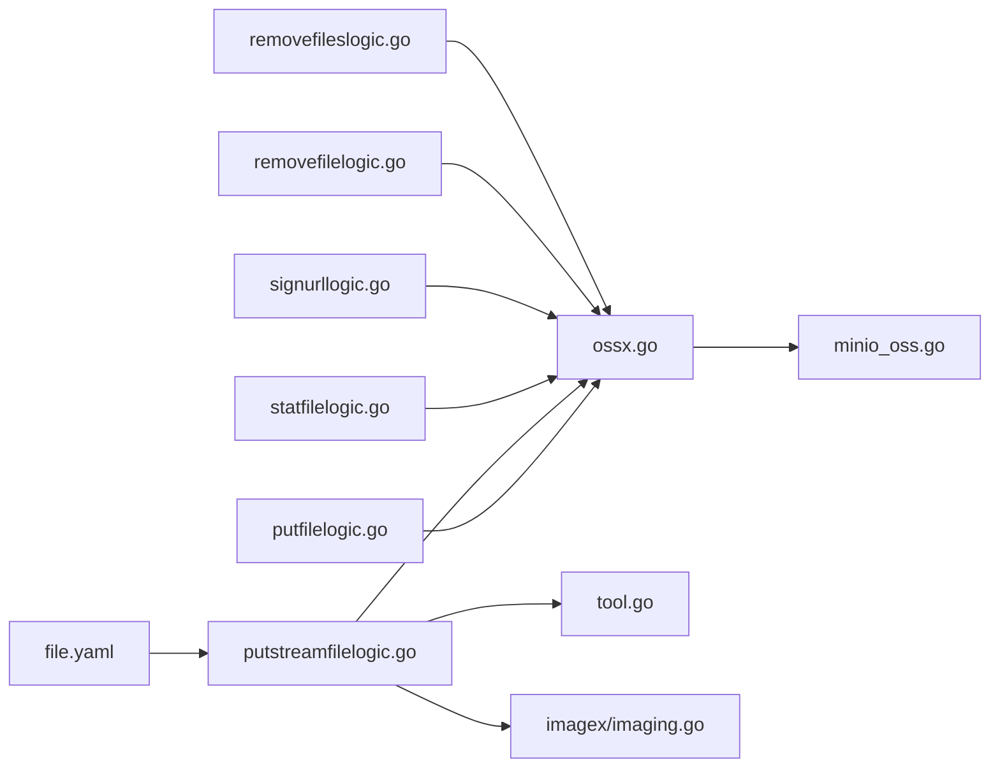

# 文件存储集成

<cite>
**本文引用的文件**
- [common/ossx/ossx.go](file://common/ossx/ossx.go)
- [common/ossx/minio_oss.go](file://common/ossx/minio_oss.go)
- [common/ossx/osssconfig/ossconfig.go](file://common/ossx/osssconfig/ossconfig.go)
- [common/tool/tool.go](file://common/tool/tool.go)
- [common/imagex/imaging.go](file://common/imagex/imaging.go)
- [app/file/etc/file.yaml](file://app/file/etc/file.yaml)
- [app/file/internal/logic/putfilelogic.go](file://app/file/internal/logic/putfilelogic.go)
- [app/file/internal/logic/putstreamfilelogic.go](file://app/file/internal/logic/putstreamfilelogic.go)
- [app/file/internal/logic/statfilelogic.go](file://app/file/internal/logic/statfilelogic.go)
- [app/file/internal/logic/signurllogic.go](file://app/file/internal/logic/signurllogic.go)
- [app/file/internal/logic/removefilelogic.go](file://app/file/internal/logic/removefilelogic.go)
- [app/file/internal/logic/removefileslogic.go](file://app/file/internal/logic/removefileslogic.go)
- [model/ossmodel.go](file://model/ossmodel.go)
- [model/sql/file.sql](file://model/sql/file.sql)
</cite>

## 目录
1. [简介](#简介)
2. [项目结构](#项目结构)
3. [核心组件](#核心组件)
4. [架构总览](#架构总览)
5. [详细组件分析](#详细组件分析)
6. [依赖分析](#依赖分析)
7. [性能考虑](#性能考虑)
8. [故障排查指南](#故障排查指南)
9. [结论](#结论)
10. [附录](#附录)

## 简介
本文件存储集成功能围绕对象存储（OSS）抽象与实现展开，重点覆盖以下方面：
- OSS 配置参数与连接池管理策略
- 认证机制与租户隔离
- 文件命名规则、存储路径组织与元数据管理
- MinIO 适配与兼容性处理
- 文件校验与完整性验证（MD5）
- 重复文件处理与去重思路
- 最佳实践与性能优化建议

该能力以统一接口封装不同 OSS 提供商，当前实现聚焦 MinIO，同时预留扩展点以兼容其他兼容 S3 协议的对象存储。

## 项目结构
文件存储相关代码主要分布在如下模块：
- 抽象层与实现：common/ossx（接口、模板、MinIO 实现、配置）
- 工具与图像处理：common/tool、common/imagex
- 应用逻辑：app/file/internal/logic（上传、签名、状态查询、删除等）
- 配置：app/file/etc/file.yaml
- 数据模型：model/ossmodel.go 及初始化 SQL

图表来源
- [common/ossx/ossx.go:109-151](file://common/ossx/ossx.go#L109-L151)
- [common/ossx/minio_oss.go:214-235](file://common/ossx/minio_oss.go#L214-L235)
- [app/file/etc/file.yaml:17-19](file://app/file/etc/file.yaml#L17-L19)

章节来源
- [app/file/etc/file.yaml:1-23](file://app/file/etc/file.yaml#L1-23)
- [common/ossx/ossx.go:109-151](file://common/ossx/ossx.go#L109-L151)
- [common/ossx/minio_oss.go:214-235](file://common/ossx/minio_oss.go#L214-L235)

## 核心组件
- OSS 抽象接口与模板工厂
  - 定义统一的 OSS 操作接口（创建/删除桶、统计文件、上传、签名、删除等），并通过工厂按租户维度缓存模板实例，避免重复初始化。
- MinIO 模板实现
  - 基于 MinIO SDK 实现具体操作，包含桶存在性判断、对象上传、批量删除、签名 URL 生成等。
- 文件命名与路径组织
  - 采用基于 UUID 的唯一文件名，路径按日期归档；支持租户前缀与自定义路径前缀。
- 元数据与缩略图
  - 图片上传时提取 EXIF 元信息；可选生成缩略图并异步上传。
- MD5 校验
  - 在流式上传过程中实时计算 MD5，便于完整性校验与重复检测。

章节来源
- [common/ossx/ossx.go:28-39](file://common/ossx/ossx.go#L28-L39)
- [common/ossx/ossx.go:43-68](file://common/ossx/ossx.go#L43-L68)
- [common/ossx/minio_oss.go:20-243](file://common/ossx/minio_oss.go#L20-L243)
- [common/tool/tool.go:126-131](file://common/tool/tool.go#L126-L131)
- [app/file/internal/logic/putstreamfilelogic.go:62-63](file://app/file/internal/logic/putstreamfilelogic.go#L62-L63)
- [app/file/internal/logic/putstreamfilelogic.go:272-273](file://app/file/internal/logic/putstreamfilelogic.go#L272-L273)

## 架构总览
整体流程：应用层通过统一模板接口访问对象存储，模板根据租户与配置选择具体实现（当前为 MinIO）。上传过程支持本地临时文件与管道，结合 MD5 校验与可选缩略图生成。

图表来源
- [app/file/internal/logic/putstreamfilelogic.go:123-155](file://app/file/internal/logic/putstreamfilelogic.go#L123-L155)
- [common/ossx/ossx.go:109-151](file://common/ossx/ossx.go#L109-L151)
- [common/ossx/minio_oss.go:124-148](file://common/ossx/minio_oss.go#L124-L148)

## 详细组件分析

### 组件一：OSS 抽象与模板工厂
- 角色与职责
  - 定义统一接口，屏蔽不同 OSS 提供商差异。
  - 按租户维度缓存模板与配置，减少重复初始化开销。
- 关键点
  - 租户模式开关影响桶名与文件路径前缀。
  - 支持多种上传方式（multipart、字节切片、io.Reader）。
  - 提供签名 URL 与批量删除能力。

图表来源
- [common/ossx/ossx.go:28-39](file://common/ossx/ossx.go#L28-L39)
- [common/ossx/ossx.go:43-68](file://common/ossx/ossx.go#L43-L68)
- [common/ossx/minio_oss.go:20-24](file://common/ossx/minio_oss.go#L20-L24)

章节来源
- [common/ossx/ossx.go:109-151](file://common/ossx/ossx.go#L109-L151)
- [common/ossx/ossx.go:43-68](file://common/ossx/ossx.go#L43-L68)

### 组件二：MinIO 实现
- 功能覆盖
  - 桶管理：创建、删除、存在性检查。
  - 文件操作：上传（三种形式）、统计、删除、批量删除。
  - 签名 URL：支持过期时间参数。
- 连接与认证
  - 使用静态凭证初始化客户端，Secure 选项默认关闭（开发环境常见）。
- 路径与域名
  - 通过模板拼接文件链接与域名，支持租户前缀桶名。

图表来源
- [common/ossx/minio_oss.go:124-148](file://common/ossx/minio_oss.go#L124-L148)

章节来源
- [common/ossx/minio_oss.go:26-63](file://common/ossx/minio_oss.go#L26-L63)
- [common/ossx/minio_oss.go:124-148](file://common/ossx/minio_oss.go#L124-L148)
- [common/ossx/minio_oss.go:150-162](file://common/ossx/minio_oss.go#L150-L162)
- [common/ossx/minio_oss.go:164-204](file://common/ossx/minio_oss.go#L164-L204)

### 组件三：文件命名与存储路径
- 命名规则
  - UUID 去横杠作为文件名主体，扩展名保留原文件。
  - 路径前缀默认为 upload，日期作为二级目录，支持自定义路径前缀。
- 租户模式
  - 桶名与路径前缀可加入租户 ID 前缀，实现多租户隔离。
- 工具函数
  - 提供独立的文件名生成函数，便于跨模块复用。

章节来源
- [common/ossx/ossx.go:55-68](file://common/ossx/ossx.go#L55-L68)
- [common/tool/tool.go:126-131](file://common/tool/tool.go#L126-L131)

### 组件四：元数据与缩略图
- 元数据提取
  - 图片上传时检测内容类型，并在限定范围内读取前部字节以提取 EXIF。
- 缩略图生成
  - 可选生成缩略图，异步上传至对象存储，返回缩略图链接与文件名。
- 传输链路
  - 流式上传过程中同时写入管道、临时文件与哈希，保证边传边校验。

章节来源
- [app/file/internal/logic/putstreamfilelogic.go:171-184](file://app/file/internal/logic/putstreamfilelogic.go#L171-L184)
- [app/file/internal/logic/putstreamfilelogic.go:222-266](file://app/file/internal/logic/putstreamfilelogic.go#L222-L266)
- [common/imagex/imaging.go:18-32](file://common/imagex/imaging.go#L18-L32)

### 组件五：MD5 校验与重复文件处理
- MD5 计算
  - 在写入管道的同时写入哈希，完成后输出十六进制字符串。
- 重复文件处理
  - 当前实现未内置去重逻辑，可在业务侧基于 MD5 做重复检测与合并处理。

章节来源
- [app/file/internal/logic/putstreamfilelogic.go:62-63](file://app/file/internal/logic/putstreamfilelogic.go#L62-L63)
- [app/file/internal/logic/putstreamfilelogic.go:272-273](file://app/file/internal/logic/putstreamfilelogic.go#L272-L273)

### 组件六：应用逻辑与 API 调用序列
- 上传文件（单文件）
  - 读取本地文件，探测内容类型，调用模板 PutObject，复制为 PB 结构，必要时提取 EXIF。
- 流式上传
  - 建立管道与临时文件，边接收边写入，实时计算 MD5，可选生成缩略图。
- 文件状态与签名
  - StatFile 获取文件信息，可选生成签名 URL。
- 删除文件
  - 支持单个与批量删除，批量删除聚合错误并按序返回。

图表来源
- [app/file/internal/logic/putfilelogic.go:33-77](file://app/file/internal/logic/putfilelogic.go#L33-L77)
- [common/ossx/ossx.go:109-151](file://common/ossx/ossx.go#L109-L151)
- [common/ossx/minio_oss.go:124-148](file://common/ossx/minio_oss.go#L124-L148)

章节来源
- [app/file/internal/logic/putfilelogic.go:33-77](file://app/file/internal/logic/putfilelogic.go#L33-L77)
- [app/file/internal/logic/putstreamfilelogic.go:43-286](file://app/file/internal/logic/putstreamfilelogic.go#L43-L286)
- [app/file/internal/logic/statfilelogic.go:29-58](file://app/file/internal/logic/statfilelogic.go#L29-L58)
- [app/file/internal/logic/signurllogic.go:29-60](file://app/file/internal/logic/signurllogic.go#L29-L60)
- [app/file/internal/logic/removefilelogic.go:26-38](file://app/file/internal/logic/removefilelogic.go#L26-L38)
- [app/file/internal/logic/removefileslogic.go:28-45](file://app/file/internal/logic/removefileslogic.go#L28-L45)

## 依赖分析
- 模块耦合
  - 应用逻辑依赖抽象接口与模板工厂，解耦具体实现。
  - 工具模块被上传逻辑与图像处理模块广泛使用。
- 外部依赖
  - MinIO SDK、HTTP 内容类型探测、图像处理库。
- 可能的循环依赖
  - 当前结构清晰，未发现循环导入。

图表来源
- [app/file/internal/logic/putfilelogic.go:1-78](file://app/file/internal/logic/putfilelogic.go#L1-L78)
- [app/file/internal/logic/putstreamfilelogic.go:1-287](file://app/file/internal/logic/putstreamfilelogic.go#L1-L287)
- [app/file/internal/logic/statfilelogic.go:1-59](file://app/file/internal/logic/statfilelogic.go#L1-L59)
- [app/file/internal/logic/signurllogic.go:1-61](file://app/file/internal/logic/signurllogic.go#L1-L61)
- [app/file/internal/logic/removefilelogic.go:1-39](file://app/file/internal/logic/removefilelogic.go#L1-L39)
- [app/file/internal/logic/removefileslogic.go:1-46](file://app/file/internal/logic/removefileslogic.go#L1-L46)
- [common/ossx/ossx.go:109-151](file://common/ossx/ossx.go#L109-L151)
- [common/ossx/minio_oss.go:214-235](file://common/ossx/minio_oss.go#L214-L235)
- [common/tool/tool.go:126-131](file://common/tool/tool.go#L126-L131)
- [common/imagex/imaging.go:18-32](file://common/imagex/imaging.go#L18-L32)
- [app/file/etc/file.yaml:17-19](file://app/file/etc/file.yaml#L17-L19)

## 性能考虑
- 上传路径
  - 流式上传使用管道与临时文件，避免一次性加载全部内存；建议合理设置临时目录权限与磁盘空间。
- 并发与吞吐
  - MinIO 客户端内部具备并发能力；可根据网络与存储性能调整客户端并发参数（需在模板初始化处扩展）。
- 日志与可观测性
  - 大文件上传设置合理的进度日志阈值，避免频繁 IO。
- 缓存与连接
  - 模板按租户缓存，减少重复初始化；如需进一步降低延迟，可在模板内引入连接池参数（需扩展）。
- 压缩与缩略图
  - 缩略图生成为异步任务，避免阻塞主上传流程；建议限制并发数量以平衡资源占用。

## 故障排查指南
- 常见错误与定位
  - 客户端为空：检查模板初始化与租户配置是否正确。
  - 上传失败：确认桶存在性、权限、网络连通性与对象名合法性。
  - 签名 URL 失败：核对过期时间与签名参数。
  - 批量删除异常：关注返回列表中各文件的错误项。
- 建议排查步骤
  - 校验配置文件中的租户模式与 OSS 参数。
  - 查看应用日志中的进度与错误堆栈。
  - 使用 StatFile 确认对象是否存在。
  - 若出现权限问题，检查 AccessKey/SecretKey 与桶策略。

章节来源
- [common/ossx/minio_oss.go:237-242](file://common/ossx/minio_oss.go#L237-L242)
- [app/file/internal/logic/removefileslogic.go:39-43](file://app/file/internal/logic/removefileslogic.go#L39-L43)

## 结论
该文件存储集成以统一抽象为核心，当前聚焦 MinIO 的稳定实现，并提供了完善的文件命名、路径组织、元数据与缩略图处理、以及 MD5 校验能力。通过租户模式与模板缓存，系统具备良好的可扩展性与运行效率。后续可在模板层引入连接池与更多 OSS 供应商适配，同时在业务层完善重复文件检测与去重策略。

## 附录

### 配置参数与最佳实践
- 配置要点
  - 租户模式：开启后桶名与路径前缀自动加入租户前缀。
  - 临时目录：流式上传依赖本地临时目录，需确保权限与容量。
- 最佳实践
  - 上传前探测内容类型，避免错误的 Content-Type 导致下载异常。
  - 大文件上传建议使用流式接口并开启进度日志。
  - 缩略图并发受 ThumbTaskConcurrency 控制，建议结合 CPU 与 I/O 能力调优。
  - 生产环境建议启用 HTTPS 与严格的桶策略。

章节来源
- [app/file/etc/file.yaml:17-19](file://app/file/etc/file.yaml#L17-L19)
- [app/file/etc/file.yaml:20](file://app/file/etc/file.yaml#L20)
- [app/file/internal/logic/putstreamfilelogic.go:46-48](file://app/file/internal/logic/putstreamfilelogic.go#L46-L48)

### 数据模型与初始化
- OSS 配置模型
  - 提供自定义模型接口，支持会话与扩展。
- 初始化示例
  - SQL 中包含一条 MinIO 示例配置，可直接导入数据库。

章节来源
- [model/ossmodel.go:10-31](file://model/ossmodel.go#L10-L31)
- [model/sql/file.sql:24-28](file://model/sql/file.sql#L24-L28)