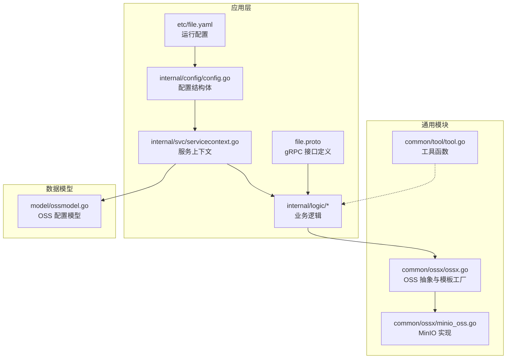
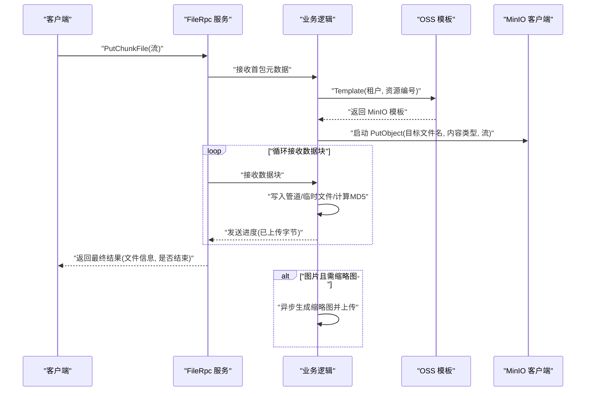
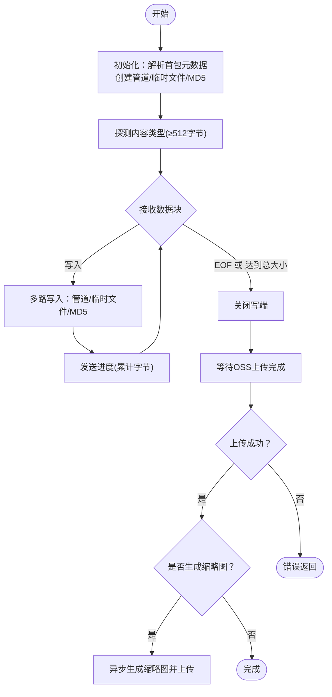
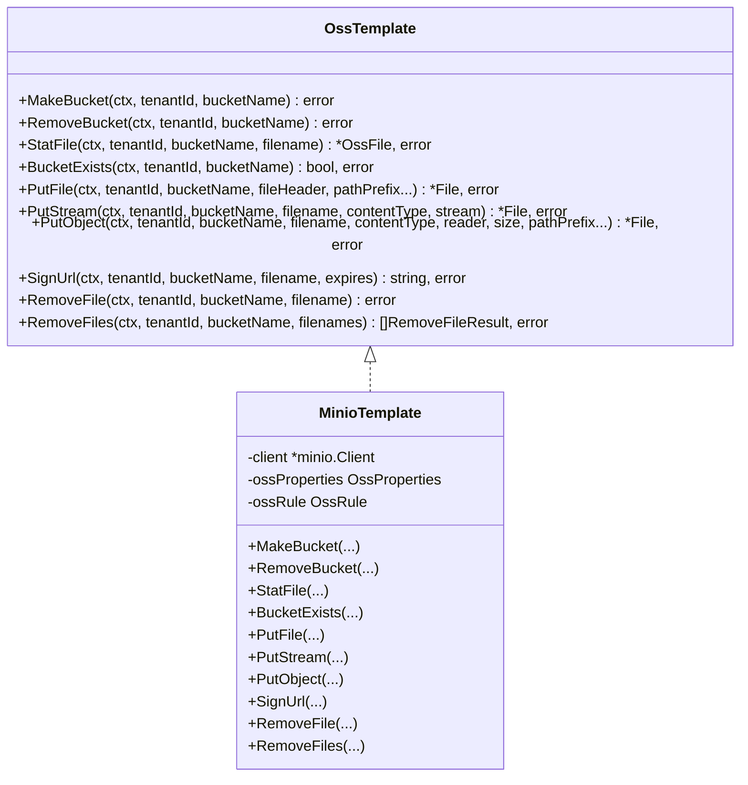
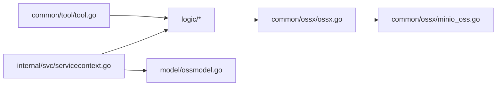

# 文件服务

<cite>
**本文引用的文件**
- [file.proto](file://app/file/file.proto)
- [file.yaml](file://app/file/etc/file.yaml)
- [config.go](file://app/file/internal/config/config.go)
- [ossx.go](file://common/ossx/ossx.go)
- [minio_oss.go](file://common/ossx/minio_oss.go)
- [putchunkfilelogic.go](file://app/file/internal/logic/putchunkfilelogic.go)
- [putfilelogic.go](file://app/file/internal/logic/putfilelogic.go)
- [signurllogic.go](file://app/file/internal/logic/signurllogic.go)
- [statfilelogic.go](file://app/file/internal/logic/statfilelogic.go)
- [removefilelogic.go](file://app/file/internal/logic/removefilelogic.go)
- [createosslogic.go](file://app/file/internal/logic/createosslogic.go)
- [osslistlogic.go](file://app/file/internal/logic/osslistlogic.go)
- [servicecontext.go](file://app/file/internal/svc/servicecontext.go)
- [ossmodel.go](file://model/ossmodel.go)
- [tool.go](file://common/tool/tool.go)
</cite>

## 目录
1. [简介](#简介)
2. [项目结构](#项目结构)
3. [核心组件](#核心组件)
4. [架构总览](#架构总览)
5. [详细组件分析](#详细组件分析)
6. [依赖分析](#依赖分析)
7. [性能考虑](#性能考虑)
8. [故障排查指南](#故障排查指南)
9. [结论](#结论)
10. [附录](#附录)

## 简介
本文件服务基于 gRPC 提供统一的对象存储能力，覆盖分片上传、流式上传、断点续传、文件校验与验证、URL 签名、文件信息查询与删除等核心能力。当前实现以 MinIO 作为对象存储后端，支持按租户隔离的存储桶命名规则，并提供缩略图异步生成与上传流程。服务通过配置中心注册与发现，具备良好的可扩展性与运维可观测性。

## 项目结构
文件服务位于应用目录 app/file 下，采用 go-zero 生成的 RPC 服务骨架，包含协议定义、配置、逻辑层、服务上下文与模型访问层；通用对象存储封装位于 common/ossx，提供模板化接口与 MinIO 实现。

**图表来源**
- [file.proto:1-287](file://app/file/file.proto#L1-L287)
- [file.yaml:1-23](file://app/file/etc/file.yaml#L1-L23)
- [config.go:1-31](file://app/file/internal/config/config.go#L1-L31)
- [servicecontext.go:1-27](file://app/file/internal/svc/servicecontext.go#L1-L27)
- [ossx.go:1-152](file://common/ossx/ossx.go#L1-L152)
- [minio_oss.go:1-243](file://common/ossx/minio_oss.go#L1-L243)
- [ossmodel.go:1-32](file://model/ossmodel.go#L1-L32)

**章节来源**
- [file.proto:1-287](file://app/file/file.proto#L1-L287)
- [file.yaml:1-23](file://app/file/etc/file.yaml#L1-L23)
- [config.go:1-31](file://app/file/internal/config/config.go#L1-L31)
- [servicecontext.go:1-27](file://app/file/internal/svc/servicecontext.go#L1-L27)
- [ossx.go:1-152](file://common/ossx/ossx.go#L1-L152)
- [minio_oss.go:1-243](file://common/ossx/minio_oss.go#L1-L243)
- [ossmodel.go:1-32](file://model/ossmodel.go#L1-L32)

## 核心组件
- gRPC 接口层：定义了文件与对象存储管理相关的 RPC 方法，包括上传、分片上传、流式上传、URL 签名、文件状态查询、删除等。
- 业务逻辑层：对接 OSS 抽象，完成租户与存储配置解析、文件内容类型探测、MD5 校验、缩略图生成与上传、并发控制等。
- 对象存储抽象层：提供统一的 OSS 模板接口与 MinIO 实现，支持创建/删除存储桶、文件上传、签名 URL、文件统计与删除。
- 服务上下文：注入配置、数据库连接、参数校验器与缩略图任务执行器。
- 工具与模型：提供文件名生成、字节格式化、时间格式化等工具，以及 OSS 配置的数据库访问模型。

**章节来源**
- [file.proto:270-287](file://app/file/file.proto#L270-L287)
- [putchunkfilelogic.go:1-270](file://app/file/internal/logic/putchunkfilelogic.go#L1-L270)
- [ossx.go:28-39](file://common/ossx/ossx.go#L28-L39)
- [minio_oss.go:20-243](file://common/ossx/minio_oss.go#L20-L243)
- [servicecontext.go:12-26](file://app/file/internal/svc/servicecontext.go#L12-L26)
- [tool.go:82-88](file://common/tool/tool.go#L82-L88)

## 架构总览
文件服务通过 gRPC 提供统一入口，内部以“配置驱动 + 抽象模板 + 具体实现”的方式解耦不同对象存储厂商。上传链路采用流式管道与多路写入，结合临时文件与 MD5 校验，实现断点续传与完整性保障。缩略图生成采用异步任务队列，避免阻塞主上传流程。

**图表来源**
- [file.proto:191-207](file://app/file/file.proto#L191-L207)
- [putchunkfilelogic.go:38-269](file://app/file/internal/logic/putchunkfilelogic.go#L38-L269)
- [ossx.go:109-151](file://common/ossx/ossx.go#L109-L151)
- [minio_oss.go:124-148](file://common/ossx/minio_oss.go#L124-L148)

## 详细组件分析

### gRPC 接口设计与参数说明
- PutChunkFile(stream PutChunkFileReq) returns (stream PutChunkFileRes)
  - 用途：分片上传（双向流），适用于网络不稳定场景，支持断点续传与实时进度反馈。
  - 关键参数：租户ID、资源编号、存储桶、目标文件名、内容类型、文件总大小、是否缩略图、路径前缀等。
  - 返回：文件信息、是否结束标志、累计已上传字节数。
- PutStreamFile(stream PutStreamFileReq) returns (PutStreamFileRes)
  - 用途：流式上传（单向流），适合客户端边读边推的场景。
  - 关键参数：与分片上传类似，但无需首包元数据。
- PutFile(PutFileReq) returns (PutFileRes)
  - 用途：一次性上传本地文件。
  - 关键参数：本地文件路径、目标文件名、内容类型、是否缩略图、路径前缀等。
- SignUrl(SignUrlReq) returns (SignUrlRes)
  - 用途：生成带过期时间的预签名 URL。
  - 关键参数：租户ID、资源编号、存储桶、文件名、过期分钟数。
- StatFile(StatFileReq) returns (StatFileRes)
  - 用途：查询文件信息，可选生成签名 URL。
  - 关键参数：租户ID、资源编号、存储桶、文件名、是否签名、过期时间。
- RemoveFile(RemoveFileReq) returns (RemoveFileRes)
  - 用途：删除单个文件。
- RemoveFiles(RemoveFilesReq) returns (RemoveFileRes)
  - 用途：批量删除文件。
- 其他管理接口：CreateOss、UpdateOss、DeleteOss、OssList、OssDetail、MakeBucket、RemoveBucket、CaptureVideoStream 等。

**章节来源**
- [file.proto:151-287](file://app/file/file.proto#L151-L287)

### 分片上传机制与断点续传
- 数据通道：使用 io.Pipe() 建立管道，将流式数据同时写入管道与临时文件，便于后续校验与异常恢复。
- 元数据初始化：首次接收时解析租户ID、资源编号、存储桶、目标文件名、内容类型、总大小、是否缩略图、路径前缀等。
- 内容类型探测：在收到至少 512 字节后，使用 http.DetectContentType 进行探测，确保上传时设置正确的 Content-Type。
- MD5 校验：对写入的数据进行 MD5 累计，用于完整性校验（与最终对象存储校验配合）。
- 进度反馈：每收到一块数据即向客户端发送进度，包含累计字节数与当前文件信息快照。
- 异常处理：若流中断，临时文件在逻辑结束时清理；若上传至 OSS 成功但客户端断开，当前实现未自动删除已上传对象（可在上层业务补充）。
- 缩略图生成：当内容类型为 image/* 且 isThumb 为真时，复制临时文件副本，异步生成缩略图并上传，返回缩略图链接与文件名。

**图表来源**
- [putchunkfilelogic.go:38-269](file://app/file/internal/logic/putchunkfilelogic.go#L38-L269)

**章节来源**
- [putchunkfilelogic.go:38-269](file://app/file/internal/logic/putchunkfilelogic.go#L38-L269)

### 文件校验与验证
- 内容类型探测：在收到足够字节后，使用标准库探测 MIME 类型，确保上传对象的 Content-Type 正确。
- MD5 校验：对写入管道的数据进行累计 MD5，可用于客户端侧校验与服务端一致性检查。
- EXIF 元信息：当内容类型为图片时，抽取前若干字节用于 EXIF 解析，填充图片元信息字段。
- 文件名生成：默认采用路径前缀 + 年月日 + UUID 的组合，保证唯一性与层级化组织。

**章节来源**
- [putchunkfilelogic.go:150-174](file://app/file/internal/logic/putchunkfilelogic.go#L150-L174)
- [tool.go:126-131](file://common/tool/tool.go#L126-L131)

### 并发上传控制与缩略图异步处理
- 并发控制：通过服务上下文中的 TaskRunner 控制缩略图生成并发度，默认值来自配置项 ThumbTaskConcurrency。
- 异步任务：将缩略图生成与上传放入独立 goroutine，避免阻塞主上传流程，提升吞吐。
- 临时文件管理：缩略图任务完成后清理临时文件，降低磁盘占用。

**章节来源**
- [servicecontext.go:24-24](file://app/file/internal/svc/servicecontext.go#L24-L24)
- [putchunkfilelogic.go:233-254](file://app/file/internal/logic/putchunkfilelogic.go#L233-L254)

### 对象存储集成方案（MinIO）
- 模板工厂：根据租户ID与资源编号动态获取 OSS 配置，构建 MinIO 客户端模板，支持租户隔离的存储桶命名规则。
- 存储桶管理：支持创建与删除存储桶，桶名根据租户模式拼接前缀。
- 文件操作：支持上传文件、流式上传、统计文件信息、生成签名 URL、删除单个与批量文件。
- URL 签名：支持自定义过期时间，默认 1 小时。
- 文件名与域名：提供文件链接与域名拼装方法，便于前端直传与回显。

**图表来源**
- [ossx.go:28-39](file://common/ossx/ossx.go#L28-L39)
- [minio_oss.go:20-243](file://common/ossx/minio_oss.go#L20-L243)

**章节来源**
- [ossx.go:109-151](file://common/ossx/ossx.go#L109-L151)
- [minio_oss.go:26-204](file://common/ossx/minio_oss.go#L26-L204)

### gRPC API 使用示例（说明性）
- 分片上传（客户端侧思路）
  - 首包携带元数据（租户ID、资源编号、存储桶、目标文件名、内容类型、总大小、是否缩略图、路径前缀）。
  - 后续持续发送数据块，服务端返回进度；当收到 isEnd 为真时，表示上传完成。
- 流式上传（客户端侧思路）
  - 直接发送数据块，无需首包元数据；服务端在首块内完成元数据解析与 OSS 上传初始化。
- 一次性上传（客户端侧思路）
  - 传入本地文件路径与目标文件名，服务端自动探测内容类型并上传。
- URL 签名（客户端侧思路）
  - 请求签名 URL，设置过期时间（分钟），前端可直接下载或预览。
- 文件状态查询（客户端侧思路）
  - 可选请求签名 URL，便于快速分享或限时访问。

**章节来源**
- [file.proto:191-287](file://app/file/file.proto#L191-L287)

### 服务配置选项
- 运行配置（file.yaml）
  - 名称、监听地址、超时、日志路径、Nacos 注册信息、OSS 租户模式开关、缩略图并发度、数据库连接串。
- 配置结构（config.go）
  - 继承 zrpc 配置，新增 NacosConfig、DB、Cache、Oss、ThumbTaskConcurrency 等字段。
- 服务上下文（servicecontext.go）
  - 注入配置、参数校验器、OSS 模型、缩略图任务执行器。

**章节来源**
- [file.yaml:1-23](file://app/file/etc/file.yaml#L1-L23)
- [config.go:10-30](file://app/file/internal/config/config.go#L10-L30)
- [servicecontext.go:12-26](file://app/file/internal/svc/servicecontext.go#L12-L26)

### 中间件与错误处理机制
- 参数校验：使用 go-playground/validator 对请求参数进行结构化校验。
- 日志：统一使用 go-zero logx，便于追踪上传过程与错误。
- 错误传播：逻辑层捕获 OSS 操作错误并向上返回；对于流式上传，若客户端断开，当前实现会返回读取错误，可在上层业务决定是否删除已上传对象。
- 并发安全：OSS 模板工厂使用读写锁保护模板缓存，避免重复初始化。

**章节来源**
- [signurllogic.go:36-38](file://app/file/internal/logic/signurllogic.go#L36-L38)
- [putchunkfilelogic.go:96-98](file://app/file/internal/logic/putchunkfilelogic.go#L96-L98)
- [ossx.go:111-114](file://common/ossx/ossx.go#L111-L114)

## 依赖分析
- 接口依赖：logic 层依赖 ossx 抽象与 model 层；ossx 依赖 MinIO SDK；servicecontext 注入配置与 TaskRunner。
- 外部依赖：MinIO Go SDK、go-zero RPC/DB/日志、go-playground/validator、Copier 等。
- 配置依赖：Nacos 注册、MySQL 数据源、日志路径、缩略图并发度。

**图表来源**
- [putchunkfilelogic.go:1-270](file://app/file/internal/logic/putchunkfilelogic.go#L1-L270)
- [ossx.go:1-152](file://common/ossx/ossx.go#L1-L152)
- [minio_oss.go:1-243](file://common/ossx/minio_oss.go#L1-L243)
- [servicecontext.go:1-27](file://app/file/internal/svc/servicecontext.go#L1-L27)
- [ossmodel.go:1-32](file://model/ossmodel.go#L1-L32)
- [tool.go:1-469](file://common/tool/tool.go#L1-L469)

**章节来源**
- [putchunkfilelogic.go:1-270](file://app/file/internal/logic/putchunkfilelogic.go#L1-L270)
- [ossx.go:1-152](file://common/ossx/ossx.go#L1-L152)
- [minio_oss.go:1-243](file://common/ossx/minio_oss.go#L1-L243)
- [servicecontext.go:1-27](file://app/file/internal/svc/servicecontext.go#L1-L27)
- [ossmodel.go:1-32](file://model/ossmodel.go#L1-L32)
- [tool.go:1-469](file://common/tool/tool.go#L1-L469)

## 性能考虑
- 流式上传：采用管道与多路写入，减少内存占用；上传过程中仅累计 MD5，避免额外拷贝。
- 并发控制：缩略图并发度可通过配置项调节，避免 CPU/IO 抖动。
- 存储桶命名：租户隔离的桶名拼接，避免跨租户冲突与权限复杂化。
- 文件名策略：按日期分层与 UUID 组合，有利于对象存储的索引与检索。
- 批量删除：MinIO 支持并发删除，逻辑层按输入顺序组装结果，便于上层感知失败项。

[本节为通用性能建议，不直接分析具体文件]

## 故障排查指南
- 无法连接 MinIO
  - 检查 Endpoint、AccessKey、SecretKey、BucketName 是否正确；确认网络连通性。
- 上传失败或进度异常
  - 查看逻辑层日志，确认首包元数据是否完整；检查客户端是否提前断开；关注 MD5 与内容类型探测时机。
- 缩略图未生成
  - 确认 isThumb 为真且内容类型为图片；检查缩略图并发度与异步任务执行器状态。
- URL 签名无效
  - 确认文件存在且签名过期时间合理；检查签名 URL 的生成与有效期。
- 删除失败
  - 检查文件名与存储桶是否匹配；查看批量删除返回的失败项列表。

**章节来源**
- [minio_oss.go:150-162](file://common/ossx/minio_oss.go#L150-L162)
- [putchunkfilelogic.go:130-146](file://app/file/internal/logic/putchunkfilelogic.go#L130-L146)
- [signurllogic.go:49-52](file://app/file/internal/logic/signurllogic.go#L49-L52)

## 结论
文件服务通过清晰的接口设计与抽象封装，实现了稳定高效的分片上传、流式上传、URL 签名与文件管理能力。结合租户隔离与并发控制，满足多租户场景下的对象存储需求。未来可扩展更多对象存储后端（如 OSS、COS），并在客户端侧完善断点续传与重试策略。

[本节为总结性内容，不直接分析具体文件]

## 附录

### 部署配置要点
- 运行配置
  - Name、ListenOn、Timeout、Log.Path、NacosConfig、Oss.TenantMode、ThumbTaskConcurrency、DB.DataSource。
- 数据库
  - 配置 MySQL 连接串，确保 OSS 配置表可用。
- 对象存储
  - 在 OSS 管理接口中创建/更新存储配置，确保 Endpoint、AccessKey、SecretKey、BucketName 正确。

**章节来源**
- [file.yaml:1-23](file://app/file/etc/file.yaml#L1-L23)
- [config.go:22-29](file://app/file/internal/config/config.go#L22-L29)

### 客户端集成要点
- 分片上传
  - 首包携带元数据；后续循环发送数据块；监听 isEnd 与累计字节。
- 流式上传
  - 直接发送数据块；服务端在首块内完成初始化。
- URL 签名
  - 指定过期时间，前端直接访问签名 URL。
- 文件状态
  - 可选获取签名 URL，便于分享与限时访问。

**章节来源**
- [file.proto:191-287](file://app/file/file.proto#L191-L287)