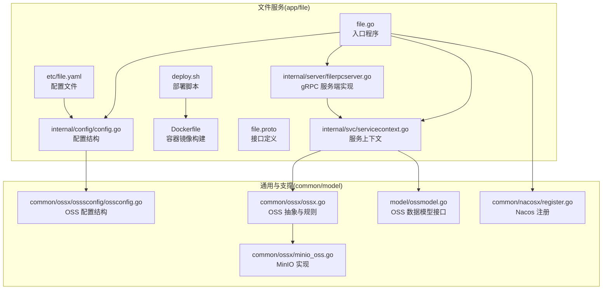
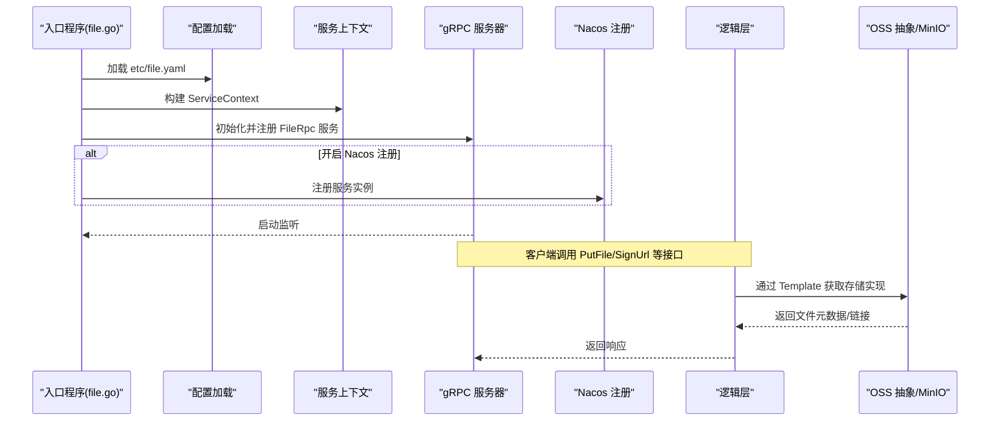
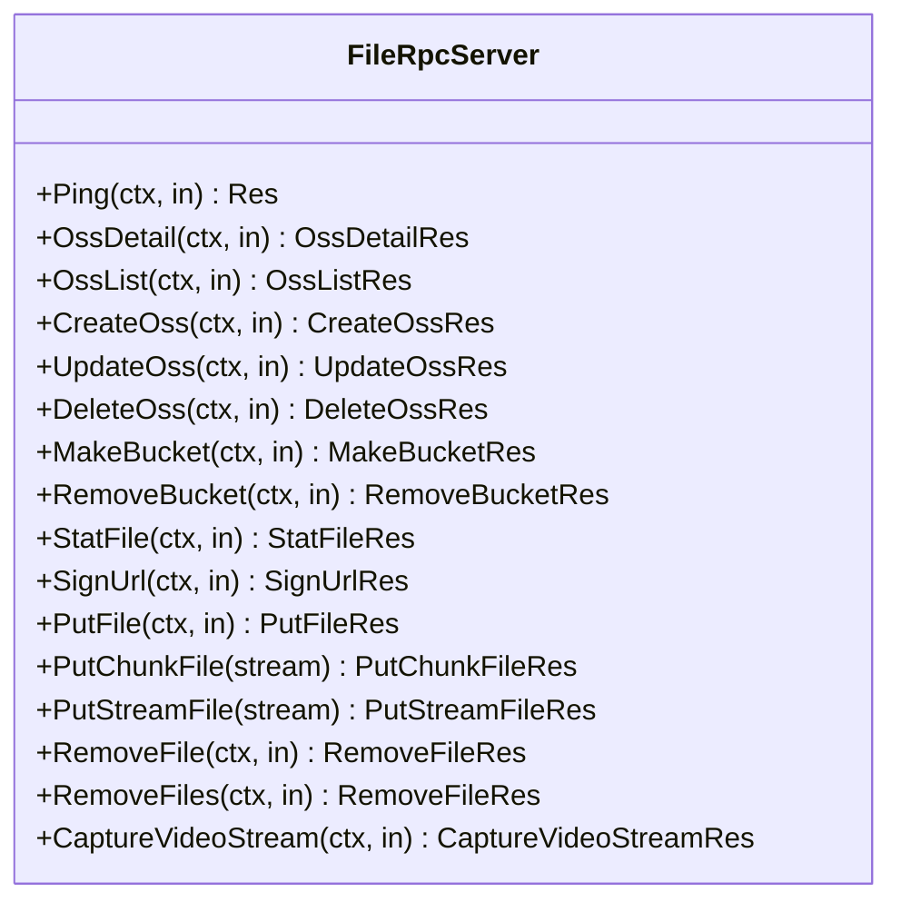
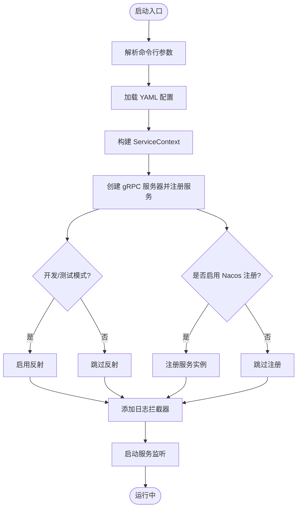
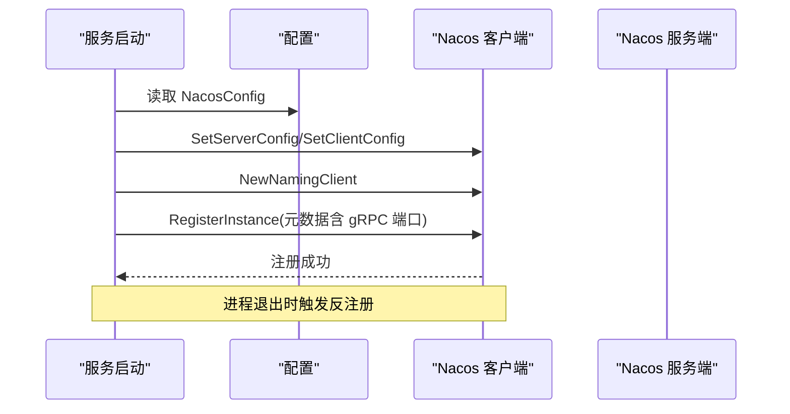
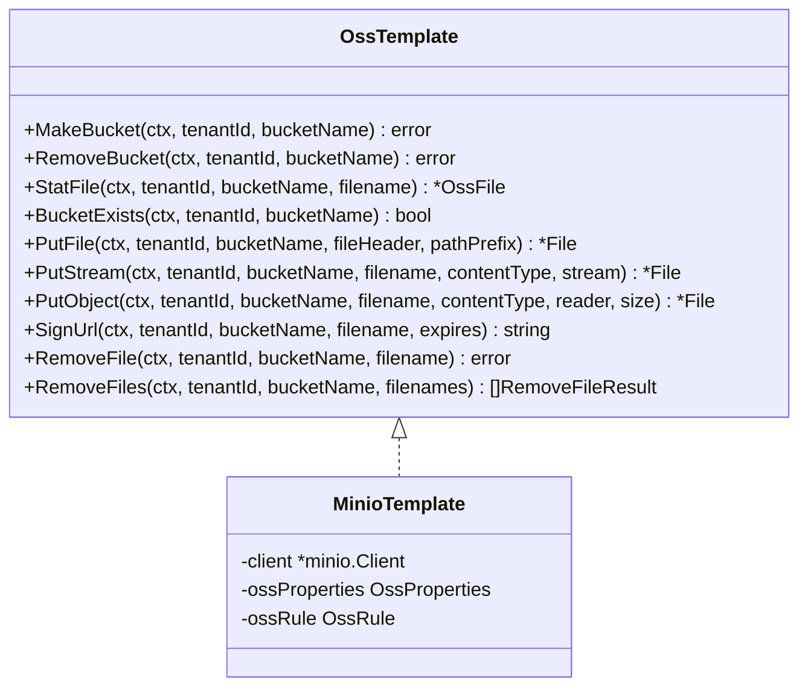
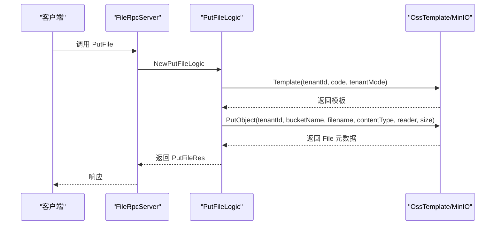
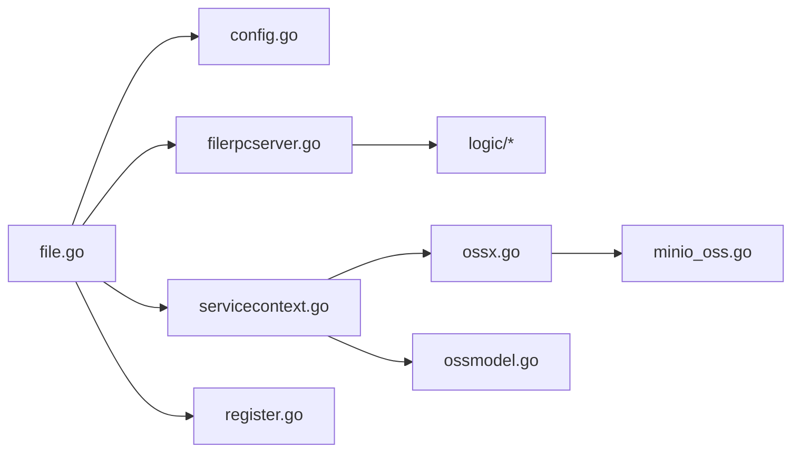

# 文件服务概述

<cite>
**本文引用的文件**
- [file.go](file.go)
- [file.yaml](app/file/etc/file.yaml)
- [config.go](app/file/internal/config/config.go)
- [filerpcserver.go](app/file/internal/server/filerpcserver.go)
- [servicecontext.go](app/file/internal/svc/servicecontext.go)
- [file.proto](app/file/file.proto)
- [register.go](common/nacosx/register.go)
- [ossx.go](common/ossx/ossx.go)
- [minio_oss.go](common/ossx/minio_oss.go)
- [ossconfig.go](common/ossx/osssconfig/ossconfig.go)
- [ossmodel.go](model/ossmodel.go)
- [deploy.sh](app/file/deploy.sh)
- [Dockerfile](app/file/Dockerfile)
</cite>

## 目录
1. [引言](#引言)
2. [项目结构](#项目结构)
3. [核心组件](#核心组件)
4. [架构总览](#架构总览)
5. [详细组件分析](#详细组件分析)
6. [依赖分析](#依赖分析)
7. [性能考虑](#性能考虑)
8. [故障排查指南](#故障排查指南)
9. [结论](#结论)
10. [附录](#附录)

## 引言
文件服务是一个基于 gRPC 的微服务，负责统一的文件上传、存储管理与下载能力。它通过抽象化的对象存储模板（目前支持 MinIO），为多租户场景提供安全、可扩展的文件管理能力，并与 Nacos 注册中心集成实现服务发现与治理。该服务在微服务生态中承担“基础设施层”的角色，向上游业务提供稳定可靠的文件能力。

## 项目结构
文件服务位于 app/file 目录下，采用典型的 go-zero 微服务分层组织方式：
- etc：配置文件目录，包含 YAML 配置
- internal：内部实现，包含 config、logic、server、svc 四个子模块
- file.proto：gRPC 接口定义
- deploy.sh 与 Dockerfile：容器化与部署脚本
- 其他目录如 common、model 等为通用能力与模型支撑

**图表来源**
- [file.go:1-72](file.go#L1-L72)
- [config.go:10-31](app/file/internal/config/config.go#L10-L31)
- [filerpcserver.go:15-105](app/file/internal/server/filerpcserver.go#L15-L105)
- [servicecontext.go:12-27](app/file/internal/svc/servicecontext.go#L12-L27)
- [file.proto:270-287](app/file/file.proto#L270-L287)
- [register.go:21-76](common/nacosx/register.go#L21-L76)
- [ossx.go:28-152](common/ossx/ossx.go#L28-L152)
- [minio_oss.go:20-200](common/ossx/minio_oss.go#L20-L200)
- [ossconfig.go:3-8](common/ossx/osssconfig/ossconfig.go#L3-L8)
- [ossmodel.go:7-32](model/ossmodel.go#L7-L32)
- [deploy.sh:1-175](app/file/deploy.sh#L1-L175)
- [Dockerfile:1-42](app/file/Dockerfile#L1-L42)

**章节来源**
- [file.go:1-72](file.go#L1-L72)
- [file.yaml:1-23](app/file/etc/file.yaml#L1-L23)
- [config.go:10-31](app/file/internal/config/config.go#L10-L31)
- [file.proto:270-287](app/file/file.proto#L270-L287)

## 核心组件
- 配置系统：集中于 YAML 配置文件与 Go 结构体映射，涵盖 RPC 监听、日志、Nacos 注册、OSS 租户模式、数据库连接等。
- gRPC 服务端：由生成的服务桩接管请求，转发至对应的 logic 层处理。
- 服务上下文：封装配置、校验器、OSS 模型与缩略图任务执行器。
- OSS 抽象：以接口形式屏蔽底层存储差异，当前实现基于 MinIO。
- Nacos 注册：在启动时按配置向 Nacos 注册服务实例，支持优雅下线。
- 部署与容器化：提供 Dockerfile 与自动化部署脚本，便于 CI/CD 集成。

**章节来源**
- [file.yaml:1-23](app/file/etc/file.yaml#L1-L23)
- [config.go:10-31](app/file/internal/config/config.go#L10-L31)
- [servicecontext.go:12-27](app/file/internal/svc/servicecontext.go#L12-L27)
- [ossx.go:28-152](common/ossx/ossx.go#L28-L152)
- [register.go:21-76](common/nacosx/register.go#L21-L76)

## 架构总览
文件服务采用“配置驱动 + gRPC + 抽象存储 + 服务注册”的架构模式：
- 入口程序加载配置，初始化服务上下文，创建 gRPC 服务器并注册服务。
- 在开发/测试模式下启用反射，便于调试；生产模式关闭反射。
- 若开启 Nacos 注册，将服务实例注册到注册中心，并在进程退出时自动反注册。
- 业务逻辑通过 OSS 抽象对接 MinIO，支持桶管理、文件上传/下载/删除、签名 URL 等。

**图表来源**
- [file.go:28-71](file.go#L28-L71)
- [register.go:21-76](common/nacosx/register.go#L21-L76)
- [ossx.go:109-151](common/ossx/ossx.go#L109-L151)
- [minio_oss.go:65-148](common/ossx/minio_oss.go#L65-L148)

## 详细组件分析

### 配置结构与参数说明
- Name：服务名称，用于日志与注册标识
- ListenOn：gRPC 监听地址
- Timeout：请求超时（毫秒）
- Mode：运行模式（dev/test/prod），影响反射开关
- Log：日志编码与输出路径
- NacosConfig：服务注册相关参数
  - IsRegister：是否注册到 Nacos
  - Host/Port：Nacos 地址
  - Username/PassWord：认证凭据
  - NamespaceId：命名空间
  - ServiceName：服务名
- Oss：OSS 配置
  - TenantMode：是否启用租户模式
- ThumbTaskConcurrency：缩略图任务并发数
- DB：MySQL 连接串

**章节来源**
- [file.yaml:1-23](app/file/etc/file.yaml#L1-L23)
- [config.go:10-31](app/file/internal/config/config.go#L10-L31)
- [ossconfig.go:3-8](common/ossx/osssconfig/ossconfig.go#L3-L8)

### gRPC 服务与接口定义
- 服务名：FileRpc
- 主要接口：
  - 基础：Ping
  - 存储管理：OssDetail、OssList、CreateOss、UpdateOss、DeleteOss、MakeBucket、RemoveBucket
  - 文件操作：StatFile、SignUrl、PutFile、PutChunkFile、PutStreamFile、RemoveFile、RemoveFiles
  - 流媒体：CaptureVideoStream
- 接口参数与返回值均通过 proto 定义，包含租户 ID、资源编号、桶名、文件名、内容类型、签名有效期等字段。

**图表来源**
- [filerpcserver.go:15-105](app/file/internal/server/filerpcserver.go#L15-L105)
- [file.proto:270-287](app/file/file.proto#L270-L287)

**章节来源**
- [file.proto:9-287](app/file/file.proto#L9-L287)
- [filerpcserver.go:26-104](app/file/internal/server/filerpcserver.go#L26-L104)

### 服务启动流程与 gRPC 初始化
- 解析命令行参数，加载 YAML 配置
- 构建服务上下文（包含数据库连接、校验器、OSS 模型、任务执行器）
- 创建 gRPC 服务器并注册 FileRpc 服务
- 开发/测试模式下启用反射
- 可选：根据配置向 Nacos 注册服务实例
- 添加拦截器（日志拦截器）
- 输出启动信息并启动服务

**图表来源**
- [file.go:28-71](file.go#L28-L71)

**章节来源**
- [file.go:28-71](file.go#L28-L71)

### Nacos 服务注册机制
- 依据配置构造 ServerConfig 与 ClientConfig
- 从监听地址解析 IP 与端口，支持环境变量与内网 IP 自动推断
- 注册实例（权重、健康状态、元数据）
- 注册时写入 gRPC 端口与来源标记
- 进程退出时自动反注册

**图表来源**
- [file.go:47-64](file.go#L47-L64)
- [register.go:21-76](common/nacosx/register.go#L21-L76)

**章节来源**
- [file.go:47-64](file.go#L47-L64)
- [register.go:21-76](common/nacosx/register.go#L21-L76)

### OSS 抽象与 MinIO 实现
- 抽象接口：提供桶管理、文件操作、签名 URL、批量删除等方法
- 规则策略：根据租户模式拼接桶名与文件名，支持自定义路径前缀
- 模板缓存：按租户维度缓存 OSS 模板与配置，避免重复初始化
- MinIO 实现：封装 MinIO 客户端，提供 PutObject、StatObject、PresignedGetObject 等能力

**图表来源**
- [ossx.go:28-152](common/ossx/ossx.go#L28-L152)
- [minio_oss.go:20-200](common/ossx/minio_oss.go#L20-L200)

**章节来源**
- [ossx.go:28-152](common/ossx/ossx.go#L28-L152)
- [minio_oss.go:20-200](common/ossx/minio_oss.go#L20-L200)

### 服务上下文与数据模型
- ServiceContext：持有配置、校验器、OSS 模型与缩略图任务执行器
- OSS 模型：提供按租户与资源编号查询的接口，作为 OSS 抽象的配置来源

**章节来源**
- [servicecontext.go:12-27](app/file/internal/svc/servicecontext.go#L12-L27)
- [ossmodel.go:7-32](model/ossmodel.go#L7-L32)

### 典型业务流程示例

#### 上传文件流程（PutFile）
- 逻辑：根据租户与资源编号获取 OSS 配置，打开本地文件，探测内容类型，调用 OSS 抽象 PutObject，提取图片 EXIF 元信息（若为图像）
- 关键点：租户模式下的桶名拼接、文件名生成策略、内容类型检测

**图表来源**
- [filerpcserver.go:76-79](app/file/internal/server/filerpcserver.go#L76-L79)
- [ossx.go:109-151](common/ossx/ossx.go#L109-L151)
- [minio_oss.go:124-148](common/ossx/minio_oss.go#L124-L148)

**章节来源**
- [filerpcserver.go:76-79](app/file/internal/server/filerpcserver.go#L76-L79)
- [ossx.go:109-151](common/ossx/ossx.go#L109-L151)
- [minio_oss.go:124-148](common/ossx/minio_oss.go#L124-L148)

#### 生成签名 URL（SignUrl）
- 逻辑：参数校验、获取 OSS 配置、计算过期时间、调用 PresignedGetObject 生成签名 URL
- 关键点：默认过期时间为 1 小时，可由请求参数覆盖

**章节来源**
- [signurllogic.go:29-60](app/file/internal/logic/signurllogic.go#L29-L60)
- [minio_oss.go:150-162](common/ossx/minio_oss.go#L150-L162)

### 部署与运行环境准备
- 构建产物：使用 go build 生成二进制文件
- 容器镜像：基于 Alpine 构建中间镜像，最终镜像采用 scratch，仅包含证书与时区信息
- 配置挂载：镜像 CMD 指向 etc/file.yaml
- 部署脚本：支持环境变量注入、镜像打包上传、远程部署、标签管理与备份清理

**章节来源**
- [Dockerfile:1-42](app/file/Dockerfile#L1-L42)
- [deploy.sh:1-175](app/file/deploy.sh#L1-L175)

## 依赖分析
- 组件耦合：
  - 入口程序依赖配置、服务上下文、gRPC 与 Nacos 注册
  - 服务端实现依赖服务上下文与逻辑层
  - 逻辑层依赖 OSS 抽象与模型层
  - OSS 抽象依赖 MinIO 客户端与配置
- 外部依赖：
  - Nacos SDK：服务注册与反注册
  - MinIO SDK：对象存储操作
  - go-zero：配置、日志、服务框架与 gRPC

**图表来源**
- [file.go:1-72](file.go#L1-L72)
- [config.go:10-31](app/file/internal/config/config.go#L10-L31)
- [servicecontext.go:12-27](app/file/internal/svc/servicecontext.go#L12-L27)
- [filerpcserver.go:15-105](app/file/internal/server/filerpcserver.go#L15-L105)
- [ossx.go:28-152](common/ossx/ossx.go#L28-L152)
- [minio_oss.go:20-200](common/ossx/minio_oss.go#L20-L200)
- [register.go:21-76](common/nacosx/register.go#L21-L76)
- [ossmodel.go:7-32](model/ossmodel.go#L7-L32)

**章节来源**
- [file.go:1-72](file.go#L1-L72)
- [ossx.go:28-152](common/ossx/ossx.go#L28-L152)
- [minio_oss.go:20-200](common/ossx/minio_oss.go#L20-L200)

## 性能考虑
- 并发控制：通过 TaskRunner 控制缩略图任务并发度，避免 CPU 与 IO 抖动
- 模板缓存：按租户缓存 OSS 模板与配置，减少重复初始化开销
- 文件名与路径：统一生成策略，降低存储层碎片化风险
- 签名 URL：合理设置过期时间，平衡安全性与用户体验
- 日志与拦截器：在开发/测试模式启用反射，生产模式关闭以减少额外开销

[本节为通用指导，无需列出具体文件来源]

## 故障排查指南
- 启动失败
  - 检查配置文件路径与权限
  - 确认数据库连接串可用
  - 核对 Nacos 地址与凭据
- 上传失败
  - 确认租户与资源编号正确
  - 检查桶是否存在或具备写权限
  - 校验文件大小与内容类型
- 下载/签名异常
  - 校验签名过期时间
  - 确认对象存在且未被删除
- 注册问题
  - 查看 Nacos 控制台实例状态
  - 检查网络连通性与防火墙
  - 关注优雅下线日志

**章节来源**
- [file.go:28-71](file.go#L28-L71)
- [register.go:21-76](common/nacosx/register.go#L21-L76)
- [minio_oss.go:40-56](common/ossx/minio_oss.go#L40-L56)

## 结论
文件服务通过清晰的分层设计与抽象化的存储实现，提供了稳定、可扩展的文件管理能力。结合 Nacos 注册与 go-zero 生态，能够快速融入微服务体系。建议在生产环境中严格控制并发与缓存策略，完善监控与告警，确保高可用与高性能。

[本节为总结性内容，无需列出具体文件来源]

## 附录

### 配置项速查
- 服务基本信息：Name、ListenOn、Timeout、Mode、Log
- 服务注册：NacosConfig（IsRegister、Host、Port、Username、PassWord、NamespaceId、ServiceName）
- 存储配置：Oss（TenantMode）、ThumbTaskConcurrency
- 数据库：DB（DataSource）

**章节来源**
- [file.yaml:1-23](app/file/etc/file.yaml#L1-L23)
- [config.go:10-31](app/file/internal/config/config.go#L10-L31)