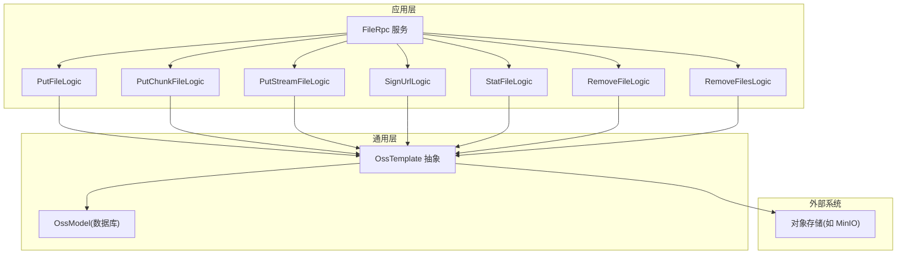
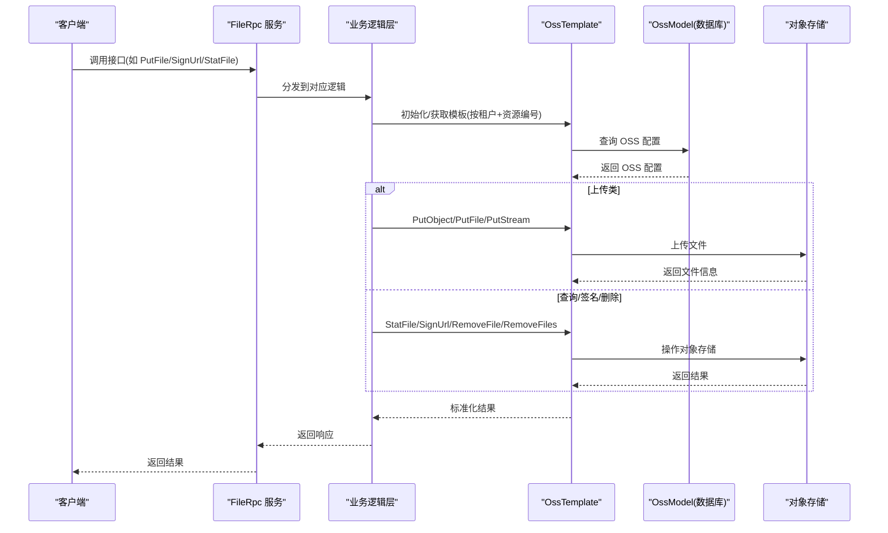
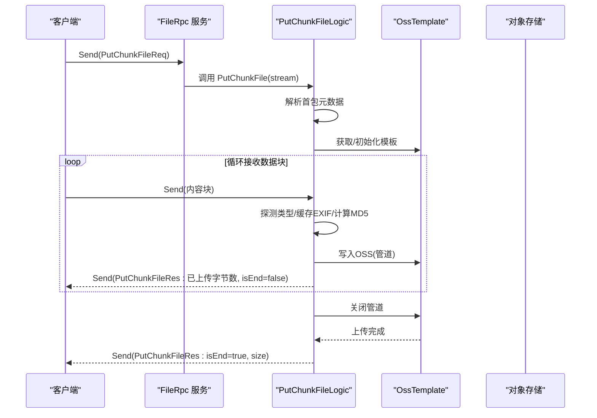
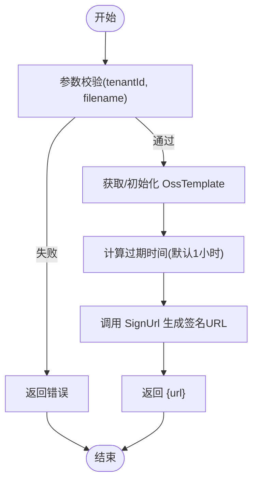
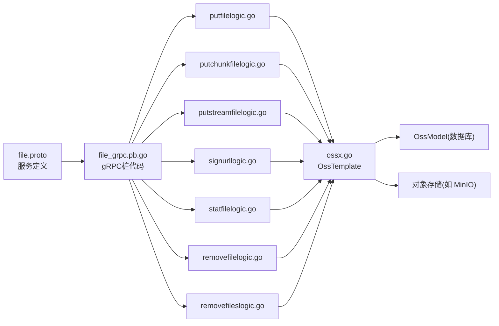

# 文件管理 API

<cite>
**本文引用的文件**
- [file.proto](file://app/file/file.proto)
- [file_grpc.pb.go](file://app/file/file/file_grpc.pb.go)
- [putchunkfilelogic.go](file://app/file/internal/logic/putchunkfilelogic.go)
- [putfilelogic.go](file://app/file/internal/logic/putfilelogic.go)
- [putstreamfilelogic.go](file://app/file/internal/logic/putstreamfilelogic.go)
- [signurllogic.go](file://app/file/internal/logic/signurllogic.go)
- [statfilelogic.go](file://app/file/internal/logic/statfilelogic.go)
- [removefilelogic.go](file://app/file/internal/logic/removefilelogic.go)
- [removefileslogic.go](file://app/file/internal/logic/removefileslogic.go)
- [ossx.go](file://common/ossx/ossx.go)
- [file.yaml](file://app/file/etc/file.yaml)
- [pinglogic.go](file://app/file/internal/logic/pinglogic.go)
</cite>

## 目录
1. [简介](#简介)
2. [项目结构](#项目结构)
3. [核心组件](#核心组件)
4. [架构总览](#架构总览)
5. [详细组件分析](#详细组件分析)
6. [依赖关系分析](#依赖关系分析)
7. [性能与并发特性](#性能与并发特性)
8. [故障排查指南](#故障排查指南)
9. [结论](#结论)
10. [附录](#附录)

## 简介
本文件管理 API 提供基于 gRPC 的对象存储（OSS）文件管理能力，覆盖文件上传（整包、分块、流式）、URL 签名、文件状态查询、单文件与批量删除等核心功能。通过统一的 OSS 抽象模板，支持多厂商对象存储接入，并内置租户隔离、缩略图生成、EXIF 元数据提取等增强能力。

## 项目结构
- 协议定义：位于 app/file/file.proto，定义了服务接口、请求/响应消息体及数据模型。
- 服务实现：位于 app/file/internal/logic/*，包含各接口的业务逻辑。
- OSS 抽象：位于 common/ossx/ossx.go，封装不同厂商的 OSS 行为，提供统一模板接口。
- 配置：位于 app/file/etc/file.yaml，包含服务监听端口、超时、日志、注册中心、OSS 租户模式等配置项。

图表来源
- [file.proto:270-287](file://app/file/file.proto#L270-L287)
- [ossx.go:28-39](file://common/ossx/ossx.go#L28-L39)

章节来源
- [file.proto:1-287](file://app/file/file.proto#L1-L287)
- [ossx.go:1-152](file://common/ossx/ossx.go#L1-L152)
- [file.yaml:1-23](file://app/file/etc/file.yaml#L1-L23)

## 核心组件
- FileRpc 服务：定义了所有文件管理相关接口，包括 Ping、OssDetail/OssList/CreateOss/UpdateOss/DeleteOss、MakeBucket/RemoveBucket、StatFile、SignUrl、PutFile、PutChunkFile、PutStreamFile、RemoveFile、RemoveFiles、CaptureVideoStream。
- 数据模型：
  - File：返回给客户端的文件信息，包含链接、域名、名称、大小、原始名、MD5、图片元信息、缩略图链接与名称等。
  - OssFile：OSS 文件信息，包含链接、名称、大小、格式化大小、上传时间、内容类型、签名 URL。
  - ImageMeta：图片 EXIF 元信息，经纬度、拍摄时间、尺寸、海拔、相机型号等。
  - Oss：存储配置信息，包含租户 ID、分类、资源编号、Endpoint、AK/SK、Bucket 名称、地域/应用 ID、备注、状态等。
- OSS 抽象模板：OssTemplate 接口统一了创建/删除存储桶、统计文件、上传文件、签名 URL、删除文件、批量删除等能力；通过 Template 函数按租户维度缓存模板实例，避免重复初始化。

章节来源
- [file.proto:34-67](file://app/file/file.proto#L34-L67)
- [ossx.go:28-92](file://common/ossx/ossx.go#L28-L92)

## 架构总览
文件管理 API 的调用链路如下：
- 客户端通过 gRPC 调用 FileRpc 服务。
- 服务端根据租户 ID 与资源编号获取 OSS 配置，构建 OssTemplate。
- 通过 OssTemplate 执行具体操作（上传、签名、查询、删除）。
- 返回标准化的数据模型给客户端。

图表来源
- [file.proto:270-287](file://app/file/file.proto#L270-L287)
- [ossx.go:109-151](file://common/ossx/ossx.go#L109-L151)
- [putfilelogic.go:33-77](file://app/file/internal/logic/putfilelogic.go#L33-L77)
- [signurllogic.go:29-60](file://app/file/internal/logic/signurllogic.go#L29-L60)
- [statfilelogic.go:29-58](file://app/file/internal/logic/statfilelogic.go#L29-L58)
- [removefilelogic.go:26-38](file://app/file/internal/logic/removefilelogic.go#L26-L38)
- [removefileslogic.go:28-45](file://app/file/internal/logic/removefileslogic.go#L28-L45)

## 详细组件分析

### PutChunkFile（分块上传，双向流）
- 接口定义：服务端流式接口，客户端发送多个 PutChunkFileReq，服务端返回 PutChunkFileRes。
- 主要流程：
  - 初始化：解析首包元数据（租户、资源编号、Bucket、文件名、内容类型、总大小、缩略图标志、路径前缀），动态获取 OssTemplate。
  - 流式接收：逐块读取内容，同时计算 MD5、探测内容类型、对图片缓存 EXIF 数据。
  - 并行上传：使用 io.Pipe 将数据写入 OSS，同时将数据写入临时文件以提取 EXIF 和生成缩略图。
  - 进度反馈：每收到一块即向客户端发送进度（已上传字节数、是否结束）。
  - 缩略图与 EXIF：若为图片且要求缩略图，异步生成并上传缩略图。
- 关键参数：
  - tenantId、code、bucketName、filename、contentType、content、size、isThumb、pathPrefix。
- 响应字段：
  - file：File 结构，包含链接、域名、名称、大小、原始名、MD5、图片元信息、缩略图链接与名称。
  - isEnd：是否传输结束。
  - size：累计已上传字节数。
- 错误处理：
  - OSS 初始化失败、流读取失败、上传失败、缩略图生成失败等均会返回相应错误。

图表来源
- [file.proto:191-207](file://app/file/file.proto#L191-L207)
- [putchunkfilelogic.go:38-269](file://app/file/internal/logic/putchunkfilelogic.go#L38-L269)

章节来源
- [file.proto:191-207](file://app/file/file.proto#L191-L207)
- [putchunkfilelogic.go:38-269](file://app/file/internal/logic/putchunkfilelogic.go#L38-L269)

### PutFile（整包上传）
- 接口定义：普通 RPC，一次性上传本地文件。
- 主要流程：
  - 读取本地文件，探测内容类型。
  - 通过 OssTemplate 上传至 OSS，返回标准化 File。
  - 若为图片，提取 EXIF 元信息并填充到响应。
- 关键参数：
  - tenantId、code、bucketName、filename、contentType、path、isThumb、pathPrefix。
- 响应字段：
  - file：File 结构，包含链接、域名、名称、大小、原始名、MD5、图片元信息、缩略图链接与名称。

章节来源
- [file.proto:176-189](file://app/file/file.proto#L176-L189)
- [putfilelogic.go:33-77](file://app/file/internal/logic/putfilelogic.go#L33-L77)

### PutStreamFile（流式上传，单向流）
- 接口定义：服务端流式接口，客户端发送多个 PutStreamFileReq，服务端返回 PutStreamFileRes。
- 主要流程：
  - 与分块上传类似，但使用 SendAndClose 在最后一次性返回结果。
  - 支持进度日志（超过阈值或完成时打印）。
  - 支持缩略图与 EXIF 提取。
- 关键参数：
  - tenantId、code、bucketName、filename、contentType、content、size、isThumb、pathPrefix。
- 响应字段：
  - file：File 结构。
  - isEnd：是否结束。
  - size：累计已上传字节数。

章节来源
- [file.proto:209-225](file://app/file/file.proto#L209-L225)
- [putstreamfilelogic.go:43-286](file://app/file/internal/logic/putstreamfilelogic.go#L43-L286)

### SignUrl（URL 签名）
- 接口定义：生成带有效期的文件访问 URL。
- 主要流程：
  - 参数校验（租户 ID、文件名必填）。
  - 获取 OssTemplate，计算过期时间（默认 1 小时，可由请求指定分钟数）。
  - 调用 SignUrl 生成签名 URL。
- 关键参数：
  - tenantId、code、bucketName、filename、expires（分钟）。
- 响应字段：
  - url：签名后的 URL。

图表来源
- [signurllogic.go:29-60](file://app/file/internal/logic/signurllogic.go#L29-L60)
- [ossx.go:36-36](file://common/ossx/ossx.go#L36-L36)

章节来源
- [file.proto:164-174](file://app/file/file.proto#L164-L174)
- [signurllogic.go:29-60](file://app/file/internal/logic/signurllogic.go#L29-L60)

### StatFile（文件状态查询）
- 接口定义：查询文件基本信息，可选生成签名 URL。
- 主要流程：
  - 获取 OssTemplate。
  - 调用 StatFile 获取 OSS 文件信息，转换为 OssFile。
  - 可选：根据 isSign 与 expires 生成签名 URL 并返回。
- 关键参数：
  - tenantId、code、bucketName、filename、isSign、expires。
- 响应字段：
  - ossFile：包含链接、名称、大小、格式化大小、上传时间、内容类型、签名 URL。

章节来源
- [file.proto:151-162](file://app/file/file.proto#L151-L162)
- [statfilelogic.go:29-58](file://app/file/internal/logic/statfilelogic.go#L29-L58)

### RemoveFile（单文件删除）
- 接口定义：删除指定文件。
- 主要流程：
  - 获取 OssTemplate。
  - 调用 RemoveFile 删除文件。
- 关键参数：
  - tenantId、code、bucketName、filename。
- 响应字段：空。

章节来源
- [file.proto:240-248](file://app/file/file.proto#L240-L248)
- [removefilelogic.go:26-38](file://app/file/internal/logic/removefilelogic.go#L26-L38)

### RemoveFiles（批量删除）
- 接口定义：批量删除多个文件。
- 主要流程：
  - 获取 OssTemplate。
  - 调用 RemoveFiles 删除多个文件，任一失败则整体失败。
- 关键参数：
  - tenantId、code、bucketName、filename[]。
- 响应字段：空。

章节来源
- [file.proto:250-256](file://app/file/file.proto#L250-L256)
- [removefileslogic.go:28-45](file://app/file/internal/logic/removefileslogic.go#L28-L45)

### 其他辅助接口
- Ping：健康检查接口，返回固定字符串。
- OSS 管理：OssDetail、OssList、CreateOss、UpdateOss、DeleteOss、MakeBucket、RemoveBucket、CaptureVideoStream 等，均由对应的逻辑层实现并通过 OssTemplate 与 OSS 交互。

章节来源
- [file.proto:9-15](file://app/file/file.proto#L9-L15)
- [pinglogic.go:25-27](file://app/file/internal/logic/pinglogic.go#L25-L27)

## 依赖关系分析
- FileRpc 服务依赖各逻辑层；逻辑层依赖 OssTemplate；OssTemplate 依赖 OssModel（数据库）与外部对象存储。
- OSS 抽象通过 Template 函数按租户维度缓存模板，减少重复初始化开销。
- 配置文件 file.yaml 控制服务监听、超时、日志、注册中心、OSS 租户模式等。

图表来源
- [file.proto:270-287](file://app/file/file.proto#L270-L287)
- [ossx.go:109-151](file://common/ossx/ossx.go#L109-L151)

章节来源
- [file.proto:1-287](file://app/file/file.proto#L1-L287)
- [ossx.go:1-152](file://common/ossx/ossx.go#L1-L152)
- [file.yaml:1-23](file://app/file/etc/file.yaml#L1-L23)

## 性能与并发特性
- 流式上传：
  - 分块与流式上传均采用 io.Pipe 实现边接收边上传，降低内存占用。
  - PutStreamFile 支持大文件分块上传并输出进度日志（超过阈值或完成时打印）。
- 并发与异步：
  - 上传过程使用 goroutine 并行处理管道写入与 OSS 上传。
  - 缩略图生成通过任务调度器异步执行，不阻塞主上传流程。
- 模板缓存：
  - Template 按租户缓存 OssTemplate，避免重复初始化。
- 配置项：
  - file.yaml 中包含并发与超时配置项，可根据环境调整。

章节来源
- [putchunkfilelogic.go:130-146](file://app/file/internal/logic/putchunkfilelogic.go#L130-L146)
- [putstreamfilelogic.go:139-155](file://app/file/internal/logic/putstreamfilelogic.go#L139-L155)
- [ossx.go:109-151](file://common/ossx/ossx.go#L109-L151)
- [file.yaml:1-23](file://app/file/etc/file.yaml#L1-L23)

## 故障排查指南
- 常见错误与定位建议：
  - OSS 配置缺失或错误：确认租户 ID 与资源编号正确，OSS Endpoint、AK/SK、Bucket 名称有效。
  - 上传失败：检查网络连通性、权限、存储桶存在性；查看日志中“Failed to write to OSS”等错误。
  - 流读取异常：检查客户端是否正确发送首包元数据；关注“Failed to read from stream”日志。
  - 缩略图生成失败：确认图片 EXIF 数据可用，异步任务是否被调度。
  - 批量删除失败：检查返回的 RemoveFileResult，定位具体失败文件。
- 日志与监控：
  - 服务日志路径可在配置文件中设置；关注上传进度日志与错误日志。
- 最佳实践：
  - 优先使用 PutStreamFile 或 PutChunkFile 处理大文件，避免内存压力。
  - 为敏感文件设置合理的 expires，缩短 URL 有效期。
  - 使用 StatFile 的 isSign 选项按需生成签名 URL，避免暴露直链。

章节来源
- [putchunkfilelogic.go:96-100](file://app/file/internal/logic/putchunkfilelogic.go#L96-L100)
- [putstreamfilelogic.go:104-108](file://app/file/internal/logic/putstreamfilelogic.go#L104-L108)
- [signurllogic.go:49-52](file://app/file/internal/logic/signurllogic.go#L49-L52)
- [removefileslogic.go:39-43](file://app/file/internal/logic/removefileslogic.go#L39-L43)
- [file.yaml:5-8](file://app/file/etc/file.yaml#L5-L8)

## 结论
文件管理 API 提供了完整的对象存储文件管理能力，具备良好的扩展性与稳定性。通过统一的 OSS 抽象模板，能够快速适配不同厂商的对象存储；流式上传、缩略图与 EXIF 元数据处理等特性满足多样化的业务需求。建议在生产环境中结合配置文件与日志体系，持续优化并发与超时参数，确保高吞吐与低延迟。

## 附录

### 接口一览与关键参数/响应摘要
- PutFile
  - 请求：tenantId、code、bucketName、filename、contentType、path、isThumb、pathPrefix
  - 响应：file(File)
- PutChunkFile
  - 请求：tenantId、code、bucketName、filename、contentType、content、size、isThumb、pathPrefix
  - 响应：file(File)、isEnd(bool)、size(int64)
- PutStreamFile
  - 请求：tenantId、code、bucketName、filename、contentType、content、size、isThumb、pathPrefix
  - 响应：file(File)、isEnd(bool)、size(int64)
- SignUrl
  - 请求：tenantId、code、bucketName、filename、expires(minute)
  - 响应：url(string)
- StatFile
  - 请求：tenantId、code、bucketName、filename、isSign、expires(minute)
  - 响应：ossFile(OssFile)
- RemoveFile
  - 请求：tenantId、code、bucketName、filename
  - 响应：空
- RemoveFiles
  - 请求：tenantId、code、bucketName、filename[]
  - 响应：空

章节来源
- [file.proto:151-287](file://app/file/file.proto#L151-L287)