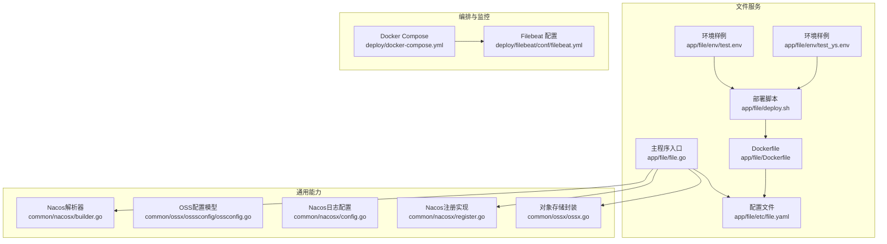
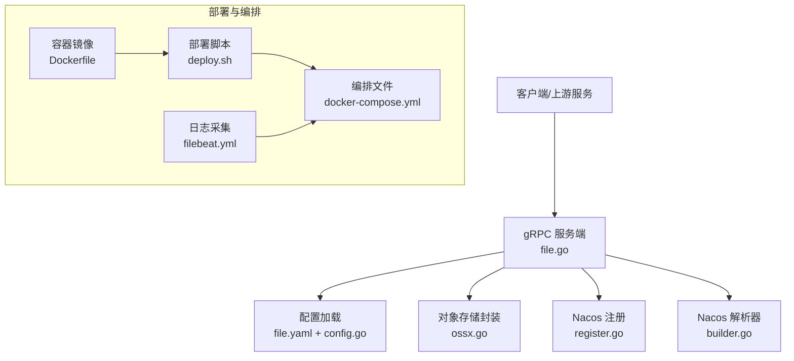
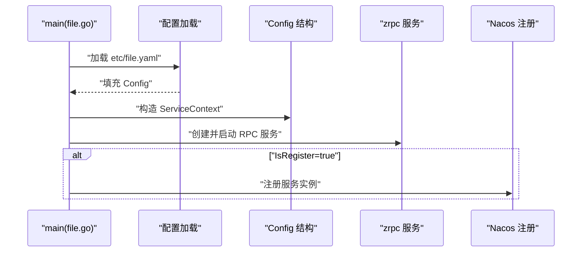
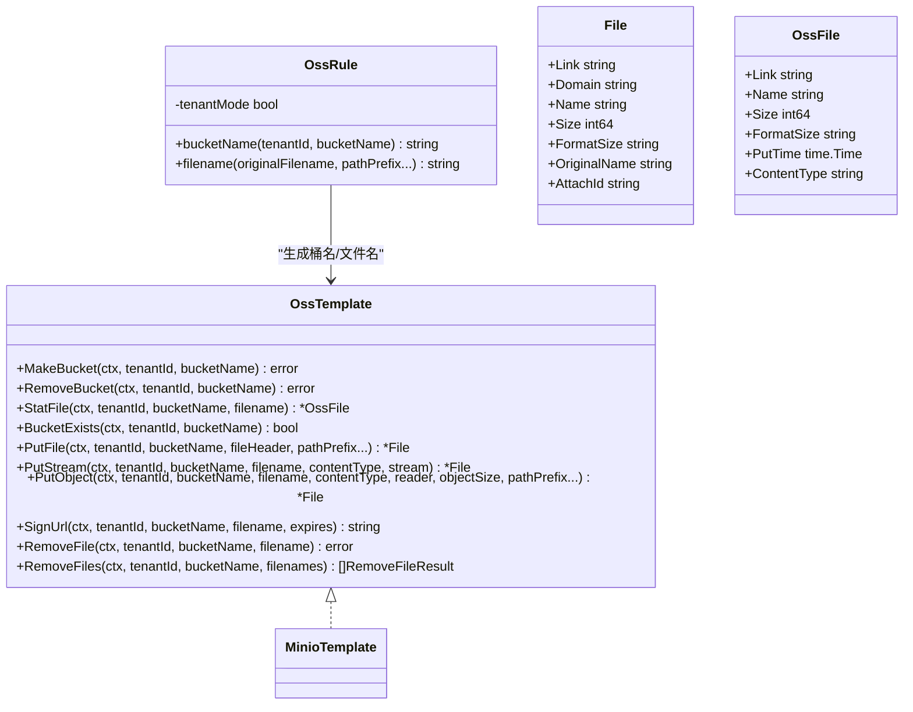
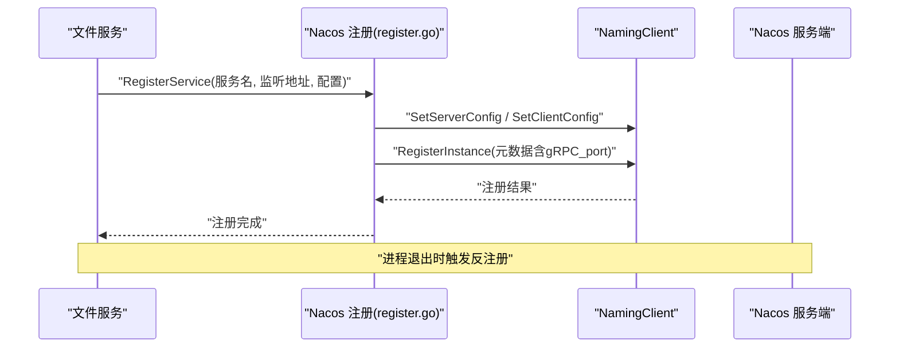
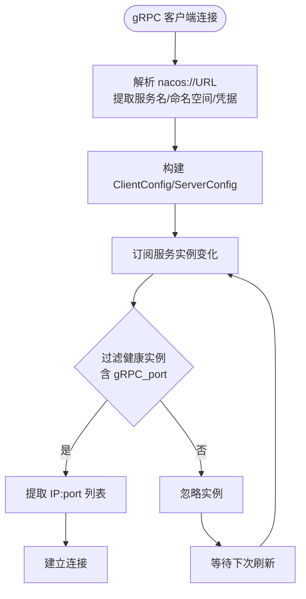
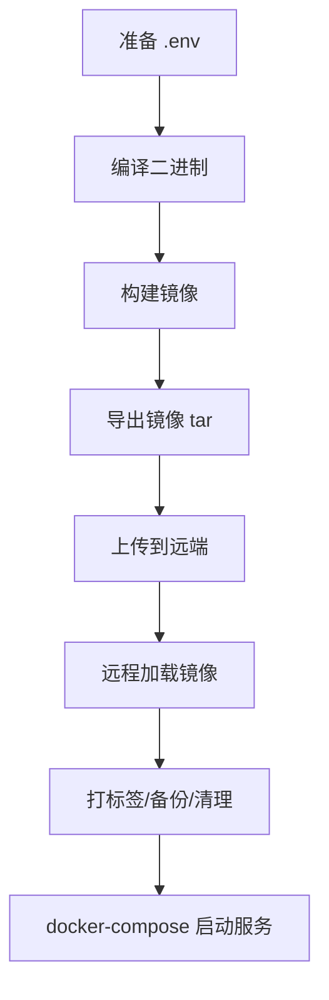
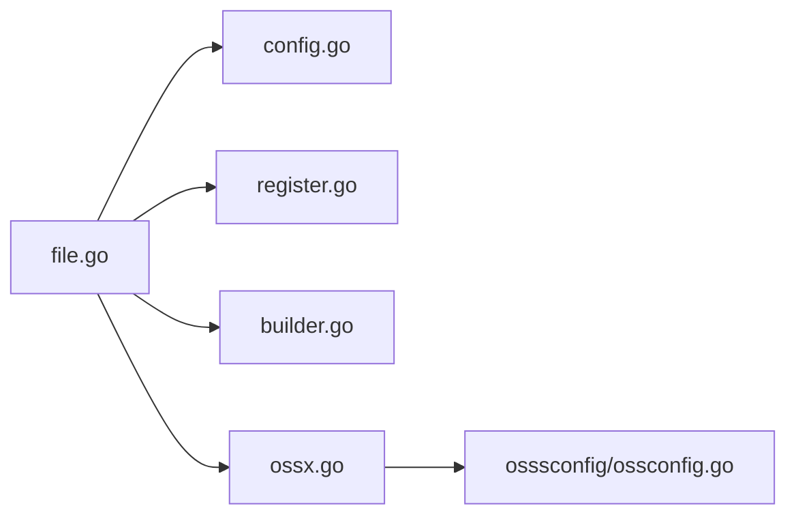

# 服务配置与部署

<cite>
**本文引用的文件**
- [app/file/etc/file.yaml](file://app/file/etc/file.yaml)
- [app/file/internal/config/config.go](file://app/file/internal/config/config.go)
- [app/file/file.go](file://app/file/file.go)
- [common/ossx/ossx.go](file://common/ossx/ossx.go)
- [common/ossx/osssconfig/ossconfig.go](file://common/ossx/osssconfig/ossconfig.go)
- [common/nacosx/config.go](file://common/nacosx/config.go)
- [common/nacosx/register.go](file://common/nacosx/register.go)
- [common/nacosx/builder.go](file://common/nacosx/builder.go)
- [app/file/Dockerfile](file://app/file/Dockerfile)
- [app/file/deploy.sh](file://app/file/deploy.sh)
- [deploy/docker-compose.yml](file://deploy/docker-compose.yml)
- [deploy/filebeat/conf/filebeat.yml](file://deploy/filebeat/conf/filebeat.yml)
- [app/file/env/test.env](file://app/file/env/test.env)
- [app/file/env/test_ys.env](file://app/file/env/test_ys.env)
</cite>

## 目录
1. [简介](#简介)
2. [项目结构](#项目结构)
3. [核心组件](#核心组件)
4. [架构总览](#架构总览)
5. [详细组件分析](#详细组件分析)
6. [依赖分析](#依赖分析)
7. [性能考虑](#性能考虑)
8. [故障排查指南](#故障排查指南)
9. [结论](#结论)
10. [附录](#附录)

## 简介
本指南面向文件服务的配置与部署，围绕 YAML 配置参数、数据库连接、对象存储（OSS）配置、日志设置、性能参数进行详解；并提供 Docker 容器化部署、传统服务器部署流程说明；阐述 Nacos 服务注册与发现的配置方法；给出环境变量、安全配置与监控集成建议；最后提供部署验证、故障排查与性能调优的实用指南。

## 项目结构
文件服务位于 app/file 目录，采用 go-zero RPC 架构，配置由 etc/file.yaml 提供，Dockerfile 用于容器化，deploy.sh 支持远程部署，同时仓库提供了 docker-compose.yml 作为多服务编排参考。

图表来源
- [app/file/etc/file.yaml:1-23](file://app/file/etc/file.yaml#L1-L23)
- [app/file/file.go:28-72](file://app/file/file.go#L28-L72)
- [app/file/Dockerfile:1-42](file://app/file/Dockerfile#L1-L42)
- [app/file/deploy.sh:1-175](file://app/file/deploy.sh#L1-L175)
- [common/ossx/ossx.go:1-152](file://common/ossx/ossx.go#L1-L152)
- [common/ossx/osssconfig/ossconfig.go:1-8](file://common/ossx/osssconfig/ossconfig.go#L1-L8)
- [common/nacosx/config.go:1-38](file://common/nacosx/config.go#L1-L38)
- [common/nacosx/register.go:1-99](file://common/nacosx/register.go#L1-L99)
- [common/nacosx/builder.go:1-139](file://common/nacosx/builder.go#L1-L139)
- [deploy/docker-compose.yml:1-110](file://deploy/docker-compose.yml#L1-L110)
- [deploy/filebeat/conf/filebeat.yml:1-122](file://deploy/filebeat/conf/filebeat.yml#L1-L122)
- [app/file/env/test.env:1-15](file://app/file/env/test.env#L1-L15)
- [app/file/env/test_ys.env:1-15](file://app/file/env/test_ys.env#L1-L15)

章节来源
- [app/file/etc/file.yaml:1-23](file://app/file/etc/file.yaml#L1-L23)
- [app/file/file.go:28-72](file://app/file/file.go#L28-L72)
- [app/file/Dockerfile:1-42](file://app/file/Dockerfile#L1-L42)
- [app/file/deploy.sh:1-175](file://app/file/deploy.sh#L1-L175)
- [deploy/docker-compose.yml:1-110](file://deploy/docker-compose.yml#L1-L110)

## 核心组件
- 配置模型：文件服务的配置结构由 internal/config/config.go 定义，包含 RPC 服务基础配置、Nacos 注册配置、数据库连接、缓存、OSS 配置以及缩略图并发等。
- 主程序入口：file.go 负责加载配置、初始化服务上下文、注册 gRPC 服务、可选地向 Nacos 注册服务，并添加日志拦截器。
- 对象存储封装：common/ossx/ossx.go 提供统一的 OSS 模板接口与租户模式支持，支持多种存储类型（如 MinIO），并提供桶与文件操作、签名链接等能力。
- Nacos 集成：common/nacosx/config.go 提供 SDK 日志配置；register.go 实现服务注册与注销；builder.go 提供基于 nacos://scheme 的 gRPC 解析器，实现客户端侧的服务发现。

章节来源
- [app/file/internal/config/config.go:10-30](file://app/file/internal/config/config.go#L10-L30)
- [app/file/file.go:28-72](file://app/file/file.go#L28-L72)
- [common/ossx/ossx.go:28-152](file://common/ossx/ossx.go#L28-L152)
- [common/nacosx/config.go:8-38](file://common/nacosx/config.go#L8-L38)
- [common/nacosx/register.go:21-99](file://common/nacosx/register.go#L21-L99)
- [common/nacosx/builder.go:22-139](file://common/nacosx/builder.go#L22-L139)

## 架构总览
文件服务采用 go-zero RPC 架构，结合 Nacos 实现服务注册与发现，对象存储抽象屏蔽底层差异，支持租户隔离与多存储类型扩展。部署层面支持 Docker 容器化与传统服务器部署，配合 docker-compose 与 Filebeat 实现可观测性与消息传输。

图表来源
- [app/file/file.go:28-72](file://app/file/file.go#L28-L72)
- [app/file/etc/file.yaml:1-23](file://app/file/etc/file.yaml#L1-L23)
- [app/file/internal/config/config.go:10-30](file://app/file/internal/config/config.go#L10-L30)
- [common/ossx/ossx.go:28-152](file://common/ossx/ossx.go#L28-L152)
- [common/nacosx/register.go:21-99](file://common/nacosx/register.go#L21-L99)
- [common/nacosx/builder.go:22-139](file://common/nacosx/builder.go#L22-L139)
- [app/file/Dockerfile:1-42](file://app/file/Dockerfile#L1-L42)
- [app/file/deploy.sh:1-175](file://app/file/deploy.sh#L1-L175)
- [deploy/docker-compose.yml:1-110](file://deploy/docker-compose.yml#L1-L110)
- [deploy/filebeat/conf/filebeat.yml:1-122](file://deploy/filebeat/conf/filebeat.yml#L1-L122)

## 详细组件分析

### YAML 配置参数详解
- 服务基本信息
  - Name：服务名称
  - ListenOn：监听地址（如 0.0.0.0:21003）
  - Timeout：请求超时（毫秒）
  - Mode：运行模式（dev/test/prod）
- 日志配置
  - Encoding：日志编码（如 plain）
  - Path：日志输出路径（如 /opt/logs/file.rpc）
- Nacos 配置
  - IsRegister：是否注册到 Nacos
  - Host/Port：Nacos 地址与端口
  - Username/PassWord：认证凭据
  - NamespaceId：命名空间
  - ServiceName：服务名
- OSS 配置
  - TenantMode：是否开启租户模式（影响桶名与文件名规则）
- 性能参数
  - ThumbTaskConcurrency：缩略图任务并发数（默认 2）
- 数据库配置
  - DataSource：数据库连接串（示例指向 MySQL）

章节来源
- [app/file/etc/file.yaml:1-23](file://app/file/etc/file.yaml#L1-L23)

### 配置模型与加载流程
- 配置结构
  - RpcServerConf：继承自 go-zero 的 RPC 服务配置
  - NacosConfig：Nacos 注册所需字段
  - DB：数据库连接串
  - Cache：缓存配置
  - Oss：OSS 配置（TenantMode）
  - ThumbTaskConcurrency：缩略图并发
- 加载与启动
  - main 中通过 conf.MustLoad 加载 etc/file.yaml
  - 构建 ServiceContext 并创建 zrpc 服务
  - 可选注册到 Nacos，添加日志拦截器

图表来源
- [app/file/file.go:28-72](file://app/file/file.go#L28-L72)
- [app/file/etc/file.yaml:1-23](file://app/file/etc/file.yaml#L1-L23)
- [app/file/internal/config/config.go:10-30](file://app/file/internal/config/config.go#L10-L30)

章节来源
- [app/file/internal/config/config.go:10-30](file://app/file/internal/config/config.go#L10-L30)
- [app/file/file.go:28-72](file://app/file/file.go#L28-L72)

### 对象存储（OSS）配置与行为
- OSS 抽象
  - OssTemplate 接口：统一的桶与文件操作、签名链接、批量删除等
  - OssRule：根据租户模式生成桶名与文件名
  - File/OssFile：文件元信息结构
- 租户模式
  - 当开启租户模式时，桶名与文件路径会带上租户前缀，便于多租户隔离
- 类型支持
  - 当前模板工厂支持按类别创建 MinIO 模板，其他类型可扩展
- 使用要点
  - 通过 GetOss 回调获取租户对应的存储配置，再创建模板
  - 支持流式上传、分片上传、签名链接生成等

图表来源
- [common/ossx/ossx.go:28-152](file://common/ossx/ossx.go#L28-L152)

章节来源
- [common/ossx/ossx.go:28-152](file://common/ossx/ossx.go#L28-L152)
- [common/ossx/osssconfig/ossconfig.go:1-8](file://common/ossx/osssconfig/ossconfig.go#L1-L8)

### Nacos 服务注册与发现
- 注册流程
  - 解析 ListenOn，推断公网地址
  - 构造 ServerConfig 与 ClientConfig
  - 通过 NamingClient 注册实例，携带 gRPC 端口与元数据
  - 在进程退出时自动反注册
- 客户端解析
  - 基于 nacos://scheme 的自定义解析器
  - 订阅服务实例变化，提取健康且带 gRPC_port 的实例
  - 定期轮询刷新实例列表
- 日志配置
  - 提供全局日志级别、日志目录与输出目标配置

图表来源
- [common/nacosx/register.go:21-99](file://common/nacosx/register.go#L21-L99)
- [app/file/file.go:46-64](file://app/file/file.go#L46-L64)

图表来源
- [common/nacosx/builder.go:29-139](file://common/nacosx/builder.go#L29-L139)

章节来源
- [common/nacosx/register.go:21-99](file://common/nacosx/register.go#L21-L99)
- [common/nacosx/builder.go:29-139](file://common/nacosx/builder.go#L29-L139)
- [common/nacosx/config.go:8-38](file://common/nacosx/config.go#L8-L38)
- [app/file/file.go:46-64](file://app/file/file.go#L46-L64)

### 部署流程

#### Docker 容器化部署
- 构建阶段
  - 使用 Alpine 基础镜像，设置时区与代理
  - 将 etc 与二进制复制到最终镜像
- 运行阶段
  - CMD 启动服务并指定配置文件路径
- 适用场景
  - 单机测试或生产容器化部署

章节来源
- [app/file/Dockerfile:1-42](file://app/file/Dockerfile#L1-L42)

#### 传统服务器部署
- 本地编译与打包
  - 使用 deploy.sh 加载 .env 环境变量
  - go build 编译二进制
  - docker build 生成镜像
  - docker save 导出为 tar 包
- 远程部署
  - 通过 sshpass + scp 上传镜像包
  - 远程 docker load 加载镜像
  - 打标签、备份旧镜像、清理历史备份
  - docker-compose up 启动服务

图表来源
- [app/file/deploy.sh:1-175](file://app/file/deploy.sh#L1-L175)
- [app/file/env/test.env:1-15](file://app/file/env/test.env#L1-L15)
- [app/file/env/test_ys.env:1-15](file://app/file/env/test_ys.env#L1-L15)

章节来源
- [app/file/deploy.sh:1-175](file://app/file/deploy.sh#L1-L175)
- [app/file/env/test.env:1-15](file://app/file/env/test.env#L1-L15)
- [app/file/env/test_ys.env:1-15](file://app/file/env/test_ys.env#L1-L15)

#### Kubernetes 部署（通用建议）
- Pod 规格
  - 设置资源限制与请求（CPU/内存）
  - 使用 Readiness/Liveness 探针
- 配置管理
  - 使用 ConfigMap 管理 etc/file.yaml
  - 使用 Secret 管理敏感信息（如数据库密码、OSS 凭据）
- 服务暴露
  - ClusterIP/NodePort/LoadBalancer 依据需求选择
- 健康与可观测性
  - 集成 Prometheus 与日志采集（如 Filebeat）
  - 配置 Nacos 服务发现（客户端侧解析器）

[本节为概念性说明，不直接分析具体文件，故无“章节来源”]

### 环境变量与安全配置
- 环境变量
  - REMOTE_USER/REMOTE_PASSWD/REMOTE_HOST/REMOTE_PORT/REMOTE_PATH/REMOTE_COMPOSE_PATH：远程部署所需
  - IMAGE_NAME/SERVICE_NAME：镜像与服务名
  - REMOTE_IMAGE_TAG/BACKUP_KEEP：镜像标签与备份策略
- 安全建议
  - 将数据库密码、Nacos 凭据、OSS 凭据放入 Secret
  - 限制容器权限（非特权、只读根文件系统）
  - 使用最小权限原则的网络策略与 RBAC
  - 启用 TLS 与 mTLS（如需）

章节来源
- [app/file/env/test.env:1-15](file://app/file/env/test.env#L1-L15)
- [app/file/env/test_ys.env:1-15](file://app/file/env/test_ys.env#L1-L15)

### 监控集成
- 日志采集
  - Filebeat 采集服务日志并发送至 Kafka
  - docker-compose 中已配置 Kafka 与 Filebeat 服务
- 指标与追踪
  - 建议在应用层集成 Prometheus 指标
  - 配合链路追踪（如 Jaeger/OpenTelemetry）记录请求链路

章节来源
- [deploy/docker-compose.yml:32-53](file://deploy/docker-compose.yml#L32-L53)
- [deploy/filebeat/conf/filebeat.yml:1-122](file://deploy/filebeat/conf/filebeat.yml#L1-L122)

## 依赖分析
- 组件耦合
  - file.go 依赖配置模型与 Nacos 注册/解析器
  - OSS 抽象独立于具体实现，通过回调注入租户配置
- 外部依赖
  - go-zero RPC 框架
  - Nacos SDK
  - 对象存储 SDK（以 MinIO 为例）
- 潜在循环依赖
  - 未见循环导入；各模块职责清晰

图表来源
- [app/file/file.go:28-72](file://app/file/file.go#L28-L72)
- [app/file/internal/config/config.go:10-30](file://app/file/internal/config/config.go#L10-L30)
- [common/nacosx/register.go:21-99](file://common/nacosx/register.go#L21-L99)
- [common/nacosx/builder.go:29-139](file://common/nacosx/builder.go#L29-L139)
- [common/ossx/ossx.go:28-152](file://common/ossx/ossx.go#L28-L152)
- [common/ossx/osssconfig/ossconfig.go:1-8](file://common/ossx/osssconfig/ossconfig.go#L1-L8)

章节来源
- [app/file/file.go:28-72](file://app/file/file.go#L28-L72)
- [common/ossx/ossx.go:28-152](file://common/ossx/ossx.go#L28-L152)

## 性能考虑
- 并发与吞吐
  - ThumbTaskConcurrency 控制缩略图任务并发，建议根据 CPU 与 I/O 能力调整
- 存储与网络
  - OSS 上传建议使用分片与断点续传（如需）
  - 合理设置 Kafka 分区与副本，避免单点瓶颈
- 资源限制
  - 在容器或编排中设置合理的 CPU/内存限制与 QoS
- 日志与观测
  - 合理的日志级别与滚动策略，避免磁盘 IO 抖动

[本节为通用建议，不直接分析具体文件，故无“章节来源”]

## 故障排查指南
- 无法连接 Nacos
  - 检查 Host/Port/用户名/密码与 NamespaceId
  - 查看 Nacos 日志配置与日志目录
- 服务未注册或不可发现
  - 确认 IsRegister=true 且 gRPC_port 元数据正确
  - 检查健康检查与集群/分组配置
- 对象存储异常
  - 校验租户模式与桶名/文件名规则
  - 确认 Endpoint、AccessKey、SecretKey 正确
- 部署失败
  - 检查 .env 变量是否完整
  - 关注 deploy.sh 的上传与标签流程
- 日志与监控
  - 查看 Filebeat 输出与 Kafka 消费情况
  - 检查容器日志与应用日志路径

章节来源
- [common/nacosx/config.go:8-38](file://common/nacosx/config.go#L8-L38)
- [common/nacosx/register.go:21-99](file://common/nacosx/register.go#L21-L99)
- [common/nacosx/builder.go:29-139](file://common/nacosx/builder.go#L29-L139)
- [app/file/etc/file.yaml:1-23](file://app/file/etc/file.yaml#L1-L23)
- [app/file/deploy.sh:1-175](file://app/file/deploy.sh#L1-L175)
- [deploy/filebeat/conf/filebeat.yml:1-122](file://deploy/filebeat/conf/filebeat.yml#L1-L122)

## 结论
本文档从配置参数、对象存储、Nacos 注册与发现、容器化与传统部署、环境变量与安全、监控集成等方面，系统梳理了文件服务的配置与部署实践。建议在生产环境中结合资源规划与安全策略，完善密钥管理、网络隔离与可观测性体系，并通过灰度发布与回滚策略保障稳定性。

## 附录
- 验证步骤建议
  - 启动服务后，通过 gRPC 客户端调用 Ping 接口验证连通性
  - 上传/下载/签名链接功能验证 OSS 正常
  - 查看 Nacos 控制台确认服务实例健康
  - 检查 Filebeat 是否将日志发送至 Kafka
- 常用命令
  - docker build / docker run / docker-compose up/down
  - sshpass + scp + ssh 远程部署
  - docker images/load/save/rmi 管理镜像

[本节为通用建议，不直接分析具体文件，故无“章节来源”]