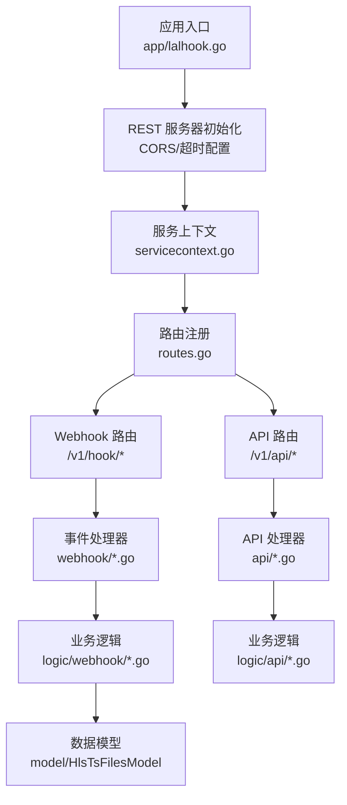
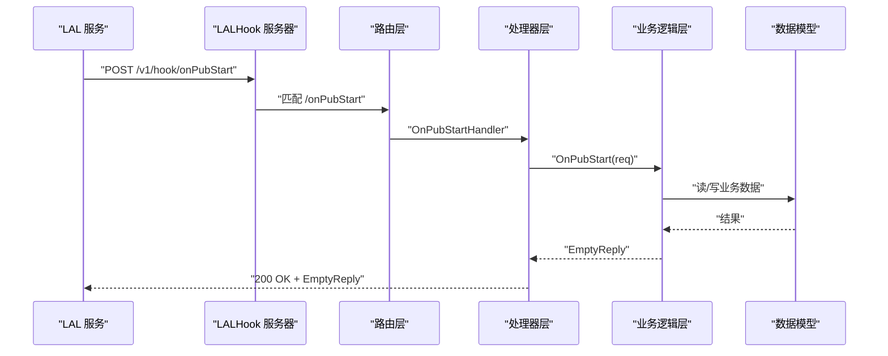
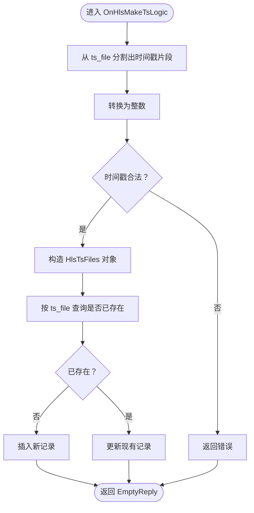
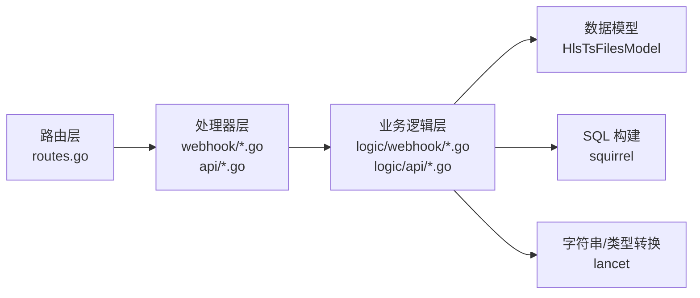

# LALHook 流媒体钩子服务

<cite>
**本文引用的文件**
- [app/lalhook.go](file://app/lalhook/lalhook.go)
- [lalhook.yaml](file://app/lalhook/etc/lalhook.yaml)
- [config.go](file://app/lalhook/internal/config/config.go)
- [types.go](file://app/lalhook/internal/types/types.go)
- [lalhook.api](file://app/lalhook/lalhook.api)
- [routes.go](file://app/lalhook/internal/handler/routes.go)
- [servicecontext.go](file://app/lalhook/internal/svc/servicecontext.go)
- [onpubstarthandler.go](file://app/lalhook/internal/handler/webhook/onpubstarthandler.go)
- [onpubstophandler.go](file://app/lalhook/internal/handler/webhook/onpubstophandler.go)
- [onserverstarthandler.go](file://app/lalhook/internal/handler/webhook/onserverstarthandler.go)
- [onhlsmaketshandler.go](file://app/lalhook/internal/handler/webhook/onhlsmaketshandler.go)
- [listtsfileshandler.go](file://app/lalhook/internal/handler/api/listtsfileshandler.go)
- [onpubstartlogic.go](file://app/lalhook/internal/logic/webhook/onpubstartlogic.go)
- [onserverstartlogic.go](file://app/lalhook/internal/logic/webhook/onserverstartlogic.go)
- [onhlsmaketslogic.go](file://app/lalhook/internal/logic/webhook/onhlsmaketslogic.go)
- [hlstsfilesmodel.go](file://model/hlstsfilesmodel.go)
</cite>

## 目录
1. [简介](#简介)
2. [项目结构](#项目结构)
3. [核心组件](#核心组件)
4. [架构总览](#架构总览)
5. [详细组件分析](#详细组件分析)
6. [依赖分析](#依赖分析)
7. [性能考虑](#性能考虑)
8. [故障排查指南](#故障排查指南)
9. [结论](#结论)
10. [附录](#附录)

## 简介
LALHook 是一个基于 Go-Zero 的流媒体事件钩子服务，用于接收来自 LAL（Low-Latency Live Streaming）服务的各类直播事件通知，并提供 HTTP API 查询 HLS 分片文件信息。其核心能力包括：
- 接收并处理直播推流开始/停止、拉流开始/停止、RTMP 连接、Relay 拉流、服务器启动、周期性状态更新等事件回调
- 记录 HLS 分片文件元数据（如分片文件名、m3u8 路径、时长、时间戳等），支持去重与更新
- 提供查询 TS 文件列表的 HTTP API，支持按时间区间过滤

本项目采用模块化设计，通过 API 描述文件统一定义事件与 API 的请求/响应结构，使用 goctl 自动生成 handler 与 logic 层骨架，便于扩展与维护。

## 项目结构
LALHook 位于 app/lalhook 目录，主要由以下层次构成：
- 应用入口与配置加载：应用入口负责解析配置、初始化 REST 服务器、注册路由与上下文
- 配置层：定义服务运行参数与数据库连接信息
- 类型定义层：集中定义所有 Webhook 请求体与 API 请求/响应结构
- 路由层：将 API 描述文件映射为实际 HTTP 路由
- 处理器层：每个事件/API 对应一个 handler，负责参数解析与错误返回
- 业务逻辑层：每个事件/API 对应一个 logic，实现具体业务处理
- 服务上下文：注入配置与数据模型（如 HLS TS 文件模型）

图表来源
- [app/lalhook.go:19-47](file://app/lalhook/lalhook.go#L19-L47)
- [routes.go:17-96](file://app/lalhook/internal/handler/routes.go#L17-L96)
- [servicecontext.go:10-20](file://app/lalhook/internal/svc/servicecontext.go#L10-L20)

章节来源
- [app/lalhook.go:17-47](file://app/lalhook/lalhook.go#L17-L47)
- [lalhook.yaml:1-10](file://app/lalhook/etc/lalhook.yaml#L1-L10)
- [config.go:5-10](file://app/lalhook/internal/config/config.go#L5-L10)
- [routes.go:17-96](file://app/lalhook/internal/handler/routes.go#L17-L96)

## 核心组件
- 应用入口与服务器初始化
  - 解析命令行配置文件路径，默认 etc/lalhook.yaml
  - 初始化 REST 服务器，启用自定义 CORS（动态 Origin、凭证、方法与头部白名单）
  - 设置路由前缀与超时，注册服务上下文
- 配置管理
  - 继承 go-zero 的 RestConf，新增 DB.DataSource 字段
  - 默认监听 0.0.0.0:11002，日志编码为 plain，超时 15000ms
- 类型系统
  - 统一定义所有 Webhook 请求体（如 onPubStart、onPubStop、onSubStart、onSubStop、onRtmpConnect、onServerStart、onUpdate、onHlsMakeTs）
  - 统一定义 API 请求体（如 ts/list）与响应体（如 ApiListTsReply）
- 路由与 API
  - Webhook 路由前缀 /v1/hook，包含 onUpdate、onPubStart、onPubStop、onSubStart、onSubStop、onRelayPullStart、onRelayPullStop、onRtmpConnect、onServerStart、onHlsMakeTs
  - API 路由前缀 /v1/api，包含 ts/list
- 数据模型
  - 通过 ServiceContext 注入 HlsTsFilesModel，用于存储与更新 HLS 分片文件元数据

章节来源
- [app/lalhook.go:19-47](file://app/lalhook/lalhook.go#L19-L47)
- [lalhook.yaml:1-10](file://app/lalhook/etc/lalhook.yaml#L1-L10)
- [config.go:5-10](file://app/lalhook/internal/config/config.go#L5-L10)
- [types.go:62-197](file://app/lalhook/internal/types/types.go#L62-L197)
- [lalhook.api:200-245](file://app/lalhook/lalhook.api#L200-L245)
- [lalhook.api:269-278](file://app/lalhook/lalhook.api#L269-L278)
- [servicecontext.go:10-20](file://app/lalhook/internal/svc/servicecontext.go#L10-L20)

## 架构总览
LALHook 的整体交互流程如下：
- LAL 服务向 /v1/hook 下的各事件端点发起 POST 回调
- 服务端路由将请求交由对应 handler 解析参数
- handler 调用 logic 执行业务逻辑
- logic 通过 ServiceContext 获取数据模型，进行持久化或查询
- 返回空响应体 EmptyReply 或查询结果 ApiListTsReply

图表来源
- [routes.go:31-50](file://app/lalhook/internal/handler/routes.go#L31-L50)
- [onpubstarthandler.go:13-29](file://app/lalhook/internal/handler/webhook/onpubstarthandler.go#L13-L29)
- [onpubstartlogic.go:27-31](file://app/lalhook/internal/logic/webhook/onpubstartlogic.go#L27-L31)

## 详细组件分析

### Webhook 事件定义与触发条件
- onPubStart（推流开始）
  - 触发条件：他人向当前节点推流（RTMP/RTSP）
  - 请求体字段：server_id、session_id、protocol、base_type、remote_addr、url、app_name、stream_name、url_param、has_in_session、has_out_session、read_bytes_sum、wrote_bytes_sum
  - 处理流程：解析请求 -> 调用 logic -> 返回 EmptyReply
- onPubStop（推流停止）
  - 触发条件：推流会话结束
  - 请求体字段：同上，但仅在停止时填充
  - 处理流程：解析请求 -> 调用 logic -> 返回 EmptyReply
- onSubStart（拉流开始）
  - 触发条件：他人从当前节点拉流（RTMP/FLV/TS）
  - 请求体字段：server_id、session_id、protocol、base_type、remote_addr、url、app_name、stream_name、url_param、has_in_session、has_out_session、read_bytes_sum、wrote_bytes_sum
- onSubStop（拉流停止）
  - 触发条件：拉流会话结束
  - 请求体字段：同上
- onRelayPullStart / onRelayPullStop（回源拉流）
  - 触发条件：节点主动从上游拉流开始/结束（RTMP/RTSP）
  - 请求体字段：同上
- onRtmpConnect（RTMP 连接）
  - 触发条件：收到 RTMP Connect 信令
  - 请求体字段：server_id、session_id、remote_addr、app、flashVer、tcUrl
- onServerStart（服务器启动）
  - 触发条件：LAL 服务启动
  - 请求体字段：server_id、bin_info、lal_version、api_version、notify_version、start_time
- onUpdate（周期性状态更新）
  - 触发条件：LAL 定时上报当前节点的所有 group 与 session 信息
  - 请求体字段：server_id、groups（包含 stream_name、app_name、音频/视频编解码、分辨率、pub/sub/pull 信息、帧率等）
- onHlsMakeTs（HLS 分片生成）
  - 触发条件：HLS 生成每个 TS 分片文件时
  - 请求体字段：event、stream_name、cwd、ts_file、live_m3u8_file、record_m3u8_file、id、duration、server_id
  - 处理要点：解析 ts_file 中的时间戳，写入或更新 HlsTsFilesModel

章节来源
- [types.go:62-197](file://app/lalhook/internal/types/types.go#L62-L197)
- [lalhook.api:200-245](file://app/lalhook/lalhook.api#L200-L245)

### Webhook 处理逻辑与实现要点
- onPubStartHandler / onPubStopHandler / onServerStartHandler / OnHlsMakeTsHandler
  - 负责参数解析、错误处理与响应返回
  - 错误通过 httpx.ErrorCtx 返回，成功通过 httpx.OkJsonCtx 返回
- OnPubStartLogic / OnServerStartLogic
  - 当前为空实现，预留扩展点（如记录事件、调用外部 Webhook、写入数据库等）
- OnHlsMakeTsLogic
  - 从 ts_file 中提取时间戳（按“-”分割取倒数第二个片段并转换为整数）
  - 将 event、stream_name、cwd、ts_file、live_m3u8_file、record_m3u8_file、id、duration、server_id 等字段封装为 HlsTsFiles
  - 使用 squirrel 条件查询 ts_file 是否已存在；不存在则插入，存在则更新
  - 返回 EmptyReply

图表来源
- [onhlsmaketslogic.go:33-78](file://app/lalhook/internal/logic/webhook/onhlsmaketslogic.go#L33-L78)

章节来源
- [onpubstarthandler.go:13-29](file://app/lalhook/internal/handler/webhook/onpubstarthandler.go#L13-L29)
- [onpubstophandler.go:13-29](file://app/lalhook/internal/handler/webhook/onpubstophandler.go#L13-L29)
- [onserverstarthandler.go:13-29](file://app/lalhook/internal/handler/webhook/onserverstarthandler.go#L13-L29)
- [onhlsmaketshandler.go:13-29](file://app/lalhook/internal/handler/webhook/onhlsmaketshandler.go#L13-L29)
- [onpubstartlogic.go:27-31](file://app/lalhook/internal/logic/webhook/onpubstartlogic.go#L27-L31)
- [onserverstartlogic.go:27-31](file://app/lalhook/internal/logic/webhook/onserverstartlogic.go#L27-L31)
- [onhlsmaketslogic.go:33-78](file://app/lalhook/internal/logic/webhook/onhlsmaketslogic.go#L33-L78)

### HTTP API 设计
- 路由前缀：/v1/api
- 超时：7200 秒
- 路由：/ts/list
  - 方法：POST
  - 请求体：ApiListTsRequest（可选字段：streamName、startTime、endTime、event）
  - 响应体：ApiListTsReply（包含 streamName、serverId、files 数组）
  - 处理器：ListTsFilesHandler
  - 逻辑：由 logic/api 实现（当前文件未展示，按 goctl 生成规范预留）

章节来源
- [lalhook.api:269-278](file://app/lalhook/lalhook.api#L269-L278)
- [listtsfileshandler.go:13-29](file://app/lalhook/internal/handler/api/listtsfileshandler.go#L13-L29)

### 配置文件详解
- 文件位置：etc/lalhook.yaml
- 关键项：
  - Name：服务名称
  - Host/Port：监听地址与端口
  - Mode：运行模式（dev/prod 等）
  - Log.Encoding：日志编码格式
  - Timeout：默认超时时间
  - DB.DataSource：MySQL 连接字符串（用于 HlsTsFilesModel）

章节来源
- [lalhook.yaml:1-10](file://app/lalhook/etc/lalhook.yaml#L1-L10)
- [config.go:5-10](file://app/lalhook/internal/config/config.go#L5-L10)

### 部署步骤
- 准备 MySQL 数据库并创建表（HlsTsFilesModel 所需表）
- 修改 etc/lalhook.yaml 中 DB.DataSource 为实际数据库连接信息
- 启动服务：./lalhook -f etc/lalhook.yaml
- 验证：
  - curl -X POST http://<host>:<port>/v1/hook/onServerStart -H "Content-Type: application/json" -d '{}'
  - curl -X POST http://<host>:<port>/v1/api/ts/list -H "Content-Type: application/json" -d '{}'

章节来源
- [app/lalhook.go:17-47](file://app/lalhook/lalhook.go#L17-L47)
- [lalhook.yaml:1-10](file://app/lalhook/etc/lalhook.yaml#L1-L10)

### 集成示例
- 在 LAL 侧配置 HTTP Notify 回调地址为 http://<lalhook-host>:<port>/v1/hook/<事件名>，例如：
  - http://<lalhook-host>:11002/v1/hook/onPubStart
  - http://<lalhook-host>:11002/v1/hook/onHlsMakeTs
- 在 LAL 侧配置 HTTP API 查询地址为 http://<lalhook-host>:<port>/v1/api/ts/list
- 事件回调将自动触发对应 handler -> logic 流程，HLS 分片事件会写入数据库

章节来源
- [lalhook.api:200-245](file://app/lalhook/lalhook.api#L200-L245)
- [lalhook.api:269-278](file://app/lalhook/lalhook.api#L269-L278)

## 依赖分析
- 组件耦合
  - 路由层与处理器层松耦合：通过统一的 ServiceContext 注入依赖
  - 处理器层与逻辑层松耦合：处理器仅负责参数解析与错误返回
  - 逻辑层与数据模型紧耦合：通过 HlsTsFilesModel 进行读写
- 外部依赖
  - go-zero：REST 服务器、路由、HTTP 参数解析与错误返回
  - squirrel：SQL 查询构建
  - lancet：字符串分割与类型转换工具
  - MySQL：持久化存储

图表来源
- [routes.go:17-96](file://app/lalhook/internal/handler/routes.go#L17-L96)
- [onhlsmaketslogic.go:12-16](file://app/lalhook/internal/logic/webhook/onhlsmaketslogic.go#L12-L16)
- [servicecontext.go:10-20](file://app/lalhook/internal/svc/servicecontext.go#L10-L20)

章节来源
- [routes.go:17-96](file://app/lalhook/internal/handler/routes.go#L17-L96)
- [onhlsmaketslogic.go:12-16](file://app/lalhook/internal/logic/webhook/onhlsmaketslogic.go#L12-L16)
- [servicecontext.go:10-20](file://app/lalhook/internal/svc/servicecontext.go#L10-L20)

## 性能考虑
- 路由超时：Webhook 与 API 均设置为 7200 秒，适合长耗时任务（如数据库写入、外部回调）
- CORS：动态 Origin 允许跨域访问，避免缓存污染，同时暴露必要响应头
- SQL 查询：按 ts_file 去重，避免重复写入；建议在 ts_file 上建立索引以提升查询性能
- 并发：go-zero 默认并发安全；如需扩展外部回调（如异步通知），可在 logic 层引入队列或异步任务框架

## 故障排查指南
- 参数解析失败
  - 现象：返回参数解析错误
  - 排查：确认请求体 JSON 结构与 types 定义一致
  - 参考：各 handler 中的 httpx.Parse 调用
- onHlsMakeTs 逻辑错误
  - 现象：tsTimestamp <= 0 或解析失败
  - 排查：检查 ts_file 命名规则是否符合“-”分隔且倒数第二个片段为时间戳
  - 参考：OnHlsMakeTsLogic 的解析与校验逻辑
- 数据库写入异常
  - 现象：插入或更新失败
  - 排查：确认 DB.DataSource 正确、表结构与字段类型匹配、ts_file 唯一性约束
  - 参考：HlsTsFilesModel 的 Insert/Update 调用
- CORS 问题
  - 现象：浏览器跨域失败
  - 排查：确认请求头 Origin、Access-Control-Allow-* 设置正确
  - 参考：应用入口的自定义 CORS 配置

章节来源
- [onhlsmaketshandler.go:14-28](file://app/lalhook/internal/handler/webhook/onhlsmaketshandler.go#L14-L28)
- [onhlsmaketslogic.go:33-78](file://app/lalhook/internal/logic/webhook/onhlsmaketslogic.go#L33-L78)
- [servicecontext.go:10-20](file://app/lalhook/internal/svc/servicecontext.go#L10-L20)
- [app/lalhook.go:28-40](file://app/lalhook/lalhook.go#L28-L40)

## 结论
LALHook 通过清晰的分层设计与统一的类型定义，提供了稳定可靠的流媒体事件钩子与 API 查询能力。当前实现重点覆盖了 HLS 分片事件的入库与查询，其余事件回调预留了扩展点。建议后续完善：
- 在 logic 层补充外部 Webhook 回调、鉴权与重试策略
- 引入异步任务处理长耗时操作
- 增加指标与日志埋点，便于运维与排障

## 附录
- 数据模型（HlsTsFiles）
  - 字段：event、stream_name、cwd、ts_file、live_m3u8_file、record_m3u8_file、ts_id、ts_timestamp、duration、server_id
  - 约束：ts_file 唯一；duration、record_m3u8_file 使用可空类型
- API 示例
  - 查询 TS 文件列表：POST /v1/api/ts/list，请求体包含可选字段 streamName、startTime、endTime、event，响应体包含 files 数组

章节来源
- [types.go:19-26](file://app/lalhook/internal/types/types.go#L19-L26)
- [types.go:248-266](file://app/lalhook/internal/types/types.go#L248-L266)
- [hlstsfilesmodel.go](file://model/hlstsfilesmodel.go)