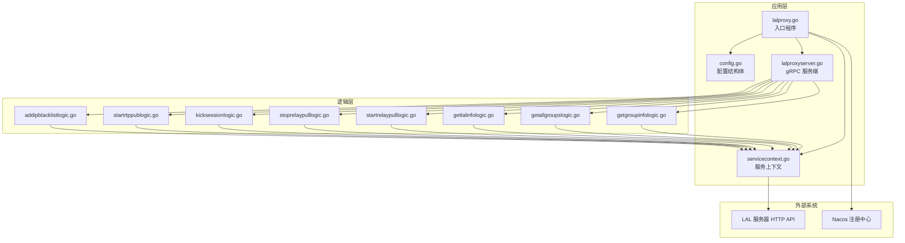
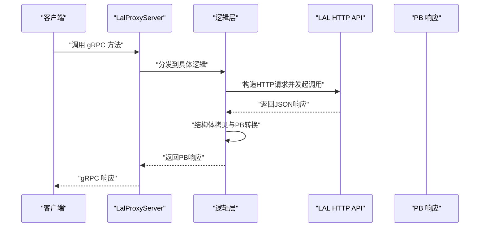
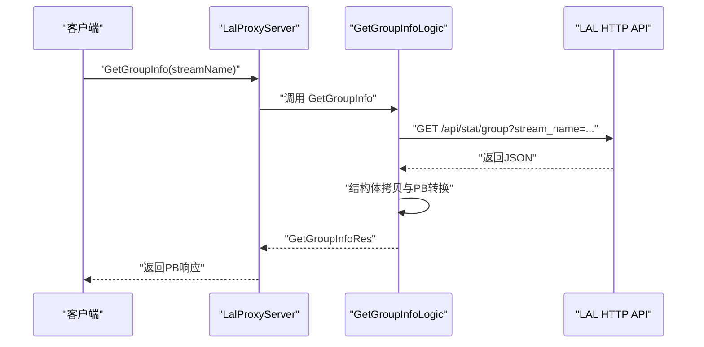
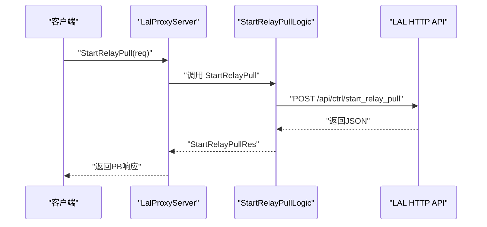
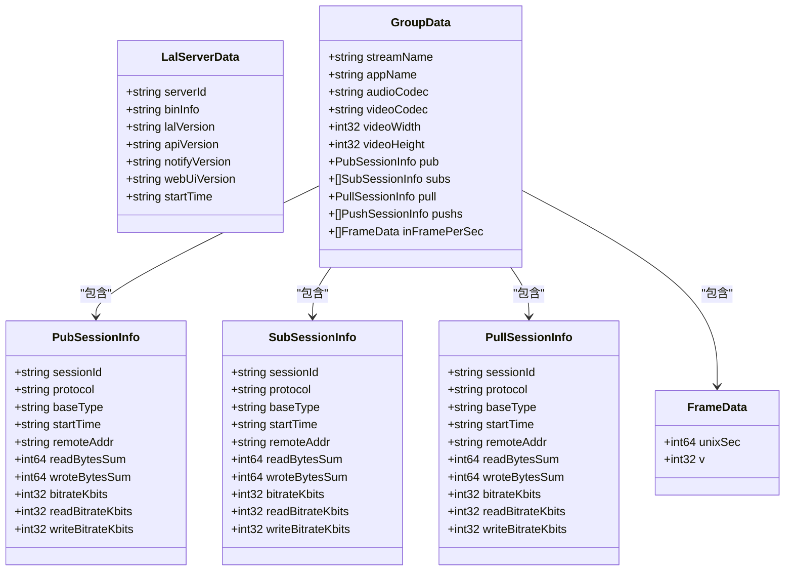
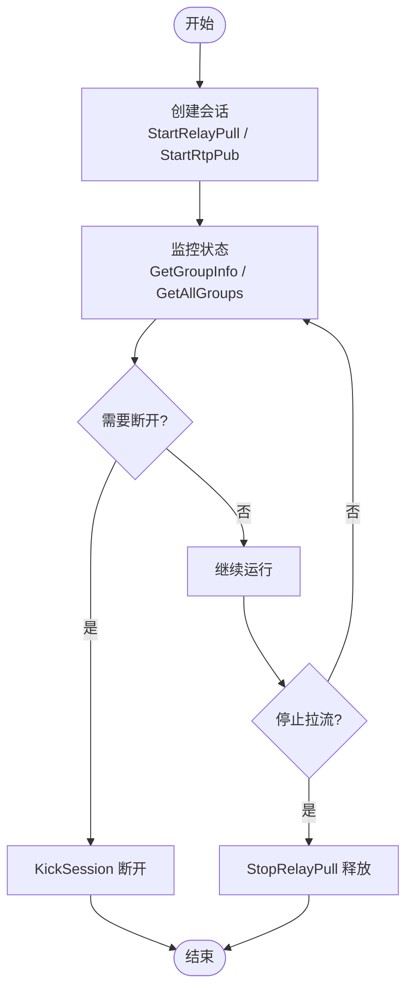
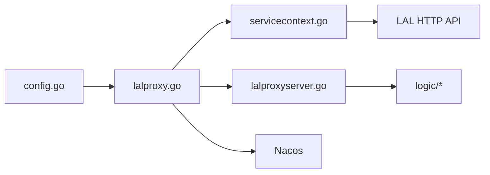

# LALProxy 流媒体代理服务

<cite>
**本文引用的文件**
- [lalproxy.proto](file://app/lalproxy/lalproxy.proto)
- [lalproxy.yaml](file://app/lalproxy/etc/lalproxy.yaml)
- [config.go](file://app/lalproxy/internal/config/config.go)
- [servicecontext.go](file://app/lalproxy/internal/svc/servicecontext.go)
- [lalproxyserver.go](file://app/lalproxy/internal/server/lalproxyserver.go)
- [getgroupinfologic.go](file://app/lalproxy/internal/logic/getgroupinfologic.go)
- [getallgroupslogic.go](file://app/lalproxy/internal/logic/getallgroupslogic.go)
- [getlalinfologic.go](file://app/lalproxy/internal/logic/getlalinfologic.go)
- [startrelaypulllogic.go](file://app/lalproxy/internal/logic/startrelaypulllogic.go)
- [stoprelaypulllogic.go](file://app/lalproxy/internal/logic/stoprelaypulllogic.go)
- [kicksessionlogic.go](file://app/lalproxy/internal/logic/kicksessionlogic.go)
- [startrtppublogic.go](file://app/lalproxy/internal/logic/startrtppublogic.go)
- [addipblacklistlogic.go](file://app/lalproxy/internal/logic/addipblacklistlogic.go)
- [laltype.go](file://common/lalx/laltype.go)
- [lalproxy.go](file://app/lalproxy/lalproxy.go)
- [lalproxy.swagger.json](file://swagger/lalproxy.swagger.json)
</cite>

## 目录
1. [简介](#简介)
2. [项目结构](#项目结构)
3. [核心组件](#核心组件)
4. [架构总览](#架构总览)
5. [详细组件分析](#详细组件分析)
6. [依赖关系分析](#依赖关系分析)
7. [性能考虑](#性能考虑)
8. [故障排除指南](#故障排除指南)
9. [结论](#结论)
10. [附录](#附录)

## 简介
LALProxy 是一个基于 gRPC 的流媒体代理服务，负责封装并转发 LAL（Low-Latency Aggregation Library）服务器的 HTTP API 能力，提供统一的查询与控制接口。其主要功能包括：
- RTMP 推流管理：查询单一流会话、查询所有活跃流组、查询服务器基础信息
- RTMP 拉流代理：启动/停止中继拉流（Relay Pull）
- GB28181 RTP 推流：启动 RTP 接收端口（TCP/UDP），用于接入 GB28181 设备流
- 会话管理：踢出会话（支持 PUB/SUB/PULL 类型）
- IP 黑名单：将特定 IP 加入 HLS 协议黑名单，限制访问
- 群组管理：查询直播群组、群组信息与会话列表

LALProxy 以 go-zero 为基础框架，通过 gRPC 暴露服务，并通过内部 HTTP 客户端调用 LAL 服务器的 HTTP API，完成数据转换与转发。

## 项目结构
LALProxy 位于 app/lalproxy 目录，采用典型的 go-zero 微服务分层结构：
- etc：配置文件目录（lalproxy.yaml）
- internal/config：应用配置结构体定义
- internal/svc：服务上下文，封装 LAL 服务器基础 URL 与 HTTP 客户端
- internal/logic：各 RPC 方法对应的业务逻辑实现
- internal/server：gRPC 服务端桩代码（由 proto 生成）
- lalproxy.proto：gRPC 服务定义与消息格式
- lalproxy.go：入口程序，加载配置、注册服务、接入 Nacos

图表来源
- [lalproxy.go:27-70](file://app/lalproxy/lalproxy.go#L27-L70)
- [config.go:5-26](file://app/lalproxy/internal/config/config.go#L5-L26)
- [servicecontext.go:12-35](file://app/lalproxy/internal/svc/servicecontext.go#L12-L35)
- [lalproxyserver.go:15-79](file://app/lalproxy/internal/server/lalproxyserver.go#L15-L79)
- [getgroupinfologic.go:31-86](file://app/lalproxy/internal/logic/getgroupinfologic.go#L31-L86)
- [getallgroupslogic.go:31-88](file://app/lalproxy/internal/logic/getallgroupslogic.go#L31-L88)
- [getlalinfologic.go:31-78](file://app/lalproxy/internal/logic/getlalinfologic.go#L31-L78)
- [startrelaypulllogic.go:30-93](file://app/lalproxy/internal/logic/startrelaypulllogic.go#L30-L93)
- [stoprelaypulllogic.go:31-78](file://app/lalproxy/internal/logic/stoprelaypulllogic.go#L31-L78)
- [kicksessionlogic.go:30-86](file://app/lalproxy/internal/logic/kicksessionlogic.go#L30-L86)
- [startrtppublogic.go:30-89](file://app/lalproxy/internal/logic/startrtppublogic.go#L30-L89)
- [addipblacklistlogic.go:31-89](file://app/lalproxy/internal/logic/addipblacklistlogic.go#L31-L89)

章节来源
- [lalproxy.go:27-70](file://app/lalproxy/lalproxy.go#L27-L70)
- [lalproxy.yaml:1-19](file://app/lalproxy/etc/lalproxy.yaml#L1-L19)
- [config.go:5-26](file://app/lalproxy/internal/config/config.go#L5-L26)
- [servicecontext.go:12-35](file://app/lalproxy/internal/svc/servicecontext.go#L12-L35)
- [lalproxyserver.go:15-79](file://app/lalproxy/internal/server/lalproxyserver.go#L15-L79)

## 核心组件
- 配置模块：定义 RPC 服务监听、日志、Nacos 注册、LAL 服务器地址与超时等参数
- 服务上下文：构建 LAL 服务器基础 URL 与带超时的 HTTP 客户端
- gRPC 服务端：将 RPC 方法映射到各逻辑层处理函数
- 逻辑层：封装对 LAL HTTP API 的调用，进行参数校验、HTTP 请求构造、响应解析与 PB 结构转换
- 公共类型：定义与 LAL HTTP API 对齐的数据模型，用于结构体拷贝与转换

章节来源
- [config.go:5-26](file://app/lalproxy/internal/config/config.go#L5-L26)
- [servicecontext.go:12-35](file://app/lalproxy/internal/svc/servicecontext.go#L12-L35)
- [lalproxyserver.go:15-79](file://app/lalproxy/internal/server/lalproxyserver.go#L15-L79)
- [laltype.go:3-126](file://common/lalx/laltype.go#L3-L126)

## 架构总览
LALProxy 的调用链路如下：
- 客户端通过 gRPC 调用 LALProxy 服务
- 服务端根据方法路由到对应逻辑层
- 逻辑层构造 LAL HTTP API 请求，调用 LAL 服务器
- 解析 LAL 返回的 JSON，转换为 PB 响应结构体返回给客户端

图表来源
- [lalproxyserver.go:26-78](file://app/lalproxy/internal/server/lalproxyserver.go#L26-L78)
- [getgroupinfologic.go:34-85](file://app/lalproxy/internal/logic/getgroupinfologic.go#L34-L85)
- [getallgroupslogic.go:34-87](file://app/lalproxy/internal/logic/getallgroupslogic.go#L34-L87)
- [getlalinfologic.go:34-77](file://app/lalproxy/internal/logic/getlalinfologic.go#L34-L77)
- [startrelaypulllogic.go:38-92](file://app/lalproxy/internal/logic/startrelaypulllogic.go#L38-L92)
- [stoprelaypulllogic.go:41-77](file://app/lalproxy/internal/logic/stoprelaypulllogic.go#L41-L77)
- [kicksessionlogic.go:38-85](file://app/lalproxy/internal/logic/kicksessionlogic.go#L38-L85)
- [startrtppublogic.go:41-88](file://app/lalproxy/internal/logic/startrtppublogic.go#L41-L88)
- [addipblacklistlogic.go:42-88](file://app/lalproxy/internal/logic/addipblacklistlogic.go#L42-L88)

## 详细组件分析

### gRPC 服务与消息模型
- 服务定义：lalProxy 提供查询类与控制类两类接口，覆盖群组信息、服务器信息、中继拉流、会话管理、RTP 接收与 IP 黑名单
- 消息模型：PB 消息与 LAL HTTP API 返回结构严格对齐，便于结构体拷贝与转换
- 错误码：统一使用 LAL HTTP API 的错误码语义，便于上层一致性处理

章节来源
- [lalproxy.proto:288-308](file://app/lalproxy/lalproxy.proto#L288-L308)
- [laltype.go:3-126](file://common/lalx/laltype.go#L3-L126)

### 查询类接口
- GetGroupInfo：按流名称查询单个群组信息，包含编码、分辨率、会话列表与帧率统计
- GetAllGroups：查询所有活跃群组列表
- GetLalInfo：查询 LAL 服务器基础信息（版本、启动时间等）

图表来源
- [lalproxyserver.go:26-30](file://app/lalproxy/internal/server/lalproxyserver.go#L26-L30)
- [getgroupinfologic.go:34-85](file://app/lalproxy/internal/logic/getgroupinfologic.go#L34-L85)

章节来源
- [getgroupinfologic.go:31-86](file://app/lalproxy/internal/logic/getgroupinfologic.go#L31-L86)
- [getallgroupslogic.go:31-88](file://app/lalproxy/internal/logic/getallgroupslogic.go#L31-L88)
- [getlalinfologic.go:31-78](file://app/lalproxy/internal/logic/getlalinfologic.go#L31-L78)

### 控制类接口
- StartRelayPull：启动中继拉流，支持 RTMP/RTSP，可配置超时、重试、无输出自动停止、RTSP 模式与调试导出
- StopRelayPull：停止指定流的中继拉流
- KickSession：踢出会话（支持 PUB/SUB/PULL）
- StartRtpPub：打开 GB28181 RTP 接收端口（TCP/UDP），支持超时与调试导出
- AddIpBlacklist：将 IP 加入 HLS 协议黑名单，设置过期时间

图表来源
- [lalproxyserver.go:44-48](file://app/lalproxy/internal/server/lalproxyserver.go#L44-L48)
- [startrelaypulllogic.go:38-92](file://app/lalproxy/internal/logic/startrelaypulllogic.go#L38-L92)

章节来源
- [startrelaypulllogic.go:30-93](file://app/lalproxy/internal/logic/startrelaypulllogic.go#L30-L93)
- [stoprelaypulllogic.go:31-78](file://app/lalproxy/internal/logic/stoprelaypulllogic.go#L31-L78)
- [kicksessionlogic.go:30-86](file://app/lalproxy/internal/logic/kicksessionlogic.go#L30-L86)
- [startrtppublogic.go:30-89](file://app/lalproxy/internal/logic/startrtppublogic.go#L30-L89)
- [addipblacklistlogic.go:31-89](file://app/lalproxy/internal/logic/addipblacklistlogic.go#L31-L89)

### 数据模型与结构转换
- 公共类型：定义与 LAL HTTP API 返回一致的结构体，包含帧率、会话信息、群组数据与服务器信息
- 结构转换：逻辑层使用结构体拷贝将 LAL 返回的 JSON 映射到 PB 消息，保证字段一致性与类型安全

图表来源
- [laltype.go:3-126](file://common/lalx/laltype.go#L3-L126)

章节来源
- [laltype.go:3-126](file://common/lalx/laltype.go#L3-L126)

### 会话管理机制
- 会话创建：StartRelayPull、StartRtpPub 在 LAL 侧创建对应会话
- 状态监控：GetGroupInfo/GetAllGroups 返回会话列表与实时指标（码率、帧率、字节统计）
- 连接管理：KickSession 支持主动断开会话
- 资源清理：StopRelayPull 停止拉流，释放相关资源

图表来源
- [startrelaypulllogic.go:38-92](file://app/lalproxy/internal/logic/startrelaypulllogic.go#L38-L92)
- [startrtppublogic.go:41-88](file://app/lalproxy/internal/logic/startrtppublogic.go#L41-L88)
- [getgroupinfologic.go:34-85](file://app/lalproxy/internal/logic/getgroupinfologic.go#L34-L85)
- [kicksessionlogic.go:38-85](file://app/lalproxy/internal/logic/kicksessionlogic.go#L38-L85)
- [stoprelaypulllogic.go:41-77](file://app/lalproxy/internal/logic/stoprelaypulllogic.go#L41-L77)

章节来源
- [getgroupinfologic.go:31-86](file://app/lalproxy/internal/logic/getgroupinfologic.go#L31-L86)
- [getallgroupslogic.go:31-88](file://app/lalproxy/internal/logic/getallgroupslogic.go#L31-L88)
- [kicksessionlogic.go:30-86](file://app/lalproxy/internal/logic/kicksessionlogic.go#L30-L86)

### IP 黑名单功能
- 添加：AddIpBlacklist 将指定 IP 加入 HLS 协议黑名单，设置过期时间
- 查询：通过 GetGroupInfo/GetAllGroups 获取当前会话与来源地址，结合黑名单策略进行访问控制
- 移除：LAL HTTP API 未提供移除接口，可通过过期时间自然失效或重启 LAL 服务清空

章节来源
- [addipblacklistlogic.go:31-89](file://app/lalproxy/internal/logic/addipblacklistlogic.go#L31-L89)
- [lalproxy.proto:272-286](file://app/lalproxy/lalproxy.proto#L272-L286)

### 群组管理功能
- 查询直播群组：GetAllGroups 返回所有活跃群组列表
- 群组信息获取：GetGroupInfo 返回指定群组的编码、分辨率、会话列表与帧率统计
- 会话列表管理：结合 KickSession 实现对会话的增删改查

章节来源
- [getallgroupslogic.go:31-88](file://app/lalproxy/internal/logic/getallgroupslogic.go#L31-L88)
- [getgroupinfologic.go:31-86](file://app/lalproxy/internal/logic/getgroupinfologic.go#L31-L86)

### 流媒体操作接口
- 启动/停止 RTMP 推流：通过 StartRelayPull/StopRelayPull 控制中继拉流
- 启动/停止 Relay 拉流：同上
- 踢出会话：KickSession 支持 PUB/SUB/PULL 三类会话
- RTP 接收：StartRtpPub 打开端口，支持 TCP/UDP 与超时控制
- IP 黑名单：AddIpBlacklist 限制 HLS 协议访问

章节来源
- [startrelaypulllogic.go:30-93](file://app/lalproxy/internal/logic/startrelaypulllogic.go#L30-L93)
- [stoprelaypulllogic.go:31-78](file://app/lalproxy/internal/logic/stoprelaypulllogic.go#L31-L78)
- [kicksessionlogic.go:30-86](file://app/lalproxy/internal/logic/kicksessionlogic.go#L30-L86)
- [startrtppublogic.go:30-89](file://app/lalproxy/internal/logic/startrtppublogic.go#L30-L89)
- [addipblacklistlogic.go:31-89](file://app/lalproxy/internal/logic/addipblacklistlogic.go#L31-L89)

## 依赖关系分析
- 配置依赖：config.go 定义配置结构，lalproxy.go 加载配置并注入服务上下文
- 上下文依赖：servicecontext.go 构造 LAL 基础 URL 与 HTTP 客户端，被所有逻辑层共享
- 服务端依赖：lalproxyserver.go 将 gRPC 方法映射到逻辑层
- 外部依赖：LAL HTTP API、Nacos 注册中心

图表来源
- [lalproxy.go:30-66](file://app/lalproxy/lalproxy.go#L30-L66)
- [config.go:5-26](file://app/lalproxy/internal/config/config.go#L5-L26)
- [servicecontext.go:18-34](file://app/lalproxy/internal/svc/servicecontext.go#L18-L34)
- [lalproxyserver.go:20-24](file://app/lalproxy/internal/server/lalproxyserver.go#L20-L24)

章节来源
- [lalproxy.go:30-66](file://app/lalproxy/lalproxy.go#L30-L66)
- [servicecontext.go:18-34](file://app/lalproxy/internal/svc/servicecontext.go#L18-L34)
- [lalproxyserver.go:20-24](file://app/lalproxy/internal/server/lalproxyserver.go#L20-L24)

## 性能考虑
- 超时控制：服务上下文基于配置设置 HTTP 客户端超时，避免阻塞影响整体吞吐
- 日志级别：配置文件支持日志级别调整，生产环境建议使用 info 或更高
- 并发与连接：LAL HTTP 客户端复用连接池，减少握手开销
- 资源回收：StopRelayPull/KickSession 主动释放会话资源，降低内存占用
- 监控指标：GetGroupInfo/GetAllGroups 返回实时码率与帧率，可用于动态扩缩容决策

章节来源
- [servicecontext.go:19-23](file://app/lalproxy/internal/svc/servicecontext.go#L19-L23)
- [lalproxy.yaml:4-8](file://app/lalproxy/etc/lalproxy.yaml#L4-L8)

## 故障排除指南
- LAL API 返回非 200：检查 LAL 服务器地址与端口配置，确认网络连通性
- 参数校验失败：核对请求参数（如流名称、会话 ID、IP 地址、端口范围），确保符合约束
- 转换失败：确认公共类型与 PB 消息字段一致，避免结构体拷贝异常
- 注册中心问题：检查 Nacos 配置与服务元数据，确保服务正常注册

章节来源
- [getgroupinfologic.go:44-56](file://app/lalproxy/internal/logic/getgroupinfologic.go#L44-L56)
- [startrelaypulllogic.go:58-69](file://app/lalproxy/internal/logic/startrelaypulllogic.go#L58-L69)
- [kicksessionlogic.go:51-62](file://app/lalproxy/internal/logic/kicksessionlogic.go#L51-L62)
- [addipblacklistlogic.go:55-66](file://app/lalproxy/internal/logic/addipblacklistlogic.go#L55-L66)
- [lalproxy.go:47-64](file://app/lalproxy/lalproxy.go#L47-L64)

## 结论
LALProxy 通过统一的 gRPC 接口封装 LAL 的 HTTP 能力，提供了完善的流媒体会话管理、群组查询与控制能力。其清晰的分层设计、严格的结构体转换与完善的错误处理，使其具备良好的可维护性与扩展性。配合 Nacos 注册与配置中心，可在生产环境中稳定运行并快速迭代。

## 附录

### gRPC 接口文档
- 服务定义：lalProxy
- 方法清单与用途
  - GetGroupInfo：查询指定群组信息
  - GetAllGroups：查询所有活跃群组
  - GetLalInfo：查询服务器基础信息
  - StartRelayPull：启动中继拉流
  - StopRelayPull：停止中继拉流
  - KickSession：踢出会话
  - StartRtpPub：打开 GB28181 RTP 接收端口
  - AddIpBlacklist：添加 IP 到 HLS 黑名单

章节来源
- [lalproxy.proto:288-308](file://app/lalproxy/lalproxy.proto#L288-L308)

### 配置参数详解
- Name：服务名称
- ListenOn：gRPC 监听地址
- Mode：运行模式（dev/test/prod）
- Log.Encoding/Path/Level：日志编码、输出路径与级别
- NacosConfig：注册中心配置（是否注册、主机、端口、用户名、密码、命名空间、服务名）
- DB.DataSource：数据库连接串（当前配置存在但未在逻辑中使用）
- LalServer.Ip/Port/Timeout：LAL 服务器地址、端口与请求超时

章节来源
- [lalproxy.yaml:1-19](file://app/lalproxy/etc/lalproxy.yaml#L1-L19)
- [config.go:5-26](file://app/lalproxy/internal/config/config.go#L5-L26)

### Swagger 文档
- 可通过 swagger 目录下的 lalproxy.swagger.json 查看接口定义与示例

章节来源
- [lalproxy.swagger.json](file://swagger/lalproxy.swagger.json)