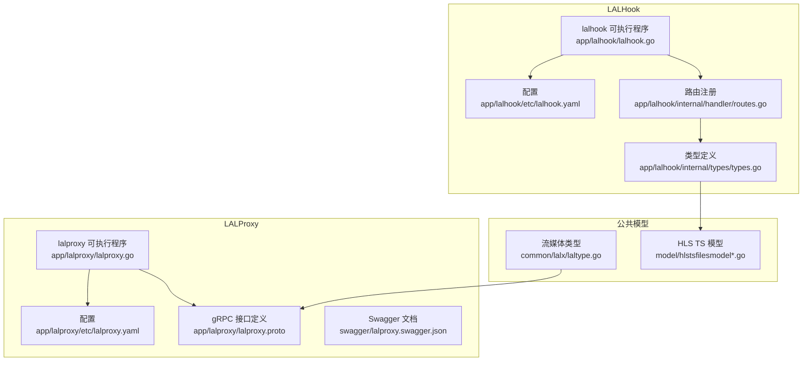
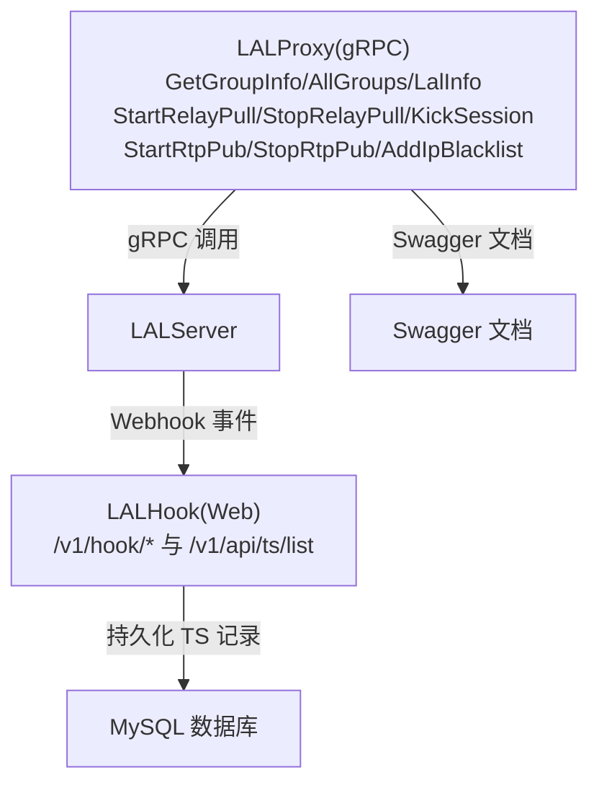
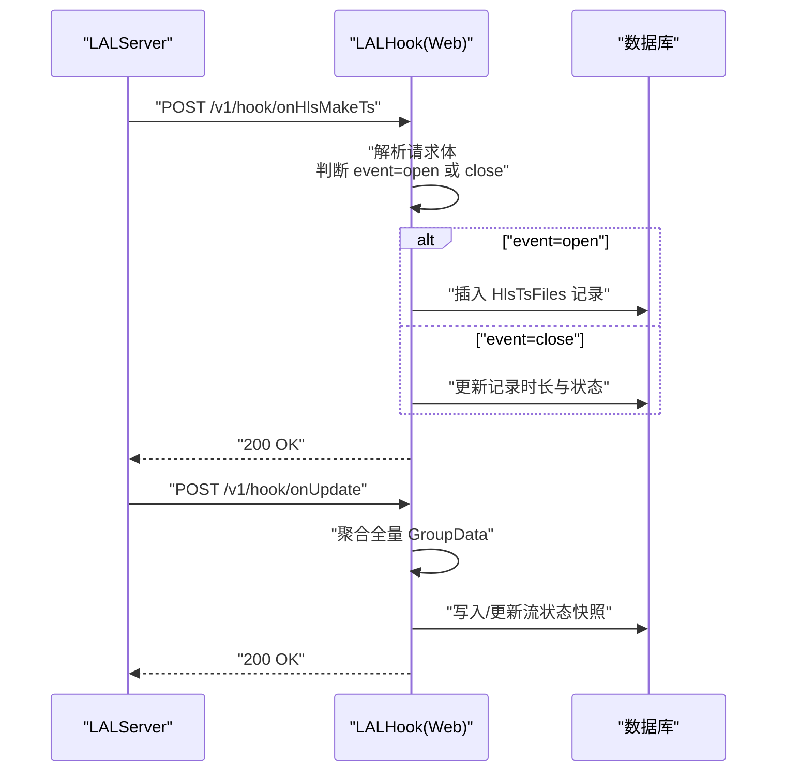
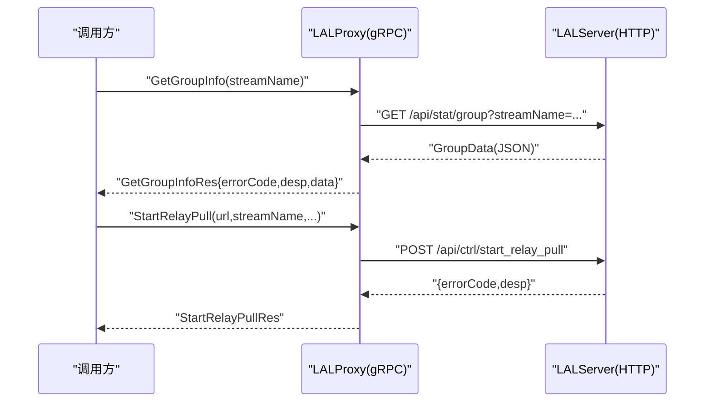
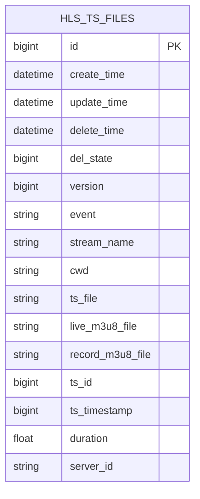
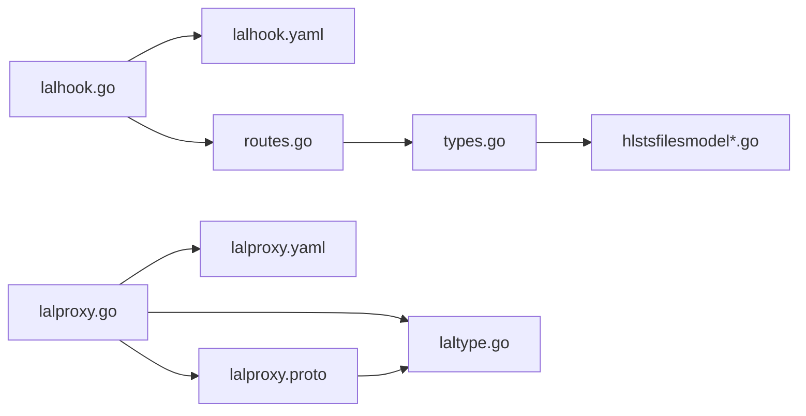

# 流媒体服务

<cite>
**本文引用的文件**
- [lalhook.go](file://app/lalhook/lalhook.go)
- [lalhook.yaml](file://app/lalhook/etc/lalhook.yaml)
- [config.go](file://app/lalhook/internal/config/config.go)
- [routes.go](file://app/lalhook/internal/handler/routes.go)
- [types.go](file://app/lalhook/internal/types/types.go)
- [lalproxy.go](file://app/lalproxy/lalproxy.go)
- [lalproxy.yaml](file://app/lalproxy/etc/lalproxy.yaml)
- [config.go](file://app/lalproxy/internal/config/config.go)
- [lalproxy.proto](file://app/lalproxy/lalproxy.proto)
- [laltype.go](file://common/lalx/laltype.go)
- [hlstsfilesmodel.go](file://model/hlstsfilesmodel.go)
- [hlstsfilesmodel_gen.go](file://model/hlstsfilesmodel_gen.go)
- [lalproxy.swagger.json](file://swagger/lalproxy.swagger.json)
</cite>

## 目录
1. [简介](#简介)
2. [项目结构](#项目结构)
3. [核心组件](#核心组件)
4. [架构总览](#架构总览)
5. [详细组件分析](#详细组件分析)
6. [依赖分析](#依赖分析)
7. [性能考虑](#性能考虑)
8. [故障排除指南](#故障排除指南)
9. [结论](#结论)
10. [附录](#附录)

## 简介
本技术文档面向流媒体服务，围绕两个核心子系统展开：
- LALHook 流媒体钩子服务：负责接收 LALServer 的 Webhook 事件，进行事件分发、持久化与状态同步，并提供简单的 HTTP API（如 TS 文件列表查询）。
- LALProxy 流媒体代理服务：基于 gRPC 封装 LALServer 的 HTTP API，提供查询类与控制类接口，支撑 RTMP 推流管理、拉流代理、录制控制、HLS 黑名单管理等。

文档同时梳理了流媒体数据模型（HLS TS 文件记录）、HTTP API 使用方法、部署配置要点、性能调优建议与常见问题排查，帮助读者快速理解与落地。

## 项目结构
- LALHook 子系统
  - 可执行入口：app/lalhook/lalhook.go
  - 配置：app/lalhook/etc/lalhook.yaml
  - 配置结构：app/lalhook/internal/config/config.go
  - 路由注册：app/lalhook/internal/handler/routes.go
  - 请求/响应类型定义：app/lalhook/internal/types/types.go
- LALProxy 子系统
  - 可执行入口：app/lalproxy/lalproxy.go
  - 配置：app/lalproxy/etc/lalproxy.yaml
  - 配置结构：app/lalproxy/internal/config/config.go
  - gRPC 接口定义：app/lalproxy/lalproxy.proto
  - Swagger 文档：swagger/lalproxy.swagger.json
- 公共数据模型
  - 流媒体通用类型：common/lalx/laltype.go
  - HLS TS 文件模型与 DAO：model/hlstsfilesmodel*.go
- Swagger 文档：swagger/lalproxy.swagger.json

**图表来源**
- [lalhook.go:1-49](file://app/lalhook/lalhook.go#L1-L49)
- [lalhook.yaml:1-10](file://app/lalhook/etc/lalhook.yaml#L1-L10)
- [routes.go:1-98](file://app/lalhook/internal/handler/routes.go#L1-L98)
- [types.go:1-219](file://app/lalhook/internal/types/types.go#L1-L219)
- [lalproxy.go:1-71](file://app/lalproxy/lalproxy.go#L1-L71)
- [lalproxy.yaml:1-19](file://app/lalproxy/etc/lalproxy.yaml#L1-L19)
- [lalproxy.proto:1-308](file://app/lalproxy/lalproxy.proto#L1-L308)
- [laltype.go:1-126](file://common/lalx/laltype.go#L1-L126)
- [hlstsfilesmodel.go:1-32](file://model/hlstsfilesmodel.go#L1-L32)
- [hlstsfilesmodel_gen.go:1-394](file://model/hlstsfilesmodel_gen.go#L1-L394)

**章节来源**
- [lalhook.go:1-49](file://app/lalhook/lalhook.go#L1-L49)
- [lalproxy.go:1-71](file://app/lalproxy/lalproxy.go#L1-L71)

## 核心组件
- LALHook Webhook 处理器
  - 提供事件回调端点：/v1/hook/onHlsMakeTs、/v1/hook/onPubStart、/v1/hook/onPubStop、/v1/hook/onRelayPullStart、/v1/hook/onRelayPullStop、/v1/hook/onRtmpConnect、/v1/hook/onServerStart、/v1/hook/onSubStart、/v1/hook/onSubStop、/v1/hook/onUpdate
  - 提供查询接口：/v1/api/ts/list（按时间区间查询 TS 文件列表）
  - 事件类型管理：覆盖 HLS 分片生命周期、推流/拉流生命周期、RTMP 连接、服务器启动、定时更新等
  - 状态同步：通过定时 onUpdate 将全量 group 与 session 信息上报
  - 数据持久化：将 TS 文件记录写入数据库（HlsTsFilesModel），支持 open/close 事件、时长、时间戳等字段
- LALProxy gRPC 服务
  - 封装 LALServer HTTP API：查询类（/api/stat）与控制类（/api/ctrl）
  - 查询接口：GetGroupInfo、GetAllGroups、GetLalInfo
  - 控制接口：StartRelayPull、StopRelayPull、KickSession、StartRtpPub、StopRtpPub、AddIpBlacklist
  - 配置项：LalServer.IP、LalServer.Port、LalServer.Timeout、Nacos 注册开关与元数据
- 数据模型
  - 流媒体通用类型：FrameData、PubSessionInfo、SubSessionInfo、PullSessionInfo、PushSessionInfo、GroupData、LalServerData
  - HLS TS 文件模型：HlsTsFiles，含事件状态、流名称、TS 文件路径、直播/录制 m3u8、TS ID、时间戳、时长、服务器 ID 等字段，配套 DAO 方法（插入、更新、分页、统计等）

**章节来源**
- [routes.go:17-97](file://app/lalhook/internal/handler/routes.go#L17-L97)
- [types.go:6-219](file://app/lalhook/internal/types/types.go#L6-L219)
- [lalproxy.proto:138-308](file://app/lalproxy/lalproxy.proto#L138-L308)
- [laltype.go:3-126](file://common/lalx/laltype.go#L3-L126)
- [hlstsfilesmodel_gen.go:54-71](file://model/hlstsfilesmodel_gen.go#L54-L71)

## 架构总览
LALHook 作为 Web 服务接收 LALServer 的通知，完成事件落库与状态同步；LALProxy 以 gRPC 暴露统一接口，供上层业务或运维系统调用，内部转发到 LALServer 的 HTTP API。

**图表来源**
- [lalhook.go:28-47](file://app/lalhook/lalhook.go#L28-L47)
- [routes.go:17-97](file://app/lalhook/internal/handler/routes.go#L17-L97)
- [lalproxy.go:38-69](file://app/lalproxy/lalproxy.go#L38-L69)
- [lalproxy.proto:288-308](file://app/lalproxy/lalproxy.proto#L288-L308)
- [lalproxy.swagger.json:1-50](file://swagger/lalproxy.swagger.json#L1-L50)

## 详细组件分析

### LALHook Webhook 处理机制
- 直播事件监听
  - onHlsMakeTs：HLS 生成每个 ts 分片时触发，携带 event=open/close、ts_file、live_m3u8_file、record_m3u8_file、ts_id、duration、server_id 等
  - onPubStart/onPubStop：推流开始/结束事件，包含协议、会话 ID、远端地址、URL 参数、累计字节数等
  - onRelayPullStart/onRelayPullStop：回源拉流开始/结束事件
  - onSubStart/onSubStop：拉流开始/结束事件
  - onRtmpConnect：收到 RTMP connect 信令
  - onServerStart：服务启动事件
  - onUpdate：定时汇报所有 group 与 session 信息
- 回调处理流程
  - 路由注册：/v1/hook/* 与 /v1/api/ts/list
  - 事件分发：各回调处理器根据 event 类型与 payload 决策（如 open 仅入库，close 补充时长）
  - 状态同步：onUpdate 定期全量上报，便于外部系统做一致性校验
- 状态同步机制
  - onUpdate 提供全量 GroupData 列表，包含 pub/subs/pull/pushs/in_frame_per_sec 等
  - 与数据库状态比对，确保事件幂等与最终一致
- 事件类型管理
  - 以 types.go 中的 Request 类型为契约，保证跨模块数据结构一致
  - 通过 LALHook 的路由与处理器解耦事件来源与处理逻辑

**图表来源**
- [routes.go:34-92](file://app/lalhook/internal/handler/routes.go#L34-L92)
- [types.go:50-179](file://app/lalhook/internal/types/types.go#L50-L179)
- [hlstsfilesmodel_gen.go:120-139](file://model/hlstsfilesmodel_gen.go#L120-L139)

**章节来源**
- [routes.go:17-97](file://app/lalhook/internal/handler/routes.go#L17-L97)
- [types.go:50-179](file://app/lalhook/internal/types/types.go#L50-L179)

### LALProxy 流媒体代理服务
- RTMP 推流管理
  - StartRtpPub：打开 GB28181 RTP 接收端口，支持指定端口、超时、TCP/UDP、调试 dump
  - StopRtpPub：当前未开放，建议使用 KickSession 替代
- 拉流代理
  - StartRelayPull：从远端拉流，支持 URL、流名称、拉流超时、重试次数、无输出自动停止、RTSP 模式、调试 dump
  - StopRelayPull：停止指定流的中继拉流
- 录制文件管理
  - 通过 onHlsMakeTs 事件与 HLS 模型联动，记录 live/record m3u8 与 ts 文件，支持按时间区间查询
- HLS 转码与播放列表生成
  - LALHook 侧处理 onHlsMakeTs 事件，LALProxy 侧通过查询接口获取实时状态，二者配合实现“事件驱动 + 查询驱动”的双通道
- HTTP API 接口（gRPC 封装）
  - 查询类：GetGroupInfo(streamName)、GetAllGroups()、GetLalInfo()
  - 控制类：StartRelayPull、StopRelayPull、KickSession、StartRtpPub、StopRtpPub、AddIpBlacklist
  - 错误码与描述：遵循 LALServer HTTP API 错误码规范，便于统一处理

**图表来源**
- [lalproxy.proto:138-218](file://app/lalproxy/lalproxy.proto#L138-L218)
- [lalproxy.proto:288-308](file://app/lalproxy/lalproxy.proto#L288-L308)

**章节来源**
- [lalproxy.proto:138-308](file://app/lalproxy/lalproxy.proto#L138-L308)

### 流媒体数据模型设计
- HLS TS 文件记录
  - 字段：event、stream_name、cwd、ts_file、live_m3u8_file、record_m3u8_file、ts_id、ts_timestamp、duration、server_id
  - 事件语义：open 表示 TS 创建，close 表示 TS 写入完成（此时补全 duration）
  - 查询：按时间戳区间、流名称、事件类型等条件检索
- 流状态跟踪
  - GroupData 聚合 pub/subs/pull/pushs/in_frame_per_sec，用于实时监控与告警
  - 与 onUpdate 事件配合，形成“事件驱动 + 周期性快照”的双重保障
- 元数据管理
  - LalServerData：服务器 ID、版本信息、启动时间等
  - 会话信息：Pub/Sub/Pull 三类会话的协议、起始时间、对端地址、累计字节、码率等

**图表来源**
- [hlstsfilesmodel_gen.go:54-71](file://model/hlstsfilesmodel_gen.go#L54-L71)

**章节来源**
- [laltype.go:3-126](file://common/lalx/laltype.go#L3-L126)
- [hlstsfilesmodel_gen.go:54-71](file://model/hlstsfilesmodel_gen.go#L54-L71)

## 依赖分析
- LALHook
  - 依赖 go-zero REST 服务框架，启用 CORS 并注册路由
  - 依赖数据库连接（DSN 来自配置），通过 HlsTsFilesModel 进行 CRUD
- LALProxy
  - 依赖 go-zero gRPC 服务框架，注册 lalProxy 服务
  - 依赖 Nacos 注册中心（可选），在开发/测试模式下启用反射
  - 依赖 LALServer HTTP API，通过配置中的 IP/Port/Timeout 访问

**图表来源**
- [lalhook.go:19-47](file://app/lalhook/lalhook.go#L19-L47)
- [lalhook.yaml:1-10](file://app/lalhook/etc/lalhook.yaml#L1-L10)
- [routes.go:17-97](file://app/lalhook/internal/handler/routes.go#L17-L97)
- [types.go:6-219](file://app/lalhook/internal/types/types.go#L6-L219)
- [lalproxy.go:27-70](file://app/lalproxy/lalproxy.go#L27-L70)
- [lalproxy.yaml:1-19](file://app/lalproxy/etc/lalproxy.yaml#L1-L19)
- [lalproxy.proto:1-308](file://app/lalproxy/lalproxy.proto#L1-L308)
- [laltype.go:1-126](file://common/lalx/laltype.go#L1-L126)

**章节来源**
- [lalhook.go:19-47](file://app/lalhook/lalhook.go#L19-L47)
- [lalproxy.go:27-70](file://app/lalproxy/lalproxy.go#L27-L70)

## 性能考虑
- Webhook 并发与限流
  - LALHook 的回调处理器应避免阻塞 IO，建议异步落库或使用队列缓冲
  - 对高频事件（如 onHlsMakeTs）可采用批量写入策略，降低数据库压力
- 数据库优化
  - 为 ts_file、stream_name、ts_timestamp 建立索引，提升查询效率
  - 使用分页查询与条件裁剪，避免全表扫描
- gRPC 与 LALServer 交互
  - 合理设置 LalServer.Timeout，避免长时间阻塞导致调用堆积
  - 在 LALProxy 侧增加超时与重试策略，结合熔断与降级
- 缓存与热点
  - 对 GetGroupInfo/GetAllGroups 的热点数据可引入本地缓存，定期由 onUpdate 同步刷新
- 日志与追踪
  - 统一日志字段（如 app、server_id、stream_name），便于链路追踪与问题定位

## 故障排除指南
- Webhook 无法接收
  - 检查 LALHook 配置文件与监听地址/端口，确认防火墙放行
  - 校验 CORS 设置，确保前端或上游网关 Origin 能正确透传
- 事件重复或丢失
  - 根据 ts_file 去重，close 事件补全时长；若发现重复 open，需清理脏数据
  - 定期巡检 onUpdate 的完整性，核对数据库与 LALServer 的状态一致性
- gRPC 调用失败
  - 确认 LALServer.IP/Port/Timeout 配置正确
  - 若启用 Nacos 注册，检查服务发现与负载均衡配置
  - 查看错误码与描述，依据 LALServer HTTP API 错误码规范定位问题
- 数据库异常
  - 检查 DSN 与权限，确认连接池配置合理
  - 对并发写入冲突（版本号）进行重试或幂等处理

**章节来源**
- [lalhook.yaml:1-10](file://app/lalhook/etc/lalhook.yaml#L1-L10)
- [lalproxy.yaml:1-19](file://app/lalproxy/etc/lalproxy.yaml#L1-L19)
- [lalproxy.proto:138-218](file://app/lalproxy/lalproxy.proto#L138-L218)

## 结论
本方案通过 LALHook 与 LALProxy 的分工协作，实现了事件驱动与查询控制的双通道能力：前者聚焦实时事件与数据落库，后者提供统一的 gRPC 接口与强大的控制能力。配合完善的流媒体数据模型与健壮的错误处理，能够满足直播场景下的推流、拉流、录制、HLS 生成与播放列表维护等核心需求。

## 附录
- 部署配置要点
  - LALHook：配置 Host/Port、DB.DataSource、Timeout；确保 CORS 与超时设置符合实际环境
  - LALProxy：配置 ListenOn、Nacos 注册、LalServer.IP/Port/Timeout、日志路径与级别
- Swagger 文档
  - 参考 swagger/lalproxy.swagger.json 获取接口概览与错误码说明

**章节来源**
- [lalhook.yaml:1-10](file://app/lalhook/etc/lalhook.yaml#L1-L10)
- [lalproxy.yaml:1-19](file://app/lalproxy/etc/lalproxy.yaml#L1-L19)
- [lalproxy.swagger.json:1-50](file://swagger/lalproxy.swagger.json#L1-L50)