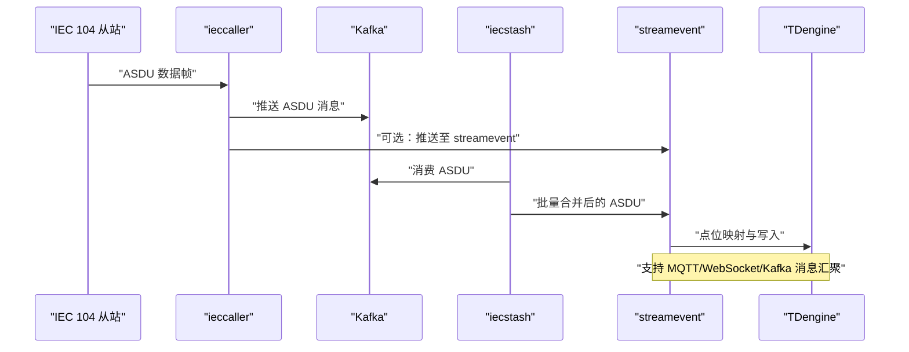
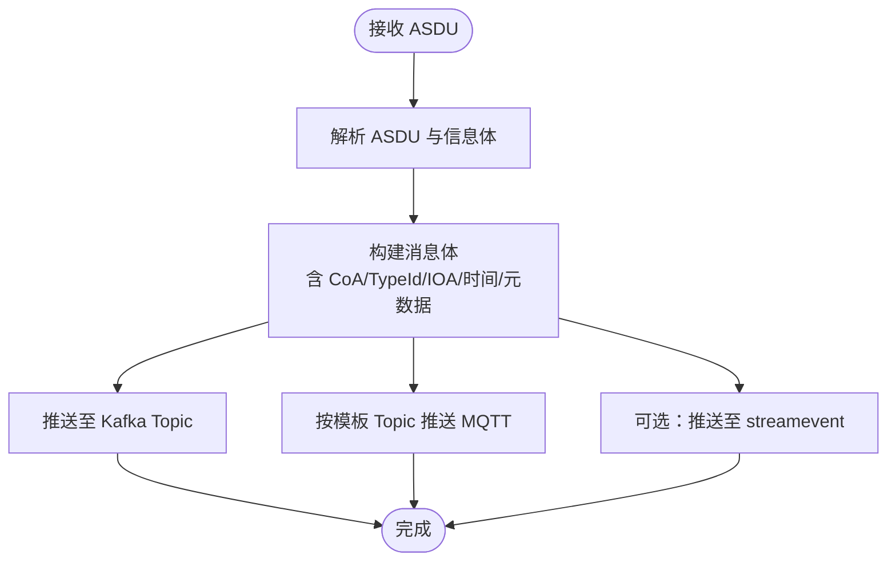
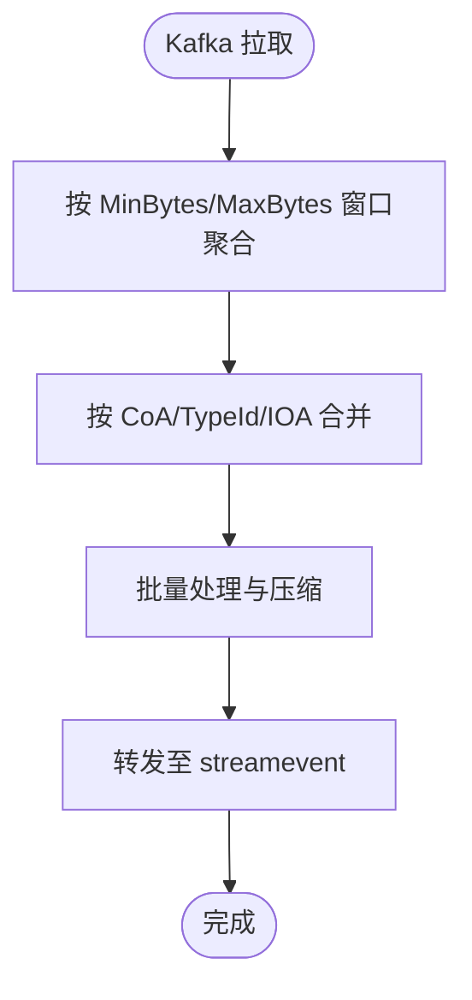
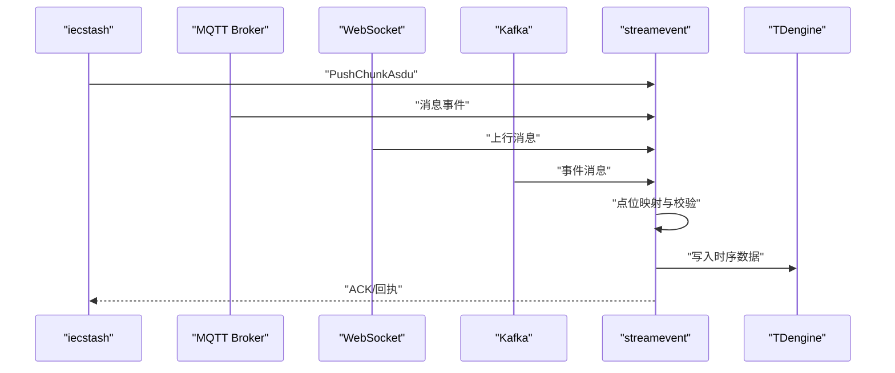
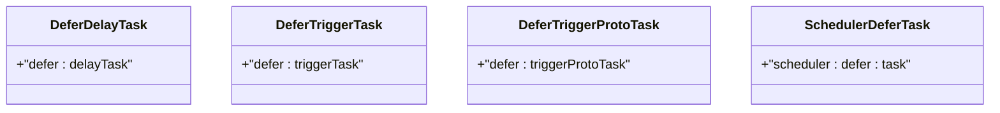
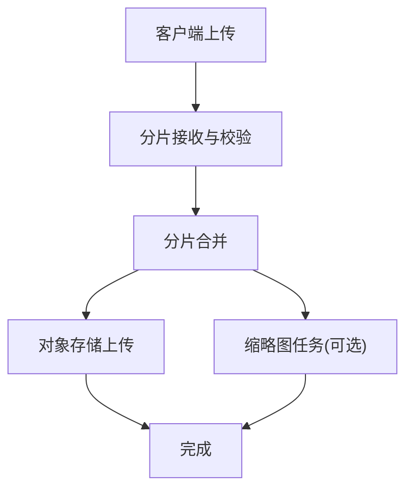
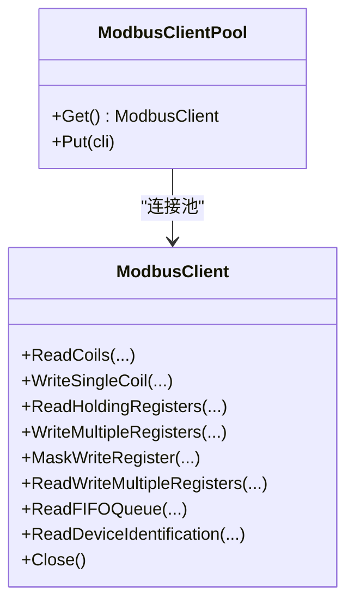
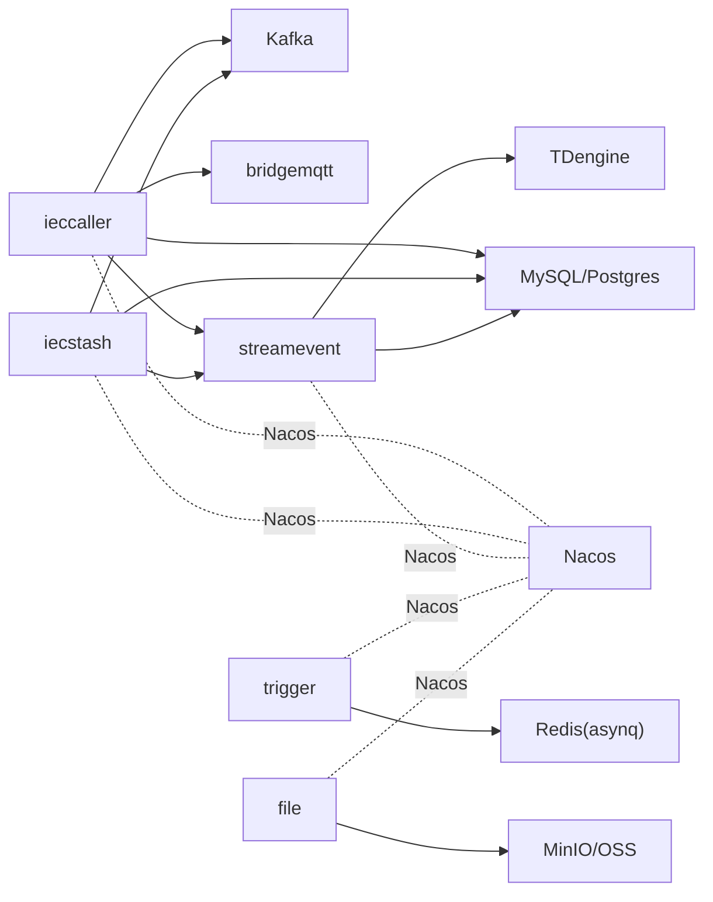

# 核心服务

<cite>
**本文引用的服务与组件**
- [README.md](file://README.md)
- [ieccaller.yaml](file://app/ieccaller/etc/ieccaller.yaml)
- [iecstash.yaml](file://app/iecstash/etc/iecstash.yaml)
- [streamevent.yaml](file://facade/streamevent/etc/streamevent.yaml)
- [trigger.yaml](file://app/trigger/etc/trigger.yaml)
- [file.yaml](file://app/file/etc/file.yaml)
- [types.go](file://common/iec104/types/types.go)
- [client.go](file://common/modbusx/client.go)
- [message.go](file://common/mqttx/message.go)
- [ossx.go](file://common/ossx/ossx.go)
- [tasktype.go](file://common/asynqx/tasktype.go)
- [ieccaller.proto](file://app/ieccaller/ieccaller.proto)
- [iecstash.proto](file://app/iecstash/iecstash.proto)
- [streamevent.proto](file://facade/streamevent/streamevent.proto)
- [trigger.proto](file://app/trigger/trigger.proto)
- [file.proto](file://app/file/file.proto)
- [trigger.md](file://docs/trigger.md)
- [socketiox-documentation.md](file://docs/socketiox-documentation.md)
- [trigger.swagger.json](file://swagger/trigger.swagger.json)
- [streamevent.swagger.json](file://swagger/streamevent.swagger.json)
- [podengine.swagger.json](file://swagger/podengine.swagger.json)
- [mqttstream.swagger.json](file://swagger/mqttstream.swagger.json)
- [lalproxy.swagger.json](file://swagger/lalproxy.swagger.json)
- [xfusionmock.swagger.json](file://swagger/xfusionmock.swagger.json)
- [docker-compose.yml](file://deploy/docker-compose.yml)
</cite>

## 目录
1. [简介](#简介)
2. [项目结构](#项目结构)
3. [核心组件](#核心组件)
4. [架构总览](#架构总览)
5. [详细组件分析](#详细组件分析)
6. [依赖分析](#依赖分析)
7. [性能考虑](#性能考虑)
8. [故障排查指南](#故障排查指南)
9. [结论](#结论)
10. [附录](#附录)

## 简介
本文件聚焦 zero-service 的核心服务模块，围绕 IEC 104 数采平台（ieccaller、iecstash、streamevent）、异步任务调度服务（Trigger）、文件服务（file）、流媒体钩子（lalhook）、协议处理服务（Modbus、MQTT、HTTP 代理）、容器管理服务（podengine）以及对外接口层（facade/streamevent），提供功能定位、架构设计、实现原理、配置说明、API 文档与最佳实践建议。

## 项目结构
- 服务分布于 app/ 与 facade/ 目录，采用 go-zero 微服务框架，gRPC + grpc-gateway + Protocol Buffers 作为接口契约，结合 Swagger 文档与 Nacos 服务注册。
- 数采平台由三个服务协同：ieccaller（主站）、iecstash（Kafka 消费与合并）、streamevent（统一事件协议与 TDengine 落库）。
- Trigger 提供两类核心能力：基于 asynq 的异步任务队列与自研计划任务引擎；file 提供分片上传与对象存储集成；lalhook 提供 LAL 流媒体回调；协议处理服务覆盖 Modbus、MQTT、HTTP 代理；podengine 提供容器生命周期管理。

```mermaid
graph TB
subgraph "应用层"
IECCALLER["ieccaller<br/>IEC 104 主站"]
IECSTASH["iecstash<br/>Kafka 消费与合并"]
STREAMEVENT["streamevent<br/>统一事件协议"]
TRIGGER["trigger<br/>异步任务调度"]
FILE["file<br/>文件服务"]
BRIDGEMODBUS["bridgemodbus<br/>Modbus 桥接"]
BRIDGEMQTT["bridgemqtt<br/>MQTT 桥接"]
BRIDGEGTW["bridgegtw<br/>HTTP 代理"]
PODENGINE["podengine<br/>容器管理"]
LALHOOK["lalhook<br/>流媒体钩子"]
end
subgraph "基础设施"
KAFKA["Kafka"]
REDIS["Redis(asynq)"]
TD["TDengine"]
MYSQL["MySQL/Postgres"]
MINIO["MinIO/OSS"]
NACOS["Nacos"]
end
IECCALLER --> KAFKA
IECSTASH <- --> KAFKA
IECCALLER --> BRIDGEMQTT
IECCALLER --> STREAMEVENT
IECSTASH --> STREAMEVENT
TRIGGER --> REDIS
FILE --> MINIO
STREAMEVENT --> TD
IECCALLER --> MYSQL
IECSTASH --> MYSQL
STREAMEVENT --> MYSQL
IECCALLER -. 注册 .-> NACOS
IECSTASH -. 注册 .-> NACOS
STREAMEVENT -. 注册 .-> NACOS
TRIGGER -. 注册 .-> NACOS
FILE -. 注册 .-> NACOS
```

图表来源
- [README.md:15-51](file://README.md#L15-L51)
- [ieccaller.yaml:1-79](file://app/ieccaller/etc/ieccaller.yaml#L1-L79)
- [iecstash.yaml:1-46](file://app/iecstash/etc/iecstash.yaml#L1-L46)
- [streamevent.yaml:1-28](file://facade/streamevent/etc/streamevent.yaml#L1-L28)
- [trigger.yaml:1-38](file://app/trigger/etc/trigger.yaml#L1-L38)
- [file.yaml:1-23](file://app/file/etc/file.yaml#L1-L23)

章节来源
- [README.md:59-108](file://README.md#L59-L108)

## 核心组件
- IEC 104 数采平台
  - ieccaller：IEC 104 主站，负责与多个从站并发通信，支持 Kafka/MQTT/gRPC 三路推送，并可选将数据转发至 streamevent。
  - iecstash：Kafka 消费者，对 ASDU 消息进行压缩合并与批量处理，随后转发给 streamevent。
  - streamevent：统一事件协议服务，接收来自 iecstash、MQTT、WebSocket、Kafka 的消息，完成点位映射与 TDengine 落库。
- 异步任务调度（Trigger）
  - 基于 asynq 的分布式任务队列（Redis），支持定时/延时任务、HTTP/gRPC 回调、自动重试与生命周期管理。
  - 自研计划任务引擎（Plan/Batch/ExecItem 三级模型），支持状态机与分布式锁防重。
- 文件服务（file）
  - 提供 gRPC 分片流上传、OSS 集成（MinIO/阿里OSS/腾讯COS）、视频流捕获与缩略图任务并发控制。
- 流媒体钩子（lalhook）
  - 提供 TS 录制回调、推拉流事件处理、分片播放等能力，适配 LAL 生态。
- 协议处理服务
  - Modbus：封装 TCP/RTU 客户端，提供线圈/寄存器读写、批量操作、屏蔽写、设备识别等。
  - MQTT：消息封装与追踪，支持 Header 扩展与自定义路由。
  - HTTP 代理：多后端负载均衡与请求路由。
- 容器管理（podengine）
  - Docker 容器生命周期管理，提供 Pod 抽象模型与资源统计。
- 对外接口层（facade/streamevent）
  - 统一跨语言流数据事件协议，支持 MQTT/WebSocket/Kafka 消息接收与 IEC 104 推送。

章节来源
- [README.md:110-206](file://README.md#L110-L206)

## 架构总览
IEC 104 数采平台的端到端数据流如下：



图表来源
- [README.md:122-127](file://README.md#L122-L127)
- [ieccaller.yaml:35-41](file://app/ieccaller/etc/ieccaller.yaml#L35-L41)
- [iecstash.yaml:18-27](file://app/iecstash/etc/iecstash.yaml#L18-L27)
- [streamevent.yaml:22-27](file://facade/streamevent/etc/streamevent.yaml#L22-L27)

章节来源
- [README.md:112-127](file://README.md#L112-L127)

## 详细组件分析

### IEC 104 数采平台

#### ieccaller 服务（主站）
- 功能定位
  - IEC 104 主站，支持多从站并行通信、Kafka/MQTT/gRPC 三协议推送、弱校验模式、动态配置（SQLite/外部数据库）。
- 关键配置
  - 监听地址、部署模式、超时、日志、Nacos 注册、从站列表与元数据、Kafka 推送 Topic、MQTT Broker/Topic/QoS、streamevent 目标端点、批大小与优雅退出周期。
- 数据模型
  - 消息体包含公共地址、ASDU 类型、信息体、时间戳、元数据与点位映射（设备ID、表类型、扩展字段）。
- 推送策略
  - 支持总召唤/累计量召唤定时命令，可配置 Cron 表达式；支持广播组与模板化 Topic。



图表来源
- [ieccaller.yaml:22-34](file://app/ieccaller/etc/ieccaller.yaml#L22-L34)
- [ieccaller.yaml:35-57](file://app/ieccaller/etc/ieccaller.yaml#L35-L57)
- [types.go:17-40](file://common/iec104/types/types.go#L17-L40)

章节来源
- [README.md:116-119](file://README.md#L116-L119)
- [ieccaller.yaml:1-79](file://app/ieccaller/etc/ieccaller.yaml#L1-L79)
- [types.go:1-323](file://common/iec104/types/types.go#L1-L323)

#### iecstash 服务（Kafka 消费与合并）
- 功能定位
  - Kafka 消费者，按连接数与消费者数并发拉取，按处理协程进行合并与批量处理，支持最小/最大字节窗口与有序提交。
- 关键配置
  - Kafka 名称、Broker、Topic、Group、连接数、消费者数、处理器数、最小/最大字节、偏移策略、推送批大小与优雅退出周期。
- 输出
  - 合并后的 ASDU 批次转发至 streamevent，支持通过 Nacos 或静态 Endpoints 发现目标服务。



图表来源
- [iecstash.yaml:18-35](file://app/iecstash/etc/iecstash.yaml#L18-L35)
- [iecstash.yaml:36-45](file://app/iecstash/etc/iecstash.yaml#L36-L45)

章节来源
- [README.md:119-120](file://README.md#L119-L120)
- [iecstash.yaml:1-46](file://app/iecstash/etc/iecstash.yaml#L1-L46)

#### streamevent 服务（统一事件协议与 TDengine 落库）
- 功能定位
  - 接收来自 iecstash、MQTT、WebSocket、Kafka 的消息，完成点位映射与 TDengine 时序数据落库，同时维护本地 SQLite 配置。
- 关键配置
  - 监听地址、中间件统计忽略方法、Nacos 注册、TDengine 数据源与库名、本地数据库数据源、禁用 SQL 日志。
- 数据处理
  - 支持按 Topic/设备/扩展字段进行主题拆分；支持计划任务事件通知；支持 WebSocket/HTTP/gRPC 接入。



图表来源
- [streamevent.yaml:22-27](file://facade/streamevent/etc/streamevent.yaml#L22-L27)
- [README.md:197-204](file://README.md#L197-L204)

章节来源
- [README.md:118-120](file://README.md#L118-L120)
- [streamevent.yaml:1-28](file://facade/streamevent/etc/streamevent.yaml#L1-L28)

#### IEC 104 消息类型与点位映射
- 支持 12 种 ASDU 信息体类型：单点/双点遥信、标度化/规一化/短浮点遥测、累计量、步位置、位串、继电保护事件与成组事件/输出电路信息、带变位检出的成组单点等。
- 点位映射包含设备ID、设备名、TD 表类型（逗号分隔）、扩展字段（Ext1-Ext5），用于主题拆分与表路由。

章节来源
- [README.md:129-129](file://README.md#L129-L129)
- [types.go:31-40](file://common/iec104/types/types.go#L31-L40)
- [types.go:60-323](file://common/iec104/types/types.go#L60-L323)

### 异步任务调度服务（Trigger）

#### 任务类型与调度机制
- 任务类型
  - 延迟任务、触发器任务、触发器 Proto 任务、调度器延迟任务。
- 调度机制
  - asynq 基于 Redis 的分布式任务队列，支持定时/延时任务、HTTP POST JSON 与 gRPC 回调、自动重试与生命周期管理。
  - 计划任务引擎：Plan -> Batch -> ExecItem 三级模型，状态机覆盖 WAITING/RUNNING/COMPLETED/FAILED/DELAYED/ONGOING/TERMINATED，支持分布式锁防重与批次/计划聚合。
- 配置要点
  - Redis 连接、数据库数据源、回调目标 streamevent 端点、非阻塞与超时设置。



图表来源
- [tasktype.go:3-10](file://common/asynqx/tasktype.go#L3-L10)

章节来源
- [README.md:133-154](file://README.md#L133-L154)
- [trigger.yaml:1-38](file://app/trigger/etc/trigger.yaml#L1-L38)
- [trigger.md](file://docs/trigger.md)

### 文件服务（file）

#### 能力与特性
- 分片流上传：支持 gRPC 流式上传、分片合并与校验。
- 对象存储集成：支持 MinIO/阿里OSS/腾讯COS，租户模式、桶管理、签名 URL、批量删除。
- 视频流处理：提供视频流捕获与转码相关逻辑入口。
- 并发控制：缩略图任务并发度可配置。



图表来源
- [file.yaml:17-22](file://app/file/etc/file.yaml#L17-L22)
- [ossx.go:28-39](file://common/ossx/ossx.go#L28-L39)
- [ossx.go:109-151](file://common/ossx/ossx.go#L109-L151)

章节来源
- [README.md:177-178](file://README.md#L177-L178)
- [file.yaml:1-23](file://app/file/etc/file.yaml#L1-L23)
- [ossx.go:1-152](file://common/ossx/ossx.go#L1-L152)

### 流媒体钩子服务（lalhook）

- 能力概述
  - TS 录制回调、推流/拉流事件处理、分片播放、Webhook 与 API 路由。
- 使用场景
  - 与 LAL 生态集成，实现录制、事件上报与播放控制。

章节来源
- [README.md:186-186](file://README.md#L186-L186)

### 协议处理服务

#### Modbus（bridgemodbus）
- 能力
  - 线圈与寄存器读写、批量操作、屏蔽写、设备识别、TLS/证书链支持、连接池与日志。
- 配置
  - 地址、从站、超时、空闲超时、重连超时、协议恢复超时、连接延迟、TLS 证书与 CA。



图表来源
- [client.go:20-97](file://common/modbusx/client.go#L20-L97)
- [client.go:145-191](file://common/modbusx/client.go#L145-L191)

章节来源
- [README.md:182-182](file://README.md#L182-L182)
- [client.go:1-218](file://common/modbusx/client.go#L1-L218)

#### MQTT（bridgemqtt）
- 能力
  - 消息封装与追踪，支持 Header 扩展、发布/订阅、带追踪的推送。
- 配置
  - Broker、用户名/密码、QoS、Topic 列表与是否推送指令数据。

章节来源
- [README.md:183-183](file://README.md#L183-L183)
- [message.go:1-30](file://common/mqttx/message.go#L1-L30)

#### HTTP 代理（bridgegtw）
- 能力
  - 多后端负载均衡、请求路由、CORS 支持。
- 配置
  - 路由规则、后端服务列表与健康检查策略。

章节来源
- [README.md:184-184](file://README.md#L184-L184)

### 容器管理服务（podengine）
- 能力
  - Docker 容器 CRUD、Pod 抽象模型、资源统计（CPU/内存/网络/存储）、镜像管理。
- 配置
  - 服务监听、超时、日志、数据库数据源。

章节来源
- [README.md:181-181](file://README.md#L181-L181)
- [podengine.swagger.json](file://swagger/podengine.swagger.json)

### 对外接口层（facade/streamevent）
- 能力
  - 统一跨语言流数据事件协议，支持 MQTT/WebSocket/Kafka 消息接收、IEC 104 推送、计划任务事件处理与通知。
- 配置
  - 监听地址、中间件统计、Nacos 注册、TDengine 与本地数据库数据源。

章节来源
- [README.md:197-204](file://README.md#L197-L204)
- [streamevent.yaml:1-28](file://facade/streamevent/etc/streamevent.yaml#L1-L28)

## 依赖分析



图表来源
- [README.md:15-51](file://README.md#L15-L51)
- [ieccaller.yaml:13-20](file://app/ieccaller/etc/ieccaller.yaml#L13-L20)
- [iecstash.yaml:10-17](file://app/iecstash/etc/iecstash.yaml#L10-L17)
- [streamevent.yaml:14-21](file://facade/streamevent/etc/streamevent.yaml#L14-L21)
- [trigger.yaml:11-18](file://app/trigger/etc/trigger.yaml#L11-L18)
- [file.yaml:9-16](file://app/file/etc/file.yaml#L9-L16)

章节来源
- [README.md:15-51](file://README.md#L15-L51)

## 性能考虑
- IEC 104 数采平台
  - 并发：ieccaller 的 TaskConcurrency 与 iecstash 的 Conns/Consumers/Processors 应与 CPU 核数匹配，避免过度并发导致上下文切换开销。
  - 批处理：合理设置 PushAsduChunkBytes 与 Kafka 窗口（MinBytes/MaxBytes），平衡吞吐与延迟。
  - 序列化：ASDU 压缩与合并减少网络与 IO 压力。
- Trigger
  - Redis 连接池与任务分片策略，避免热点 Key；合理设置重试与过期时间。
- 文件服务
  - 分片大小与并发上传策略，结合对象存储的分片合并能力；缩略图并发受 I/O 限制，需按磁盘与 CPU 调优。
- 流媒体钩子
  - TS 录制与分片播放应结合磁盘与网络带宽，避免阻塞主事件循环。

## 故障排查指南
- IEC 104
  - 从站连接失败：检查 Host/Port、TaskConcurrency、日志级别与 Nacos 注册状态。
  - Kafka 消费积压：调整 Conns/Consumers/Processors 与 MinBytes/MaxBytes，确认 CommitInOrder 与 Offset 设置。
  - streamevent 落库异常：核对 TDengine 数据源、库名与点位映射配置。
- Trigger
  - 任务回调失败：检查 HTTP/gRPC 回调目标可达性与超时设置；查看 asynq 任务历史与统计。
  - 计划任务卡死：检查分布式锁与状态机流转，必要时手动终止/重试。
- 文件服务
  - 上传失败：检查对象存储 Endpoint/AccessKey/SecretKey、租户模式与桶权限；确认分片合并完整性。
- 协议处理
  - Modbus 连接异常：检查 TLS 证书、CA、超时与空闲超时；观察连接池回收与日志。
  - MQTT 推送失败：核对 Broker 地址、QoS、Topic 权限与消息 Header 设置。
- 容器管理
  - Docker 操作失败：检查 Docker daemon 状态、权限与 Pod 资源限制。

章节来源
- [ieccaller.yaml:1-79](file://app/ieccaller/etc/ieccaller.yaml#L1-L79)
- [iecstash.yaml:1-46](file://app/iecstash/etc/iecstash.yaml#L1-L46)
- [streamevent.yaml:1-28](file://facade/streamevent/etc/streamevent.yaml#L1-L28)
- [trigger.yaml:1-38](file://app/trigger/etc/trigger.yaml#L1-L38)
- [file.yaml:1-23](file://app/file/etc/file.yaml#L1-L23)
- [client.go:106-143](file://common/modbusx/client.go#L106-L143)
- [message.go:1-30](file://common/mqttx/message.go#L1-L30)

## 结论
zero-service 的核心服务模块以 go-zero 为基础，围绕 IEC 104 数采平台、异步任务调度、文件与对象存储、流媒体钩子、协议处理与容器管理形成完整生态。通过 Kafka/Redis/TDengine 等基础设施与 Nacos 服务治理，实现高并发、低耦合与可扩展的工业级微服务体系。建议在生产环境中结合资源与流量特征，对并发参数、批处理窗口与回调策略进行精细化调优，并完善监控与告警体系。

## 附录

### 配置清单与参考
- ieccaller 配置要点
  - 从站列表、Kafka/MQTT/streamevent 目标、批大小、优雅退出周期、Nacos 注册。
- iecstash 配置要点
  - Kafka 连接、消费者并发、处理协程、窗口大小、有序提交与偏移策略。
- streamevent 配置要点
  - TDengine 数据源、本地数据库、Nacos 注册、中间件统计忽略方法。
- Trigger 配置要点
  - Redis、数据库、回调目标端点、非阻塞与超时。
- file 配置要点
  - 对象存储接入、租户模式、缩略图并发、数据库。

章节来源
- [ieccaller.yaml:1-79](file://app/ieccaller/etc/ieccaller.yaml#L1-L79)
- [iecstash.yaml:1-46](file://app/iecstash/etc/iecstash.yaml#L1-L46)
- [streamevent.yaml:1-28](file://facade/streamevent/etc/streamevent.yaml#L1-L28)
- [trigger.yaml:1-38](file://app/trigger/etc/trigger.yaml#L1-L38)
- [file.yaml:1-23](file://app/file/etc/file.yaml#L1-L23)

### API 与 Swagger 文档
- Trigger API：[trigger.swagger.json](file://swagger/trigger.swagger.json)
- streamevent API：[streamevent.swagger.json](file://swagger/streamevent.swagger.json)
- podengine API：[podengine.swagger.json](file://swagger/podengine.swagger.json)
- MQTT 流 API：[mqttstream.swagger.json](file://swagger/mqttstream.swagger.json)
- LAL 代理 API：[lalproxy.swagger.json](file://swagger/lalproxy.swagger.json)
- 融合模拟 API：[xfusionmock.swagger.json](file://swagger/xfusionmock.swagger.json)

章节来源
- [README.md:288-294](file://README.md#L288-L294)

### 部署与编排
- Docker Compose 编排示例：[docker-compose.yml](file://deploy/docker-compose.yml)

章节来源
- [README.md:300-318](file://README.md#L300-L318)