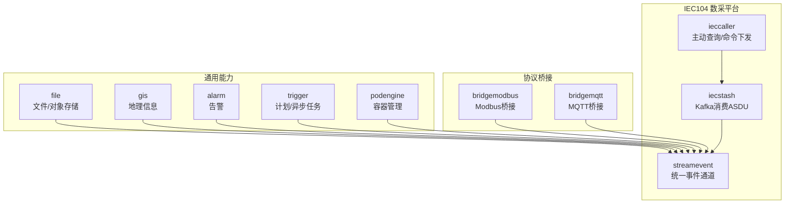
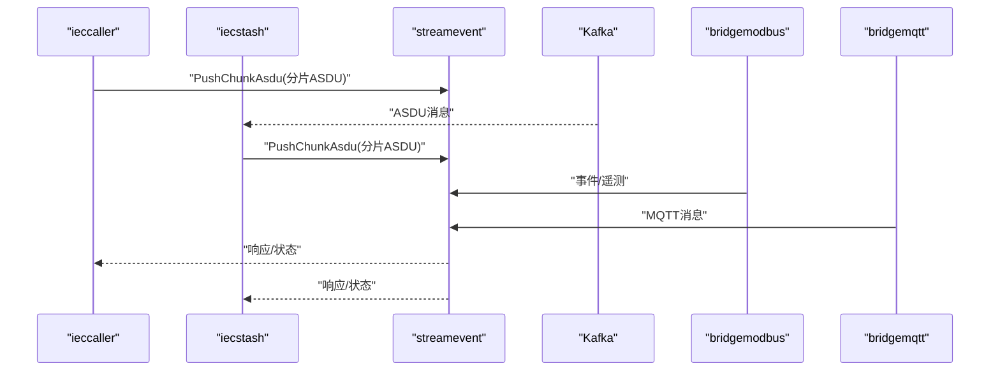
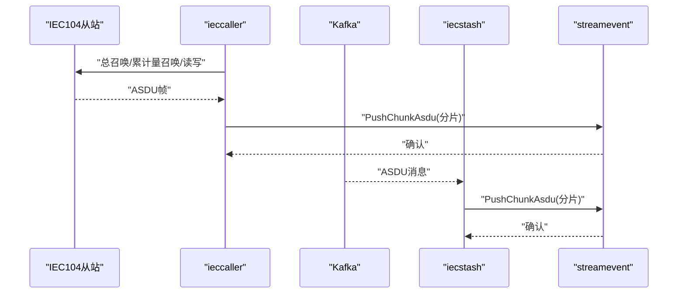
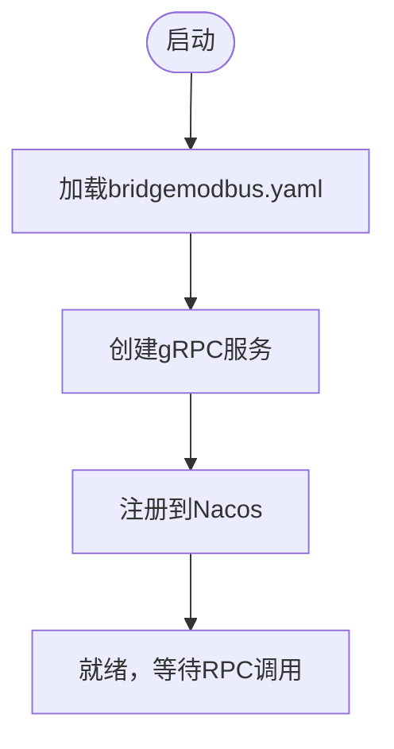
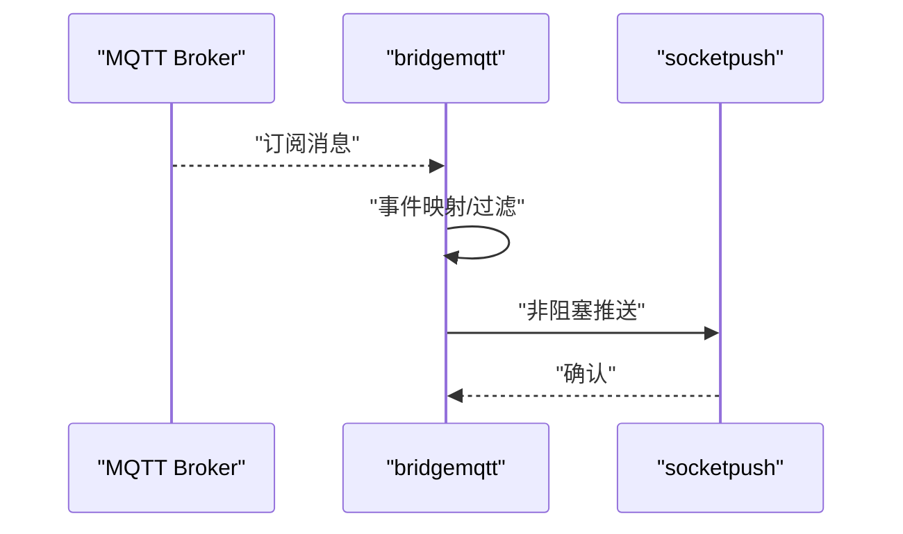
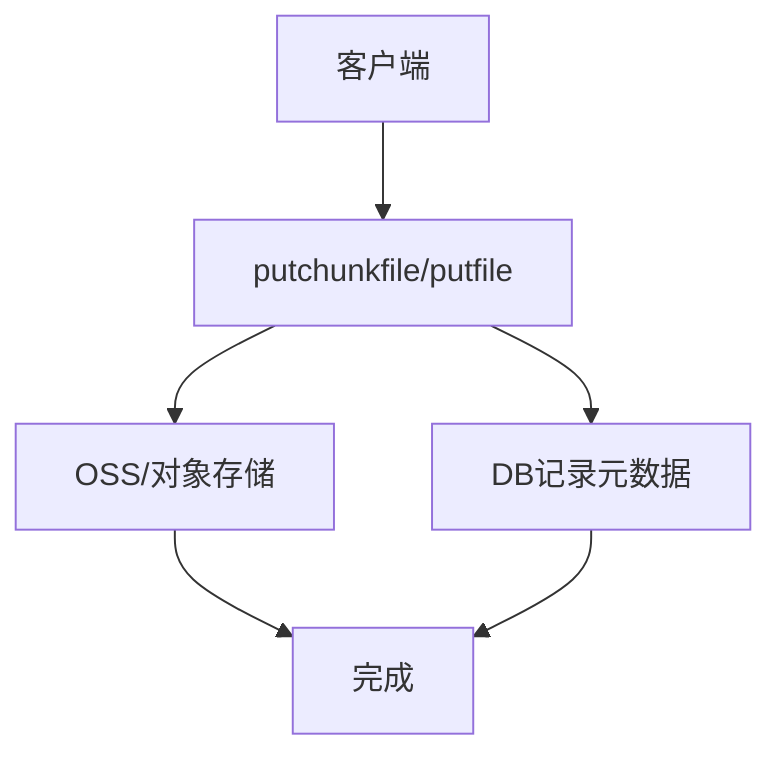
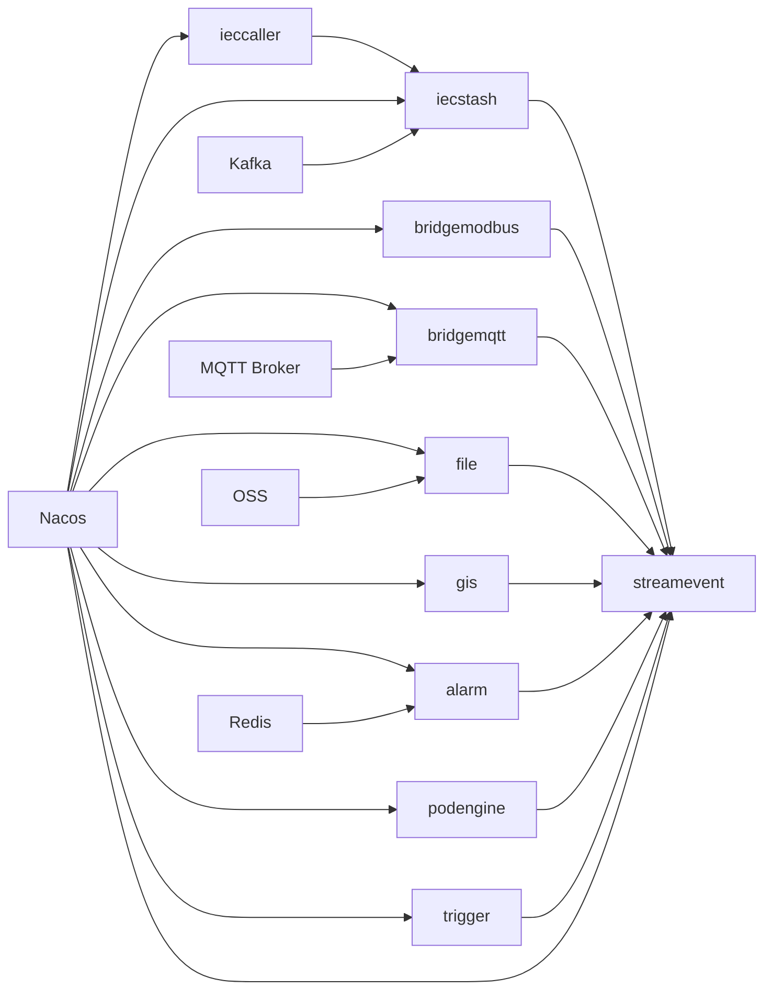

# 核心服务详解

<cite>
**本文引用的文件**
- [ieccaller.go](file://app/ieccaller/ieccaller.go)
- [ieccaller.yaml](file://app/ieccaller/etc/ieccaller.yaml)
- [iecstash.go](file://app/iecstash/iecstash.go)
- [iecstash.yaml](file://app/iecstash/etc/iecstash.yaml)
- [streamevent.go](file://facade/streamevent/streamevent.go)
- [streamevent.yaml](file://facade/streamevent/etc/streamevent.yaml)
- [bridgemodbus.go](file://app/bridgemodbus/bridgemodbus.go)
- [bridgemodbus.yaml](file://app/bridgemodbus/etc/bridgemodbus.yaml)
- [bridgemqtt.go](file://app/bridgemqtt/bridgemqtt.go)
- [bridgemqtt.yaml](file://app/bridgemqtt/etc/bridgemqtt.yaml)
- [file.go](file://app/file/file.go)
- [file.yaml](file://app/file/etc/file.yaml)
- [gis.go](file://app/gis/gis.go)
- [gis.yaml](file://app/gis/etc/gis.yaml)
- [alarm.go](file://app/alarm/alarm.go)
- [alarm.yaml](file://app/alarm/etc/alarm.yaml)
</cite>

## 目录
1. [简介](#简介)
2. [项目结构](#项目结构)
3. [核心组件](#核心组件)
4. [架构总览](#架构总览)
5. [详细组件分析](#详细组件分析)
6. [依赖分析](#依赖分析)
7. [性能考虑](#性能考虑)
8. [故障排查指南](#故障排查指南)
9. [结论](#结论)
10. [附录](#附录)

## 简介
本文件面向Zero-Service核心服务，系统性梳理以下能力域：
- IEC 104 数采平台三件套：ieccaller（主动发起与命令下发）、iecstash（Kafka 消费与ASDU入湖）、streamevent（统一事件通道与持久化）
- Modbus 协议桥接服务：客户端池化、批量读写、配置化设备管理
- MQTT 协议桥接服务：订阅/发布、事件映射、与Socket推送联动
- 触发器服务：基于异步任务框架的计划任务与延迟任务
- 文件服务：分片上传、对象存储集成、安全策略
- GIS 服务：坐标转换、围栏计算、距离与路径分析
- 告警服务：多级告警与通知集成
- 容器管理服务：Docker 操作封装与 Pod 抽象模型

同时给出各服务的部署入口、配置要点、API 调用方式与最佳实践。

## 项目结构
核心服务以“服务进程”为单位组织，每个服务包含：
- etc/xxx.yaml：运行参数、日志、注册中心、中间件等配置
- internal/config/config.go：配置解析与默认值
- internal/server/xxxserver.go：gRPC 服务注册与路由
- internal/svc/servicecontext.go：上下文与依赖注入
- xxx.go：main 启动入口，含 Nacos 注册、拦截器、服务编排

**图表来源**
- [ieccaller.go:41-122](file://app/ieccaller/ieccaller.go#L41-L122)
- [iecstash.go:35-84](file://app/iecstash/iecstash.go#L35-L84)
- [streamevent.go:28-71](file://facade/streamevent/streamevent.go#L28-L71)
- [bridgemodbus.go:27-70](file://app/bridgemodbus/bridgemodbus.go#L27-L70)
- [bridgemqtt.go:28-71](file://app/bridgemqtt/bridgemqtt.go#L28-L71)

**章节来源**
- [ieccaller.go:1-123](file://app/ieccaller/ieccaller.go#L1-L123)
- [iecstash.go:1-85](file://app/iecstash/iecstash.go#L1-L85)
- [streamevent.go:1-72](file://facade/streamevent/streamevent.go#L1-L72)
- [bridgemodbus.go:1-71](file://app/bridgemodbus/bridgemodbus.go#L1-L71)
- [bridgemqtt.go:1-72](file://app/bridgemqtt/bridgemqtt.go#L1-L72)

## 核心组件
- IEC104 主动查询与命令下发：ieccaller
- IEC104 ASDU 消费与入湖：iecstash
- 统一事件通道与持久化：streamevent
- Modbus 协议桥接：bridgemodbus
- MQTT 协议桥接：bridgemqtt
- 文件与对象存储：file
- 地理信息系统：gis
- 告警与通知：alarm
- 计划/异步任务：trigger
- 容器管理：podengine

**章节来源**
- [ieccaller.go:41-122](file://app/ieccaller/ieccaller.go#L41-L122)
- [iecstash.go:35-84](file://app/iecstash/iecstash.go#L35-L84)
- [streamevent.go:28-71](file://facade/streamevent/streamevent.go#L28-L71)
- [bridgemodbus.go:27-70](file://app/bridgemodbus/bridgemodbus.go#L27-L70)
- [bridgemqtt.go:28-71](file://app/bridgemqtt/bridgemqtt.go#L28-L71)
- [file.go:28-71](file://app/file/file.go#L28-L71)
- [gis.go:27-70](file://app/gis/gis.go#L27-L70)
- [alarm.go:21-43](file://app/alarm/alarm.go#L21-L43)

## 架构总览
IEC104 数采平台采用“生产-消费-通道-落库”的流水线：
- ieccaller 通过 IEC104 客户端向远端 IED 发起总召唤、累计量召唤、单点读写等命令，并将结果经 streamevent 推送
- iecstash 从 Kafka 拉取 ASDU 消息，按批次推送到 streamevent
- streamevent 作为统一事件通道，负责分片推送、持久化与下游消费
- bridgemodbus/bridgemqtt 将外部协议消息桥接至 streamevent，形成统一数据面
- 其他服务（file/gis/alarm/podengine/trigger）通过 streamevent 或各自 RPC 接口参与数据流转

**图表来源**
- [ieccaller.go:98-117](file://app/ieccaller/ieccaller.go#L98-L117)
- [iecstash.go:79-81](file://app/iecstash/iecstash.go#L79-L81)
- [streamevent.go:39-45](file://facade/streamevent/streamevent.go#L39-L45)

## 详细组件分析

### IEC104 数采平台：ieccaller/iecstash/streamevent 协作机制
- ieccaller
  - 职责：建立 IEC104 客户端，定时执行总召唤/累计量召唤；下发测试、读写等命令；将ASDU分片推送至 streamevent
  - 关键配置：IecServerConfig（多个从站）、Kafka 广播配置、Mqtt 推送模板、StreamEventConf
  - 启动流程：加载配置 → 创建 gRPC 服务 → 注册到 Nacos → 启动 IEC 客户端与定时任务 → 启动广播队列
- iecstash
  - 职责：从 Kafka 消费 ASDU，按批次推送到 streamevent
  - 关键配置：KafkaASDUConfig（Brokers/Topic/Group/并发/字节范围/偏移策略）
- streamevent
  - 职责：统一事件通道，接收分片ASDU并持久化，供下游消费
  - 关键配置：Nacos 注册、日志、中间件忽略特定方法、数据库/时序库连接

**图表来源**
- [ieccaller.go:89-93](file://app/ieccaller/ieccaller.go#L89-L93)
- [ieccaller.yaml:22-35](file://app/ieccaller/etc/ieccaller.yaml#L22-L35)
- [iecstash.yaml:18-35](file://app/iecstash/etc/iecstash.yaml#L18-L35)
- [streamevent.yaml:22-27](file://facade/streamevent/etc/streamevent.yaml#L22-L27)

**章节来源**
- [ieccaller.go:41-122](file://app/ieccaller/ieccaller.go#L41-L122)
- [ieccaller.yaml:1-79](file://app/ieccaller/etc/ieccaller.yaml#L1-L79)
- [iecstash.go:35-84](file://app/iecstash/iecstash.go#L35-L84)
- [iecstash.yaml:1-46](file://app/iecstash/etc/iecstash.yaml#L1-L46)
- [streamevent.go:28-71](file://facade/streamevent/streamevent.go#L28-L71)
- [streamevent.yaml:1-28](file://facade/streamevent/etc/streamevent.yaml#L1-L28)

### Modbus 协议桥接服务（bridgemodbus）
- 实现原理
  - 基于客户端池化，支持批量读取/写入寄存器、线圈等
  - 通过配置驱动设备与点位映射，支持按代码查询配置、保存配置、删除配置
  - 提供多种读写逻辑（单/批量/带十进制转换等）
- API 与配置
  - 配置项：Nacos 注册、日志、ModbusPool、DB 连接、ModbusClientConf（Address/Slave）
  - 启动入口：加载配置 → 创建 gRPC 服务 → 注册到 Nacos → 启动
- 使用方法
  - 在前端或上层系统调用相应 RPC 方法进行读写与配置管理
  - 结合 streamevent 进行事件上报

**图表来源**
- [bridgemodbus.go:27-70](file://app/bridgemodbus/bridgemodbus.go#L27-L70)
- [bridgemodbus.yaml:1-26](file://app/bridgemodbus/etc/bridgemodbus.yaml#L1-L26)

**章节来源**
- [bridgemodbus.go:1-71](file://app/bridgemodbus/bridgemodbus.go#L1-L71)
- [bridgemodbus.yaml:1-26](file://app/bridgemodbus/etc/bridgemodbus.yaml#L1-L26)

### MQTT 协议桥接服务（bridgemqtt）
- 消息处理机制
  - 支持订阅主题列表，可配置事件映射（匹配规则到事件名）
  - 可选将消息转发至 Socket 推送服务（socketpush），实现 Web 端实时推送
- 配置与启动
  - 配置项：Broker/Username/Password/Qos、SubscribeTopics、SocketPushConf
  - 启动入口：加载配置 → 创建 gRPC 服务 → 注册到 Nacos → 启动
- 性能优化策略
  - 合理设置 QoS 与订阅主题粒度，避免过度消费
  - 事件映射减少无效消息处理
  - Socket 推送采用非阻塞与超时控制

**图表来源**
- [bridgemqtt.go:28-71](file://app/bridgemqtt/bridgemqtt.go#L28-L71)
- [bridgemqtt.yaml:19-48](file://app/bridgemqtt/etc/bridgemqtt.yaml#L19-L48)

**章节来源**
- [bridgemqtt.go:1-72](file://app/bridgemqtt/bridgemqtt.go#L1-L72)
- [bridgemqtt.yaml:1-48](file://app/bridgemqtt/etc/bridgemqtt.yaml#L1-L48)

### 触发器服务（trigger）
- 异步任务调度与计划任务
  - 基于异步任务框架，支持计划任务与延迟任务
  - 提供任务类型定义、调度器与任务服务器
- 配置与部署
  - 通过 etc/trigger.yaml 配置运行参数与中间件
  - 启动入口：加载配置 → 创建 gRPC 服务 → 注册到 Nacos → 启动

**章节来源**
- [trigger.yaml](file://app/trigger/etc/trigger.yaml)

### 文件服务（file）
- 分片上传机制
  - 支持分片上传 putchunkfile 与整文件上传 putfile/putstreamfile
  - 支持 OSS/对象存储集成（minio/兼容实现），提供 bucket 管理、签名URL、统计等
- 安全策略
  - 租户模式开关（TenantMode），按租户隔离资源
  - 通过 DB 存储文件元数据与访问控制
- 配置与启动
  - 配置项：Nacos 注册、日志、OSS 租户模式、DB 连接
  - 启动入口：加载配置 → 创建 gRPC 服务 → 注册到 Nacos → 启动

**图表来源**
- [file.go:28-71](file://app/file/file.go#L28-L71)
- [file.yaml:1-23](file://app/file/etc/file.yaml#L1-L23)

**章节来源**
- [file.go:1-72](file://app/file/file.go#L1-L72)
- [file.yaml:1-23](file://app/file/etc/file.yaml#L1-L23)

### GIS 服务（gis）
- 功能概览
  - 坐标转换（经纬度↔投影/GeoHash/H3）
  - 围栏计算（生成围栏网格、判断点是否在围栏内、附近围栏检索）
  - 距离计算与路径点提取
- 配置与启动
  - 配置项：Nacos 注册、日志、中间件忽略特定方法
  - 启动入口：加载配置 → 创建 gRPC 服务 → 注册到 Nacos → 启动

**章节来源**
- [gis.go:1-71](file://app/gis/gis.go#L1-L71)
- [gis.yaml:1-19](file://app/gis/etc/gis.yaml#L1-L19)

### 告警服务（alarm）
- 多级告警机制与通知集成
  - 基于 Redis 存储告警状态，结合应用密钥与加密参数进行鉴权
  - 支持用户列表与链路追踪配置
- 配置与启动
  - 配置项：Redis、Telemetry（可选）、Alarmx 参数、用户列表、告警规则文件
  - 启动入口：加载配置 → 创建 gRPC 服务 → 启动

**章节来源**
- [alarm.go:1-44](file://app/alarm/alarm.go#L1-L44)
- [alarm.yaml:1-26](file://app/alarm/etc/alarm.yaml#L1-L26)

### 容器管理服务（podengine）
- Docker 操作封装与 Pod 抽象模型
  - 提供 Pod 的创建、启动、停止、重启、列举、详情、统计等操作
  - 通过 Docker 客户端封装，屏蔽底层差异
- 配置与启动
  - 配置项：Nacos 注册、日志、DB 连接（如需）
  - 启动入口：加载配置 → 创建 gRPC 服务 → 注册到 Nacos → 启动

**章节来源**
- [podengine.yaml](file://app/podengine/etc/podengine.yaml)

## 依赖分析
- 服务间耦合
  - ieccaller ↔ iecstash ↔ streamevent：严格的数据链路
  - bridgemodbus/bridgemqtt ↔ streamevent：统一事件通道
  - file/gis/alarm/podengine/trigger：独立服务，可通过 streamevent 或各自 RPC 交互
- 外部依赖
  - Nacos：服务注册与发现
  - Kafka：IEC104 ASDU 消息队列
  - MQTT：消息订阅与桥接
  - Redis：告警状态存储
  - OSS/对象存储：文件存储
  - 数据库：SQLite/MySQL/PostgreSQL/TDengine/InfluxDB（取决于配置）

**图表来源**
- [ieccaller.yaml:13-21](file://app/ieccaller/etc/ieccaller.yaml#L13-L21)
- [iecstash.yaml:10-18](file://app/iecstash/etc/iecstash.yaml#L10-L18)
- [streamevent.yaml:14-21](file://facade/streamevent/etc/streamevent.yaml#L14-L21)
- [bridgemqtt.yaml:11-19](file://app/bridgemqtt/etc/bridgemqtt.yaml#L11-L19)
- [bridgemodbus.yaml:12-19](file://app/bridgemodbus/etc/bridgemodbus.yaml#L12-L19)
- [file.yaml:9-16](file://app/file/etc/file.yaml#L9-L16)
- [gis.yaml:12-19](file://app/gis/etc/gis.yaml#L12-L19)
- [alarm.yaml:8-25](file://app/alarm/etc/alarm.yaml#L8-L25)

**章节来源**
- [ieccaller.yaml:1-79](file://app/ieccaller/etc/ieccaller.yaml#L1-L79)
- [iecstash.yaml:1-46](file://app/iecstash/etc/iecstash.yaml#L1-L46)
- [streamevent.yaml:1-28](file://facade/streamevent/etc/streamevent.yaml#L1-L28)
- [bridgemqtt.yaml:1-48](file://app/bridgemqtt/etc/bridgemqtt.yaml#L1-L48)
- [bridgemodbus.yaml:1-26](file://app/bridgemodbus/etc/bridgemodbus.yaml#L1-L26)
- [file.yaml:1-23](file://app/file/etc/file.yaml#L1-L23)
- [gis.yaml:1-19](file://app/gis/etc/gis.yaml#L1-L19)
- [alarm.yaml:1-26](file://app/alarm/etc/alarm.yaml#L1-L26)

## 性能考虑
- IEC104 数采平台
  - 合理设置 IEC 客户端并发与定时任务频率，避免对远端设备造成压力
  - streamevent 分片推送大小（PushAsduChunkBytes）应结合网络与磁盘 IO 调优
  - Kafka 消费并发（Conns × Consumers × Processors）与字节范围（MinBytes/MaxBytes）需与硬件资源匹配
- Modbus
  - 客户端池大小（ModbusPool）与 DB 连接池协同，避免资源争用
- MQTT
  - 订阅主题粒度与事件映射减少无效处理；Socket 推送采用非阻塞与超时
- 文件服务
  - 分片大小与并发度平衡吞吐与内存占用；OSS 传输参数按带宽与延迟调优
- GIS
  - GeoHash/H3 网格分辨率与围栏复杂度影响计算性能；批量接口优先
- 告警
  - Redis 连接池与键空间设计，避免热点与阻塞

## 故障排查指南
- 服务无法注册到 Nacos
  - 检查 NacosConfig：Host/Port/用户名/密码/命名空间/服务名
  - 确认网络连通与鉴权
- Kafka 消费异常
  - 检查 Brokers/Topic/Group/Offset/Conns/Consumers/Processors 配置
  - 关注最小/最大字节与提交策略
- MQTT 订阅无消息
  - 校验 Broker/Username/Password/Qos/SubscribeTopics
  - 确认事件映射与目标服务可达
- 文件上传失败
  - 校验 OSS 配置与租户模式；检查 DB 连接与权限
- 告警未生效
  - 校验 Redis 连接与 Alarmx 参数；确认用户列表与通知通道

**章节来源**
- [ieccaller.yaml:13-21](file://app/ieccaller/etc/ieccaller.yaml#L13-L21)
- [iecstash.yaml:18-35](file://app/iecstash/etc/iecstash.yaml#L18-L35)
- [bridgemqtt.yaml:19-30](file://app/bridgemqtt/etc/bridgemqtt.yaml#L19-L30)
- [file.yaml:17-23](file://app/file/etc/file.yaml#L17-L23)
- [alarm.yaml:8-25](file://app/alarm/etc/alarm.yaml#L8-L25)

## 结论
Zero-Service 的核心服务围绕“统一事件通道 + 多协议桥接 + 通用能力模块”的架构展开，IEC104 数采平台通过 ieccaller/iecstash/streamevent 形成闭环，bridgemodbus/bridgemqtt 将外部协议无缝接入；文件、GIS、告警、容器与触发器服务则提供横向能力支撑。合理配置与性能调优是保障稳定运行的关键。

## 附录
- 部署与启动
  - 各服务均通过 etc/*.yaml 配置，main 入口加载配置并注册到 Nacos，随后启动 gRPC 服务
- API 文档
  - 服务均基于 go-zero 生成的 proto 定义，Swagger 文档位于 swagger/ 目录，可直接导入 API 工具查看
- 最佳实践
  - 服务拆分与职责单一；配置集中化与环境隔离；监控与日志分级；限流与熔断策略；灰度与回滚预案