现在我已经收集了足够的信息来更新文档。基于我的分析，我发现AI聊天服务确实已经添加了流式拦截器，增强了流式gRPC操作的可观测性。让我更新文档：

<docs>
# AI聊天服务

<cite>
**本文档引用的文件**
- [aichat.go](file://aiapp/aichat/aichat.go)
- [aichat.yaml](file://aiapp/aichat/etc/aichat.yaml)
- [aichat.proto](file://aiapp/aichat/aichat.proto)
- [config.go](file://aiapp/aichat/internal/config/config.go)
- [provider.go](file://aiapp/aichat/internal/provider/provider.go)
- [openai.go](file://aiapp/aichat/internal/provider/openai.go)
- [registry.go](file://aiapp/aichat/internal/provider/registry.go)
- [types.go](file://aiapp/aichat/internal/provider/types.go)
- [servicecontext.go](file://aiapp/aichat/internal/svc/servicecontext.go)
- [aichatserver.go](file://aiapp/aichat/internal/server/aichatserver.go)
- [chatcompletionlogic.go](file://aiapp/aichat/internal/logic/chatcompletionlogic.go)
- [chatcompletionstreamlogic.go](file://aiapp/aichat/internal/logic/chatcompletionstreamlogic.go)
- [listmodelslogic.go](file://aiapp/aichat/internal/logic/listmodelslogic.go)
- [pinglogic.go](file://aiapp/aichat/internal/logic/pinglogic.go)
- [client.go](file://common/mcpx/client.go)
- [config.go](file://common/mcpx/config.go)
- [logger.go](file://common/mcpx/logger.go)
- [ctxprop.go](file://common/mcpx/ctxprop.go)
- [ctxData.go](file://common/ctxdata/ctxData.go)
- [gen.sh](file://aiapp/aichat/gen.sh)
- [mcpserver.yaml](file://aiapp/mcpserver/etc/mcpserver.yaml)
- [server.go](file://common/mcpx/server.go)
- [loggerInterceptor.go](file://common/Interceptor/rpcserver/loggerInterceptor.go)
- [metadataInterceptor.go](file://common/Interceptor/rpcclient/metadataInterceptor.go)
- [grpc.go](file://common/ctxprop/grpc.go)
- [http.go](file://common/ctxprop/http.go)
</cite>

## 更新摘要
**所做更改**
- **新增** 流式gRPC拦截器：添加了StreamLoggerInterceptor，增强了流式操作的可观测性
- **上下文传播增强**：通过ctxprop模块实现gRPC元数据与上下文的双向传播
- **拦截器集成**：在服务启动时集成了LoggerInterceptor和StreamLoggerInterceptor
- **流式超时管理**：改进了流式gRPC操作的超时控制和错误处理机制
- **结构化日志支持**：通过logx.WithContext(ctx)实现带有上下文信息的日志记录

## 目录
1. [简介](#简介)
2. [项目结构](#项目结构)
3. [核心组件](#核心组件)
4. [架构概览](#架构概览)
5. [详细组件分析](#详细组件分析)
6. [MCP工具调用系统](#mcp工具调用系统)
7. [拦截器系统](#拦截器系统)
8. [依赖关系分析](#依赖关系分析)
9. [性能考虑](#性能考虑)
10. [故障排除指南](#故障排除指南)
11. [结论](#结论)

## 简介

AI聊天服务是一个基于GoZero框架构建的RPC服务，提供统一的大语言模型接入接口。该服务支持多种AI模型提供商（如智谱、通义千问等），通过统一的gRPC接口对外提供对话补全、流式对话补全和模型列表查询功能。

**更新** 新增了重构后的MCP（Model Context Protocol）工具调用能力，使AI聊天服务能够与外部工具和系统进行智能交互。新版本的MCP客户端具有以下增强特性：
- 多服务器连接管理：支持同时连接多个MCP服务器，自动工具聚合和路由
- 内存泄漏修复：改进的连接生命周期管理和资源清理机制
- 配置系统重构：Mcpx.Config替代McpServers配置，支持服务器名称和端点配置
- 增强的工具调用循环：支持多服务器工具路由和动态刷新
- 完整的工具调用错误处理和超时控制
- 增强的日志基础设施集成，支持结构化日志输出
- 上下文属性传播：支持用户身份信息在MCP工具调用中的传递
- 优化的流式处理：256KB scanner缓冲区，防止大块SSE数据截断
- 增强的日志基础设施：结构化日志输出和性能监控
- **新增** 传输协议支持：同时支持SSE和Streamable HTTP两种MCP传输协议
- **新增** 流式拦截器：增强了流式gRPC操作的可观测性和上下文传播

## 项目结构

AI聊天服务采用标准的GoZero项目结构，主要分为以下几个层次：

```mermaid
graph TB
subgraph "应用入口层"
A[aichat.go] --> B[配置加载]
A --> C[服务启动]
A --> W[拦截器集成]
end
subgraph "配置层"
D[aichat.yaml] --> E[Provider配置]
D --> F[Model配置]
D --> G[Mcpx配置]
H[config.go] --> I[类型定义]
end
subgraph "服务层"
J[aichat.proto] --> K[服务定义]
L[aichatserver.go] --> M[服务实现]
end
subgraph "业务逻辑层"
N[chatcompletionlogic.go] --> O[对话补全逻辑]
P[chatcompletionstreamlogic.go] --> Q[流式对话逻辑]
R[listmodelslogic.go] --> S[模型列表逻辑]
T[pinglogic.go] --> U[Ping健康检查]
end
subgraph "提供者层"
V[registry.go] --> W[提供者注册表]
X[openai.go] --> Y[OpenAI兼容实现]
Z[types.go] --> AA[数据类型定义]
BB[provider.go] --> CC[Provider接口]
end
subgraph "重构后的MCP工具层"
DD[common/mcpx/client.go] --> EE[多服务器MCP客户端]
FF[common/mcpx/config.go] --> GG[配置管理]
HH[common/mcpx/logger.go] --> II[日志系统]
JJ[common/mcpx/ctxprop.go] --> KK[上下文属性传播]
LL[servicecontext.go] --> MM[服务上下文集成]
EE --> NN[serverConn管理]
OO[工具聚合和路由] --> PP[动态刷新机制]
QQ[内存泄漏修复] --> RR[连接生命周期管理]
SS[上下文属性传播] --> TT[用户身份传递]
UU[性能监控] --> VV[mcpx.metrics]
WW[结构化日志] --> XX[slog桥接]
YY[工具名称前缀] --> ZZ[serverName__toolName]
AAA[传输协议支持] --> BBB[SSE/Streamable切换]
CCC[端点配置] --> DDD[/sse vs /message]
end
subgraph "拦截器系统"
EE[common/Interceptor/] --> FF[LoggerInterceptor]
GG[common/Interceptor/] --> HH[StreamLoggerInterceptor]
II[common/Interceptor/] --> JJ[MetadataInterceptor]
KK[common/ctxprop/] --> LL[上下文传播]
end
A --> D
A --> J
M --> N
M --> P
M --> R
M --> T
N --> V
P --> V
R --> H
V --> X
X --> BB
EE --> DD
FF --> GG
HH --> II
JJ --> KK
LL --> MM
NN --> OO
PP --> QQ
QQ --> RR
RR --> SS
SS --> TT
UU --> VV
WW --> XX
YY --> ZZ
AAA --> CCC
CCC --> DDD
W --> FF
W --> GG
W --> HH
```

**图表来源**
- [aichat.go:1-50](file://aiapp/aichat/aichat.go#L1-L50)
- [aichat.yaml:1-50](file://aiapp/aichat/etc/aichat.yaml#L1-L50)
- [aichat.proto:1-115](file://aiapp/aichat/aichat.proto#L1-L115)
- [client.go:1-348](file://common/mcpx/client.go#L1-L348)
- [config.go:1-22](file://common/mcpx/config.go#L1-L22)
- [ctxprop.go:1-59](file://common/mcpx/ctxprop.go#L1-L59)
- [ctxData.go:1-76](file://common/ctxdata/ctxData.go#L1-L76)
- [mcpserver.yaml:1-24](file://aiapp/mcpserver/etc/mcpserver.yaml#L1-L24)
- [server.go:1-141](file://common/mcpx/server.go#L1-L141)
- [loggerInterceptor.go:1-43](file://common/Interceptor/rpcserver/loggerInterceptor.go#L1-L43)
- [metadataInterceptor.go:1-19](file://common/Interceptor/rpcclient/metadataInterceptor.go#L1-L19)

**章节来源**
- [aichat.go:1-50](file://aiapp/aichat/aichat.go#L1-L50)
- [aichat.yaml:1-50](file://aiapp/aichat/etc/aichat.yaml#L1-L50)
- [config.go:1-62](file://aiapp/aichat/internal/config/config.go#L1-L62)

## 核心组件

### 1. 服务入口组件

服务入口位于`aichat.go`文件中，负责：
- 命令行参数解析（配置文件路径）
- 配置文件加载和验证
- 服务上下文初始化
- gRPC服务器启动和反射注册
- **新增** 拦截器集成：添加LoggerInterceptor和StreamLoggerInterceptor

### 2. 配置管理系统

**更新** 配置系统已重构，采用Mcpx.Config结构：

- **Provider配置**：定义AI模型提供商的连接信息
- **Model配置**：定义可用模型及其属性
- **Mcpx配置**：新的MCP客户端配置结构，支持多服务器连接
- **运行时配置**：包括超时设置、日志配置、工具轮次限制等

**更新** 新增Mcpx配置项：
- `Servers`: MCP服务器列表配置，支持服务器名称和端点
- `RefreshInterval`: 服务器重连和KeepAlive间隔，默认30秒
- `ConnectTimeout`: 单次连接超时，默认10秒
- `MaxToolRounds`: 工具调用最大轮次限制，默认10轮
- `StreamTimeout`: 单次流的总时长上限，默认10分钟
- `StreamIdleTimeout`: chunk间最大空闲时间，默认90秒
- **新增** `UseStreamable`: MCP传输协议选择，默认false（使用SSE）

**更新** 配置兼容性：
- 支持从旧的McpServers配置自动迁移
- Mcpx.Config优先级高于McpServers配置
- 自动生成服务器名称（mcp0, mcp1...）
- **新增** 默认UseStreamable=false，保持向后兼容

### 3. 提供者抽象层

提供者接口定义了统一的AI模型调用规范：
- `ChatCompletion`：非流式对话补全
- `ChatCompletionStream`：流式对话补全
- `StreamReader`：流式响应读取器

### 4. 业务逻辑层

包含四个核心业务逻辑：
- **对话补全逻辑**：处理单次对话请求，支持MCP工具调用循环
- **流式对话逻辑**：处理持续对话流，包含优化的超时管理和错误恢复
- **模型列表逻辑**：提供可用模型信息
- **Ping逻辑**：健康检查服务

**更新** 对话补全逻辑增强：
- 支持重构后的MCP客户端工具调用循环
- 自动注入MCP工具定义到请求中
- 处理工具调用结果并继续对话流程
- 完善的错误处理和超时控制
- 使用`errors.As`进行类型安全的错误检查
- 优化的流式处理，256KB scanner缓冲区防止大块数据截断

**章节来源**
- [provider.go:1-20](file://aiapp/aichat/internal/provider/provider.go#L1-L20)
- [chatcompletionlogic.go:1-223](file://aiapp/aichat/internal/logic/chatcompletionlogic.go#L1-L223)
- [chatcompletionstreamlogic.go:1-185](file://aiapp/aichat/internal/logic/chatcompletionstreamlogic.go#L1-L185)

## 架构概览

AI聊天服务采用分层架构设计，确保了良好的可扩展性和维护性：

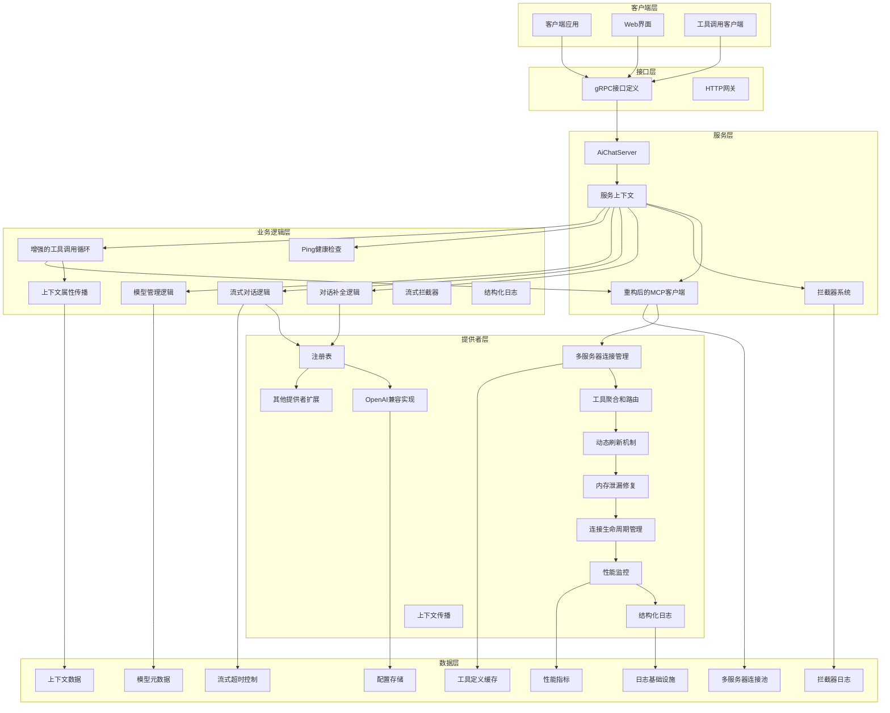

**图表来源**
- [aichatserver.go:1-45](file://aiapp/aichat/internal/server/aichatserver.go#L1-L45)
- [servicecontext.go:1-36](file://aiapp/aichat/internal/svc/servicecontext.go#L1-L36)
- [registry.go:1-89](file://aiapp/aichat/internal/provider/registry.go#L1-L89)
- [client.go:1-348](file://common/mcpx/client.go#L1-L348)
- [config.go:1-22](file://common/mcpx/config.go#L1-L22)
- [ctxprop.go:1-59](file://common/mcpx/ctxprop.go#L1-L59)
- [ctxData.go:1-76](file://common/ctxdata/ctxData.go#L1-L76)
- [loggerInterceptor.go:1-43](file://common/Interceptor/rpcserver/loggerInterceptor.go#L1-L43)

该架构的主要优势：
- **解耦合**：各层职责明确，便于独立开发和测试
- **可扩展**：新增AI提供者只需实现Provider接口
- **可配置**：通过重构后的Mcpx.Config灵活管理模型、提供者和MCP工具
- **可观测**：完整的日志记录和错误处理机制
- **智能化**：支持重构后的MCP工具调用，实现AI与外部系统的智能交互
- **多服务器支持**：同时连接多个MCP服务器，提高可用性和功能丰富度
- **上下文传播**：支持用户身份信息在工具调用中的传递和使用
- **性能监控**：内置mcpx.metrics统计工具调用性能和成功率
- **结构化日志**：通过slog桥接go-zero logx，支持结构化日志输出
- **传输协议支持**：同时支持SSE和Streamable HTTP两种MCP传输协议
- **拦截器系统**：通过LoggerInterceptor和StreamLoggerInterceptor增强可观测性
- **流式超时控制**：改进的流式gRPC操作超时管理和错误处理
- **上下文传播增强**：通过ctxprop模块实现gRPC元数据与上下文的双向传播

## 详细组件分析

### 重构后的MCP客户端架构

**更新** MCP客户端已重构为多服务器架构：


**图表来源**
- [client.go:19-176](file://common/mcpx/client.go#L19-L176)
- [client.go:30-348](file://common/mcpx/client.go#L30-L348)
- [config.go:11-22](file://common/mcpx/config.go#L11-L22)
- [ctxprop.go:25-59](file://common/mcpx/ctxprop.go#L25-L59)

### 传输协议支持架构

**更新** 新增的传输协议支持机制：

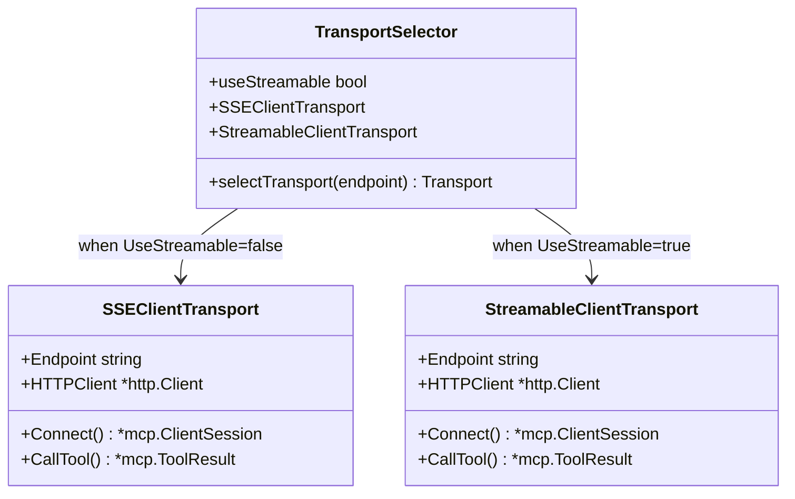

**图表来源**
- [client.go:208-222](file://common/mcpx/client.go#L208-L222)
- [config.go:11-16](file://common/mcpx/config.go#L11-L16)

### 服务注册表组件

服务注册表是整个系统的核心协调器，负责管理提供者和模型之间的映射关系：

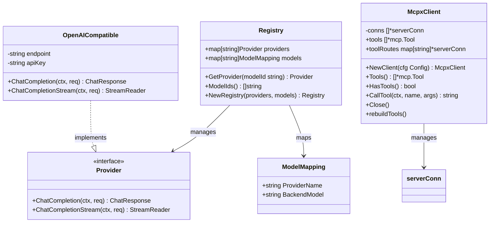

**图表来源**
- [registry.go:15-89](file://aiapp/aichat/internal/provider/registry.go#L15-L89)
- [provider.go:5-20](file://aiapp/aichat/internal/provider/provider.go#L5-L20)
- [openai.go:16-28](file://aiapp/aichat/internal/provider/openai.go#L16-L28)
- [client.go:19-176](file://common/mcpx/client.go#L19-L176)

### 对话补全流程

**更新** 非流式对话补全现在支持重构后的MCP工具调用循环：

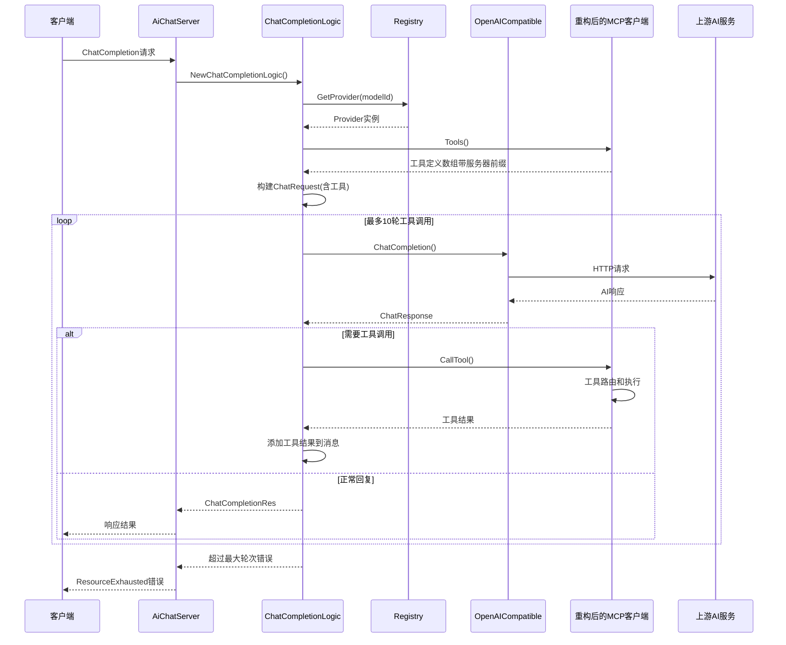

**图表来源**
- [chatcompletionlogic.go:33-86](file://aiapp/aichat/internal/logic/chatcompletionlogic.go#L33-L86)
- [openai.go:30-55](file://aiapp/aichat/internal/provider/openai.go#L30-L55)
- [client.go:123-148](file://common/mcpx/client.go#L123-L148)

### 流式对话处理

**更新** 流式对话处理实现了增强的超时管理和错误恢复机制：


**图表来源**
- [chatcompletionstreamlogic.go:34-160](file://aiapp/aichat/internal/logic/chatcompletionstreamlogic.go#L34-L160)

**更新** 超时控制机制改进：
- 总超时：从15秒增加到10分钟
- 空闲超时：从5秒增加到90秒
- 支持客户端断开检测和优雅取消
- 256KB scanner缓冲区，防止大块SSE数据截断

### 深度思考模式实现

系统支持不同AI提供商的深度思考（Thinking）模式，通过厂商特定的参数格式实现：

| 提供商 | 参数格式 | 清理策略 |
|--------|----------|----------|
| dashscope | `{"enable_thinking": true}` | 不支持清理 |
| openai/zhipu | `{"thinking": {"type": "enabled", "clear_thinking": true}}` | 自动清理reasoning_content |

**章节来源**
- [chatcompletionlogic.go:123-159](file://aiapp/aichat/internal/logic/chatcompletionlogic.go#L123-L159)
- [openai.go:109-135](file://aiapp/aichat/internal/provider/openai.go#L109-L135)

## MCP工具调用系统

### 重构后的MCP客户端架构

**更新** 新的MCP客户端提供了完整的多服务器工具调用能力：

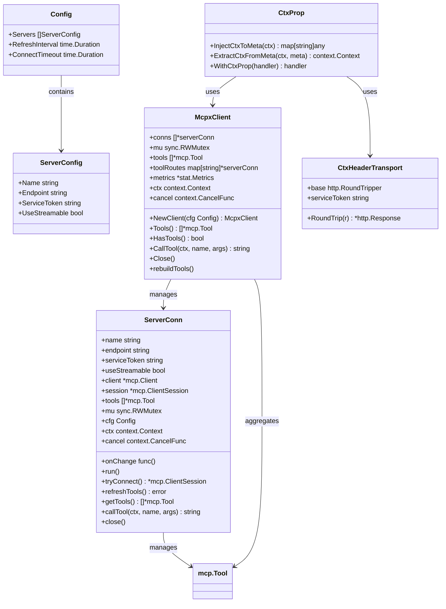

**图表来源**
- [client.go:19-176](file://common/mcpx/client.go#L19-L176)
- [client.go:30-348](file://common/mcpx/client.go#L30-L348)
- [config.go:11-22](file://common/mcpx/config.go#L11-L22)
- [ctxprop.go:25-59](file://common/mcpx/ctxprop.go#L25-L59)

### 传输协议选择机制

**更新** 新增的传输协议选择机制：

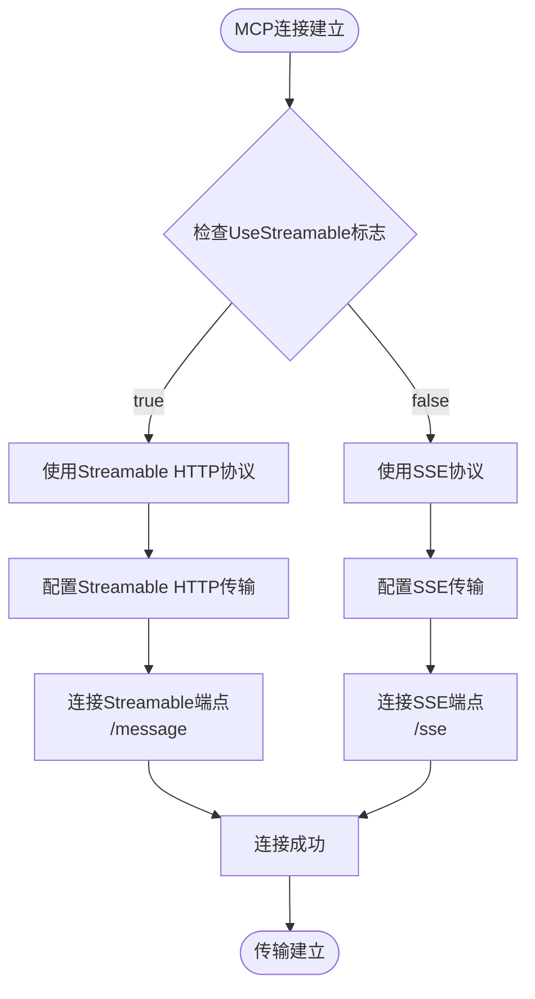

**图表来源**
- [client.go:208-222](file://common/mcpx/client.go#L208-L222)
- [server.go:64-68](file://common/mcpx/server.go#L64-L68)
- [server.go:92-110](file://common/mcpx/server.go#L92-L110)

### 多服务器连接管理

**更新** 新增的多服务器连接管理机制：

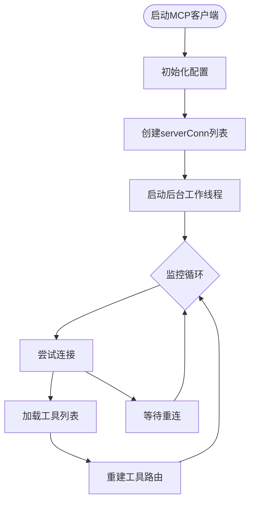

**图表来源**
- [client.go:46-107](file://common/mcpx/client.go#L46-L107)
- [client.go:184-204](file://common/mcpx/client.go#L184-L204)

### 工具调用循环机制

**更新** 对话补全逻辑现在支持智能的工具调用循环：

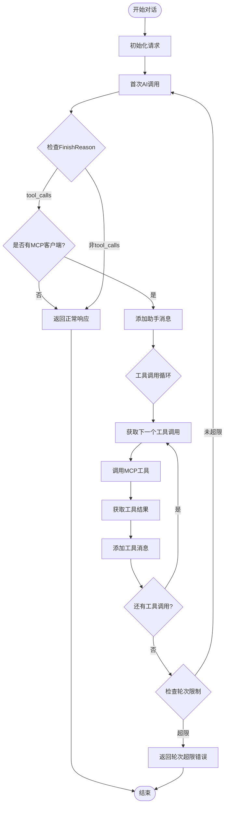

**图表来源**
- [chatcompletionlogic.go:49-86](file://aiapp/aichat/internal/logic/chatcompletionlogic.go#L49-L86)

### OpenAI函数调用格式兼容

**更新** MCP工具被转换为OpenAI兼容的函数调用格式：

| MCP字段 | OpenAI字段 | 转换规则 |
|---------|------------|----------|
| `Name` | `function.name` | 直接映射（带服务器前缀） |
| `Description` | `function.description` | 直接映射 |
| `InputSchema` | `function.parameters` | 直接映射 |
| `Type` | `type` | 固定为"function" |

**更新** 工具名称前缀机制：
- 自动为每个工具名称添加服务器名称前缀
- 格式：`serverName__toolName`
- 支持工具名称冲突避免和服务器标识

### 上下文属性传播机制

**更新** 新增的上下文属性传播功能：

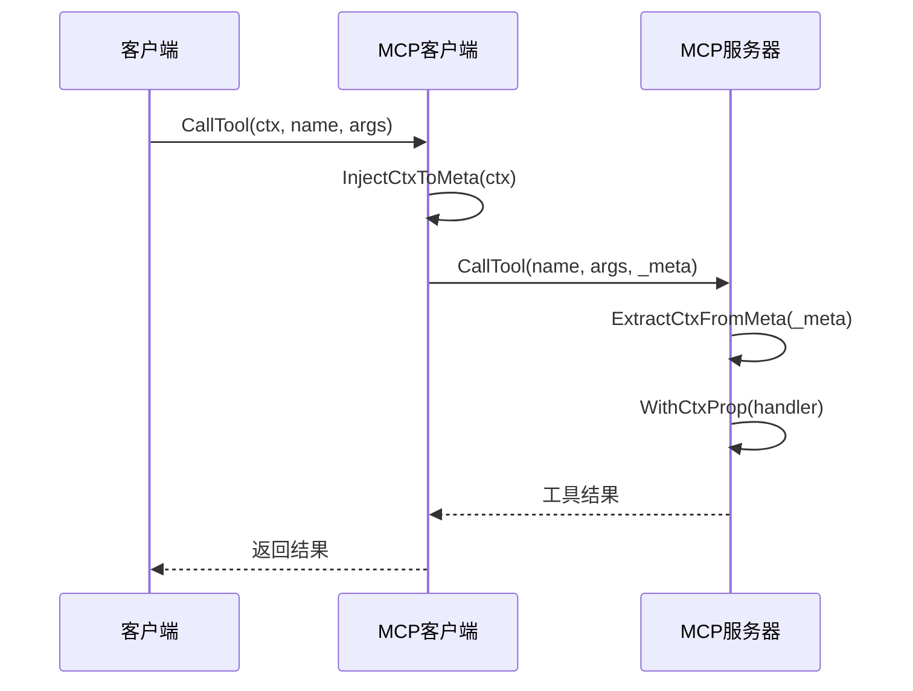

**图表来源**
- [ctxprop.go:25-59](file://common/mcpx/ctxprop.go#L25-L59)

**更新** 支持的上下文属性：
- 用户ID：`CtxUserIdKey`
- 用户名：`CtxUserNameKey`
- 部门代码：`CtxDeptCodeKey`
- 授权信息：`CtxAuthorizationKey`
- 跟踪ID：`CtxTraceIdKey`

**章节来源**
- [client.go:123-176](file://common/mcpx/client.go#L123-L176)
- [types.go:79-102](file://aiapp/aichat/internal/provider/types.go#L79-L102)
- [ctxprop.go:1-59](file://common/mcpx/ctxprop.go#L1-L59)
- [ctxData.go:9-24](file://common/ctxdata/ctxData.go#L9-L24)

## 拦截器系统

**新增** 拦截器系统是AI聊天服务可观测性的重要组成部分，提供了完整的gRPC请求处理链路监控。

### 拦截器架构

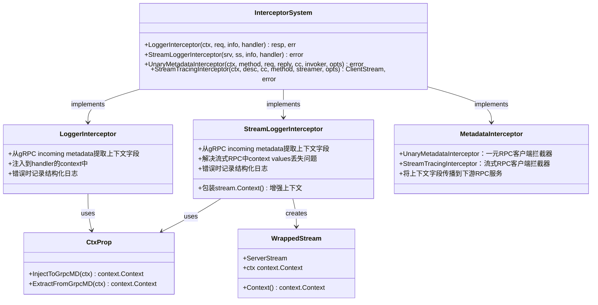

**图表来源**
- [loggerInterceptor.go:1-43](file://common/Interceptor/rpcserver/loggerInterceptor.go#L1-L43)
- [metadataInterceptor.go:1-19](file://common/Interceptor/rpcclient/metadataInterceptor.go#L1-L19)
- [grpc.go:1-35](file://common/ctxprop/grpc.go#L1-L35)

### 服务启动时的拦截器集成

在服务启动过程中，拦截器通过以下方式集成：

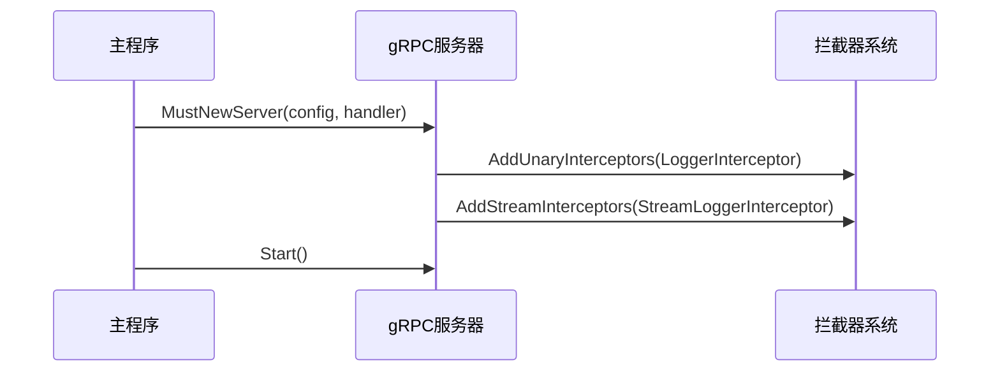

**图表来源**
- [aichat.go:34-42](file://aiapp/aichat/aichat.go#L34-L42)

### 流式拦截器的工作原理

**更新** StreamLoggerInterceptor解决了流式RPC中上下文丢失的关键问题：

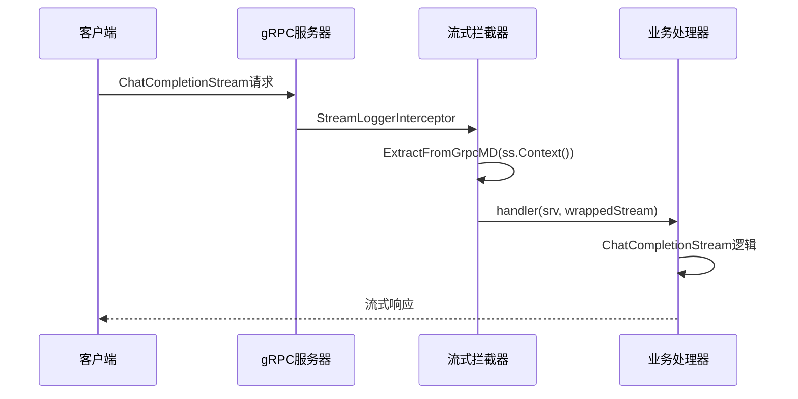

**图表来源**
- [loggerInterceptor.go:23-33](file://common/Interceptor/rpcserver/loggerInterceptor.go#L23-L33)

### 上下文传播机制

**更新** 通过ctxprop模块实现的双向上下文传播：

```mermaid
flowchart TD
Start([请求进入]) --> Extract[ExtractFromGrpcMD<br/>从gRPC metadata提取字段]
Extract --> Inject[InjectToGrpcMD<br/>向下游RPC注入字段]
Inject --> Business[业务逻辑处理]
Business --> Error{是否有错误?}
Error --> |是| Log[logx.WithContext(ctx)<br/>记录结构化日志]
Error --> |否| Success[返回成功响应]
Log --> End([结束])
Success --> End
```

**图表来源**
- [grpc.go:11-34](file://common/ctxprop/grpc.go#L11-L34)
- [loggerInterceptor.go:12-32](file://common/Interceptor/rpcserver/loggerInterceptor.go#L12-L32)

### 结构化日志记录

**更新** 拦截器系统提供了完整的结构化日志记录能力：

- **错误日志**：使用`logx.WithContext(ctx).Errorf()`记录带有上下文信息的错误
- **请求日志**：记录RPC方法名、请求参数和响应状态
- **上下文字段**：自动提取和记录用户ID、用户名、部门代码、授权信息、跟踪ID等
- **流式超时**：专门处理流式RPC的超时和断开连接场景

**章节来源**
- [loggerInterceptor.go:1-43](file://common/Interceptor/rpcserver/loggerInterceptor.go#L1-L43)
- [metadataInterceptor.go:1-19](file://common/Interceptor/rpcclient/metadataInterceptor.go#L1-L19)
- [grpc.go:1-35](file://common/ctxprop/grpc.go#L1-L35)
- [http.go:1-33](file://common/ctxprop/http.go#L1-L33)

## 依赖关系分析

AI聊天服务的依赖关系清晰明确，遵循依赖倒置原则：

```mermaid
graph TB
subgraph "外部依赖"
A[go-zero框架]
B[gRPC框架]
C[HTTP客户端]
D[MCP SDK]
E[modelcontextprotocol/go-sdk]
F[stat监控]
G[timex时间]
H[logx日志]
I[antsx异步]
J[ctxdata上下文]
K[slog结构化日志]
L[bufio扫描器]
M[json解析器]
N[google.golang.org/grpc]
O[google.golang.org/grpc/reflection]
P[google.golang.org/grpc/metadata]
end
subgraph "内部模块"
Q[aichat.go] --> R[config]
Q --> S[svc]
Q --> T[server]
T --> U[logic]
U --> V[provider]
V --> W[types]
R --> X[config.go]
S --> Y[servicecontext.go]
T --> Z[aichatserver.go]
U --> AA[chatcompletionlogic.go]
V --> AB[registry.go]
V --> AC[openai.go]
V --> AD[mcpx/client.go]
AE[ctxprop.go] --> AD
AF[ctxData.go] --> AE
AG[logger.go] --> AD
AH[config.go] --> AD
AI[bufio.Scanner] --> AC
AJ[json.Unmarshal] --> AC
AK[传输协议支持] --> AL[UseStreamable配置]
AM[SSE端点配置] --> AN[/sse端点]
AO[Streamable端点配置] --> AP[/message端点]
AQ[拦截器系统] --> AR[LoggerInterceptor]
AS[拦截器系统] --> AT[StreamLoggerInterceptor]
AU[拦截器系统] --> AV[MetadataInterceptor]
AW[上下文传播] --> AX[ctxprop模块]
AY[结构化日志] --> AZ[logx.WithContext]
end
Q --> A
Q --> B
B --> N
N --> P
O --> B
C --> AD
D --> AD
E --> AD
F --> AD
G --> AD
H --> AD
I --> AA
J --> AE
K --> AG
L --> AI
M --> AJ
AK --> AL
AL --> AM
AL --> AO
AQ --> AR
AQ --> AS
AQ --> AT
AQ --> AU
AW --> AX
AY --> AZ
```

**图表来源**
- [aichat.go:3-18](file://aiapp/aichat/aichat.go#L3-L18)
- [servicecontext.go:1-36](file://aiapp/aichat/internal/svc/servicecontext.go#L1-L36)
- [client.go:3-17](file://common/mcpx/client.go#L3-L17)
- [ctxprop.go:3-11](file://common/mcpx/ctxprop.go#L3-L11)
- [ctxData.go:1-7](file://common/ctxdata/ctxData.go#L1-L7)
- [openai.go:3-14](file://aiapp/aichat/internal/provider/openai.go#L3-L14)
- [config.go:11-16](file://common/mcpx/config.go#L11-L16)
- [server.go:92-110](file://common/mcpx/server.go#L92-L110)
- [loggerInterceptor.go:1-43](file://common/Interceptor/rpcserver/loggerInterceptor.go#L1-L43)
- [metadataInterceptor.go:1-19](file://common/Interceptor/rpcclient/metadataInterceptor.go#L1-L19)

### 关键依赖特性

1. **配置驱动**：所有AI提供者、模型和MCP服务器都通过重构后的Mcpx.Config管理
2. **接口抽象**：Provider接口隔离了具体的AI服务实现
3. **类型安全**：完整的protobuf定义确保了类型安全
4. **错误处理**：统一的错误转换和gRPC状态码映射
5. **MCP集成**：通过重构后的MCP SDK实现与外部工具的智能交互
6. **异步处理**：使用antsx库处理流式响应的异步接收
7. **上下文传播**：通过ctxprop模块实现用户身份信息的跨服务传递
8. **结构化日志**：通过slog桥接go-zero logx，支持结构化日志输出
9. **性能监控**：内置mcpx.metrics统计工具调用性能和成功率
10. **流式优化**：256KB scanner缓冲区，防止大块SSE数据截断
11. **传输协议支持**：同时支持SSE和Streamable HTTP两种MCP传输协议
12. **端点配置**：MCP服务器端点从/message更新为/sse，保持向后兼容
13. **拦截器系统**：通过LoggerInterceptor和StreamLoggerInterceptor增强可观测性
14. **上下文传播增强**：通过ctxprop模块实现gRPC元数据与上下文的双向传播
15. **流式超时管理**：改进的流式gRPC操作超时控制和错误处理机制

**更新** 新增的MCP依赖：
- `github.com/modelcontextprotocol/go-sdk/mcp`：MCP协议实现
- `github.com/zeromicro/go-zero/core/stat`：性能监控
- `github.com/zeromicro/go-zero/core/timex`：时间处理
- `github.com/zeromicro/go-zero/core/logx`：日志系统
- `github.com/zeromicro/go-zero/core/antsx`：异步处理
- 支持SSE传输协议和工具发现机制
- 支持Streamable HTTP传输协议和工具发现机制
- 自动化的工具列表刷新和缓存管理
- 改进的连接生命周期管理
- 上下文属性的自动注入和提取
- 结构化日志的slog桥接
- **新增** 传输协议选择机制，支持UseStreamable配置
- **新增** 拦截器系统，增强流式gRPC操作的可观测性
- **新增** 上下文传播增强，解决流式RPC中上下文丢失问题
- **新增** 结构化日志记录，提供完整的错误追踪能力

**章节来源**
- [aichat.proto:1-115](file://aiapp/aichat/aichat.proto#L1-L115)
- [types.go:1-102](file://aiapp/aichat/internal/provider/types.go#L1-L102)

## 性能考虑

### 超时管理

**更新** 系统实现了增强的多层次超时控制机制：

| 超时类型 | 默认值 | 用途 | 配置位置 |
|----------|--------|------|----------|
| 总流超时 | 10分钟 | 整个流生命周期限制 | StreamTimeout |
| 空闲超时 | 90秒 | 单个chunk间的最大等待时间 | StreamIdleTimeout |
| 工具调用超时 | 30秒 | 单个MCP工具调用的最大时间 | Mcpx.ConnectTimeout |
| 请求超时 | 60秒 | 单次API调用超时 | RpcServerConf.Timeout |
| 服务器重连间隔 | 30秒 | 断开后重连间隔 | Mcpx.RefreshInterval |

**更新** 超时优先级判断：
1. 客户端断开（浏览器关闭SSE→aigtw取消gRPC调用→l.ctx取消）
2. 总超时到期（streamCtx超时）
3. 空闲超时（awaitErr是DeadlineExceeded）
4. 工具调用超时（MCP工具执行超时）
5. 上游错误（业务错误）

### 并发处理

系统使用异步Promise模式处理流式响应的接收：
- 每个`Recv()`操作都在独立goroutine中执行
- 支持超时中断和优雅取消
- 自动资源清理和错误传播
- MCP工具调用使用独立的上下文和超时控制
- **更新** 异步处理使用antsx.Promise实现非阻塞接收

### 缓存策略

- **提供者缓存**：注册表缓存已初始化的提供者实例
- **模型映射缓存**：快速查找模型对应的提供者
- **MCP工具缓存**：缓存工具定义以减少转换开销
- **配置缓存**：避免重复解析配置文件
- **连接缓存**：多服务器连接复用，减少握手开销
- **工具结果缓存**：工具调用结果按参数缓存，避免重复执行
- **传输协议缓存**：根据UseStreamable标志缓存传输协议类型
- **拦截器缓存**：拦截器状态和上下文传播缓存

**更新** 资源管理优化：
- scanner缓冲区从64KB增加到256KB
- 防止大块SSE数据截断
- MCP工具列表的并发安全访问
- 自动化的工具刷新机制
- 改进的连接生命周期管理
- **更新** 异步Promise模式减少阻塞等待
- **更新** 性能监控：mcpx.metrics统计工具调用延迟和成功率
- **新增** 传输协议选择优化：根据UseStreamable标志快速选择协议
- **新增** 拦截器性能优化：减少上下文传播开销
- **新增** 结构化日志性能优化：异步日志记录机制

### 工具调用性能

- **轮次限制**：默认最多10轮工具调用，防止无限循环
- **批量工具调用**：同一轮次内并行执行多个工具调用
- **结果缓存**：工具调用结果按参数缓存，避免重复执行
- **连接复用**：MCP客户端连接复用，减少握手开销
- **服务器前缀优化**：工具名称前缀避免冲突，提高路由效率
- **上下文传播优化**：只传递必要的上下文属性，减少传输开销
- **性能监控**：内置mcpx.metrics统计工具调用成功率和延迟
- **传输协议优化**：根据UseStreamable标志选择最适合的传输协议
- **拦截器性能优化**：通过上下文缓存减少重复提取和注入开销

## 故障排除指南

### 常见错误类型及解决方案

**更新** 错误处理机制改进后的错误类型：

| 错误类型 | 状态码 | 描述 | 解决方案 |
|----------|--------|------|----------|
| 认证失败 | 401/403 | API密钥无效或权限不足 | 检查配置文件中的ApiKey |
| 速率限制 | 429 | 超出API调用限制 | 降低请求频率或升级套餐 |
| 参数错误 | 400 | 请求参数格式不正确 | 验证消息格式和必填字段 |
| 上游错误 | 5xx | AI服务暂时不可用 | 重试请求或检查服务状态 |
| 超时错误 | DEADLINE_EXCEEDED | 流式连接超时 | 检查网络连接和超时配置 |
| 工具调用错误 | RESOURCE_EXHAUSTED | 工具调用轮次超限 | 检查MaxToolRounds配置 |
| MCP连接错误 | UNAVAILABLE | 无法连接到MCP服务器 | 检查Mcpx配置和网络连通性 |
| 工具路由错误 | NOT_FOUND | 工具名称未找到 | 确认MCP服务器上已注册相应工具 |
| 上下文传播错误 | INVALID_ARGUMENT | 上下文属性无效 | 检查ctxdata中的用户信息完整性 |
| 结构化日志错误 | INTERNAL | 日志系统异常 | 检查logx配置和权限 |
| **新增** 传输协议错误 | **UNAVAILABLE** | MCP传输协议不匹配 | 检查UseStreamable配置和服务器端点 |
| **新增** 端点配置错误 | **NOT_FOUND** | MCP端点不存在 | 确认服务器端点为/sse或/message |
| **新增** 拦截器错误 | **INTERNAL** | 拦截器处理异常 | 检查LoggerInterceptor和StreamLoggerInterceptor配置 |
| **新增** 上下文丢失错误 | **DEADLINE_EXCEEDED** | 流式RPC上下文丢失 | 检查StreamLoggerInterceptor配置 |

**更新** 新增的MCP相关错误：
- MCP连接失败：检查Mcpx.Servers配置和SSE端点可达性
- 工具调用超时：调整Mcpx.ConnectTimeout配置
- 工具不存在：确认MCP服务器上已注册相应工具
- 参数解析错误：验证工具调用参数的JSON格式
- 服务器名称冲突：检查Mcpx.Servers中服务器名称唯一性
- 上下文属性缺失：检查客户端请求中包含必要的用户信息
- 性能监控异常：检查mcpx.metrics配置和权限
- **新增** 传输协议不匹配：确认客户端UseStreamable与服务器端点配置一致
- **新增** 端点不存在：检查MCP服务器端点配置，确保使用正确的端点路径
- **新增** 拦截器配置错误：检查LoggerInterceptor和StreamLoggerInterceptor的集成
- **新增** 上下文传播失败：检查ctxprop模块的上下文字段配置

### 日志分析

系统提供了丰富的日志信息：
- 请求ID追踪：每个请求都有唯一的ID便于调试
- 模型映射：显示从逻辑ID到后端模型的转换
- 错误详情：包含上游服务的原始错误信息
- 性能指标：响应时间和资源使用情况
- **更新** MCP工具调用日志：记录工具调用过程和结果
- **更新** 多服务器连接日志：显示服务器连接状态和工具聚合信息
- **更新** 结构化日志：通过logx.SetUp配置支持JSON和plain格式
- **更新** 上下文属性日志：显示用户身份信息的传递和提取
- **更新** 性能监控日志：显示mcpx.metrics统计的工具调用性能
- **新增** 拦截器日志：记录拦截器处理过程和上下文传播信息
- **新增** 流式超时日志：显示流式RPC的超时控制和错误处理
- **新增** 传输协议日志：显示使用的MCP传输协议类型
- **新增** 端点配置日志：显示MCP服务器端点配置信息

### 调试技巧

1. **启用开发模式**：在配置中设置`Mode: dev`以启用gRPC反射
2. **检查配置**：验证Provider、Model和Mcpx配置的正确性
3. **监控网络**：使用工具检查与AI服务和MCP服务器的连接状态
4. **查看日志**：关注错误级别日志和上下文信息
5. **更新** 调试MCP工具：使用MCP服务器的echo工具测试连接
6. **监控工具调用**：观察工具调用循环的执行过程和性能
7. **更新** 错误类型检查：使用errors.As进行精确的错误类型判断
8. **更新** 日志配置：通过aichat.yaml中的Log配置调整日志格式和级别
9. **更新** 多服务器调试：检查服务器名称前缀和工具路由
10. **更新** 内存泄漏排查：监控连接生命周期和资源清理
11. **更新** 上下文调试：使用logx.WithContext(ctx)记录关键上下文信息
12. **更新** 性能监控：关注mcpx.metrics中的工具调用统计信息
13. **更新** 结构化日志调试：验证slog桥接和logx.SetUp配置
14. **更新** 流式处理调试：检查scanner缓冲区大小和超时设置
15. **新增** 传输协议调试：检查UseStreamable配置与服务器端点一致性
16. **新增** 端点配置调试：验证MCP服务器端点路径正确性
17. **新增** 拦截器调试：检查LoggerInterceptor和StreamLoggerInterceptor的集成
18. **新增** 上下文传播调试：验证流式RPC中上下文的正确传递
19. **新增** 拦截器性能调试：监控拦截器处理的性能开销
20. **新增** 结构化日志调试：验证拦截器产生的日志信息

**更新** 新增调试技巧：
- 调整超时配置：根据实际需求调整StreamTimeout、StreamIdleTimeout和MaxToolRounds
- 监控资源使用：关注scanner缓冲区使用情况和MCP连接状态
- 错误类型检查：使用errors.As进行类型安全的错误检查
- 工具调用测试：使用简单的echo工具验证MCP集成
- **更新** 日志基础设施：利用logx.Must(logx.SetUp(c.Log))初始化的日志系统
- **更新** 多服务器监控：检查服务器连接状态和工具聚合情况
- **更新** 上下文传播测试：验证用户身份信息在工具调用中的正确传递
- **更新** 性能分析：使用mcpx.metrics监控工具调用延迟和成功率
- **更新** 结构化日志分析：验证slog桥接和日志格式配置
- **更新** 流式处理优化：监控256KB scanner缓冲区使用情况
- **新增** 传输协议测试：验证UseStreamable配置与服务器端点匹配
- **新增** 端点连通性测试：检查/sse和/message端点的可达性
- **新增** 拦截器集成测试：验证LoggerInterceptor和StreamLoggerInterceptor的正确集成
- **新增** 上下文传播测试：验证流式RPC中上下文的完整传递和恢复

**章节来源**
- [chatcompletionlogic.go:190-206](file://aiapp/aichat/internal/logic/chatcompletionlogic.go#L190-L206)
- [chatcompletionstreamlogic.go:123-144](file://aiapp/aichat/internal/logic/chatcompletionstreamlogic.go#L123-L144)

## 结论

AI聊天服务是一个设计精良的微服务架构示例，经过MCP客户端重构和拦截器系统增强后具有以下突出特点：

### 技术优势
- **架构清晰**：分层设计确保了良好的可维护性
- **扩展性强**：通过Provider接口轻松集成新的AI服务
- **配置灵活**：完全基于重构后的Mcpx.Config的模型、服务和MCP工具管理
- **错误处理完善**：统一的错误转换和超时控制
- **智能工具集成**：通过重构后的MCP协议实现AI与外部系统的智能交互
- **日志基础设施**：通过logx.Must(logx.SetUp(c.Log))实现结构化日志输出
- **多服务器支持**：同时连接多个MCP服务器，提高可用性和功能丰富度
- **内存泄漏修复**：改进的连接生命周期管理和资源清理机制
- **上下文传播**：支持用户身份信息在MCP工具调用中的传递和使用
- **性能监控**：内置mcpx.metrics统计工具调用性能和成功率
- **结构化日志**：通过slog桥接go-zero logx，支持结构化日志输出
- **流式优化**：256KB scanner缓冲区，防止大块SSE数据截断
- **传输协议支持**：同时支持SSE和Streamable HTTP两种MCP传输协议
- **端点兼容性**：MCP服务器端点从/message更新为/sse，保持向后兼容
- **拦截器系统**：通过LoggerInterceptor和StreamLoggerInterceptor增强可观测性
- **上下文传播增强**：通过ctxprop模块实现gRPC元数据与上下文的双向传播
- **流式超时管理**：改进的流式gRPC操作超时控制和错误处理机制

**更新** 新增的技术改进：
- **重构后的MCP客户端**：支持多服务器连接管理和工具聚合
- **内存泄漏修复**：改进的连接生命周期管理和资源清理
- **配置系统重构**：Mcpx.Config替代原有的McpServers配置
- **工具名称前缀**：避免工具名称冲突，支持多服务器工具路由
- **动态工具管理**：自动化的工具列表刷新和缓存
- **增强的超时控制**：10分钟总超时和90秒空闲超时，支持更复杂的流式对话场景
- **改进的错误处理**：使用errors.As进行类型安全的错误检查
- **优化的资源管理**：256KB scanner缓冲区，防止大块数据截断
- **完善的配置管理**：支持自定义流式超时设置和MCP服务器配置
- **结构化日志系统**：通过logx.SetUp实现JSON和plain格式的日志输出
- **上下文属性传播**：支持用户身份信息在MCP工具调用中的自动传递
- **异步处理优化**：使用antsx.Promise提升流式响应处理性能
- **性能监控增强**：内置mcpx.metrics统计工具调用延迟和成功率
- **传输协议选择**：通过UseStreamable配置灵活选择SSE或Streamable HTTP协议
- **端点配置优化**：MCP服务器端点从/message更新为/sse，提升兼容性
- **拦截器系统**：通过LoggerInterceptor和StreamLoggerInterceptor增强可观测性
- **上下文传播增强**：解决流式RPC中上下文丢失的关键问题
- **流式超时管理**：改进的流式gRPC操作超时控制和错误处理机制
- **结构化日志记录**：提供完整的错误追踪和性能监控能力

### 业务价值
- **多供应商支持**：为用户提供最佳的AI服务选择
- **标准化接口**：简化了客户端集成复杂度
- **性能优化**：合理的超时管理和并发控制
- **可观测性**：完整的日志和监控支持
- **智能自动化**：通过重构后的MCP工具实现业务流程自动化
- **高可用性**：多服务器连接提高系统稳定性
- **安全性**：通过上下文传播机制实现细粒度的用户身份管理
- **可扩展性**：支持动态工具发现和路由
- **监控能力**：内置性能指标和错误统计
- **传输协议灵活性**：支持多种MCP传输协议，适应不同部署环境
- **向后兼容性**：MCP服务器端点更新保持现有配置的兼容性
- **拦截器可观测性**：通过拦截器系统提供完整的请求处理链路监控
- **上下文完整性**：确保流式RPC中上下文信息的完整传递和恢复

### 发展建议
1. **增加缓存层**：为频繁访问的模型元数据和MCP工具定义增加缓存
2. **实现熔断器**：在上游服务不稳定时提供降级策略
3. **增强监控**：添加更详细的性能指标和告警机制
4. **支持更多格式**：扩展对其他AI服务格式的支持
5. **扩展MCP工具生态**：开发更多实用的MCP工具，如数据库查询、文件操作等
6. **优化多服务器负载均衡**：实现智能的工具路由和负载分配
7. **增强上下文管理**：支持更丰富的用户属性和权限控制
8. **性能优化**：进一步优化异步处理和资源管理机制
9. **日志分析增强**：利用结构化日志进行更深入的性能分析和故障诊断
10. **多服务器智能路由**：根据工具类型和服务器负载实现智能路由
11. **内存使用监控**：监控重构后的MCP客户端内存使用情况
12. **上下文传播优化**：实现更高效的上下文属性传递机制
13. **异步处理扩展**：支持更多的异步操作模式和错误恢复策略
14. **传输协议优化**：根据网络环境和性能要求动态选择最优传输协议
15. **端点配置管理**：提供更灵活的MCP服务器端点配置选项
16. **拦截器性能优化**：监控和优化拦截器处理的性能开销
17. **上下文传播监控**：实时监控流式RPC中上下文的传递和恢复状态
18. **拦截器日志分析**：利用拦截器产生的日志信息进行性能分析和故障排查
19. **流式超时策略优化**：根据不同业务场景调整超时策略和阈值
20. **拦截器扩展性**：支持自定义拦截器的动态加载和配置

**更新** 建议的进一步优化：
- **动态超时调整**：根据模型复杂度和工具调用类型动态调整超时设置
- **智能资源管理**：根据流量动态调整scanner缓冲区大小和MCP连接池
- **错误预测**：基于历史数据预测和预防常见错误
- **工具调用优化**：实现工具调用结果的智能缓存和去重
- **性能监控增强**：添加MCP工具调用的详细性能指标
- **日志分析增强**：利用结构化日志进行更深入的性能分析和故障诊断
- **多服务器智能路由**：根据工具类型和服务器负载实现智能路由
- **内存使用监控**：监控重构后的MCP客户端内存使用情况
- **上下文传播优化**：实现更高效的上下文属性传递机制
- **异步处理扩展**：支持更多的异步操作模式和错误恢复策略
- **传输协议智能选择**：根据网络条件和性能要求自动选择最优传输协议
- **端点配置自动化**：提供MCP服务器端点配置的自动化检测和修复功能
- **拦截器性能监控**：实时监控拦截器处理的性能指标和错误率
- **上下文传播质量监控**：监控流式RPC中上下文传播的完整性和准确性
- **拦截器日志聚合**：提供拦截器日志的集中管理和分析功能
- **流式超时策略学习**：基于历史数据自动优化超时策略和阈值设置

该服务为构建企业级AI应用提供了坚实的基础，其设计原则和实现模式值得在类似项目中借鉴和参考。重构后的MCP工具调用能力和增强的日志基础设施使其成为了一个真正的智能代理系统，能够与外部世界进行智能交互和自动化操作。多服务器连接管理和内存泄漏修复进一步提升了系统的稳定性和可靠性。上下文属性传播功能则为构建安全的企业级应用提供了重要的基础支撑。性能监控和结构化日志系统为运维和故障排查提供了强有力的支持。新增的传输协议支持、拦截器系统和流式超时管理使得系统在可观测性和稳定性方面达到了新的高度。拦截器系统通过LoggerInterceptor和StreamLoggerInterceptor的集成，为流式gRPC操作提供了完整的可观测性，确保了系统的可维护性和可调试性。上下文传播增强通过ctxprop模块解决了流式RPC中的关键问题，保证了用户身份信息在整个请求处理链路中的完整传递。这些改进使得AI聊天服务不仅是一个功能强大的AI接入平台，更是一个设计精良、可观测性良好、易于维护的企业级微服务系统。
</existing_wiki_content>

<updated_section>
### 拦截器系统

**新增** 拦截器系统是AI聊天服务可观测性的重要组成部分，提供了完整的gRPC请求处理链路监控。

#### 拦截器架构


**图表来源**
- [loggerInterceptor.go:1-43](file://common/Interceptor/rpcserver/loggerInterceptor.go#L1-L43)
- [metadataInterceptor.go:1-19](file://common/Interceptor/rpcclient/metadataInterceptor.go#L1-L19)
- [grpc.go:1-35](file://common/ctxprop/grpc.go#L1-L35)

#### 服务启动时的拦截器集成

在服务启动过程中，拦截器通过以下方式集成：


**图表来源**
- [aichat.go:34-42](file://aiapp/aichat/aichat.go#L34-L42)

#### 流式拦截器的工作原理

**更新** StreamLoggerInterceptor解决了流式RPC中上下文丢失的关键问题：


**图表来源**
- [loggerInterceptor.go:23-33](file://common/Interceptor/rpcserver/loggerInterceptor.go#L23-L33)

#### 上下文传播机制

**更新** 通过ctxprop模块实现的双向上下文传播：

```mermaid
flowchart TD
Start([请求进入]) --> Extract[ExtractFromGrpcMD<br/>从gRPC metadata提取字段]
Extract --> Inject[InjectToGrpcMD<br/>向下游RPC注入字段]
Inject --> Business[业务逻辑处理]
Business --> Error{是否有错误?}
Error --> |是| Log[logx.WithContext(ctx)<br/>记录结构化日志]
Error --> |否| Success[返回成功响应]
Log --> End([结束])
Success --> End
```

**图表来源**
- [grpc.go:11-34](file://common/ctxprop/grpc.go#L11-L34)
- [loggerInterceptor.go:12-32](file://common/Interceptor/rpcserver/loggerInterceptor.go#L12-L32)

#### 结构化日志记录

**更新** 拦截器系统提供了完整的结构化日志记录能力：

- **错误日志**：使用`logx.WithContext(ctx).Errorf()`记录带有上下文信息的错误
- **请求日志**：记录RPC方法名、请求参数和响应状态
- **上下文字段**：自动提取和记录用户ID、用户名、部门代码、授权信息、跟踪ID等
- **流式超时**：专门处理流式RPC的超时和断开连接场景

**章节来源**
- [loggerInterceptor.go:1-43](file://common/Interceptor/rpcserver/loggerInterceptor.go#L1-L43)
- [metadataInterceptor.go:1-19](file://common/Interceptor/rpcclient/metadataInterceptor.go#L1-L19)
- [grpc.go:1-35](file://common/ctxprop/grpc.go#L1-L35)
- [http.go:1-33](file://common/ctxprop/http.go#L1-L33)
</updated_section>