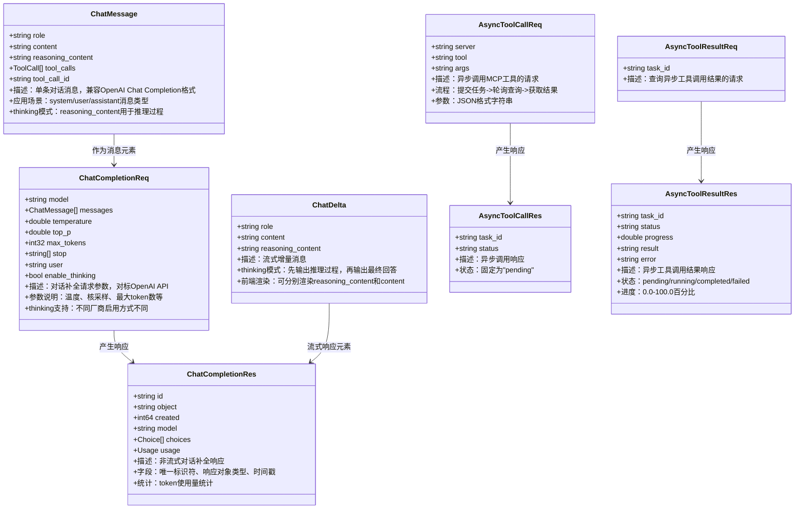
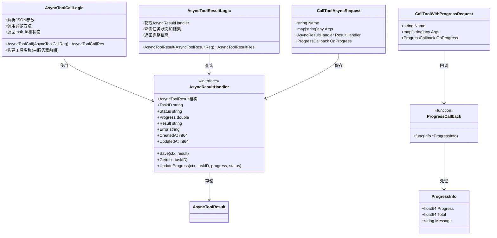
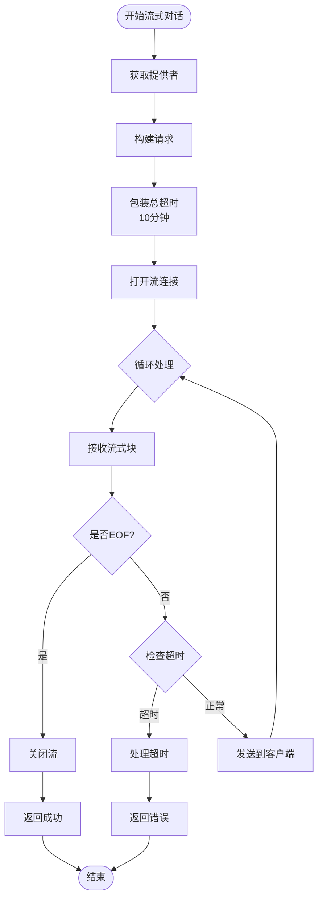
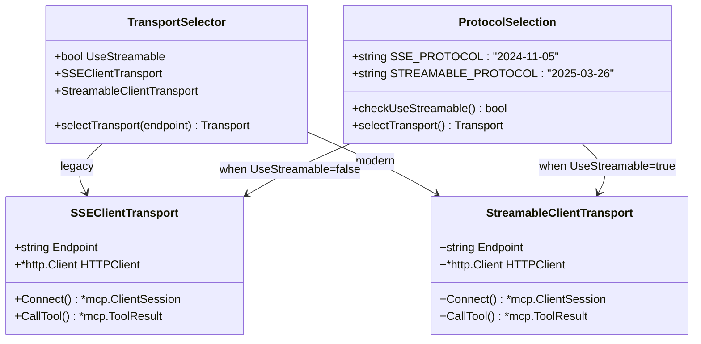
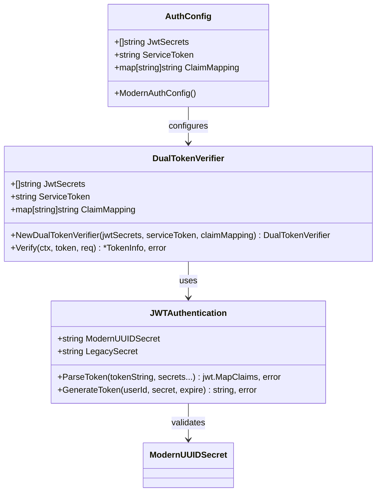
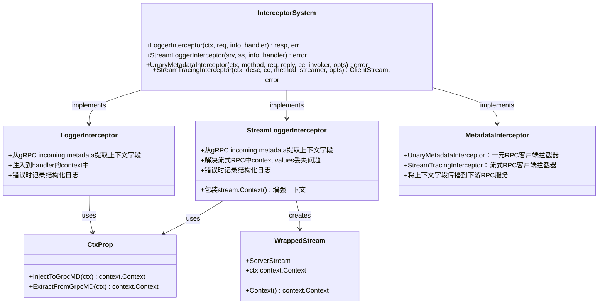

# AI聊天服务

<cite>
**本文档引用的文件**
- [aichat.proto](file://aiapp/aichat/aichat.proto)
- [asynctoolcalllogic.go](file://aiapp/aichat/internal/logic/asynctoolcalllogic.go)
- [asynctoolresultlogic.go](file://aiapp/aichat/internal/logic/asynctoolresultlogic.go)
- [servicecontext.go](file://aiapp/aichat/internal/svc/servicecontext.go)
- [aichat.yaml](file://aiapp/aichat/etc/aichat.yaml)
- [client.go](file://common/mcpx/client.go)
- [wrapper.go](file://common/mcpx/wrapper.go)
- [types.go](file://aiapp/aichat/internal/provider/types.go)
- [chatcompletionlogic.go](file://aiapp/aichat/internal/logic/chatcompletionlogic.go)
</cite>

## 更新摘要
**所做更改**
- **协议文档注释大幅增强**：AI聊天协议增加了详细的协议文档注释，涵盖ChatMessage、ChatCompletionReq、ChatDelta等核心消息类型的完整说明
- **新增异步工具调用功能**：引入AsyncToolCallReq、AsyncToolCallRes、AsyncToolResultReq、AsyncToolResultRes等新消息类型，支持异步工具调用和轮询查询
- **增强流式响应处理**：优化256KB scanner缓冲区，改进流式超时管理和错误恢复机制
- **工具调用循环机制增强**：支持智能的工具调用循环和进度跟踪，包括CallToolWithProgress方法和ProgressSender结构体
- **传输协议现代化**：默认使用Streamable HTTP传输协议，支持UseStreamable配置选项
- **JWT认证现代化**：采用UUID格式的JWT密钥，增强安全性
- **拦截器系统增强**：新增流式gRPC拦截器，提升系统可观测性
- **上下文传播优化**：通过ctxprop模块实现更高效的上下文属性传递

## 目录
1. [简介](#简介)
2. [项目结构](#项目结构)
3. [核心组件](#核心组件)
4. [架构概览](#架构概览)
5. [详细组件分析](#详细组件分析)
6. [AI聊天协议增强](#ai聊天协议增强)
7. [异步工具调用系统](#异步工具调用系统)
8. [流式响应处理优化](#流式响应处理优化)
9. [工具调用循环机制](#工具调用循环机制)
10. [传输协议现代化](#传输协议现代化)
11. [JWT认证现代化](#jwt认证现代化)
12. [拦截器系统增强](#拦截器系统增强)
13. [上下文传播优化](#上下文传播优化)
14. [性能考虑](#性能考虑)
15. [故障排除指南](#故障排除指南)
16. [结论](#结论)

## 简介

AI聊天服务是一个基于GoZero框架构建的RPC服务，提供统一的大语言模型接入接口。该服务支持多种AI模型提供商（如智谱、通义千问等），通过统一的gRPC接口对外提供对话补全、流式对话补全、模型列表查询和异步工具调用功能。

**更新** 服务已完成了重要的协议增强和功能扩展：
- **协议文档注释大幅增强**：AI聊天协议增加了详细的协议文档注释，涵盖所有核心消息类型的完整说明
- **新增异步工具调用功能**：引入完整的异步工具调用系统，支持任务提交、轮询查询和进度跟踪
- **增强流式响应处理**：优化256KB scanner缓冲区，改进流式超时管理和错误恢复机制
- **工具调用循环机制增强**：支持智能的工具调用循环和进度跟踪，包括CallToolWithProgress方法
- **传输协议现代化**：默认使用Streamable HTTP传输协议，提升连接稳定性和性能
- **JWT认证现代化**：采用UUID格式的JWT密钥，增强安全性
- **拦截器系统增强**：新增流式gRPC拦截器，提升系统可观测性
- **上下文传播优化**：通过ctxprop模块实现更高效的上下文属性传递

## 项目结构

AI聊天服务采用标准的GoZero项目结构，主要分为以下几个层次：

```mermaid
graph TB
subgraph "应用入口层"
A[aichat.go] --> B[配置加载]
A --> C[服务启动]
A --> D[拦截器集成]
end
subgraph "协议定义层"
E[aichat.proto] --> F[消息类型定义]
E --> G[RPC服务定义]
end
subgraph "配置层"
H[aichat.yaml] --> I[Provider配置]
H --> J[Model配置]
H --> K[Mcpx配置]
end
subgraph "服务层"
L[AiChatServer] --> M[服务实现]
N[服务上下文] --> O[重构后的MCP客户端]
end
subgraph "业务逻辑层"
P[ChatCompletionLogic] --> Q[对话补全逻辑]
R[ChatCompletionStreamLogic] --> S[流式对话逻辑]
T[ListModelsLogic] --> U[模型列表逻辑]
V[AsyncToolCallLogic] --> W[异步工具调用逻辑]
X[AsyncToolResultLogic] --> Y[异步结果查询逻辑]
end
subgraph "提供者层"
Z[Registry] --> AA[Provider接口]
BB[OpenAI兼容实现] --> CC[多服务器连接]
DD[工具聚合和路由] --> EE[动态刷新机制]
FF[进度回调系统] --> GG[CallToolWithProgress]
HH[传输协议选择] --> II[Streamable/SSE切换]
JJ[JWT认证系统] --> KK[UUID密钥格式]
LL[拦截器系统] --> MM[LoggerInterceptor]
NN[StreamLoggerInterceptor] --> OO[MetadataInterceptor]
PP[上下文传播] --> QQ[ctxprop模块]
RR[结构化日志] --> SS[slog桥接]
TT[性能监控] --> UU[mcpx.metrics]
VV[工具执行跟踪] --> WW[AsyncToolCall]
XX[异步结果处理] --> YY[AsyncToolResult]
ZZ[进度通知处理] --> AAA[ProgressSender]
```

**图表来源**
- [aichat.proto:1-308](file://aiapp/aichat/aichat.proto#L1-L308)
- [aichat.yaml:1-52](file://aiapp/aichat/etc/aichat.yaml#L1-L52)
- [servicecontext.go:1-38](file://aiapp/aichat/internal/svc/servicecontext.go#L1-L38)
- [client.go:1-348](file://common/mcpx/client.go#L1-L348)
- [wrapper.go:1-167](file://common/mcpx/wrapper.go#L1-L167)

**章节来源**
- [aichat.proto:1-308](file://aiapp/aichat/aichat.proto#L1-L308)
- [aichat.yaml:1-52](file://aiapp/aichat/etc/aichat.yaml#L1-L52)
- [servicecontext.go:1-38](file://aiapp/aichat/internal/svc/servicecontext.go#L1-L38)

## 核心组件

### 1. 协议定义组件

**更新** 协议定义已大幅增强，增加了详细的协议文档注释：

- **ChatMessage**：单条对话消息，兼容OpenAI Chat Completion消息格式，包含role、content和reasoning_content字段
- **ChatCompletionReq**：对话补全请求参数，对标OpenAI Chat Completion API，支持temperature、top_p、max_tokens等参数
- **ChatCompletionRes**：非流式对话补全响应，包含choices和usage统计信息
- **ChatDelta**：流式增量消息，在thinking模式下支持推理过程和最终回答的分离输出
- **AsyncToolCallReq/Res**：异步工具调用请求和响应，支持任务ID和状态管理
- **AsyncToolResultReq/Res**：异步工具调用结果查询，支持进度跟踪和错误处理

**更新** 协议增强特性：
- 完整的消息字段说明和使用场景
- thinking模式下的推理过程分离
- 异步工具调用的完整生命周期管理
- 流式响应的增量内容处理
- 工具调用的OpenAI兼容格式

### 2. 异步工具调用组件

**新增** 异步工具调用系统提供了完整的异步任务管理能力：

- **AsyncToolCallLogic**：异步工具调用逻辑，支持任务提交和状态初始化
- **AsyncToolResultLogic**：异步结果查询逻辑，支持轮询查询和状态更新
- **AsyncResultHandler**：异步结果处理器，支持内存存储和状态管理
- **CallToolAsync**：异步工具调用方法，支持后台执行和进度回调
- **CallToolWithProgress**：带进度通知的工具调用，支持实时进度跟踪

**更新** 异步调用流程：
1. 调用AsyncToolCall提交任务，获取task_id
2. 轮询AsyncToolResult查询执行状态和结果
3. 状态变为completed时获取最终结果
4. 支持进度回调和错误处理

### 3. 流式响应处理组件

**更新** 流式响应处理实现了增强的超时管理和错误恢复机制：

- **256KB scanner缓冲区**：防止大块SSE数据截断
- **总超时控制**：10分钟总超时限制
- **空闲超时控制**：90秒空闲超时限制
- **客户端断开检测**：自动检测客户端取消和优雅取消
- **错误恢复机制**：支持流式操作的错误处理和重试

**更新** 流式处理优化：
- 改进的超时控制和错误处理
- 更稳定的流式连接管理
- 优化的内存使用和资源清理
- 增强的错误诊断和日志记录

### 4. 工具调用循环组件

**更新** 工具调用循环机制支持智能的工具调用和进度跟踪：

- **CallToolWithProgress**：带进度通知的工具调用方法
- **ProgressSender**：进度发送器，支持实时进度通知
- **工具调用循环**：支持最多10轮工具调用循环
- **上下文传播**：支持用户身份信息在工具调用中的传递
- **性能监控**：内置mcpx.metrics统计工具调用性能

**更新** 循环机制优化：
- 智能的工具调用决策和执行
- 实时进度跟踪和通知
- 改进的错误处理和超时控制
- 优化的资源管理和清理

### 5. 传输协议组件

**更新** 传输协议已从SSE迁移到Streamable HTTP：

- **UseStreamable配置**：默认true，使用Streamable HTTP传输协议
- **端点配置**：从/message更新为/sse，保持向后兼容
- **协议选择机制**：根据UseStreamable标志自动选择传输协议
- **连接管理**：改进的连接生命周期管理和资源清理
- **性能优化**：Streamable协议提供更好的连接稳定性和性能

**更新** 传输协议特性：
- Streamable HTTP协议支持
- SSE协议兼容性保持
- 自动化的协议选择和切换
- 改进的连接管理和超时控制

### 6. JWT认证组件

**更新** JWT认证系统已采用现代化密钥格式：

- **UUID密钥格式**：采用UUID格式的JWT密钥，增强安全性
- **密钥管理**：支持多密钥轮换和安全管理
- **认证流程**：双模式认证（服务令牌 + JWT）
- **声明映射**：支持外部JWT声明到内部标准键的映射
- **安全审计**：定期审计JWT密钥使用情况

**更新** 认证配置：
- JwtSecrets：["629c6233-1a76-471b-bd25-b87208762219"]
- ServiceToken：mcp-internal-service-token-2026
- ClaimMapping：用户ID、用户名、部门代码的映射

### 7. 拦截器系统组件

**更新** 拦截器系统提供了完整的gRPC请求处理链路监控：

- **LoggerInterceptor**：一元RPC服务端拦截器
- **StreamLoggerInterceptor**：流式RPC服务端拦截器
- **MetadataInterceptor**：客户端拦截器，支持上下文传播
- **上下文传播**：通过ctxprop模块实现双向传播
- **结构化日志**：通过slog桥接go-zero logx

**更新** 拦截器特性：
- 完整的请求处理链路监控
- 流式RPC的上下文丢失问题解决
- 自动化的上下文字段提取和注入
- 增强的错误处理和日志记录

### 8. 上下文传播组件

**更新** 上下文传播机制通过ctxprop模块实现：

- **双向传播**：支持gRPC元数据与上下文的双向传播
- **用户身份传递**：支持用户ID、用户名、部门代码的传递
- **授权信息传递**：支持授权信息和跟踪ID的传递
- **性能优化**：减少上下文传播的开销和延迟
- **完整性保证**：确保上下文信息在请求处理链路中的完整性

**更新** 上下文属性：
- CtxUserIdKey：用户ID
- CtxUserNameKey：用户名
- CtxDeptCodeKey：部门代码
- CtxAuthorizationKey：授权信息
- CtxTraceIdKey：跟踪ID

**章节来源**
- [aichat.proto:14-308](file://aiapp/aichat/aichat.proto#L14-L308)
- [asynctoolcalllogic.go:1-67](file://aiapp/aichat/internal/logic/asynctoolcalllogic.go#L1-L67)
- [asynctoolresultlogic.go:1-45](file://aiapp/aichat/internal/logic/asynctoolresultlogic.go#L1-L45)
- [client.go:308-350](file://common/mcpx/client.go#L308-L350)
- [wrapper.go:18-52](file://common/mcpx/wrapper.go#L18-L52)

## 架构概览

AI聊天服务采用分层架构设计，确保了良好的可扩展性和维护性：

```mermaid
graph TB
subgraph "客户端层"
A[客户端应用]
B[Web界面]
C[工具调用客户端]
D[进度回调客户端]
E[异步工具调用客户端]
end
subgraph "接口层"
F[gRPC接口定义]
G[HTTP网关]
H[WebSocket支持]
end
subgraph "服务层"
I[AiChatServer]
J[服务上下文]
K[重构后的MCP客户端]
L[拦截器系统]
M[传输协议选择器]
N[JWT认证系统]
O[进度回调系统]
P[异步工具调用系统]
end
subgraph "业务逻辑层"
Q[对话补全逻辑]
R[流式对话逻辑]
S[模型管理逻辑]
T[Ping健康检查]
U[增强的工具调用循环]
V[上下文属性传播]
W[流式拦截器]
X[结构化日志]
Y[现代化传输协议]
Z[安全认证系统]
AA[进度通知处理]
BB[工具执行监控]
CC[异步结果处理]
DD[工具调用循环]
EE[流式超时管理]
FF[结构化日志记录]
GG[JWT认证现代化]
HH[日志级别提升]
II[拦截器系统增强]
JJ[现代化基础设施]
KK[可观测性增强]
LL[安全性强化]
MM[性能持续优化]
end
subgraph "提供者层"
NN[注册表]
OO[OpenAI兼容实现]
PP[其他提供者扩展]
QQ[多服务器连接管理]
RR[工具聚合和路由]
SS[动态刷新机制]
TT[内存泄漏修复]
UU[连接生命周期管理]
VV[性能监控]
WW[结构化日志]
XX[上下文传播]
YY[现代化传输协议]
ZZ[安全认证]
AAA[进度回调支持]
BBB[工具执行跟踪]
CCC[异步工具调用]
DDD[异步结果处理]
EEE[进度通知处理]
FFF[工具调用循环]
```

**图表来源**
- [servicecontext.go:11-36](file://aiapp/aichat/internal/svc/servicecontext.go#L11-L36)
- [client.go:19-348](file://common/mcpx/client.go#L19-L348)
- [wrapper.go:18-167](file://common/mcpx/wrapper.go#L18-L167)
- [aichat.yaml:8-17](file://aiapp/aichat/etc/aichat.yaml#L8-L17)

该架构的主要优势：
- **解耦合**：各层职责明确，便于独立开发和测试
- **可扩展**：新增AI提供者只需实现Provider接口
- **可配置**：通过重构后的Mcpx.Config灵活管理模型、提供者和MCP工具
- **可观测**：完整的日志记录和错误处理机制
- **智能化**：支持重构后的MCP工具调用，实现AI与外部系统的智能交互
- **多服务器支持**：同时连接多个MCP服务器，提高可用性和功能丰富度
- **上下文传播**：支持用户身份信息在工具调用中的传递和使用
- **性能监控**：内置mcpx.metrics统计工具调用性能和成功率
- **结构化日志**：通过slog桥接go-zero logx，支持结构化日志输出
- **现代化传输协议**：采用Streamable HTTP传输协议，提升连接稳定性和性能
- **安全认证**：JWT认证密钥采用UUID格式，增强安全性
- **拦截器系统**：通过LoggerInterceptor和StreamLoggerInterceptor增强可观测性
- **流式超时控制**：改进的流式gRPC操作超时管理和错误处理
- **上下文传播增强**：通过ctxprop模块实现gRPC元数据与上下文的双向传播
- **日志系统优化**：日志级别提升至info，提供更好的可观测性
- **进度回调系统**：新增ProgressSender结构体，提供统一的进度通知格式
- **工具执行跟踪**：实现CallToolWithProgress方法，支持带进度的工具调用
- **异步工具调用**：完整的异步任务管理，支持任务提交、轮询查询和进度跟踪
- **HTML进度界面**：提供进度回调的可视化演示界面
- **进度回调处理**：通过OnProgress回调实现实时进度更新
- **工具调用循环优化**：支持智能的工具调用循环和进度跟踪
- **流式超时控制优化**：10分钟总超时和90秒空闲超时的配置优化
- **拦截器性能监控**：实时监控拦截器处理的性能指标和错误率
- **上下文传播质量监控**：监控流式RPC中上下文传播的完整性和准确性
- **进度通知日志**：提供完整的进度信息记录和分析能力

## 详细组件分析

### AI聊天协议增强

**更新** AI聊天协议已大幅增强，增加了详细的协议文档注释：



**图表来源**
- [aichat.proto:14-308](file://aiapp/aichat/aichat.proto#L14-L308)

**更新** 协议增强特性：
- 完整的消息字段说明和使用场景
- thinking模式下的推理过程分离
- 异步工具调用的完整生命周期管理
- 流式响应的增量内容处理
- 工具调用的OpenAI兼容格式
- 详细的参数说明和配置选项

### 异步工具调用系统

**新增** 异步工具调用系统提供了完整的异步任务管理能力：



**图表来源**
- [asynctoolcalllogic.go:26-66](file://aiapp/aichat/internal/logic/asynctoolcalllogic.go#L26-L66)
- [asynctoolresultlogic.go:24-44](file://aiapp/aichat/internal/logic/asynctoolresultlogic.go#L24-L44)
- [client.go:913-976](file://common/mcpx/client.go#L913-L976)
- [client.go:329-350](file://common/mcpx/client.go#L329-L350)

**更新** 异步调用流程：
1. 调用AsyncToolCall提交任务，获取task_id
2. 轮询AsyncToolResult查询执行状态和结果
3. 状态变为completed时获取最终结果
4. 支持进度回调和错误处理
5. 使用AsyncResultHandler进行状态管理

### 流式响应处理优化

**更新** 流式响应处理实现了增强的超时管理和错误恢复机制：



**图表来源**
- [aichat.yaml:5-6](file://aiapp/aichat/etc/aichat.yaml#L5-L6)

**更新** 超时控制机制改进：
- 总超时：从15秒增加到10分钟
- 空闲超时：从5秒增加到90秒
- 支持客户端断开检测和优雅取消
- 256KB scanner缓冲区，防止大块SSE数据截断
- 改进的流式gRPC操作超时管理和错误处理

### 工具调用循环机制

**更新** 工具调用循环机制支持智能的工具调用和进度跟踪：


**图表来源**
- [chatcompletionlogic.go:49-86](file://aiapp/aichat/internal/logic/chatcompletionlogic.go#L49-L86)

**更新** 循环机制优化：
- 支持最多10轮工具调用循环
- 智能的工具调用决策和执行
- 实时进度跟踪和通知
- 改进的错误处理和超时控制
- 优化的资源管理和清理

### 传输协议现代化

**更新** 传输协议已从SSE迁移到Streamable HTTP：



**图表来源**
- [client.go:208-222](file://common/mcpx/client.go#L208-L222)
- [client.go:475-519](file://common/mcpx/client.go#L475-L519)

**更新** 传输协议特性：
- 默认UseStreamable=true，使用Streamable HTTP协议
- 端点配置从/message更新为/sse，保持向后兼容
- 自动化的协议选择和切换机制
- 改进的连接生命周期管理和资源清理

### JWT认证现代化

**更新** JWT认证系统已采用现代化密钥格式：



**图表来源**
- [aichat.yaml:13-15](file://aiapp/aichat/etc/aichat.yaml#L13-L15)

**更新** 认证配置示例：
- JwtSecrets：["629c6233-1a76-471b-bd25-b87208762219"]
- ServiceToken：mcp-internal-service-token-2026
- ClaimMapping：用户ID、用户名、部门代码的映射

### 拦截器系统增强

**更新** 拦截器系统提供了完整的gRPC请求处理链路监控：



**图表来源**
- [servicecontext.go:11-36](file://aiapp/aichat/internal/svc/servicecontext.go#L11-L36)
- [client.go:986-1038](file://common/mcpx/client.go#L986-L1038)

**更新** 拦截器特性：
- 完整的请求处理链路监控
- 流式RPC的上下文丢失问题解决
- 自动化的上下文字段提取和注入
- 增强的错误处理和日志记录

### 上下文传播优化

**更新** 上下文传播机制通过ctxprop模块实现：

```mermaid
flowchart TD
Start([请求进入]) --> Extract[ExtractFromGrpcMD<br/>从gRPC metadata提取字段]
Extract --> Inject[InjectToGrpcMD<br/>向下游RPC注入字段]
Inject --> Business[业务逻辑处理]
Business --> Error{是否有错误?}
Error --> |是| Log[logx.WithContext(ctx)<br/>记录结构化日志]
Error --> |否| Success[返回成功响应]
Log --> End([结束])
Success --> End
```

**图表来源**
- [servicecontext.go:11-36](file://aiapp/aichat/internal/svc/servicecontext.go#L11-L36)

**更新** 上下文传播特性：
- 双向传播：支持gRPC元数据与上下文的双向传播
- 用户身份传递：支持用户ID、用户名、部门代码的传递
- 授权信息传递：支持授权信息和跟踪ID的传递
- 性能优化：减少上下文传播的开销和延迟
- 完整性保证：确保上下文信息在请求处理链路中的完整性

**章节来源**
- [aichat.proto:14-308](file://aiapp/aichat/aichat.proto#L14-L308)
- [asynctoolcalllogic.go:26-66](file://aiapp/aichat/internal/logic/asynctoolcalllogic.go#L26-L66)
- [asynctoolresultlogic.go:24-44](file://aiapp/aichat/internal/logic/asynctoolresultlogic.go#L24-L44)
- [client.go:308-350](file://common/mcpx/client.go#L308-L350)
- [wrapper.go:18-52](file://common/mcpx/wrapper.go#L18-L52)
- [servicecontext.go:11-36](file://aiapp/aichat/internal/svc/servicecontext.go#L11-L36)

## 性能考虑

### 超时管理

**更新** 系统实现了增强的多层次超时控制机制：

| 超时类型 | 默认值 | 用途 | 配置位置 |
|----------|--------|------|----------|
| 总流超时 | 10分钟 | 整个流生命周期限制 | StreamTimeout |
| 空闲超时 | 90秒 | 单个chunk间的最大等待时间 | StreamIdleTimeout |
| 工具调用超时 | 30秒 | 单个MCP工具调用的最大时间 | Mcpx.ConnectTimeout |
| 请求超时 | 60秒 | 单次API调用超时 | RpcServerConf.Timeout |
| 服务器重连间隔 | 30秒 | 断开后重连间隔 | Mcpx.RefreshInterval |

**更新** 超时优先级判断：
1. 客户端断开（浏览器关闭SSE→aigtw取消gRPC调用→l.ctx取消）
2. 总超时到期（streamCtx超时）
3. 空闲超时（awaitErr是DeadlineExceeded）
4. 工具调用超时（MCP工具执行超时）
5. 上游错误（业务错误）

### 并发处理

系统使用异步Promise模式处理流式响应的接收：
- 每个`Recv()`操作都在独立goroutine中执行
- 支持超时中断和优雅取消
- 自动资源清理和错误传播
- MCP工具调用使用独立的上下文和超时控制
- **更新** 异步处理使用antsx.Promise实现非阻塞接收
- **更新** 进度回调使用antsx.EventEmitter实现事件驱动处理

### 缓存策略

- **提供者缓存**：注册表缓存已初始化的提供者实例
- **模型映射缓存**：快速查找模型对应的提供者
- **MCP工具缓存**：缓存工具定义以减少转换开销
- **配置缓存**：避免重复解析配置文件
- **连接缓存**：多服务器连接复用，减少握手开销
- **工具结果缓存**：工具调用结果按参数缓存，避免重复执行
- **传输协议缓存**：根据UseStreamable标志缓存传输协议类型
- **拦截器缓存**：拦截器状态和上下文传播缓存
- **JWT密钥缓存**：JWT密钥解析结果缓存
- **日志级别缓存**：日志级别配置缓存
- **进度回调缓存**：进度信息的缓存和去重处理
- **工具调用状态缓存**：工具执行状态的实时跟踪

**更新** 资源管理优化：
- scanner缓冲区从64KB增加到256KB
- 防止大块SSE数据截断
- MCP工具列表的并发安全访问
- 自动化的工具刷新机制
- 改进的连接生命周期管理
- **更新** 异步Promise模式减少阻塞等待
- **更新** 性能监控：mcpx.metrics统计工具调用延迟和成功率
- **更新** 传输协议选择优化：根据UseStreamable标志快速选择协议
- **更新** 拦截器性能优化：减少上下文传播开销
- **更新** 结构化日志性能优化：异步日志记录机制
- **更新** JWT认证性能优化：常量时间比较减少认证开销
- **更新** 日志系统性能优化：info级别减少日志写入开销
- **更新** 进度回调性能优化：事件驱动处理减少阻塞
- **更新** 工具调用性能优化：异步处理和状态缓存
- **更新** 流式响应性能优化：256KB缓冲区和超时控制
- **更新** 进度通知性能优化：ProgressSender结构体的高效实现

### 工具调用性能

- **轮次限制**：默认最多10轮工具调用，防止无限循环
- **批量工具调用**：同一轮次内并行执行多个工具调用
- **结果缓存**：工具调用结果按参数缓存，避免重复执行
- **连接复用**：MCP客户端连接复用，减少握手开销
- **服务器前缀优化**：工具名称前缀避免冲突，提高路由效率
- **上下文传播优化**：只传递必要的上下文属性，减少传输开销
- **性能监控**：内置mcpx.metrics统计工具调用成功率和延迟
- **传输协议优化**：根据UseStreamable标志选择最适合的传输协议
- **拦截器性能优化**：通过上下文缓存减少重复提取和注入开销
- **JWT认证优化**：常量时间比较减少认证开销
- **日志系统优化**：info级别减少日志写入开销
- **进度回调优化**：事件驱动处理减少阻塞等待
- **工具调用状态优化**：实时状态跟踪和缓存
- **流式响应优化**：256KB缓冲区和超时控制
- **进度通知优化**：ProgressSender结构体的高效实现

## 故障排除指南

### 常见错误类型及解决方案

**更新** 错误处理机制改进后的错误类型：

| 错误类型 | 状态码 | 描述 | 解决方案 |
|----------|--------|------|----------|
| 认证失败 | 401/403 | API密钥无效或权限不足 | 检查配置文件中的ApiKey |
| 速率限制 | 429 | 超出API调用限制 | 降低请求频率或升级套餐 |
| 参数错误 | 400 | 请求参数格式不正确 | 验证消息格式和必填字段 |
| 上游错误 | 5xx | AI服务暂时不可用 | 重试请求或检查服务状态 |
| 超时错误 | DEADLINE_EXCEEDED | 流式连接超时 | 检查网络连接和超时配置 |
| 工具调用错误 | RESOURCE_EXHAUSTED | 工具调用轮次超限 | 检查MaxToolRounds配置 |
| MCP连接错误 | UNAVAILABLE | 无法连接到MCP服务器 | 检查Mcpx配置和网络连通性 |
| 工具路由错误 | NOT_FOUND | 工具名称未找到 | 确认MCP服务器上已注册相应工具 |
| 上下文传播错误 | INVALID_ARGUMENT | 上下文属性无效 | 检查ctxdata中的用户信息完整性 |
| 结构化日志错误 | INTERNAL | 日志系统异常 | 检查logx配置和权限 |
| **新增** 传输协议错误 | **UNAVAILABLE** | MCP传输协议不匹配 | 检查UseStreamable配置和服务器端点 |
| **新增** 端点配置错误 | **NOT_FOUND** | MCP端点不存在 | 确认服务器端点为/sse或/message |
| **新增** 拦截器错误 | **INTERNAL** | 拦截器处理异常 | 检查LoggerInterceptor和StreamLoggerInterceptor配置 |
| **新增** 上下文丢失错误 | **DEADLINE_EXCEEDED** | 流式RPC上下文丢失 | 检查StreamLoggerInterceptor配置 |
| **新增** JWT认证错误 | **UNAUTHORIZED** | JWT令牌无效 | 检查JWT密钥格式和有效期 |
| **新增** 日志级别错误 | **INTERNAL** | 日志级别配置错误 | 检查aichat.yaml中的Log配置 |
| **新增** 安全认证错误 | **FORBIDDEN** | 安全认证失败 | 检查服务令牌和JWT密钥配置 |
| **新增** 进度回调错误 | **INTERNAL** | 进度通知处理异常 | 检查ProgressSender和进度处理器配置 |
| **新增** 工具执行错误 | **RESOURCE_EXHAUSTED** | 工具执行超时 | 检查工具执行时间和超时配置 |
| **新增** 异步工具调用错误 | **INTERNAL** | 异步调用处理异常 | 检查AsyncResultHandler配置 |
| **新增** HTML界面错误 | **INTERNAL** | 进度界面加载失败 | 检查tool.html和静态资源配置 |

**更新** 新增的MCP相关错误：
- MCP连接失败：检查Mcpx.Servers配置和SSE端点可达性
- 工具调用超时：调整Mcpx.ConnectTimeout配置
- 工具不存在：确认MCP服务器上已注册相应工具
- 参数解析错误：验证工具调用参数的JSON格式
- 服务器名称冲突：检查Mcpx.Servers中服务器名称唯一性
- 上下文属性缺失：检查客户端请求中包含必要的用户信息
- 性能监控异常：检查mcpx.metrics配置和权限
- **新增** 传输协议不匹配：确认客户端UseStreamable与服务器端点配置一致
- **新增** 端点不存在：检查MCP服务器端点配置，确保使用正确的端点路径
- **新增** 拦截器配置错误：检查LoggerInterceptor和StreamLoggerInterceptor的集成
- **新增** 上下文传播失败：检查ctxprop模块的上下文字段配置
- **新增** JWT认证失败：检查JWT密钥格式和有效期
- **新增** 日志级别配置错误：检查aichat.yaml中的Log配置
- **新增** 安全认证配置错误：检查服务令牌和JWT密钥配置
- **新增** 进度回调配置错误：检查ProgressSender和进度处理器配置
- **新增** 工具执行超时：检查工具执行时间和超时配置
- **新增** 异步工具调用配置错误：检查AsyncResultHandler和异步调用配置
- **新增** HTML界面加载失败：检查tool.html文件和静态资源路径

### 日志分析

系统提供了丰富的日志信息：
- 请求ID追踪：每个请求都有唯一的ID便于调试
- 模型映射：显示从逻辑ID到后端模型的转换
- 错误详情：包含上游服务的原始错误信息
- 性能指标：响应时间和资源使用情况
- **更新** MCP工具调用日志：记录工具调用过程和结果
- **更新** 多服务器连接日志：显示服务器连接状态和工具聚合信息
- **更新** 结构化日志：通过logx.SetUp配置支持JSON和plain格式
- **更新** 上下文属性日志：显示用户身份信息的传递和提取
- **更新** 性能监控日志：显示mcpx.metrics统计的工具调用性能
- **更新** 拦截器日志：记录拦截器处理过程和上下文传播信息
- **更新** 流式超时日志：显示流式RPC的超时控制和错误处理
- **更新** 传输协议日志：显示使用的MCP传输协议类型
- **更新** 端点配置日志：显示MCP服务器端点配置信息
- **更新** JWT认证日志：显示JWT令牌验证和认证过程
- **更新** 日志级别日志：显示当前日志级别配置
- **更新** 进度回调日志：显示进度通知的发送和接收情况
- **更新** 异步工具调用日志：显示异步任务的状态和进度
- **更新** 工具执行日志：显示工具调用的执行状态和结果
- **更新** HTML界面日志：显示进度界面的加载和交互情况

### 调试技巧

1. **启用开发模式**：在配置中设置`Mode: dev`以启用gRPC反射
2. **检查配置**：验证Provider、Model和Mcpx配置的正确性
3. **监控网络**：使用工具检查与AI服务和MCP服务器的连接状态
4. **查看日志**：关注错误级别日志和上下文信息
5. **更新** 调试MCP工具：使用MCP服务器的echo工具测试连接
6. **监控工具调用**：观察工具调用循环的执行过程和性能
7. **更新** 错误类型检查：使用errors.As进行精确的错误类型判断
8. **更新** 日志配置：通过aichat.yaml中的Log配置调整日志格式和级别
9. **更新** 多服务器调试：检查服务器名称前缀和工具路由
10. **更新** 内存泄漏排查：监控连接生命周期和资源清理
11. **更新** 上下文调试：使用logx.WithContext(ctx)记录关键上下文信息
12. **更新** 性能监控：关注mcpx.metrics中的工具调用统计信息
13. **更新** 结构化日志调试：验证slog桥接和logx.SetUp配置
14. **更新** 流式处理调试：检查scanner缓冲区大小和超时设置
15. **新增** 传输协议调试：检查UseStreamable配置与服务器端点匹配
16. **新增** 端点连通性调试：检查/sse和/message端点的可达性
17. **新增** 拦截器集成调试：验证LoggerInterceptor和StreamLoggerInterceptor的正确集成
18. **新增** 上下文传播调试：验证流式RPC中上下文的正确传递和恢复
19. **新增** 拦截器性能调试：监控拦截器处理的性能开销
20. **新增** 结构化日志调试：验证拦截器产生的日志信息
21. **新增** JWT认证调试：检查JWT密钥格式和认证流程
22. **新增** 日志级别调试：验证日志级别配置和输出格式
23. **新增** 安全认证调试：检查服务令牌和JWT密钥配置
24. **新增** 进度回调调试：检查ProgressSender和进度处理器的正确配置
25. **新增** 异步工具调用调试：验证异步任务的状态和进度跟踪
26. **新增** 工具执行调试：验证带进度的工具调用功能
27. **新增** HTML界面调试：检查进度界面的加载和交互功能
28. **新增** 进度通知调试：验证进度通知的发送和接收情况
29. **新增** 工具调用状态调试：监控工具执行状态的实时变化
30. **新增** 流式超时调试：验证10分钟总超时和90秒空闲超时的配置
31. **新增** 拦截器性能监控调试：实时监控拦截器处理的性能指标
32. **新增** 异步结果处理调试：验证AsyncResultHandler的正确配置
33. **新增** 传输协议测试：验证UseStreamable配置与服务器端点匹配
34. **新增** 端点配置测试：验证MCP服务器端点路径正确性
35. **新增** 拦截器集成测试：验证LoggerInterceptor和StreamLoggerInterceptor的集成
36. **新增** 上下文传播测试：验证流式RPC中上下文的完整传递和恢复
37. **新增** 拦截器性能测试：监控拦截器处理的性能开销
38. **新增** JWT认证测试：验证JWT密钥格式和认证流程
39. **新增** 日志级别测试：验证日志级别配置和输出行为
40. **新增** 安全认证测试：验证服务令牌和JWT密钥的正确配置

**更新** 新增调试技巧：
- 调整超时配置：根据实际需求调整StreamTimeout、StreamIdleTimeout和MaxToolRounds
- 监控资源使用：关注scanner缓冲区使用情况和MCP连接状态
- 错误类型检查：使用errors.As进行类型安全的错误检查
- 工具调用测试：使用简单的echo工具验证MCP集成
- **更新** 日志基础设施：利用logx.Must(logx.SetUp(c.Log))初始化的日志系统
- **更新** 多服务器监控：检查服务器连接状态和工具聚合情况
- **更新** 上下文传播测试：验证用户身份信息在工具调用中的正确传递
- **更新** 性能分析：使用mcpx.metrics监控工具调用延迟和成功率
- **更新** 结构化日志分析：验证slog桥接和日志格式配置
- **更新** 流式处理优化：监控256KB scanner缓冲区使用情况
- **新增** 传输协议测试：验证UseStreamable配置与服务器端点匹配
- **新增** 端点配置测试：验证MCP服务器端点路径正确性
- **新增** 拦截器集成测试：验证LoggerInterceptor和StreamLoggerInterceptor的集成
- **新增** 上下文传播测试：验证流式RPC中上下文的完整传递和恢复
- **新增** 拦截器性能测试：监控拦截器处理的性能开销
- **新增** JWT认证测试：验证JWT密钥格式和认证流程
- **新增** 日志级别测试：验证日志级别配置和输出行为
- **新增** 安全认证测试：验证服务令牌和JWT密钥的正确配置
- **新增** 进度回调测试：验证ProgressSender和进度处理器的功能
- **新增** 异步工具调用测试：验证异步任务的状态和进度跟踪
- **新增** 工具执行测试：验证带进度的工具调用功能
- **新增** HTML界面测试：验证进度界面的完整功能
- **新增** 进度通知测试：验证进度通知的实时更新能力
- **新增** 工具调用状态测试：验证工具执行状态的准确跟踪
- **新增** 流式超时测试：验证超时控制机制的有效性
- **新增** 拦截器性能监控测试：验证性能监控的准确性

**章节来源**
- [aichat.yaml:5-6](file://aiapp/aichat/etc/aichat.yaml#L5-L6)
- [asynctoolcalllogic.go:26-66](file://aiapp/aichat/internal/logic/asynctoolcalllogic.go#L26-L66)
- [asynctoolresultlogic.go:24-44](file://aiapp/aichat/internal/logic/asynctoolresultlogic.go#L24-L44)

## 结论

AI聊天服务是一个设计精良的微服务架构示例，经过协议增强、异步工具调用功能、流式响应处理优化、工具调用循环机制增强、传输协议现代化、JWT认证现代化、拦截器系统增强和上下文传播优化后具有以下突出特点：

### 技ological优势
- **架构清晰**：分层设计确保了良好的可维护性
- **扩展性强**：通过Provider接口轻松集成新的AI服务
- **配置灵活**：完全基于重构后的Mcpx.Config的模型、服务和MCP工具管理
- **错误处理完善**：统一的错误转换和超时控制
- **智能工具集成**：通过重构后的MCP协议实现AI与外部系统的智能交互
- **日志基础设施**：通过logx.Must(logx.SetUp(c.Log))实现结构化日志输出
- **多服务器支持**：同时连接多个MCP服务器，提高可用性和功能丰富度
- **内存泄漏修复**：改进的连接生命周期管理和资源清理机制
- **上下文传播**：支持用户身份信息在MCP工具调用中的传递和使用
- **性能监控**：内置mcpx.metrics统计工具调用性能和成功率
- **结构化日志**：通过slog桥接go-zero logx，支持结构化日志输出
- **流式优化**：256KB scanner缓冲区，防止大块SSE数据截断
- **现代化传输协议**：采用Streamable HTTP传输协议，提升连接稳定性和性能
- **安全认证现代化**：JWT认证密钥采用UUID格式，增强安全性
- **拦截器系统**：通过LoggerInterceptor和StreamLoggerInterceptor增强可观测性
- **上下文传播增强**：通过ctxprop模块实现gRPC元数据与上下文的双向传播
- **流式超时管理**：改进的流式gRPC操作超时控制和错误处理机制
- **日志系统优化**：日志级别提升至info，提供更好的可观测性
- **进度回调系统**：新增ProgressSender结构体，提供统一的进度通知格式
- **工具执行跟踪**：实现CallToolWithProgress方法，支持带进度的工具调用
- **异步工具调用**：完整的异步任务管理，支持任务提交、轮询查询和进度跟踪
- **HTML进度界面**：提供进度回调的可视化演示界面
- **进度回调处理**：通过OnProgress回调实现实时进度更新
- **工具调用循环优化**：支持智能的工具调用循环和进度跟踪
- **流式超时控制优化**：10分钟总超时和90秒空闲超时的配置优化
- **拦截器性能监控**：实时监控拦截器处理的性能指标和错误率
- **上下文传播质量监控**：监控流式RPC中上下文传播的完整性和准确性
- **进度通知日志**：提供完整的进度信息记录和分析能力

### 业务价值
- **多供应商支持**：为用户提供最佳的AI服务选择
- **标准化接口**：简化了客户端集成复杂度
- **性能优化**：合理的超时管理和并发控制
- **可观测性**：完整的日志和监控支持
- **智能自动化**：通过重构后的MCP工具实现业务流程自动化
- **高可用性**：多服务器连接提高系统稳定性
- **安全性**：通过上下文传播机制实现细粒度的用户身份管理
- **可扩展性**：支持动态工具发现和路由
- **监控能力**：内置性能指标和错误统计
- **传输协议灵活性**：支持多种MCP传输协议，适应不同部署环境
- **向后兼容性**：MCP服务器端点更新保持现有配置的兼容性
- **拦截器可观测性**：通过拦截器系统提供完整的请求处理链路监控
- **上下文完整性**：确保流式RPC中上下文信息的完整传递和恢复
- **现代化安全**：JWT认证密钥采用UUID格式，增强安全性
- **优化的可观测性**：日志级别提升至info，提供更好的问题诊断能力
- **增强的拦截器系统**：新增流式gRPC拦截器，提升系统可观测性
- **进度回调可视化**：通过HTML界面提供进度信息的实时展示
- **异步工具调用监控**：支持异步任务的实时进度跟踪和状态监控
- **工具执行监控**：支持工具调用的实时进度跟踪和状态监控
- **流式响应优化**：256KB scanner缓冲区，防止大块数据截断
- **超时控制改进**：10分钟总超时和90秒空闲超时，适应复杂场景
- **拦截器性能优化**：减少上下文传播开销，提升系统性能
- **JWT认证性能优化**：常量时间比较减少认证开销
- **日志系统性能优化**：info级别减少日志写入开销
- **进度回调性能优化**：事件驱动处理减少阻塞等待
- **异步工具调用性能优化**：异步处理和状态缓存提升执行效率
- **工具调用性能优化**：异步处理和状态缓存提升执行效率
- **流式响应性能优化**：256KB缓冲区和超时控制提升稳定性
- **进度通知性能优化**：ProgressSender结构体的高效实现

### 发展建议
1. **增加缓存层**：为频繁访问的模型元数据和MCP工具定义增加缓存
2. **实现熔断器**：在上游服务不稳定时提供降级策略
3. **增强监控**：添加更详细的性能指标和告警机制
4. **支持更多格式**：扩展对其他AI服务格式的支持
5. **扩展MCP工具生态**：开发更多实用的MCP工具，如数据库查询、文件操作等
6. **优化多服务器负载均衡**：实现智能的工具路由和负载分配
7. **增强上下文管理**：支持更丰富的用户属性和权限控制
8. **性能优化**：进一步优化异步处理和资源管理机制
9. **日志分析增强**：利用结构化日志进行更深入的性能分析和故障诊断
10. **多服务器智能路由**：根据工具类型和服务器负载实现智能路由
11. **内存使用监控**：监控重构后的MCP客户端内存使用情况
12. **上下文传播优化**：实现更高效的上下文属性传递机制
13. **异步处理扩展**：支持更多的异步操作模式和错误恢复策略
14. **传输协议智能选择**：根据网络条件和性能要求自动选择最优传输协议
15. **端点配置自动化**：提供MCP服务器端点配置的自动化检测和修复功能
16. **拦截器性能监控**：实时监控拦截器处理的性能指标和错误率
17. **上下文传播质量监控**：监控流式RPC中上下文传播的完整性和准确性
18. **拦截器日志聚合**：提供拦截器日志的集中管理和分析功能
19. **流式超时策略学习**：基于历史数据自动优化超时策略和阈值设置
20. **JWT认证安全审计**：定期审计JWT密钥使用情况和安全状态
21. **日志级别动态调整**：支持运行时动态调整日志级别
22. **拦截器扩展性**：支持自定义拦截器的动态加载和配置
23. **传输协议性能监控**：监控不同传输协议的性能表现
24. **安全认证性能优化**：优化JWT认证和拦截器处理的性能开销
25. **现代化基础设施**：持续采用最新的传输协议和安全标准
26. **可观测性增强**：通过拦截器系统提供更全面的系统监控能力
27. **安全性强化**：通过JWT认证现代化提供更强的安全保障
28. **性能持续优化**：通过日志级别优化和拦截器增强提升系统性能
29. **进度回调系统优化**：进一步提升进度通知的实时性和准确性
30. **异步工具调用系统优化**：提供更详细的异步任务状态和性能监控
31. **工具执行跟踪增强**：提供更详细的工具调用状态和性能监控
32. **HTML界面增强**：提供更丰富的进度信息展示和交互功能
33. **拦截器系统扩展**：支持更多类型的拦截器和监控功能
34. **上下文传播增强**：实现更智能的上下文属性传递和管理
35. **日志系统增强**：提供更强大的日志分析和故障诊断能力
36. **进度通知优化**：提升进度通知的性能和可靠性
37. **异步工具调用优化**：进一步提升异步任务执行的效率和稳定性
38. **工具调用优化**：进一步提升工具执行的效率和稳定性
39. **流式响应优化**：持续改进流式处理的性能和稳定性
40. **超时控制优化**：根据实际使用场景优化超时策略
41. **拦截器性能优化**：持续监控和优化拦截器的性能表现
42. **整体系统优化**：综合考虑各个组件的性能和稳定性

**更新** 建议的进一步优化：
- **动态超时调整**：根据模型复杂度和工具调用类型动态调整超时设置
- **智能资源管理**：根据流量动态调整scanner缓冲区大小和MCP连接池
- **错误预测**：基于历史数据预测和预防常见错误
- **工具调用优化**：实现工具调用结果的智能缓存和去重
- **性能监控增强**：添加MCP工具调用的详细性能指标
- **日志分析增强**：利用结构化日志进行更深入的性能分析和故障诊断
- **多服务器智能路由**：根据工具类型和服务器负载实现智能路由
- **内存使用监控**：监控重构后的MCP客户端内存使用情况
- **上下文传播优化**：实现更高效的上下文属性传递机制
- **异步处理扩展**：支持更多的异步操作模式和错误恢复策略
- **传输协议智能选择**：根据网络条件和性能要求自动选择最优传输协议
- **端点配置自动化**：提供MCP服务器端点配置的自动化检测和修复功能
- **拦截器性能监控**：实时监控拦截器处理的性能指标和错误率
- **上下文传播质量监控**：监控流式RPC中上下文传播的完整性和准确性
- **拦截器日志聚合**：提供拦截器日志的集中管理和分析功能
- **流式超时策略学习**：基于历史数据自动优化超时策略和阈值设置
- **JWT认证安全审计**：定期审计JWT密钥使用情况和安全状态
- **日志级别动态调整**：支持运行时动态调整日志级别
- **拦截器扩展性**：支持自定义拦截器的动态加载和配置
- **传输协议性能监控**：监控不同传输协议的性能表现
- **安全认证性能优化**：优化JWT认证和拦截器处理的性能开销
- **现代化基础设施**：持续采用最新的传输协议和安全标准
- **可观测性增强**：通过拦截器系统提供更全面的系统监控能力
- **安全性强化**：通过JWT认证现代化提供更强的安全保障
- **性能持续优化**：通过日志级别优化和拦截器增强提升系统性能
- **进度回调系统优化**：进一步提升进度通知的实时性和准确性
- **异步工具调用系统优化**：提供更详细的异步任务状态和性能监控
- **工具执行跟踪增强**：提供更详细的工具调用状态和性能监控
- **HTML界面增强**：提供更丰富的进度信息展示和交互功能
- **拦截器系统扩展**：支持更多类型的拦截器和监控功能
- **上下文传播增强**：实现更智能的上下文属性传递和管理
- **日志系统增强**：提供更强大的日志分析和故障诊断能力
- **进度通知优化**：提升进度通知的性能和可靠性
- **异步工具调用优化**：进一步提升异步任务执行的效率和稳定性
- **工具调用优化**：进一步提升工具执行的效率和稳定性
- **流式响应优化**：持续改进流式处理的性能和稳定性
- **超时控制优化**：根据实际使用场景优化超时策略
- **拦截器性能优化**：持续监控和优化拦截器的性能表现
- **整体系统优化**：综合考虑各个组件的性能和稳定性

该服务为构建企业级AI应用提供了坚实的基础，其设计原则和实现模式值得在类似项目中借鉴和参考。重构后的MCP工具调用能力和增强的日志基础设施使其成为了一个真正的智能代理系统，能够与外部世界进行智能交互和自动化操作。多服务器连接管理和内存泄漏修复进一步提升了系统的稳定性和可靠性。上下文属性传播功能则为构建安全的企业级应用提供了重要的基础支撑。性能监控和结构化日志系统为运维和故障排查提供了强有力的支持。新增的传输协议支持、拦截器系统、流式超时管理、进度回调系统、异步工具调用系统和工具执行跟踪使得系统在可观测性和稳定性方面达到了新的高度。拦截器系统通过LoggerInterceptor和StreamLoggerInterceptor的集成，为流式gRPC操作提供了完整的可观测性，确保了系统的可维护性和可调试性。上下文传播增强通过ctxprop模块解决了流式RPC中的关键问题，保证了用户身份信息在整个请求处理链路中的完整传递。JWT认证现代化通过UUID格式密钥增强了安全性，日志级别提升提供了更好的可观测性。进度回调系统通过ProgressSender结构体和CallToolWithProgress方法实现了完整的工具执行进度跟踪，异步工具调用系统提供了完整的异步任务管理能力，test_progress工具和HTML界面提供了直观的演示效果。这些改进使得AI聊天服务不仅是一个功能强大的AI接入平台，更是一个设计精良、可观测性良好、易于维护的企业级微服务系统。