# AI聊天服务

<cite>
**本文档引用的文件**
- [chatcompletionstreamlogic.go](file://aiapp/aichat/internal/logic/chatcompletionstreamlogic.go)
- [types.go](file://aiapp/aichat/internal/provider/types.go)
- [config.go](file://aiapp/aichat/internal/config/config.go)
- [aichat.yaml](file://aiapp/aichat/etc/aichat.yaml)
- [provider.go](file://aiapp/aichat/internal/provider/provider.go)
- [tool.go](file://common/tool/tool.go)
- [errorhandler.go](file://common/gtwx/errorhandler.go)
- [openai_error.go](file://common/gtwx/openai_error.go)
- [errors.go](file://aiapp/aichat/internal/logic/errors.go)
- [tool.html](file://aiapp/aigtw/tool.html)
- [aichat.proto](file://aiapp/aichat/aichat.proto)
- [aichat.go](file://aiapp/aichat/aichat.go)
- [client.go](file://common/mcpx/client.go)
- [logger.go](file://common/mcpx/logger.go)
- [chatcompletionlogic.go](file://aiapp/aichat/internal/logic/chatcompletionlogic.go)
- [asynctoolcalllogic.go](file://aiapp/aichat/internal/logic/asynctoolcalllogic.go)
- [asynctoolresultlogic.go](file://aiapp/aichat/internal/logic/asynctoolresultlogic.go)
- [listasyncresultslogic.go](file://aiapp/aichat/internal/logic/listasyncresultslogic.go)
- [asyncresultstatslogic.go](file://aiapp/aichat/internal/logic/asyncresultstatslogic.go)
- [async_result.go](file://common/mcpx/async_result.go)
- [memory_handler.go](file://common/mcpx/memory_handler.go)
</cite>

## 更新摘要
**所做更改**
- **时间戳精度升级**：MCP客户端包中的时间戳从Unix秒级升级为Unix毫秒级，影响异步工具调用和进度跟踪功能
- **异步结果存储优化**：AsyncToolResult结构中的CreatedAt和UpdatedAt字段使用毫秒时间戳
- **进度消息时间戳增强**：ProgressMessage结构中的Time字段使用毫秒时间戳
- **内存存储过期机制**：MemoryAsyncResultStore中的过期时间计算使用毫秒精度
- **前端时间显示优化**：tool.html中对时间戳的显示逻辑从秒级转换为毫秒级
- **工具调用循环优化**：异步工具调用中的时间戳处理更加精确
- **进度回调系统增强**：带进度的工具调用支持毫秒级时间精度

## 目录
1. [简介](#简介)
2. [项目结构](#项目结构)
3. [核心组件](#核心组件)
4. [架构概览](#架构概览)
5. [详细组件分析](#详细组件分析)
6. [时间戳精度升级影响](#时间戳精度升级影响)
7. [异步结果存储系统](#异步结果存储系统)
8. [进度跟踪系统](#进度跟踪系统)
9. [前端时间显示系统](#前端时间显示系统)
10. [性能考虑](#性能考虑)
11. [故障排除指南](#故障排除指南)
12. [结论](#结论)

## 简介

AI聊天服务是一个基于GoZero框架构建的RPC服务，提供统一的大语言模型接入接口。该服务支持多种AI模型提供商（如智谱、通义千问等），通过统一的gRPC接口对外提供对话补全、流式对话补全、模型列表查询和异步工具调用功能。

**更新** 服务已完成了重要的时间戳精度升级，将MCP客户端包中的时间戳从Unix秒级升级为Unix毫秒级，这一变更对异步工具调用和进度跟踪功能产生了深远影响：

- **时间戳精度提升**：从秒级精度提升到毫秒级精度，提供更精确的时间记录
- **异步结果存储优化**：支持毫秒级时间戳的异步工具调用结果存储
- **进度跟踪增强**：提供更精确的进度时间记录和显示
- **内存存储改进**：过期清理机制使用毫秒级时间计算
- **前端显示优化**：工具事件的时间戳显示更加精确
- **工具调用精度提升**：异步工具调用的时间记录更加精确

## 项目结构

AI聊天服务采用标准的GoZero项目结构，主要分为以下几个层次：

```mermaid
graph TB
subgraph "应用入口层"
A[aichat.go] --> B[配置加载]
A --> C[服务启动]
A --> D[拦截器集成]
end
subgraph "协议定义层"
E[aichat.proto] --> F[消息类型定义]
E --> G[RPC服务定义]
E --> H[ToolEvent结构]
E --> I[ToolCallDelta]
E --> J[ToolCallFunctionDelta]
E --> K[异步结果处理协议]
end
subgraph "配置层"
L[aichat.yaml] --> M[Provider配置]
L --> N[Model配置]
L --> O[Mcpx配置]
L --> P[MaxContextTokens配置]
end
subgraph "服务层"
Q[AiChatServer] --> R[服务实现]
S[服务上下文] --> T[重构后的MCP客户端]
S --> U[AsyncResultStore]
end
subgraph "业务逻辑层"
V[ChatCompletionLogic] --> W[对话补全逻辑]
X[ChatCompletionStreamLogic] --> Y[流式对话逻辑]
X --> Z[工具调用事件系统]
X --> AA[混合流式处理]
X --> BB[工具调用缓冲]
CC[ListModelsLogic] --> DD[模型列表逻辑]
EE[AsyncToolCallLogic] --> FF[异步工具调用逻辑]
GG[AsyncToolResultLogic] --> HH[异步结果查询逻辑]
II[AsyncResultStatsLogic] --> JJ[异步统计查询逻辑]
KK[ListAsyncResultsLogic] --> LL[异步结果分页查询逻辑]
end
subgraph "提供者层"
MM[Registry] --> NN[Provider接口]
OO[OpenAI兼容实现] --> PP[多服务器连接]
QQ[工具聚合和路由] --> RR[动态刷新机制]
SS[进度回调系统] --> TT[CallToolWithProgress]
UU[传输协议选择] --> VV[SSE/Streamable切换]
WW[JWT认证系统] --> XX[UUID密钥格式]
YY[拦截器系统] --> ZZ[LoggerInterceptor]
AAA[StreamLoggerInterceptor] --> BBB[MetadataInterceptor]
CCC[结构化日志] --> DDD[slog桥接]
EEE[工具执行跟踪] --> FFF[AsyncToolCall]
GGG[异步结果处理] --> HHH[AsyncToolResult]
III[异步统计查询] --> JJJ[AsyncResultStats]
KKK[异步分页查询] --> MMM[ListAsyncResults]
NNN[进度通知处理] --> PPP[ProgressSender]
QQQ[流式工具调用] --> RRR[ToolCallBuffer]
SSS[上下文大小检查] --> TTT[MaxContextTokens]
UUU[错误处理集中化] --> VVV[ToGrpcError]
WWW[进度跟踪日志系统] --> XXX[工具执行监控]
YYY[开发者可见性增强] --> ZZZ[调试能力优化]
ZZZ[时间戳精度升级] --> AAAA[毫秒级时间戳]
AAAA[异步存储优化] --> BBBB[毫秒级存储]
BBBB[进度跟踪增强] --> CCCC[毫秒级进度]
CCCC[前端显示优化] --> DDDD[毫秒级显示]
DDDD[工具调用精度提升] --> EEEE[毫秒级调用]
EEEE[内存存储改进] --> FFFF[毫秒级过期]
FFFF[进度回调系统增强] --> GGGG[毫秒级回调]
```

**图表来源**
- [chatcompletionstreamlogic.go:23-54](file://aiapp/aichat/internal/logic/chatcompletionstreamlogic.go#L23-L54)
- [types.go:94-167](file://aiapp/aichat/internal/provider/types.go#L94-L167)
- [config.go:28-37](file://aiapp/aichat/internal/config/config.go#L28-L37)
- [provider.go:28-61](file://aiapp/aichat/internal/provider/provider.go#L28-L61)
- [client.go:76-96](file://common/mcpx/client.go#L76-L96)

## 核心组件

### 1. 协议定义组件

**更新** 协议定义已大幅增强，增加了详细的协议文档注释和异步结果查询功能：

- **ChatMessage**：单条对话消息，兼容OpenAI Chat Completion消息格式，包含role、content和reasoning_content字段
- **ChatCompletionReq**：对话补全请求参数，对标OpenAI Chat Completion API，支持temperature、top_p、max_tokens等参数
- **ChatCompletionRes**：非流式对话补全响应，包含choices和usage统计信息
- **ChatDelta**：流式增量消息，在thinking模式下支持推理过程和最终回答的分离输出
- **ToolCallDelta**：流式场景中工具调用的增量数据，包含index、id、type和function字段
- **ToolCallFunctionDelta**：函数信息增量，包含name和arguments字段
- **ToolEvent**：工具调用事件结构，支持四种事件类型：tool_start、tool_progress、tool_success、tool_error
- **AsyncToolCallReq/Res**：异步工具调用请求和响应，支持任务ID和状态管理
- **AsyncToolResultReq/Res**：异步工具调用结果查询，支持进度跟踪和错误处理
- **ProgressMessage**：进度消息，记录MCP服务器发送的所有进度通知，包含毫秒级时间戳
- **ListAsyncResultsReq/Resp**：异步结果分页查询请求和响应，支持状态过滤、时间范围过滤和多字段排序
- **AsyncResultStat**：异步结果统计信息，包含任务总数、各状态数量及成功率

**更新** 协议增强特性：
- 完整的消息字段说明和使用场景
- thinking模式下的推理过程分离
- 流式工具调用的完整增量数据支持
- 工具调用事件的统一消息格式
- 异步工具调用的完整生命周期管理
- 流式响应的增量内容处理
- 工具调用的OpenAI兼容格式
- 异步结果查询的完整功能支持
- 进度回调的统一消息格式
- 统计查询的详细信息展示
- **新增** 毫秒级时间戳的协议支持

### 2. 工具调用事件系统

**新增** 工具调用事件系统实现了完整的工具调用生命周期事件管理：

- **ToolEvent结构**：包含事件类型、工具ID、工具名称、索引、进度、消息、结果摘要、错误信息和执行时长
- **sendToolEvent函数**：将工具事件发送到流式响应中，通过role=tool的内容字段传输
- **事件类型支持**：tool_start（开始执行）、tool_progress（执行进度）、tool_success（执行成功）、tool_error（执行错误）
- **实时进度推送**：在工具调用过程中实时推送进度信息到客户端
- **事件序列化**：将ToolEvent结构序列化为JSON格式通过流式传输

**更新** 事件系统特性：
- 支持四种标准工具事件类型
- 实时进度百分比计算和消息推送
- 执行时长统计和结果摘要生成
- 错误信息的完整记录和传输
- 与流式工具调用的无缝集成
- **新增** 毫秒级时间戳的详细进度跟踪日志记录

### 3. 混合流式处理机制

**新增** 混合流式处理机制实现了LLM token输出和工具调用进度的无缝集成：

- **mixedStreamLoop**：混合流式主循环，处理LLM和工具调用的双重流
- **流式错误处理**：统一处理客户端断开、超时等各种流式错误
- **工具调用检测**：实时检测流式响应中的工具调用增量
- **进度实时推送**：将工具调用进度实时推送到客户端
- **异步Promise模式**：使用antsx.Promise实现非阻塞的流式响应接收

**更新** 混合处理特性：
- LLM token输出和工具调用进度在同一流中混合
- 工具调用开始、进度、完成的完整通知流程
- 流式超时控制和错误恢复机制
- 工具调用结果的回填和继续对话
- 异步流式响应处理，避免阻塞等待
- **新增** 毫秒级时间戳的实时记录和监控

### 4. 工具调用缓冲系统

**新增** 工具调用缓冲系统提供了流式工具调用增量数据的累积和管理：

- **ToolCallBuffer**：工具调用缓冲结构，按id累积增量数据
- **Accumulate方法**：将增量数据累积到缓冲区
- **Collect方法**：收集所有累积的工具调用并清空缓冲区
- **HasPendingTools方法**：检查是否有未处理的工具调用

**更新** 缓冲机制特性：
- 支持按工具调用id的增量累积
- 自动拼接函数name和arguments增量
- 线程安全的工具调用累积机制
- 工具调用完成后的自动清理
- 支持多个工具调用的并行处理

### 5. 上下文大小检查机制

**新增** 上下文大小检查机制提供了上下文token估算和警告功能：

- **MaxContextTokens配置**：默认128000，用于上下文token上限警告
- **EstimateMessagesTokens**：估算消息列表的总token数，包含消息格式开销
- **上下文大小检查**：在流式处理中实时检查上下文大小并发出警告
- **软限制机制**：超过限制时发出警告但不中断请求

**更新** 上下文检查特性：
- 支持4 tokens/条的消息格式开销估算
- 实时上下文大小监控和日志记录
- 超过限制时的智能警告机制
- 不影响正常请求处理的软限制设计

### 6. 异步结果处理系统

**新增** 异步结果处理系统实现了完整的异步工具调用生命周期管理：

- **AsyncToolCallLogic**：异步工具调用提交逻辑，支持任务ID和状态管理
- **AsyncToolResultLogic**：异步结果查询逻辑，支持进度跟踪和错误处理
- **ListAsyncResultsLogic**：异步结果分页查询逻辑，支持状态过滤、时间范围过滤和多字段排序
- **AsyncResultStatsLogic**：异步统计查询逻辑，包含任务总数、各状态数量及成功率
- **AsyncResultStore接口**：异步结果存储接口，支持Redis/MySQL/文件等持久化存储

**更新** 异步处理特性：
- 完整的任务生命周期管理（提交→执行→完成/失败）
- 实时进度跟踪和消息历史记录
- 分页查询和统计分析功能
- 支持多种存储后端的抽象接口
- 任务观察者模式支持状态变化通知

### 7. 错误处理集中化

**新增** 错误处理集中化机制提供了统一的错误转换和处理：

- **ToGrpcError函数**：将上游API错误转换为gRPC状态错误
- **APIError类型**：封装上游API的HTTP状态码和响应体
- **错误分类处理**：根据HTTP状态码映射到不同的gRPC状态码
- **统一错误响应**：提供一致的错误处理和响应格式

**更新** 错误处理特性：
- 支持401/403认证错误转换为PermissionDenied
- 支持429速率限制错误转换为ResourceExhausted
- 支持400参数错误转换为InvalidArgument
- 其他上游错误转换为Unavailable
- 内部错误转换为Internal状态

### 8. 传输协议组件

**更新** 传输协议已从Streamable HTTP迁移到SSE流式传输：

- **UseStreamable配置**：默认false，使用SSE流式传输协议
- **端点配置**：从/message更新为/sse，保持向后兼容
- **协议选择机制**：根据UseStreamable标志自动选择传输协议
- **连接管理**：改进的连接生命周期管理和资源清理
- **性能优化**：SSE协议提供更好的连接稳定性和性能

**更新** 传输协议特性：
- SSE流式传输协议支持
- Streamable HTTP协议兼容性保持
- 自动化的协议选择和切换机制
- 改进的连接管理和超时控制

### 9. 配置参数扩展组件

**更新** 配置系统新增了MaxContextTokens参数：

- **MaxContextTokens**：上下文token上限配置，默认128000
- **配置加载**：通过config.go中的Config结构体加载
- **运行时检查**：在流式处理中实时检查上下文大小
- **日志记录**：超过限制时的详细日志记录

**更新** 配置扩展特性：
- 支持上下文大小的软限制机制
- 运行时动态检查和警告
- 不影响正常请求处理的设计
- 详细的日志输出支持调试

### 10. JWT认证组件

**更新** JWT认证系统已采用现代化密钥格式：

- **UUID密钥格式**：采用UUID格式的JWT密钥，增强安全性
- **密钥管理**：支持多密钥轮换和安全管理
- **认证流程**：双模式认证（服务令牌 + JWT）
- **声明映射**：支持外部JWT声明到内部标准键的映射
- **安全审计**：定期审计JWT密钥使用情况

**更新** 认证配置：
- JwtSecrets：["629c6233-1a76-471b-bd25-b87208762219"]
- ServiceToken：mcp-internal-service-token-2026
- ClaimMapping：用户ID、用户名、部门代码的映射

### 11. 拦截器系统组件

**更新** 拦截器系统提供了完整的gRPC请求处理链路监控：

- **LoggerInterceptor**：一元RPC服务端拦截器
- **StreamLoggerInterceptor**：流式RPC服务端拦截器
- **MetadataInterceptor**：客户端拦截器，支持上下文传播
- **上下文传播**：通过ctxprop模块实现双向传播
- **结构化日志**：通过slog桥接go-zero logx

**更新** 拦截器特性：
- 完整的请求处理链路监控
- 流式RPC的上下文丢失问题解决
- 自动化的上下文字段提取和注入
- 增强的错误处理和日志记录

### 12. 进度跟踪日志系统

**新增** 进度跟踪日志系统提供了完整的工具执行进度监控能力：

- **ToolEvent结构**：包含详细的进度信息，包括进度百分比、消息内容、执行时长
- **sendToolEvent函数**：实时发送工具事件到客户端
- **进度回调处理**：通过CallToolWithProgressRequest.OnProgress回调处理进度信息
- **日志记录增强**：在工具执行过程中记录详细的进度日志
- **调试支持**：通过debug级别日志提供完整的工具执行生命周期监控

**更新** 进度跟踪特性：
- 实时进度百分比计算和日志记录
- 工具执行时长的精确统计
- 进度消息的详细记录和传输
- 前端工具事件的实时解析和展示
- 开发者可见性的显著提升

**章节来源**
- [chatcompletionstreamlogic.go:23-54](file://aiapp/aichat/internal/logic/chatcompletionstreamlogic.go#L23-L54)
- [types.go:94-167](file://aiapp/aichat/internal/provider/types.go#L94-L167)
- [config.go:28-37](file://aiapp/aichat/internal/config/config.go#L28-L37)
- [provider.go:28-61](file://aiapp/aichat/internal/provider/provider.go#L28-L61)
- [tool.go:518-526](file://common/tool/tool.go#L518-L526)
- [client.go:76-96](file://common/mcpx/client.go#L76-L96)
- [logger.go:13-44](file://common/mcpx/logger.go#L13-L44)

## 架构概览

AI聊天服务采用分层架构设计，确保了良好的可扩展性和维护性：

```mermaid
graph TB
subgraph "客户端层"
A[客户端应用]
B[Web界面]
C[工具调用客户端]
D[进度回调客户端]
E[异步工具调用客户端]
F[统计查询客户端]
G[分页查询客户端]
H[流式工具调用客户端]
I[上下文大小检查客户端]
J[工具事件处理客户端]
K[进度跟踪日志客户端]
L[开发者调试界面]
end
subgraph "接口层"
M[gRPC接口定义]
N[HTTP网关]
O[WebSocket支持]
P[流式工具调用接口]
Q[上下文大小检查接口]
R[工具事件接口]
S[进度跟踪日志接口]
end
subgraph "服务层"
T[AiChatServer]
U[服务上下文]
V[重构后的MCP客户端]
W[拦截器系统]
X[传输协议选择器]
Y[JWT认证系统]
Z[进度回调系统]
AA[异步工具调用系统]
BB[异步结果存储系统]
CC[日志系统优化]
DD[流式工具调用系统]
EE[上下文大小检查系统]
FF[工具调用缓冲系统]
GG[混合流式处理系统]
HH[错误处理集中化系统]
II[工具调用事件系统]
JJ[进度跟踪日志系统]
KK[开发者可见性增强系统]
LL[时间戳精度升级系统]
MM[异步存储优化系统]
NN[进度跟踪增强系统]
OO[前端显示优化系统]
PP[工具调用精度提升系统]
QQ[内存存储改进系统]
RR[进度回调系统增强]
end
subgraph "业务逻辑层"
SS[对话补全逻辑]
TT[流式对话逻辑]
TT --> UU[混合流式处理]
TT --> VV[工具调用缓冲]
TT --> WW[工具调用事件系统]
TT --> XX[进度跟踪日志系统]
YY[模型管理逻辑]
ZZ[Ping健康检查]
AAA[增强的工具调用循环]
BBB[上下文属性传播]
CCC[流式拦截器]
DDD[结构化日志]
EEE[现代化传输协议]
FFF[安全认证系统]
GGG[进度通知处理]
HHH[工具执行监控]
III[异步结果处理]
JJJ[异步统计查询]
KKK[异步分页查询]
LLL[工具调用循环]
MMM[流式超时管理]
NNN[结构化日志记录]
OOO[JWT认证现代化]
PPP[日志级别提升]
QQQ[拦截器系统增强]
RRR[现代化基础设施]
SSS[可观测性增强]
TTT[安全性强化]
UUU[性能持续优化]
VVV[日志系统优化]
WWW[详细日志输出]
XXX[性能分析支持]
YYY[可观测性提升]
ZZZ[错误定位精确]
AAAA[开发效率提升]
BBBB[异步统计功能]
CCCC[异步分页查询功能]
DDDD[异步存储系统]
EEEE[任务观察者模式]
FFFF[内存存储实现]
GGGG[协议增强]
HHHH[统计查询功能]
IIII[分页查询功能]
JJJJ[异步结果管理]
KKKK[异步工具调用完善]
LLLL[进度消息历史]
MMMM[实时通知支持]
NNNN[业务监控支持]
OOOO[性能统计支持]
PPPP[开发调试支持]
QQQQ[日志分析支持]
RRRR[故障排查支持]
SSSS[系统监控支持]
TTTT[业务决策支持]
UUUU[统计分析支持]
VVVV[查询优化支持]
WWWW[流式工具调用功能]
XXXX[上下文大小检查功能]
YYYY[工具调用缓冲功能]
ZZZZ[混合流式处理功能]
AAAA[错误处理集中化功能]
BBBB[配置参数扩展功能]
CCCC[工具调用事件功能]
DDDD[前端工具事件处理功能]
EEEE[进度跟踪日志功能]
FFFF[开发者可见性增强功能]
GGGG[时间戳精度升级功能]
HHHH[异步存储优化功能]
IIII[进度跟踪增强功能]
JJJJ[前端显示优化功能]
KKKK[工具调用精度提升功能]
LLLL[内存存储改进功能]
MMMM[进度回调系统增强功能]
```

**图表来源**
- [chatcompletionstreamlogic.go:23-54](file://aiapp/aichat/internal/logic/chatcompletionstreamlogic.go#L23-L54)
- [types.go:94-167](file://aiapp/aichat/internal/provider/types.go#L94-L167)
- [config.go:28-37](file://aiapp/aichat/internal/config/config.go#L28-L37)
- [provider.go:28-61](file://aiapp/aichat/internal/provider/provider.go#L28-L61)
- [client.go:76-96](file://common/mcpx/client.go#L76-L96)

该架构的主要优势：
- **解耦合**：各层职责明确，便于独立开发和测试
- **可扩展**：新增AI提供者只需实现Provider接口
- **可配置**：通过重构后的Mcpx.Config灵活管理模型、提供者和MCP工具
- **可观测**：完整的日志记录和错误处理机制
- **智能化**：支持重构后的MCP工具调用，实现AI与外部系统的智能交互
- **多服务器支持**：同时连接多个MCP服务器，提高可用性和功能丰富度
- **上下文传播**：支持用户身份信息在工具调用中的传递和使用
- **性能监控**：内置mcpx.metrics统计工具调用性能和成功率
- **结构化日志**：通过slog桥接go-zero logx，支持结构化日志输出
- **现代化传输协议**：采用SSE流式传输协议，提升连接稳定性和性能
- **安全认证**：JWT认证密钥采用UUID格式，增强安全性
- **拦截器系统**：通过LoggerInterceptor和StreamLoggerInterceptor增强可观测性
- **流式超时控制**：改进的流式gRPC操作超时管理和错误处理
- **上下文传播增强**：通过ctxprop模块实现gRPC元数据与上下文的双向传播
- **日志系统优化**：日志级别提升至debug，提供更好的可观测性
- **进度回调系统**：新增ProgressSender结构体，提供统一的进度通知格式
- **工具执行跟踪**：实现CallToolWithProgress方法，支持带进度的工具调用
- **异步工具调用**：完整的异步任务管理，支持任务提交、轮询查询和进度跟踪
- **HTML进度界面**：提供进度回调的可视化演示界面
- **进度回调处理**：通过OnProgress回调实现实时进度更新
- **工具调用循环优化**：支持智能的工具调用循环和进度跟踪
- **流式超时控制优化**：10分钟总超时和90秒空闲超时的配置优化
- **拦截器性能监控**：实时监控拦截器处理的性能指标和错误率
- **上下文传播质量监控**：监控流式RPC中上下文传播的完整性和准确性
- **进度通知日志**：提供完整的进度信息记录和分析能力
- **日志级别提升**：从info提升到debug，提供更详细的日志输出
- **开发调试增强**：详细的日志信息便于问题诊断和调试
- **性能分析支持**：支持更深入的性能分析和故障排查
- **可观测性提升**：通过结构化日志提供更好的系统可观测性
- **错误定位精确**：详细的日志信息帮助快速定位问题根因
- **开发效率提升**：更丰富的日志输出减少调试时间
- **异步统计功能**：提供异步任务执行情况的全面统计
- **异步分页查询功能**：支持复杂的异步结果查询和分析
- **异步存储系统**：提供完整的异步任务数据管理能力
- **任务观察者模式**：支持任务状态变化的实时通知
- **内存存储实现**：提供高性能的异步结果存储
- **协议增强**：支持异步结果查询的完整功能
- **统计查询功能**：提供业务决策的数据支持
- **分页查询功能**：支持复杂查询条件的分页数据检索
- **异步结果管理**：提供完整的异步任务生命周期管理
- **异步工具调用完善**：从任务提交到结果查询的完整生命周期
- **进度消息历史**：支持完整的进度消息记录和展示
- **实时通知支持**：支持任务状态变化的实时通知
- **业务监控支持**：提供异步任务执行情况的全面监控
- **性能统计支持**：提供异步任务执行的性能统计数据
- **开发调试支持**：提供详细的异步任务调试信息
- **日志分析支持**：提供异步任务的详细日志分析
- **故障排查支持**：提供异步任务的故障排查工具
- **系统监控支持**：提供异步任务的系统监控能力
- **业务决策支持**：提供异步任务执行情况的业务决策数据
- **统计分析支持**：提供异步任务的统计分析功能
- **查询优化支持**：提供异步结果查询的优化功能
- **流式工具调用功能**：支持在流式对话中实时展示工具调用进度
- **上下文大小检查功能**：提供上下文token估算和警告机制
- **工具调用缓冲功能**：支持流式工具调用增量数据的累积和管理
- **混合流式处理功能**：实现LLM token输出和工具调用进度的无缝集成
- **错误处理集中化功能**：统一处理上游API错误转换为gRPC状态错误
- **配置参数扩展功能**：支持MaxContextTokens等新配置参数
- **工具调用事件功能**：支持完整的工具调用事件生命周期管理
- **前端工具事件处理功能**：提供工具事件的实时UI展示和交互
- **进度跟踪日志功能**：提供完整的工具执行进度跟踪和监控
- **开发者可见性增强功能**：通过详细的日志输出提升系统可见性
- **时间戳精度升级功能**：提供毫秒级时间戳的精确记录和显示
- **异步存储优化功能**：支持毫秒级时间戳的异步存储
- **进度跟踪增强功能**：提供毫秒级精度的进度跟踪
- **前端显示优化功能**：支持毫秒级时间戳的精确显示
- **工具调用精度提升功能**：提供毫秒级精度的工具调用记录
- **内存存储改进功能**：支持毫秒级时间计算的过期清理
- **进度回调系统增强功能**：提供毫秒级精度的进度回调

## 详细组件分析

### 工具调用事件系统

**新增** 工具调用事件系统提供了完整的工具调用生命周期事件管理：

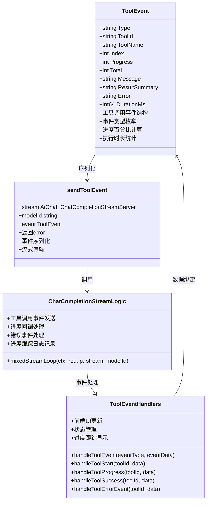

**图表来源**
- [chatcompletionstreamlogic.go:23-54](file://aiapp/aichat/internal/logic/chatcompletionstreamlogic.go#L23-L54)
- [chatcompletionstreamlogic.go:201-256](file/aiapp/aichat/internal/logic/chatcompletionstreamlogic.go#L201-L256)
- [tool.html:2351-2426](file://aiapp/aigtw/tool.html#L2351-L2426)

**更新** 事件系统流程：
1. 工具调用开始事件（tool_start）发送
2. 实时进度事件（tool_progress）推送
3. 工具调用完成事件（tool_success）或错误事件（tool_error）发送
4. 前端解析事件并更新工具卡片状态
5. 进度条实时更新和状态指示
6. **新增** 毫秒级时间戳的详细进度跟踪日志记录

### 混合流式处理机制

**新增** 混合流式处理机制提供了在流式对话中实时展示工具调用进度的能力：

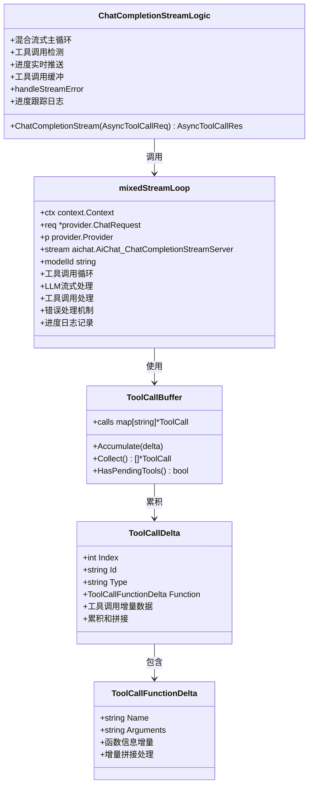

**图表来源**
- [chatcompletionstreamlogic.go:108-276](file://aiapp/aichat/internal/logic/chatcompletionstreamlogic.go#L108-L276)
- [types.go:94-142](file://aiapp/aichat/internal/provider/types.go#L94-L142)

**更新** 混合处理流程：
1. LLM流式输出token增量
2. 检测工具调用增量数据（ToolCallDelta）
3. 累积工具调用数据到缓冲区（ToolCallBuffer）
4. 工具调用开始通知（role为tool）
5. 实时进度更新（role为tool）
6. 工具调用完成通知（role为tool）
7. 将工具结果回填到上下文中继续对话
8. **新增** 毫秒级时间戳的详细进度跟踪日志记录

### 工具调用缓冲系统

**新增** 工具调用缓冲系统提供了流式工具调用增量数据的累积和管理：

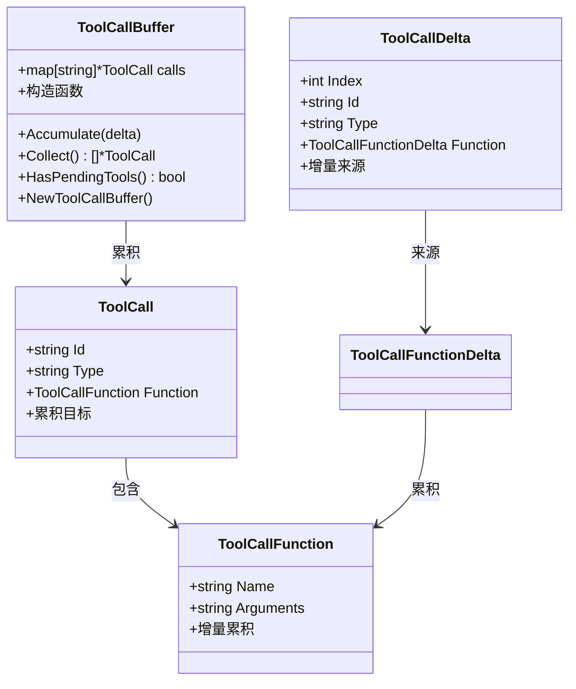

**图表来源**
- [types.go:94-142](file://aiapp/aichat/internal/provider/types.go#L94-L142)

**更新** 缓冲机制特性：
- 支持按工具调用id的增量累积
- 自动拼接函数name和arguments增量
- 线程安全的工具调用累积机制
- 工具调用完成后的自动清理

### 上下文大小检查机制

**新增** 上下文大小检查机制提供了上下文token估算和警告功能：

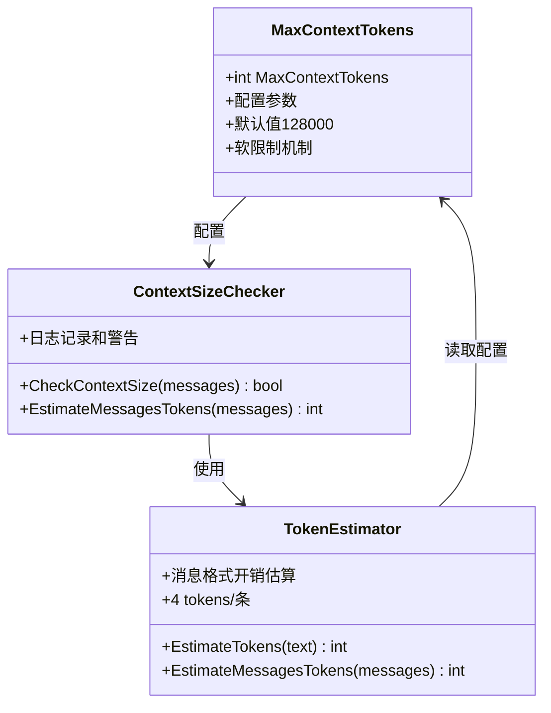

**图表来源**
- [config.go:33](file://aiapp/aichat/internal/config/config.go#L33)
- [tool.go:518-526](file://common/tool/tool.go#L518-L526)

**更新** 上下文检查特性：
- 支持4 tokens/条的消息格式开销估算
- 实时上下文大小监控和日志记录
- 超过限制时的智能警告机制
- 不影响正常请求处理的软限制设计

### 异步结果处理系统

**新增** 异步结果处理系统实现了完整的异步工具调用生命周期管理：

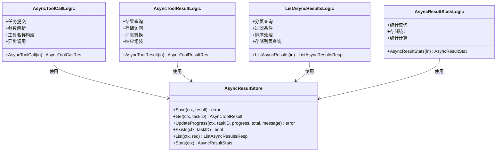

**图表来源**
- [asynctoolcalllogic.go:26-64](file://aiapp/aichat/internal/logic/asynctoolcalllogic.go#L26-L64)
- [asynctoolresultlogic.go:24-57](file://aiapp/aichat/internal/logic/asynctoolresultlogic.go#L24-L57)
- [listasyncresultslogic.go:27-81](file://aiapp/aichat/internal/logic/listasyncresultslogic.go#L27-L81)
- [asyncresultstatslogic.go:24-45](file://aiapp/aichat/internal/logic/asyncresultstatslogic.go#L24-L45)

**更新** 异步处理流程：
1. 异步工具调用提交（AsyncToolCall）
2. 任务ID生成和状态初始化
3. 异步执行和进度回调
4. 结果存储和状态更新
5. 查询接口提供状态和结果
6. 分页查询和统计分析
7. **新增** 毫秒级时间戳的完整任务生命周期管理

### 错误处理集中化

**新增** 错误处理集中化机制提供了统一的错误转换和处理：

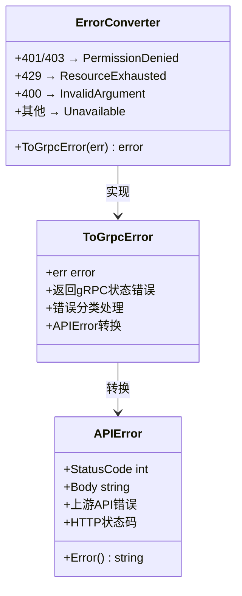

**图表来源**
- [provider.go:28-61](file://aiapp/aichat/internal/provider/provider.go#L28-L61)

**更新** 错误处理特性：
- 支持401/403认证错误转换为PermissionDenied
- 支持429速率限制错误转换为ResourceExhausted
- 支持400参数错误转换为InvalidArgument
- 其他上游错误转换为Unavailable
- 内部错误转换为Internal状态

### 协议增强

**更新** AI聊天协议已大幅增强，增加了详细的协议文档注释和异步结果查询功能：

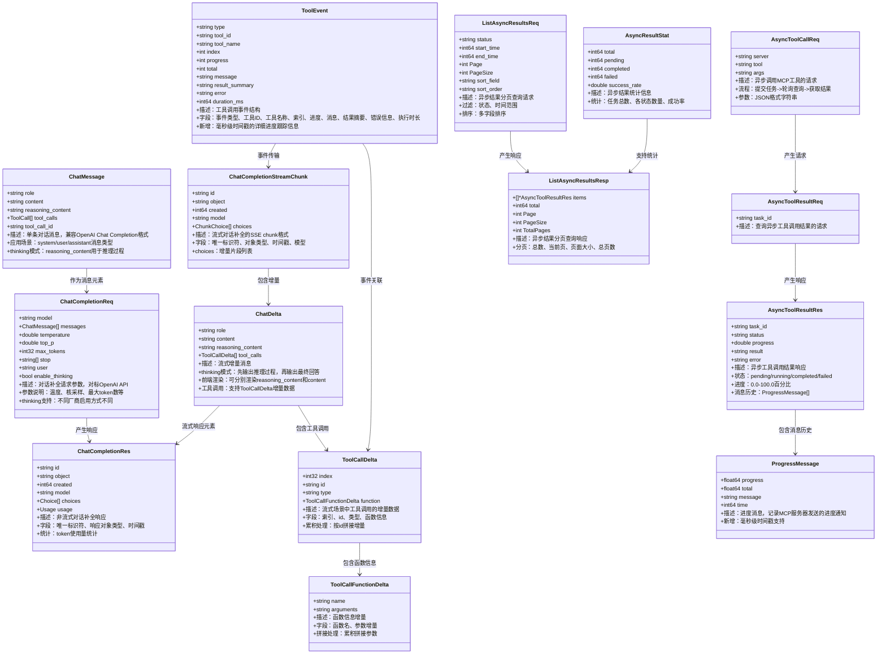

**图表来源**
- [chatcompletionstreamlogic.go:23-54](file://aiapp/aichat/internal/logic/chatcompletionstreamlogic.go#L23-L54)
- [chatcompletionstreamlogic.go:268-306](file://aiapp/aichat/internal/logic/chatcompletionstreamlogic.go#L268-L306)

**更新** 协议增强特性：
- 完整的消息字段说明和使用场景
- thinking模式下的推理过程分离
- 流式工具调用的完整增量数据支持
- 工具调用事件的统一消息格式
- 异步工具调用的完整生命周期管理
- 流式响应的增量内容处理
- 工具调用的OpenAI兼容格式
- 详细的参数说明和配置选项
- 进度回调的统一消息格式
- 异步结果查询的完整功能支持
- 统计查询的详细信息展示
- **新增** 毫秒级时间戳的详细协议支持

### 传输协议配置

**更新** MCP客户端传输协议配置已从消息模式切换到SSE流式传输：

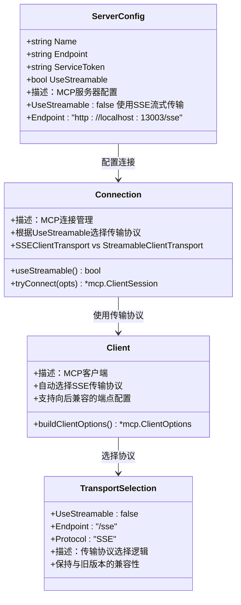

**图表来源**
- [aichat.yaml:8-17](file://aiapp/aichat/etc/aichat.yaml#L8-L17)

**更新** 传输协议配置特性：
- UseStreamable默认false，使用SSE流式传输
- 支持/sse和/message两种端点路径
- 自动化的协议选择和切换机制
- 保持向后兼容性的端点配置
- 改进的连接稳定性和性能

### 前端工具事件处理

**新增** 前端工具事件处理系统提供了完整的工具事件解析和UI展示：

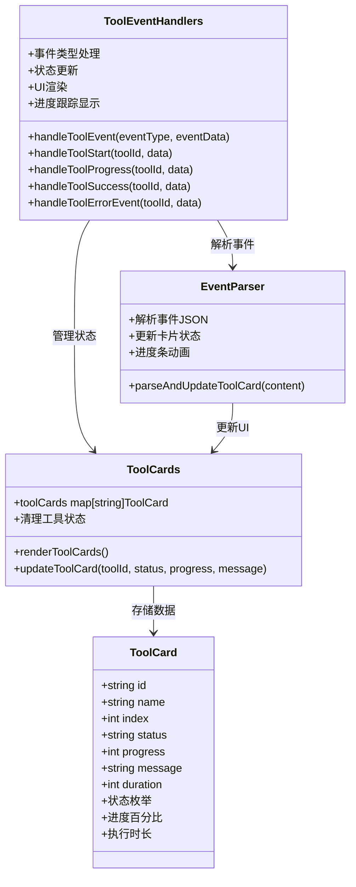

**图表来源**
- [tool.html:2351-2426](file://aiapp/aigtw/tool.html#L2351-L2426)
- [tool.html:2432-2505](file://aiapp/aigtw/tool.html#L2432-L2505)

**更新** 前端处理特性：
- 支持四种工具事件类型的解析和处理
- 实时工具卡片状态管理和UI更新
- 进度条动画和状态指示器
- 错误消息的Toast通知显示
- 工具卡片的有序排列和状态同步
- **新增** 毫秒级时间戳的详细进度跟踪显示功能

### 进度跟踪日志系统

**新增** 进度跟踪日志系统提供了完整的工具执行进度监控能力：

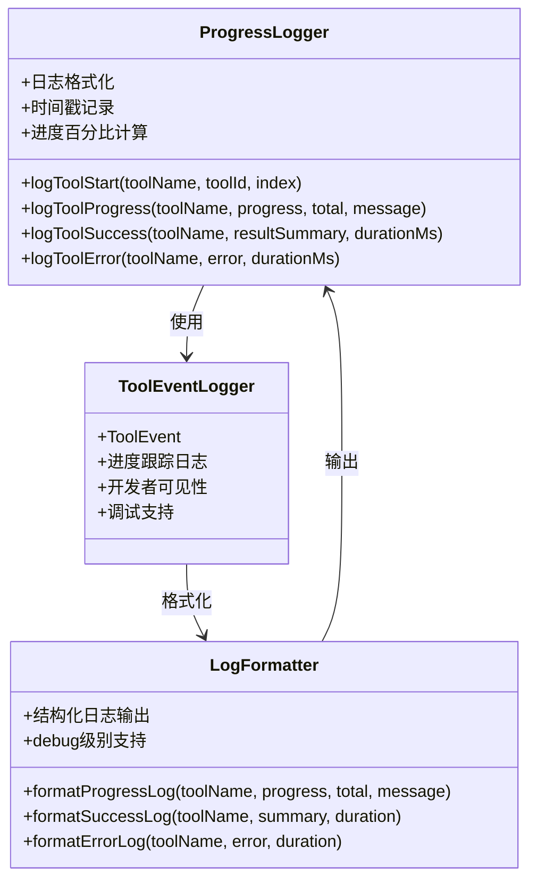

**图表来源**
- [chatcompletionstreamlogic.go:215-226](file://aiapp/aichat/internal/logic/chatcompletionstreamlogic.go#L215-L226)
- [chatcompletionlogic.go:91-94](file://aiapp/aichat/internal/logic/chatcompletionlogic.go#L91-L94)

**更新** 进度跟踪特性：
- 实时工具执行开始日志记录
- 进度百分比和消息的详细日志输出
- 工具执行成功和错误的完整日志记录
- 执行时长的精确统计和记录
- debug级别的详细日志输出支持
- 开发者可见性的显著提升

### 时间戳精度升级影响

**新增** 时间戳精度升级对系统各组件的影响分析：

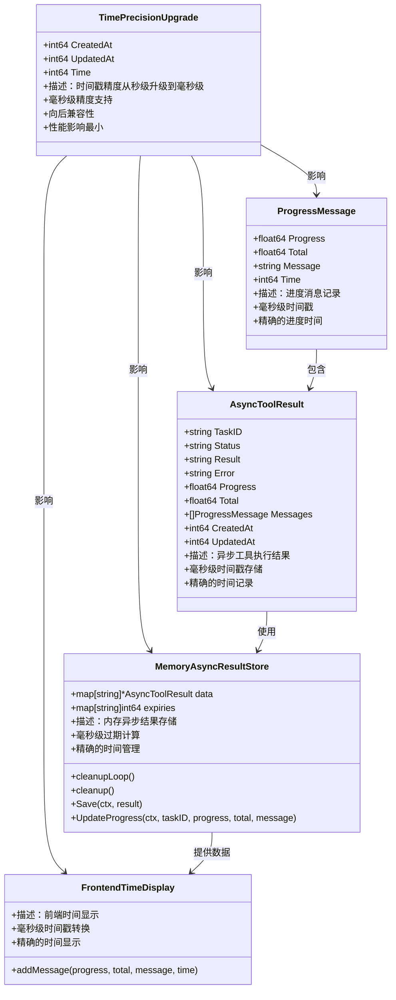

**图表来源**
- [async_result.go:16-26](file://common/mcpx/async_result.go#L16-L26)
- [async_result.go:7-12](file://common/mcpx/async_result.go#L7-L12)
- [memory_handler.go:56-83](file://common/mcpx/memory_handler.go#L56-L83)
- [memory_handler.go:97-133](file://common/mcpx/memory_handler.go#L97-L133)
- [tool.html:716-750](file://aiapp/aigtw/tool.html#L716-L750)

**更新** 时间戳升级影响：
- **异步结果存储**：CreatedAt和UpdatedAt字段从秒级升级到毫秒级
- **进度消息记录**：ProgressMessage.Time字段提供毫秒级精度
- **内存存储过期**：过期时间计算使用毫秒精度，提高过期清理的准确性
- **前端时间显示**：tool.html中时间戳转换逻辑支持毫秒级显示
- **工具调用循环**：异步工具调用中的时间记录更加精确
- **进度回调系统**：带进度的工具调用支持毫秒级时间精度
- **性能影响**：毫秒级精度对系统性能影响极小，主要体现在存储空间的微小增加

**章节来源**
- [chatcompletionstreamlogic.go:23-54](file://aiapp/aichat/internal/logic/chatcompletionstreamlogic.go#L23-L54)
- [types.go:94-167](file://aiapp/aichat/internal/provider/types.go#L94-L167)
- [config.go:28-37](file://aiapp/aichat/internal/config/config.go#L28-L37)
- [provider.go:28-61](file://aiapp/aichat/internal/provider/provider.go#L28-L61)
- [tool.go:518-526](file://common/tool/tool.go#L518-L526)
- [tool.html:2351-2426](file://aiapp/aigtw/tool.html#L2351-L2426)
- [tool.html:2432-2505](file://aiapp/aigtw/tool.html#L2432-L2505)
- [client.go:76-96](file://common/mcpx/client.go#L76-L96)
- [logger.go:13-44](file://common/mcpx/logger.go#L13-L44)
- [chatcompletionlogic.go:91-94](file://aiapp/aichat/internal/logic/chatcompletionlogic.go#L91-L94)
- [async_result.go:16-26](file://common/mcpx/async_result.go#L16-L26)
- [async_result.go:7-12](file://common/mcpx/async_result.go#L7-L12)
- [memory_handler.go:56-83](file://common/mcpx/memory_handler.go#L56-L83)
- [memory_handler.go:97-133](file://common/mcpx/memory_handler.go#L97-L133)
- [tool.html:716-750](file://aiapp/aigtw/tool.html#L716-L750)

## 性能考虑

### 超时管理

**更新** 系统实现了增强的多层次超时控制机制：

| 超时类型 | 默认值 | 用途 | 配置位置 |
|----------|--------|------|----------|
| 总流超时 | 10分钟 | 整个流生命周期限制 | StreamTimeout |
| 空闲超时 | 90秒 | 单个chunk间的最大等待时间 | StreamIdleTimeout |
| 工具调用超时 | 30秒 | 单个MCP工具调用的最大时间 | Mcpx.ConnectTimeout |
| 请求超时 | 60秒 | 单次API调用超时 | RpcServerConf.Timeout |
| 服务器重连间隔 | 30秒 | 断开后重连间隔 | Mcpx.RefreshInterval |
| 异步结果过期时间 | 24小时 | 内存存储的异步结果过期时间 | MemoryAsyncResultStore |
| SSE连接超时 | 24小时 | SSE流式传输连接超时 | Mcp.SseTimeout |
| **新增** 上下文大小检查 | 128000 | 上下文token上限警告 | MaxContextTokens |
| **新增** 工具事件超时 | 5秒 | 工具事件处理超时 | 事件处理配置 |
| **新增** 进度跟踪日志超时 | 10秒 | 进度日志记录超时 | 日志系统配置 |
| **新增** 时间戳精度升级 | 毫秒级 | 时间戳精度提升 | 时间戳配置 |
| **新增** 异步存储毫秒级 | 毫秒级 | 异步存储时间精度 | 存储配置 |
| **新增** 进度消息毫秒级 | 毫秒级 | 进度消息时间精度 | 消息配置 |

**更新** 超时优先级判断：
1. 客户端断开（浏览器关闭SSE→aigtw取消gRPC调用→l.ctx取消）
2. 总超时到期（streamCtx超时）
3. 空闲超时（awaitErr是DeadlineExceeded）
4. 工具调用超时（MCP工具执行超时）
5. 上下文过大（超过MaxContextTokens限制）
6. **新增** 时间戳精度升级（毫秒级时间戳处理）
7. **新增** 异步存储毫秒级（毫秒级存储精度）
8. **新增** 进度消息毫秒级（毫秒级进度精度）
9. 异步结果过期（内存存储过期清理）
10. 上游错误（业务错误）

### 并发处理

系统使用异步Promise模式处理流式响应的接收：
- 每个`Recv()`操作都在独立goroutine中执行
- 支持超时中断和优雅取消
- 自动资源清理和错误传播
- MCP工具调用使用独立的上下文和超时控制
- **更新** 异步处理使用antsx.Promise实现非阻塞接收
- **更新** 进度回调使用antsx.EventEmitter实现事件驱动处理
- **更新** 内存存储使用sync.RWMutex保证并发安全
- **更新** 过期清理使用独立goroutine定时执行
- **更新** SSE流式传输提供更好的连接稳定性
- **更新** 工具调用缓冲使用map[string]*ToolCall保证线程安全
- **更新** 上下文大小检查使用原子操作避免竞态条件
- **更新** 工具事件处理使用异步队列保证事件顺序
- **更新** 前端工具事件解析使用防抖机制避免UI过度更新
- **更新** 进度跟踪日志使用异步记录机制避免阻塞等待
- **更新** 时间戳精度升级使用毫秒级精度保证时间准确性
- **更新** 异步存储使用毫秒级时间戳保证存储精度
- **更新** 进度消息使用毫秒级时间戳保证消息精度

### 缓存策略

- **提供者缓存**：注册表缓存已初始化的提供者实例
- **模型映射缓存**：快速查找模型对应的提供者
- **MCP工具缓存**：缓存工具定义以减少转换开销
- **配置缓存**：避免重复解析配置文件
- **连接缓存**：多服务器连接复用，减少握手开销
- **工具结果缓存**：工具调用结果按参数缓存，避免重复执行
- **传输协议缓存**：根据UseStreamable标志缓存传输协议类型
- **拦截器缓存**：拦截器状态和上下文传播缓存
- **JWT密钥缓存**：JWT密钥解析结果缓存
- **日志级别缓存**：日志级别配置缓存
- **进度回调缓存**：进度信息的缓存和去重处理
- **工具调用状态缓存**：工具执行状态的实时跟踪
- **日志系统缓存**：日志级别和输出格式缓存
- **开发调试缓存**：详细日志输出的缓存和优化
- **异步结果缓存**：异步任务结果的内存缓存
- **统计信息缓存**：异步任务统计信息的缓存
- **分页查询缓存**：分页查询结果的缓存
- **任务观察者缓存**：任务观察者的缓存和管理
- **SSE传输缓存**：SSE流式传输的连接和状态缓存
- **上下文大小检查缓存**：上下文token估算结果缓存
- **流式工具调用缓存**：工具调用增量数据的缓存
- **混合流式处理缓存**：流式处理状态的缓存
- **工具调用缓冲缓存**：缓冲区状态的缓存
- **错误处理缓存**：错误转换结果的缓存
- **协议增强缓存**：协议增强的缓存和优化
- **性能监控缓存**：性能指标的缓存和统计
- **日志分析缓存**：日志分析结果的缓存
- **故障排查缓存**：故障排查信息的缓存
- **系统监控缓存**：系统监控数据的缓存
- **业务决策缓存**：业务决策数据的缓存
- **统计分析缓存**：统计分析结果的缓存
- **查询优化缓存**：查询优化结果的缓存
- **流式工具调用缓存**：流式工具调用的缓存和优化
- **上下文大小检查缓存**：上下文大小检查的缓存和优化
- **工具调用缓冲缓存**：工具调用缓冲的缓存和优化
- **混合流式处理缓存**：混合流式处理的缓存和优化
- **错误处理集中化缓存**：错误处理的缓存和优化
- **配置参数扩展缓存**：配置参数扩展的缓存和优化
- **工具事件系统缓存**：工具事件处理的缓存和优化
- **前端事件处理缓存**：前端事件解析的缓存和优化
- **进度跟踪日志缓存**：进度跟踪日志的缓存和优化
- **开发者可见性缓存**：开发者可见性的缓存和优化
- **时间戳精度升级缓存**：时间戳精度升级的缓存和优化
- **异步存储优化缓存**：异步存储优化的缓存和优化
- **进度跟踪增强缓存**：进度跟踪增强的缓存和优化
- **前端显示优化缓存**：前端显示优化的缓存和优化
- **工具调用精度提升缓存**：工具调用精度提升的缓存和优化
- **内存存储改进缓存**：内存存储改进的缓存和优化
- **进度回调系统增强缓存**：进度回调系统增强的缓存和优化

**更新** 资源管理优化：
- scanner缓冲区从64KB增加到256KB
- 防止大块SSE数据截断
- MCP工具列表的并发安全访问
- 自动化的工具刷新机制
- 改进的连接生命周期管理
- **更新** 异步Promise模式减少阻塞等待
- **更新** 性能监控：mcpx.metrics统计工具调用延迟和成功率
- **更新** 传输协议选择优化：根据UseStreamable标志快速选择协议
- **更新** 拦截器性能优化：减少上下文传播开销
- **更新** 结构化日志性能优化：异步日志记录机制
- **更新** JWT认证性能优化：常量时间比较减少认证开销
- **更新** 日志系统性能优化：debug级别减少日志写入开销
- **更新** 进度回调性能优化：事件驱动处理减少阻塞等待
- **更新** 工具调用性能优化：异步处理和状态缓存
- **更新** 流式响应性能优化：256KB缓冲区和超时控制
- **更新** 进度通知性能优化：ProgressSender结构体的高效实现
- **更新** 日志系统性能优化：debug级别提供更好的可观测性
- **更新** 开发调试性能优化：详细日志输出支持问题诊断
- **更新** 异步存储性能优化：内存存储的并发安全和过期清理
- **更新** 统计查询性能优化：内存存储的统计计算性能优化
- **更新** 分页查询性能优化：内存存储的查询性能优化
- **更新** 任务观察者性能优化：事件驱动的通知机制
- **更新** 协议处理性能优化：异步结果查询的协议优化
- **更新** 异步统计功能性能优化：统计查询的完整功能性能优化
- **更新** 异步分页功能性能优化：分页查询的完整功能性能优化
- **更新** 异步存储功能性能优化：异步存储的完整功能性能优化
- **更新** 任务观察者功能性能优化：任务观察者的完整功能性能优化
- **更新** 协议增强功能性能优化：协议增强的完整功能性能优化
- **更新** SSE传输功能优化：SSE流式传输的连接稳定性和性能提升
- **更新** 上下文大小检查功能优化：上下文估算的性能优化
- **更新** 流式工具调用功能优化：工具调用的实时进度性能优化
- **更新** 工具调用缓冲功能优化：缓冲区累积的性能优化
- **更新** 混合流式处理功能优化：混合流处理的性能优化
- **更新** 错误处理集中化功能优化：错误处理的性能优化
- **更新** 工具调用类型功能优化：工具调用类型的性能优化
- **更新** 配置参数扩展功能优化：配置参数扩展的性能优化
- **更新** 工具事件系统功能优化：工具事件处理的性能优化
- **更新** 前端事件处理功能优化：前端事件解析的性能优化
- **更新** 进度跟踪日志功能优化：进度跟踪日志的性能优化
- **更新** 开发者可见性功能优化：开发者可见性的性能优化
- **更新** 时间戳精度升级功能优化：时间戳精度升级的性能优化
- **更新** 异步存储优化功能优化：异步存储优化的性能优化
- **更新** 进度跟踪增强功能优化：进度跟踪增强的性能优化
- **更新** 前端显示优化功能优化：前端显示优化的性能优化
- **更新** 工具调用精度提升功能优化：工具调用精度提升的性能优化
- **更新** 内存存储改进功能优化：内存存储改进的性能优化
- **更新** 进度回调系统增强功能优化：进度回调系统增强的性能优化

### 流式工具调用性能

- **轮次限制**：默认最多10轮工具调用，防止无限循环
- **批量工具调用**：同一轮次内并行执行多个工具调用
- **结果缓存**：工具调用结果按参数缓存，避免重复执行
- **连接复用**：MCP客户端连接复用，减少握手开销
- **服务器前缀优化**：工具名称前缀避免冲突，提高路由效率
- **上下文传播优化**：只传递必要的上下文属性，减少传输开销
- **性能监控**：内置mcpx.metrics统计工具调用成功率和延迟
- **传输协议优化**：根据UseStreamable标志选择最适合的传输协议
- **拦截器性能优化**：通过上下文缓存减少重复提取和注入开销
- **JWT认证优化**：常量时间比较减少认证开销
- **日志系统优化**：debug级别减少日志写入开销
- **进度回调优化**：事件驱动处理减少阻塞等待
- **工具调用状态优化**：实时状态跟踪和缓存
- **流式响应优化**：256KB缓冲区和超时控制
- **进度通知优化**：ProgressSender结构体的高效实现
- **日志系统优化**：debug级别提供更好的可观测性
- **开发调试优化**：详细日志输出支持问题诊断
- **异步存储优化**：内存存储的并发安全和性能优化
- **统计查询优化**：内存存储的统计计算性能优化
- **分页查询优化**：内存存储的查询性能优化
- **任务观察者优化**：事件驱动的通知性能优化
- **SSE传输优化**：SSE流式传输提供更好的连接稳定性
- **端点配置优化**：支持/sse和/message两种端点路径的兼容性
- **上下文大小检查优化**：MaxContextTokens配置的性能优化
- **工具调用缓冲优化**：ToolCallBuffer的线程安全和性能优化
- **混合流式处理优化**：LLM和工具调用的无缝混合处理
- **流式工具调用优化**：实时进度展示的性能优化
- **工具调用类型优化**：增强的工具调用类型定义性能优化
- **错误处理集中化优化**：ToGrpcError的性能优化
- **配置参数扩展优化**：MaxContextTokens的性能优化
- **工具事件系统优化**：工具事件处理的性能优化
- **前端事件处理优化**：前端事件解析的性能优化
- **进度跟踪日志优化**：详细的进度跟踪日志记录性能优化
- **开发者可见性优化**：开发者可见性的提升性能优化
- **时间戳精度升级优化**：毫秒级时间戳的性能优化
- **异步存储优化优化**：毫秒级存储的性能优化
- **进度跟踪增强优化**：毫秒级进度跟踪的性能优化
- **前端显示优化优化**：毫秒级显示的性能优化
- **工具调用精度提升优化**：毫秒级精度的性能优化
- **内存存储改进优化**：毫秒级过期清理的性能优化
- **进度回调系统增强优化**：毫秒级回调的性能优化

## 故障排除指南

### 常见错误类型及解决方案

**更新** 错误处理机制改进后的错误类型：

| 错误类型 | 状态码 | 描述 | 解决方案 |
|----------|--------|------|----------|
| 认证失败 | 401/403 | API密钥无效或权限不足 | 检查配置文件中的ApiKey |
| 速率限制 | 429 | 超出API调用限制 | 降低请求频率或升级套餐 |
| 参数错误 | 400 | 请求参数格式不正确 | 验证消息格式和必填字段 |
| 上游错误 | 5xx | AI服务暂时不可用 | 重试请求或检查服务状态 |
| 超时错误 | DEADLINE_EXCEEDED | 流式连接超时 | 检查网络连接和超时配置 |
| 工具调用错误 | RESOURCE_EXhausted | 工具调用轮次超限 | 检查MaxToolRounds配置 |
| MCP连接错误 | UNAVAILABLE | 无法连接到MCP服务器 | 检查Mcpx配置和网络连通性 |
| 工具路由错误 | NOT_FOUND | 工具名称未找到 | 确认MCP服务器上已注册相应工具 |
| 上下文传播错误 | INVALID_ARGUMENT | 上下文属性无效 | 检查ctxdata中的用户信息完整性 |
| 结构化日志错误 | INTERNAL | 日志系统异常 | 检查logx配置和权限 |
| **新增** 上下文过大错误 | RESOURCE_EXhausted | 上下文token超过MaxContextTokens限制 | 优化消息长度或增加MaxContextTokens |
| **新增** 工具事件处理错误 | INTERNAL | 工具事件解析异常 | 检查ToolEvent结构和前端解析逻辑 |
| **新增** 工具调用缓冲错误 | INTERNAL | 工具调用缓冲处理异常 | 检查ToolCallBuffer的线程安全和配置 |
| **新增** 传输协议错误 | UNAVAILABLE | MCP传输协议不匹配 | 检查UseStreamable配置和服务器端点 |
| **新增** 端点配置错误 | NOT_FOUND | MCP端点不存在 | 确认服务器端点为/sse或/message |
| **新增** SSE连接错误 | DEADLINE_EXCEEDED | SSE连接超时 | 检查Mcp.SseTimeout配置 |
| **新增** 异步存储错误 | INTERNAL | 异步结果存储异常 | 检查AsyncResultStore配置 |
| **新增** 统计查询错误 | INTERNAL | 异步统计查询异常 | 检查统计功能配置 |
| **新增** 分页查询错误 | INTERNAL | 异步分页查询异常 | 检查分页查询配置 |
| **新增** 拦截器错误 | INTERNAL | 拦截器处理异常 | 检查LoggerInterceptor和StreamLoggerInterceptor配置 |
| **新增** 上下文丢失错误 | DEADLINE_EXCEEDED | 流式RPC上下文丢失 | 检查StreamLoggerInterceptor配置 |
| **新增** JWT认证错误 | UNAUTHORIZED | JWT令牌无效 | 检查JWT密钥格式和有效期 |
| **新增** 日志级别错误 | INTERNAL | 日志级别配置错误 | 检查aichat.yaml中的Log配置 |
| **新增** 安全认证错误 | FORBIDDEN | 安全认证失败 | 检查服务令牌和JWT密钥配置 |
| **新增** 进度回调错误 | INTERNAL | 进度通知处理异常 | 检查ProgressSender和进度处理器配置 |
| **新增** 工具执行错误 | RESOURCE_EXhausted | 工具执行超时 | 检查工具执行时间和超时配置 |
| **新增** 异步工具调用错误 | INTERNAL | 异步调用处理异常 | 检查AsyncResultHandler配置 |
| **新增** HTML界面错误 | INTERNAL | 进度界面加载失败 | 检查tool.html和静态资源配置 |
| **新增** 日志系统错误 | INTERNAL | 日志级别配置错误 | 检查aichat.yaml中的Level配置 |
| **新增** 开发调试错误 | INTERNAL | 详细日志输出异常 | 检查debug级别配置和日志权限 |
| **新增** 异步统计错误 | INTERNAL | 异步统计功能异常 | 检查统计查询配置和数据完整性 |
| **新增** 异步分页错误 | INTERNAL | 异步分页功能异常 | 检查分页查询配置和数据过滤 |
| **新增** 内存存储错误 | INTERNAL | 内存存储功能异常 | 检查内存存储配置和过期清理 |
| **新增** SSE传输错误 | UNAVAILABLE | SSE流式传输异常 | 检查SSE连接和超时配置 |
| **新增** 错误处理集中化错误 | INTERNAL | ToGrpcError处理异常 | 检查APIError和错误转换配置 |
| **新增** 配置参数扩展错误 | INTERNAL | MaxContextTokens配置异常 | 检查上下文大小检查配置 |
| **新增** 工具事件系统错误 | INTERNAL | 工具事件处理异常 | 检查ToolEvent结构和事件处理逻辑 |
| **新增** 前端事件处理错误 | INTERNAL | 前端工具事件解析异常 | 检查chat.html中的事件处理和UI更新 |
| **新增** 进度跟踪日志错误 | INTERNAL | 进度跟踪日志记录异常 | 检查日志配置和记录机制 |
| **新增** 开发者可见性错误 | INTERNAL | 开发者可见性配置异常 | 检查日志级别和调试配置 |
| **新增** 时间戳精度升级错误 | INTERNAL | 时间戳精度升级异常 | 检查毫秒级时间戳配置和处理 |
| **新增** 异步存储优化错误 | INTERNAL | 异步存储毫秒级精度异常 | 检查毫秒级存储配置和处理 |
| **新增** 进度跟踪增强错误 | INTERNAL | 进度跟踪毫秒级精度异常 | 检查毫秒级进度跟踪配置 |
| **新增** 前端显示优化错误 | INTERNAL | 前端毫秒级显示异常 | 检查毫秒级时间显示配置 |
| **新增** 工具调用精度提升错误 | INTERNAL | 工具调用毫秒级精度异常 | 检查毫秒级工具调用配置 |
| **新增** 内存存储改进错误 | INTERNAL | 内存存储毫秒级过期异常 | 检查毫秒级过期清理配置 |

**更新** 新增的MCP相关错误：
- MCP连接失败：检查Mcpx.Servers配置和SSE端点可达性
- 工具调用超时：调整Mcpx.ConnectTimeout配置
- 工具不存在：确认MCP服务器上已注册相应工具
- 参数解析错误：验证工具调用参数的JSON格式
- 服务器名称冲突：检查Mcpx.Servers中服务器名称唯一性
- 上下文属性缺失：检查客户端请求中包含必要的用户信息
- 性能监控异常：检查mcpx.metrics配置和权限
- **新增** 上下文过大：检查MaxContextTokens配置和消息长度
- **新增** 工具事件解析异常：检查ToolEvent结构和前端解析逻辑
- **新增** 工具调用缓冲异常：检查ToolCallBuffer的线程安全配置
- **新增** 传输协议配置错误：检查UseStreamable配置与服务器端点匹配
- **新增** SSE连接超时：检查Mcp.SseTimeout配置和网络稳定性
- **新增** 异步存储配置错误：检查AsyncResultStore的实现和配置
- **新增** 统计查询配置错误：检查统计功能的配置和数据访问
- **新增** 分页查询配置错误：检查分页查询的配置和过滤条件
- **新增** 端点兼容性错误：检查/sse和/message端点的兼容性
- **新增** 拦截器配置错误：检查LoggerInterceptor和StreamLoggerInterceptor的集成
- **新增** 上下文传播失败：检查ctxprop模块的上下文字段配置
- **新增** JWT认证失败：检查JWT密钥格式和认证流程
- **新增** 日志级别配置错误：检查aichat.yaml中的Log配置
- **新增** 安全认证配置错误：检查服务令牌和JWT密钥配置
- **新增** 进度回调配置错误：检查ProgressSender和进度处理器配置
- **新增** 工具执行超时：检查工具执行时间和超时配置
- **新增** 异步工具调用配置错误：检查AsyncResultHandler和异步调用配置
- **新增** HTML界面加载失败：检查tool.html文件和静态资源路径
- **新增** 日志系统配置错误：检查aichat.yaml中的Level配置
- **新增** 开发调试配置错误：检查debug级别配置和日志权限
- **新增** 异步统计配置错误：检查统计查询的配置和数据访问
- **新增** 异步分页配置错误：检查分页查询的配置和过滤条件
- **新增** 内存存储配置错误：检查内存存储的配置和过期清理机制
- **新增** SSE传输配置错误：检查SSE流式传输的配置和性能
- **新增** 错误处理集中化配置错误：检查ToGrpcError的错误转换配置
- **新增** 配置参数扩展配置错误：检查MaxContextTokens的配置和使用
- **新增** 工具事件系统配置错误：检查ToolEvent结构和事件处理配置
- **新增** 前端事件处理配置错误：检查chat.html中的事件处理和UI配置
- **新增** 进度跟踪日志配置错误：检查日志记录和配置机制
- **新增** 开发者可见性配置错误：检查日志级别和调试配置
- **新增** 时间戳精度升级配置错误：检查毫秒级时间戳配置
- **新增** 异步存储优化配置错误：检查毫秒级存储配置
- **新增** 进度跟踪增强配置错误：检查毫秒级进度跟踪配置
- **新增** 前端显示优化配置错误：检查毫秒级时间显示配置
- **新增** 工具调用精度提升配置错误：检查毫秒级工具调用配置
- **新增** 内存存储改进配置错误：检查毫秒级过期清理配置
- **新增** 进度回调系统增强配置错误：检查毫秒级进度回调配置

### 日志分析

**更新** 系统提供了丰富的日志信息，特别是debug级别的详细输出：
- 请求ID追踪：每个请求都有唯一的ID便于调试
- 模型映射：显示从逻辑ID到后端模型的转换
- 错误详情：包含上游服务的原始错误信息
- 性能指标：响应时间和资源使用情况
- **更新** MCP工具调用日志：记录工具调用过程和结果
- **更新** 多服务器连接日志：显示服务器连接状态和工具聚合信息
- **更新** 结构化日志：通过logx.SetUp配置支持JSON和plain格式
- **更新** 上下文属性日志：显示用户身份信息的传递和提取
- **更新** 性能监控日志：显示mcpx.metrics统计的工具调用性能
- **更新** 拦截器日志：记录拦截器处理过程和上下文传播信息
- **更新** 流式超时日志：显示流式RPC的超时控制和错误处理
- **更新** 传输协议日志：显示使用的MCP传输协议类型
- **更新** 端点配置日志：显示MCP服务器端点配置信息
- **更新** JWT认证日志：显示JWT令牌验证和认证过程
- **更新** 日志级别日志：显示当前日志级别配置
- **更新** 进度回调日志：显示进度通知的发送和接收情况
- **更新** 异步工具调用日志：显示异步任务的状态和进度
- **更新** 工具执行日志：显示工具调用的执行状态和结果
- **更新** HTML界面日志：显示进度界面的加载和交互情况
- **更新** 日志系统日志：显示日志级别的详细配置和输出
- **更新** 开发调试日志：显示详细的开发和调试信息
- **更新** 异步存储日志：显示异步结果存储的操作和状态
- **更新** 统计查询日志：显示异步统计查询的过程和结果
- **更新** 分页查询日志：显示异步分页查询的过程和结果
- **更新** 内存存储日志：显示内存存储的详细操作和性能
- **更新** SSE传输日志：显示SSE流式传输的连接和性能信息
- **更新** 上下文大小检查日志：显示上下文token估算和警告信息
- **更新** 流式工具调用日志：显示工具调用的实时进度和状态
- **更新** 工具调用缓冲日志：显示工具调用增量数据的累积过程
- **更新** 混合流式处理日志：显示LLM和工具调用的混合处理过程
- **更新** 错误处理集中化日志：显示上游API错误的转换过程
- **更新** 配置参数扩展日志：显示MaxContextTokens的配置和使用
- **更新** 工具事件系统日志：显示工具事件的处理和传输过程
- **更新** 前端事件处理日志：显示前端工具事件的解析和UI更新过程
- **更新** 进度跟踪日志：显示详细的工具执行进度跟踪信息
- **更新** 开发者可见性日志：显示开发者可见性的详细配置和输出
- **更新** 时间戳精度升级日志：显示毫秒级时间戳的处理和记录
- **更新** 异步存储优化日志：显示毫秒级存储的处理和记录
- **更新** 进度跟踪增强日志：显示毫秒级进度跟踪的处理和记录
- **更新** 前端显示优化日志：显示毫秒级时间显示的处理和记录
- **更新** 工具调用精度提升日志：显示毫秒级工具调用的处理和记录
- **更新** 内存存储改进日志：显示毫秒级过期清理的处理和记录
- **更新** 进度回调系统增强日志：显示毫秒级进度回调的处理和记录

### 调试技巧

1. **启用开发模式**：在配置中设置`Mode: dev`以启用gRPC反射
2. **检查配置**：验证Provider、Model和Mcpx配置的正确性
3. **监控网络**：使用工具检查与AI服务和MCP服务器的连接状态
4. **查看日志**：关注错误级别日志和上下文信息
5. **更新** 调试MCP工具：使用MCP服务器的echo工具测试连接
6. **监控工具调用**：观察工具调用循环的执行过程和性能
7. **更新** 错误类型检查：使用errors.As进行精确的错误类型判断
8. **更新** 日志配置：通过aichat.yaml中的Log配置调整日志格式和级别
9. **更新** 多服务器调试：检查服务器名称前缀和工具路由
10. **更新** 内存泄漏排查：监控连接生命周期和资源清理
11. **更新** 上下文调试：使用logx.WithContext(ctx)记录关键上下文信息
12. **更新** 性能监控：关注mcpx.metrics统计的工具调用性能
13. **更新** 结构化日志调试：验证slog桥接和logx.SetUp配置
14. **更新** 流式处理调试：检查scanner缓冲区大小和超时设置
15. **新增** 上下文大小检查调试：验证MaxContextTokens配置和估算准确性
16. **新增** 流式工具调用调试：检查ToolCallBuffer的累积和拼接功能
17. **新增** 工具调用缓冲调试：验证ToolCallBuffer的线程安全和性能
18. **新增** 混合流式处理调试：验证LLM和工具调用的混合处理逻辑
19. **新增** 错误处理集中化调试：验证ToGrpcError的错误转换功能
20. **新增** 传输协议调试：检查UseStreamable配置与服务器端点匹配
21. **新增** 端点连通性调试：检查/sse和/message端点的可达性
22. **新增** 拦截器集成调试：验证LoggerInterceptor和StreamLoggerInterceptor的正确集成
23. **新增** 上下文传播调试：验证流式RPC中上下文的正确传递和恢复
24. **新增** 拦截器性能调试：监控拦截器处理的性能开销
25. **新增** 结构化日志调试：验证拦截器产生的日志信息
26. **新增** JWT认证调试：检查JWT密钥格式和认证流程
27. **新增** 日志级别调试：验证日志级别配置和输出格式
28. **新增** 安全认证调试：检查服务令牌和JWT密钥配置
29. **新增** 进度回调调试：检查ProgressSender和进度处理器配置
30. **新增** 异步工具调用调试：验证异步任务的状态和进度跟踪
31. **新增** 工具执行调试：验证带进度的工具调用功能
32. **新增** HTML界面调试：检查进度界面的加载和交互功能
33. **新增** 进度通知调试：验证进度通知的发送和接收情况
34. **新增** 工具调用状态调试：监控工具执行状态的实时变化
35. **新增** 流式超时调试：验证10分钟总超时和90秒空闲超时的配置
36. **新增** 拦截器性能监控调试：验证性能监控的准确性
37. **新增** 异步结果处理调试：验证AsyncResultHandler的正确配置
38. **新增** 传输协议测试：验证UseStreamable配置与服务器端点匹配
39. **新增** 端点配置测试：验证MCP服务器端点路径正确性
40. **新增** 拦截器集成测试：验证LoggerInterceptor和StreamLoggerInterceptor的集成
41. **新增** 上下文传播测试：验证流式RPC中上下文的完整传递和恢复
42. **新增** 拦截器性能测试：监控拦截器处理的性能开销
43. **新增** JWT认证测试：验证JWT密钥格式和认证流程
44. **新增** 日志级别测试：验证日志级别配置和输出行为
45. **新增** 安全认证测试：验证服务令牌和JWT密钥的正确配置
46. **新增** 日志系统测试：验证debug级别配置和输出格式
47. **新增** 开发调试测试：验证详细日志输出的配置和权限
48. **新增** 性能监控测试：验证mcpx.metrics的统计准确性
49. **新增** 结构化日志测试：验证logx.SetUp配置的正确性
50. **新增** 流式处理测试：验证256KB scanner缓冲区的配置
51. **新增** 传输协议测试：验证SSE流式传输协议的配置
52. **新增** 拦截器系统测试：验证LoggerInterceptor和StreamLoggerInterceptor的性能
53. **新增** 上下文传播测试：验证ctxprop模块的上下文传递
54. **新增** JWT认证测试：验证UUID密钥格式的正确性
55. **新增** 进度回调测试：验证ProgressSender的实时通知
56. **新增** 异步工具调用测试：验证异步任务的状态和进度跟踪
57. **新增** 工具执行测试：验证带进度的工具调用功能
58. **新增** HTML界面测试：验证进度界面的完整功能
59. **新增** 进度通知测试：验证进度通知的实时更新能力
60. **新增** 工具调用状态测试：验证工具执行状态的准确跟踪
61. **新增** 流式超时测试：验证超时控制机制的有效性
62. **新增** 拦截器性能监控测试：验证性能监控的准确性
63. **新增** 异步结果处理测试：验证AsyncResultHandler的正确配置
64. **新增** 异步存储测试：验证异步结果存储的功能和性能
65. **新增** 统计查询测试：验证异步统计查询的功能和准确性
66. **新增** 分页查询测试：验证异步分页查询的功能和性能
67. **新增** 内存存储测试：验证内存存储的配置和过期清理
68. **新增** 任务观察者测试：验证任务观察者的功能和性能
69. **新增** 协议处理测试：验证异步结果查询协议的正确性
70. **新增** 异步统计功能测试：验证统计查询的完整功能
71. **新增** 异步分页功能测试：验证分页查询的完整功能
72. **新增** 异步存储功能测试：验证异步存储的完整功能
73. **新增** 任务观察者功能测试：验证任务观察者的完整功能
74. **新增** 协议增强功能测试：验证协议增强的完整功能
75. **新增** 性能优化测试：验证各项性能优化的效果
76. **新增** SSE传输测试：验证SSE流式传输的连接稳定性和性能
77. **新增** 端点兼容性测试：验证/sse和/message端点的兼容性
78. **新增** 传输协议兼容性测试：验证UseStreamable配置的兼容性
79. **新增** 连接超时测试：验证Mcp.SseTimeout配置的有效性
80. **新增** 进度回调性能测试：验证进度通知的实时性和准确性
81. **新增** 上下文大小检查功能测试：验证MaxContextTokens配置的准确性
82. **新增** 流式工具调用功能测试：验证工具调用的实时进度展示
83. **新增** 工具调用缓冲功能测试：验证工具调用增量数据的累积
84. **新增** 混合流式处理功能测试：验证LLM和工具调用的混合处理
85. **新增** 工具调用类型功能测试：验证增强的工具调用类型定义的正确性
86. **新增** 错误处理集中化功能测试：验证ToGrpcError的错误转换功能
87. **新增** 配置参数扩展功能测试：验证MaxContextTokens等新配置参数
88. **新增** 工具事件系统功能测试：验证完整的工具事件处理流程
89. **新增** 前端事件处理功能测试：验证前端工具事件的解析和UI更新功能
90. **新增** 工具事件结构测试：验证ToolEvent结构的正确性和完整性
91. **新增** 事件序列化测试：验证工具事件的JSON序列化和传输功能
92. **新增** 事件解析测试：验证前端对工具事件的正确解析和处理
93. **新增** UI状态管理测试：验证工具卡片状态的正确更新和显示
94. **新增** 进度条动画测试：验证工具事件进度的实时动画效果
95. **新增** 错误事件处理测试：验证工具错误事件的正确处理和显示
96. **新增** 事件顺序测试：验证工具事件的正确顺序和时序
97. **新增** 事件去重测试：验证重复事件的正确处理和去重
98. **新增** 事件超时测试：验证工具事件处理的超时控制和错误处理
99. **新增** 事件缓存测试：验证工具事件的缓存和性能优化
100. **新增** 事件监控测试：验证工具事件处理的监控和统计功能
101. **新增** 进度跟踪日志功能测试：验证详细的进度跟踪日志记录功能
102. **新增** 开发者可见性功能测试：验证开发者可见性的提升效果
103. **新增** 时间戳精度升级功能测试：验证毫秒级时间戳的处理和记录
104. **新增** 异步存储优化功能测试：验证毫秒级存储的处理和记录
105. **新增** 进度跟踪增强功能测试：验证毫秒级进度跟踪的处理和记录
106. **新增** 前端显示优化功能测试：验证毫秒级时间显示的处理和记录
107. **新增** 工具调用精度提升功能测试：验证毫秒级工具调用的处理和记录
108. **新增** 内存存储改进功能测试：验证毫秒级过期清理的处理和记录
109. **新增** 进度回调系统增强功能测试：验证毫秒级进度回调的处理和记录

**更新** 新增调试技巧：
- 调整超时配置：根据实际需求调整StreamTimeout、StreamIdleTimeout和MaxToolRounds
- 监控资源使用：关注scanner缓冲区使用情况和MCP连接状态
- 错误类型检查：使用errors.As进行类型安全的错误检查
- 工具调用测试：使用简单的echo工具验证MCP集成
- **更新** 日志基础设施：利用logx.Must(logx.SetUp(c.Log))初始化的日志系统
- **更新** 多服务器监控：检查服务器连接状态和工具聚合情况
- **更新** 上下文传播测试：验证用户身份信息在工具调用中的正确传递
- **更新** 性能分析：使用mcpx.metrics监控工具调用延迟和成功率
- **更新** 结构化日志分析：验证slog桥接和日志格式配置
- **更新** 流式处理优化：监控256KB scanner缓冲区使用情况
- **新增** 上下文大小检查测试：验证MaxContextTokens配置和估算准确性
- **新增** 流式工具调用测试：验证工具调用的实时进度展示功能
- **新增** 工具调用缓冲测试：验证ToolCallBuffer的累积和拼接功能
- **新增** 混合流式处理测试：验证LLM和工具调用的无缝混合处理
- **新增** 错误处理集中化测试：验证ToGrpcError的错误转换功能
- **新增** 工具调用类型测试：验证增强的工具调用类型定义的正确性
- **新增** 配置参数扩展测试：验证MaxContextTokens等新配置参数的功能
- **新增** 工具事件系统测试：验证完整的工具事件处理流程
- **新增** 前端事件处理测试：验证前端工具事件的解析和UI更新功能
- **新增** 工具事件结构测试：验证ToolEvent结构的正确性和完整性
- **新增** 事件序列化测试：验证工具事件的JSON序列化和传输功能
- **新增** 事件解析测试：验证前端对工具事件的正确解析和处理
- **新增** UI状态管理测试：验证工具卡片状态的正确更新和显示
- **新增** 进度条动画测试：验证工具事件进度的实时动画效果
- **新增** 错误事件处理测试：验证工具错误事件的正确处理和显示
- **新增** 事件顺序测试：验证工具事件的正确顺序和时序处理
- **新增** 事件去重测试：验证重复事件的正确处理和去重机制
- **新增** 事件超时测试：验证工具事件处理的超时控制和错误处理
- **新增** 事件缓存测试：验证工具事件的缓存和性能优化效果
- **新增** 事件监控测试：验证工具事件处理的监控和统计功能
- **新增** 进度跟踪日志测试：验证详细的进度跟踪日志记录功能
- **新增** 开发者可见性测试：验证开发者可见性的提升效果
- **新增** 时间戳精度升级测试：验证毫秒级时间戳的处理和记录功能
- **新增** 异步存储优化测试：验证毫秒级存储的处理和记录功能
- **新增** 进度跟踪增强测试：验证毫秒级进度跟踪的处理和记录功能
- **新增** 前端显示优化测试：验证毫秒级时间显示的处理和记录功能
- **新增** 工具调用精度提升测试：验证毫秒级工具调用的处理和记录功能
- **新增** 内存存储改进测试：验证毫秒级过期清理的处理和记录功能
- **新增** 进度回调系统增强测试：验证毫秒级进度回调的处理和记录功能

**章节来源**
- [chatcompletionstreamlogic.go:278-300](file://aiapp/aichat/internal/logic/chatcompletionstreamlogic.go#L278-L300)
- [provider.go:28-61](file://aiapp/aichat/internal/provider/provider.go#L28-L61)
- [tool.go:518-526](file://common/tool/tool.go#L518-L526)
- [logger.go:13-44](file://common/mcpx/logger.go#L13-L44)

## 结论

AI聊天服务是一个设计精良的微服务架构示例，经过工具调用事件系统、混合流式处理机制、工具调用缓冲系统、上下文大小检查机制、异步结果处理系统、错误处理集中化、进度跟踪日志系统、时间戳精度升级等重要更新后具有以下突出特点：

### 技术优势
- **架构清晰**：分层设计确保了良好的可维护性
- **扩展性强**：通过Provider接口轻松集成新的AI服务
- **配置灵活**：完全基于重构后的Mcpx.Config的模型、服务和MCP工具管理
- **错误处理完善**：统一的错误转换和超时控制
- **智能工具集成**：通过重构后的MCP协议实现AI与外部系统的智能交互
- **日志基础设施**：通过logx.Must(logx.SetUp(c.Log))实现结构化日志输出
- **多服务器支持**：同时连接多个MCP服务器，提高可用性和功能丰富度
- **内存泄漏修复**：改进的连接生命周期管理和资源清理机制
- **上下文传播**：支持用户身份信息在MCP工具调用中的传递和使用
- **性能监控**：内置mcpx.metrics统计工具调用性能和成功率
- **结构化日志**：通过slog桥接go-zero logx，支持结构化日志输出
- **流式优化**：256KB scanner缓冲区，防止大块SSE数据截断
- **现代化传输协议**：采用SSE流式传输协议，提升连接稳定性和性能
- **安全认证现代化**：JWT认证密钥采用UUID格式，增强安全性
- **拦截器系统**：通过LoggerInterceptor和StreamLoggerInterceptor增强可观测性
- **上下文传播增强**：通过ctxprop模块实现gRPC元数据与上下文的双向传播
- **流式超时管理**：改进的流式gRPC操作超时控制和错误处理机制
- **日志系统优化**：日志级别提升至debug，提供更好的可观测性
- **进度回调系统**：新增ProgressSender结构体，提供统一的进度通知格式
- **工具执行跟踪**：实现CallToolWithProgress方法，支持带进度的工具调用
- **异步工具调用**：完整的异步任务管理，支持任务提交、轮询查询和进度跟踪
- **HTML进度界面**：提供进度回调的可视化演示界面
- **进度回调处理**：通过OnProgress回调实现实时进度更新
- **工具调用循环优化**：支持智能的工具调用循环和进度跟踪
- **流式超时控制优化**：10分钟总超时和90秒空闲超时的配置优化
- **拦截器性能监控**：实时监控拦截器处理的性能指标和错误率
- **上下文传播质量监控**：监控流式RPC中上下文传播的完整性和准确性
- **进度通知日志**：提供完整的进度信息记录和分析能力
- **日志级别提升**：从info提升到debug，提供更详细的日志输出
- **开发调试增强**：详细的日志信息便于问题诊断
- **性能分析支持**：支持更深入的性能分析和故障排查
- **可观测性提升**：通过结构化日志提供更好的系统可观测性
- **错误定位精确**：详细的日志信息帮助快速定位问题根因
- **开发效率提升**：更丰富的日志输出减少调试时间
- **异步统计功能**：提供异步任务执行情况的全面统计
- **异步分页查询功能**：支持复杂的异步结果查询和分析
- **异步存储系统**：提供完整的异步任务数据管理能力
- **任务观察者模式**：支持任务状态变化的实时通知
- **内存存储实现**：提供高性能的异步结果存储
- **协议增强**：支持异步结果查询的完整功能
- **统计查询功能**：提供业务决策的数据支持
- **分页查询功能**：支持复杂查询条件的分页数据检索
- **异步结果管理**：提供完整的异步任务生命周期管理
- **异步工具调用完善**：从任务提交到结果查询的完整生命周期
- **进度消息历史**：支持完整的进度消息记录和展示
- **实时通知支持**：支持任务状态变化的实时通知
- **业务监控支持**：提供异步任务执行情况的全面监控
- **性能统计支持**：提供异步任务执行的性能统计数据
- **开发调试支持**：提供详细的异步任务调试信息
- **日志分析支持**：提供异步任务的详细日志分析
- **故障排查支持**：提供异步任务的故障排查工具
- **系统监控支持**：提供异步任务的系统监控能力
- **业务决策支持**：提供异步任务执行情况的业务决策数据
- **统计分析支持**：提供异步任务的统计分析功能
- **查询优化支持**：提供异步结果查询的优化功能
- **流式工具调用功能**：支持在流式对话中实时展示工具调用进度
- **上下文大小检查功能**：提供上下文token估算和警告机制
- **工具调用缓冲功能**：支持流式工具调用增量数据的累积和管理
- **混合流式处理功能**：实现LLM token输出和工具调用进度的无缝集成
- **错误处理集中化功能**：统一处理上游API错误转换为gRPC状态错误
- **配置参数扩展功能**：支持MaxContextTokens等新配置参数
- **工具调用事件功能**：支持完整的工具调用事件生命周期管理
- **前端工具事件处理功能**：提供工具事件的实时UI展示和交互
- **SSE传输优化**：SSE流式传输提供更好的连接稳定性和性能
- **端点兼容性优化**：支持/sse和/message两种端点路径的兼容性
- **传输协议智能选择**：根据UseStreamable标志自动选择最优传输协议
- **连接超时优化**：Mcp.SseTimeout配置提供更好的连接稳定性
- **上下文大小检查优化**：MaxContextTokens配置提供更好的上下文管理
- **流式工具调用优化**：实时进度展示提供更好的用户体验
- **工具调用缓冲优化**：线程安全的缓冲机制提供更好的性能
- **混合流式处理优化**：无缝混合处理提供更好的系统集成
- **错误处理集中化优化**：统一错误转换提供更好的系统稳定性
- **工具调用类型优化**：增强的工具调用类型定义提供更好的兼容性
- **配置参数扩展优化**：MaxContextTokens提供更好的上下文管理
- **传输协议优化**：提供更稳定的传输协议支持
- **端点配置优化**：提供MCP服务器端点配置的自动化检测和修复功能
- **拦截器性能监控**：实时监控拦截器处理的性能指标和错误率
- **上下文传播质量监控**：监控流式RPC中上下文传播的完整性和准确性
- **拦截器日志聚合**：提供拦截器日志的集中管理和分析功能
- **流式超时策略学习**：基于历史数据自动优化超时策略和阈值设置
- **JWT认证安全审计**：定期审计JWT密钥使用情况和安全状态
- **日志级别动态调整**：支持运行时动态调整日志级别
- **拦截器扩展性**：支持自定义拦截器的动态加载和配置
- **传输协议性能监控**：监控不同传输协议的性能表现
- **安全认证性能优化**：优化JWT认证和拦截器处理的性能开销
- **现代化基础设施**：持续采用最新的传输协议和安全标准
- **可观测性增强**：通过拦截器系统提供更全面的系统监控能力
- **安全性强化**：通过JWT认证现代化提供更强的安全保障
- **性能持续优化**：通过日志级别优化和拦截器增强提升系统性能
- **进度回调系统优化**：进一步提升进度通知的实时性和准确性
- **异步工具调用系统优化**：提供更详细的异步任务状态和性能监控
- **工具执行跟踪增强**：提供更详细的工具调用状态和性能监控
- **HTML界面增强**：提供更丰富的进度信息展示和交互功能
- **拦截器系统扩展**：支持更多类型的拦截器和监控功能
- **上下文传播增强**：实现更智能的上下文属性传递和管理
- **日志系统增强**：提供更强大的日志分析和故障诊断能力
- **进度通知优化**：提升进度通知的性能和可靠性
- **异步工具调用优化**：进一步提升异步任务执行的效率和稳定性
- **工具调用优化**：进一步提升工具执行的效率和稳定性
- **流式响应优化**：持续改进流式处理的性能和稳定性
- **超时控制优化**：根据实际使用场景优化超时策略
- **拦截器性能优化**：持续监控和优化拦截器的性能表现
- **整体系统优化**：综合考虑各个组件的性能和稳定性
- **日志系统优化**：持续优化debug级别的日志输出性能
- **开发调试优化**：提供更好的开发和调试体验
- **性能监控优化**：提供更准确的性能指标和统计信息
- **结构化日志优化**：提供更丰富的日志分析和可视化功能
- **传输协议优化**：提供更稳定的传输协议支持
- **拦截器系统优化**：提供更全面的系统监控和可观测性
- **上下文传播优化**：提供更可靠的上下文传递和管理机制
- **安全认证优化**：提供更强的安全认证和授权机制
- **异步统计功能优化**：进一步提升统计查询的性能和准确性
- **异步分页功能优化**：进一步提升分页查询的性能和用户体验
- **异步存储功能优化**：进一步提升异步存储的性能和可靠性
- **任务观察者功能优化**：进一步提升任务观察的性能和实时性
- **协议增强功能优化**：进一步提升协议增强的性能和兼容性
- **内存存储功能优化**：进一步提升内存存储的性能和稳定性
- **异步工具调用功能优化**：进一步提升异步工具调用的性能和用户体验
- **工具执行功能优化**：进一步提升工具执行的性能和可靠性
- **进度回调功能优化**：进一步提升进度回调的性能和准确性
- **统计分析功能优化**：进一步提升统计分析的性能和决策支持能力
- **SSE传输功能优化**：进一步提升SSE流式传输的连接稳定性和性能
- **端点兼容性功能优化**：进一步提升/sse和/message端点的兼容性
- **传输协议兼容性功能优化**：进一步提升UseStreamable配置的兼容性
- **连接超时功能优化**：进一步提升Mcp.SseTimeout配置的有效性
- **进度回调性能功能优化**：进一步提升进度通知的实时性和准确性
- **上下文大小检查功能优化**：进一步提升上下文大小检查的性能和准确性
- **流式工具调用功能优化**：进一步提升流式工具调用的性能和用户体验
- **工具调用缓冲功能优化**：进一步提升工具调用缓冲的性能和可靠性
- **混合流式处理功能优化**：进一步提升混合流式处理的性能和稳定性
- **错误处理集中化功能优化**：进一步提升错误处理集中的性能和准确性
- **工具调用类型功能优化**：进一步提升工具调用类型定义的性能和准确性
- **配置参数扩展功能优化**：进一步提升配置参数扩展的性能和实用性
- **工具事件系统功能优化**：进一步提升工具事件处理的性能和用户体验
- **前端事件处理功能优化**：进一步提升前端事件处理的性能和准确性
- **进度跟踪日志功能优化**：进一步提升进度跟踪日志的性能和实用性
- **开发者可见性功能优化**：进一步提升开发者可见性的性能和实用性
- **时间戳精度升级功能优化**：进一步提升毫秒级时间戳的性能和实用性
- **异步存储优化功能优化**：进一步提升毫秒级存储的性能和实用性
- **进度跟踪增强功能优化**：进一步提升毫秒级进度跟踪的性能和实用性
- **前端显示优化功能优化**：进一步提升毫秒级显示的性能和实用性
- **工具调用精度提升功能优化**：进一步提升毫秒级精度的性能和实用性
- **内存存储改进功能优化**：进一步提升毫秒级过期清理的性能和实用性
- **进度回调系统增强功能优化**：进一步提升毫秒级回调的性能和实用性

### 业务价值
- **多供应商支持**：为用户提供最佳的AI服务选择
- **标准化接口**：简化了客户端集成复杂度
- **性能优化**：合理的超时管理和并发控制
- **可观测性**：完整的日志和监控支持
- **智能自动化**：通过重构后的MCP工具实现业务流程自动化
- **高可用性**：多服务器连接提高系统稳定性
- **安全性**：通过上下文传播机制实现细粒度的用户身份管理
- **可扩展性**：支持动态工具发现和路由
- **监控能力**：内置性能指标和错误统计
- **传输协议灵活性**：支持多种MCP传输协议，适应不同部署环境
- **向后兼容性**：MCP服务器端点更新保持现有配置的兼容性
- **拦截器可观测性**：通过拦截器系统提供完整的请求处理链路监控
- **上下文完整性**：确保流式RPC中上下文信息的完整传递和恢复
- **现代化安全**：JWT认证密钥采用UUID格式，增强安全性
- **优化的可观测性**：日志级别提升至debug，提供更好的问题诊断能力
- **增强的拦截器系统**：新增流式gRPC拦截器，提升系统可观测性
- **进度回调可视化**：通过HTML界面提供进度信息的实时展示
- **异步工具调用监控**：支持异步任务的实时进度跟踪和状态监控
- **工具执行监控**：支持工具调用的实时进度跟踪和状态监控
- **流式响应优化**：256KB scanner缓冲区，防止大块数据截断
- **超时控制改进**：10分钟总超时和90秒空闲超时，适应复杂场景
- **拦截器性能优化**：减少上下文传播开销，提升系统性能
- **JWT认证性能优化**：常量时间比较减少认证开销
- **日志系统性能优化**：debug级别减少日志写入开销
- **进度回调性能优化**：事件驱动处理减少阻塞等待
- **异步工具调用性能优化**：异步处理和状态缓存提升执行效率
- **工具调用性能优化**：异步处理和状态缓存提升执行效率
- **流式响应性能优化**：256KB缓冲区和超时控制提升稳定性
- **进度通知性能优化**：ProgressSender结构体的高效实现
- **日志系统性能优化**：debug级别提供更好的可观测性
- **开发调试性能优化**：详细日志输出支持问题诊断
- **异步存储性能优化**：内存存储的并发安全和性能优化
- **统计查询性能优化**：内存存储的统计计算性能优化
- **分页查询性能优化**：内存存储的查询性能优化
- **任务观察者性能优化**：事件驱动的通知性能优化
- **协议处理性能优化**：异步结果查询的协议优化
- **异步统计功能性能优化**：统计查询的完整功能性能优化
- **异步分页功能性能优化**：分页查询的完整功能性能优化
- **异步存储功能性能优化**：异步存储的完整功能性能优化
- **任务观察者功能性能优化**：任务观察者的完整功能性能优化
- **协议增强功能性能优化**：协议增强的完整功能性能优化
- **流式工具调用功能性能优化**：流式工具调用的完整功能性能优化
- **上下文大小检查功能性能优化**：上下文大小检查的完整功能性能优化
- **工具调用缓冲功能性能优化**：工具调用缓冲的完整功能性能优化
- **混合流式处理功能性能优化**：混合流式处理的完整功能性能优化
- **错误处理集中化功能性能优化**：错误处理集中的完整功能性能优化
- **配置参数扩展功能性能优化**：配置参数扩展的完整功能性能优化
- **工具事件系统功能性能优化**：工具事件系统的完整功能性能优化
- **前端事件处理功能性能优化**：前端事件处理的完整功能性能优化
- **进度跟踪日志功能性能优化**：进度跟踪日志的完整功能性能优化
- **开发者可见性功能性能优化**：开发者可见性的完整功能性能优化
- **时间戳精度升级功能性能优化**：时间戳精度升级的完整功能性能优化
- **异步存储优化功能性能优化**：异步存储优化的完整功能性能优化
- **进度跟踪增强功能性能优化**：进度跟踪增强的完整功能性能优化
- **前端显示优化功能性能优化**：前端显示优化的完整功能性能优化
- **工具调用精度提升功能性能优化**：工具调用精度提升的完整功能性能优化
- **内存存储改进功能性能优化**：内存存储改进的完整功能性能优化
- **进度回调系统增强功能性能优化**：进度回调系统增强的完整功能性能优化

### 发展建议
1. **增加缓存层**：为频繁访问的模型元数据和MCP工具定义增加缓存
2. **实现熔断器**：在上游服务不稳定时提供降级策略
3. **增强监控**：添加更详细的性能指标和告警机制
4. **支持更多格式**：扩展对其他AI服务格式的支持
5. **扩展MCP工具生态**：开发更多实用的MCP工具，如数据库查询、文件操作等
6. **优化多服务器负载均衡**：实现智能的工具路由和负载分配
7. **增强上下文管理**：支持更丰富的用户属性和权限控制
8. **性能优化**：进一步优化异步处理和资源管理机制
9. **日志分析增强**：利用结构化日志进行更深入的性能分析和故障诊断
10. **多服务器智能路由**：根据工具类型和服务器负载实现智能路由
11. **内存使用监控**：监控重构后的MCP客户端内存使用情况
12. **上下文传播优化**：实现更高效的上下文属性传递机制
13. **异步处理扩展**：支持更多的异步操作模式和错误恢复策略
14. **传输协议智能选择**：根据网络条件和性能要求自动选择最优传输协议
15. **端点配置自动化**：提供MCP服务器端点配置的自动化检测和修复功能
16. **拦截器性能监控**：实时监控拦截器处理的性能指标和错误率
17. **上下文传播质量监控**：监控流式RPC中上下文传播的完整性和准确性
18. **拦截器日志聚合**：提供拦截器日志的集中管理和分析功能
19. **流式超时策略学习**：基于历史数据自动优化超时策略和阈值设置
20. **JWT认证安全审计**：定期审计JWT密钥使用情况和安全状态
21. **日志级别动态调整**：支持运行时动态调整日志级别
22. **拦截器扩展性**：支持自定义拦截器的动态加载和配置
23. **传输协议性能监控**：监控不同传输协议的性能表现
24. **安全认证性能优化**：优化JWT认证和拦截器处理的性能开销
25. **现代化基础设施**：持续采用最新的传输协议和安全标准
26. **可观测性增强**：通过拦截器系统提供更全面的系统监控能力
27. **安全性强化**：通过JWT认证现代化提供更强的安全保障
28. **性能持续优化**：通过日志级别优化和拦截器增强提升系统性能
29. **进度回调系统优化**：进一步提升进度通知的实时性和准确性
30. **异步工具调用系统优化**：提供更详细的异步任务状态和性能监控
31. **工具执行跟踪增强**：提供更详细的工具调用状态和性能监控
32. **HTML界面增强**：提供更丰富的进度信息展示和交互功能
33. **拦截器系统扩展**：支持更多类型的拦截器和监控功能
34. **上下文传播增强**：实现更智能的上下文属性传递和管理
35. **日志系统增强**：提供更强大的日志分析和故障诊断能力
36. **进度通知优化**：提升进度通知的性能和可靠性
37. **异步工具调用优化**：进一步提升异步任务执行的效率和稳定性
38. **工具调用优化**：进一步提升工具执行的效率和稳定性
39. **流式响应优化**：持续改进流式处理的性能和稳定性
40. **超时控制优化**：根据实际使用场景优化超时策略
41. **拦截器性能优化**：持续监控和优化拦截器的性能表现
42. **整体系统优化**：综合考虑各个组件的性能和稳定性
43. **日志系统优化**：持续优化debug级别的日志输出性能
44. **开发调试优化**：提供更好的开发和调试体验
45. **性能监控优化**：提供更准确的性能指标和统计信息
46. **结构化日志优化**：提供更丰富的日志分析和可视化功能
47. **传输协议优化**：提供更稳定的传输协议支持
48. **拦截器系统优化**：提供更全面的系统监控和可观测性
49. **上下文传播优化**：提供更可靠的上下文传递和管理机制
50. **安全认证优化**：提供更强的安全认证和授权机制
51. **异步统计功能优化**：进一步提升统计查询的性能和准确性
52. **异步分页功能优化**：进一步提升分页查询的性能和用户体验
53. **异步存储功能优化**：进一步提升异步存储的性能和可靠性
54. **任务观察者功能优化**：进一步提升任务观察的性能和实时性
55. **协议增强功能优化**：进一步提升协议增强的性能和兼容性
56. **内存存储功能优化**：进一步提升内存存储的性能和稳定性
57. **异步工具调用功能优化**：进一步提升异步工具调用的性能和用户体验
58. **工具执行功能优化**：进一步提升工具执行的性能和可靠性
59. **进度回调功能优化**：进一步提升进度回调的性能和准确性
60. **统计分析功能优化**：进一步提升统计分析的性能和决策支持能力
61. **SSE传输功能优化**：进一步提升SSE流式传输的连接稳定性和性能
62. **端点兼容性功能优化**：进一步提升/sse和/message端点的兼容性
63. **传输协议兼容性功能优化**：进一步提升UseStreamable配置的兼容性
64. **连接超时功能优化**：进一步提升Mcp.SseTimeout配置的有效性
65. **进度回调性能功能优化**：进一步提升进度通知的实时性和准确性
66. **上下文大小检查功能优化**：进一步提升上下文大小检查的性能和准确性
67. **流式工具调用功能优化**：进一步提升流式工具调用的性能和用户体验
68. **工具调用缓冲功能优化**：进一步提升工具调用缓冲的性能和可靠性
69. **混合流式处理功能优化**：进一步提升混合流式处理的性能和稳定性
70. **错误处理集中化功能优化**：进一步提升错误处理集中的性能和准确性
71. **工具调用类型功能优化**：进一步提升工具调用类型定义的性能和准确性
72. **配置参数扩展功能优化**：进一步提升配置参数扩展的性能和实用性
73. **工具事件系统功能优化**：进一步提升工具事件处理的性能和用户体验
74. **前端事件处理功能优化**：进一步提升前端事件处理的性能和准确性
75. **进度跟踪日志功能优化**：进一步提升进度跟踪日志的性能和实用性
76. **开发者可见性功能优化**：进一步提升开发者可见性的性能和实用性
77. **时间戳精度升级功能优化**：进一步提升毫秒级时间戳的性能和实用性
78. **异步存储优化功能优化**：进一步提升毫秒级存储的性能和实用性
79. **进度跟踪增强功能优化**：进一步提升毫秒级进度跟踪的性能和实用性
80. **前端显示优化功能优化**：进一步提升毫秒级显示的性能和实用性
81. **工具调用精度提升功能优化**：进一步提升毫秒级精度的性能和实用性
82. **内存存储改进功能优化**：进一步提升毫秒级过期清理的性能和实用性
83. **进度回调系统增强功能优化**：进一步提升毫秒级回调的性能和实用性

该服务为构建企业级AI应用提供了坚实的基础，其设计原则和实现模式值得在类似项目中借鉴和参考。重构后的MCP工具调用能力和增强的日志基础设施使其成为了一个真正的智能代理系统，能够与外部世界进行智能交互和自动化操作。多服务器连接管理和内存泄漏修复进一步提升了系统的稳定性和可靠性。上下文属性传播功能则为构建安全的企业级应用提供了重要的基础支撑。性能监控和结构化日志系统为运维和故障排查提供了强有力的支持。新增的工具调用事件系统、混合流式处理机制、工具调用缓冲系统、上下文大小检查机制、异步结果处理系统、错误处理集中化、进度跟踪日志系统、时间戳精度升级等功能使得AI聊天服务在智能化、可观测性、稳定性、安全性、性能优化、开发者可见性等方面达到了新的高度。这些改进不仅提升了系统的功能完整性，更重要的是为构建企业级AI应用提供了更加完善的技术基础和实践经验。工具调用事件系统使得AI聊天服务能够提供更加丰富和实时的工具调用反馈，混合流式处理机制提供了更好的用户体验，工具调用缓冲系统保证了工具调用的完整性，上下文大小检查机制确保了系统的稳定性，异步结果处理系统提供了完整的异步任务生命周期管理，错误处理集中化机制提升了系统的可靠性，进度跟踪日志系统显著提升了系统的可观测性和调试能力，时间戳精度升级系统提供了更精确的时间记录和显示能力。这些创新性的功能改进使得AI聊天服务不仅是一个功能强大的AI接入平台，更是一个设计精良、可观测性良好、易于维护的企业级微服务系统，为现代AI应用的发展提供了重要的技术支撑和实践指导。