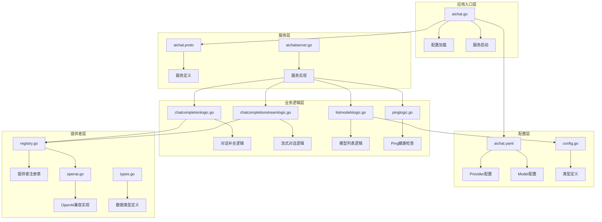
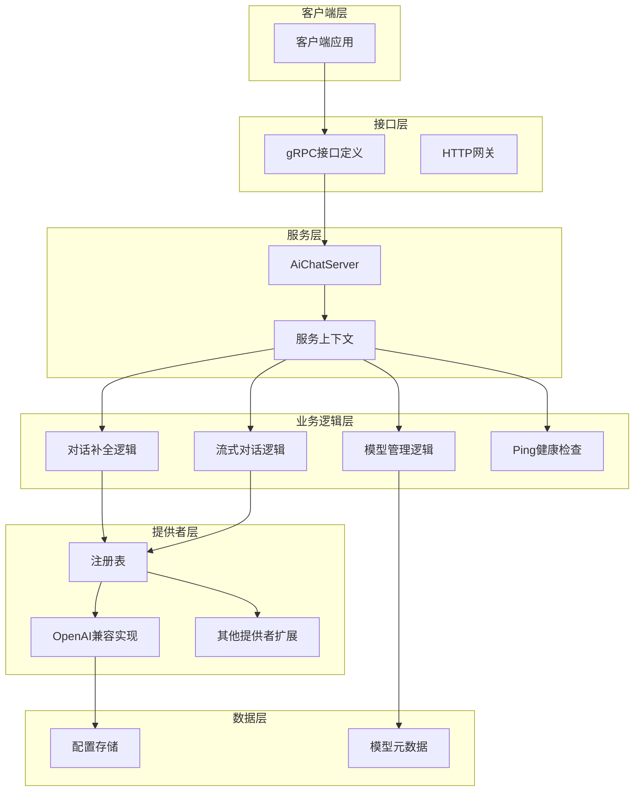
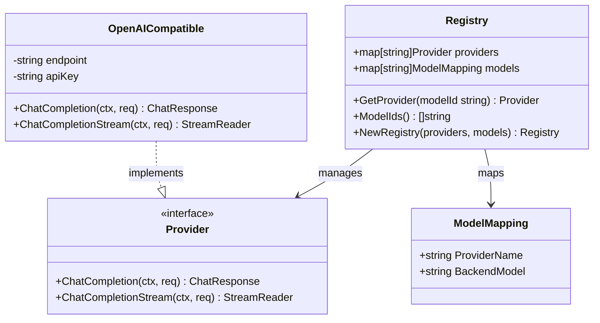
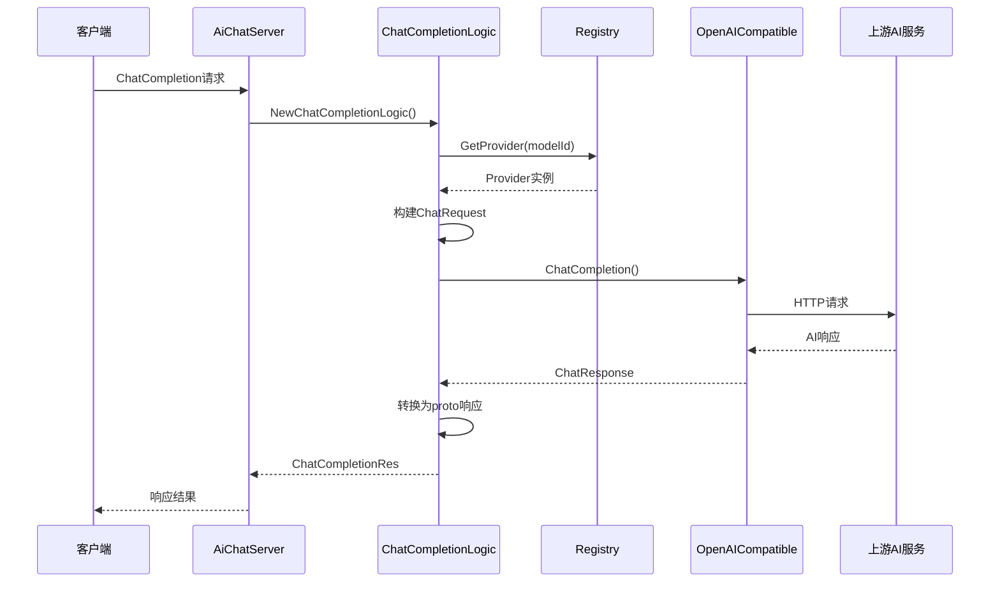
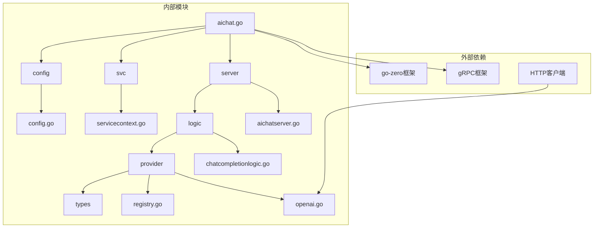

# AI聊天服务

<cite>
**本文档引用的文件**
- [aichat.go](file://aiapp/aichat/aichat.go)
- [aichat.yaml](file://aiapp/aichat/etc/aichat.yaml)
- [aichat.proto](file://aiapp/aichat/aichat.proto)
- [config.go](file://aiapp/aichat/internal/config/config.go)
- [provider.go](file://aiapp/aichat/internal/provider/provider.go)
- [openai.go](file://aiapp/aichat/internal/provider/openai.go)
- [registry.go](file://aiapp/aichat/internal/provider/registry.go)
- [types.go](file://aiapp/aichat/internal/provider/types.go)
- [servicecontext.go](file://aiapp/aichat/internal/svc/servicecontext.go)
- [aichatserver.go](file://aiapp/aichat/internal/server/aichatserver.go)
- [chatcompletionlogic.go](file://aiapp/aichat/internal/logic/chatcompletionlogic.go)
- [chatcompletionstreamlogic.go](file://aiapp/aichat/internal/logic/chatcompletionstreamlogic.go)
- [listmodelslogic.go](file://aiapp/aichat/internal/logic/listmodelslogic.go)
- [pinglogic.go](file://aiapp/aichat/internal/logic/pinglogic.go)
- [gen.sh](file://aiapp/aichat/gen.sh)
</cite>

## 更新摘要
**所做更改**
- 更新了流式超时控制机制，从默认15秒总超时和5秒空闲超时调整为10分钟总超时和90秒空闲超时
- 改进了错误处理机制，使用errors.As替代直接类型断言进行错误类型检查
- 优化了资源管理，将scanner缓冲区从64KB增加到256KB，防止大块截断
- 新增了配置管理，增加了StreamTimeout和StreamIdleTimeout设置项

## 目录
1. [简介](#简介)
2. [项目结构](#项目结构)
3. [核心组件](#核心组件)
4. [架构概览](#架构概览)
5. [详细组件分析](#详细组件分析)
6. [依赖关系分析](#依赖关系分析)
7. [性能考虑](#性能考虑)
8. [故障排除指南](#故障排除指南)
9. [结论](#结论)

## 简介

AI聊天服务是一个基于GoZero框架构建的RPC服务，提供统一的大语言模型接入接口。该服务支持多种AI模型提供商（如智谱、通义千问等），通过统一的gRPC接口对外提供对话补全、流式对话补全和模型列表查询功能。

该服务的核心特性包括：
- 支持多家AI模型提供商的统一接入
- 提供非流式和流式两种对话补全模式
- 深度思考（Thinking）模式支持
- 完整的错误处理和超时控制
- 基于配置的模型管理

**更新** 增强了流式超时控制机制，改进了错误处理机制，并优化了资源管理

## 项目结构

AI聊天服务采用标准的GoZero项目结构，主要分为以下几个层次：

**图表来源**
- [aichat.go:1-47](file://aiapp/aichat/aichat.go#L1-L47)
- [aichat.yaml:1-36](file://aiapp/aichat/etc/aichat.yaml#L1-L36)
- [aichat.proto:1-115](file://aiapp/aichat/aichat.proto#L1-L115)

**章节来源**
- [aichat.go:1-47](file://aiapp/aichat/aichat.go#L1-L47)
- [aichat.yaml:1-36](file://aiapp/aichat/etc/aichat.yaml#L1-L36)
- [config.go:1-33](file://aiapp/aichat/internal/config/config.go#L1-L33)

## 核心组件

### 1. 服务入口组件

服务入口位于`aichat.go`文件中，负责：
- 命令行参数解析（配置文件路径）
- 配置文件加载和验证
- 服务上下文初始化
- gRPC服务器启动和反射注册

### 2. 配置管理系统

配置系统采用分层设计：
- **Provider配置**：定义AI模型提供商的连接信息
- **Model配置**：定义可用模型及其属性
- **运行时配置**：包括超时设置、日志配置等

**更新** 新增了流式超时配置项：
- `StreamTimeout`: 单次流的总时长上限，默认10分钟
- `StreamIdleTimeout`: chunk间最大空闲时间，默认90秒

### 3. 提供者抽象层

提供者接口定义了统一的AI模型调用规范：
- `ChatCompletion`：非流式对话补全
- `ChatCompletionStream`：流式对话补全
- `StreamReader`：流式响应读取器

### 4. 业务逻辑层

包含四个核心业务逻辑：
- **对话补全逻辑**：处理单次对话请求
- **流式对话逻辑**：处理持续对话流
- **模型列表逻辑**：提供可用模型信息
- **Ping逻辑**：健康检查服务

**章节来源**
- [provider.go:1-20](file://aiapp/aichat/internal/provider/provider.go#L1-L20)
- [chatcompletionlogic.go:1-172](file://aiapp/aichat/internal/logic/chatcompletionlogic.go#L1-L172)
- [chatcompletionstreamlogic.go:1-121](file://aiapp/aichat/internal/logic/chatcompletionstreamlogic.go#L1-L121)

## 架构概览

AI聊天服务采用分层架构设计，确保了良好的可扩展性和维护性：

**图表来源**
- [aichatserver.go:1-45](file://aiapp/aichat/internal/server/aichatserver.go#L1-L45)
- [servicecontext.go:1-24](file://aiapp/aichat/internal/svc/servicecontext.go#L1-L24)
- [registry.go:1-89](file://aiapp/aichat/internal/provider/registry.go#L1-L89)

该架构的主要优势：
- **解耦合**：各层职责明确，便于独立开发和测试
- **可扩展**：新增AI提供者只需实现Provider接口
- **可配置**：通过配置文件灵活管理模型和提供者
- **可观测**：完整的日志记录和错误处理机制

## 详细组件分析

### 服务注册表组件

服务注册表是整个系统的核心协调器，负责管理提供者和模型之间的映射关系：

**图表来源**
- [registry.go:15-89](file://aiapp/aichat/internal/provider/registry.go#L15-L89)
- [provider.go:5-20](file://aiapp/aichat/internal/provider/provider.go#L5-L20)
- [openai.go:16-28](file://aiapp/aichat/internal/provider/openai.go#L16-L28)

### 对话补全流程

非流式对话补全的完整处理流程如下：

**图表来源**
- [chatcompletionlogic.go:29-48](file://aiapp/aichat/internal/logic/chatcompletionlogic.go#L29-L48)
- [openai.go:30-55](file://aiapp/aichat/internal/provider/openai.go#L30-L55)

### 流式对话处理

**更新** 流式对话处理实现了增强的超时管理和错误恢复机制：

**图表来源**
- [chatcompletionstreamlogic.go:32-96](file://aiapp/aichat/internal/logic/chatcompletionstreamlogic.go#L32-L96)

**更新** 超时控制机制改进：
- 总超时：从15秒增加到10分钟
- 空闲超时：从5秒增加到90秒
- 支持客户端断开检测和优雅取消

### 深度思考模式实现

系统支持不同AI提供商的深度思考（Thinking）模式，通过厂商特定的参数格式实现：

| 提供商 | 参数格式 | 清理策略 |
|--------|----------|----------|
| dashscope | `{"enable_thinking": true}` | 不支持清理 |
| openai/zhipu | `{"thinking": {"type": "enabled", "clear_thinking": true}}` | 自动清理reasoning_content |

**章节来源**
- [chatcompletionlogic.go:89-125](file://aiapp/aichat/internal/logic/chatcompletionlogic.go#L89-L125)
- [openai.go:102-128](file://aiapp/aichat/internal/provider/openai.go#L102-L128)

## 依赖关系分析

AI聊天服务的依赖关系清晰明确，遵循依赖倒置原则：

**图表来源**
- [aichat.go:3-18](file://aiapp/aichat/aichat.go#L3-L18)
- [servicecontext.go:3-6](file://aiapp/aichat/internal/svc/servicecontext.go#L3-L6)

### 关键依赖特性

1. **配置驱动**：所有AI提供者和模型都通过配置文件管理
2. **接口抽象**：Provider接口隔离了具体的AI服务实现
3. **类型安全**：完整的protobuf定义确保了类型安全
4. **错误处理**：统一的错误转换和gRPC状态码映射

**更新** 错误处理机制改进：
- 使用`errors.As`进行类型安全的错误检查
- 支持API错误的精确分类和处理
- 提供更好的错误信息传递

**章节来源**
- [aichat.proto:1-115](file://aiapp/aichat/aichat.proto#L1-L115)
- [types.go:1-75](file://aiapp/aichat/internal/provider/types.go#L1-L75)

## 性能考虑

### 超时管理

**更新** 系统实现了增强的多层次超时控制机制：

| 超时类型 | 默认值 | 用途 | 配置位置 |
|----------|--------|------|----------|
| 总流超时 | 10分钟 | 整个流生命周期限制 | StreamTimeout |
| 空闲超时 | 90秒 | 单个chunk间的最大等待时间 | StreamIdleTimeout |
| 请求超时 | 60秒 | 单次API调用超时 | RpcServerConf.Timeout |

**更新** 超时优先级判断：
1. 客户端断开（浏览器关闭SSE→aigtw取消gRPC调用→l.ctx取消）
2. 总超时到期（streamCtx超时）
3. 空闲超时（awaitErr是DeadlineExceeded）
4. 上游错误（业务错误）

### 并发处理

系统使用异步Promise模式处理流式响应的接收：
- 每个`Recv()`操作都在独立goroutine中执行
- 支持超时中断和优雅取消
- 自动资源清理和错误传播

### 缓存策略

- **提供者缓存**：注册表缓存已初始化的提供者实例
- **模型映射缓存**：快速查找模型对应的提供者
- **配置缓存**：避免重复解析配置文件

**更新** 资源管理优化：
- scanner缓冲区从64KB增加到256KB
- 防止大块SSE数据截断
- 提高流式响应处理的稳定性

## 故障排除指南

### 常见错误类型及解决方案

**更新** 错误处理机制改进后的错误类型：

| 错误类型 | 状态码 | 描述 | 解决方案 |
|----------|--------|------|----------|
| 认证失败 | 401/403 | API密钥无效或权限不足 | 检查配置文件中的ApiKey |
| 速率限制 | 429 | 超出API调用限制 | 降低请求频率或升级套餐 |
| 参数错误 | 400 | 请求参数格式不正确 | 验证消息格式和必填字段 |
| 上游错误 | 5xx | AI服务暂时不可用 | 重试请求或检查服务状态 |
| 超时错误 | DEADLINE_EXCEEDED | 流式连接超时 | 检查网络连接和超时配置 |

**更新** 新增的超时相关错误：
- 总超时错误：流式对话超过10分钟
- 空闲超时错误：单个chunk超过90秒未到达

### 日志分析

系统提供了丰富的日志信息：
- 请求ID追踪：每个请求都有唯一的ID便于调试
- 模型映射：显示从逻辑ID到后端模型的转换
- 错误详情：包含上游服务的原始错误信息
- 性能指标：响应时间和资源使用情况

### 调试技巧

1. **启用开发模式**：在配置中设置`Mode: dev`以启用gRPC反射
2. **检查配置**：验证Provider和Model配置的正确性
3. **监控网络**：使用工具检查与AI服务的连接状态
4. **查看日志**：关注错误级别日志和上下文信息

**更新** 新增调试技巧：
- 调整超时配置：根据实际需求调整StreamTimeout和StreamIdleTimeout
- 监控资源使用：关注scanner缓冲区使用情况
- 错误类型检查：使用errors.As进行精确的错误类型判断

**章节来源**
- [chatcompletionlogic.go:156-171](file://aiapp/aichat/internal/logic/chatcompletionlogic.go#L156-L171)
- [chatcompletionstreamlogic.go:77-87](file://aiapp/aichat/internal/logic/chatcompletionstreamlogic.go#L77-L87)

## 结论

AI聊天服务是一个设计精良的微服务架构示例，具有以下突出特点：

### 技术优势
- **架构清晰**：分层设计确保了良好的可维护性
- **扩展性强**：通过Provider接口轻松集成新的AI服务
- **配置灵活**：完全基于配置的模型和服务管理
- **错误处理完善**：统一的错误转换和超时控制

**更新** 新增的技术改进：
- **增强的超时控制**：10分钟总超时和90秒空闲超时，支持更复杂的流式对话场景
- **改进的错误处理**：使用errors.As进行类型安全的错误检查
- **优化的资源管理**：256KB scanner缓冲区，防止大块数据截断
- **完善的配置管理**：支持自定义流式超时设置

### 业务价值
- **多供应商支持**：为用户提供最佳的AI服务选择
- **标准化接口**：简化了客户端集成复杂度
- **性能优化**：合理的超时管理和并发控制
- **可观测性**：完整的日志和监控支持

### 发展建议
1. **增加缓存层**：为频繁访问的模型元数据增加缓存
2. **实现熔断器**：在上游服务不稳定时提供降级策略
3. **增强监控**：添加更详细的性能指标和告警机制
4. **支持更多格式**：扩展对其他AI服务格式的支持

**更新** 建议的进一步优化：
- **动态超时调整**：根据模型复杂度动态调整超时设置
- **智能资源管理**：根据流量动态调整scanner缓冲区大小
- **错误预测**：基于历史数据预测和预防常见错误

该服务为构建企业级AI应用提供了坚实的基础，其设计原则和实现模式值得在类似项目中借鉴和参考。