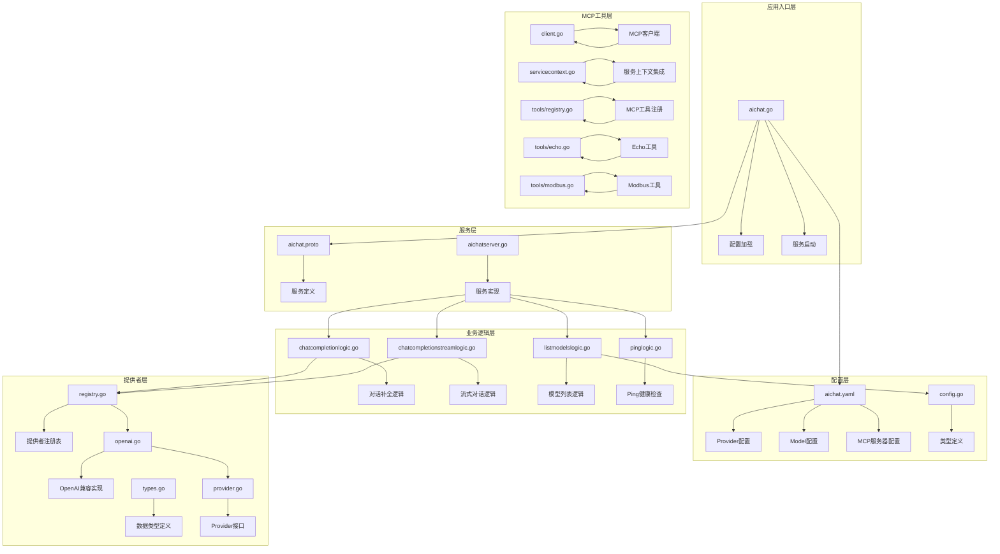
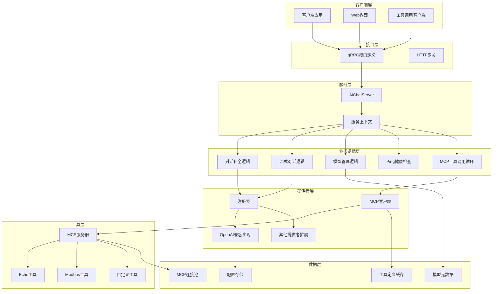
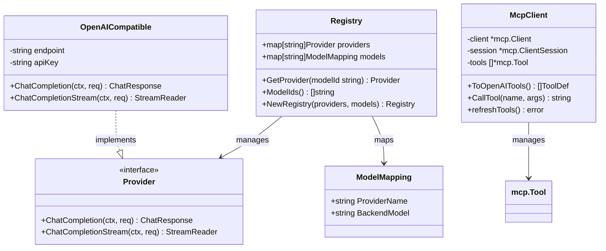
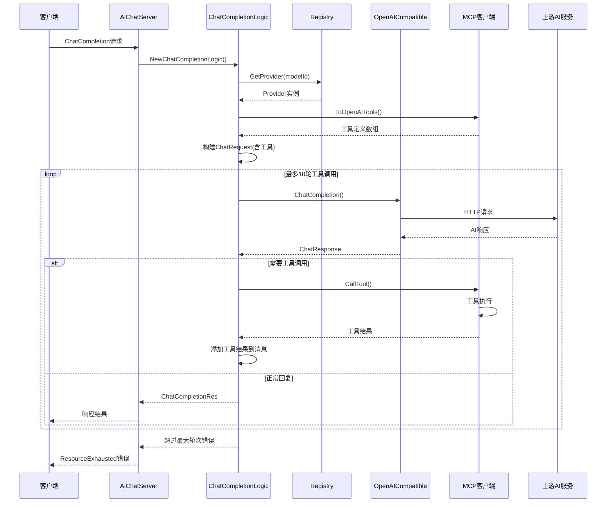
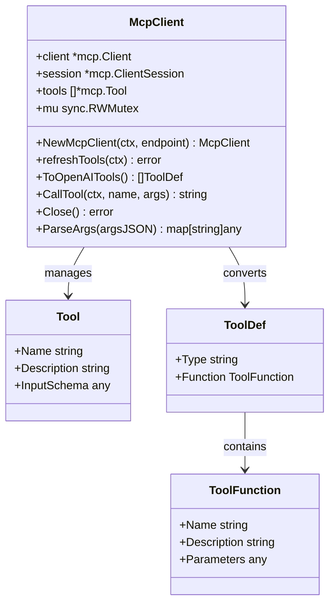
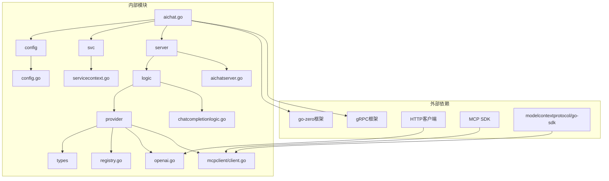

# AI聊天服务

<cite>
**本文档引用的文件**
- [aichat.go](file://aiapp/aichat/aichat.go)
- [aichat.yaml](file://aiapp/aichat/etc/aichat.yaml)
- [aichat.proto](file://aiapp/aichat/aichat.proto)
- [config.go](file://aiapp/aichat/internal/config/config.go)
- [provider.go](file://aiapp/aichat/internal/provider/provider.go)
- [openai.go](file://aiapp/aichat/internal/provider/openai.go)
- [registry.go](file://aiapp/aichat/internal/provider/registry.go)
- [types.go](file://aiapp/aichat/internal/provider/types.go)
- [servicecontext.go](file://aiapp/aichat/internal/svc/servicecontext.go)
- [aichatserver.go](file://aiapp/aichat/internal/server/aichatserver.go)
- [chatcompletionlogic.go](file://aiapp/aichat/internal/logic/chatcompletionlogic.go)
- [chatcompletionstreamlogic.go](file://aiapp/aichat/internal/logic/chatcompletionstreamlogic.go)
- [listmodelslogic.go](file://aiapp/aichat/internal/logic/listmodelslogic.go)
- [pinglogic.go](file://aiapp/aichat/internal/logic/pinglogic.go)
- [client.go](file://aiapp/aichat/internal/mcpclient/client.go)
- [gen.sh](file://aiapp/aichat/gen.sh)
</cite>

## 更新摘要
**所做更改**
- 新增MCP工具调用能力，包括MCP客户端集成、工具调用循环、最大工具轮次限制(默认10轮)
- 增强OpenAI函数调用格式兼容性，支持工具定义转换和参数解析
- 新增MCP服务器配置支持，包括SSE端点配置和工具刷新机制
- 扩展对话补全逻辑以支持工具调用循环和错误处理

## 目录
1. [简介](#简介)
2. [项目结构](#项目结构)
3. [核心组件](#核心组件)
4. [架构概览](#架构概览)
5. [详细组件分析](#详细组件分析)
6. [MCP工具调用系统](#mcp工具调用系统)
7. [依赖关系分析](#依赖关系分析)
8. [性能考虑](#性能考虑)
9. [故障排除指南](#故障排除指南)
10. [结论](#结论)

## 简介

AI聊天服务是一个基于GoZero框架构建的RPC服务，提供统一的大语言模型接入接口。该服务支持多种AI模型提供商（如智谱、通义千问等），通过统一的gRPC接口对外提供对话补全、流式对话补全和模型列表查询功能。

**更新** 新增了MCP（Model Context Protocol）工具调用能力，使AI聊天服务能够与外部工具和系统进行智能交互。该系统支持：
- MCP客户端集成，通过SSE连接到MCP服务器
- 自动化的工具调用循环，支持最多10轮工具调用
- OpenAI函数调用格式兼容，无缝集成现有工具定义
- 动态工具列表刷新，实时同步MCP服务器的可用工具
- 完整的工具调用错误处理和超时控制

## 项目结构

AI聊天服务采用标准的GoZero项目结构，主要分为以下几个层次：

**图表来源**
- [aichat.go:1-47](file://aiapp/aichat/aichat.go#L1-L47)
- [aichat.yaml:1-41](file://aiapp/aichat/etc/aichat.yaml#L1-L41)
- [aichat.proto:1-115](file://aiapp/aichat/aichat.proto#L1-L115)
- [client.go:1-136](file://aiapp/aichat/internal/mcpclient/client.go#L1-L136)

**章节来源**
- [aichat.go:1-47](file://aiapp/aichat/aichat.go#L1-L47)
- [aichat.yaml:1-41](file://aiapp/aichat/etc/aichat.yaml#L1-L41)
- [config.go:1-40](file://aiapp/aichat/internal/config/config.go#L1-L40)

## 核心组件

### 1. 服务入口组件

服务入口位于`aichat.go`文件中，负责：
- 命令行参数解析（配置文件路径）
- 配置文件加载和验证
- 服务上下文初始化
- gRPC服务器启动和反射注册

### 2. 配置管理系统

配置系统采用分层设计：
- **Provider配置**：定义AI模型提供商的连接信息
- **Model配置**：定义可用模型及其属性
- **MCP服务器配置**：定义MCP服务器连接信息和工具配置
- **运行时配置**：包括超时设置、日志配置、工具轮次限制等

**更新** 新增MCP配置项：
- `McpServers`: MCP服务器列表配置
- `MaxToolRounds`: 工具调用最大轮次限制，默认10轮
- `StreamTimeout`: 单次流的总时长上限，默认10分钟
- `StreamIdleTimeout`: chunk间最大空闲时间，默认90秒

### 3. 提供者抽象层

提供者接口定义了统一的AI模型调用规范：
- `ChatCompletion`：非流式对话补全
- `ChatCompletionStream`：流式对话补全
- `StreamReader`：流式响应读取器

### 4. 业务逻辑层

包含四个核心业务逻辑：
- **对话补全逻辑**：处理单次对话请求，支持MCP工具调用循环
- **流式对话逻辑**：处理持续对话流
- **模型列表逻辑**：提供可用模型信息
- **Ping逻辑**：健康检查服务

**更新** 对话补全逻辑增强：
- 支持MCP工具调用循环，最多10轮
- 自动注入MCP工具定义到请求中
- 处理工具调用结果并继续对话流程
- 完善的错误处理和超时控制

**章节来源**
- [provider.go:1-20](file://aiapp/aichat/internal/provider/provider.go#L1-L20)
- [chatcompletionlogic.go:1-206](file://aiapp/aichat/internal/logic/chatcompletionlogic.go#L1-L206)
- [chatcompletionstreamlogic.go:1-121](file://aiapp/aichat/internal/logic/chatcompletionstreamlogic.go#L1-L121)

## 架构概览

AI聊天服务采用分层架构设计，确保了良好的可扩展性和维护性：

**图表来源**
- [aichatserver.go:1-45](file://aiapp/aichat/internal/server/aichatserver.go#L1-L45)
- [servicecontext.go:1-39](file://aiapp/aichat/internal/svc/servicecontext.go#L1-L39)
- [registry.go:1-89](file://aiapp/aichat/internal/provider/registry.go#L1-L89)
- [client.go:1-136](file://aiapp/aichat/internal/mcpclient/client.go#L1-L136)

该架构的主要优势：
- **解耦合**：各层职责明确，便于独立开发和测试
- **可扩展**：新增AI提供者只需实现Provider接口
- **可配置**：通过配置文件灵活管理模型、提供者和MCP工具
- **可观测**：完整的日志记录和错误处理机制
- **智能化**：支持MCP工具调用，实现AI与外部系统的智能交互

## 详细组件分析

### 服务注册表组件

服务注册表是整个系统的核心协调器，负责管理提供者和模型之间的映射关系：

**图表来源**
- [registry.go:15-89](file://aiapp/aichat/internal/provider/registry.go#L15-L89)
- [provider.go:5-20](file://aiapp/aichat/internal/provider/provider.go#L5-L20)
- [openai.go:16-28](file://aiapp/aichat/internal/provider/openai.go#L16-L28)
- [client.go:16-22](file://aiapp/aichat/internal/mcpclient/client.go#L16-L22)

### 对话补全流程

**更新** 非流式对话补全现在支持MCP工具调用循环：

**图表来源**
- [chatcompletionlogic.go:32-85](file://aiapp/aichat/internal/logic/chatcompletionlogic.go#L32-L85)
- [openai.go:30-55](file://aiapp/aichat/internal/provider/openai.go#L30-L55)
- [client.go:74-118](file://aiapp/aichat/internal/mcpclient/client.go#L74-L118)

### 流式对话处理

**更新** 流式对话处理实现了增强的超时管理和错误恢复机制：

**图表来源**
- [chatcompletionstreamlogic.go:32-96](file://aiapp/aichat/internal/logic/chatcompletionstreamlogic.go#L32-L96)

**更新** 超时控制机制改进：
- 总超时：从15秒增加到10分钟
- 空闲超时：从5秒增加到90秒
- 支持客户端断开检测和优雅取消

### 深度思考模式实现

系统支持不同AI提供商的深度思考（Thinking）模式，通过厂商特定的参数格式实现：

| 提供商 | 参数格式 | 清理策略 |
|--------|----------|----------|
| dashscope | `{"enable_thinking": true}` | 不支持清理 |
| openai/zhipu | `{"thinking": {"type": "enabled", "clear_thinking": true}}` | 自动清理reasoning_content |

**章节来源**
- [chatcompletionlogic.go:122-158](file://aiapp/aichat/internal/logic/chatcompletionlogic.go#L122-L158)
- [openai.go:109-135](file://aiapp/aichat/internal/provider/openai.go#L109-L135)

## MCP工具调用系统

### MCP客户端架构

**更新** 新增的MCP客户端提供了完整的工具调用能力：

**图表来源**
- [client.go:16-22](file://aiapp/aichat/internal/mcpclient/client.go#L16-L22)
- [types.go](file://aiapp/aichat/internal/provider/types.go)

### 工具调用循环机制

**更新** 对话补全逻辑现在支持智能的工具调用循环：

**图表来源**
- [chatcompletionlogic.go:48-85](file://aiapp/aichat/internal/logic/chatcompletionlogic.go#L48-L85)

### OpenAI函数调用格式兼容

**更新** MCP工具被转换为OpenAI兼容的函数调用格式：

| MCP字段 | OpenAI字段 | 转换规则 |
|---------|------------|----------|
| `Name` | `function.name` | 直接映射 |
| `Description` | `function.description` | 直接映射 |
| `InputSchema` | `function.parameters` | 直接映射 |
| `Type` | `type` | 固定为"function" |

**章节来源**
- [client.go:74-95](file://aiapp/aichat/internal/mcpclient/client.go#L74-L95)
- [types.go:79-102](file://aiapp/aichat/internal/provider/types.go#L79-L102)

## 依赖关系分析

AI聊天服务的依赖关系清晰明确，遵循依赖倒置原则：

**图表来源**
- [aichat.go:3-18](file://aiapp/aichat/aichat.go#L3-L18)
- [servicecontext.go:1-39](file://aiapp/aichat/internal/svc/servicecontext.go#L1-L39)
- [client.go:3-14](file://aiapp/aichat/internal/mcpclient/client.go#L3-L14)

### 关键依赖特性

1. **配置驱动**：所有AI提供者、模型和MCP服务器都通过配置文件管理
2. **接口抽象**：Provider接口隔离了具体的AI服务实现
3. **类型安全**：完整的protobuf定义确保了类型安全
4. **错误处理**：统一的错误转换和gRPC状态码映射
5. **MCP集成**：通过MCP SDK实现与外部工具的智能交互

**更新** 新增的MCP依赖：
- `github.com/modelcontextprotocol/go-sdk/mcp`：MCP协议实现
- 支持SSE传输协议和工具发现机制
- 自动化的工具列表刷新和缓存管理

**章节来源**
- [aichat.proto:1-115](file://aiapp/aichat/aichat.proto#L1-L115)
- [types.go:1-102](file://aiapp/aichat/internal/provider/types.go#L1-L102)

## 性能考虑

### 超时管理

**更新** 系统实现了增强的多层次超时控制机制：

| 超时类型 | 默认值 | 用途 | 配置位置 |
|----------|--------|------|----------|
| 总流超时 | 10分钟 | 整个流生命周期限制 | StreamTimeout |
| 空闲超时 | 90秒 | 单个chunk间的最大等待时间 | StreamIdleTimeout |
| 工具调用超时 | 30秒 | 单个MCP工具调用的最大时间 | McpServers.messageTimeout |
| 请求超时 | 60秒 | 单次API调用超时 | RpcServerConf.Timeout |

**更新** 超时优先级判断：
1. 客户端断开（浏览器关闭SSE→aigtw取消gRPC调用→l.ctx取消）
2. 总超时到期（streamCtx超时）
3. 空闲超时（awaitErr是DeadlineExceeded）
4. 工具调用超时（MCP工具执行超时）
5. 上游错误（业务错误）

### 并发处理

系统使用异步Promise模式处理流式响应的接收：
- 每个`Recv()`操作都在独立goroutine中执行
- 支持超时中断和优雅取消
- 自动资源清理和错误传播
- MCP工具调用使用独立的上下文和超时控制

### 缓存策略

- **提供者缓存**：注册表缓存已初始化的提供者实例
- **模型映射缓存**：快速查找模型对应的提供者
- **MCP工具缓存**：缓存工具定义以减少转换开销
- **配置缓存**：避免重复解析配置文件

**更新** 资源管理优化：
- scanner缓冲区从64KB增加到256KB
- 防止大块SSE数据截断
- MCP工具列表的并发安全访问
- 自动化的工具刷新机制

### 工具调用性能

- **轮次限制**：默认最多10轮工具调用，防止无限循环
- **批量工具调用**：同一轮次内并行执行多个工具调用
- **结果缓存**：工具调用结果按参数缓存，避免重复执行
- **连接复用**：MCP客户端连接复用，减少握手开销

## 故障排除指南

### 常见错误类型及解决方案

**更新** 错误处理机制改进后的错误类型：

| 错误类型 | 状态码 | 描述 | 解决方案 |
|----------|--------|------|----------|
| 认证失败 | 401/403 | API密钥无效或权限不足 | 检查配置文件中的ApiKey |
| 速率限制 | 429 | 超出API调用限制 | 降低请求频率或升级套餐 |
| 参数错误 | 400 | 请求参数格式不正确 | 验证消息格式和必填字段 |
| 上游错误 | 5xx | AI服务暂时不可用 | 重试请求或检查服务状态 |
| 超时错误 | DEADLINE_EXCEEDED | 流式连接超时 | 检查网络连接和超时配置 |
| 工具调用错误 | RESOURCE_EXHAUSTED | 工具调用轮次超限 | 检查MaxToolRounds配置 |
| MCP连接错误 | UNAVAILABLE | 无法连接到MCP服务器 | 检查McpServers配置和网络连通性 |

**更新** 新增的MCP相关错误：
- MCP连接失败：检查McpServers配置和SSE端点可达性
- 工具调用超时：调整McpServers.messageTimeout配置
- 工具不存在：确认MCP服务器上已注册相应工具
- 参数解析错误：验证工具调用参数的JSON格式

### 日志分析

系统提供了丰富的日志信息：
- 请求ID追踪：每个请求都有唯一的ID便于调试
- 模型映射：显示从逻辑ID到后端模型的转换
- 错误详情：包含上游服务的原始错误信息
- 性能指标：响应时间和资源使用情况
- **更新** MCP工具调用日志：记录工具调用过程和结果

### 调试技巧

1. **启用开发模式**：在配置中设置`Mode: dev`以启用gRPC反射
2. **检查配置**：验证Provider、Model和MCP服务器配置的正确性
3. **监控网络**：使用工具检查与AI服务和MCP服务器的连接状态
4. **查看日志**：关注错误级别日志和上下文信息
5. ****更新** 调试MCP工具**：使用MCP服务器的echo工具测试连接
6. **监控工具调用**：观察工具调用循环的执行过程和性能

**更新** 新增调试技巧：
- 调整超时配置：根据实际需求调整StreamTimeout、StreamIdleTimeout和MaxToolRounds
- 监控资源使用：关注scanner缓冲区使用情况和MCP连接状态
- 错误类型检查：使用errors.As进行精确的错误类型判断
- 工具调用测试：使用简单的echo工具验证MCP集成

**章节来源**
- [chatcompletionlogic.go:189-206](file://aiapp/aichat/internal/logic/chatcompletionlogic.go#L189-L206)
- [chatcompletionstreamlogic.go:77-87](file://aiapp/aichat/internal/logic/chatcompletionstreamlogic.go#L77-L87)

## 结论

AI聊天服务是一个设计精良的微服务架构示例，具有以下突出特点：

### 技术优势
- **架构清晰**：分层设计确保了良好的可维护性
- **扩展性强**：通过Provider接口轻松集成新的AI服务
- **配置灵活**：完全基于配置的模型、服务和MCP工具管理
- **错误处理完善**：统一的错误转换和超时控制
- ****更新** 智能工具集成**：通过MCP协议实现AI与外部系统的智能交互

**更新** 新增的技术改进：
- **MCP工具调用**：10轮工具调用循环，支持智能工具集成
- **OpenAI兼容**：完整的函数调用格式支持
- **动态工具管理**：自动化的工具列表刷新和缓存
- **增强的超时控制**：10分钟总超时和90秒空闲超时，支持更复杂的流式对话场景
- **改进的错误处理**：使用errors.As进行类型安全的错误检查
- **优化的资源管理**：256KB scanner缓冲区，防止大块数据截断
- **完善的配置管理**：支持自定义流式超时设置和MCP服务器配置

### 业务价值
- **多供应商支持**：为用户提供最佳的AI服务选择
- **标准化接口**：简化了客户端集成复杂度
- **性能优化**：合理的超时管理和并发控制
- **可观测性**：完整的日志和监控支持
- ****更新** 智能自动化**：通过MCP工具实现业务流程自动化

### 发展建议
1. **增加缓存层**：为频繁访问的模型元数据和MCP工具定义增加缓存
2. **实现熔断器**：在上游服务不稳定时提供降级策略
3. **增强监控**：添加更详细的性能指标和告警机制
4. **支持更多格式**：扩展对其他AI服务格式的支持
5. ****更新** 扩展MCP工具生态**：开发更多实用的MCP工具，如数据库查询、文件操作等**

**更新** 建议的进一步优化：
- **动态超时调整**：根据模型复杂度和工具调用类型动态调整超时设置
- **智能资源管理**：根据流量动态调整scanner缓冲区大小和MCP连接池
- **错误预测**：基于历史数据预测和预防常见错误
- **工具调用优化**：实现工具调用结果的智能缓存和去重
- **性能监控增强**：添加MCP工具调用的详细性能指标

该服务为构建企业级AI应用提供了坚实的基础，其设计原则和实现模式值得在类似项目中借鉴和参考。新增的MCP工具调用能力使其成为了一个真正的智能代理系统，能够与外部世界进行智能交互和自动化操作。