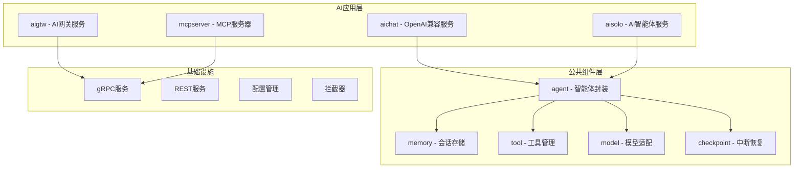
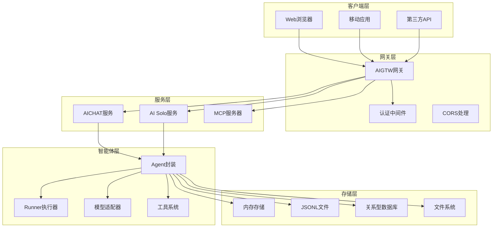
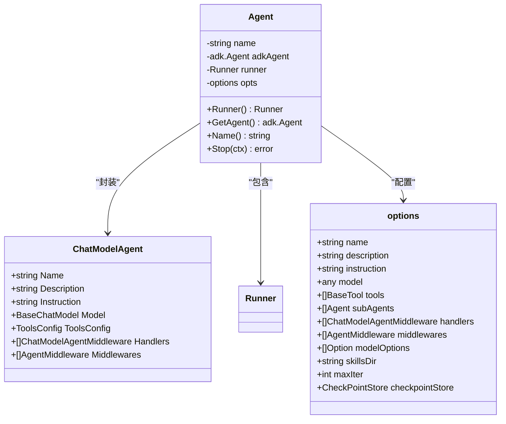
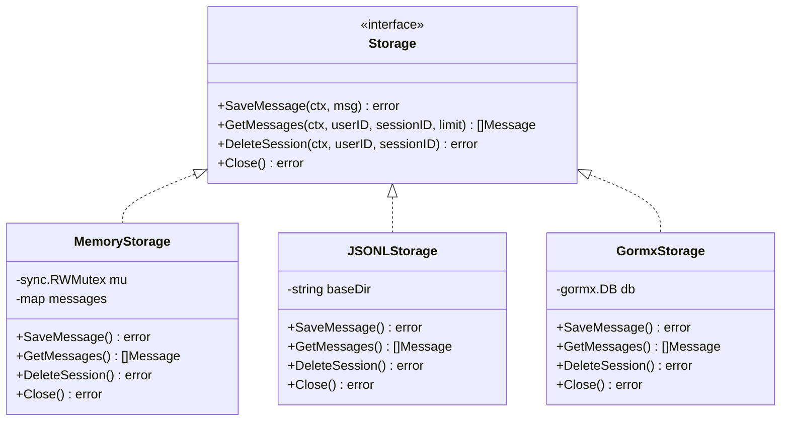
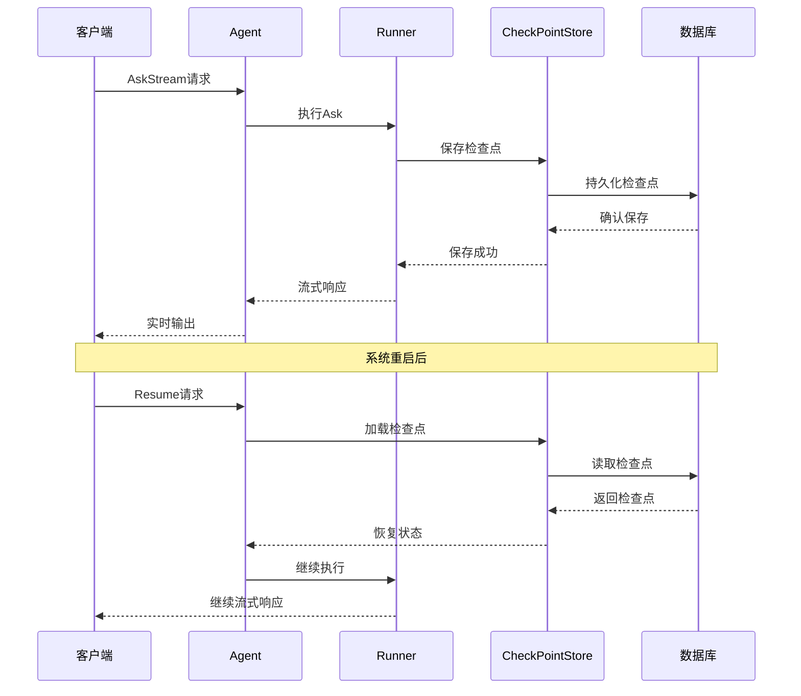
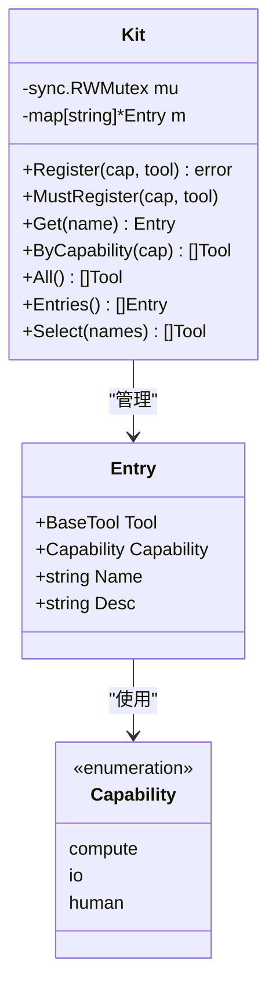
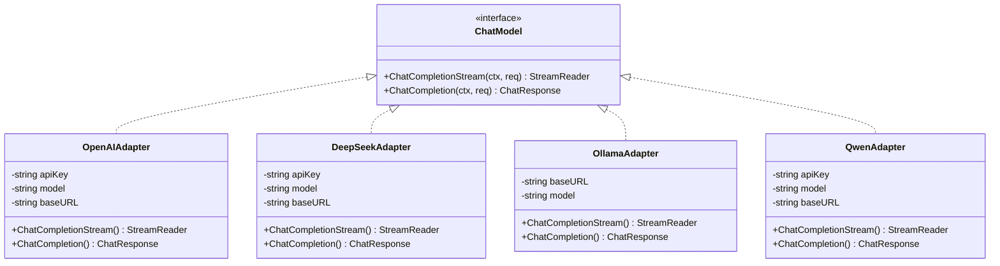
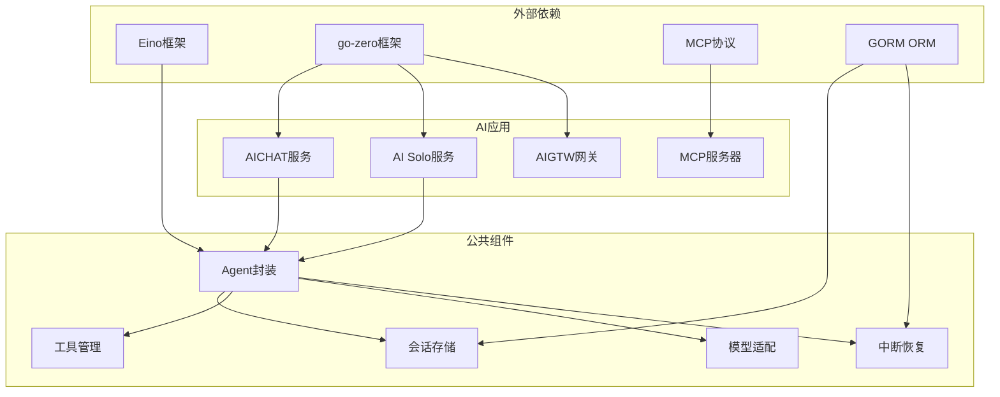

# Einox AI框架

<cite>
**本文档引用的文件**
- [README.md](file://README.md)
- [go.mod](file://go.mod)
- [aichat.go](file://aiapp/aichat/aichat.go)
- [aisolo.go](file://aiapp/aisolo/aisolo.go)
- [aigtw.go](file://aiapp/aigtw/aigtw.go)
- [agent.go](file://common/einox/agent/agent.go)
- [agent_option.go](file://common/einox/agent/agent_option.go)
- [store.go](file://common/einox/checkpoint/store.go)
- [storage.go](file://common/einox/memory/storage.go)
- [config.go](file://aiapp/aisolo/internal/config/config.go)
- [config.go](file://aiapp/aichat/internal/config/config.go)
- [config.go](file://aiapp/aigtw/internal/config/config.go)
- [askstreamlogic.go](file://aiapp/aisolo/internal/logic/askstreamlogic.go)
- [chatcompletionstreamlogic.go](file://aiapp/aichat/internal/logic/chatcompletionstreamlogic.go)
- [kit.go](file://common/einox/tool/kit.go)
- [chatmodel.go](file://common/einox/model/chatmodel.go)
- [echo.go](file://aiapp/mcpserver/internal/tools/echo.go)
</cite>

## 目录
1. [简介](#简介)
2. [项目结构](#项目结构)
3. [核心组件](#核心组件)
4. [架构概览](#架构概览)
5. [详细组件分析](#详细组件分析)
6. [依赖分析](#依赖分析)
7. [性能考虑](#性能考虑)
8. [故障排除指南](#故障排除指南)
9. [结论](#结论)

## 简介

Einox AI框架是一个基于go-zero的企业级AI应用开发框架，专注于提供完整的AI智能体解决方案。该框架集成了多种AI模型提供商，支持流式对话、工具调用、会话管理和中断恢复等功能。

### 主要特性

- **多模型提供商支持**：OpenAI、DeepSeek、Ollama、Qwen、Ark等主流AI模型
- **流式对话处理**：支持实时流式响应和工具调用
- **智能体管理**：提供Agent封装和生命周期管理
- **会话存储**：支持内存、JSONL和关系型数据库三种存储后端
- **工具系统**：内置工具注册表和策略管理
- **中断恢复**：支持会话中断后的恢复机制

## 项目结构

Einox AI框架采用模块化的项目结构，主要包含以下核心模块：

**图表来源**
- [README.md:59-108](file://README.md#L59-L108)

**章节来源**
- [README.md:59-108](file://README.md#L59-L108)

## 核心组件

### AI聊天服务 (aichat)

AI聊天服务提供OpenAI兼容的聊天补全功能，支持多种AI模型提供商：

- **流式对话**：实时响应LLM输出
- **工具调用**：支持MCP工具链集成
- **上下文管理**：智能的上下文长度控制
- **错误处理**：完善的错误映射和处理机制

### AI智能体服务 (aisolo)

AI智能体服务专注于复杂的AI智能体管理，支持多种智能体模式：

- **多模式支持**：Chat、Plan、Deep、Supervisor等模式
- **会话管理**：完整的会话生命周期管理
- **中断恢复**：支持长时间运行任务的中断恢复
- **文件系统**：深度智能体的本地文件操作能力

### AI网关服务 (aigtw)

AI网关服务作为统一入口，提供REST API和静态资源服务：

- **JWT认证**：支持JWT令牌验证
- **静态资源**：内置Solo界面静态文件
- **路由管理**：灵活的API路由配置
- **CORS支持**：跨域资源共享支持

**章节来源**
- [aichat.go:1-50](file://aiapp/aichat/aichat.go#L1-L50)
- [aisolo.go:1-58](file://aiapp/aisolo/aisolo.go#L1-L58)
- [aigtw.go:1-127](file://aiapp/aigtw/aigtw.go#L1-L127)

## 架构概览

Einox AI框架采用分层架构设计，确保了良好的可扩展性和可维护性：

**图表来源**
- [README.md:15-51](file://README.md#L15-L51)
- [agent.go:27-75](file://common/einox/agent/agent.go#L27-L75)

## 详细组件分析

### Agent智能体封装

Agent智能体封装提供了简洁的API接口，屏蔽了底层复杂性：

**图表来源**
- [agent.go:28-58](file://common/einox/agent/agent.go#L28-L58)
- [agent_option.go:23-42](file://common/einox/agent/agent_option.go#L23-L42)

智能体的核心特性包括：

- **最小API设计**：仅暴露必要的方法接口
- **灵活配置**：支持多种选项和配置组合
- **工具集成**：内置工具注册和管理机制
- **技能系统**：支持从文件系统加载技能

**章节来源**
- [agent.go:1-157](file://common/einox/agent/agent.go#L1-L157)
- [agent_option.go:1-141](file://common/einox/agent/agent_option.go#L1-L141)

### 会话存储系统

会话存储系统提供了三种存储后端，满足不同场景需求：

**图表来源**
- [storage.go:22-40](file://common/einox/memory/storage.go#L22-L40)
- [storage.go:89-149](file://common/einox/memory/storage.go#L89-L149)

存储系统的特性：

- **统一接口**：三种实现共享同一接口
- **线程安全**：内存实现提供并发安全保障
- **灵活配置**：支持不同的存储后端选择
- **资源管理**：提供完整的资源生命周期管理

**章节来源**
- [storage.go:1-179](file://common/einox/memory/storage.go#L1-L179)

### 中断恢复机制

中断恢复机制确保了长时间任务的可靠执行：

**图表来源**
- [store.go:22-62](file://common/einox/checkpoint/store.go#L22-L62)
- [askstreamlogic.go:30-59](file://aiapp/aisolo/internal/logic/askstreamlogic.go#L30-L59)

中断恢复的关键特性：

- **多后端支持**：内存、JSONL、关系型数据库三种存储
- **无缝切换**：不同存储后端可以互换使用
- **资源管理**：提供完整的资源清理和关闭机制
- **一致性保证**：确保检查点数据的一致性和完整性

**章节来源**
- [store.go:1-110](file://common/einox/checkpoint/store.go#L1-L110)

### 工具管理系统

工具管理系统提供了统一的工具注册和管理机制：

**图表来源**
- [kit.go:40-163](file://common/einox/tool/kit.go#L40-L163)

工具系统的设计原则：

- **能力分类**：按compute/io/human三类能力组织
- **并发安全**：提供线程安全的工具注册和查询
- **灵活选择**：支持按能力或名称选择工具
- **统一接口**：所有工具实现统一的BaseTool接口

**章节来源**
- [kit.go:1-163](file://common/einox/tool/kit.go#L1-L163)

### 模型适配器

模型适配器提供了统一的多模型提供商支持：

**图表来源**
- [chatmodel.go:54-82](file://common/einox/model/chatmodel.go#L54-L82)
- [chatmodel.go:84-205](file://common/einox/model/chatmodel.go#L84-L205)

模型适配器的核心功能：

- **统一接口**：所有模型提供商实现相同接口
- **配置管理**：支持多种配置参数和选项
- **流式支持**：统一的流式对话处理机制
- **工具集成**：支持工具调用功能

**章节来源**
- [chatmodel.go:1-206](file://common/einox/model/chatmodel.go#L1-L206)

## 依赖分析

Einox AI框架的依赖关系体现了清晰的分层架构：

**图表来源**
- [go.mod:5-77](file://go.mod#L5-L77)

**章节来源**
- [go.mod:1-293](file://go.mod#L1-L293)

## 性能考虑

### 流式处理优化

框架采用了多项优化措施来提升流式处理性能：

- **并发控制**：通过工具缓冲区和异步执行提升吞吐量
- **内存管理**：智能的内存分配和回收机制
- **连接池**：复用模型提供商的连接资源
- **超时控制**：合理的超时设置防止资源泄露

### 存储性能

不同存储后端的性能特点：

- **内存存储**：最快的访问速度，适合小规模应用
- **JSONL存储**：磁盘I/O优化，适合持久化需求
- **关系型数据库**：强一致性保证，适合生产环境

### 缓存策略

- **模型缓存**：避免重复初始化模型实例
- **会话缓存**：减少频繁的存储访问
- **工具缓存**：快速的工具查找和调用

## 故障排除指南

### 常见问题诊断

#### 模型配置问题
- **症状**：模型初始化失败或调用异常
- **排查**：检查API密钥、模型名称和基础URL配置
- **解决**：确认配置文件正确性和网络连通性

#### 会话存储问题
- **症状**：会话数据丢失或无法恢复
- **排查**：检查存储后端连接和权限设置
- **解决**：验证数据库连接和文件系统权限

#### 工具调用失败
- **症状**：工具执行异常或超时
- **排查**：检查工具注册和参数传递
- **解决**：确认工具配置和依赖服务可用

**章节来源**
- [chatcompletionstreamlogic.go:290-312](file://aiapp/aichat/internal/logic/chatcompletionstreamlogic.go#L290-L312)

## 结论

Einox AI框架提供了一个完整的企业级AI应用开发解决方案。通过模块化的架构设计和丰富的功能特性，该框架能够满足各种AI应用场景的需求。

### 主要优势

- **高度模块化**：清晰的分层架构便于维护和扩展
- **多模型支持**：统一的接口适配多种AI模型提供商
- **智能体管理**：完善的智能体生命周期管理机制
- **工具系统**：灵活的工具注册和调用机制
- **存储多样化**：支持多种存储后端满足不同需求

### 适用场景

- **企业AI助手**：构建智能客服和问答系统
- **数据分析**：利用AI进行数据挖掘和分析
- **内容创作**：辅助内容生成和编辑工作
- **自动化流程**：构建智能自动化工作流

该框架为企业级AI应用开发提供了坚实的基础，通过合理的设计和实现，能够有效支撑大规模的AI应用部署和运维。