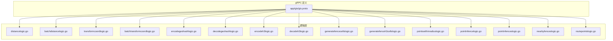
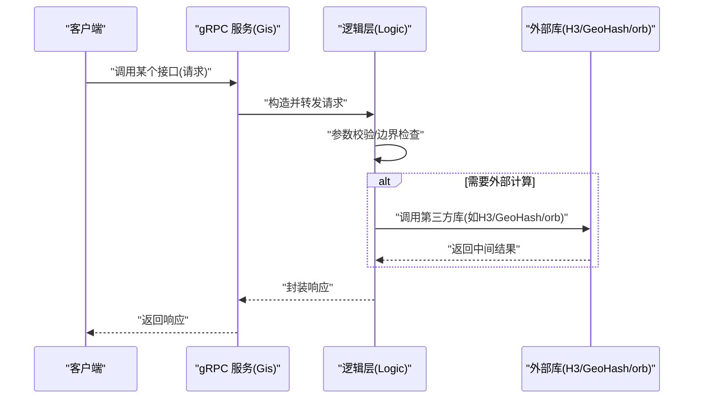
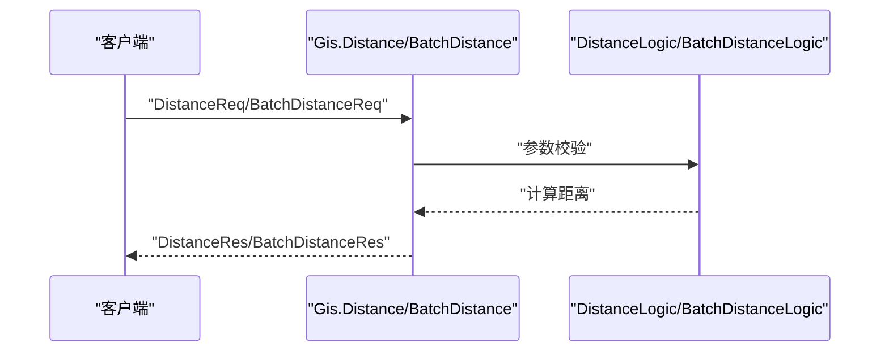
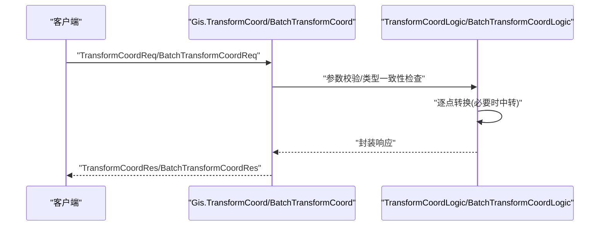
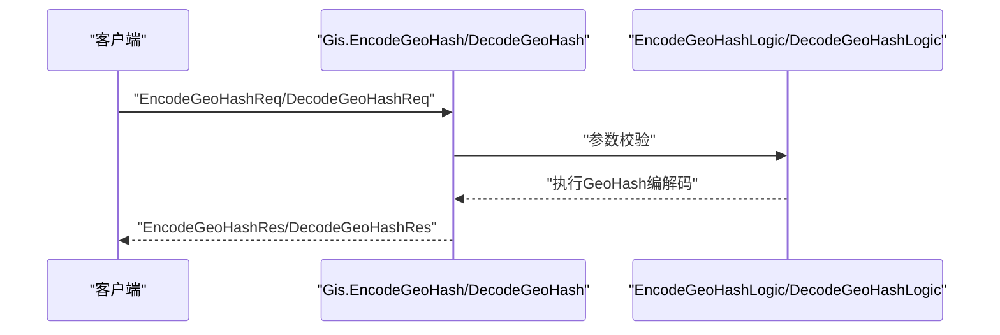
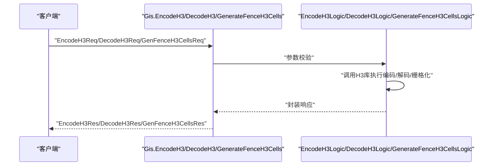
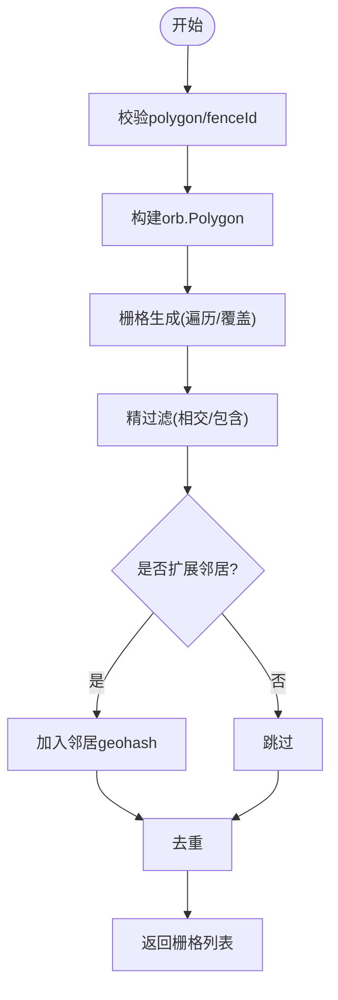
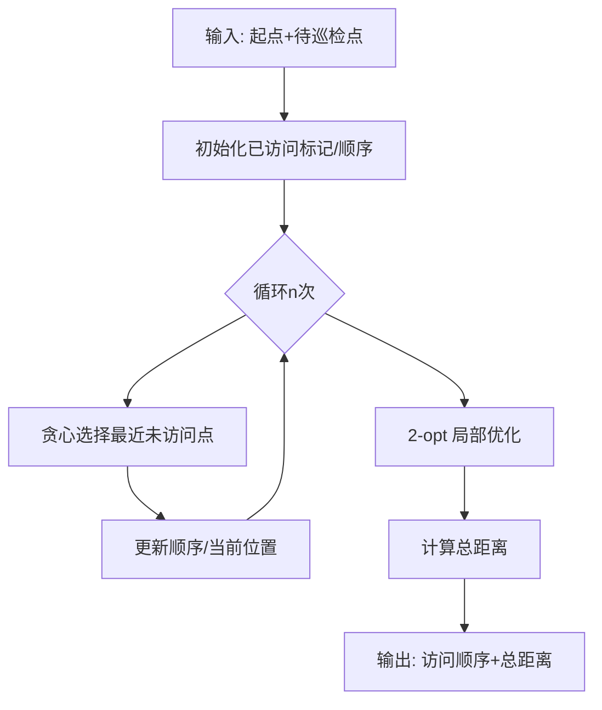
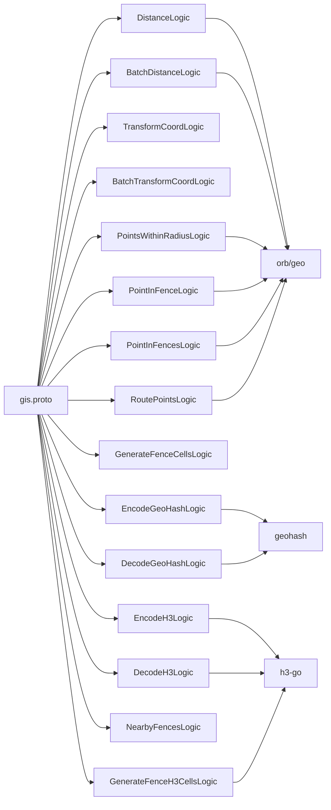

# API接口参考

<cite>
**本文引用的文件**
- [app/gis/gis.proto](file://app/gis/gis.proto)
- [app/gis/internal/logic/distancelogic.go](file://app/gis/internal/logic/distancelogic.go)
- [app/gis/internal/logic/batchdistancelogic.go](file://app/gis/internal/logic/batchdistancelogic.go)
- [app/gis/internal/logic/transformcoordlogic.go](file://app/gis/internal/logic/transformcoordlogic.go)
- [app/gis/internal/logic/batchtransformcoordlogic.go](file://app/gis/internal/logic/batchtransformcoordlogic.go)
- [app/gis/internal/logic/encodegeohashlogic.go](file://app/gis/internal/logic/encodegeohashlogic.go)
- [app/gis/internal/logic/decodegeohashlogic.go](file://app/gis/internal/logic/decodegeohashlogic.go)
- [app/gis/internal/logic/encodeh3logic.go](file://app/gis/internal/logic/encodeh3logic.go)
- [app/gis/internal/logic/decodeh3logic.go](file://app/gis/internal/logic/decodeh3logic.go)
- [app/gis/internal/logic/generatefencecellslogic.go](file://app/gis/internal/logic/generatefencecellslogic.go)
- [app/gis/internal/logic/generatefenceh3cellslogic.go](file://app/gis/internal/logic/generatefenceh3cellslogic.go)
- [app/gis/internal/logic/pointswithinradiuslogic.go](file://app/gis/internal/logic/pointswithinradiuslogic.go)
- [app/gis/internal/logic/pointinfencelogic.go](file://app/gis/internal/logic/pointinfencelogic.go)
- [app/gis/internal/logic/pointinfenceslogic.go](file://app/gis/internal/logic/pointinfenceslogic.go)
- [app/gis/internal/logic/nearbyfenceslogic.go](file://app/gis/internal/logic/nearbyfenceslogic.go)
- [app/gis/internal/logic/routepointslogic.go](file://app/gis/internal/logic/routepointslogic.go)
</cite>

## 目录
1. [简介](#简介)
2. [项目结构](#项目结构)
3. [核心组件](#核心组件)
4. [架构总览](#架构总览)
5. [详细组件分析](#详细组件分析)
6. [依赖关系分析](#依赖关系分析)
7. [性能与并发特性](#性能与并发特性)
8. [故障排查指南](#故障排查指南)
9. [结论](#结论)
10. [附录](#附录)

## 简介
本文件为 GIS 服务 gRPC 接口的完整参考文档，覆盖以下能力域：
- 距离计算接口：支持单点对距离与批量距离计算
- 坐标转换接口：支持单点与批量点的 WGS84、GCJ02、BD09 互转
- 地理围栏接口：支持 GeoHash/H3 小围栏栅格生成、点在围栏内判断、半径内点检索、附近围栏粗过滤
- H3 索引接口：支持 H3 编码/解码、H3 多边形栅格化
- 其他：Ping 健康检查、GeoHash 编解码、最优路径规划

文档提供每个接口的请求/响应字段说明、参数校验规则、错误处理策略、调用示例指引、性能与并发建议、安全与认证注意事项，以及版本兼容与迁移建议。

## 项目结构
GIS 服务采用 go-zero 框架，gRPC 接口定义于 proto 文件，业务逻辑集中在 internal/logic 下按功能模块拆分。

图表来源
- [app/gis/gis.proto](file://app/gis/gis.proto)
- [app/gis/internal/logic/distancelogic.go](file://app/gis/internal/logic/distancelogic.go)
- [app/gis/internal/logic/batchdistancelogic.go](file://app/gis/internal/logic/batchdistancelogic.go)
- [app/gis/internal/logic/transformcoordlogic.go](file://app/gis/internal/logic/transformcoordlogic.go)
- [app/gis/internal/logic/batchtransformcoordlogic.go](file://app/gis/internal/logic/batchtransformcoordlogic.go)
- [app/gis/internal/logic/encodegeohashlogic.go](file://app/gis/internal/logic/encodegeohashlogic.go)
- [app/gis/internal/logic/decodegeohashlogic.go](file://app/gis/internal/logic/decodegeohashlogic.go)
- [app/gis/internal/logic/encodeh3logic.go](file://app/gis/internal/logic/encodeh3logic.go)
- [app/gis/internal/logic/decodeh3logic.go](file://app/gis/internal/logic/decodeh3logic.go)
- [app/gis/internal/logic/generatefencecellslogic.go](file://app/gis/internal/logic/generatefencecellslogic.go)
- [app/gis/internal/logic/generatefenceh3cellslogic.go](file://app/gis/internal/logic/generatefenceh3cellslogic.go)
- [app/gis/internal/logic/pointswithinradiuslogic.go](file://app/gis/internal/logic/pointswithinradiuslogic.go)
- [app/gis/internal/logic/pointinfencelogic.go](file://app/gis/internal/logic/pointinfencelogic.go)
- [app/gis/internal/logic/pointinfenceslogic.go](file://app/gis/internal/logic/pointinfenceslogic.go)
- [app/gis/internal/logic/nearbyfenceslogic.go](file://app/gis/internal/logic/nearbyfenceslogic.go)
- [app/gis/internal/logic/routepointslogic.go](file://app/gis/internal/logic/routepointslogic.go)

章节来源
- [app/gis/gis.proto](file://app/gis/gis.proto)

## 核心组件
- gRPC 服务定义：位于 gis.proto，声明了全部接口与消息体结构
- 业务逻辑层：每个接口对应一个 logic 文件，负责参数校验、调用第三方库（如 H3、GeoHash、orb）执行计算，并返回标准响应
- 数据模型：
  - Point：纬度/经度
  - PointPair：两个点构成的点对
  - Fence：由一组顶点构成的多边形围栏
- 坐标系枚举：WGS84、GCJ02、BD09

章节来源
- [app/gis/gis.proto](file://app/gis/gis.proto)

## 架构总览
gRPC 请求进入后，由框架路由到对应逻辑层，逻辑层进行参数校验与业务计算，最终返回响应。

图表来源
- [app/gis/gis.proto](file://app/gis/gis.proto)
- [app/gis/internal/logic/encodeh3logic.go](file://app/gis/internal/logic/encodeh3logic.go)
- [app/gis/internal/logic/encodegeohashlogic.go](file://app/gis/internal/logic/encodegeohashlogic.go)
- [app/gis/internal/logic/distancelogic.go](file://app/gis/internal/logic/distancelogic.go)

## 详细组件分析

### 距离计算接口

- 接口名称
  - 单点对距离：Distance
  - 批量距离：BatchDistance
- 请求参数
  - DistanceReq：包含两个点 a、b
  - BatchDistanceReq：包含点对列表 pairs
- 返回值
  - DistanceRes：包含两点间距离（单位：米）
  - BatchDistanceRes：包含每对点的距离数组（单位：米）
- 参数校验规则
  - 点位经纬度范围：纬度[-90, 90]，经度[-180, 180]
  - 批量接口 pairs 非空
- 错误处理
  - 参数为空或越界时返回错误
  - 批量接口对单个点对错误会返回带序号的错误信息
- 性能与并发
  - 单次计算为 O(1)，批量按点对数量线性增长
  - 建议控制单次批量大小，避免过长链路延迟
- 调用示例
  - 单点对：请求包含两个点，返回距离（米）
  - 批量：请求包含多个点对，返回对应距离数组

图表来源
- [app/gis/gis.proto](file://app/gis/gis.proto)
- [app/gis/internal/logic/distancelogic.go](file://app/gis/internal/logic/distancelogic.go)
- [app/gis/internal/logic/batchdistancelogic.go](file://app/gis/internal/logic/batchdistancelogic.go)

章节来源
- [app/gis/gis.proto](file://app/gis/gis.proto)
- [app/gis/internal/logic/distancelogic.go](file://app/gis/internal/logic/distancelogic.go)
- [app/gis/internal/logic/batchdistancelogic.go](file://app/gis/internal/logic/batchdistancelogic.go)

### 坐标转换接口

- 接口名称
  - 单点坐标转换：TransformCoord
  - 批量坐标转换：BatchTransformCoord
- 请求参数
  - TransformCoordReq：point、sourceType、targetType
  - BatchTransformCoordReq：points、sourceType、targetType
- 返回值
  - TransformCoordRes：转换后的 point
  - BatchTransformCoordRes：转换后的点列表（与输入顺序一致）
- 参数校验规则
  - point 非空；经纬度范围校验
  - sourceType/targetType 仅允许枚举值：WGS84、GCJ02、BD09
  - 同源同目标类型时直接返回原点
- 错误处理
  - 非法参数返回错误
  - 批量转换中任一点失败会返回带序号的错误
- 实现细节
  - 支持 WGS84↔GCJ02、GCJ02↔BD09、WGS84↔BD09（通过中转）
- 性能与并发
  - 单点转换 O(1)，批量线性
  - 建议批量转换以减少网络往返
- 调用示例
  - 单点：请求包含源点与坐标系类型，返回转换后点
  - 批量：请求包含点列表与坐标系类型，返回等长转换后点列表

图表来源
- [app/gis/gis.proto](file://app/gis/gis.proto)
- [app/gis/internal/logic/transformcoordlogic.go](file://app/gis/internal/logic/transformcoordlogic.go)
- [app/gis/internal/logic/batchtransformcoordlogic.go](file://app/gis/internal/logic/batchtransformcoordlogic.go)

章节来源
- [app/gis/gis.proto](file://app/gis/gis.proto)
- [app/gis/internal/logic/transformcoordlogic.go](file://app/gis/internal/logic/transformcoordlogic.go)
- [app/gis/internal/logic/batchtransformcoordlogic.go](file://app/gis/internal/logic/batchtransformcoordlogic.go)

### GeoHash 编解码接口

- 接口名称
  - 编码：EncodeGeoHash
  - 解码：DecodeGeoHash
- 请求参数
  - EncodeGeoHashReq：point、precision（默认 7，最大 12）
  - DecodeGeoHashReq：geohash
- 返回值
  - EncodeGeoHashRes：geohash 字符串
  - DecodeGeoHashRes：中心点及包围盒（最小/最大纬度/经度）
- 参数校验规则
  - EncodeGeoHashReq.point 非空
  - DecodeGeoHashReq.geohash 非空
- 错误处理
  - 参数为空时返回错误
- 性能与并发
  - 单次编解码 O(1)
- 调用示例
  - 编码：输入点与精度，输出 geohash
  - 解码：输入 geohash，输出中心点与边界

图表来源
- [app/gis/gis.proto](file://app/gis/gis.proto)
- [app/gis/internal/logic/encodegeohashlogic.go](file://app/gis/internal/logic/encodegeohashlogic.go)
- [app/gis/internal/logic/decodegeohashlogic.go](file://app/gis/internal/logic/decodegeohashlogic.go)

章节来源
- [app/gis/gis.proto](file://app/gis/gis.proto)
- [app/gis/internal/logic/encodegeohashlogic.go](file://app/gis/internal/logic/encodegeohashlogic.go)
- [app/gis/internal/logic/decodegeohashlogic.go](file://app/gis/internal/logic/decodegeohashlogic.go)

### H3 索引接口

- 接口名称
  - 编码：EncodeH3
  - 解码：DecodeH3
  - 围栏栅格生成：GenerateFenceH3Cells
- 请求参数
  - EncodeH3Req：point、resolution（0-15，默认 9）
  - DecodeH3Req：h3Index
  - GenFenceH3CellsReq：polygon 或 fenceId、resolution
- 返回值
  - EncodeH3Res：h3Index 字符串
  - DecodeH3Res：中心点与边界顶点
  - GenFenceH3CellsRes：H3 索引字符串列表
- 参数校验规则
  - EncodeH3.resolution 在 0-15
  - DecodeH3.h3Index 非空
  - GenerateFenceH3Cells.resolution 默认 9，范围 0-15
  - polygon 至少三点且闭合
- 错误处理
  - 参数非法返回错误
  - fenceId 加载逻辑未实现时返回错误
- 性能与并发
  - 编解码 O(1)
  - 围栏栅格生成复杂度取决于多边形面积与分辨率
- 调用示例
  - 编码：输入点与分辨率，输出 H3 索引
  - 解码：输入 H3 索引，输出中心点与边界
  - 围栏栅格：输入多边形与分辨率，输出覆盖的 H3 索引列表

图表来源
- [app/gis/gis.proto](file://app/gis/gis.proto)
- [app/gis/internal/logic/encodeh3logic.go](file://app/gis/internal/logic/encodeh3logic.go)
- [app/gis/internal/logic/decodeh3logic.go](file://app/gis/internal/logic/decodeh3logic.go)
- [app/gis/internal/logic/generatefenceh3cellslogic.go](file://app/gis/internal/logic/generatefenceh3cellslogic.go)

章节来源
- [app/gis/gis.proto](file://app/gis/gis.proto)
- [app/gis/internal/logic/encodeh3logic.go](file://app/gis/internal/logic/encodeh3logic.go)
- [app/gis/internal/logic/decodeh3logic.go](file://app/gis/internal/logic/decodeh3logic.go)
- [app/gis/internal/logic/generatefenceh3cellslogic.go](file://app/gis/internal/logic/generatefenceh3cellslogic.go)

### 地理围栏与栅格生成接口

- 接口名称
  - 小围栏栅格生成（GeoHash）：GenerateFenceCells
  - 小围栏栅格生成（H3）：GenerateFenceH3Cells
  - 半径内点：PointsWithinRadius
  - 点是否命中围栏（单围栏）：PointInFence
  - 点是否命中围栏（多围栏）：PointInFences
  - 附近围栏粗过滤：NearbyFences
- 请求参数
  - GenFenceCellsReq：polygon 或 fenceId、precision（默认 9）、includeNeighbors
  - GenFenceH3CellsReq：polygon 或 fenceId、resolution（默认 9）
  - PointsWithinRadiusReq：center、points、radiusMeters
  - PointInFenceReq：point、fence（polygon 或 fenceId）
  - PointInFencesReq：point、fences
  - NearbyFencesReq：point、km
- 返回值
  - GenFenceCellsRes：去重后的 geohash 前缀列表
  - GenFenceH3CellsRes：去重后的 H3 索引列表
  - PointsWithinRadiusRes：命中点在输入列表中的索引数组
  - PointInFenceRes：命中布尔值
  - PointInFencesRes：命中围栏 ID 列表
  - NearbyFencesRes：围栏 ID 列表（预留）
- 参数校验规则
  - polygon 至少三点且闭合
  - precision/resolution 合法范围
  - 半径内点接口对中心点与点列表进行经纬度范围校验
  - 点在围栏接口要求提供 polygon 或 fenceId
- 错误处理
  - fenceId 加载逻辑未实现时返回错误
  - polygon 构建失败返回错误
- 性能与并发
  - GeoHash 栅格生成基于边界框遍历，includeNeighbors 会扩大计算量
  - H3 栅格生成依赖多边形到 H3 的覆盖算法
  - 半径内点为 O(n)
  - 点在围栏为 O(n)（多围栏）
- 调用示例
  - GeoHash 围栏栅格：输入多边形与精度，输出 geohash 列表（可选扩展邻居）
  - H3 围栏栅格：输入多边形与分辨率，输出 H3 索引列表
  - 半径内点：输入中心点、点列表与半径，输出命中索引
  - 点在围栏：输入点与围栏，输出命中与否或多围栏命中 ID 列表

图表来源
- [app/gis/gis.proto](file://app/gis/gis.proto)
- [app/gis/internal/logic/generatefencecellslogic.go](file://app/gis/internal/logic/generatefencecellslogic.go)
- [app/gis/internal/logic/generatefenceh3cellslogic.go](file://app/gis/internal/logic/generatefenceh3cellslogic.go)

章节来源
- [app/gis/gis.proto](file://app/gis/gis.proto)
- [app/gis/internal/logic/generatefencecellslogic.go](file://app/gis/internal/logic/generatefencecellslogic.go)
- [app/gis/internal/logic/generatefenceh3cellslogic.go](file://app/gis/internal/logic/generatefenceh3cellslogic.go)
- [app/gis/internal/logic/pointswithinradiuslogic.go](file://app/gis/internal/logic/pointswithinradiuslogic.go)
- [app/gis/internal/logic/pointinfencelogic.go](file://app/gis/internal/logic/pointinfencelogic.go)
- [app/gis/internal/logic/pointinfenceslogic.go](file://app/gis/internal/logic/pointinfenceslogic.go)
- [app/gis/internal/logic/nearbyfenceslogic.go](file://app/gis/internal/logic/nearbyfenceslogic.go)

### 最优路径规划接口

- 接口名称
  - RoutePoints：给定起点与待巡检点集合，返回访问顺序与总距离
- 请求参数
  - RoutePointsReq：start、points
- 返回值
  - RoutePointsRes：visitOrder（按索引顺序）、totalDistanceMeters
- 参数校验规则
  - 起点与点集经纬度范围校验
- 实现细节
  - 贪心算法生成初始顺序，随后使用 2-opt 进行局部优化
- 性能与并发
  - 时间复杂度近似 O(n^2)（贪心）+ 局部优化开销
  - 建议控制点数量，避免大规模优化带来的延迟
- 调用示例
  - 输入起点与点列表，输出访问顺序与总距离（米）

图表来源
- [app/gis/gis.proto](file://app/gis/gis.proto)
- [app/gis/internal/logic/routepointslogic.go](file://app/gis/internal/logic/routepointslogic.go)

章节来源
- [app/gis/gis.proto](file://app/gis/gis.proto)
- [app/gis/internal/logic/routepointslogic.go](file://app/gis/internal/logic/routepointslogic.go)

## 依赖关系分析

图表来源
- [app/gis/gis.proto](file://app/gis/gis.proto)
- [app/gis/internal/logic/distancelogic.go](file://app/gis/internal/logic/distancelogic.go)
- [app/gis/internal/logic/batchdistancelogic.go](file://app/gis/internal/logic/batchdistancelogic.go)
- [app/gis/internal/logic/transformcoordlogic.go](file://app/gis/internal/logic/transformcoordlogic.go)
- [app/gis/internal/logic/batchtransformcoordlogic.go](file://app/gis/internal/logic/batchtransformcoordlogic.go)
- [app/gis/internal/logic/encodegeohashlogic.go](file://app/gis/internal/logic/encodegeohashlogic.go)
- [app/gis/internal/logic/decodegeohashlogic.go](file://app/gis/internal/logic/decodegeohashlogic.go)
- [app/gis/internal/logic/encodeh3logic.go](file://app/gis/internal/logic/encodeh3logic.go)
- [app/gis/internal/logic/decodeh3logic.go](file://app/gis/internal/logic/decodeh3logic.go)
- [app/gis/internal/logic/generatefencecellslogic.go](file://app/gis/internal/logic/generatefencecellslogic.go)
- [app/gis/internal/logic/generatefenceh3cellslogic.go](file://app/gis/internal/logic/generatefenceh3cellslogic.go)
- [app/gis/internal/logic/pointswithinradiuslogic.go](file://app/gis/internal/logic/pointswithinradiuslogic.go)
- [app/gis/internal/logic/pointinfencelogic.go](file://app/gis/internal/logic/pointinfencelogic.go)
- [app/gis/internal/logic/pointinfenceslogic.go](file://app/gis/internal/logic/pointinfenceslogic.go)
- [app/gis/internal/logic/nearbyfenceslogic.go](file://app/gis/internal/logic/nearbyfenceslogic.go)
- [app/gis/internal/logic/routepointslogic.go](file://app/gis/internal/logic/routepointslogic.go)

章节来源
- [app/gis/gis.proto](file://app/gis/gis.proto)

## 性能与并发特性
- 单次计算复杂度
  - 距离/批量距离：O(1)/O(n)
  - GeoHash 编解码：O(1)
  - H3 编解码：O(1)
  - H3 围栏栅格：取决于多边形面积与分辨率
  - GeoHash 围栏栅格：网格遍历与相交判断
  - 半径内点：O(n)
  - 点在围栏：O(n)
  - 最优路径：近似 O(n^2)（贪心+2-opt）
- 并发与超时
  - 未在代码中显式配置 gRPC 超时与并发限制，建议在网关/客户端侧设置合理超时与限流策略
  - 批量接口建议分批调用，避免单次请求过大
- 建议
  - 对于大批量坐标转换与栅格生成，优先使用批量接口
  - 对于高并发场景，建议引入本地缓存（如围栏多边形）与异步处理

## 故障排查指南
- 常见错误与定位
  - 参数为空或越界：检查经纬度范围与必填字段
  - 坐标系类型非法：确认枚举值范围
  - GeoHash/H3 参数非法：检查精度/分辨率范围
  - 围栏 polygon 构建失败：确保至少三点且闭合
  - fenceId 加载逻辑未实现：需补充数据源或使用 polygon
- 日志与可观测性
  - 逻辑层普遍记录错误日志，便于定位问题
- 修复建议
  - 补充数据源（如多边形围栏）或直接传 polygon
  - 控制批量规模，分批调用
  - 对高耗时操作（如最优路径）设置超时与降级

章节来源
- [app/gis/internal/logic/distancelogic.go](file://app/gis/internal/logic/distancelogic.go)
- [app/gis/internal/logic/transformcoordlogic.go](file://app/gis/internal/logic/transformcoordlogic.go)
- [app/gis/internal/logic/encodeh3logic.go](file://app/gis/internal/logic/encodeh3logic.go)
- [app/gis/internal/logic/generatefencecellslogic.go](file://app/gis/internal/logic/generatefencecellslogic.go)
- [app/gis/internal/logic/generatefenceh3cellslogic.go](file://app/gis/internal/logic/generatefenceh3cellslogic.go)
- [app/gis/internal/logic/pointinfencelogic.go](file://app/gis/internal/logic/pointinfencelogic.go)
- [app/gis/internal/logic/nearbyfenceslogic.go](file://app/gis/internal/logic/nearbyfenceslogic.go)

## 结论
本 GIS 服务提供了覆盖距离计算、坐标转换、围栏栅格生成、H3 索引与路径规划的完整 gRPC 能力集。接口设计清晰，参数校验严格，逻辑层职责明确。建议在生产环境中结合批量接口、缓存与限流策略，以获得稳定与高性能的服务体验。

## 附录

### 接口清单与字段说明

- 通用对象
  - Point：纬度 lat、经度 lon
  - PointPair：a、b（两个 Point）
  - Fence：id、points（polygon）
- 通用请求/响应
  - Req/Res：健康检查用
- 距离计算
  - Distance：请求包含 a、b；响应包含 meters
  - BatchDistance：请求包含 pairs；响应包含 meters 数组
- 坐标转换
  - TransformCoord：请求包含 point、sourceType、targetType；响应包含 transformedPoint
  - BatchTransformCoord：请求包含 points、sourceType、targetType；响应包含 transformedPoints
- GeoHash
  - EncodeGeoHash：请求包含 point、precision；响应包含 geohash
  - DecodeGeoHash：请求包含 geohash；响应包含中心点与边界
- H3
  - EncodeH3：请求包含 point、resolution；响应包含 h3Index
  - DecodeH3：请求包含 h3Index；响应包含中心点与边界顶点
  - GenerateFenceH3Cells：请求包含 polygon 或 fenceId、resolution；响应包含 h3Indexes
- 围栏与栅格
  - GenerateFenceCells：请求包含 polygon 或 fenceId、precision、includeNeighbors；响应包含 geohashes
  - PointsWithinRadius：请求包含 center、points、radiusMeters；响应包含 hitIndexes
  - PointInFence：请求包含 point、fence；响应包含 hit
  - PointInFences：请求包含 point、fences；响应包含 hitFenceIds
  - NearbyFences：请求包含 point、km；响应包含 fenceIds（预留）
- 路径规划
  - RoutePoints：请求包含 start、points；响应包含 visitOrder、totalDistanceMeters

章节来源
- [app/gis/gis.proto](file://app/gis/gis.proto)

### 客户端 SDK 使用指南
- 生成与导入
  - 使用 protoc 与 go 插件生成 gRPC 客户端代码
  - 在客户端工程中导入生成的 go 包
- 认证与安全
  - 本仓库未内置认证/鉴权逻辑，建议在网关或客户端侧实现 Token/签名/双向 TLS 等安全措施
- 调用流程
  - 初始化 gRPC 连接
  - 构造请求对象（注意参数校验）
  - 发送请求并处理响应与错误
  - 对高耗时接口设置超时与重试策略

### 认证机制与安全考虑
- 当前未发现内置认证/鉴权实现
- 建议
  - 引入网关层统一鉴权
  - 对敏感接口启用传输加密与访问控制
  - 对批量与高耗时接口实施限流与熔断

### 版本兼容性与迁移指南
- 接口演进
  - 新增字段建议保持向后兼容，避免破坏现有客户端
  - 删除或变更字段需配合版本号管理与灰度发布
- 迁移建议
  - 对批量接口优先采用现有 Batch* 方法，避免多次往返
  - 对围栏栅格生成，根据精度/分辨率需求选择 GeoHash 或 H3，评估性能差异